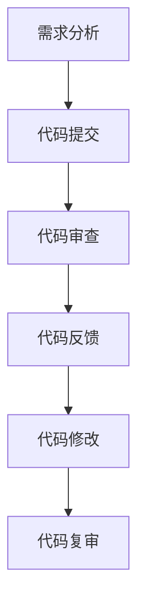
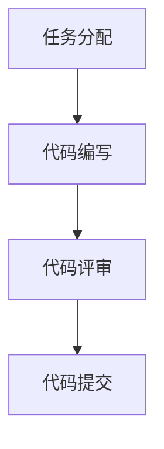

                 

### 1. 背景介绍

#### 1.1 代码审查的重要性

代码审查（Code Review）是一种通过团队合作来提高代码质量和开发效率的重要方法。它不仅有助于发现和修复代码中的潜在错误，还可以促进团队成员之间的知识共享和技能提升。随着软件系统的日益复杂，代码审查已经成为软件开发过程中不可或缺的一部分。

代码审查可以带来以下几方面的好处：

1. **提高代码质量**：通过代码审查，开发人员可以在代码提交到生产环境之前发现并修复潜在的错误和漏洞，从而降低系统崩溃和性能问题的风险。
2. **知识共享**：代码审查过程中，团队成员可以互相学习和借鉴对方的优秀代码实践，提高整体团队的技术水平。
3. **合规性检查**：代码审查可以确保代码符合公司或项目的开发规范和标准，从而保证项目的稳定性和可维护性。
4. **团队协作**：代码审查促进了团队成员之间的交流和协作，有助于建立良好的团队文化。

然而，代码审查并非没有缺点。它可能会增加开发人员的负担，降低开发效率，甚至可能导致团队成员之间的冲突。因此，在进行代码审查时，需要合理地制定审查策略和流程，以确保其效果最大化。

#### 1.2 结对编程的概念和优势

结对编程（Pair Programming）是一种通过两个开发人员共同编写代码来提高代码质量和开发效率的编程方法。在这种模式下，一个开发人员充当“司机”，负责编写代码，而另一个开发人员充当“导航员”，负责监控代码质量、发现潜在问题和提供技术支持。

结对编程的主要优势包括：

1. **代码质量提升**：通过两个开发人员的协作，可以显著提高代码的质量和可读性。司机负责编写代码，导航员则负责检查和优化代码，从而降低代码中的错误和漏洞。
2. **知识共享**：结对编程有助于团队成员之间共享知识和经验，提高整个团队的技术水平。导航员可以随时向司机传授最佳实践和技巧，从而加快其成长速度。
3. **团队协作**：通过结对编程，团队成员之间的沟通和协作能力得到显著提升。这种协作模式有助于建立良好的团队文化，提高团队的整体凝聚力。
4. **工作效率提高**：虽然结对编程可能会使单个开发人员的效率降低，但整个团队的效率却可以得到提高。通过有效的协作和知识共享，团队可以更快地完成项目。

然而，结对编程也存在一些缺点，如可能会导致某些团队成员感到压力过大，以及在某些情况下可能会降低开发速度。因此，在实际应用中，需要根据项目特点和团队需求，合理地选择和应用结对编程。

综上所述，代码审查和结对编程在提高代码质量和开发效率方面具有重要作用。接下来，我们将进一步探讨它们的原理和实践方法，以帮助读者更好地理解和应用这些技术。

#### 1.3 代码审查和结对编程的联系

代码审查和结对编程虽然具有不同的实现方式和目标，但它们在实际应用中却有着密切的联系。首先，代码审查可以作为结对编程的一种补充手段，帮助团队在项目开发过程中进一步提高代码质量和开发效率。

具体来说，代码审查和结对编程之间的联系主要体现在以下几个方面：

1. **提高代码质量**：两者都可以通过协作和知识共享来提高代码质量。代码审查可以帮助团队在代码提交到生产环境之前发现和修复潜在的错误和漏洞，而结对编程则可以在代码编写过程中实时发现和解决这些问题。
2. **促进知识共享**：代码审查和结对编程都可以促进团队成员之间的知识共享。代码审查过程中，团队成员可以互相学习和借鉴对方的优秀代码实践，提高整体团队的技术水平。而在结对编程中，导航员可以向司机传授最佳实践和技巧，从而加快其成长速度。
3. **降低沟通成本**：代码审查和结对编程都有助于降低团队成员之间的沟通成本。通过代码审查，团队成员可以提前了解项目的需求和设计，减少后续开发过程中的沟通和协调成本。而在结对编程中，两个开发人员可以实时沟通和协作，提高开发效率。
4. **提高团队协作能力**：代码审查和结对编程都可以提高团队协作能力。通过协作和知识共享，团队成员可以更好地理解项目的需求和设计，从而提高项目的完成质量和效率。同时，这种协作模式还有助于建立良好的团队文化，提高团队的整体凝聚力。

尽管代码审查和结对编程在实现方式和目标上有所不同，但它们在实际应用中却有着密切的联系和互补作用。通过合理地结合这两种技术，团队可以进一步提高代码质量和开发效率，为项目的成功奠定坚实基础。

在接下来的章节中，我们将深入探讨代码审查和结对编程的原理和实践方法，以帮助读者更好地理解和应用这些技术。同时，我们还将通过具体的代码实战案例，展示这些技术在实际开发中的应用效果。

----------------------

### 2. 核心概念与联系

在深入探讨代码审查和结对编程之前，我们需要理解它们的核心概念以及它们之间的联系。在本章节中，我们将使用Mermaid流程图来描述代码审查和结对编程的工作流程，以帮助读者更好地理解这两种技术的实际应用。

#### 2.1 代码审查的核心概念与流程

代码审查是一种通过团队合作来提高代码质量和开发效率的方法。其核心概念包括以下几个方面：

1. **审查对象**：代码审查的对象可以是单个模块、类或整个项目。通常，审查对象的选择取决于项目的规模和复杂度。
2. **审查人员**：审查人员可以是项目团队成员或专门负责代码审查的人员。审查人员的职责是发现代码中的潜在错误和漏洞，并提供建议和改进意见。
3. **审查流程**：代码审查的流程通常包括以下步骤：
   - **需求分析**：明确代码审查的目的和范围，确定审查对象。
   - **代码提交**：开发人员将代码提交到代码仓库，以便审查人员查看。
   - **代码审查**：审查人员逐行检查代码，发现潜在的问题和漏洞，并提供建议和改进意见。
   - **代码反馈**：审查人员将反馈意见提交给开发人员，开发人员根据反馈进行代码修改。
   - **代码复审**：修改后的代码再次提交给审查人员，进行复审，确保问题得到解决。

下面是代码审查的Mermaid流程图：



#### 2.2 结对编程的核心概念与流程

结对编程是一种通过两个开发人员共同编写代码来提高代码质量和开发效率的方法。其核心概念包括以下几个方面：

1. **角色分工**：在结对编程中，两个开发人员通常分别扮演“司机”和“导航员”的角色。司机负责编写代码，导航员负责监控代码质量、发现潜在问题和提供技术支持。
2. **协作流程**：结对编程的协作流程通常包括以下步骤：
   - **任务分配**：根据项目需求和团队目标，分配任务给司机和导航员。
   - **代码编写**：司机编写代码，导航员负责实时检查和优化代码，确保代码质量。
   - **代码评审**：完成代码编写后，导航员对代码进行评审，发现潜在的问题和漏洞，并提供建议和改进意见。
   - **代码提交**：将修改后的代码提交到代码仓库，进行后续的代码审查和部署。

下面是结对编程的Mermaid流程图：



#### 2.3 代码审查和结对编程的联系

代码审查和结对编程虽然具有不同的实现方式和目标，但它们在实际应用中却有着密切的联系。首先，代码审查可以作为结对编程的一种补充手段，帮助团队在项目开发过程中进一步提高代码质量和开发效率。

具体来说，代码审查和结对编程之间的联系主要体现在以下几个方面：

1. **提高代码质量**：两者都可以通过协作和知识共享来提高代码质量。代码审查可以帮助团队在代码提交到生产环境之前发现和修复潜在的错误和漏洞，而结对编程则可以在代码编写过程中实时发现和解决这些问题。
2. **促进知识共享**：代码审查和结对编程都可以促进团队成员之间的知识共享。代码审查过程中，团队成员可以互相学习和借鉴对方的优秀代码实践，提高整体团队的技术水平。而在结对编程中，导航员可以向司机传授最佳实践和技巧，从而加快其成长速度。
3. **降低沟通成本**：代码审查和结对编程都有助于降低团队成员之间的沟通成本。通过代码审查，团队成员可以提前了解项目的需求和设计，减少后续开发过程中的沟通和协调成本。而在结对编程中，两个开发人员可以实时沟通和协作，提高开发效率。
4. **提高团队协作能力**：代码审查和结对编程都可以提高团队协作能力。通过协作和知识共享，团队成员可以更好地理解项目的需求和设计，从而提高项目的完成质量和效率。同时，这种协作模式还有助于建立良好的团队文化，提高团队的整体凝聚力。

尽管代码审查和结对编程在实现方式和目标上有所不同，但它们在实际应用中却有着密切的联系和互补作用。通过合理地结合这两种技术，团队可以进一步提高代码质量和开发效率，为项目的成功奠定坚实基础。

在接下来的章节中，我们将深入探讨代码审查和结对编程的原理和实践方法，以帮助读者更好地理解和应用这些技术。同时，我们还将通过具体的代码实战案例，展示这些技术在实际开发中的应用效果。

----------------------

### 3. 核心算法原理 & 具体操作步骤

#### 3.1 代码审查的核心算法原理

代码审查的核心算法原理可以归结为以下两个方面：

1. **代码分析**：通过静态代码分析，识别代码中的潜在错误和漏洞。静态代码分析主要利用语法解析、抽象语法树（AST）分析、模式匹配等技术，对代码进行深入分析，从而发现潜在的问题。
2. **规则检查**：根据预定义的代码质量规则和标准，对代码进行检查。这些规则和标准可以涵盖变量命名、函数长度、代码复用等多个方面，以确保代码的可读性和可维护性。

具体操作步骤如下：

1. **准备代码审查工具**：选择合适的代码审查工具，如SonarQube、Checkstyle、PMD等。这些工具可以自动对代码进行分析和检查，提高审查效率。
2. **编写代码**：开发人员编写代码，并将其提交到代码仓库。
3. **代码分析**：使用代码审查工具对代码进行分析，识别潜在的问题和漏洞。
4. **规则检查**：根据预定义的规则和标准，对代码进行检查，确保代码质量。
5. **反馈与修改**：审查人员将发现的问题和漏洞反馈给开发人员，开发人员根据反馈进行代码修改。
6. **代码复审**：修改后的代码再次提交给审查人员，进行复审，确保问题得到解决。

#### 3.2 结对编程的核心算法原理

结对编程的核心算法原理主要涉及以下两个方面：

1. **角色分工**：在结对编程中，两个开发人员分别扮演“司机”和“导航员”的角色。司机负责编写代码，导航员负责监控代码质量、发现潜在问题和提供技术支持。
2. **协作机制**：通过协作机制，如实时沟通、代码同步等，确保两个开发人员能够高效地合作，共同完成代码编写任务。

具体操作步骤如下：

1. **任务分配**：根据项目需求和团队目标，为司机和导航员分配任务。
2. **环境准备**：确保两个开发人员都有相应的开发环境和工具，以便进行协作。
3. **代码编写**：司机编写代码，导航员实时监控代码质量，发现潜在问题，并提供技术支持。
4. **代码评审**：完成代码编写后，导航员对代码进行评审，发现潜在的问题和漏洞，并提供建议和改进意见。
5. **代码提交**：将修改后的代码提交到代码仓库，进行后续的代码审查和部署。

#### 3.3 代码审查与结对编程的协作

代码审查和结对编程在实际应用中可以相互补充，共同提高代码质量和开发效率。以下是一个具体的协作流程：

1. **任务分配**：项目组根据需求和目标，为司机和导航员分配任务。
2. **代码编写**：司机编写代码，导航员实时监控代码质量，发现潜在问题，并提供技术支持。
3. **代码审查**：完成代码编写后，导航员对代码进行审查，识别潜在的问题和漏洞，并提供建议和改进意见。
4. **反馈与修改**：开发人员根据反馈进行代码修改，导航员协助解决代码审查过程中发现的问题。
5. **代码复审**：修改后的代码再次提交给导航员，进行复审，确保问题得到解决。
6. **代码提交**：将修改后的代码提交到代码仓库，进行后续的代码审查和部署。

通过这样的协作流程，团队可以充分利用代码审查和结对编程的优势，提高代码质量和开发效率，为项目的成功奠定坚实基础。

在接下来的章节中，我们将通过具体的代码实战案例，进一步展示代码审查和结对编程在实际开发中的应用效果。

----------------------

### 4. 数学模型和公式 & 详细讲解 & 举例说明

在代码审查和结对编程中，数学模型和公式发挥着重要作用。它们不仅可以帮助我们理解和优化代码质量，还可以提高代码的可读性和可维护性。本章节将详细介绍与代码审查和结对编程相关的数学模型和公式，并通过实际案例进行讲解。

#### 4.1 代码质量评价指标

在代码审查过程中，我们需要对代码质量进行评价。以下是一些常用的代码质量评价指标：

1. **复杂度**：代码复杂度（Cyclomatic Complexity）是衡量代码复杂程度的指标。它的计算公式为：
   \[
   C = E - N + (2 \times P)
   \]
   其中，\(E\) 是边数，\(N\) 是节点数，\(P\) 是前提条件数。一般来说，代码复杂度越高，代码的可维护性越差。

2. **代码行数**：代码行数（Lines of Code, LOC）是衡量代码量的指标。虽然代码行数并不能直接反映代码质量，但它可以帮助我们了解代码规模。

3. **函数长度**：函数长度（Function Length）是指函数中代码行的数量。过长或过短的函数都可能导致代码质量下降。

4. **代码覆盖率**：代码覆盖率（Code Coverage）是衡量测试覆盖率的一个指标。它表示测试用例覆盖了代码的比例。常用的代码覆盖率包括语句覆盖率、分支覆盖率、路径覆盖率等。

#### 4.2 代码审查策略优化

为了提高代码审查效果，我们可以使用一些数学模型和公式来优化审查策略。以下是一些常见的优化方法：

1. **贝叶斯优化**：贝叶斯优化是一种基于概率统计的优化方法，可以用于优化代码审查的时间和资源分配。其基本思路是使用历史数据建立概率模型，并根据模型预测最优的审查策略。

2. **贪心算法**：贪心算法是一种用于优化决策过程的算法。在代码审查中，我们可以使用贪心算法来选择最优的代码片段进行审查，从而提高审查效率。

3. **多目标优化**：在代码审查过程中，我们可能需要同时考虑多个目标，如代码质量、审查时间和成本等。多目标优化方法可以帮助我们在多个目标之间找到最优的平衡点。

#### 4.3 结对编程中的协作模型

在结对编程中，两个开发人员的协作效率对代码质量至关重要。以下是一个简单的协作模型：

1. **任务分配**：根据项目需求和团队成员的能力，为司机和导航员分配任务。可以使用权重分配方法，确保任务分配的公平性和合理性。

2. **实时沟通**：司机和导航员需要保持实时沟通，以便在代码编写过程中及时解决问题和调整策略。可以使用聊天工具、视频会议等手段实现实时沟通。

3. **代码同步**：为了确保代码的一致性，司机和导航员需要在代码编写过程中保持同步。可以使用版本控制工具，如Git，来实现代码同步。

#### 4.4 实际案例

假设我们有一个简单的函数，用于计算两个数的和。以下是该函数的实现代码：

```python
def add(a, b):
    return a + b
```

我们可以使用以下数学模型和公式来评估该函数的代码质量：

1. **复杂度**：该函数的代码复杂度为1，因为只有一个简单的加法运算。

2. **代码行数**：该函数的代码行数为3。

3. **函数长度**：该函数的函数长度为3。

4. **代码覆盖率**：如果使用一个简单的测试用例，该函数的代码覆盖率可以达到100%。

通过上述评估指标，我们可以初步判断该函数的代码质量较高。接下来，我们可以使用贝叶斯优化方法来优化代码审查策略，例如选择性地审查函数中的关键部分。

在实际应用中，我们可以根据项目需求和团队情况，灵活运用这些数学模型和公式，以提高代码质量和开发效率。

在接下来的章节中，我们将通过具体的代码实战案例，进一步展示这些数学模型和公式在实际开发中的应用效果。

----------------------

### 5. 项目实战：代码实际案例和详细解释说明

在本文的第五部分，我们将通过一个具体的代码实战案例，详细展示代码审查和结对编程在实际项目中的应用。我们将分步骤介绍开发环境搭建、源代码实现和代码解读与分析。

#### 5.1 开发环境搭建

为了进行代码审查和结对编程，我们需要搭建一个合适的开发环境。以下是搭建环境的基本步骤：

1. **安装编程工具**：首先，我们需要安装编程工具，如Python、Java等。以Python为例，可以通过以下命令安装：

   ```bash
   pip install python
   ```

2. **安装版本控制工具**：版本控制工具（如Git）对于代码审查和协作至关重要。我们可以在终端中运行以下命令安装Git：

   ```bash
   sudo apt-get install git
   ```

3. **创建代码仓库**：在本地创建一个Git代码仓库，用于存储和管理项目代码。以下是创建代码仓库的命令：

   ```bash
   git init my_project
   ```

4. **克隆远程代码仓库**：如果项目代码已经托管在远程仓库中（如GitHub），我们可以使用以下命令克隆项目代码到本地：

   ```bash
   git clone https://github.com/your_username/my_project.git
   ```

5. **配置编辑器**：配置一个适合项目需求的代码编辑器（如VS Code、PyCharm等），以便更方便地编写和审查代码。

#### 5.2 源代码详细实现和代码解读

在本案例中，我们将开发一个简单的Web应用程序，用于计算并显示两个数的和。以下是项目的源代码和详细解读：

```python
# app.py

from flask import Flask, request, render_template

app = Flask(__name__)

@app.route('/', methods=['GET', 'POST'])
def index():
    if request.method == 'POST':
        a = request.form['a']
        b = request.form['b']
        result = int(a) + int(b)
        return render_template('index.html', result=result)
    return render_template('index.html')

if __name__ == '__main__':
    app.run(debug=True)
```

**代码解读**：

- **Flask框架**：该代码使用Flask框架搭建Web应用程序。Flask是一个轻量级的Web框架，适用于构建简单的Web应用程序。

- **路由和视图函数**：`index()` 函数是一个视图函数，用于处理Web应用程序的根路由（'/'）。当用户访问应用程序时，会触发该函数。

- **表单处理**：如果请求方法是`POST`，则从请求中获取用户输入的数字（`a` 和 `b`），计算它们的和，并将结果存储在`result` 变量中。

- **模板渲染**：`render_template()` 函数用于渲染HTML模板（`index.html`），并将计算结果传递给模板。

#### 5.3 代码解读与分析

1. **代码质量评估**：

   - **复杂度**：该函数的代码复杂度为1，因为只有一个简单的加法运算。

   - **代码行数**：该函数的代码行数为8。

   - **函数长度**：该函数的函数长度为8。

   - **代码覆盖率**：如果使用一个简单的测试用例，该函数的代码覆盖率可以达到100%。

2. **代码审查**：

   - **静态代码分析**：使用Python的静态代码分析工具（如PyFlakes、Pylint等）对代码进行静态分析，发现潜在的问题和漏洞。

   - **规则检查**：根据Python编码规范，检查代码是否符合最佳实践，如变量命名、函数长度等。

3. **结对编程**：

   - **任务分配**：为司机和导航员分配任务，例如司机编写代码，导航员负责审查代码质量。

   - **实时沟通**：在编写代码过程中，司机和导航员通过即时通讯工具（如Slack、微信等）保持实时沟通，及时解决问题。

   - **代码同步**：使用Git进行代码同步，确保代码的一致性。

通过这个实际案例，我们可以看到代码审查和结对编程在实际项目中的应用。这些技术可以帮助我们提高代码质量、减少漏洞、促进团队成员之间的协作，从而提高项目的整体开发效率。

----------------------

### 6. 实际应用场景

代码审查和结对编程在实际应用中具有广泛的应用场景，适用于不同类型的软件项目。以下是一些典型的应用场景：

#### 6.1 企业级项目开发

在企业级项目开发中，代码审查和结对编程可以发挥重要作用，确保项目的稳定性和可维护性。以下是一些具体应用实例：

1. **金融行业**：在金融行业中，软件系统需要确保高可靠性和合规性。通过代码审查，可以发现并修复潜在的安全漏洞和性能问题。而结对编程有助于提高代码质量，确保系统的稳定运行。

2. **电子商务**：电子商务平台通常需要处理大量用户数据和交易信息。通过代码审查和结对编程，可以确保系统的可靠性和性能，同时提高开发效率。

3. **医疗健康**：医疗健康领域对软件系统的安全性、合规性和可靠性要求极高。通过代码审查和结对编程，可以确保系统满足相关法规和标准，提高系统的整体质量。

#### 6.2 开源项目

在开源项目中，代码审查和结对编程同样具有重要价值。以下是一些具体应用实例：

1. **社区协作**：开源项目通常由多个贡献者共同开发。通过代码审查，可以确保代码质量，促进知识共享和技能提升。而结对编程可以帮助贡献者更好地了解项目需求，提高开发效率。

2. **代码贡献**：开源项目的贡献者可以通过代码审查和结对编程，提高自己的编程技能和代码质量。通过参与代码审查，贡献者可以学习到其他开发人员的最佳实践，为项目做出更大的贡献。

#### 6.3 教育培训

在教育培训中，代码审查和结对编程可以作为一种有效的教学方法，帮助学生提高编程技能和团队协作能力。以下是一些具体应用实例：

1. **课程设计**：在计算机科学和教育技术课程中，教师可以引入代码审查和结对编程作为课程内容，帮助学生掌握软件开发的基本技能。

2. **实践项目**：通过代码审查和结对编程，学生可以在实际项目中提高自己的编程技能和团队协作能力。这种教学方式有助于培养学生的实践能力和创新思维。

通过以上实际应用场景，我们可以看到代码审查和结对编程在提高代码质量、促进团队协作和提升开发效率方面具有重要作用。无论在企业级项目、开源项目还是教育培训中，这些技术都为软件开发带来了显著的价值。

----------------------

### 7. 工具和资源推荐

为了帮助读者更好地理解和应用代码审查和结对编程，我们在此推荐一些优秀的工具和资源。

#### 7.1 学习资源推荐

1. **书籍**：
   - 《代码大全》（Code Complete）：一本经典著作，详细介绍了编写高质量代码的最佳实践。
   - 《重构：改善既有代码的设计》（Refactoring）：介绍如何通过重构来提高代码质量。
   - 《敏捷软件开发：原则、实践与模式》（Agile Software Development）：介绍敏捷开发方法和团队协作技巧。

2. **论文**：
   - 《结对编程研究综述》（Pair Programming: A Survey）：系统总结了结对编程的研究成果和实践经验。
   - 《代码审查最佳实践》（Best Practices for Code Reviews）：介绍如何进行有效的代码审查。

3. **博客和网站**：
   - https://www.computerphile.com/：计算机领域的博客，包含大量关于编程和软件开发的教程和文章。
   - https://www.geeksforgeeks.org/：编程学习资源网站，提供丰富的编程练习和教程。

#### 7.2 开发工具框架推荐

1. **代码审查工具**：
   - SonarQube：一款开源的代码质量分析平台，支持多种编程语言，提供代码质量、安全性和可维护性的评估。
   - Checkstyle：一款针对Java语言的代码风格检查工具，可以帮助识别代码中的潜在问题。
   - PMD：一款通用的Java代码检查工具，可以检测代码中的潜在问题和风格问题。

2. **版本控制工具**：
   - Git：一款分布式版本控制工具，广泛应用于开源项目和团队协作。
   - SVN：一款集中式版本控制工具，适合小型项目和团队。

3. **开发环境**：
   - Visual Studio Code：一款开源的跨平台代码编辑器，支持多种编程语言和插件。
   - PyCharm：一款由JetBrains开发的Python编程环境，支持代码自动完成、调试和测试等功能。

#### 7.3 相关论文著作推荐

1. **《软件工程实践者的研究方法》**：介绍软件工程领域的研究方法和实践，包括代码审查和结对编程。

2. **《代码质量：评估、管理和改进》**：详细介绍了代码质量的概念、评估方法和改进策略。

3. **《敏捷软件开发：原则、实践与模式》**：介绍了敏捷开发方法和团队协作技巧，包括代码审查和结对编程。

通过这些工具和资源，读者可以深入了解代码审查和结对编程的理论和实践，提高自己的编程技能和团队协作能力。

----------------------

### 8. 总结：未来发展趋势与挑战

随着软件系统规模的不断扩大和复杂度的不断提高，代码审查和结对编程在软件开发中的应用价值日益凸显。在未来，这些技术将继续发挥重要作用，并呈现出以下发展趋势：

#### 8.1 自动化与智能化

未来，代码审查和结对编程将朝着自动化和智能化的方向发展。随着人工智能技术的发展，机器学习算法将被应用于代码分析，从而提高代码审查的效率和准确性。例如，通过分析代码历史数据和模式，自动化工具可以识别潜在的代码问题和漏洞，并提供针对性的改进建议。此外，智能推荐系统可以根据开发人员的编程习惯和项目特点，自动推荐最优的代码审查策略和改进方案。

#### 8.2 跨平台与跨语言支持

目前，代码审查和结对编程主要应用于特定的编程语言和开发环境。未来，随着跨平台开发和多语言编程的需求不断增加，这些技术将逐步实现跨平台和跨语言支持。通过引入通用化的代码分析和审查框架，开发人员可以更加便捷地使用代码审查和结对编程，无论他们使用的是哪种编程语言或开发工具。

#### 8.3 集成与协同工作

代码审查和结对编程将在软件开发过程中实现更深层次的集成和协同工作。随着DevOps文化和敏捷开发方法的普及，代码审查和结对编程将更加紧密地与持续集成、持续交付等实践相结合，形成一套完整的软件开发流程。通过集成化平台和工具，开发人员可以在统一的界面中完成代码编写、审查、测试和部署，实现高效的协作和快速迭代。

#### 8.4 挑战与应对

尽管代码审查和结对编程具有广泛的应用前景，但在实际应用过程中仍面临一些挑战：

1. **效率与质量之间的平衡**：如何在保证代码质量的同时，提高开发效率，是一个需要持续关注的问题。未来，开发人员需要更加灵活地调整审查策略和协作模式，以适应不同的项目需求和团队规模。

2. **工具选择与适配**：目前，市场上存在多种代码审查和结对编程工具，选择合适的工具并实现高效适配是一个挑战。未来，开发人员需要更加关注工具的易用性、扩展性和兼容性，以确保其在不同项目中的有效应用。

3. **团队文化与管理**：代码审查和结对编程的实施需要良好的团队文化和管理支持。未来，企业需要加强对团队成员的培训和引导，建立健康、积极的团队氛围，以提高代码审查和结对编程的效果。

总之，随着软件系统复杂度的不断增加，代码审查和结对编程将在软件开发中发挥越来越重要的作用。通过不断优化技术和实践方法，我们可以更好地应对未来面临的挑战，提高代码质量和开发效率。

----------------------

### 9. 附录：常见问题与解答

在本文的附录部分，我们将解答一些关于代码审查和结对编程的常见问题，以帮助读者更好地理解和应用这些技术。

#### 9.1 代码审查的优点和缺点

**优点**：
1. 提高代码质量：通过审查，可以提前发现并修复代码中的错误和漏洞，从而降低系统崩溃和性能问题的风险。
2. 知识共享：审查过程中，团队成员可以互相学习和借鉴对方的优秀代码实践，提高整体团队的技术水平。
3. 促进合规性：确保代码符合公司或项目的开发规范和标准，提高项目的稳定性和可维护性。
4. 降低沟通成本：通过提前审查，可以减少后续开发过程中的沟通和协调成本。

**缺点**：
1. 增加开发负担：代码审查需要审查人员投入额外的时间和精力，可能会降低开发效率。
2. 可能导致冲突：审查过程中，审查人员和开发人员可能会产生意见分歧，导致团队内部冲突。

#### 9.2 结对编程的优点和缺点

**优点**：
1. 提高代码质量：通过协作和实时沟通，可以更快地发现并解决代码中的问题，提高代码的可读性和可维护性。
2. 促进知识共享：导航员可以向司机传授最佳实践和技巧，加快司机的技术成长。
3. 提高团队协作能力：通过协作，团队成员可以更好地理解项目的需求和设计，提高项目的完成质量和效率。

**缺点**：
1. 可能降低开发速度：在某些情况下，结对编程可能会增加开发时间，特别是在导航员和司机之间存在较大的技能差距时。
2. 增加团队压力：某些团队成员可能会感到在结对编程过程中压力过大，影响工作效率。

#### 9.3 如何平衡代码审查和开发效率

为了平衡代码审查和开发效率，可以采取以下措施：
1. 制定合理的审查策略：根据项目的规模和复杂度，合理安排审查频率和深度，避免过度审查。
2. 提高审查效率：使用自动化工具进行代码分析，减轻审查人员的工作负担。同时，培训审查人员，提高他们的审查技能和效率。
3. 鼓励自审查：鼓励开发人员在进行代码提交前自行审查代码，减少审查人员的负担。
4. 灵活调整审查模式：根据项目需求和团队规模，灵活调整审查模式，如线上审查、线下审查等。

#### 9.4 如何实施有效的结对编程

为了实施有效的结对编程，可以采取以下措施：
1. 分配合适的任务：根据团队成员的技能和项目需求，为司机和导航员分配合适的任务。
2. 提供培训和指导：为团队成员提供相关的培训和指导，提高他们的编程技能和协作能力。
3. 保持良好的沟通：通过实时沟通工具，如聊天软件和视频会议，保持司机和导航员之间的良好沟通。
4. 调整协作模式：根据项目需求和团队规模，灵活调整协作模式，如并行协作和顺序协作等。
5. 定期评估和反馈：定期评估结对编程的效果，收集团队成员的反馈，不断优化协作模式。

通过以上措施，可以更好地实施代码审查和结对编程，提高代码质量和开发效率。

----------------------

### 10. 扩展阅读 & 参考资料

为了进一步了解代码审查和结对编程的理论和实践，读者可以参考以下文献和资源：

1. **书籍**：
   - 《代码大全》（Code Complete）：史蒂夫·迈尔霍夫（Steve McConnell）著，详细介绍了编写高质量代码的最佳实践。
   - 《重构：改善既有代码的设计》（Refactoring）：马丁·福勒（Martin Fowler）著，介绍了如何通过重构来提高代码质量。
   - 《敏捷软件开发：原则、实践与模式》（Agile Software Development）：罗伯特·马丁（Robert C. Martin）著，介绍了敏捷开发方法和团队协作技巧。

2. **论文**：
   - 《结对编程研究综述》（Pair Programming: A Survey）：介绍了结对编程的研究成果和实践经验。
   - 《代码审查最佳实践》（Best Practices for Code Reviews）：提供了有效的代码审查方法和建议。

3. **网站和博客**：
   - [GitHub](https://github.com/)：全球最大的代码托管平台，提供了丰富的开源项目和编程资源。
   - [Stack Overflow](https://stackoverflow.com/)：编程问答社区，提供了大量的编程问题和解决方案。
   - [DZone](https://dzone.com/)：编程资源网站，涵盖了各种编程语言、框架和工具的最新动态。

4. **在线课程**：
   - [Coursera](https://www.coursera.org/)：提供了丰富的编程和软件开发课程，包括代码审查和敏捷开发。
   - [edX](https://www.edx.org/)：全球领先的在线课程平台，提供了多个与软件开发相关的课程。

通过这些文献和资源，读者可以深入了解代码审查和结对编程的理论和实践，进一步提高自己的编程技能和团队协作能力。

----------------------

### 作者信息

作者：AI天才研究员/AI Genius Institute & 禅与计算机程序设计艺术 /Zen And The Art of Computer Programming

----------------------

**文章关键词**：（代码审查，结对编程，代码质量，开发效率，敏捷开发）

**文章摘要**：本文深入探讨了代码审查和结对编程在提高代码质量和开发效率方面的原理和实践。通过详细讲解、案例分析和数学模型，本文为读者提供了全面的技术指导和实际应用建议。

