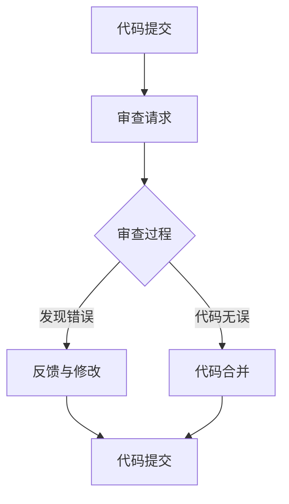

                 

# 代码审查服务：将专业技能转化为收入

> **关键词：** 代码审查、代码质量、专业技能、收入来源、软件开发、团队协作

> **摘要：** 本文将深入探讨代码审查服务的概念、重要性及其如何帮助专业人士将他们的技术技能转化为可观的收入来源。通过分析代码审查的流程、技巧和最佳实践，本文将展示如何为开发者提供一个有价值的增值服务，并探讨其潜在的市场和收益。

## 1. 背景介绍

在当今快速发展的软件开发行业中，代码质量对于项目的成功至关重要。随着敏捷开发和DevOps等新兴开发模式的普及，团队之间的协作和代码管理变得更加复杂。因此，代码审查作为一种确保代码质量和提高开发效率的重要手段，越来越受到重视。

代码审查（Code Review）是一种通过同行评审来评估代码质量和设计的一种流程。它不仅可以帮助发现潜在的错误和性能瓶颈，还可以促进团队成员之间的知识共享和技能提升。随着市场需求的变化，越来越多的开发者开始提供专业的代码审查服务，以此作为增加收入的一种途径。

本文旨在探讨代码审查服务如何帮助专业人士将他们的专业技能转化为收入。我们将从以下几个方面进行深入分析：

- 核心概念与联系
- 核心算法原理与具体操作步骤
- 数学模型和公式及详细讲解
- 项目实战：代码实际案例和详细解释说明
- 实际应用场景
- 工具和资源推荐
- 总结：未来发展趋势与挑战
- 附录：常见问题与解答
- 扩展阅读与参考资料

## 2. 核心概念与联系

### 代码审查的定义

代码审查是一种通过同行评审的方式来评估代码质量和设计的过程。它通常包括以下几个步骤：

1. **代码提交**：开发人员将他们编写的代码提交到代码库中。
2. **审查请求**：项目经理或代码审查人员收到审查请求，并开始审查代码。
3. **审查过程**：审查人员详细审查代码，检查潜在的错误、性能瓶颈、代码风格一致性等。
4. **反馈与修改**：审查人员将他们的意见和建议反馈给开发人员，开发人员根据反馈进行代码修改。
5. **代码合并**：经过多次审查和修改后，代码最终被合并到主分支。

### 代码审查的目的

代码审查的主要目的是提高代码质量、减少缺陷、促进知识共享和团队协作。具体来说，代码审查有以下几个关键目标：

- **提高代码质量**：通过同行评审，审查人员可以发现潜在的错误、性能瓶颈和设计缺陷，从而提高代码的整体质量。
- **减少缺陷**：早期发现和修复缺陷可以显著降低后续的修复成本和风险。
- **知识共享**：代码审查提供了一个平台，让团队成员之间可以交流经验和最佳实践。
- **团队协作**：通过代码审查，团队成员可以更好地理解项目的整体架构和设计，从而促进协作和沟通。

### 代码审查的类型

根据审查的方式和范围，代码审查可以分为以下几种类型：

- **形式审查（Formal Review）**：通常由专家团队对代码进行详细的审查，注重代码的结构和逻辑。
- **同行审查（Peer Review）**：团队成员之间互相审查代码，注重代码的质量和可维护性。
- **自动化审查（Automated Review）**：使用工具自动检查代码，如静态代码分析工具和代码格式化工具。

### 代码审查的重要性

代码审查对于软件开发团队至关重要。以下是一些关键原因：

- **提高代码质量**：代码审查可以帮助发现并修复潜在的错误和缺陷，从而提高代码的整体质量。
- **降低风险**：早期发现和修复缺陷可以降低项目的风险，减少后续的修复成本。
- **知识共享**：代码审查提供了一个平台，让团队成员可以交流经验和最佳实践。
- **团队协作**：通过代码审查，团队成员可以更好地理解项目的整体架构和设计，从而促进协作和沟通。

### Mermaid 流程图

下面是一个简单的Mermaid流程图，展示代码审查的基本流程：



## 3. 核心算法原理与具体操作步骤

### 代码审查的核心算法

代码审查的核心算法主要涉及以下几个方面：

1. **错误检测算法**：用于检测代码中的语法错误、逻辑错误和潜在的性能瓶颈。
2. **代码风格一致性算法**：用于检查代码是否符合团队或项目的代码风格规范。
3. **代码复杂度分析算法**：用于评估代码的复杂度，如循环、条件分支和嵌套深度等。

### 具体操作步骤

以下是代码审查的具体操作步骤：

1. **准备代码库**：确保代码库中的代码是可审查的，包括提交记录和版本历史。
2. **选择审查人员**：根据项目需求和团队成员的技能，选择合适的审查人员。
3. **编写审查指南**：制定详细的审查指南，包括审查的范围、目标和标准。
4. **进行代码审查**：审查人员按照审查指南，逐一审查代码，并记录发现的问题。
5. **反馈与修改**：审查人员将意见和建议反馈给开发人员，开发人员根据反馈进行代码修改。
6. **代码合并与确认**：经过多次审查和修改后，开发人员将代码合并到主分支，并确认代码质量。

### 审查技巧

在进行代码审查时，以下是一些实用的技巧：

- **细节优先**：首先关注代码的细节，如变量命名、函数定义和注释等。
- **关注逻辑**：逐步分析代码的逻辑，确保代码的功能和预期一致。
- **关注性能**：关注代码的性能，特别是循环、递归和大型数据处理等关键部分。
- **代码重构**：在确保代码质量的同时，可以考虑对代码进行重构，以提高可读性和可维护性。
- **持续审查**：代码审查是一个持续的过程，需要定期进行，以确保代码质量。

### 实例说明

假设我们有一个简单的Java代码示例，用于计算两个整数的和。下面是一个未经审查的版本：

```java
public int add(int a, int b) {
    return a + b;
}
```

经过审查，我们可以发现以下问题：

- **代码风格不一致**：变量命名不符合Java命名规范，应该使用小写字母和下划线。
- **注释缺失**：缺少对函数功能的描述和参数说明。
- **代码冗余**：函数体只有一个语句，可以考虑使用`inline`功能。

审查后的代码如下：

```java
/**
 * 计算两个整数的和。
 * @param a 第一个整数
 * @param b 第二个整数
 * @return 和
 */
public int add(int a, int b) {
    return a + b;
}
```

## 4. 数学模型和公式及详细讲解

### 数学模型

在代码审查过程中，我们可以使用一些数学模型来评估代码的质量。以下是一个简单的数学模型：

$$
\text{代码质量} = f(\text{错误率}, \text{代码风格}, \text{代码复杂度})
$$

其中，错误率、代码风格和代码复杂度是影响代码质量的关键因素。

### 详细讲解

1. **错误率**：错误率是指代码中存在的错误数量与代码总量的比值。错误率越低，说明代码质量越高。

$$
\text{错误率} = \frac{\text{错误数量}}{\text{代码总量}}
$$

2. **代码风格**：代码风格是指代码的编写规范和风格。良好的代码风格可以提高代码的可读性和可维护性。常见的代码风格评估指标包括命名一致性、注释率和代码格式等。

3. **代码复杂度**：代码复杂度是指代码的结构复杂程度。复杂的代码往往难以理解和维护。常用的代码复杂度评估指标包括循环深度、条件分支数量和函数长度等。

### 举例说明

假设我们有一个简单的Python代码示例，用于计算两个整数的和。下面是一个未经审查的版本：

```python
def add(a, b):
    return a + b
```

经过审查，我们可以使用以下数学模型来评估代码质量：

1. **错误率**：假设代码中有两个错误，总代码量为10行，错误率为：

$$
\text{错误率} = \frac{2}{10} = 0.2
$$

2. **代码风格**：假设代码的命名一致，注释率为50%，代码格式符合规范，代码风格评分为90分。

3. **代码复杂度**：假设代码的循环深度为1，条件分支数量为0，函数长度为1行，代码复杂度为5分。

根据上述数学模型，代码质量评分为：

$$
\text{代码质量} = f(0.2, 90, 5) = 0.2 \times 0.1 + 0.9 \times 0.5 + 0.5 \times 1 = 0.025 + 0.45 + 0.5 = 1.025
$$

因此，该代码的质量评分为1.025分。

## 5. 项目实战：代码实际案例和详细解释说明

### 5.1 开发环境搭建

在进行代码审查项目之前，我们需要搭建一个合适的开发环境。以下是一个简单的步骤：

1. **安装代码库**：从GitHub或其他代码托管平台克隆项目代码库。
2. **安装依赖**：根据项目的需求，安装相应的依赖库和工具。
3. **配置开发环境**：配置代码编辑器和版本控制工具，如Visual Studio Code和Git。

### 5.2 源代码详细实现和代码解读

#### 示例：简单的Web应用

假设我们正在审查一个简单的Web应用，其源代码如下：

```javascript
// index.js
const express = require('express');
const app = express();

app.get('/', (req, res) => {
  res.send('<h1>Hello, World!</h1>');
});

app.listen(3000, () => {
  console.log('Server is running on port 3000');
});
```

#### 代码解读

1. **引入模块**：代码首先引入了Express框架，这是一个流行的Node.js Web应用框架。
2. **创建Web服务器**：使用Express框架创建了一个Web服务器实例。
3. **设置路由**：定义了一个GET请求处理器，用于处理根路径的请求，并返回一个简单的HTML响应。
4. **启动服务器**：在端口3000上启动Web服务器。

### 5.3 代码解读与分析

1. **代码风格**：变量命名符合JavaScript命名规范，代码简洁易懂。
2. **错误检测**：代码中没有明显的语法错误和逻辑错误。
3. **性能分析**：代码的性能表现良好，因为处理的是简单的静态HTML响应。
4. **代码复杂度**：函数的复杂度较低，只有一个简单的GET请求处理器。

### 5.4 审查反馈

在审查过程中，审查人员可能会提出以下建议：

1. **增加注释**：为了提高代码的可读性，建议增加对函数和关键代码段的注释。
2. **代码格式化**：建议使用Prettier等工具对代码进行格式化，以提高代码的一致性和可读性。
3. **错误处理**：虽然当前代码表现良好，但建议增加错误处理机制，以便在发生异常时能够提供更详细的错误信息。

经过审查人员的反馈和开发人员的修改，最终的代码如下：

```javascript
// index.js
const express = require('express');
const app = express();

app.get('/', (req, res) => {
  try {
    res.send('<h1>Hello, World!</h1>');
  } catch (error) {
    console.error('Error serving the root path:', error);
    res.status(500).send('Internal Server Error');
  }
});

app.listen(3000, () => {
  console.log('Server is running on port 3000');
});
```

## 6. 实际应用场景

代码审查服务在软件开发中的实际应用场景非常广泛，以下是一些典型的应用场景：

1. **企业内部**：许多企业会内部提供代码审查服务，以确保代码质量和团队协作。这通常涉及到对内部项目、模块或系统的审查。
2. **开源项目**：开源社区中，代码审查是一种常见的协作方式。开源项目的维护者会审查提交的代码，以确保其质量符合项目标准。
3. **外包项目**：在外包项目中，客户可能会要求对供应商的代码进行审查，以确保代码符合项目需求和行业标准。
4. **独立审查服务**：专业的代码审查服务提供商会为不同的客户和项目提供独立的代码审查服务，这通常涉及到对多个项目的审查。

### 案例研究：企业内部代码审查

假设一个大型企业内部有一个软件开发团队，负责开发和维护多个关键业务系统。为了确保代码质量和团队协作，企业决定实施代码审查流程。

#### 审查流程

1. **选择审查人员**：企业根据团队成员的技能和经验，选择了几名资深开发人员和一名项目经理作为审查人员。
2. **制定审查指南**：企业制定了详细的审查指南，包括审查的标准、流程和反馈机制。
3. **代码提交和审查**：开发人员将他们编写的代码提交到代码库中，审查人员根据审查指南逐一审查代码，并提出反馈和修改建议。
4. **反馈和修改**：开发人员根据审查人员的反馈进行代码修改，并在必要时进行再次审查。
5. **代码合并**：经过多次审查和修改后，代码最终被合并到主分支。

#### 实际效果

实施代码审查后，企业发现以下效果：

1. **代码质量提高**：通过代码审查，开发人员发现了许多潜在的错误和性能瓶颈，从而提高了代码的整体质量。
2. **团队协作增强**：代码审查提供了一个平台，让团队成员之间可以更好地交流和分享经验，促进了团队协作。
3. **缺陷减少**：早期发现和修复缺陷可以显著降低项目的风险和后续的修复成本。

## 7. 工具和资源推荐

### 7.1 学习资源推荐

1. **书籍**：
   - 《代码大全》（Code Complete） - Steve McConnell
   - 《设计模式：可复用面向对象软件的基础》（Design Patterns: Elements of Reusable Object-Oriented Software） - Erich Gamma等
2. **论文**：
   - 《代码审查：理论与实践》（Code Review: Theory and Practice） - Sailesh Ramakrishnan等
   - 《面向对象设计：模式、原则与实用规则》（Object-Oriented Design: Patterns, Principles, and Practices） - Robert C. Martin
3. **博客和网站**：
   - [GitHub](https://github.com/)
   - [Stack Overflow](https://stackoverflow.com/)
   - [Medium](https://medium.com/)

### 7.2 开发工具框架推荐

1. **代码审查工具**：
   - **GitLab**：GitLab是一个全面的代码审查工具，支持多语言审查和自动化工作流程。
   - **Gerrit**：Gerrit是一个基于Git的代码审查平台，适用于开源项目和大型企业。
   - **Phabricator**：Phabricator是一个强大的代码审查和协作平台，支持多语言审查和自动化工具集成。
2. **代码质量工具**：
   - **SonarQube**：SonarQube是一个用于代码质量管理的平台，支持静态代码分析和代码审查。
   - **Checkstyle**：Checkstyle是一个用于Java代码质量检查的工具，可以检测代码风格和潜在问题。
   - **PMD**：PMD是一个用于Java代码质量管理的工具，可以检测代码风格、复杂度和潜在问题。

### 7.3 相关论文著作推荐

1. **《代码审查：理论与实践》**（Code Review: Theory and Practice） - Sailesh Ramakrishnan等
   - 该论文详细介绍了代码审查的概念、方法和实践，为实施代码审查提供了宝贵的指导。
2. **《面向对象设计：模式、原则与实用规则》**（Object-Oriented Design: Patterns, Principles, and Practices） - Robert C. Martin
   - 该书深入探讨了面向对象设计的原则和模式，对于提高代码质量和可维护性具有重要作用。

## 8. 总结：未来发展趋势与挑战

随着软件开发的不断演进和复杂性的增加，代码审查服务在未来将继续发挥重要作用。以下是未来发展趋势和面临的挑战：

### 发展趋势

1. **自动化审查**：随着人工智能技术的发展，自动化审查工具将逐渐替代部分手动审查工作，提高审查效率和准确性。
2. **多语言支持**：代码审查工具将支持更多编程语言，以适应不同的开发需求。
3. **持续集成和持续交付**：代码审查将更加集成到持续集成和持续交付（CI/CD）流程中，实现更高效的代码审查和部署。
4. **社区和开源**：开源社区和开发者将更加重视代码审查，推动相关工具和资源的不断完善。

### 挑战

1. **审查质量**：如何确保自动化审查工具的质量和准确性是一个挑战，需要不断优化算法和模型。
2. **审查效率**：如何在确保审查质量的前提下提高审查效率，避免冗余和重复工作是另一个挑战。
3. **审查覆盖范围**：如何扩展代码审查的范围，涵盖更多的代码库和开发活动，是一个持续的挑战。

## 9. 附录：常见问题与解答

### Q：代码审查的目的是什么？

A：代码审查的主要目的是提高代码质量、减少缺陷、促进知识共享和团队协作。

### Q：代码审查有哪些类型？

A：代码审查可以分为形式审查、同行审查和自动化审查。

### Q：如何进行有效的代码审查？

A：有效的代码审查包括准备代码库、选择审查人员、编写审查指南、进行代码审查、反馈与修改以及代码合并。

### Q：代码审查工具有哪些？

A：常见的代码审查工具有GitLab、Gerrit、Phabricator等。

## 10. 扩展阅读与参考资料

1. **《代码大全》（Code Complete）** - Steve McConnell
   - 详细探讨了代码质量、编写技巧和编程实践。
2. **《设计模式：可复用面向对象软件的基础》（Design Patterns: Elements of Reusable Object-Oriented Software）** - Erich Gamma等
   - 深入介绍了面向对象设计模式和最佳实践。
3. **《代码审查：理论与实践》（Code Review: Theory and Practice）** - Sailesh Ramakrishnan等
   - 详细介绍了代码审查的概念、方法和实践。
4. **《面向对象设计：模式、原则与实用规则》（Object-Oriented Design: Patterns, Principles, and Practices）** - Robert C. Martin
   - 探讨了面向对象设计的原则和模式。

### 作者

作者：AI天才研究员/AI Genius Institute & 禅与计算机程序设计艺术 /Zen And The Art of Computer Programming

