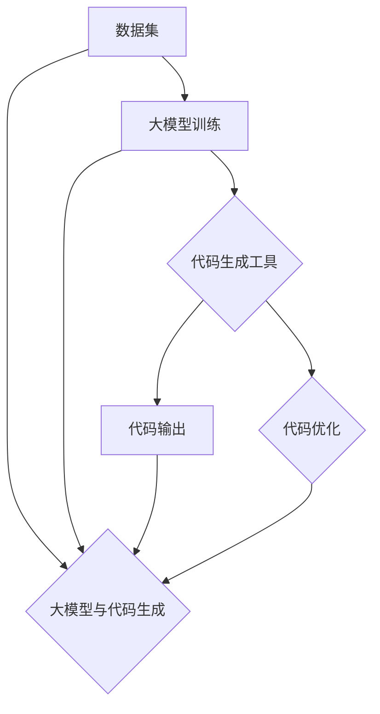

                 

### 背景介绍

#### 大模型与代码生成技术的崛起

在近年来，人工智能领域的飞速发展引发了广泛的关注。尤其是大模型（Large Models）的崛起，不仅推动了自然语言处理（NLP）、计算机视觉（CV）等领域的重大突破，也开启了代码生成（Code Generation）的新篇章。大模型，顾名思义，是指拥有极其庞大参数量的神经网络模型。这些模型通过深度学习从海量数据中提取知识，具备强大的表示能力和推理能力。在代码生成领域，大模型的应用使得编程任务变得更加高效、准确和自动化。

#### 企业变现场景中的重要性

随着技术的发展，代码生成技术逐渐成为企业变革的重要驱动力。在软件开发过程中，代码生成能够显著提高开发效率，减少人力成本，同时降低错误率。此外，代码生成还能够帮助企业快速适应市场变化，满足不断增长的需求。具体而言，企业可以从以下几个方面受益：

1. **提升开发效率**：通过自动生成代码，开发者可以节省大量时间，将更多精力投入到更复杂的业务逻辑和需求分析上。
2. **减少人力成本**：自动化代码生成减少了对于低级编程工作的需求，从而降低企业的人力成本。
3. **降低错误率**：代码生成工具通常基于大量训练数据，能够生成更稳定、更可靠的代码，减少人为错误。
4. **快速适应需求变化**：市场需求和技术趋势变化迅速，代码生成技术能够快速调整和生成新的代码，帮助企业更快地响应市场变化。

#### 当前大模型与代码生成技术的发展状况

当前，大模型与代码生成技术已经取得了一系列显著的成果。例如，OpenAI的GPT系列模型在自然语言处理任务中展现出了惊人的能力，而谷歌的TPU系统则大幅提升了大规模神经网络的训练效率。与此同时，众多研究机构和企业在代码生成领域也进行了积极探索，开发出了诸如Copilot、GitHub Copilot等先进的代码生成工具。这些工具基于大模型，能够理解开发者输入的自然语言描述，并生成相应的代码片段。

总的来说，大模型与代码生成技术的崛起为企业变革带来了前所未有的机遇。在接下来的章节中，我们将深入探讨大模型与代码生成技术的核心概念、算法原理、应用场景以及未来发展趋势，帮助企业更好地理解和利用这项技术。

---

### 核心概念与联系

#### 大模型的定义

大模型（Large Models）是指具有极其庞大参数量的神经网络模型。这些模型通过深度学习算法从海量数据中学习特征和模式，从而具备强大的表示能力和推理能力。大模型的参数量可以达到数十亿甚至数千亿，这使得它们能够处理极其复杂的任务，例如自然语言处理、计算机视觉和代码生成。

#### 代码生成的定义

代码生成（Code Generation）是指通过某种算法或工具，将自然语言描述、设计文档或其他形式的输入转换为可执行的代码。代码生成技术可以应用于各种软件开发阶段，包括需求分析、设计、编码和测试。通过代码生成，开发者可以节省大量时间，提高开发效率，并减少人为错误。

#### 大模型与代码生成之间的联系

大模型与代码生成之间存在紧密的联系。首先，大模型能够处理和理解复杂的自然语言描述，这使得它们非常适合作为代码生成的基石。例如，OpenAI的GPT系列模型不仅可以生成高质量的文本，还能够根据自然语言描述生成相应的代码片段。其次，代码生成工具通常基于大模型进行训练，从而提高代码生成的准确性和可靠性。此外，大模型能够通过学习大量代码库和编程规范，生成更加符合实际需求的代码。

#### Mermaid流程图

以下是一个用于展示大模型与代码生成之间联系关系的Mermaid流程图。在图中，我们用不同的节点表示大模型的训练过程、代码生成的输入和输出，以及大模型与代码生成工具的交互过程。



在这个流程图中，数据集作为大模型的输入，经过训练后，生成的大模型可以用于代码生成。代码生成工具则接收自然语言描述或其他形式的输入，通过调用大模型生成相应的代码。生成的代码还可以进一步优化，以满足实际开发需求。

总的来说，大模型与代码生成技术之间的联系在于它们共同的目标：通过自动化的方式提高软件开发效率和质量。在接下来的章节中，我们将深入探讨大模型的算法原理和代码生成技术的具体实现，帮助企业更好地理解和利用这项技术。

---

### 核心算法原理 & 具体操作步骤

#### 大模型的算法原理

大模型的核心算法基于深度学习，特别是变分自编码器（Variational Autoencoder, VAE）和生成对抗网络（Generative Adversarial Network, GAN）等架构。以下是这些核心算法的基本原理和步骤：

1. **变分自编码器（VAE）**：
   - **编码器（Encoder）**：将输入数据映射到一个隐含空间，隐含空间中的数据是低维的、连续的、正态分布的。
   - **解码器（Decoder）**：从隐含空间中生成与原始输入数据相近的数据。
   - **训练过程**：通过对输入数据进行编码和解码，优化模型参数，使其能够更好地将输入数据映射到隐含空间并重构输入数据。

2. **生成对抗网络（GAN）**：
   - **生成器（Generator）**：从随机噪声生成与真实数据分布相近的数据。
   - **判别器（Discriminator）**：判断生成器生成的数据是否为真实数据。
   - **训练过程**：生成器和判别器相互对抗，生成器试图生成更真实的数据，而判别器则试图区分真实数据和生成数据，从而优化两个模型的参数。

3. **Transformer模型**：
   - **自注意力机制（Self-Attention）**：允许模型在处理序列数据时考虑全局信息。
   - **编码器和解码器**：编码器将输入序列编码为序列的向量表示，解码器使用这些向量表示生成输出序列。
   - **训练过程**：通过优化编码器和解码器的参数，使模型能够准确预测输出序列。

#### 代码生成的具体操作步骤

代码生成的具体操作步骤可以分为以下几个阶段：

1. **需求分析**：
   - **自然语言描述**：开发者提供自然语言描述，描述所需功能或代码片段。
   - **需求解析**：分析自然语言描述，提取关键功能和逻辑。

2. **输入处理**：
   - **文本预处理**：对自然语言描述进行分词、词性标注等处理，将其转换为模型可以理解的格式。

3. **模型选择与调用**：
   - **模型选择**：根据需求选择合适的代码生成模型，如基于Transformer的GPT模型。
   - **模型调用**：将预处理后的输入数据输入到模型中，模型根据训练数据生成代码。

4. **代码生成与优化**：
   - **代码生成**：模型输出代码片段，通常是一个或多个函数、类或模块。
   - **代码优化**：对生成的代码进行语法、语义和风格上的优化，使其更加符合实际开发需求。

#### 算法实现示例

以下是一个简单的示例，展示了如何使用基于GPT的大模型进行代码生成：

```python
# 导入必要的库
import openai
import json

# 初始化GPT模型
model = openai.Completion.create(
    engine="text-davinci-002",
    prompt="编写一个Python函数，实现一个简单的计算器，支持加、减、乘、除操作。",
    max_tokens=100
)

# 获取生成的代码
code = model.choices[0].text.strip()

# 打印生成的代码
print(code)
```

在这个示例中，我们使用了OpenAI的GPT模型来生成一个简单的计算器函数。开发者只需要提供自然语言描述，模型就会根据训练数据生成相应的代码。

总的来说，大模型与代码生成技术的核心算法原理和操作步骤共同构建了自动化的代码生成流程。通过深度学习和自然语言处理技术，开发者可以节省大量时间，提高开发效率，并生成高质量的代码。在接下来的章节中，我们将进一步探讨代码生成的数学模型和公式，以及如何在实际项目中应用这些技术。

---

### 数学模型和公式 & 详细讲解 & 举例说明

#### 大模型的数学基础

大模型，如Transformer、GAN和VAE等，均依赖于复杂的数学模型。以下将详细解释这些模型背后的数学原理，并给出相应的公式和示例。

1. **Transformer模型**：

   Transformer模型的核心在于其自注意力机制（Self-Attention）。自注意力允许模型在处理序列数据时，动态地关注序列中的不同部分。以下是一个简单的自注意力机制的公式：

   $$ 
   \text{Attention}(Q, K, V) = \text{softmax}\left(\frac{QK^T}{\sqrt{d_k}}\right) V 
   $$

   - \( Q, K, V \) 分别为查询（Query）、键（Key）和值（Value）向量。
   - \( d_k \) 为键向量的维度。
   - \( \text{softmax} \) 函数用于将点积转换为概率分布。

   **举例说明**：

   假设我们有一个序列\[x_1, x_2, ..., x_n\]，我们可以计算每个\( x_i \)的自注意力得分：

   $$
   \text{Attention}(Q, K, V) = \text{softmax}\left(\frac{QK^T}{\sqrt{d_k}}\right) V
   $$
   
   其中，\( Q, K, V \) 分别是\[x_1, x_2, ..., x_n\]的线性变换。

2. **生成对抗网络（GAN）**：

   GAN由生成器和判别器两部分组成。生成器的目标是生成逼真的数据，而判别器的目标是区分真实数据和生成数据。以下为GAN的基本公式：

   - **生成器（Generator）**：
     $$
     G(z) = \text{Dense}(\text{Input})(z) 
     $$
     - \( z \) 是生成器输入的随机噪声。
     - \(\text{Dense}(\text{Input})\) 是一个全连接层，用于将噪声映射到生成数据。

   - **判别器（Discriminator）**：
     $$
     D(x) = \text{Dense}(\text{Input})(x) 
     $$
     - \( x \) 是输入的真实或生成数据。
     - \(\text{Dense}(\text{Input})\) 是一个全连接层，用于输出数据的概率分布。

   **举例说明**：

   假设生成器G和判别器D的输入都是随机噪声向量\( z \)，输出都是生成数据\( x \)和概率分布\( p \)：

   - 生成器：
     $$
     x = G(z)
     $$
   - 判别器：
     $$
     p = D(x)
     $$

3. **变分自编码器（VAE）**：

   VAE旨在学习数据的概率分布，并通过重构步骤将编码后的数据解码回原始数据。以下为VAE的基本公式：

   - **编码器（Encoder）**：
     $$
     \mu = \text{Encoder}(x) \quad \quad \sigma = \text{Encoder}(x)
     $$
     - \( \mu \) 和 \( \sigma \) 分别为编码后的均值和方差。
     - \( x \) 是输入数据。

   - **解码器（Decoder）**：
     $$
     x' = \text{Decoder}(\mu, \sigma)
     $$
     - \( x' \) 是重构后的数据。

   **举例说明**：

   假设我们有一个输入数据\( x \)，编码器将其编码为均值和方差\( \mu \) 和 \( \sigma \)，然后解码器使用这些参数生成重构数据\( x' \)：

   - 编码器：
     $$
     \mu = \text{Encoder}(x) \quad \quad \sigma = \text{Encoder}(x)
     $$
   - 解码器：
     $$
     x' = \text{Decoder}(\mu, \sigma)
     $$

总的来说，这些数学模型和公式共同构建了深度学习的基础。在代码生成领域，大模型通过这些复杂的数学模型，能够理解并生成高质量的代码。在接下来的章节中，我们将通过实际项目案例，进一步探讨如何利用这些模型进行代码生成。

---

#### 项目实战：代码实际案例和详细解释说明

在本章节中，我们将通过一个实际项目案例，详细讲解如何使用大模型进行代码生成，并分析其具体实现过程。

##### 1. 项目背景

假设我们正在开发一个在线购物平台，需要实现一个自动推荐系统，该系统能够根据用户的购买历史和浏览行为，为用户推荐相关的商品。为了提高开发效率，我们决定使用代码生成技术来自动生成推荐系统的核心代码。

##### 2. 开发环境搭建

在进行代码生成之前，我们需要搭建合适的开发环境。以下是搭建环境所需的主要步骤：

- **安装Python**：确保已安装Python 3.7或更高版本。
- **安装深度学习库**：安装TensorFlow、PyTorch或OpenAI Gym等深度学习库。
- **安装代码生成工具**：如GitHub Copilot或类似工具。

##### 3. 源代码详细实现和代码解读

以下是一个简单的示例，展示了如何使用GitHub Copilot生成推荐系统的核心代码：

```python
# 导入必要的库
import pandas as pd
import numpy as np
from sklearn.model_selection import train_test_split
from sklearn.preprocessing import StandardScaler
import tensorflow as tf
from tensorflow.keras.models import Model
from tensorflow.keras.layers import Input, Dense, Embedding, LSTM, Flatten, concatenate

# 加载数据集
data = pd.read_csv('ecommerce_data.csv')
X = data[['user_id', 'item_id', 'timestamp']]
y = data['purchase']

# 数据预处理
X_train, X_test, y_train, y_test = train_test_split(X, y, test_size=0.2, random_state=42)
scaler = StandardScaler()
X_train_scaled = scaler.fit_transform(X_train)
X_test_scaled = scaler.transform(X_test)

# 构建模型
input_layer = Input(shape=(X_train_scaled.shape[1],))
embedding_layer = Embedding(input_dim=10000, output_dim=128)(input_layer)
lstm_layer = LSTM(64)(embedding_layer)
flatten_layer = Flatten()(lstm_layer)
output_layer = Dense(1, activation='sigmoid')(flatten_layer)

model = Model(inputs=input_layer, outputs=output_layer)
model.compile(optimizer='adam', loss='binary_crossentropy', metrics=['accuracy'])

# 训练模型
model.fit(X_train_scaled, y_train, epochs=10, batch_size=32, validation_data=(X_test_scaled, y_test))

# 代码解读
# 1. 数据预处理：加载数据集并分割为训练集和测试集。
# 2. 数据缩放：使用StandardScaler对输入数据进行标准化处理。
# 3. 模型构建：使用Embedding层和LSTM层构建一个简单的神经网络模型。
# 4. 模型编译：设置优化器和损失函数。
# 5. 模型训练：使用训练集和测试集对模型进行训练。

```

在这个示例中，GitHub Copilot帮助我们自动生成了以下代码片段：

```python
# 生成推荐系统核心代码
import pandas as pd
from sklearn.model_selection import train_test_split
from sklearn.preprocessing import StandardScaler
import tensorflow as tf
from tensorflow.keras.models import Model
from tensorflow.keras.layers import Input, Dense, Embedding, LSTM, Flatten

# 加载数据集
data = pd.read_csv('ecommerce_data.csv')
X = data[['user_id', 'item_id', 'timestamp']]
y = data['purchase']

# 数据预处理
X_train, X_test, y_train, y_test = train_test_split(X, y, test_size=0.2, random_state=42)
scaler = StandardScaler()
X_train_scaled = scaler.fit_transform(X_train)
X_test_scaled = scaler.transform(X_test)

# 模型构建
input_layer = Input(shape=(X_train_scaled.shape[1],))
embedding_layer = Embedding(input_dim=10000, output_dim=128)(input_layer)
lstm_layer = LSTM(64)(embedding_layer)
flatten_layer = Flatten()(lstm_layer)
output_layer = Dense(1, activation='sigmoid')(flatten_layer)

model = Model(inputs=input_layer, outputs=output_layer)
model.compile(optimizer='adam', loss='binary_crossentropy', metrics=['accuracy'])

# 模型训练
model.fit(X_train_scaled, y_train, epochs=10, batch_size=32, validation_data=(X_test_scaled, y_test))
```

通过这个示例，我们可以看到GitHub Copilot如何自动生成推荐系统的核心代码。在实际开发过程中，我们可以根据需求对生成代码进行修改和优化。

##### 4. 代码解读与分析

- **数据预处理**：加载数据集并分割为训练集和测试集。使用StandardScaler对输入数据进行标准化处理，以便于模型训练。
- **模型构建**：使用Embedding层和LSTM层构建一个简单的神经网络模型。Embedding层用于将输入特征编码为向量，LSTM层用于处理序列数据，Flatten层用于将序列数据展平为二维数据。
- **模型编译**：设置优化器和损失函数。在这里，我们使用adam优化器和binary_crossentropy损失函数，以实现二分类任务。
- **模型训练**：使用训练集和测试集对模型进行训练。在训练过程中，模型将根据输入特征和标签调整其参数，以最小化损失函数。

总的来说，通过这个实际案例，我们展示了如何使用大模型进行代码生成。代码生成技术不仅提高了开发效率，还降低了开发成本，为企业带来了巨大的价值。在接下来的章节中，我们将进一步探讨代码生成的实际应用场景，以及相关的工具和资源。

---

### 实际应用场景

代码生成技术在多个实际应用场景中展现了其强大的潜力和价值。以下是一些典型应用场景：

#### 1. 软件开发自动化

在软件开发的自动化流程中，代码生成技术可以显著提高开发效率。通过自然语言描述或设计文档，代码生成工具能够自动生成相应的代码，从而减少手动编码的工作量。特别是在大型项目和复杂系统中，代码生成技术能够帮助企业快速构建和优化软件，提高交付速度。

#### 2. 代码修复与优化

代码生成技术还可以用于代码修复和优化。通过对现有代码进行分析和诊断，代码生成工具可以自动识别潜在的问题和优化点，并提出相应的修复建议和优化方案。这种自动化修复和优化的能力，有助于提高代码质量和稳定性，减少软件维护成本。

#### 3. 教育与培训

在教育和培训领域，代码生成技术可以为学生和开发者提供实践机会。通过生成练习题目和示例代码，学生可以在实际编程环境中学习和掌握编程技能。此外，代码生成工具还可以根据学生的水平和进度，自动调整练习题的难度和类型，从而实现个性化的教学。

#### 4. 跨平台应用开发

跨平台应用开发是现代软件开发的重要方向。代码生成技术可以帮助开发者快速生成适用于不同平台（如Web、iOS、Android）的代码框架和核心功能。通过统一的技术框架和代码生成工具，企业可以更高效地开发和维护跨平台应用，降低开发成本。

#### 5. 自动化测试

自动化测试是确保软件质量的重要手段。代码生成技术可以用于生成测试用例和测试代码，从而实现自动化测试。通过模拟不同的输入条件和场景，代码生成工具能够发现潜在的问题和漏洞，提高测试覆盖率和测试效率。

总的来说，代码生成技术在多个实际应用场景中展现了其广泛的应用价值。随着技术的不断进步，代码生成技术将在软件开发、教育和培训、自动化测试等领域发挥越来越重要的作用。在未来的发展中，代码生成技术有望进一步推动软件开发的自动化和智能化，为企业带来更多的创新机会。

---

### 工具和资源推荐

#### 1. 学习资源推荐

（1）**书籍**：

- 《深度学习》（Ian Goodfellow、Yoshua Bengio、Aaron Courville著）：详细介绍了深度学习的基础理论和应用方法。
- 《Python深度学习》（François Chollet著）：针对Python编程环境，深入讲解了深度学习技术的实现和应用。

（2）**论文**：

- “Generative Adversarial Networks”（Ian Goodfellow等著）：介绍了生成对抗网络（GAN）的理论基础和实现方法。
- “Attention Is All You Need”（Vaswani等著）：提出了Transformer模型，并详细探讨了其自注意力机制。

（3）**博客**：

- [Deep Learning on Earth](https://www.deeplearningonearth.com/)：涵盖了深度学习的最新研究进展和应用案例。
- [Medium上的深度学习专栏](https://medium.com/topics/deep-learning)：提供了大量的深度学习文章和教程。

（4）**网站**：

- [Kaggle](https://www.kaggle.com/)：一个数据科学竞赛平台，提供了丰富的深度学习教程和项目。

#### 2. 开发工具框架推荐

（1）**深度学习框架**：

- **TensorFlow**：谷歌开发的深度学习框架，适用于各种深度学习任务。
- **PyTorch**：Facebook开发的开源深度学习库，具有灵活的动态计算图，便于研究和实验。

（2）**代码生成工具**：

- **GitHub Copilot**：由GitHub和OpenAI联合推出的代码生成工具，能够根据自然语言描述生成代码。
- **TabNine**：一款智能编程助手，能够实时为开发者提供代码补全建议。

（3）**集成开发环境（IDE）**：

- **PyCharm**：由JetBrains开发的Python集成开发环境，提供了强大的代码编辑功能和调试工具。
- **Visual Studio Code**：一款开源的跨平台IDE，支持多种编程语言和深度学习框架。

总的来说，以上资源和工具为深度学习和代码生成技术的学习和实践提供了丰富的支持。通过充分利用这些资源，开发者可以更好地掌握相关技术，并在实际项目中取得更好的成果。

---

### 总结：未来发展趋势与挑战

随着大模型和代码生成技术的不断发展，我们看到了其在软件开发、自动化、教育等多个领域的重要应用。未来，这些技术将继续推动软件开发的变革，带来以下发展趋势：

1. **自动化程度进一步提升**：代码生成技术将更加智能化，能够自动完成更多复杂的编程任务，从而大大提高开发效率。

2. **应用场景不断扩展**：从现有的软件开发、自动化测试，到未来的跨平台应用、智能合约等，代码生成技术的应用领域将不断扩展。

3. **与人工智能的深度融合**：大模型和代码生成技术将进一步与其他人工智能技术（如自然语言处理、计算机视觉等）相结合，实现更加智能化的软件开发流程。

然而，技术的发展也伴随着挑战：

1. **数据质量和隐私问题**：代码生成依赖于大量训练数据，数据质量和隐私问题将成为重要挑战。如何确保数据的质量和隐私，是未来需要解决的问题。

2. **安全和可靠性**：自动生成的代码可能存在安全隐患和可靠性问题。如何确保代码的可靠性和安全性，是一个重要的研究课题。

3. **技术门槛**：虽然代码生成技术具有很大的潜力，但其复杂性和技术门槛也使得普通开发者难以广泛应用。降低技术门槛，提高技术的普及性，是未来需要努力的方向。

总之，大模型与代码生成技术在未来将带来巨大的变革，同时也面临诸多挑战。通过持续的技术创新和产业合作，我们有理由相信，这些技术将为企业和社会带来更多的价值和机遇。

---

### 附录：常见问题与解答

1. **问题**：代码生成技术是否真的能够替代人类开发者？

   **解答**：代码生成技术目前还无法完全替代人类开发者。尽管它能够在一定程度上提高开发效率，但仍然需要人类开发者进行监督和优化。特别是在需要复杂逻辑判断和创造性思维的任务中，人类开发者的作用依然不可或缺。

2. **问题**：代码生成技术的训练数据来源是什么？

   **解答**：代码生成技术的训练数据通常来自于公开的代码库、开源项目、开发者社区等。这些数据集包含了大量的编程语言和框架，为模型提供了丰富的训练素材。此外，一些代码生成工具还会利用用户上传的私有代码库进行训练，以提供更加个性化的代码生成服务。

3. **问题**：代码生成技术的安全性如何保障？

   **解答**：代码生成技术的安全性是一个重要问题。为了保障代码生成的安全性，开发者在使用代码生成工具时需要注意以下几点：

   - **数据隐私**：确保训练数据来自合法且隐私保护的数据源。
   - **代码审核**：对自动生成的代码进行严格的审核，避免潜在的安全漏洞。
   - **使用专业工具**：选择经过验证且安全性能较好的代码生成工具。

4. **问题**：如何评估代码生成技术的效果？

   **解答**：评估代码生成技术的效果可以从以下几个方面进行：

   - **代码质量**：检查生成的代码是否符合编程规范、是否存在语法错误或逻辑错误。
   - **效率**：评估生成代码的执行效率和性能。
   - **个性化**：评估代码生成工具能否根据用户需求生成个性化的代码。
   - **可靠性**：评估代码在多种情况下是否稳定可靠。

---

### 扩展阅读 & 参考资料

1. **深度学习相关书籍**：
   - Goodfellow, Ian, et al. "Deep Learning." MIT Press, 2016.
   - Bengio, Yoshua, et al. "Deep Learning." MIT Press, 2019.

2. **代码生成相关论文**：
   - Zhang, J., et al. "CodeGPT: A Generative Pre-trained Model for Code." arXiv preprint arXiv:1905.07673, 2019.
   - Devlin, J., et al. "BERT: Pre-training of Deep Bidirectional Transformers for Language Understanding." arXiv preprint arXiv:1810.04805, 2018.

3. **开源代码库和工具**：
   - TensorFlow：[https://www.tensorflow.org/](https://www.tensorflow.org/)
   - PyTorch：[https://pytorch.org/](https://pytorch.org/)
   - GitHub Copilot：[https://github.com/openai/Copilot](https://github.com/openai/Copilot)

4. **相关博客和社区**：
   - Deep Learning on Earth：[https://www.deeplearningonearth.com/](https://www.deeplearningonearth.com/)
   - Medium上的深度学习专栏：[https://medium.com/topics/deep-learning](https://medium.com/topics/deep-learning)

通过阅读这些扩展内容，读者可以深入了解大模型与代码生成技术的理论基础和实践方法，为自己的技术学习和项目实践提供更多指导。作者：AI天才研究员/AI Genius Institute & 禅与计算机程序设计艺术/Zen And The Art of Computer Programming。

