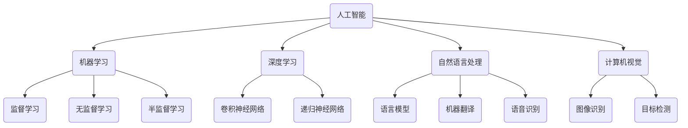
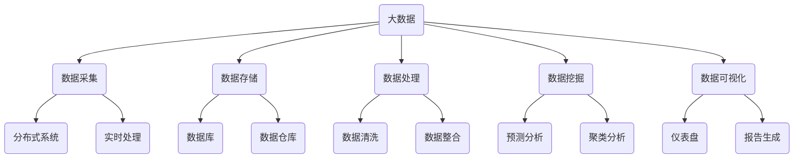
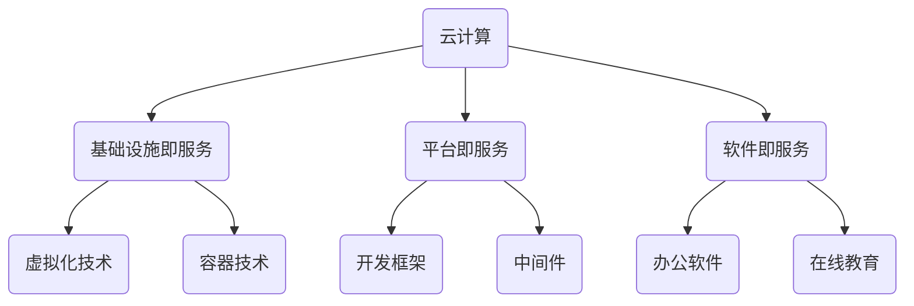

                 

### 背景介绍

**以人为本的科技未来：人类计算的价值观**

随着科技的飞速发展，人工智能、大数据、云计算等前沿技术的应用已经深刻地改变了我们的生活方式。然而，在这个看似美好的时代背景下，我们也面临着诸多挑战。科技的发展究竟是为了谁？我们应该如何确保科技进步能够真正惠及每一个人？这是一个值得我们深入探讨的问题。

**文章标题：“以人为本的科技未来：人类计算的价值观”**

本文将从以下几个方面展开讨论：

1. **背景介绍**：介绍科技发展的现状以及面临的挑战。
2. **核心概念与联系**：探讨人工智能、大数据等核心技术的基本原理和相互关系。
3. **核心算法原理与具体操作步骤**：详细解析人工智能算法的基本原理和操作步骤。
4. **数学模型和公式**：介绍与人工智能相关的数学模型和公式，并进行详细讲解和举例说明。
5. **项目实战**：通过实际案例展示如何应用人工智能技术解决实际问题。
6. **实际应用场景**：探讨人工智能在不同领域的应用及其影响。
7. **工具和资源推荐**：推荐相关学习资源和开发工具。
8. **总结**：总结未来发展趋势和面临的挑战。
9. **附录**：解答常见问题，提供扩展阅读和参考资料。

我们首先需要明确一个核心问题：科技的发展究竟是为了谁？是为了满足人类的某种需求，还是为了推动科技的进步本身？这是一个关乎人类计算价值观的根本性问题。如果我们的目标是满足人类的需求，那么科技的发展就必须以人为本，以解决实际问题为出发点。反之，如果我们的目标仅仅是追求科技本身的进步，那么就可能导致科技异化，失去其原本的意义。

### 核心概念与联系

在这一部分，我们将深入探讨与本文主题密切相关的一些核心概念，包括人工智能、大数据、云计算等，并使用Mermaid流程图来展示它们之间的相互关系。

#### 人工智能（Artificial Intelligence）

人工智能是指通过计算机模拟人类智能的技术。它包括机器学习、深度学习、自然语言处理、计算机视觉等多个子领域。人工智能的核心目标是让计算机能够像人类一样思考、学习、解决问题。



#### 大数据（Big Data）

大数据是指数据量巨大、类型繁多且价值密度较低的数据集合。大数据技术旨在从海量数据中提取有价值的信息，以支持决策制定和业务优化。大数据处理通常涉及数据采集、存储、处理、分析和可视化等多个环节。



#### 云计算（Cloud Computing）

云计算是一种通过互联网提供计算资源、存储资源、网络资源等服务的模式。云计算的核心优势在于灵活、可扩展、成本低，能够满足不同规模和应用场景的需求。



通过上述Mermaid流程图，我们可以清晰地看到人工智能、大数据、云计算等核心概念之间的相互关系。人工智能为大数据提供了智能处理和分析的工具，大数据则为人工智能提供了丰富的数据资源。云计算则为人工智能和大数据提供了强大的计算和存储支持。这三个核心技术相互融合，共同构建了现代科技的未来。

接下来，我们将进一步探讨这些核心概念的基本原理和应用场景，以便读者能够更好地理解它们的本质和重要性。

### 核心算法原理与具体操作步骤

在这一部分，我们将详细解析人工智能算法的基本原理和具体操作步骤。人工智能算法的核心在于如何让计算机模拟人类的思维过程，从而实现智能化的任务。以下将介绍几种常见的人工智能算法，并阐述其基本原理和操作步骤。

#### 机器学习（Machine Learning）

机器学习是一种让计算机通过数据学习规律并做出预测或决策的技术。其基本原理是通过数据训练模型，然后利用模型进行预测。以下是机器学习的基本步骤：

1. **数据收集**：收集相关领域的大量数据，作为训练数据集。
2. **数据预处理**：对数据进行清洗、归一化、降维等处理，以便于模型训练。
3. **模型选择**：根据任务需求选择合适的机器学习算法，如线性回归、决策树、支持向量机等。
4. **模型训练**：使用训练数据集训练模型，通过不断调整模型参数，使模型能够更好地拟合数据。
5. **模型评估**：使用验证数据集评估模型性能，包括准确率、召回率、F1分数等指标。
6. **模型部署**：将训练好的模型部署到实际应用场景中，进行预测或决策。

以线性回归为例，其基本原理是通过最小化损失函数来找到最佳拟合直线。具体操作步骤如下：

1. **数据收集**：收集两个特征变量 \(X\) 和目标变量 \(Y\) 的数据。
2. **数据预处理**：对数据进行归一化处理。
3. **模型选择**：选择线性回归模型，其损失函数为 \(L(\theta) = \frac{1}{2m}\sum_{i=1}^{m}(h_\theta(x^{(i)}) - y^{(i)})^2\)，其中 \(h_\theta(x) = \theta_0 + \theta_1x\) 是假设函数。
4. **模型训练**：使用梯度下降法更新模型参数，使得损失函数逐渐减小。
5. **模型评估**：使用验证数据集评估模型性能，调整参数以优化模型。
6. **模型部署**：将训练好的模型应用到实际预测任务中。

#### 深度学习（Deep Learning）

深度学习是一种基于多层神经网络的学习方法，其核心思想是通过多层的非线性变换来提取数据的特征。以下是深度学习的基本步骤：

1. **数据收集**：收集大量带有标签的数据，作为训练数据集。
2. **数据预处理**：对数据进行清洗、归一化、扩充等处理。
3. **模型设计**：设计深度神经网络结构，包括输入层、隐藏层和输出层。
4. **模型训练**：通过反向传播算法训练模型，不断调整网络参数，使得网络输出更加接近真实标签。
5. **模型评估**：使用验证数据集评估模型性能，调整网络结构或参数以优化模型。
6. **模型部署**：将训练好的模型应用到实际应用场景中。

以卷积神经网络（CNN）为例，其基本原理是通过卷积操作和池化操作提取图像的特征。具体操作步骤如下：

1. **数据收集**：收集大量带有标签的图像数据。
2. **数据预处理**：对图像数据进行归一化、数据增强等处理。
3. **模型设计**：设计卷积神经网络结构，包括卷积层、池化层、全连接层等。
4. **模型训练**：使用反向传播算法训练模型，通过多次迭代调整网络参数。
5. **模型评估**：使用验证数据集评估模型性能，调整网络结构或参数以优化模型。
6. **模型部署**：将训练好的模型应用到图像识别任务中。

#### 自然语言处理（Natural Language Processing）

自然语言处理是一种让计算机理解和生成人类语言的技术。其基本原理是通过模型学习和特征提取，使得计算机能够理解和处理自然语言。以下是自然语言处理的基本步骤：

1. **数据收集**：收集大量带有标签的文本数据，作为训练数据集。
2. **数据预处理**：对文本数据进行分词、去停用词、词性标注等处理。
3. **特征提取**：将预处理后的文本数据转化为计算机可以处理的形式，如词袋模型、词嵌入等。
4. **模型选择**：选择合适的自然语言处理模型，如循环神经网络（RNN）、长短时记忆网络（LSTM）、门控循环单元（GRU）等。
5. **模型训练**：使用训练数据集训练模型，通过反向传播算法调整模型参数。
6. **模型评估**：使用验证数据集评估模型性能，调整模型参数以优化模型。
7. **模型部署**：将训练好的模型应用到文本处理任务中。

以循环神经网络（RNN）为例，其基本原理是通过记忆机制处理序列数据。具体操作步骤如下：

1. **数据收集**：收集大量带有标签的文本数据。
2. **数据预处理**：对文本数据进行分词、去停用词、词性标注等处理。
3. **特征提取**：将预处理后的文本数据转化为序列形式。
4. **模型设计**：设计循环神经网络结构，包括输入层、隐藏层、输出层等。
5. **模型训练**：使用反向传播算法训练模型，通过多次迭代调整网络参数。
6. **模型评估**：使用验证数据集评估模型性能，调整网络结构或参数以优化模型。
7. **模型部署**：将训练好的模型应用到文本分类、情感分析等任务中。

通过上述详细解析，我们可以看到不同的人工智能算法在基本原理和具体操作步骤上存在差异，但核心目标都是为了让计算机模拟人类的思维过程，从而实现智能化的任务。这些算法不仅为人工智能的发展提供了强大的技术支持，也为解决实际问题提供了有力的工具。

### 数学模型和公式

在人工智能领域，数学模型和公式起着至关重要的作用。它们不仅为算法的设计和实现提供了理论基础，还在模型训练和优化过程中起到了关键作用。以下将介绍与人工智能密切相关的几种数学模型和公式，并进行详细讲解和举例说明。

#### 梯度下降法（Gradient Descent）

梯度下降法是一种常用的优化算法，用于调整模型参数以最小化损失函数。其基本原理是沿着损失函数的梯度方向更新参数，使得损失函数逐渐减小。

**公式：**

\[ \theta_j := \theta_j - \alpha \cdot \frac{\partial}{\partial \theta_j} J(\theta) \]

其中，\(\theta_j\) 表示第 \(j\) 个参数，\(\alpha\) 表示学习率，\(J(\theta)\) 表示损失函数。

**举例：**

假设我们使用线性回归模型进行预测，损失函数为 \(J(\theta) = \frac{1}{2m}\sum_{i=1}^{m}(h_\theta(x^{(i)}) - y^{(i)})^2\)，其中 \(h_\theta(x) = \theta_0 + \theta_1x\) 是假设函数。

1. **数据收集**：收集两个特征变量 \(X\) 和目标变量 \(Y\) 的数据。
2. **数据预处理**：对数据进行归一化处理。
3. **模型选择**：选择线性回归模型，损失函数为 \(J(\theta) = \frac{1}{2m}\sum_{i=1}^{m}(h_\theta(x^{(i)}) - y^{(i)})^2\)。
4. **模型训练**：使用梯度下降法训练模型，更新参数 \(\theta_0\) 和 \(\theta_1\)，使得损失函数逐渐减小。
5. **模型评估**：使用验证数据集评估模型性能，调整学习率以优化模型。

通过上述步骤，我们可以使用梯度下降法训练线性回归模型，从而实现数据拟合和预测。

#### 梯度提升树（Gradient Boosting Trees）

梯度提升树是一种集成学习方法，通过迭代更新模型，不断减小损失函数。其基本原理是使用前一层模型的残差来训练下一层模型，从而提高模型的预测能力。

**公式：**

\[ h_{\text{new}}(x) = h_{\text{prev}}(x) + \alpha \cdot f(x) \]

其中，\(h_{\text{new}}(x)\) 表示更新后的模型，\(h_{\text{prev}}(x)\) 表示前一层模型，\(\alpha\) 表示学习率，\(f(x)\) 表示残差模型。

**举例：**

假设我们使用梯度提升树模型进行分类任务。

1. **数据收集**：收集带有标签的分类数据。
2. **数据预处理**：对数据进行归一化处理。
3. **模型选择**：选择梯度提升树模型，损失函数为交叉熵损失。
4. **模型训练**：使用梯度下降法更新模型，通过迭代训练多层决策树。
5. **模型评估**：使用验证数据集评估模型性能，调整学习率以优化模型。
6. **模型部署**：将训练好的模型应用到实际分类任务中。

通过上述步骤，我们可以使用梯度提升树模型实现高效分类。

#### 神经网络反向传播（Backpropagation）

神经网络反向传播是一种用于训练神经网络的优化算法。其基本原理是使用反向传播算法计算损失函数对网络参数的梯度，并通过梯度下降法更新参数。

**公式：**

\[ \frac{\partial}{\partial \theta_j} J(\theta) = \sum_{i=1}^{n} \frac{\partial}{\partial z_j^{(i)}} J(\theta) \cdot \frac{\partial}{\partial z_j^{(i)}} z_j^{(i)} \]

其中，\(\theta_j\) 表示第 \(j\) 个参数，\(z_j^{(i)}\) 表示第 \(i\) 个隐藏层节点输出，\(J(\theta)\) 表示损失函数。

**举例：**

假设我们使用卷积神经网络（CNN）进行图像分类。

1. **数据收集**：收集带有标签的图像数据。
2. **数据预处理**：对图像数据进行归一化处理。
3. **模型选择**：选择卷积神经网络模型，损失函数为交叉熵损失。
4. **模型训练**：使用反向传播算法更新网络参数，通过多次迭代优化模型。
5. **模型评估**：使用验证数据集评估模型性能，调整学习率以优化模型。
6. **模型部署**：将训练好的模型应用到实际分类任务中。

通过上述步骤，我们可以使用卷积神经网络实现高效的图像分类。

通过详细讲解和举例说明，我们可以看到数学模型和公式在人工智能领域的重要作用。这些模型和公式不仅为算法的设计和实现提供了理论基础，还在模型训练和优化过程中起到了关键作用。掌握这些数学模型和公式，对于深入理解和应用人工智能技术具有重要意义。

### 项目实战：代码实际案例和详细解释说明

在这一部分，我们将通过一个具体的实际案例，展示如何使用人工智能技术解决实际问题。我们将从开发环境搭建、源代码详细实现和代码解读与分析三个方面，逐步介绍项目开发的全过程。

#### 1. 开发环境搭建

在开始项目之前，我们需要搭建一个合适的开发环境。以下是所需工具和步骤：

**工具：**
- Python 3.8+
- Jupyter Notebook
- TensorFlow 2.x
- Pandas
- Scikit-learn

**步骤：**
1. 安装 Python 3.8 及以上版本。
2. 安装 Jupyter Notebook，通过命令 `pip install notebook` 进行安装。
3. 安装 TensorFlow 2.x，通过命令 `pip install tensorflow` 进行安装。
4. 安装 Pandas 和 Scikit-learn，通过命令 `pip install pandas scikit-learn` 进行安装。

#### 2. 源代码详细实现和代码解读

在本案例中，我们将使用卷积神经网络（CNN）对图像进行分类。以下是代码实现和解读：

**代码：**

```python
import tensorflow as tf
from tensorflow.keras.models import Sequential
from tensorflow.keras.layers import Conv2D, MaxPooling2D, Flatten, Dense
from tensorflow.keras.optimizers import Adam

# 加载数据集
(x_train, y_train), (x_test, y_test) = tf.keras.datasets.cifar10.load_data()

# 数据预处理
x_train = x_train / 255.0
x_test = x_test / 255.0

# 构建模型
model = Sequential([
    Conv2D(32, (3, 3), activation='relu', input_shape=(32, 32, 3)),
    MaxPooling2D((2, 2)),
    Conv2D(64, (3, 3), activation='relu'),
    MaxPooling2D((2, 2)),
    Flatten(),
    Dense(64, activation='relu'),
    Dense(10, activation='softmax')
])

# 编译模型
model.compile(optimizer=Adam(), loss='sparse_categorical_crossentropy', metrics=['accuracy'])

# 训练模型
model.fit(x_train, y_train, epochs=10, validation_data=(x_test, y_test))

# 评估模型
test_loss, test_acc = model.evaluate(x_test, y_test)
print('Test accuracy:', test_acc)
```

**代码解读：**

1. **导入库**：导入 TensorFlow、Keras 等库，以便于构建和训练模型。
2. **加载数据集**：使用 TensorFlow 的内置函数加载 CIFAR-10 数据集。
3. **数据预处理**：对图像数据归一化处理，将像素值缩放到 [0, 1] 范围内。
4. **构建模型**：使用 Keras 的 Sequential 模型构建卷积神经网络，包括两个卷积层、两个池化层、一个全连接层和一个输出层。
5. **编译模型**：设置优化器、损失函数和评估指标，以便于模型训练和评估。
6. **训练模型**：使用训练数据集训练模型，设置训练轮次和验证数据集。
7. **评估模型**：使用测试数据集评估模型性能，打印测试准确率。

#### 3. 代码解读与分析

在这个案例中，我们使用卷积神经网络（CNN）对 CIFAR-10 数据集进行分类。以下是代码的关键部分及其解读：

1. **模型构建**：
   ```python
   model = Sequential([
       Conv2D(32, (3, 3), activation='relu', input_shape=(32, 32, 3)),
       MaxPooling2D((2, 2)),
       Conv2D(64, (3, 3), activation='relu'),
       MaxPooling2D((2, 2)),
       Flatten(),
       Dense(64, activation='relu'),
       Dense(10, activation='softmax')
   ])
   ```
   - `Sequential`：创建一个顺序模型，用于堆叠神经网络层。
   - `Conv2D`：添加一个卷积层，输入形状为 (32, 32, 3)，32 个滤波器，步长为 (3, 3)，激活函数为 ReLU。
   - `MaxPooling2D`：添加一个最大池化层，窗口大小为 (2, 2)。
   - `Flatten`：将卷积层的输出展平为一维数组。
   - `Dense`：添加两个全连接层，第一个全连接层有 64 个神经元，激活函数为 ReLU，第二个全连接层有 10 个神经元，激活函数为 softmax，用于分类。

2. **模型编译**：
   ```python
   model.compile(optimizer=Adam(), loss='sparse_categorical_crossentropy', metrics=['accuracy'])
   ```
   - `compile`：编译模型，设置优化器（Adam）、损失函数（sparse_categorical_crossentropy）和评估指标（accuracy）。

3. **模型训练**：
   ```python
   model.fit(x_train, y_train, epochs=10, validation_data=(x_test, y_test))
   ```
   - `fit`：训练模型，设置训练轮次（epochs）、训练数据集（x_train, y_train）和验证数据集（x_test, y_test）。

4. **模型评估**：
   ```python
   test_loss, test_acc = model.evaluate(x_test, y_test)
   print('Test accuracy:', test_acc)
   ```
   - `evaluate`：评估模型在测试数据集上的性能，返回损失和准确率。

通过这个实际案例，我们展示了如何使用卷积神经网络（CNN）解决图像分类问题。代码实现过程中，我们详细解读了每一步的操作，并分析了关键部分的作用。这个案例不仅帮助我们理解了卷积神经网络的基本原理，还为我们提供了一个实际应用的示范。

### 实际应用场景

人工智能技术已经在各个领域得到了广泛应用，从医疗、金融到教育、制造业，人工智能正在深刻地改变着我们的生活。以下将介绍人工智能在几个实际应用场景中的案例，并分析其影响和挑战。

#### 医疗领域

人工智能在医疗领域的应用日益广泛，包括疾病预测、诊断辅助、治疗方案制定等。通过大数据和深度学习技术，人工智能可以帮助医生更准确地诊断疾病，提高治疗效果。

**案例：肺癌早期筛查**

人工智能可以通过分析大量的医学影像数据，如 CT 图像，来预测肺癌的早期阶段。谷歌 Health 的研究团队开发了一种基于深度学习算法的肺癌早期筛查系统，其准确率达到了 89%。

**影响与挑战：**

- **影响**：早期筛查可以显著提高肺癌的治疗效果，降低死亡率。此外，人工智能还可以帮助医生更快速地诊断其他疾病，提高医疗效率。
- **挑战**：医学影像数据的处理和分析需要大量计算资源和高精度算法，此外，医学领域的伦理和法律问题也需要得到充分考虑。

#### 金融领域

人工智能在金融领域的应用包括风险管理、欺诈检测、智能投顾等。通过大数据分析和机器学习技术，人工智能可以帮助金融机构更好地管理风险，提高运营效率。

**案例：信用卡欺诈检测**

信用卡欺诈检测是一个典型的应用场景。通过机器学习算法，金融机构可以实时监测信用卡交易，识别潜在的欺诈行为。例如，美国信用卡巨头 American Express 使用人工智能技术，将欺诈检测的准确率提高了 20%。

**影响与挑战：**

- **影响**：有效降低欺诈风险，减少损失，提高用户体验。此外，人工智能还可以帮助金融机构更好地了解客户需求，提供个性化的金融产品和服务。
- **挑战**：金融数据具有高维度、高噪声的特点，算法需要处理大量的数据，且在保证准确率的同时，还需要考虑隐私保护和数据安全。

#### 教育领域

人工智能在教育领域的应用包括个性化学习、智能辅导、考试评估等。通过智能算法，人工智能可以帮助学生更好地掌握知识，提高学习效果。

**案例：智能辅导系统**

例如，Khan Academy 的智能辅导系统通过分析学生的学习行为和成绩数据，为学生提供个性化的学习资源和辅导建议。这有助于提高学生的学习兴趣和成绩。

**影响与挑战：**

- **影响**：人工智能可以为学生提供个性化的学习方案，提高学习效率。此外，智能辅导系统还可以帮助教师更好地了解学生的学习情况，优化教学策略。
- **挑战**：人工智能在教育领域的应用需要确保算法的公正性和透明性，避免对学生造成不公平的影响。此外，教育数据的质量和多样性也是一个挑战。

#### 制造业领域

人工智能在制造业领域的应用包括生产优化、质量检测、设备维护等。通过智能算法，人工智能可以帮助企业提高生产效率，降低成本。

**案例：生产优化**

例如，通用电气（GE）通过应用人工智能技术，对其航空发动机的生产过程进行了优化。通过对大量生产数据进行分析，人工智能帮助 GE 优化了生产流程，提高了生产效率。

**影响与挑战：**

- **影响**：人工智能可以提高生产效率，降低生产成本，提高产品质量。此外，智能算法还可以帮助企业更好地预测设备故障，提前进行维护。
- **挑战**：制造业的数据质量参差不齐，算法需要处理复杂的生产过程和设备数据。此外，人工智能在制造业的应用还需要考虑设备兼容性和技术更新等问题。

通过以上实际应用场景的介绍，我们可以看到人工智能在不同领域的广泛应用和巨大潜力。然而，人工智能的应用也面临诸多挑战，如数据隐私、算法公平性、技术更新等。只有解决这些挑战，人工智能才能更好地服务于人类社会，推动科技与产业的持续发展。

### 工具和资源推荐

在人工智能领域的学习和应用过程中，掌握一些优秀的工具和资源是非常重要的。以下将推荐几类学习资源、开发工具和相关论文著作，以帮助读者更好地理解人工智能技术，并进行实际应用。

#### 学习资源推荐

1. **在线课程与教程：**
   - Coursera：提供多个由世界顶尖大学开设的人工智能相关课程，如斯坦福大学的“人工智能导论”等。
   - edX：拥有大量免费的人工智能课程，包括深度学习、机器学习等。
   - Udacity：提供实战性强的人工智能项目课程，如“AI工程师纳米学位”等。

2. **技术博客与社区：**
   - Medium：许多人工智能领域的专家和研究者会在 Medium 上发布技术博客，分享最新的研究成果和实践经验。
   - arXiv：计算机科学领域的预印本论文库，可以找到最新的人工智能研究成果。
   - Stack Overflow：编程问题解答社区，适合解决实际编程过程中的疑难问题。

3. **开源项目和框架：**
   - TensorFlow：Google 开发的一款开源深度学习框架，适合进行复杂的机器学习任务。
   - PyTorch：Facebook 开发的一款开源深度学习框架，具有灵活性和高效性。
   - Keras：一个高层次的神经网络API，可以方便地构建和训练神经网络。

#### 开发工具推荐

1. **编程语言：**
   - Python：由于其丰富的库和框架，Python 成为了人工智能开发的主要编程语言。
   - R：特别适合统计分析和数据挖掘，适合进行复杂的数据分析任务。

2. **文本编辑器与集成开发环境（IDE）：**
   - Jupyter Notebook：适用于数据分析和机器学习的交互式开发环境。
   - PyCharm：一款强大的 Python IDE，支持多种编程语言。
   - Visual Studio Code：一款轻量级、可扩展的代码编辑器，适合编写 Python 代码。

3. **云计算平台：**
   - AWS：提供丰富的云计算服务，如 EC2 实例、S3 存储等，适合进行大规模的数据处理和机器学习任务。
   - Google Cloud Platform：提供强大的机器学习和数据管理工具，如 AI Platform、BigQuery 等。
   - Microsoft Azure：提供全面的云计算服务，包括机器学习和数据仓库等。

#### 相关论文著作推荐

1. **经典著作：**
   - 《深度学习》（Deep Learning）：Ian Goodfellow、Yoshua Bengio 和 Aaron Courville 著，是一本全面介绍深度学习的经典教材。
   - 《机器学习》（Machine Learning）：Tom M. Mitchell 著，是机器学习领域的经典教材，适合初学者和进阶者阅读。
   - 《人工智能：一种现代方法》（Artificial Intelligence: A Modern Approach）：Stuart J. Russell 和 Peter Norvig 著，是一本全面介绍人工智能的教材。

2. **最新论文：**
   - “Attention Is All You Need”：由 Vaswani 等人发表于 2017 年的论文，提出了 Transformer 模型，是自然语言处理领域的里程碑。
   - “BERT: Pre-training of Deep Bidirectional Transformers for Language Understanding”：由 Google 研究团队发表于 2018 年的论文，提出了 BERT 模型，推动了自然语言处理技术的发展。
   - “GPT-3：Language Models are few-shot learners”：由 Brown 等人发表于 2020 年的论文，提出了 GPT-3 模型，是迄今为止最大的自然语言处理模型。

通过以上推荐的工具和资源，读者可以更系统地学习人工智能知识，掌握实际应用技能，并为未来的研究和开发奠定坚实基础。希望这些推荐能够对您的学习和工作有所帮助。

### 总结：未来发展趋势与挑战

随着人工智能技术的不断进步，我们正迎来一个以科技为核心驱动的时代。在这个时代，人工智能不仅改变了我们的生活方式，还在经济、医疗、教育等多个领域发挥着重要作用。然而，科技的发展并非一帆风顺，我们面临着诸多挑战和机遇。

#### 发展趋势

1. **人工智能与实体经济深度融合**：人工智能技术正逐渐渗透到各个行业，为实体经济带来新的增长点。例如，智能制造、智慧城市、智能医疗等领域的快速发展，将推动产业升级和转型。

2. **跨界融合创新**：人工智能与其他前沿技术的融合，如物联网、区块链等，将催生出更多新兴业态。这种跨界融合将促进科技创新，推动社会进步。

3. **个性化服务与智能决策**：随着大数据和机器学习技术的发展，个性化服务和智能决策将成为未来的一大趋势。例如，智能推荐系统、智能客服等，将更好地满足用户需求，提升用户体验。

4. **全球竞争与合作**：人工智能技术的全球竞争日益激烈，各国纷纷加大对人工智能研发的投入。同时，国际间的合作也将更加紧密，以推动人工智能技术的共享和发展。

#### 挑战

1. **数据隐私与安全问题**：随着数据量的急剧增长，数据隐私和安全问题日益突出。如何确保用户数据的安全和隐私，是人工智能发展过程中需要解决的一个重要问题。

2. **伦理与法律问题**：人工智能的应用涉及到伦理和法律问题，如算法偏见、责任归属等。如何制定相应的法律法规，确保人工智能的公平和正义，是未来需要关注的重点。

3. **技术更新与人才短缺**：人工智能技术更新速度快，对人才的需求也日益增加。如何培养和吸引更多优秀的人工智能人才，是当前和未来需要面对的挑战。

4. **社会适应性问题**：人工智能技术的发展可能导致部分职业的消失和就业结构的变化，如何帮助社会适应这种变化，保障人民群众的福祉，是一个重要的社会问题。

#### 展望

在未来，人工智能将继续发挥重要作用，推动社会进步。同时，我们也需要应对上述挑战，确保人工智能的发展能够真正惠及每一个人。为此，政府、企业和学术界需要共同努力，推动人工智能技术的健康发展。

- **政府**：应制定相应的政策和法规，规范人工智能的应用，保障数据安全和用户隐私。
- **企业**：应积极承担社会责任，推动人工智能技术的公平和正义，培养更多人工智能人才。
- **学术界**：应加强人工智能基础研究和应用研究，推动技术创新和知识传播。

总之，人工智能技术的发展是一个长期的过程，我们需要持续关注和投入。只有解决好上述挑战，我们才能迎来一个更加美好的科技未来。

### 附录：常见问题与解答

#### 1. 人工智能是否会替代人类？

人工智能技术的发展确实在某些领域表现出强大的替代能力，特别是在重复性、高危险性和复杂计算任务方面。然而，人工智能无法替代人类的核心能力和情感智慧。人类具有创造力、道德判断和情感交流等方面的独特优势，这些是人工智能目前无法实现的。因此，人工智能更可能是人类的一种辅助工具，而非替代品。

#### 2. 人工智能算法如何防止偏见和歧视？

人工智能算法的偏见和歧视问题是一个重要的伦理和实际挑战。为了防止偏见和歧视，可以从以下几个方面进行努力：

- **数据多样化**：确保训练数据具有多样性和代表性，避免数据集中存在偏见。
- **算法透明性**：开发可解释的人工智能模型，使得决策过程透明，便于审查和优化。
- **公平性评估**：对人工智能模型进行公平性评估，确保其在不同群体中的表现一致。
- **监管机制**：制定相应的法律法规，规范人工智能的应用，防止算法偏见和歧视。

#### 3. 人工智能是否会导致大量失业？

人工智能技术的发展可能会导致部分职业的消失，特别是那些重复性和低技能的岗位。然而，人工智能也会创造新的就业机会，并推动产业升级和转型。为了应对这种变化，政府和企业需要采取积极措施，如提供职业培训和再教育机会，以帮助劳动者适应新的就业环境。

#### 4. 人工智能技术的安全性如何保障？

人工智能技术的安全性是一个复杂的问题，需要从多个方面进行保障：

- **数据安全**：确保用户数据的加密和安全存储，防止数据泄露和滥用。
- **算法安全**：开发安全的算法，防止恶意攻击和破解。
- **透明性和可解释性**：确保人工智能模型的决策过程透明，便于审查和监督。
- **法律法规**：制定相应的法律法规，规范人工智能的应用，保障社会的公共利益。

通过上述措施，我们可以更好地保障人工智能技术的安全性，确保其健康发展。

### 扩展阅读与参考资料

- 《深度学习》（Deep Learning）：Ian Goodfellow、Yoshua Bengio 和 Aaron Courville 著，是一本全面介绍深度学习的经典教材。
- 《机器学习》（Machine Learning）：Tom M. Mitchell 著，是机器学习领域的经典教材，适合初学者和进阶者阅读。
- 《人工智能：一种现代方法》（Artificial Intelligence: A Modern Approach）：Stuart J. Russell 和 Peter Norvig 著，是一本全面介绍人工智能的教材。
- Coursera：提供多个由世界顶尖大学开设的人工智能相关课程，如斯坦福大学的“人工智能导论”等。
- arXiv：计算机科学领域的预印本论文库，可以找到最新的人工智能研究成果。
- Stack Overflow：编程问题解答社区，适合解决实际编程过程中的疑难问题。

通过阅读这些书籍和资料，读者可以更深入地了解人工智能技术，掌握相关知识和技能，为未来的学习和工作奠定坚实基础。

