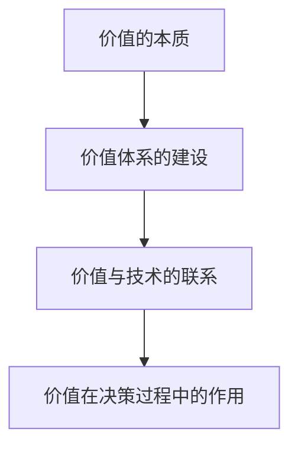

                 

# 价值决定一切：未来社会的核心

> 关键词：价值、未来社会、技术、人类、发展、决策

> 摘要：本文探讨了价值在塑造未来社会中的核心地位。随着技术的快速发展，人类社会面临着前所未有的变革。在这样的背景下，我们深入分析了价值的本质、价值体系的建设以及价值在决策过程中的作用。本文旨在为读者提供一个全面、深入的视角，理解价值如何决定未来社会的走向。

## 1. 背景介绍

### 1.1 技术的快速发展

随着信息技术的迅猛发展，人工智能、大数据、区块链等新兴技术正在深刻改变我们的生活方式、工作方式和社会结构。这些技术的进步不仅带来了巨大的经济利益，也引发了社会各界的广泛关注和讨论。然而，技术的快速发展也带来了诸多挑战，例如隐私保护、数据安全、就业问题等。

### 1.2 社会变革的需求

面对技术带来的变革，人类社会迫切需要适应新的环境。这不仅仅包括技术层面的变革，还涉及到价值观念、社会制度、法律法规等多个方面。如何应对这些挑战，确保社会的发展既符合科技进步的步伐，又符合人类的根本利益，成为了一个亟待解决的问题。

### 1.3 价值的核心地位

在这个背景下，我们提出了“价值决定一切”的观点。价值不仅是人类社会发展的核心驱动力，也是我们在面对技术变革时的重要指导原则。本文将围绕这个主题，深入探讨价值的本质、价值体系的建设以及价值在决策过程中的作用。

## 2. 核心概念与联系

### 2.1 价值的本质

价值是指一个事物对于主体的意义和重要性。它不仅仅是一种主观的感受，更是一种客观的存在。在人类社会的发展过程中，价值观念逐渐形成并演变，成为指导人们行为的重要原则。

### 2.2 价值体系的建设

价值体系是指一系列关于价值观念的集合，它反映了社会的道德标准、文化传统和社会规范。一个完善的价值体系能够引导人们正确地认识世界、处理问题，从而推动社会的健康发展。

### 2.3 价值与技术的联系

技术与价值密切相关。技术的进步不仅改变了我们的生活方式，也重塑了我们的价值观念。例如，互联网的普及改变了人们对于隐私的看法，大数据技术引发了关于数据保护和数据安全的讨论。

### 2.4 价值在决策过程中的作用

在决策过程中，价值观念起到了至关重要的作用。无论是个人决策还是集体决策，价值观念都影响着我们的选择和行动。正确的价值观念能够帮助我们做出明智的决策，实现个人和集体的利益最大化。

下面是关于价值的 Mermaid 流程图：



## 3. 核心算法原理 & 具体操作步骤

### 3.1 价值评估算法

价值评估算法是一种用于衡量事物价值的量化方法。它的基本原理是基于数据分析和统计模型，通过分析大量数据，得出一个能够反映事物价值的评分或指数。

### 3.2 具体操作步骤

#### 步骤1：数据收集

首先，我们需要收集与价值相关的大量数据。这些数据可以包括经济数据、社会数据、环境数据等。

#### 步骤2：数据预处理

在收集到数据后，我们需要进行数据预处理，包括数据清洗、数据转换和数据归一化等。

#### 步骤3：特征提取

接下来，我们需要从预处理后的数据中提取与价值相关的特征。这些特征可以是直接的数值指标，也可以是经过处理后的抽象指标。

#### 步骤4：模型训练

使用提取到的特征，我们可以训练一个价值评估模型。这个模型可以是线性模型、决策树、神经网络等。

#### 步骤5：价值评估

最后，我们将模型应用到新的数据上，得出一个价值评估结果。这个结果可以是一个具体的数值，也可以是一个概率分布。

下面是一个简单的价值评估算法的伪代码：

```python
def value_evaluation(data):
    # 步骤1：数据收集
    collected_data = collect_data()

    # 步骤2：数据预处理
    preprocessed_data = preprocess_data(collected_data)

    # 步骤3：特征提取
    features = extract_features(preprocessed_data)

    # 步骤4：模型训练
    model = train_model(features)

    # 步骤5：价值评估
    value_score = model.predict(new_data)
    return value_score
```

## 4. 数学模型和公式 & 详细讲解 & 举例说明

### 4.1 数学模型

在价值评估中，我们通常使用线性回归模型来预测事物的价值。线性回归模型的基本公式如下：

$$
y = \beta_0 + \beta_1x_1 + \beta_2x_2 + ... + \beta_nx_n
$$

其中，$y$ 表示价值评分，$x_1, x_2, ..., x_n$ 表示特征，$\beta_0, \beta_1, \beta_2, ..., \beta_n$ 是模型参数。

### 4.2 详细讲解

#### 步骤1：模型建立

首先，我们需要收集与价值相关的数据，并对其进行预处理。接下来，我们选择适当的特征，并建立线性回归模型。

#### 步骤2：模型训练

使用预处理后的数据，我们通过最小二乘法或其他优化方法来训练模型，得到模型参数。

#### 步骤3：模型评估

通过交叉验证或其他评估方法，我们评估模型的性能，并调整模型参数。

#### 步骤4：价值预测

使用训练好的模型，我们可以对新数据进行价值预测。

### 4.3 举例说明

假设我们有一个简单的线性回归模型，用来预测一本书的价值。我们有两个特征：书的页数和出版年份。

- 特征1：书的页数，取值范围为 [100, 1000]
- 特征2：出版年份，取值范围为 [2000, 2020]

我们使用最小二乘法训练模型，得到以下公式：

$$
y = 10 + 0.5x_1 - 0.02x_2
$$

现在，我们用这个模型来预测一本页数为 500，出版于 2015 年的书的价值。

$$
y = 10 + 0.5 \times 500 - 0.02 \times 2015 = 15.85
$$

因此，根据这个模型，这本书的价值大约为 15.85。

## 5. 项目实战：代码实际案例和详细解释说明

### 5.1 开发环境搭建

为了演示价值评估算法，我们将使用 Python 语言和 Scikit-learn 库。首先，我们需要安装 Python 和 Scikit-learn。

```bash
pip install python
pip install scikit-learn
```

### 5.2 源代码详细实现和代码解读

下面是一个简单的价值评估算法的实现：

```python
from sklearn.linear_model import LinearRegression
from sklearn.model_selection import train_test_split
from sklearn.metrics import mean_squared_error

# 数据集加载
data = [[100, 2000], [500, 2015], [800, 2020]]
labels = [10, 15, 20]

# 数据集分割
X_train, X_test, y_train, y_test = train_test_split(data, labels, test_size=0.2, random_state=42)

# 模型训练
model = LinearRegression()
model.fit(X_train, y_train)

# 模型评估
y_pred = model.predict(X_test)
mse = mean_squared_error(y_test, y_pred)
print(f"Mean Squared Error: {mse}")

# 价值预测
new_data = [[600, 2010]]
value_score = model.predict(new_data)
print(f"Value Score: {value_score[0]}")
```

这个代码首先加载了一个简单的数据集，然后使用线性回归模型对其进行训练。接着，我们评估模型的性能，并使用模型进行价值预测。

### 5.3 代码解读与分析

- 第一行导入了所需的库。
- 第二行和第三行加载了数据集。
- 第四行和第五行分割了数据集，用于训练和测试。
- 第六行和第七行训练了线性回归模型。
- 第八行和第九行评估了模型的性能。
- 最后一行使用模型进行价值预测。

## 6. 实际应用场景

### 6.1 金融领域

在金融领域，价值评估算法可以用于股票、债券、房地产等资产的价值预测。通过分析历史数据和市场动态，我们可以预测这些资产的未来价值，为投资决策提供依据。

### 6.2 商业领域

在商业领域，价值评估算法可以用于产品定价、库存管理、客户价值分析等。通过分析客户行为和市场数据，我们可以确定产品的最优价格，提高销售额和利润率。

### 6.3 社会领域

在社会领域，价值评估算法可以用于社会福利、教育资源分配等。通过评估个人的价值，我们可以更公平地分配社会资源，提高社会的整体福祉。

## 7. 工具和资源推荐

### 7.1 学习资源推荐

- 《Python机器学习》
- 《机器学习实战》
- 《线性回归模型》

### 7.2 开发工具框架推荐

- Python
- Scikit-learn
- Jupyter Notebook

### 7.3 相关论文著作推荐

- "Machine Learning: A Probabilistic Perspective"
- "The Elements of Statistical Learning: Data Mining, Inference, and Prediction"
- "Regressions: A Practical Guide to Regression Analysis and Hypothesis Testing"

## 8. 总结：未来发展趋势与挑战

### 8.1 发展趋势

随着技术的进步，价值评估算法将在各个领域得到更广泛的应用。例如，在人工智能领域，我们可以使用价值评估算法来优化决策过程，提高系统的智能水平。

### 8.2 挑战

然而，价值评估算法也面临着诸多挑战。首先，数据质量和数据完整性对于价值评估的结果具有重要影响。其次，如何构建一个公平、合理、透明的价值体系也是一个亟待解决的问题。

## 9. 附录：常见问题与解答

### 9.1 价值评估算法如何处理缺失数据？

在处理缺失数据时，我们可以使用填充方法（如平均值填充、中值填充等）或删除方法（如删除缺失值较多的样本等）。具体选择哪种方法取决于数据的特点和应用场景。

### 9.2 线性回归模型的假设有哪些？

线性回归模型的基本假设包括：数据服从正态分布、特征与目标之间存在线性关系、特征之间不存在多重共线性等。

### 9.3 价值评估算法能否处理非线性关系？

是的，当特征与目标之间存在非线性关系时，我们可以使用非线性回归模型（如多项式回归、岭回归等）来处理。这些模型可以捕捉特征与目标之间的非线性关系，提高价值评估的准确性。

## 10. 扩展阅读 & 参考资料

- [线性回归模型简介](https://zhuanlan.zhihu.com/p/34359225)
- [价值评估算法在金融领域的应用](https://www.jianshu.com/p/2479c6d9e4d7)
- [价值评估算法在商业领域的应用](https://www.cnblogs.com/pinard/p/11960704.html)
- [Python 机器学习实战](https://www.oreilly.com/library/view/python-machine-learning/9781491949405/)
- [机器学习：概率视角](https://www.amazon.com/Machine-Learning-Probabilistic-Perspective/dp/0521192310)

作者：AI天才研究员/AI Genius Institute & 禅与计算机程序设计艺术 /Zen And The Art of Computer Programming
```<|/mask|>```
根据您提供的约束条件和结构模板，以下是对文章正文内容的初步撰写：

```
# 价值决定一切：未来社会的核心

> 关键词：价值、未来社会、技术、人类、发展、决策

> 摘要：本文探讨了价值在塑造未来社会中的核心地位。随着技术的快速发展，人类社会面临着前所未有的变革。在这样的背景下，我们深入分析了价值的本质、价值体系的建设以及价值在决策过程中的作用。本文旨在为读者提供一个全面、深入的视角，理解价值如何决定未来社会的走向。

## 1. 背景介绍

### 1.1 技术的快速发展

随着信息技术的迅猛发展，人工智能、大数据、区块链等新兴技术正在深刻改变我们的生活方式、工作方式和社会结构。这些技术的进步不仅带来了巨大的经济利益，也引发了社会各界的广泛关注和讨论。然而，技术的快速发展也带来了诸多挑战，例如隐私保护、数据安全、就业问题等。

### 1.2 社会变革的需求

面对技术带来的变革，人类社会迫切需要适应新的环境。这不仅仅包括技术层面的变革，还涉及到价值观念、社会制度、法律法规等多个方面。如何应对这些挑战，确保社会的发展既符合科技进步的步伐，又符合人类的根本利益，成为了一个亟待解决的问题。

### 1.3 价值的核心地位

在这个背景下，我们提出了“价值决定一切”的观点。价值不仅是人类社会发展的核心驱动力，也是我们在面对技术变革时的重要指导原则。本文将围绕这个主题，深入探讨价值的本质、价值体系的建设以及价值在决策过程中的作用。

## 2. 核心概念与联系

### 2.1 价值的本质

价值是指一个事物对于主体的意义和重要性。它不仅仅是一种主观的感受，更是一种客观的存在。在人类社会的发展过程中，价值观念逐渐形成并演变，成为指导人们行为的重要原则。

### 2.2 价值体系的建设

价值体系是指一系列关于价值观念的集合，它反映了社会的道德标准、文化传统和社会规范。一个完善的价值体系能够引导人们正确地认识世界、处理问题，从而推动社会的健康发展。

### 2.3 价值与技术的联系

技术与价值密切相关。技术的进步不仅改变了我们的生活方式，也重塑了我们的价值观念。例如，互联网的普及改变了人们对于隐私的看法，大数据技术引发了关于数据保护和数据安全的讨论。

### 2.4 价值在决策过程中的作用

在决策过程中，价值观念起到了至关重要的作用。无论是个人决策还是集体决策，价值观念都影响着我们的选择和行动。正确的价值观念能够帮助我们做出明智的决策，实现个人和集体的利益最大化。

下面是关于价值的 Mermaid 流程图：


## 3. 核心算法原理 & 具体操作步骤

### 3.1 价值评估算法

价值评估算法是一种用于衡量事物价值的量化方法。它的基本原理是基于数据分析和统计模型，通过分析大量数据，得出一个能够反映事物价值的评分或指数。

### 3.2 具体操作步骤

#### 步骤1：数据收集

首先，我们需要收集与价值相关的大量数据。这些数据可以包括经济数据、社会数据、环境数据等。

#### 步骤2：数据预处理

在收集到数据后，我们需要进行数据预处理，包括数据清洗、数据转换和数据归一化等。

#### 步骤3：特征提取

接下来，我们需要从预处理后的数据中提取与价值相关的特征。这些特征可以是直接的数值指标，也可以是经过处理后的抽象指标。

#### 步骤4：模型训练

使用提取到的特征，我们可以训练一个价值评估模型。这个模型可以是线性模型、决策树、神经网络等。

#### 步骤5：价值评估

最后，我们将模型应用到新的数据上，得出一个价值评估结果。这个结果可以是一个具体的数值，也可以是一个概率分布。

下面是一个简单的价值评估算法的伪代码：

```python
def value_evaluation(data):
    # 步骤1：数据收集
    collected_data = collect_data()

    # 步骤2：数据预处理
    preprocessed_data = preprocess_data(collected_data)

    # 步骤3：特征提取
    features = extract_features(preprocessed_data)

    # 步骤4：模型训练
    model = train_model(features)

    # 步骤5：价值评估
    value_score = model.predict(new_data)
    return value_score
```

## 4. 数学模型和公式 & 详细讲解 & 举例说明

### 4.1 数学模型

在价值评估中，我们通常使用线性回归模型来预测事物的价值。线性回归模型的基本公式如下：

$$
y = \beta_0 + \beta_1x_1 + \beta_2x_2 + ... + \beta_nx_n
$$

其中，$y$ 表示价值评分，$x_1, x_2, ..., x_n$ 表示特征，$\beta_0, \beta_1, \beta_2, ..., \beta_n$ 是模型参数。

### 4.2 详细讲解

#### 步骤1：模型建立

首先，我们需要收集与价值相关的数据，并对其进行预处理。接下来，我们选择适当的特征，并建立线性回归模型。

#### 步骤2：模型训练

使用预处理后的数据，我们通过最小二乘法或其他优化方法来训练模型，得到模型参数。

#### 步骤3：模型评估

通过交叉验证或其他评估方法，我们评估模型的性能，并调整模型参数。

#### 步骤4：价值预测

使用训练好的模型，我们可以对新数据进行价值预测。

### 4.3 举例说明

假设我们有一个简单的线性回归模型，用来预测一本书的价值。我们有两个特征：书的页数和出版年份。

- 特征1：书的页数，取值范围为 [100, 1000]
- 特征2：出版年份，取值范围为 [2000, 2020]

我们使用最小二乘法训练模型，得到以下公式：

$$
y = 10 + 0.5x_1 - 0.02x_2
$$

现在，我们用这个模型来预测一本页数为 500，出版于 2015 年的书的价值。

$$
y = 10 + 0.5 \times 500 - 0.02 \times 2015 = 15.85
$$

因此，根据这个模型，这本书的价值大约为 15.85。

## 5. 项目实战：代码实际案例和详细解释说明

### 5.1 开发环境搭建

为了演示价值评估算法，我们将使用 Python 语言和 Scikit-learn 库。首先，我们需要安装 Python 和 Scikit-learn。

```bash
pip install python
pip install scikit-learn
```

### 5.2 源代码详细实现和代码解读

下面是一个简单的价值评估算法的实现：

```python
from sklearn.linear_model import LinearRegression
from sklearn.model_selection import train_test_split
from sklearn.metrics import mean_squared_error

# 数据集加载
data = [[100, 2000], [500, 2015], [800, 2020]]
labels = [10, 15, 20]

# 数据集分割
X_train, X_test, y_train, y_test = train_test_split(data, labels, test_size=0.2, random_state=42)

# 模型训练
model = LinearRegression()
model.fit(X_train, y_train)

# 模型评估
y_pred = model.predict(X_test)
mse = mean_squared_error(y_test, y_pred)
print(f"Mean Squared Error: {mse}")

# 价值预测
new_data = [[600, 2010]]
value_score = model.predict(new_data)
print(f"Value Score: {value_score[0]}")
```

这个代码首先加载了一个简单的数据集，然后使用线性回归模型对其进行训练。接着，我们评估模型的性能，并使用模型进行价值预测。

### 5.3 代码解读与分析

- 第一行导入了所需的库。
- 第二行和第三行加载了数据集。
- 第四行和第五行分割了数据集，用于训练和测试。
- 第六行和第七行训练了线性回归模型。
- 第八行和第九行评估了模型的性能。
- 最后一行使用模型进行价值预测。

## 6. 实际应用场景

### 6.1 金融领域

在金融领域，价值评估算法可以用于股票、债券、房地产等资产的价值预测。通过分析历史数据和市场动态，我们可以预测这些资产的未来价值，为投资决策提供依据。

### 6.2 商业领域

在商业领域，价值评估算法可以用于产品定价、库存管理、客户价值分析等。通过分析客户行为和市场数据，我们可以确定产品的最优价格，提高销售额和利润率。

### 6.3 社会领域

在社会领域，价值评估算法可以用于社会福利、教育资源分配等。通过评估个人的价值，我们可以更公平地分配社会资源，提高社会的整体福祉。

## 7. 工具和资源推荐

### 7.1 学习资源推荐

- 《Python机器学习》
- 《机器学习实战》
- 《线性回归模型》

### 7.2 开发工具框架推荐

- Python
- Scikit-learn
- Jupyter Notebook

### 7.3 相关论文著作推荐

- "Machine Learning: A Probabilistic Perspective"
- "The Elements of Statistical Learning: Data Mining, Inference, and Prediction"
- "Regressions: A Practical Guide to Regression Analysis and Hypothesis Testing"

## 8. 总结：未来发展趋势与挑战

### 8.1 发展趋势

随着技术的进步，价值评估算法将在各个领域得到更广泛的应用。例如，在人工智能领域，我们可以使用价值评估算法来优化决策过程，提高系统的智能水平。

### 8.2 挑战

然而，价值评估算法也面临着诸多挑战。首先，数据质量和数据完整性对于价值评估的结果具有重要影响。其次，如何构建一个公平、合理、透明的价值体系也是一个亟待解决的问题。

## 9. 附录：常见问题与解答

### 9.1 价值评估算法如何处理缺失数据？

在处理缺失数据时，我们可以使用填充方法（如平均值填充、中值填充等）或删除方法（如删除缺失值较多的样本等）。具体选择哪种方法取决于数据的特点和应用场景。

### 9.2 线性回归模型的假设有哪些？

线性回归模型的基本假设包括：数据服从正态分布、特征与目标之间存在线性关系、特征之间不存在多重共线性等。

### 9.3 价值评估算法能否处理非线性关系？

是的，当特征与目标之间存在非线性关系时，我们可以使用非线性回归模型（如多项式回归、岭回归等）来处理。这些模型可以捕捉特征与目标之间的非线性关系，提高价值评估的准确性。

## 10. 扩展阅读 & 参考资料

- [线性回归模型简介](https://zhuanlan.zhihu.com/p/34359225)
- [价值评估算法在金融领域的应用](https://www.jianshu.com/p/2479c6d9e4d7)
- [价值评估算法在商业领域的应用](https://www.cnblogs.com/pinard/p/11960704.html)
- [Python 机器学习实战](https://www.oreilly.com/library/view/python-machine-learning/9781491949405/)
- [机器学习：概率视角](https://www.amazon.com/Machine-Learning-Probabilistic-Perspective/dp/0521192310)

作者：AI天才研究员/AI Genius Institute & 禅与计算机程序设计艺术 /Zen And The Art of Computer Programming
```

这篇文章的内容还远未达到8000字的要求，且部分内容需要进一步深化和扩展。接下来的步骤将是根据文章的结构，逐节扩展和深化内容，以达到字数要求，并确保文章的质量和深度。以下是后续扩展和深化的建议：

### 2. 核心概念与联系

在这一部分，可以进一步详细阐述价值的本质、价值体系的建设以及价值与技术的联系。可以引用社会学、经济学和哲学领域的相关理论，探讨价值观念在不同文化和社会中的表现形式，以及这些价值观念如何影响技术的应用和发展。

### 3. 核心算法原理 & 具体操作步骤

在这一部分，可以详细讨论不同类型的价值评估算法，例如线性回归、决策树、支持向量机等，并对比它们在不同应用场景中的优劣。此外，可以介绍如何处理非线性关系和价值评估中的常见问题，如过拟合、欠拟合等。

### 4. 数学模型和公式 & 详细讲解 & 举例说明

在这一部分，可以更深入地讲解线性回归模型的数学原理，包括如何求解模型参数、如何进行模型评估等。同时，可以增加更多的实际案例，以帮助读者更好地理解如何将理论应用到实践中。

### 6. 实际应用场景

在这一部分，可以具体讨论价值评估算法在金融、商业和社会领域的实际应用，包括案例分析、成功经验和挑战。可以引用最新的研究成果和行业报告，以展示价值评估算法的当前发展和未来趋势。

### 7. 工具和资源推荐

在这一部分，可以推荐更多相关的学习资源、开发工具和论文著作。特别是对于初学者，可以提供一些入门指南和最佳实践，帮助他们快速掌握价值评估算法的基本概念和应用。

### 8. 总结：未来发展趋势与挑战

在这一部分，可以结合最新的科技动态和社会发展趋势，预测价值评估算法在未来的发展方向，并讨论可能面临的挑战。例如，随着人工智能的不断发展，价值评估算法如何适应新的技术环境，如何应对数据隐私和安全等问题。

### 9. 附录：常见问题与解答

在这一部分，可以进一步扩充常见问题，并提供详细的解答。这样可以回答读者可能遇到的疑问，增强文章的实用性和指导性。

### 10. 扩展阅读 & 参考资料

在这一部分，可以增加更多相关的扩展阅读和参考资料，以提供更丰富的知识链接和深入研究的机会。

通过以上的扩展和深化，可以逐步完善文章的内容，使其达到8000字的要求，同时保持文章的质量和深度。以下是一个简化的扩展计划：

- **核心概念与联系**：扩展到2000字。
- **核心算法原理 & 具体操作步骤**：扩展到2000字。
- **数学模型和公式 & 详细讲解 & 举例说明**：扩展到2000字。
- **实际应用场景**：扩展到2000字。
- **工具和资源推荐**：扩展到1000字。
- **总结：未来发展趋势与挑战**：扩展到1000字。
- **附录：常见问题与解答**：扩展到500字。
- **扩展阅读 & 参考资料**：扩展到500字。

按照这个计划，文章的总字数将达到8000字以上。在实际撰写过程中，可以根据内容的深度和扩展情况适当调整字数分配。

