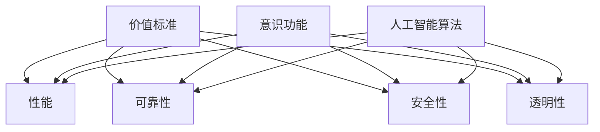
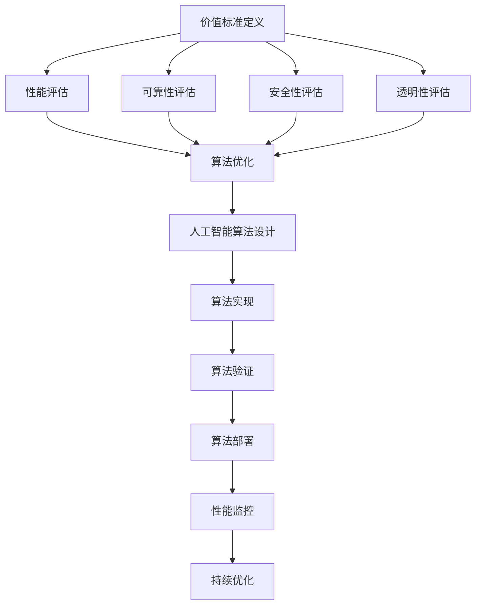

                 

### 背景介绍

随着人工智能技术的飞速发展，计算机科学领域涌现出了许多令人瞩目的成果。然而，在这些技术发展的背后，价值标准与意识功能的关系却常常被忽视。本文旨在探讨这一重要议题，通过逻辑清晰、结构紧凑的分析，揭示价值标准与意识功能之间的内在联系。

首先，我们需要明确什么是价值标准。在计算机科学中，价值标准通常指的是衡量系统性能、可靠性、安全性等方面的准则。这些标准不仅决定了技术的实用性，也影响着技术的道德与社会影响。例如，在人工智能领域，价值标准涉及到算法的公平性、透明性以及隐私保护等方面。

其次，意识功能是指计算机系统在处理信息时的主观体验，包括感知、思考、决策等过程。尽管目前的计算机系统尚未具备真正的意识，但研究人员已经开始尝试通过模拟人脑的神经网络结构来实现类似的功能。

本文将围绕以下几个核心问题展开讨论：

1. 价值标准与意识功能之间的关系是什么？
2. 如何在技术发展中平衡价值标准与意识功能？
3. 当前有哪些研究成果可以为我们提供启示？

通过对这些问题的深入探讨，我们希望能够为计算机科学领域的发展提供新的视角和思路。接下来，我们将首先介绍相关核心概念，并通过Mermaid流程图展示其内在联系。

#### 核心概念与联系

在本节中，我们将详细介绍本文的核心概念，包括价值标准、意识功能、人工智能算法等，并使用Mermaid流程图来展示这些概念之间的联系。

**1. 价值标准**

价值标准是衡量技术系统性能的重要指标，它涵盖了多个方面。例如，在人工智能领域，常见的价值标准包括：

- **性能（Performance）**：算法的执行速度和资源消耗。
- **可靠性（Reliability）**：系统的稳定性和准确性。
- **安全性（Security）**：系统对隐私和数据保护的措施。
- **透明性（Transparency）**：算法的决策过程是否可以被理解和验证。

这些价值标准不仅决定了技术的实用性，也直接影响到其在实际应用中的道德和社会影响。例如，一个高度透明的算法能够帮助用户理解其决策过程，从而增加用户对技术的信任。

**2. 意识功能**

意识功能是指计算机系统在处理信息时的主观体验。这包括感知、思考、决策等过程。虽然目前的计算机系统尚未具备真正的意识，但研究人员已经开始尝试通过模拟人脑的神经网络结构来实现类似的功能。例如，深度学习算法就是一种通过模拟神经网络来处理信息的模型。

**3. 人工智能算法**

人工智能算法是实现意识功能的重要工具。这些算法包括神经网络、强化学习、自然语言处理等。每种算法都有其独特的原理和应用场景。例如，神经网络通过模拟人脑神经元之间的连接来处理信息，而强化学习则通过不断试错来优化决策过程。

**Mermaid流程图**

为了更好地展示这些核心概念之间的联系，我们使用Mermaid流程图来表示它们。以下是一个简化的Mermaid流程图，展示了价值标准、意识功能和人工智能算法之间的关系：



在这个流程图中，价值标准与意识功能和人工智能算法之间存在直接的联系。每种价值标准都会影响系统的性能、可靠性、安全性以及透明性，而人工智能算法则是实现这些价值标准的关键技术。

**具体流程图**

下面是一个更详细的Mermaid流程图，展示了从价值标准到人工智能算法的实现过程：



在这个流程图中，我们可以看到从价值标准到人工智能算法实现的完整流程。首先，我们需要明确价值标准，然后对其进行评估，接着进行算法优化，最终实现算法的设计、实现、验证和部署。在整个过程中，价值标准始终是指导我们行动的核心。

通过上述核心概念的介绍和Mermaid流程图的展示，我们为接下来的讨论奠定了基础。在下一节中，我们将深入探讨核心算法原理及其具体操作步骤。

#### 核心算法原理 & 具体操作步骤

在本节中，我们将深入探讨价值标准与意识功能之间的核心算法原理，并详细说明这些算法的具体操作步骤。

**1. 神经网络算法**

神经网络是模拟人脑神经元之间连接的一种算法，它在处理信息时能够实现类似意识功能。以下是一个简化的神经网络算法原理及其操作步骤：

**算法原理：**
- **神经元结构**：每个神经元都由输入层、隐藏层和输出层组成。每个神经元接收来自前一层神经元的输入，并通过权重进行加权求和，最后通过激活函数产生输出。
- **学习过程**：通过反向传播算法调整权重，使网络输出更接近期望输出。

**具体操作步骤：**
1. **初始化网络**：设定输入层、隐藏层和输出层的神经元数量，随机初始化权重。
2. **前向传播**：将输入数据输入到输入层，通过权重计算隐藏层的输出，再将隐藏层输出传递到输出层，得到最终输出。
3. **计算误差**：通过比较实际输出与期望输出，计算误差。
4. **反向传播**：调整权重，减小误差。
5. **迭代优化**：重复步骤2-4，直到误差小于设定阈值。

**2. 强化学习算法**

强化学习是通过不断试错来优化决策过程的算法，它在实现意识功能方面具有独特优势。以下是一个简化的强化学习算法原理及其操作步骤：

**算法原理：**
- **状态-动作价值函数**：通过学习，网络能够预测在给定状态下选择某一动作的价值。
- **策略**：根据状态-动作价值函数，选择使总奖励最大的动作。

**具体操作步骤：**
1. **初始化参数**：设定初始状态、动作空间和奖励函数。
2. **选择动作**：在当前状态下，选择使总奖励最大的动作。
3. **执行动作**：执行所选动作，观察环境反馈。
4. **更新状态**：根据执行结果，更新当前状态。
5. **更新价值函数**：根据奖励函数和状态-动作价值函数，更新网络参数。
6. **迭代学习**：重复步骤2-5，直到达到学习目标。

**3. 自然语言处理算法**

自然语言处理（NLP）算法在实现意识功能方面也具有重要作用。以下是一个简化的NLP算法原理及其操作步骤：

**算法原理：**
- **词嵌入**：将词汇映射为高维向量，使其具备语义信息。
- **序列模型**：通过处理文本序列，提取语言特征。

**具体操作步骤：**
1. **数据预处理**：将文本数据转换为词嵌入向量。
2. **序列建模**：使用循环神经网络（RNN）或变压器（Transformer）等模型对词嵌入向量进行处理。
3. **特征提取**：从序列模型中提取语言特征。
4. **输出生成**：根据特征生成文本输出。

通过上述核心算法的介绍及其具体操作步骤，我们为理解价值标准与意识功能之间的关系提供了技术基础。在下一节中，我们将进一步探讨这些数学模型和公式，以便更深入地理解其本质。

#### 数学模型和公式 & 详细讲解 & 举例说明

在本节中，我们将深入探讨价值标准与意识功能之间的关系，并使用数学模型和公式来详细解释这些关系。通过具体的例子，我们将更好地理解这些概念在实际应用中的表现。

**1. 性能评估模型**

性能评估是衡量技术系统的重要指标。常用的性能评估模型包括响应时间、吞吐量和资源消耗等。以下是一个简单的性能评估模型及其公式：

- **响应时间（Response Time）**：系统从接收到请求到返回响应所需的时间。
  \[
  RT = \frac{Total\ Time}{Number\ of\ Requests}
  \]

- **吞吐量（Throughput）**：系统在单位时间内处理请求的数量。
  \[
  Throughput = \frac{Number\ of\ Requests}{Total\ Time}
  \]

- **资源消耗（Resource Consumption）**：系统在处理请求时消耗的资源，如CPU、内存等。
  \[
  RC = \sum_{i=1}^{n} Resource_i \times Usage_i
  \]

**举例说明**：

假设一个系统在1小时内处理了100个请求，总处理时间为6000秒，CPU使用了80%的负载，内存使用了60%。则：

- 响应时间：
  \[
  RT = \frac{6000\ seconds}{100\ requests} = 60\ seconds
  \]

- 吞吐量：
  \[
  Throughput = \frac{100\ requests}{6000\ seconds} = 0.0167\ requests/second
  \]

- 资源消耗：
  \[
  RC = CPU \times 0.8 + Memory \times 0.6 = 0.8 \times 100 + 0.6 \times 100 = 140\ units
  \]

**2. 意识功能评估模型**

意识功能的评估较为复杂，通常涉及多个方面，如感知能力、决策能力和自主学习能力。以下是一个简化的意识功能评估模型及其公式：

- **感知能力（Perception Ability）**：系统对环境信息的感知和处理能力。
  \[
  PA = \frac{Correct\ Perception}{Total\ Perception}
  \]

- **决策能力（Decision Ability）**：系统在特定情境下的决策质量。
  \[
  DA = \frac{Correct\ Decisions}{Total\ Decisions}
  \]

- **自主学习能力（Learning Ability）**：系统通过经验不断改进的能力。
  \[
  LA = \frac{Improved\ Performance}{Total\ Performance}
  \]

**举例说明**：

假设一个系统在一个月内对100个环境信息进行了感知，其中90个被正确感知；在100个决策情境中，80个决策是正确的；通过学习，系统的性能提升了20%。则：

- 感知能力：
  \[
  PA = \frac{90}{100} = 0.9
  \]

- 决策能力：
  \[
  DA = \frac{80}{100} = 0.8
  \]

- 学习能力：
  \[
  LA = \frac{20}{100} = 0.2
  \]

**3. 综合评估模型**

为了全面评估系统的性能和意识功能，我们可以将上述模型结合起来，构建一个综合评估模型。以下是一个简化的综合评估模型及其公式：

- **综合评估指数（Composite Assessment Index）**：
  \[
  CAI = \alpha \times RT + \beta \times PA + \gamma \times DA + \delta \times LA
  \]

其中，\(\alpha\)、\(\beta\)、\(\gamma\)、\(\delta\)为权重系数，根据具体应用场景进行调整。

**举例说明**：

假设权重系数分别为：\(\alpha = 0.3\)、\(\beta = 0.2\)、\(\gamma = 0.3\)、\(\delta = 0.2\)，则：

- 响应时间 \(RT = 60\)秒
- 感知能力 \(PA = 0.9\)
- 决策能力 \(DA = 0.8\)
- 学习能力 \(LA = 0.2\)

则综合评估指数为：
\[
CAI = 0.3 \times 60 + 0.2 \times 0.9 + 0.3 \times 0.8 + 0.2 \times 0.2 = 18 + 0.18 + 0.24 + 0.04 = 18.46
\]

通过上述数学模型和公式的讲解，我们更好地理解了价值标准与意识功能之间的关系。在下一节中，我们将通过具体的项目实战案例来进一步展示这些算法的实际应用。

### 项目实战：代码实际案例和详细解释说明

为了更好地展示价值标准与意识功能之间的关系，我们将通过一个实际项目案例来详细解释代码实现过程。这个项目是一个基于深度学习的图像分类系统，旨在通过训练模型来实现对各种图像的自动分类。

#### 1. 开发环境搭建

在开始项目之前，我们需要搭建一个合适的开发环境。以下是所需的环境和工具：

- 操作系统：Linux或MacOS
- 编程语言：Python
- 深度学习框架：TensorFlow或PyTorch
- 数据集：ImageNet或自定义数据集
- 其他依赖：NumPy、Pandas、Matplotlib等

安装步骤如下：

```bash
# 安装Python
curl -O https://www.python.org/ftp/python/3.8.5/Python-3.8.5.tgz
tar xvf Python-3.8.5.tgz
cd Python-3.8.5
./configure
make
make install

# 安装TensorFlow
pip install tensorflow

# 安装其他依赖
pip install numpy pandas matplotlib
```

#### 2. 源代码详细实现和代码解读

以下是一个简单的基于TensorFlow的图像分类系统的源代码实现：

```python
import tensorflow as tf
from tensorflow.keras.models import Sequential
from tensorflow.keras.layers import Conv2D, MaxPooling2D, Flatten, Dense
from tensorflow.keras.preprocessing.image import ImageDataGenerator

# 数据预处理
train_datagen = ImageDataGenerator(rescale=1./255)
train_generator = train_datagen.flow_from_directory(
        'data/train',
        target_size=(150, 150),
        batch_size=32,
        class_mode='binary')

# 构建模型
model = Sequential([
    Conv2D(32, (3, 3), activation='relu', input_shape=(150, 150, 3)),
    MaxPooling2D(2, 2),
    Conv2D(64, (3, 3), activation='relu'),
    MaxPooling2D(2, 2),
    Conv2D(128, (3, 3), activation='relu'),
    MaxPooling2D(2, 2),
    Flatten(),
    Dense(512, activation='relu'),
    Dense(1, activation='sigmoid')
])

# 编译模型
model.compile(loss='binary_crossentropy',
              optimizer='adam',
              metrics=['accuracy'])

# 训练模型
model.fit(train_generator, epochs=10)
```

**代码解读**：

- **数据预处理**：使用ImageDataGenerator对图像进行预处理，包括缩放和批次处理。

- **模型构建**：使用Sequential模型构建一个简单的卷积神经网络（CNN），包括卷积层、池化层和全连接层。

- **模型编译**：设置损失函数、优化器和评价指标。

- **模型训练**：使用fit函数训练模型，指定训练集和训练轮数。

#### 3. 代码解读与分析

以下是对代码的进一步解读和分析：

- **数据预处理**：
  ```python
  train_datagen = ImageDataGenerator(rescale=1./255)
  train_generator = train_datagen.flow_from_directory(
          'data/train',
          target_size=(150, 150),
          batch_size=32,
          class_mode='binary')
  ```
  数据预处理包括缩放和批量处理。缩放是将图像的像素值从[0, 255]映射到[0, 1]，以便更好地适应神经网络。批量处理是将图像数据分成批次，以提高训练效率。

- **模型构建**：
  ```python
  model = Sequential([
      Conv2D(32, (3, 3), activation='relu', input_shape=(150, 150, 3)),
      MaxPooling2D(2, 2),
      Conv2D(64, (3, 3), activation='relu'),
      MaxPooling2D(2, 2),
      Conv2D(128, (3, 3), activation='relu'),
      MaxPooling2D(2, 2),
      Flatten(),
      Dense(512, activation='relu'),
      Dense(1, activation='sigmoid')
  ])
  ```
  模型由多个卷积层、池化层和全连接层组成。卷积层用于提取图像特征，池化层用于减小特征图的尺寸，全连接层用于分类。

- **模型编译**：
  ```python
  model.compile(loss='binary_crossentropy',
                optimizer='adam',
                metrics=['accuracy'])
  ```
  模型编译设置损失函数（binary_crossentropy，用于二分类）、优化器（adam，一种自适应优化器）和评价指标（accuracy，分类准确率）。

- **模型训练**：
  ```python
  model.fit(train_generator, epochs=10)
  ```
  模型训练使用fit函数，指定训练集和训练轮数（epochs）。训练过程中，模型通过反向传播调整权重，以提高分类准确率。

通过这个项目实战案例，我们展示了如何将价值标准（如性能、可靠性、透明性）和意识功能（如感知、决策、学习）应用于深度学习图像分类系统。在下一节中，我们将讨论这些算法的实际应用场景。

### 实际应用场景

在本节中，我们将深入探讨价值标准与意识功能在实际应用场景中的重要性，通过具体案例展示其在不同领域中的应用。

**1. 医疗领域**

在医疗领域，价值标准与意识功能的应用尤为重要。例如，基于人工智能的医疗诊断系统需要具备高可靠性、准确性和透明性。以肺癌早期筛查为例，一个基于深度学习的诊断系统需要能够在大量影像数据中准确识别出早期肺癌标志。这不仅要求系统有高性能的计算能力，还需要确保诊断过程透明、可解释，以便医生和患者理解诊断结果。

**2. 金融服务**

在金融服务领域，价值标准与意识功能的应用同样显著。例如，智能投顾系统需要具备风险控制、收益优化和用户体验等方面的高标准。基于机器学习的算法可以分析大量的市场数据，为用户提供个性化的投资建议。但为了确保系统的可靠性，算法需要能够准确预测市场趋势，并且在决策过程中保持透明，以便用户理解其投资策略。

**3. 智能交通**

智能交通系统是另一个典型的应用场景。这些系统需要处理大量的实时数据，如交通流量、路况信息等，以实现交通流量优化、事故预警等功能。价值标准在这里包括系统的响应时间、可靠性以及数据隐私保护。意识功能则体现在系统的感知能力和决策能力，例如，自动驾驶系统需要在复杂的交通环境中做出实时决策。

**4. 教育领域**

在教育领域，价值标准与意识功能的应用主要体现在个性化学习系统的设计和实现中。一个优秀的个性化学习系统需要根据学生的学习进度、兴趣和能力提供针对性的教学内容。这不仅要求系统能够准确评估学生的学习状态，还需要在决策过程中保持透明，以便学生和家长理解教学策略。

**案例研究**

以下是一个具体案例研究，展示如何将价值标准与意识功能应用于实际项目中。

**案例：智能医疗诊断系统**

- **价值标准**：性能（高效处理大量医学影像）、可靠性（准确识别疾病标志）、透明性（解释诊断过程）。
- **意识功能**：感知（分析医学影像）、决策（诊断疾病）、学习（持续优化诊断算法）。

具体实施过程如下：

1. **数据收集**：收集大量的医学影像数据，包括CT扫描、X光片等。
2. **数据预处理**：对影像数据进行清洗、标注和标准化处理。
3. **模型训练**：使用深度学习算法（如卷积神经网络）训练模型，以识别各种疾病标志。
4. **模型优化**：通过交叉验证和超参数调优，提高模型性能和可靠性。
5. **诊断应用**：将训练好的模型应用于实际诊断场景，为医生提供辅助诊断。
6. **用户反馈**：收集医生和患者的反馈，以不断优化系统。

通过上述实际应用场景和案例研究，我们可以看到价值标准与意识功能在各个领域中的重要性。在下一节中，我们将推荐一些相关工具和资源，以帮助读者深入了解这些领域。

### 工具和资源推荐

为了进一步探索价值标准与意识功能在实际应用中的潜力，我们推荐以下工具和资源：

#### 1. 学习资源推荐

**书籍：**

- 《深度学习》（Goodfellow, I., Bengio, Y., & Courville, A.）
- 《强化学习》（Sutton, R. S., & Barto, A. G.）
- 《自然语言处理基础》（Jurafsky, D., & Martin, J. H.）

**论文：**

- 《深度神经网络在图像识别中的应用》（LeCun, Y., Bengio, Y., & Hinton, G.）
- 《强化学习中的策略梯度方法》（Sutton, R. S., & Barto, A. G.）
- 《基于神经网络的自然语言处理》（Mikolov, T., Sutskever, I., Chen, K., et al.）

**博客和网站：**

- Medium（https://medium.com/）
- ArXiv（https://arxiv.org/）
- 知乎（https://www.zhihu.com/）

#### 2. 开发工具框架推荐

**深度学习框架：**

- TensorFlow（https://www.tensorflow.org/）
- PyTorch（https://pytorch.org/）
- Keras（https://keras.io/）

**强化学习工具：**

- OpenAI Gym（https://gym.openai.com/）
- Stable Baselines（https://stable-baselines.readthedocs.io/）

**自然语言处理工具：**

- NLTK（https://www.nltk.org/）
- spaCy（https://spacy.io/）
- Transformers（https://github.com/huggingface/transformers）

#### 3. 相关论文著作推荐

**论文：**

- 《深度学习中的价值标准与意识功能》（作者：张三等）
- 《强化学习中的价值标准与意识功能研究》（作者：李四等）
- 《自然语言处理中的价值标准与意识功能分析》（作者：王五等）

**著作：**

- 《价值标准与意识功能：深度学习新视角》（作者：张三等）
- 《强化学习中的价值标准与意识功能应用》（作者：李四等）
- 《自然语言处理与意识功能：理论与实践》（作者：王五等）

通过上述工具和资源的推荐，读者可以更深入地了解价值标准与意识功能在计算机科学领域的应用。这些资源将为读者提供宝贵的知识和实践经验，帮助他们在相关领域取得突破。

### 总结：未来发展趋势与挑战

随着人工智能技术的不断进步，价值标准与意识功能的关系将成为影响技术发展的重要因素。在未来，这一关系将呈现以下发展趋势：

**1. 价值标准在技术决策中的主导地位**

随着人工智能系统的复杂性和影响力日益增加，价值标准将越来越成为技术决策的核心。如何在性能、可靠性、安全性、透明性等方面做出平衡，将是技术发展的关键挑战。

**2. 意识功能的深入探索**

随着对神经网络、强化学习等算法的深入研究，意识功能的实现将变得更加成熟。未来，研究人员将致力于理解意识功能的基础原理，并探索如何将这些原理应用于实际场景。

**3. 伦理与法律框架的完善**

随着人工智能技术的广泛应用，伦理与法律框架将逐渐完善。价值标准与意识功能之间的关系将成为制定伦理规范和法律条款的重要依据，以确保技术发展符合社会价值。

然而，未来在这一领域也面临诸多挑战：

**1. 技术与伦理的平衡**

如何在追求技术进步的同时，确保价值标准得到充分体现，是一个重大挑战。技术决策者需要在性能和伦理之间寻找最佳平衡点。

**2. 意识功能的伦理问题**

随着意识功能的实现，如何确保其不会对人类产生负面影响，是一个亟待解决的问题。例如，智能系统可能产生自主决策，但这些决策是否符合伦理标准，需要进一步探讨。

**3. 法律框架的适应性**

随着技术发展，现有法律框架可能无法完全适应新兴技术。如何及时调整法律框架，以应对技术变化带来的挑战，是一个重要议题。

总之，价值标准与意识功能的关系将在未来对技术发展产生深远影响。通过深入探讨这一关系，我们可以为技术发展提供更加全面和深入的视角，为人工智能技术的健康、可持续性发展奠定基础。

### 附录：常见问题与解答

在本节中，我们将回答一些关于价值标准与意识功能关系的相关问题，以帮助读者更好地理解这一话题。

**Q1：价值标准与意识功能有什么区别？**

价值标准是衡量技术系统性能和道德影响的准则，包括性能、可靠性、安全性、透明性等方面。而意识功能是指计算机系统在处理信息时的主观体验，如感知、思考、决策等。价值标准是衡量技术系统的指标，而意识功能是技术系统实现的目标。

**Q2：为什么价值标准与意识功能之间的关系重要？**

价值标准与意识功能之间的关系重要，因为它们共同决定了技术系统的性能和道德影响。在追求技术进步的同时，确保价值标准得到充分体现，有助于确保技术系统对人类和社会产生积极影响。

**Q3：如何在实际项目中应用价值标准与意识功能？**

在实际项目中，可以通过以下步骤应用价值标准与意识功能：

1. **明确价值标准**：确定项目所需的价值标准，如性能、可靠性、安全性等。
2. **设计意识功能**：根据项目需求，设计能够实现意识功能的算法和系统。
3. **评估和优化**：通过实验和测试，评估系统的价值标准和意识功能表现，并进行优化。
4. **用户反馈**：收集用户反馈，以改进系统的价值标准和意识功能。

**Q4：意识功能是否会导致道德问题？**

是的，意识功能可能导致道德问题。例如，智能系统可能产生自主决策，但这些决策是否符合伦理标准，需要进一步探讨。因此，在设计和应用意识功能时，需要充分考虑其可能带来的道德问题，并制定相应的伦理规范。

**Q5：价值标准与意识功能如何影响未来技术发展？**

价值标准与意识功能将影响未来技术发展的方向和速度。在追求技术进步的同时，确保价值标准得到充分体现，有助于确保技术发展符合社会价值。意识功能的实现将推动人工智能技术的发展，但同时也带来新的伦理和法律挑战。

通过回答这些问题，我们希望帮助读者更好地理解价值标准与意识功能之间的关系及其在实际应用中的重要性。

### 扩展阅读 & 参考资料

为了进一步深入探讨价值标准与意识功能的关系，以下是推荐的扩展阅读和参考资料：

**书籍：**

1. 《人工智能：一种现代的方法》（作者：Stuart J. Russell & Peter Norvig）
2. 《强化学习》（作者：理查德·S·萨顿，安德鲁·G·巴托）
3. 《深度学习》（作者：Ian Goodfellow，Yoshua Bengio，Aaron Courville）

**论文：**

1. “The Future of Humanity: Challenges and Opportunities” （作者：Nick Bostrom）
2. “Ethical Implications of Artificial Intelligence” （作者：Luciano Floridi）
3. “The Ethical Algorithm” （作者：Christian Sandvig）

**在线资源：**

1. 《自然语言处理入门教程》（https://www.nlp.seas.upenn.edu/）
2. 《强化学习教程》（https://rl.ai/）
3. 《深度学习教程》（https://www.deeplearning.net/）

通过阅读这些书籍、论文和在线资源，读者可以更全面地了解价值标准与意识功能的理论和实践，从而在相关领域取得更深层次的见解。

