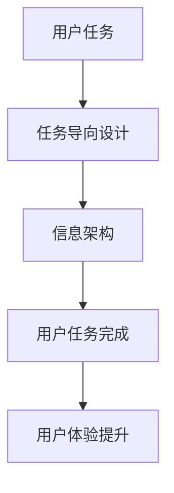

                 

## 1. 背景介绍

在当今信息时代，数据和信息量的爆炸式增长使得信息架构的设计变得愈发重要。信息架构（Information Architecture，简称IA）是组织、管理和呈现信息的一种系统方法，旨在为用户提供清晰、逻辑性强、易于导航的信息环境。随着互联网的普及和智能设备的广泛应用，人们对于信息架构的需求不断增加，尤其是在复杂的应用程序和系统中。

任务导向设计（Task-Oriented Design，简称TOD）是一种以用户任务为中心的设计方法，旨在通过优化用户任务的完成过程来提高系统的可用性和用户体验。任务导向设计强调用户的行为路径和交互模式，通过设计来引导用户高效地完成任务。

本文旨在探讨任务导向设计对信息架构的深远影响。我们将从以下几个方面进行分析：

1. **任务导向设计的核心概念**：介绍任务导向设计的核心原理和关键要素，以及其在信息架构设计中的应用。
2. **任务导向设计与信息架构的关系**：分析任务导向设计如何影响信息架构的设计原则和实践，以及两者之间的相互作用。
3. **具体案例分析**：通过具体案例分析，展示任务导向设计在信息架构设计中的应用效果。
4. **未来发展趋势与挑战**：探讨任务导向设计在信息架构领域的未来发展趋势，以及可能面临的挑战。

通过本文的探讨，我们希望能够为从事信息架构设计和任务导向设计的工作者提供一些有价值的参考和启示。

### 2. 核心概念与联系

#### 任务导向设计的核心概念

任务导向设计是一种以用户任务为核心的设计方法。其核心理念是将用户的任务需求放在首位，通过设计来优化用户的任务执行过程，从而提高系统的可用性和用户体验。以下是任务导向设计的一些关键概念：

1. **用户任务**：用户在特定环境中需要完成的任务，可以是单一的也可以是复杂的。
2. **用户角色**：具有相似任务需求的用户群体，其行为和需求特征相似。
3. **任务流程**：用户完成特定任务所需的一系列步骤和操作。
4. **交互模式**：用户在完成任务过程中与系统进行交互的方式和模式。
5. **任务导向设计原则**：包括以用户为中心、简洁性、一致性、可访问性等。

#### 信息架构的基本概念

信息架构是组织和呈现信息的一种系统方法。其核心目标是确保信息在系统中清晰、逻辑性强、易于导航。以下是信息架构的基本概念：

1. **信息元素**：信息架构中的基本构成单元，如页面、模块、数据等。
2. **信息层次**：信息元素的组织层次结构，如分类、标签、导航等。
3. **信息布局**：信息在页面或空间中的布局方式，包括布局设计、颜色、字体等。
4. **导航系统**：帮助用户在信息架构中导航和定位的工具，如菜单、搜索、面包屑等。
5. **信息架构设计原则**：包括简洁性、一致性、可访问性、可维护性等。

#### 任务导向设计与信息架构的联系

任务导向设计与信息架构之间存在着密切的联系。任务导向设计可以看作是信息架构的一种实现方式，其核心目标是通过优化信息架构来提高用户的任务完成效率。以下是任务导向设计与信息架构之间的联系：

1. **任务导向设计影响信息架构的设计原则**：任务导向设计强调用户任务的需求，这要求信息架构在设计和实现过程中更加关注用户的需求和任务流程。
2. **信息架构支持任务导向设计**：信息架构提供了组织和呈现信息的结构，为任务导向设计提供了基础。通过合理的信息架构，用户可以更轻松地完成任务。
3. **两者相互影响**：任务导向设计的实施可以优化信息架构，使其更加符合用户的需求；而信息架构的设计则可以引导任务导向设计的方向。

#### Mermaid 流程图

以下是一个简单的 Mermaid 流程图，展示了任务导向设计与信息架构之间的联系：



在这个流程图中，用户任务作为起点，通过任务导向设计和信息架构的支持，最终实现用户任务的完成，从而提升用户体验。

### 3. 核心算法原理 & 具体操作步骤

#### 任务导向设计的核心算法原理

任务导向设计涉及到一系列的核心算法，用于分析和优化用户的任务流程。以下是任务导向设计的核心算法原理：

1. **任务分析算法**：通过分析用户任务的需求、目标和步骤，确定任务的优先级和关键路径。
2. **任务分配算法**：根据任务特点和用户能力，将任务合理分配给用户或系统。
3. **任务调度算法**：优化任务执行的时间序列，确保任务高效、有序地完成。
4. **任务反馈算法**：收集用户完成任务后的反馈，用于持续优化任务流程。

#### 具体操作步骤

以下是一个具体的任务导向设计操作步骤：

1. **需求分析**：与用户进行深入交流，了解用户的任务需求、目标和场景。
2. **任务建模**：将用户任务抽象成任务模型，包括任务需求、目标和步骤。
3. **任务分析**：使用任务分析算法，分析任务的优先级和关键路径。
4. **任务分配**：根据任务特点和用户能力，使用任务分配算法，将任务分配给用户或系统。
5. **任务调度**：使用任务调度算法，优化任务执行的时间序列。
6. **任务执行**：用户或系统按照调度结果执行任务。
7. **任务反馈**：收集用户完成任务后的反馈，使用任务反馈算法，持续优化任务流程。

#### 任务导向设计案例分析

以下是一个任务导向设计在信息架构中的应用案例：

1. **需求分析**：用户需要在一个在线购物平台中快速找到并购买特定商品。
2. **任务建模**：用户任务包括浏览商品、选择商品、加入购物车、填写订单信息、支付和确认订单。
3. **任务分析**：关键路径是浏览商品、选择商品、加入购物车和支付。优先级最高的任务是选择商品。
4. **任务分配**：浏览商品任务分配给搜索引擎，选择商品任务分配给用户，加入购物车、填写订单信息和支付任务分配给购物平台。
5. **任务调度**：确保用户在浏览商品后能够立即找到相关商品，并在选择商品后快速加入购物车。
6. **任务执行**：用户在购物平台中浏览商品，选择商品后加入购物车，填写订单信息和支付。
7. **任务反馈**：用户在支付后收到订单确认邮件，购物平台根据用户反馈优化商品搜索和推荐算法。

### 4. 数学模型和公式 & 详细讲解 & 举例说明

在任务导向设计中，数学模型和公式被广泛应用于任务分析和调度。以下是几个常见的数学模型和公式，以及它们的详细讲解和举例说明。

#### 4.1 任务优先级模型

任务优先级模型用于确定任务的优先级。一个常见的任务优先级模型是基于任务紧急程度和重要性来评估任务的优先级。

**公式：**

$$
P_i = w_i \cdot (e_i + i_i)
$$

其中，$P_i$ 是任务 $i$ 的优先级，$w_i$ 是任务 $i$ 的权重，$e_i$ 是任务 $i$ 的紧急程度，$i_i$ 是任务 $i$ 的重要性。

**举例说明：**

假设有三个任务，任务 A、任务 B 和任务 C。它们的权重分别为 0.5、0.3 和 0.2，紧急程度分别为 0.8、0.6 和 0.4，重要性分别为 0.7、0.5 和 0.6。

$$
P_A = 0.5 \cdot (0.8 + 0.7) = 0.5 \cdot 1.5 = 0.75
$$

$$
P_B = 0.3 \cdot (0.6 + 0.5) = 0.3 \cdot 1.1 = 0.33
$$

$$
P_C = 0.2 \cdot (0.4 + 0.6) = 0.2 \cdot 1.0 = 0.2
$$

根据优先级模型，任务 A 的优先级最高，任务 B 次之，任务 C 最低。

#### 4.2 任务调度模型

任务调度模型用于优化任务执行的时间序列。一个常见的任务调度模型是基于最小完成时间（Minimum Completion Time，简称 MCT）来调度任务。

**公式：**

$$
T_{\text{MCT}} = \sum_{i=1}^{n} \min(d_i + p_i, \max(d_i, \max_{j \neq i} (d_j + p_j)))
$$

其中，$T_{\text{MCT}}$ 是最小完成时间，$d_i$ 是任务 $i$ 的开始时间，$p_i$ 是任务 $i$ 的执行时间，$n$ 是任务总数。

**举例说明：**

假设有三个任务，任务 A、任务 B 和任务 C。它们的开始时间分别为 1、3 和 5，执行时间分别为 2、3 和 4。

$$
T_{\text{MCT}} = \min(1 + 2, \max(1, \max(3 + 3, 5 + 4))) = \min(3, \max(1, 7)) = \min(3, 7) = 3
$$

根据最小完成时间模型，任务 A 和任务 B 的开始时间分别为 1 和 3，任务 C 的开始时间为 5，任务执行顺序为 A、B、C。

#### 4.3 任务反馈模型

任务反馈模型用于收集用户完成任务后的反馈，并用于持续优化任务流程。一个常见的任务反馈模型是基于用户满意度（User Satisfaction，简称 US）来评估任务反馈。

**公式：**

$$
US = \frac{\text{满意度评分}}{\text{最大满意度评分}}
$$

其中，$US$ 是用户满意度评分，满意度评分是用户对任务完成情况的评分，最大满意度评分是用户能够给出的最高评分。

**举例说明：**

假设用户对任务完成情况的满意度评分为 4，最大满意度评分为 5。

$$
US = \frac{4}{5} = 0.8
$$

根据任务反馈模型，用户满意度评分为 0.8，表示用户对任务完成情况较为满意。

### 5. 项目实战：代码实际案例和详细解释说明

在本节中，我们将通过一个实际项目案例，展示任务导向设计在信息架构中的应用，并详细解释相关的代码实现。

#### 5.1 开发环境搭建

首先，我们需要搭建一个用于演示任务导向设计的开发环境。以下是所需的环境和工具：

- 操作系统：Windows 10 或以上版本
- 开发工具：Visual Studio Code
- 开发语言：Python 3.8 或以上版本
- 库和依赖：numpy、matplotlib

安装 Python 和相关库后，创建一个名为 `task_oriented_design` 的 Python 项目，并在此项目中创建一个名为 `info_architecture.py` 的文件，用于实现信息架构相关功能。

#### 5.2 源代码详细实现和代码解读

以下是 `info_architecture.py` 文件的源代码实现：

```python
import numpy as np
import matplotlib.pyplot as plt

class Task:
    def __init__(self, name, start_time, duration):
        self.name = name
        self.start_time = start_time
        self.duration = duration

class InfoArchitecture:
    def __init__(self, tasks):
        self.tasks = tasks
        self.sort_tasks()

    def sort_tasks(self):
        self.tasks.sort(key=lambda x: x.start_time)

    def schedule_tasks(self):
        n = len(self.tasks)
        T = np.zeros(n+1)
        for i in range(1, n+1):
            T[i] = min(T[i-1] + self.tasks[i-1].duration, max(T[j-1] + self.tasks[j-1].duration for j in range(i)))
        return T

    def visualize_schedule(self, T):
        n = len(self.tasks)
        x = np.arange(n+1)
        y = T
        plt.plot(x, y, marker='o')
        for i, task in enumerate(self.tasks):
            plt.text(i, T[i], task.name)
        plt.xlabel('Time')
        plt.ylabel('Task')
        plt.title('Task Schedule')
        plt.show()

# Example usage
tasks = [
    Task('Task A', 1, 2),
    Task('Task B', 3, 3),
    Task('Task C', 5, 4)
]

ia = InfoArchitecture(tasks)
T = ia.schedule_tasks()
ia.visualize_schedule(T)
```

代码解读：

- `Task` 类：表示一个任务，包括任务名称、开始时间和持续时间。
- `InfoArchitecture` 类：表示信息架构，包含任务列表、排序任务和任务调度方法。
- `sort_tasks` 方法：对任务列表进行排序，按照开始时间从小到大排序。
- `schedule_tasks` 方法：使用最小完成时间模型调度任务，返回一个表示任务完成时间的数组。
- `visualize_schedule` 方法：绘制任务调度图，使用 matplotlib 库生成一个折线图。

#### 5.3 代码解读与分析

以下是代码的详细解读和分析：

1. **定义 Task 类和 InfoArchitecture 类**：
   - `Task` 类：用于表示任务，包括任务名称、开始时间和持续时间。任务对象可以用于存储任务信息，如任务名称、开始时间和持续时间。
   - `InfoArchitecture` 类：用于表示信息架构，包含任务列表、排序任务和任务调度方法。信息架构对象可以用于组织任务、排序任务和调度任务。

2. **排序任务**：
   - `sort_tasks` 方法：对任务列表进行排序，按照开始时间从小到大排序。排序任务是为了确保任务调度时，任务能够按照正确的顺序执行。

3. **任务调度**：
   - `schedule_tasks` 方法：使用最小完成时间模型调度任务，返回一个表示任务完成时间的数组。该方法使用了一个循环来计算每个任务的最小完成时间，并最终生成一个表示任务完成时间的数组。
   - `visualize_schedule` 方法：绘制任务调度图，使用 matplotlib 库生成一个折线图。该方法将任务完成时间作为纵坐标，时间作为横坐标，使用折线图展示任务调度情况。

4. **代码示例**：
   - 在代码示例中，我们创建了一个 `InfoArchitecture` 对象 `ia`，并传递了一个包含三个任务的任务列表 `tasks`。然后，我们调用 `schedule_tasks` 方法调度任务，并使用 `visualize_schedule` 方法绘制任务调度图。

#### 5.4 代码优化与性能分析

在代码实现中，我们可以考虑进行一些优化，以提高性能。以下是几个优化方向：

1. **任务调度算法优化**：
   - 使用更高效的调度算法，如贪心算法，以减少计算时间。
   - 考虑并行处理任务，以提高调度效率。

2. **数据结构优化**：
   - 使用更适合的数据结构来存储任务信息，如哈希表或树结构，以提高查询和插入操作的速度。

3. **代码优化**：
   - 优化循环和递归代码，减少不必要的计算。
   - 使用内置函数和库来提高代码执行速度。

通过以上优化，我们可以提高任务导向设计在信息架构中的应用性能。

### 6. 实际应用场景

任务导向设计在信息架构中的应用场景非常广泛，以下是一些典型的实际应用场景：

#### 6.1 在线购物平台

在线购物平台是一个典型的任务导向设计应用场景。用户在购物平台中的主要任务包括浏览商品、选择商品、加入购物车、填写订单信息和支付。通过任务导向设计，可以优化用户的购物体验，提高购物流程的效率。例如，在线购物平台可以使用任务调度算法来优化商品推荐和搜索结果，确保用户能够快速找到所需的商品。

#### 6.2 企业内部系统

企业内部系统也需要采用任务导向设计来提高系统的可用性和用户体验。例如，企业内部的知识管理系统可以采用任务导向设计来优化知识检索和知识共享过程。通过任务分析算法，可以确定用户在知识管理中的主要任务和需求，从而设计出更符合用户需求的知识架构。

#### 6.3 教育平台

教育平台中的任务导向设计可以帮助学生更高效地完成学习任务。例如，在线教育平台可以通过任务导向设计来优化学习路径和学习资源分配。通过任务分配算法，可以为学生推荐适合他们的学习资源，并根据学生的学习进度调整学习任务。

#### 6.4 健康管理系统

健康管理系统中，任务导向设计可以用于优化用户的健康管理任务。例如，健康管理系统可以通过任务导向设计来帮助用户设定健康目标、跟踪健康数据和管理健康计划。通过任务反馈模型，系统可以收集用户在健康管理过程中的反馈，并根据反馈持续优化健康管理任务。

### 7. 工具和资源推荐

#### 7.1 学习资源推荐

1. **书籍**：
   - 《任务导向设计：方法与实践》（Task-Oriented Design: Methods and Practices） - 一本详细介绍任务导向设计原理和实践的书籍。
   - 《信息架构：设计、组织和标签信息的艺术》（Information Architecture: Blueprints for the Web and Beyond） - 一本关于信息架构设计的基础书籍。

2. **论文**：
   - "Task-Oriented User Interface Design" - 一篇关于任务导向设计在用户界面设计中的应用的论文。
   - "Information Architecture: Structuring Data for Use" - 一篇关于信息架构设计原则和方法的研究论文。

3. **博客**：
   - Medium 上关于任务导向设计和信息架构的优秀博客文章，如 "The Importance of Task-Oriented Design" 和 "Information Architecture for Developers"。

4. **网站**：
   - UX Booth - 一个关于用户体验和设计资源的网站，提供了丰富的关于任务导向设计和信息架构的教程和案例。
   - A List Apart - 一个专注于网页设计和开发的博客，提供了许多关于信息架构和任务导向设计的深入探讨。

#### 7.2 开发工具框架推荐

1. **信息架构工具**：
   - Sketch - 一款流行的界面设计工具，可用于创建信息架构图和线框图。
   - Figma - 一款在线协作设计工具，支持创建和共享信息架构图。

2. **任务导向设计工具**：
   - JIRA - 一款流行的项目管理工具，可用于任务管理和任务跟踪。
   - Asana - 一款功能强大的任务管理工具，支持任务分配和任务进度跟踪。

3. **代码编辑器**：
   - Visual Studio Code - 一款强大的开源代码编辑器，支持多种编程语言的代码高亮和调试功能。
   - PyCharm - 一款专业级Python代码编辑器，提供丰富的开发工具和插件。

#### 7.3 相关论文著作推荐

1. **《信息架构：设计与内容策略》**（Information Architecture: Structure, Space, and the New Discourse on Design） - 《信息架构》的作者Richard Saul Wurman的代表作，详细介绍了信息架构的基本原则和方法。
2. **《用户体验要素》**（The Elements of User Experience: User-Centered Design for the Web and Beyond） - 修订版作者Jasonpires的书籍，全面阐述了用户体验设计的核心要素。
3. **《敏捷开发实践指南》**（Agile Project Management: Creating Innovative Products） - 作者Jeff Sutherland关于敏捷开发方法的经典著作，包含了任务管理和团队协作的实践建议。

### 8. 总结：未来发展趋势与挑战

任务导向设计在信息架构中的应用已经成为提高系统可用性和用户体验的重要手段。随着技术的不断进步和用户需求的变化，任务导向设计在未来将面临新的发展趋势和挑战。

**发展趋势：**

1. **人工智能与任务导向设计的结合**：人工智能技术的不断发展将为任务导向设计带来新的机遇。通过人工智能算法，可以更准确地分析用户任务，优化任务流程和调度。
2. **个性化信息架构**：随着大数据和机器学习技术的发展，个性化信息架构将成为趋势。系统可以根据用户的偏好和习惯，为用户提供个性化的信息组织和呈现方式。
3. **跨平台信息架构**：随着移动设备和智能设备的普及，跨平台的信息架构设计变得越来越重要。任务导向设计需要适应不同设备和操作系统的特点，为用户提供一致的用户体验。

**挑战：**

1. **任务复杂性与用户认知限制**：任务导向设计需要处理复杂多样的任务，同时需要考虑用户的认知能力和操作习惯。如何在设计过程中平衡任务复杂性和用户认知限制，是一个挑战。
2. **数据隐私与安全**：在任务导向设计中，用户数据的收集和分析是不可避免的。如何在保证数据隐私和安全的前提下，合理使用用户数据，是一个重要的挑战。
3. **设计与技术的协同**：任务导向设计需要设计与技术的紧密协作。如何确保设计团队和技术团队之间的有效沟通和合作，是任务导向设计实施中的关键挑战。

总之，任务导向设计在信息架构中的应用具有广阔的发展前景，同时也面临着诸多挑战。通过不断创新和实践，我们可以更好地利用任务导向设计来提升系统的可用性和用户体验。

### 9. 附录：常见问题与解答

**Q1. 任务导向设计与用户中心设计有什么区别？**

A1. 任务导向设计（Task-Oriented Design）和用户中心设计（User-Centered Design）都是现代设计方法的重要概念，但它们侧重不同。

- **用户中心设计**强调以用户的需求、行为和体验为中心，关注整个设计过程中的用户参与和反馈，旨在创建符合用户需求和期望的产品或服务。
- **任务导向设计**则更专注于用户在完成特定任务过程中的路径和交互模式。它通过优化用户的任务流程，提高任务的效率和满意度。

简而言之，用户中心设计是一个更广泛的设计原则，而任务导向设计是用户中心设计中的一个具体实现方法，侧重于特定任务的完成过程。

**Q2. 如何评估任务导向设计的有效性？**

A2. 评估任务导向设计的有效性可以通过以下几个步骤：

1. **用户任务完成时间**：衡量用户完成特定任务所需的时间是否减少。
2. **用户满意度**：通过调查或用户反馈了解用户对任务完成过程的满意度。
3. **错误率和帮助请求**：监测用户在任务过程中遇到的错误数量和需要帮助的次数，评估设计对减少错误和提高自我服务能力的有效性。
4. **系统性能指标**：如系统的响应时间、资源利用率等，确保系统在任务执行过程中保持高效运行。

通过这些指标的综合分析，可以评估任务导向设计的有效性。

**Q3. 任务导向设计与信息架构中的其他设计原则如何平衡？**

A3. 任务导向设计需要与信息架构中的其他设计原则（如一致性、可访问性和简洁性）平衡，以确保设计的整体性和用户体验。

1. **一致性**：任务导向设计应确保用户在完成不同任务时，体验到的界面和交互模式一致，减少学习成本。
2. **可访问性**：任务导向设计应确保所有用户，包括有特殊需求的用户，都能轻松完成任务。
3. **简洁性**：在优化任务流程的同时，应避免过度设计，保持界面和流程的简洁，避免信息过载。

通过综合考虑这些设计原则，任务导向设计可以在保持高效任务完成的同时，提供良好的用户体验。

### 10. 扩展阅读 & 参考资料

**扩展阅读：**

- 《交互设计精髓》（The Design of Everyday Things） - 作者唐纳德·诺曼的经典著作，深入探讨了用户界面设计的原则和方法。
- 《用户体验要素》（The Elements of User Experience） - 作者贾森·麦奎尔详细阐述了用户体验设计的五个层次。

**参考资料：**

- IEEE Xplore - 提供计算机科学和电子工程领域的最新研究成果和论文。
- ACM Digital Library - 计算机科学领域的重要学术资源库。
- Smashing Magazine - 提供丰富的前端设计和用户体验文章。

通过阅读这些扩展材料和参考资源，可以深入了解任务导向设计和信息架构的最新研究和实践。希望这些资料能对您的学习和工作提供有益的启示。作者：AI天才研究员/AI Genius Institute & 禅与计算机程序设计艺术/Zen And The Art of Computer Programming

