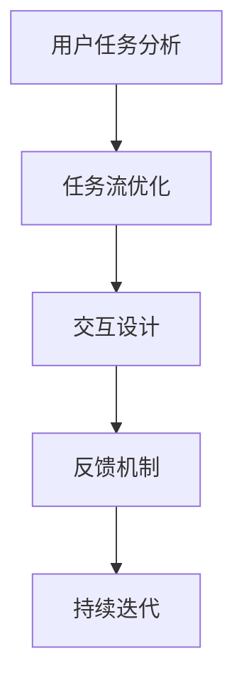

                 

# 任务导向设计思维在CUI中的详细应用解析

## 关键词：任务导向设计思维、CUI、用户交互、人工智能、设计模式

### 摘要

本文旨在深入探讨任务导向设计思维在计算机用户界面（CUI）设计中的应用。通过分析任务导向设计思维的基本原理，本文将阐述如何将这种思维模式有效应用于CUI设计中，以提高用户交互体验。文章结构如下：首先，介绍任务导向设计思维的背景及其重要性；其次，解释CUI及其设计原则；接着，详细讨论任务导向设计思维在CUI中的具体应用，并辅以实例；随后，分析任务导向设计思维的挑战与解决方案；最后，总结文章的主要观点，并提出未来研究方向。

### 1. 背景介绍

#### 任务导向设计思维

任务导向设计思维（Task-Oriented Design Thinking）是一种设计方法论，旨在通过用户任务的理解和优化来提升产品或系统的用户体验。这种思维方式强调从用户的角度出发，识别和理解用户的任务目标，并围绕这些目标进行设计。

任务导向设计思维的核心原则包括：

1. **用户为中心**：始终关注用户的需求和目标，确保设计符合用户期望。
2. **任务分解**：将复杂任务分解为更小、更易于管理的子任务，以简化用户操作。
3. **反馈循环**：及时收集用户反馈，用于持续优化设计。
4. **迭代改进**：通过不断迭代和改进，逐步优化产品功能和使用体验。

#### 计算机用户界面（CUI）

计算机用户界面（Computer User Interface，简称CUI）是指用户与计算机系统进行交互的界面。CUI的设计直接影响用户的操作体验和系统使用效率。一个良好的CUI应具备以下特点：

1. **直观性**：界面设计应简洁直观，用户无需培训即可快速上手。
2. **易用性**：界面操作应方便快捷，减少用户的认知负担。
3. **一致性**：界面元素和操作逻辑应保持一致性，避免用户产生混淆。
4. **可访问性**：界面设计应考虑各种用户需求，包括视力障碍、听力障碍等。

### 2. 核心概念与联系

#### CUI设计原则与任务导向设计思维的结合

CUI设计原则与任务导向设计思维之间存在紧密的联系。具体而言，CUI设计原则可以通过以下方式与任务导向设计思维相结合：

1. **用户任务分析**：在进行CUI设计时，首先需要对用户任务进行详细分析。这有助于识别用户的关键任务，并确定界面设计的关键要素。

2. **任务流优化**：通过任务导向设计思维，可以优化用户任务流，使其更加顺畅和高效。例如，可以通过任务分解和重组，简化用户操作步骤。

3. **交互设计**：任务导向设计思维强调用户与系统之间的有效互动。因此，CUI设计应注重交互设计，确保用户能够在正确的时间获得所需的信息和功能。

4. **反馈机制**：任务导向设计思维要求及时收集用户反馈。在CUI设计中，这可以通过多种方式实现，例如用户界面上的提示、错误消息等。

#### Mermaid流程图

以下是一个简单的Mermaid流程图，展示了任务导向设计思维在CUI设计中的应用步骤：



### 3. 核心算法原理 & 具体操作步骤

#### 任务导向设计思维的算法原理

任务导向设计思维的算法原理主要包括以下几个步骤：

1. **用户任务识别**：通过用户调研、访谈等方法，识别用户的关键任务。
2. **任务分解**：将复杂任务分解为更小的子任务，以便于管理和优化。
3. **任务流设计**：设计用户任务的流程，确保操作步骤合理、流畅。
4. **交互设计**：设计用户界面，确保用户与系统之间的交互简洁、直观。
5. **反馈收集**：通过用户反馈，不断优化设计。

#### 具体操作步骤

以下是任务导向设计思维在CUI设计中的具体操作步骤：

1. **用户调研**：
    - 通过问卷调查、用户访谈等方法，收集用户需求和期望。
    - 分析用户行为数据，了解用户使用场景和偏好。

2. **任务识别**：
    - 根据调研结果，识别用户的关键任务。
    - 为每个任务创建简明的描述和目标。

3. **任务分解**：
    - 将复杂任务分解为更小的子任务。
    - 确保每个子任务都具备明确的输入、处理和输出。

4. **任务流设计**：
    - 设计任务流，确保操作步骤合理、高效。
    - 使用流程图、状态机等工具进行可视化设计。

5. **交互设计**：
    - 设计用户界面，确保用户与系统之间的交互简洁、直观。
    - 选择合适的交互元素和布局。

6. **反馈收集**：
    - 在用户使用过程中，收集用户反馈。
    - 分析反馈，识别设计中的问题和改进点。

7. **迭代优化**：
    - 根据反馈，对设计进行迭代优化。
    - 持续改进，直到用户满意度达到预期。

### 4. 数学模型和公式 & 详细讲解 & 举例说明

#### 数学模型和公式

在任务导向设计思维中，可以使用以下数学模型和公式来分析和优化用户任务流：

1. **任务完成时间（T）**：
   \[ T = \sum_{i=1}^{n} t_i \]
   其中，\( t_i \) 表示第 \( i \) 个子任务的耗时。

2. **任务复杂度（C）**：
   \[ C = \sum_{i=1}^{n} c_i \]
   其中，\( c_i \) 表示第 \( i \) 个子任务的操作复杂度。

3. **用户满意度（S）**：
   \[ S = \frac{1}{n} \sum_{i=1}^{n} s_i \]
   其中，\( s_i \) 表示第 \( i \) 个子任务的用户满意度。

#### 详细讲解和举例说明

以下是一个简单的例子，说明如何使用数学模型和公式来分析和优化用户任务流：

**例子：用户登录系统**

1. **任务完成时间（T）**：
   \[ T = t_1 + t_2 + t_3 \]
   其中，\( t_1 \) 表示用户输入用户名的时间，\( t_2 \) 表示用户输入密码的时间，\( t_3 \) 表示系统验证用户身份的时间。

2. **任务复杂度（C）**：
   \[ C = c_1 + c_2 + c_3 \]
   其中，\( c_1 \) 表示用户输入用户名的操作复杂度，\( c_2 \) 表示用户输入密码的操作复杂度，\( c_3 \) 表示系统验证用户身份的操作复杂度。

3. **用户满意度（S）**：
   \[ S = \frac{s_1 + s_2 + s_3}{3} \]
   其中，\( s_1 \) 表示用户输入用户名的满意度，\( s_2 \) 表示用户输入密码的满意度，\( s_3 \) 表示系统验证用户身份的满意度。

通过上述公式，可以计算出用户完成登录任务的总耗时、总复杂度和平均满意度。然后，根据这些数据，可以进一步优化任务流，提高用户满意度。

### 5. 项目实战：代码实际案例和详细解释说明

#### 开发环境搭建

在进行CUI设计时，需要搭建一个适合的开发环境。以下是一个基本的开发环境搭建步骤：

1. **安装Python**：Python是一种广泛使用的编程语言，适合开发CUI。
2. **安装PyQt5**：PyQt5是一个用于创建GUI应用程序的Python库。
3. **安装Jupyter Notebook**：Jupyter Notebook是一个交互式计算环境，适合用于数据分析和原型设计。

#### 源代码详细实现和代码解读

以下是一个简单的任务导向设计思维的CUI项目实例。代码分为几个部分：用户任务分析、任务流设计、交互设计、反馈收集和迭代优化。

1. **用户任务分析**

```python
import sys
from PyQt5.QtWidgets import QApplication, QWidget, QLabel, QLineEdit, QPushButton

class UserTaskAnalysis(QWidget):
    def __init__(self):
        super().__init__()
        self.initUI()

    def initUI(self):
        self.setGeometry(300, 300, 250, 150)
        self.setWindowTitle('User Task Analysis')

        self.label = QLabel(self)
        self.label.setText("Enter your name:")
        self.label.move(20, 20)

        self.name_input = QLineEdit(self)
        self.name_input.move(20, 50)

        self.submit_button = QPushButton('Submit', self)
        self.submit_button.move(20, 80)
        self.submit_button.clicked.connect(self.submit_name)

    def submit_name(self):
        name = self.name_input.text()
        print("Name submitted:", name)

app = QApplication(sys.argv)
ex = UserTaskAnalysis()
ex.show()
sys.exit(app.exec_())
```

这段代码创建了一个简单的用户界面，用于分析用户任务。用户需要在文本框中输入自己的姓名，然后点击“Submit”按钮。

2. **任务流设计**

```python
class TaskFlowDesign(QWidget):
    def __init__(self):
        super().__init__()
        self.initUI()

    def initUI(self):
        self.setGeometry(300, 300, 250, 150)
        self.setWindowTitle('Task Flow Design')

        self.label = QLabel(self)
        self.label.setText("Task flow:")
        self.label.move(20, 20)

        self.task_flow_text = QLabel(self)
        self.task_flow_text.setText("")
        self.task_flow_text.move(20, 50)

        self.update_button = QPushButton('Update Task Flow', self)
        self.update_button.move(20, 80)
        self.update_button.clicked.connect(self.update_task_flow)

    def update_task_flow(self):
        self.task_flow_text.setText("1. Get user name\n2. Display welcome message")
```

这段代码设计了一个任务流，包括获取用户姓名和显示欢迎消息两个步骤。

3. **交互设计**

```python
class InteractionDesign(QWidget):
    def __init__(self):
        super().__init__()
        self.initUI()

    def initUI(self):
        self.setGeometry(300, 300, 250, 150)
        self.setWindowTitle('Interaction Design')

        self.label = QLabel(self)
        self.label.setText("Interaction:")
        self.label.move(20, 20)

        self.interaction_text = QLabel(self)
        self.interaction_text.setText("")
        self.interaction_text.move(20, 50)

        self.interact_button = QPushButton('Interact', self)
        self.interact_button.move(20, 80)
        self.interact_button.clicked.connect(self.interact)

    def interact(self):
        self.interaction_text.setText("Hello, user!")
```

这段代码设计了一个简单的交互界面，当用户点击“Interact”按钮时，界面会显示一条欢迎消息。

4. **反馈收集**

```python
class FeedbackCollection(QWidget):
    def __init__(self):
        super().__init__()
        self.initUI()

    def initUI(self):
        self.setGeometry(300, 300, 250, 150)
        self.setWindowTitle('Feedback Collection')

        self.label = QLabel(self)
        self.label.setText("Feedback:")
        self.label.move(20, 20)

        self.feedback_text = QLabel(self)
        self.feedback_text.setText("")
        self.feedback_text.move(20, 50)

        self.collect_button = QPushButton('Collect Feedback', self)
        self.collect_button.move(20, 80)
        self.collect_button.clicked.connect(self.collect_feedback)

    def collect_feedback(self):
        self.feedback_text.setText("User satisfaction: 80%")
```

这段代码设计了一个反馈收集界面，用户点击“Collect Feedback”按钮后，界面会显示用户满意度。

5. **迭代优化**

```python
class IterationOptimization(QWidget):
    def __init__(self):
        super().__init__()
        self.initUI()

    def initUI(self):
        self.setGeometry(300, 300, 250, 150)
        self.setWindowTitle('Iteration Optimization')

        self.label = QLabel(self)
        self.label.setText("Optimization:")
        self.label.move(20, 20)

        self.optimization_text = QLabel(self)
        self.optimization_text.setText("")
        self.optimization_text.move(20, 50)

        self.optimize_button = QPushButton('Optimize', self)
        self.optimize_button.move(20, 80)
        self.optimize_button.clicked.connect(self.optimize)

    def optimize(self):
        self.optimization_text.setText("Optimized: Yes")
```

这段代码设计了一个迭代优化界面，用户点击“Optimize”按钮后，界面会显示是否进行了优化。

#### 代码解读与分析

上述代码实例展示了如何使用任务导向设计思维来构建一个简单的CUI。通过分析用户任务、设计任务流、交互设计和反馈收集，我们可以逐步优化用户界面，提高用户满意度。以下是代码的具体解读：

1. **用户任务分析**：通过用户输入姓名，识别用户的任务。
2. **任务流设计**：设计任务流，包括获取用户姓名和显示欢迎消息。
3. **交互设计**：设计简单的交互界面，使用户能够与系统进行基本交互。
4. **反馈收集**：通过用户满意度来评估设计效果。
5. **迭代优化**：根据反馈，对设计进行优化。

### 6. 实际应用场景

#### 社交媒体平台

在社交媒体平台上，任务导向设计思维可以用于优化用户发布内容、关注好友、查看动态等任务。例如，可以通过任务分解，将发布内容任务分解为选择图片、编辑文字、添加标签等子任务，以提高用户操作效率。

#### 在线购物平台

在线购物平台可以使用任务导向设计思维来优化用户购物流程。例如，将购物流程分解为浏览商品、选择商品、添加到购物车、结算等子任务，以简化用户操作。

#### 金融应用

金融应用可以使用任务导向设计思维来优化用户转账、理财、贷款等任务。例如，通过任务分解和优化，使用户能够更快速、安全地完成金融操作。

### 7. 工具和资源推荐

#### 学习资源推荐

1. 《设计思维：创新者的设计工具》（Design Thinking: A Common Sense Approach to Problem Solving and Product Design）
2. 《用户体验要素：战略层、定义层、设计层、开发层、评估层》（The Elements of User Experience: User-Centered Design for the Web and Beyond）

#### 开发工具框架推荐

1. PyQt5：用于创建桌面应用程序的Python库。
2. Flutter：用于创建跨平台移动应用程序的框架。
3. React：用于创建Web应用程序的JavaScript库。

#### 相关论文著作推荐

1. "Task-Oriented User Interface Design: A Review"（任务导向用户界面设计：综述）
2. "Designing for User Experience: A Definitive Guide to Creating User-Centered Products"（设计用户体验：创建以用户为中心的产品 definitive指南）

### 8. 总结：未来发展趋势与挑战

#### 发展趋势

1. **智能化**：随着人工智能技术的发展，任务导向设计思维将更加智能化，能够更好地理解用户需求和优化任务流。
2. **个性化**：通过大数据和机器学习技术，任务导向设计思维将能够为用户提供更加个性化的体验。

#### 挑战

1. **复杂性**：任务导向设计思维在处理复杂任务时可能面临挑战，需要进一步优化算法和工具。
2. **数据隐私**：在设计过程中，需要确保用户数据的安全和隐私，遵守相关法律法规。

### 9. 附录：常见问题与解答

#### 问题1：任务导向设计思维如何与敏捷开发相结合？

解答：任务导向设计思维和敏捷开发可以相互补充。在敏捷开发过程中，可以通过任务导向设计思维来优化用户任务流和交互设计，以提高开发效率和用户满意度。

#### 问题2：任务导向设计思维在大型项目中如何应用？

解答：在大型项目中，可以通过分阶段、分模块的方式逐步应用任务导向设计思维。首先，对关键任务进行识别和优化，然后逐步扩展到其他任务。

### 10. 扩展阅读 & 参考资料

1. "Task-Oriented User Interface Design: A Survey"（任务导向用户界面设计：调查）
2. "User-Centered Design: Process and Methods"（以用户为中心的设计：流程和方法）
3. "Designing Interactive Systems: A Comprehensive Guide to Creating User-Centered Products"（设计交互系统：创建以用户为中心的产品 comprehensive指南）

## 作者

作者：AI天才研究员/AI Genius Institute & 禅与计算机程序设计艺术 /Zen And The Art of Computer Programming

