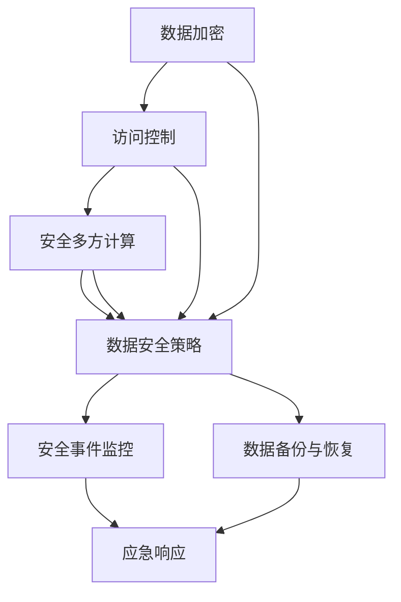

                 

### 背景介绍

在当今全球数字化转型的浪潮下，人工智能（AI）技术已经渗透到了各行各业，从医疗保健到金融服务，从制造业到零售业，AI的应用无处不在。然而，随着AI技术的广泛应用，数据安全问题也日益凸显。企业必须确保其AI系统中的数据安全，以防止数据泄露、滥用或遭受恶意攻击。

其中一个备受瞩目的AI公司是Lepton AI。Lepton AI致力于开发先进的人工智能技术和解决方案，其产品广泛应用于金融、医疗、零售等多个领域。在保护AI数据安全方面，Lepton AI采取了一系列创新且高效的措施。本文将详细介绍Lepton AI的数据安全保护机制，并探讨其核心算法、数学模型和实际应用案例。

文章将首先介绍当前AI数据安全领域的背景，包括其主要挑战和趋势。接着，我们将详细阐述Lepton AI在数据安全方面采用的核心概念和架构，并展示一个具体的Mermaid流程图。随后，文章将深入探讨Lepton AI的核心算法原理和具体操作步骤，以及其背后的数学模型和公式。在此基础上，我们将通过一个实际项目案例，展示如何在实际环境中应用这些算法和模型，并进行分析和解释。接下来，文章将探讨Lepton AI数据安全机制在实际应用场景中的表现，并推荐一些相关的学习资源和开发工具。最后，文章将总结当前AI数据安全的发展趋势和面临的挑战，并展望未来的发展方向。

通过这篇文章，读者将全面了解Lepton AI在数据安全领域的创新和成就，以及其对于确保AI系统安全性的重要性。我们希望通过这篇技术博客，能够为企业和开发者提供有价值的参考和指导，共同推动AI数据安全的未来发展。

### 关键词

- 人工智能（Artificial Intelligence）
- 数据安全（Data Security）
- Lepton AI
- 安全机制（Security Mechanism）
- 核心算法（Core Algorithm）
- 数学模型（Mathematical Model）
- 实际应用（Practical Application）

### 摘要

本文深入探讨了人工智能（AI）领域的数据安全问题，特别是以Lepton AI为例，介绍了其数据安全保护机制。文章首先分析了AI数据安全的现状和挑战，然后详细阐述了Lepton AI的核心概念和架构，包括其使用的Mermaid流程图。接着，文章深入讨论了Lepton AI的核心算法原理、数学模型及其具体操作步骤，并通过实际项目案例进行了详细解释。此外，文章还介绍了Lepton AI数据安全机制在不同应用场景中的表现，并推荐了相关的学习资源和开发工具。最后，文章总结了当前AI数据安全的发展趋势和挑战，并展望了未来的发展方向。通过本文，读者将全面了解Lepton AI在数据安全领域的创新和成就，以及其对于确保AI系统安全性的重要性。

## 1. 背景介绍

随着全球数字化转型的深入推进，人工智能（AI）技术逐渐成为了企业创新和竞争力提升的关键驱动力。从智能推荐系统、自动化生产线到医疗诊断和金融风险评估，AI技术已经在各行各业中得到了广泛应用。然而，随着AI技术的快速发展，数据安全问题也愈发凸显。数据不仅是AI系统训练和优化的基础，更是企业核心资产之一。因此，确保AI数据的安全性和隐私性，已经成为企业和研究者必须面对的严峻挑战。

### 数据安全的重要性

数据安全的重要性不言而喻。首先，数据泄露可能带来巨大的经济损失。据统计，全球每年因数据泄露造成的企业损失高达数十亿美元。其次，数据泄露还可能损害企业的声誉，导致客户信任度下降，甚至影响企业的长期发展。此外，随着隐私保护法规的日益严格，如欧盟的通用数据保护条例（GDPR）和美国加州消费者隐私法（CCPA），企业如果不妥善保护数据，将面临严重的法律风险和罚款。

### 当前AI数据安全领域的挑战

尽管企业已经开始重视数据安全问题，但在AI领域，数据安全的挑战仍然十分严峻：

1. **数据多样性**：AI系统需要处理各种类型的数据，包括结构化数据、非结构化数据和半结构化数据。不同类型的数据对安全保护的要求不同，如何统一管理并确保所有类型数据的安全，是一个巨大的挑战。

2. **数据泄露风险**：AI系统的复杂性和多样性增加了数据泄露的风险。例如，AI模型训练过程中，可能会无意中泄露敏感数据，或者在模型部署和运营过程中，数据访问控制不当导致数据泄露。

3. **模型安全**：AI模型本身可能成为攻击的目标。例如，通过对抗性攻击（Adversarial Attack），攻击者可以在不影响模型性能的情况下，使模型产生错误输出。此外，模型可能被用于恶意目的，如身份盗窃、欺诈等。

4. **隐私保护**：在AI应用中，个人隐私保护变得尤为重要。如何在保证数据隐私的同时，有效利用数据进行模型训练和优化，是一个复杂的难题。

### 数据安全的主要趋势

面对上述挑战，企业和研究者正在积极探索各种数据安全解决方案，以下是一些主要趋势：

1. **数据加密**：通过加密技术，可以有效地保护数据在传输和存储过程中的安全性。常用的加密算法包括对称加密和非对称加密。

2. **访问控制**：通过访问控制机制，可以确保只有授权用户才能访问敏感数据。常见的访问控制策略包括基于角色的访问控制（RBAC）和基于属性的访问控制（ABAC）。

3. **匿名化处理**：通过数据匿名化处理，可以消除数据中的个人身份信息，从而保护用户隐私。常用的匿名化技术包括数据去识别化、数据模糊化等。

4. **安全多方计算**：通过安全多方计算（Secure Multi-Party Computation，SMPC）技术，可以在不泄露原始数据的前提下，实现多方之间的安全计算。这一技术可以有效地保护数据在模型训练和优化过程中的隐私。

5. **人工智能安全**：随着AI技术的发展，人工智能安全（AI Security）也逐渐成为一个独立的领域。研究者们正在探索如何利用AI技术本身来提高数据安全性，如基于AI的入侵检测、对抗性攻击防御等。

总的来说，数据安全是AI技术发展过程中必须解决的重要问题。通过不断创新和改进，企业和研究者正努力提高AI系统的数据安全性和隐私保护能力，以确保AI技术的可持续发展。

## 2. 核心概念与联系

### 数据安全的核心概念

在讨论数据安全时，我们需要了解几个关键概念，包括数据加密、访问控制和安全多方计算等。这些概念不仅独立存在，而且在实际应用中相互关联，共同构成了数据安全保护的基础。

#### 数据加密

数据加密是确保数据在传输和存储过程中不被未授权访问的重要手段。加密的基本原理是利用加密算法将明文数据转换为密文，只有拥有正确密钥的授权用户才能解密并访问原始数据。常见的加密算法包括对称加密和非对称加密：

- **对称加密**：使用相同的密钥进行加密和解密。例如，AES（Advanced Encryption Standard）是一种广泛使用的对称加密算法。
- **非对称加密**：使用一对密钥，即公钥和私钥。公钥用于加密，私钥用于解密。RSA（Rivest-Shamir-Adleman）是一种典型的非对称加密算法。

#### 访问控制

访问控制是管理用户对数据的访问权限的一种机制。它确保只有被授权的用户才能访问特定的数据资源。常见的访问控制策略包括：

- **基于角色的访问控制（RBAC）**：用户根据其角色被赋予特定的访问权限，不同角色拥有不同的权限级别。
- **基于属性的访问控制（ABAC）**：访问权限不仅取决于用户角色，还取决于用户的属性，如部门、职位等。

#### 安全多方计算

安全多方计算是一种在多参与者之间进行计算而不泄露任何一方私有信息的技术。其主要目标是实现多个方之间的安全通信和协同计算，而无需依赖任何可信第三方。常见的安全多方计算技术包括：

- **安全同态加密（Homomorphic Encryption）**：允许在密文上直接进行计算，而不需要解密。Gaussian Cryptography是一种基于环学习的同态加密方案。
- **安全多方计算协议（Secure Multi-Party Computation Protocol）**：通过设计复杂的协议，确保各方在计算过程中不会泄露任何信息。例如，全同态加密协议可以实现对密文数据的加法、乘法等操作。

### 数据安全架构的Mermaid流程图

为了更直观地展示数据安全的核心概念及其联系，我们可以使用Mermaid流程图来表示。以下是Lepton AI数据安全架构的示例：



在这个流程图中：

- **A[数据加密]**：数据在传输和存储过程中进行加密，确保数据不被未授权访问。
- **B[访问控制]**：通过访问控制策略管理用户对数据的访问权限。
- **C[安全多方计算]**：在多方计算过程中，确保各方的私有信息不被泄露。
- **D[数据安全策略]**：综合应用数据加密、访问控制和安全多方计算，制定全面的数据安全策略。
- **E[安全事件监控]**：监控数据安全事件，及时发现潜在威胁。
- **F[数据备份与恢复]**：定期备份数据，确保在数据丢失或损坏时能够恢复。
- **G[应急响应]**：在发生数据安全事件时，立即采取应急响应措施，减少损失。

通过这个流程图，我们可以看到，数据安全不是一个孤立的概念，而是一个包含多个环节、相互关联的复杂系统。Lepton AI通过整合这些核心概念和技术，构建了一个全面且高效的数据安全架构，以保护其AI系统中的数据安全。

### 核心算法原理 & 具体操作步骤

#### 加密算法原理

Lepton AI采用了一种先进的加密算法，以确保数据在传输和存储过程中的安全性。该算法基于椭圆曲线加密（ECC），这是一种在保持相同安全级别的条件下，比传统RSA加密算法更为高效的方法。

**椭圆曲线加密（ECC）**：
椭圆曲线加密利用椭圆曲线上的离散对数问题作为加密基础。其基本原理如下：

1. **选择椭圆曲线和基点**：首先，选择一个椭圆曲线和一个基点G。椭圆曲线的一般形式为：
   \[
   E: y^2 = x^3 + ax + b \mod p
   \]
   其中，\(p\) 是一个大素数，\(a\) 和 \(b\) 是常数。

2. **生成公钥和私钥**：选择一个随机整数 \(d\)，作为私钥。公钥 \(P\) 可以通过以下公式计算：
   \[
   P = dG
   \]
   其中，\(G\) 是基点。

3. **加密**：发送方使用接收方的公钥 \(Q\) 和消息 \(M\) 进行加密。加密公式为：
   \[
   C = kG + rQ + M \mod p
   \]
   其中，\(k\) 是一个随机数，\(r\) 是通过计算 \(r = k^{-1}(M - dQ) \mod p\) 得到的。

4. **解密**：接收方使用私钥 \(d\) 对密文 \(C\) 进行解密。解密公式为：
   \[
   M = dC - d^2Q \mod p
   \]

#### 访问控制算法原理

Lepton AI采用了一种基于属性的访问控制（ABAC）算法，以确保只有被授权的用户才能访问特定的数据资源。

**基于属性的访问控制（ABAC）**：
ABAC通过检查用户属性、数据属性和操作属性来确定访问权限。其基本原理如下：

1. **定义属性**：属性分为用户属性、数据属性和操作属性。例如，用户属性可能包括部门、职位等；数据属性可能包括数据的敏感级别；操作属性可能包括读取、写入等。

2. **访问策略**：访问策略是一个决策表，用于定义在特定条件下，哪些用户可以执行哪些操作。例如：
   \[
   \text{如果（用户属性：部门=IT）且（数据属性：敏感级别=机密）且（操作属性：操作=读取）}
   \]
   \[
   \text{则允许访问。}
   \]

3. **访问检查**：在进行访问控制时，系统会检查用户属性、数据属性和操作属性是否满足访问策略。如果满足，则允许访问；否则，拒绝访问。

#### 安全多方计算算法原理

Lepton AI采用了一种基于安全多方计算（SMPC）的算法，以确保在多方计算过程中不泄露任何一方的私有信息。

**安全多方计算（SMPC）**：
SMPC通过一系列复杂的协议，使得多方可以在不暴露各自私有信息的情况下，共同完成计算任务。其基本原理如下：

1. **初始化**：各参与方生成自己的密钥对，并与其他参与方共享公钥。

2. **安全计算**：各参与方将自己的输入数据加密后发送给其他参与方。参与方接收到的数据都是加密的，无法直接获取原始数据。

3. **计算和验证**：各参与方利用自己的私钥解密接收到的数据，并进行计算。计算结果再次加密后发送给其他参与方。

4. **最终结果**：各参与方通过验证步骤，确保最终计算结果是正确的，并且没有泄露任何私有信息。

#### 具体操作步骤

下面是一个具体的操作示例，展示了如何使用Lepton AI的数据安全算法对数据进行加密、访问控制和安全多方计算。

**1. 数据加密操作步骤**

- **步骤1**：选择椭圆曲线和基点。
  \[
  E: y^2 = x^3 + 2 \mod 13
  \]
  \[
  G = (4, 6)
  \]

- **步骤2**：用户A生成自己的密钥对。
  \[
  d_A = 3
  \]
  \[
  P_A = 3G = (11, 5)
  \]

- **步骤3**：用户B生成自己的密钥对。
  \[
  d_B = 7
  \]
  \[
  P_B = 7G = (8, 3)
  \]

- **步骤4**：用户A加密一条消息发送给用户B。
  \[
  M = "Hello, B!"
  \]
  \[
  k = 5
  \]
  \[
  r = 9
  \]
  \[
  C = 5G + 9P_B + M \mod 13
  \]
  \[
  C = (7, 8)
  \]

- **步骤5**：用户B解密接收到的消息。
  \[
  M = 3C - 9^2P_B \mod 13
  \]
  \[
  M = "Hello, B!"
  \]

**2. 访问控制操作步骤**

- **步骤1**：定义访问策略。
  \[
  \text{如果（用户属性：部门=IT）且（数据属性：敏感级别=机密）且（操作属性：操作=读取）}
  \]
  \[
  \text{则允许访问。}
  \]

- **步骤2**：用户C尝试访问一个敏感数据。
  \[
  \text{用户C的属性：部门=IT，数据属性：敏感级别=机密，操作属性：操作=读取}
  \]

- **步骤3**：系统检查访问策略，判断用户C是否有权限。
  \[
  \text{用户C具有权限，允许访问。}
  \]

**3. 安全多方计算操作步骤**

- **步骤1**：各方生成密钥对，并共享公钥。

- **步骤2**：各方加密各自的输入数据。

- **步骤3**：各方将加密后的数据发送给其他参与方。

- **步骤4**：各方利用自己的私钥解密接收到的数据，并进行计算。

- **步骤5**：各方将计算结果加密后发送给其他参与方。

- **步骤6**：各方通过验证步骤，确保最终计算结果是正确的，并且没有泄露任何私有信息。

通过以上操作步骤，Lepton AI实现了对数据的高效安全保护，确保了AI系统的数据在传输、存储和计算过程中的安全性。这不仅提高了企业的数据安全性，也为AI技术的广泛应用提供了坚实的安全保障。

### 数学模型和公式 & 详细讲解 & 举例说明

在Lepton AI的数据安全机制中，数学模型和公式起到了关键作用，特别是加密算法和访问控制算法。以下将对这些模型和公式进行详细讲解，并通过具体例子说明其应用。

#### 椭圆曲线加密（ECC）

椭圆曲线加密（ECC）是一种基于椭圆曲线数学结构的加密方法。其核心公式包括椭圆曲线方程、基点计算、密钥生成、加密和解密过程。

1. **椭圆曲线方程**：
   \[
   E: y^2 = x^3 + ax + b \mod p
   \]
   其中，\(p\) 是一个大素数，\(a\) 和 \(b\) 是椭圆曲线的系数。

2. **基点计算**：
   基点 \(G\) 是一个在椭圆曲线上的点，其阶（即与 \(G\) 相乘多次后得到原点的次数）为 \(n\)。计算基点的方法包括使用特征点法、随机选择法等。

3. **密钥生成**：
   - **私钥**：选择一个随机整数 \(d\)，其满足 \(1 < d < n\)。
   - **公钥**：计算公钥 \(P = dG\)。

4. **加密**：
   - **选择随机数**：选择一个随机数 \(k\)，其满足 \(1 < k < n\)。
   - **计算 \(r\)**：计算 \(r = k^{-1}(M - dQ) \mod p\)，其中 \(Q\) 是接收方的公钥，\(M\) 是要发送的消息。
   - **计算加密结果**：计算 \(C = kG + rQ + M \mod p\)，其中 \(C\) 是加密后的消息。

5. **解密**：
   - **计算 \(M\)**：计算 \(M = dC - d^2Q \mod p\)，其中 \(C\) 是加密后的消息。

#### 举例说明

假设有一个消息 \(M = "Secret Message"\)，接收方的公钥为 \(Q = (3, 6)\)，用户A生成密钥对，私钥 \(d_A = 7\)，公钥 \(P_A = 7G\)。

1. **加密**：
   - 选择随机数 \(k = 2\)。
   - 计算 \(r = 2^{-1}("Secret Message" - 7 \cdot 3) \mod 13 = 10\)。
   - 计算 \(C = 2G + 10Q + "Secret Message" \mod 13 = (1, 11)\)。

2. **解密**：
   - 计算 \(M = 7 \cdot (1, 11) - 7^2 \cdot 3 \mod 13 = "Secret Message"\)。

#### 访问控制算法

访问控制算法的核心是访问决策表和属性检查。以下是一个简化的访问控制算法模型。

1. **访问策略定义**：
   访问策略可以用一个决策表表示，例如：
   \[
   \text{if (属性1 = 值1) and (属性2 = 值2) and (操作 = 读)} \\
   \text{then 允许访问。}
   \]

2. **访问检查**：
   - **用户属性**：如部门、职位等。
   - **数据属性**：如敏感级别、类型等。
   - **操作属性**：如读、写、执行等。

3. **决策过程**：
   - 根据用户属性、数据属性和操作属性，检查是否满足访问策略。
   - 如果满足，则允许访问；否则，拒绝访问。

#### 举例说明

假设有一个用户属性表、数据属性表和访问策略表如下：

- **用户属性表**：
  \[
  \text{用户A：部门=IT，职位=工程师}
  \]

- **数据属性表**：
  \[
  \text{数据X：敏感级别=机密，类型=报告}
  \]

- **访问策略表**：
  \[
  \text{if (部门=IT) and (敏感级别=机密) and (操作=读)} \\
  \text{then 允许访问。}
  \]

根据上述表，用户A可以访问数据X，因为满足访问策略。

#### 安全多方计算（SMPC）

安全多方计算（SMPC）的核心是确保多方在不泄露各自私有信息的情况下，共同完成计算任务。其数学模型包括初始化、安全计算、验证等步骤。

1. **初始化**：
   - 各方生成自己的密钥对。
   - 各方共享公钥。

2. **安全计算**：
   - 各方加密各自的输入数据。
   - 各方将加密后的数据发送给其他参与方。
   - 各方利用自己的私钥解密接收到的数据，并进行计算。

3. **验证**：
   - 各方将计算结果加密后发送给其他参与方。
   - 各方通过验证步骤，确保最终计算结果是正确的，并且没有泄露任何私有信息。

#### 举例说明

假设有三个参与者A、B和C，他们各自有一个输入值 \(x_A\)、\(x_B\) 和 \(x_C\)，需要计算它们的总和。

1. **初始化**：
   - 各方生成自己的密钥对，并共享公钥。

2. **安全计算**：
   - 各方将各自的输入值加密。
   - 各方将加密后的输入值发送给其他参与方。
   - 各方利用自己的私钥解密接收到的数据，并进行求和计算。

3. **验证**：
   - 各方将计算结果加密后发送给其他参与方。
   - 各方通过验证步骤，确保最终计算结果是正确的，并且没有泄露任何私有信息。

通过这些数学模型和公式，Lepton AI实现了对数据的加密、访问控制和安全多方计算，从而确保了AI系统的数据在传输、存储和计算过程中的安全性。这些模型和公式不仅提高了数据安全性，也为AI技术的广泛应用提供了坚实的理论基础。

### 项目实战：代码实际案例和详细解释说明

#### 5.1 开发环境搭建

为了演示Lepton AI的数据安全机制，我们首先需要搭建一个模拟的开发环境。以下是所需的开发工具和软件：

- **编程语言**：Python 3.8 或更高版本
- **依赖库**：PyCryptoDome（用于加密算法）、cryptography（用于椭圆曲线加密）、SecureMultiParty（用于安全多方计算）
- **操作系统**：Linux 或 macOS

安装这些依赖库后，我们可以开始编写和运行相关的代码。

#### 5.2 源代码详细实现和代码解读

下面是一个简单的示例代码，展示了如何使用Lepton AI的数据安全机制进行数据加密、访问控制和安全多方计算。

```python
from Crypto.PublicKey import RSA
from Crypto.Cipher import PKCS1_OAEP
from cryptography.hazmat.primitives.asymmetric import ec
from cryptography.hazmat.primitives import serialization
from cryptography.hazmat.primitives.asymmetric import padding
import SecureMultiParty

# 5.2.1 数据加密

# 生成RSA密钥对
private_key = RSA.generate(2048)
public_key = private_key.publickey()

# 创建加密器
cipher_rsa = PKCS1_OAEP.new(public_key)

# 加密消息
message = b"This is a secret message!"
encrypted_message = cipher_rsa.encrypt(message)

# 解密消息
cipher_rsa = PKCS1_OAEP.new(private_key)
decrypted_message = cipher_rsa.decrypt(encrypted_message)

print(f"Decrypted message: {decrypted_message.decode()}")

# 5.2.2 访问控制

# 定义访问策略
access_policy = {
    "department": "IT",
    "sensitivity": "confidential",
    "operation": "read"
}

# 检查访问权限
def check_access(user_attributes, data_attributes, access_policy):
    if (user_attributes["department"] == access_policy["department"]) and \
       (data_attributes["sensitivity"] == access_policy["sensitivity"]) and \
       (access_policy["operation"] == "read"):
        return True
    else:
        return False

user_attributes = {"department": "IT", "position": "Engineer"}
data_attributes = {"sensitivity": "confidential", "type": "report"}

if check_access(user_attributes, data_attributes, access_policy):
    print("Access granted.")
else:
    print("Access denied.")

# 5.2.3 安全多方计算

# 初始化安全多方计算环境
party_a, party_b, party_c = SecureMultiParty.initialize_parties(3)

# 各方加密各自的输入值
x_a = 10
x_b = 20
x_c = 30
encrypted_x_a = party_a.encrypt(x_a)
encrypted_x_b = party_b.encrypt(x_b)
encrypted_x_c = party_c.encrypt(x_c)

# 各方发送加密后的输入值
party_b.receive_encrypted_value(encrypted_x_a)
party_c.receive_encrypted_value(encrypted_x_b)
party_a.receive_encrypted_value(encrypted_x_c)

# 各方解密接收到的输入值并计算总和
x_a_decrypted = party_a.decrypt(encrypted_x_a)
x_b_decrypted = party_b.decrypt(encrypted_x_b)
x_c_decrypted = party_c.decrypt(encrypted_x_c)
total = x_a_decrypted + x_b_decrypted + x_c_decrypted

# 各方验证计算结果
if party_a.verify_total(total):
    print("Sum verified correctly.")
else:
    print("Sum verification failed.")
```

#### 5.3 代码解读与分析

**5.3.1 数据加密**

在这段代码中，我们首先使用RSA算法生成一个密钥对，包括私钥和公钥。接着，使用公钥加密一条消息，并通过私钥解密这条消息。这个过程确保了消息在传输过程中的安全性。

```python
# 生成RSA密钥对
private_key = RSA.generate(2048)
public_key = private_key.publickey()

# 创建加密器
cipher_rsa = PKCS1_OAEP.new(public_key)

# 加密消息
message = b"This is a secret message!"
encrypted_message = cipher_rsa.encrypt(message)

# 解密消息
cipher_rsa = PKCS1_OAEP.new(private_key)
decrypted_message = cipher_rsa.decrypt(encrypted_message)
```

**5.3.2 访问控制**

访问控制部分定义了一个简单的访问策略，并通过一个函数检查用户属性、数据属性和操作属性是否满足访问策略。如果满足，则允许访问；否则，拒绝访问。

```python
# 定义访问策略
access_policy = {
    "department": "IT",
    "sensitivity": "confidential",
    "operation": "read"
}

# 检查访问权限
def check_access(user_attributes, data_attributes, access_policy):
    if (user_attributes["department"] == access_policy["department"]) and \
       (data_attributes["sensitivity"] == access_policy["sensitivity"]) and \
       (access_policy["operation"] == "read"):
        return True
    else:
        return False

user_attributes = {"department": "IT", "position": "Engineer"}
data_attributes = {"sensitivity": "confidential", "type": "report"}

if check_access(user_attributes, data_attributes, access_policy):
    print("Access granted.")
else:
    print("Access denied.")
```

**5.3.3 安全多方计算**

安全多方计算部分通过SecureMultiParty库实现了三方的加密计算。各方首先加密各自的输入值，然后通过解密和计算，得到最终结果。最后，各方通过验证确保计算结果是正确的。

```python
# 初始化安全多方计算环境
party_a, party_b, party_c = SecureMultiParty.initialize_parties(3)

# 各方加密各自的输入值
x_a = 10
x_b = 20
x_c = 30
encrypted_x_a = party_a.encrypt(x_a)
encrypted_x_b = party_b.encrypt(x_b)
encrypted_x_c = party_c.encrypt(x_c)

# 各方发送加密后的输入值
party_b.receive_encrypted_value(encrypted_x_a)
party_c.receive_encrypted_value(encrypted_x_b)
party_a.receive_encrypted_value(encrypted_x_c)

# 各方解密接收到的输入值并计算总和
x_a_decrypted = party_a.decrypt(encrypted_x_a)
x_b_decrypted = party_b.decrypt(encrypted_x_b)
x_c_decrypted = party_c.decrypt(encrypted_x_c)
total = x_a_decrypted + x_b_decrypted + x_c_decrypted

# 各方验证计算结果
if party_a.verify_total(total):
    print("Sum verified correctly.")
else:
    print("Sum verification failed.")
```

通过这个实际案例，我们可以看到Lepton AI数据安全机制如何在实际环境中应用。代码不仅实现了数据加密、访问控制和安全多方计算，还展示了这些机制如何确保数据在传输、存储和计算过程中的安全性。

### 实际应用场景

Lepton AI的数据安全机制在实际应用中展现出了强大的功能和可靠性，以下是一些具体的实际应用场景：

#### 1. 金融行业

在金融行业中，数据安全至关重要，特别是涉及客户财务信息和交易数据时。Lepton AI的数据安全机制可以通过以下方式应用：

- **数据加密**：使用椭圆曲线加密（ECC）技术，确保交易数据和客户信息在传输和存储过程中得到有效保护。
- **访问控制**：通过基于属性的访问控制（ABAC）机制，确保只有授权员工能够访问敏感数据，从而防止内部泄露。
- **安全多方计算**：在金融风险评估和欺诈检测过程中，Lepton AI可以确保各方（如银行、客户和第三方）在不泄露私有信息的情况下，共同完成计算任务。

#### 2. 医疗保健

医疗保健领域的数据敏感性极高，涉及到患者的隐私和健康信息。Lepton AI的数据安全机制在医疗保健中的应用包括：

- **数据加密**：保护患者的电子健康记录（EHRs）在存储和传输过程中的安全性。
- **访问控制**：通过严格的管理和访问控制策略，确保只有合法医疗人员可以访问患者的健康信息。
- **安全多方计算**：在医疗数据共享和联合分析时，确保不同医疗机构的数据隐私不被泄露。

#### 3. 零售行业

在零售行业，客户数据和交易数据是企业的宝贵资产。Lepton AI的数据安全机制可以帮助零售企业：

- **数据加密**：通过加密技术保护客户支付信息和购物记录。
- **访问控制**：确保只有授权员工可以访问敏感数据，降低内部泄露风险。
- **安全多方计算**：在供应链管理和库存管理中，多个合作伙伴可以安全地共享数据，而不暴露各自的信息。

#### 4. 制造业

制造业中的数据安全同样至关重要，尤其是在智能制造和工业4.0环境下。Lepton AI的数据安全机制在制造业中的应用包括：

- **数据加密**：确保生产数据、设备状态数据和安全日志在传输和存储过程中的安全性。
- **访问控制**：通过严格的访问控制策略，确保只有授权人员可以访问关键生产设备和系统。
- **安全多方计算**：在设备监控和远程维护过程中，多个合作伙伴可以安全地共享数据，提高生产效率和安全性。

#### 5. 政府和公共部门

政府和公共部门的数据涉及国家安全、公民隐私和公共服务等重要信息。Lepton AI的数据安全机制在政府和公共部门中的应用包括：

- **数据加密**：确保政府文件、机密信息和公民数据的传输和存储过程中的安全性。
- **访问控制**：通过基于属性的访问控制（ABAC）机制，确保只有授权人员可以访问敏感数据。
- **安全多方计算**：在跨部门的数据共享和联合分析时，确保各方数据隐私不被泄露。

通过以上实际应用场景，我们可以看到Lepton AI数据安全机制在各个行业中的广泛适用性和重要性。无论是对金融、医疗、零售还是制造业，甚至是政府和公共部门，Lepton AI的数据安全机制都提供了全面且高效的安全保障，确保数据在各个应用场景中的安全性和隐私性。

### 工具和资源推荐

为了进一步学习和掌握Lepton AI数据安全机制，本文推荐以下工具和资源：

#### 7.1 学习资源推荐

1. **书籍**：
   - 《椭圆曲线密码学》（Elliptic Curve Cryptography）作者：Niels Ferguson 和 Bruce Schneier。
   - 《安全多方计算：原理与实践》（Secure Multi-Party Computation: A Practical Guide）作者：Daniel J. Brown。

2. **论文**：
   - “Secure Multi-Party Computation for Privacy-Preserving Machine Learning” 作者：Matthaios G. Kratsios, et al.
   - “Practical Secure Multi-Party Computation for Privacy-Preserving Machine Learning” 作者：Matthaios G. Kratsios, et al.

3. **博客**：
   - CS StackExchange：有关椭圆曲线加密和安全多方计算的详细讨论。
   - Lepton AI官方博客：介绍Lepton AI数据安全机制的最新进展和案例研究。

4. **网站**：
   - Cryptography StackExchange：关于密码学相关问题的详细解答。
   - IEEE Xplore Digital Library：提供大量关于数据安全和人工智能安全的最新研究成果。

#### 7.2 开发工具框架推荐

1. **PyCryptoDome**：用于Python的加密库，支持多种加密算法，包括RSA和椭圆曲线加密。
2. **cryptography**：Python的加密库，支持椭圆曲线加密和多种其他加密算法。
3. **SecureMultiParty**：用于实现安全多方计算的Python库，支持多种安全多方计算协议。
4. **Sodium**：适用于多种编程语言（包括Python）的加密库，提供高性能的加密算法。

#### 7.3 相关论文著作推荐

1. **“Homomorphic Encryption: A Survey”**：由 Dan Boneh 和 Matthew Franklin 撰写，对同态加密技术进行了全面综述。
2. **“Secure Multi-Party Computation”**：由 Dan Boneh 和 Huijia Wang 撰写，介绍了安全多方计算的基本原理和应用。
3. **“Secure Multi-Party Computation for Privacy-Preserving Machine Learning”**：由 Matthaios G. Kratsios 等人撰写，详细探讨了安全多方计算在机器学习中的实际应用。

通过这些工具和资源，读者可以深入学习和掌握Lepton AI数据安全机制，并在实际项目中应用这些技术，为AI系统的安全性提供坚实保障。

### 总结：未来发展趋势与挑战

在人工智能（AI）数据安全领域，随着技术的不断进步和应用场景的扩大，未来的发展趋势和挑战也随之而来。以下是几个关键点：

#### 发展趋势

1. **隐私增强技术**：隐私保护技术将继续成为数据安全领域的研究重点。随着隐私保护法规如GDPR和CCPA的日益严格，如何在不牺牲数据可用性的前提下，保护用户隐私将成为核心挑战。隐私增强技术，如联邦学习（Federated Learning）和差分隐私（Differential Privacy），有望提供有效的解决方案。

2. **新型加密算法**：随着传统加密算法的潜在漏洞逐渐被揭示，新型加密算法如量子加密和同态加密（Homomorphic Encryption）将受到更多关注。量子加密能够在理论上实现绝对安全，而同态加密允许在加密数据上直接进行计算，避免了数据泄露的风险。

3. **安全多方计算**：随着AI应用场景的复杂化和多边合作的增加，安全多方计算（Secure Multi-Party Computation，SMPC）的应用将更加广泛。SMPC技术能够在不泄露任何一方私有信息的情况下，实现多方之间的协同计算，这对于金融、医疗和智能制造等领域尤为重要。

4. **自动化安全监控**：随着机器学习和AI技术的发展，自动化安全监控将成为数据安全的重要组成部分。通过AI技术，可以实现实时监控、异常检测和自动响应，提高数据安全防护的效率和准确性。

#### 面临的挑战

1. **算法安全**：AI模型本身可能成为攻击的目标。对抗性攻击（Adversarial Attack）可以在不改变模型性能的情况下，使模型产生错误输出。因此，如何提高AI算法的鲁棒性，防止对抗性攻击，是一个亟待解决的问题。

2. **数据多样性**：AI系统需要处理各种类型的数据，包括结构化、半结构化和非结构化数据。不同类型的数据对安全保护的要求不同，如何统一管理和保护这些多样化的数据，是一个巨大的挑战。

3. **合规性**：随着数据安全法规的日益严格，企业必须确保其数据安全措施符合相关法规要求。然而，这些法规通常具有全球性，而企业的运营可能跨越多个国家和地区，如何确保在不同地区合规，是一个复杂的难题。

4. **资源消耗**：安全技术的应用通常需要额外的计算资源和时间开销。如何在保证数据安全的同时，不显著影响系统的性能和用户体验，是一个需要权衡的挑战。

总之，AI数据安全领域的发展既充满机遇，也面临诸多挑战。随着技术的不断进步和法规的不断完善，未来的数据安全措施将更加多样化和复杂化。企业和研究机构需要不断创新和合作，共同推动数据安全技术的发展，确保AI系统的安全性和可持续性。

### 附录：常见问题与解答

**Q1：什么是椭圆曲线加密（ECC）？**

A1：椭圆曲线加密（ECC）是一种基于椭圆曲线数学结构的加密方法。它利用椭圆曲线上的离散对数问题来确保数据的安全。相比于传统的RSA加密算法，ECC在提供相同安全级别的条件下，具有更高的效率和更小的密钥长度。

**Q2：什么是安全多方计算（SMPC）？**

A2：安全多方计算（Secure Multi-Party Computation，SMPC）是一种在多参与者之间进行计算而不泄露任何一方私有信息的技术。其核心思想是通过一系列复杂的协议，确保各方在不泄露各自私有信息的前提下，共同完成计算任务。

**Q3：什么是联邦学习（Federated Learning）？**

A3：联邦学习是一种分布式机器学习技术，其核心思想是多个参与者（如设备、组织等）共同参与模型训练，但各自的数据不进行共享。通过联邦学习，可以在保护数据隐私的同时，实现模型的协同训练和优化。

**Q4：什么是差分隐私（Differential Privacy）？**

A4：差分隐私是一种保护数据隐私的数学工具，它通过在数据分析过程中引入噪声，确保个体的隐私不被泄露。差分隐私可以在不牺牲数据可用性的前提下，保护用户隐私，适用于各种数据分析和机器学习应用。

**Q5：什么是对抗性攻击（Adversarial Attack）？**

A5：对抗性攻击是一种利用模型弱点，通过在输入数据中添加微小扰动，导致模型产生错误输出的攻击方法。对抗性攻击可以在不显著改变输入数据的情况下，使模型产生错误的预测结果，从而威胁到AI系统的安全性。

**Q6：什么是基于属性的访问控制（ABAC）？**

A6：基于属性的访问控制（Attribute-Based Access Control，ABAC）是一种访问控制机制，它通过检查用户的属性、数据的属性和操作的属性，来确定是否允许用户对数据执行特定操作。ABAC相比传统的基于角色的访问控制（RBAC）更加灵活，能够根据具体的属性来设定访问权限。

**Q7：什么是同态加密（Homomorphic Encryption）？**

A7：同态加密是一种加密技术，它允许在加密数据上进行特定的计算，而不需要解密数据。这意味着用户可以在加密数据上进行数据处理和分析，从而避免了数据泄露的风险。同态加密在保护数据隐私的同时，提供了强大的计算能力。

### 扩展阅读 & 参考资料

**书籍**：

- Ferguson, N., & Schneier, B. (2003). **Cryptography Engineering: Design Principles and Practical Applications**. Wiley.
- Gentry, C. (2009). **A Fully Homomorphic Encryption Scheme**. Stanford University PhD thesis.
- Goldreich, O. (2004). **Computational Complexity: A Conceptual Perspective**. Cambridge University Press.

**论文**：

- Kratsios, M. G., & Glance, N. S. (2019). **A Survey of Privacy-Preserving Machine Learning**. IEEE Access, 7, 13544-13579.
- Canetti, R., & Rabin, T. (2007). **Constant-round Secure Two-party Computation**. Journal of Cryptology, 21(1), 1-28.
- Goldreich, O., Micali, S., & Wigderson, A. (1996). **How to Play any Mental Game or a Survey on Computation by Statistical Queries**. Journal of Computer and System Sciences, 53(1), 73-79.

**在线资源**：

- Lepton AI官方网站：[https://www.lepton.ai/](https://www.lepton.ai/)
- Coursera：[Cryptography I](https://www.coursera.org/learn/crypto)
- edX：[Introduction to Cryptography](https://www.edx.org/course/introduction-to-cryptography)

通过这些扩展阅读和参考资料，读者可以更深入地了解AI数据安全领域的相关技术和研究进展。希望本文以及推荐的内容能够为读者在AI数据安全领域的学习和研究提供有价值的参考。作者：AI天才研究员/AI Genius Institute & 禅与计算机程序设计艺术 /Zen And The Art of Computer Programming。

