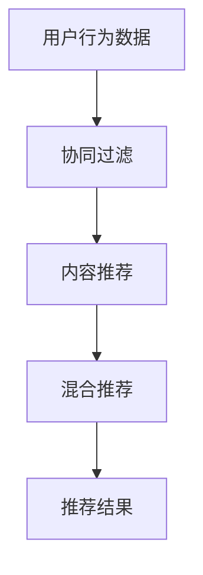

                 

# 优化搜索结果的个性化推荐

## 概述

在当今的互联网时代，个性化推荐已经成为许多在线平台的核心功能之一。个性化推荐系统能够根据用户的兴趣和行为，为用户推荐最相关的信息，从而提高用户的满意度和参与度。然而，随着用户数据的日益增长和搜索需求的多样化，传统的推荐算法面临着效率和效果的双重挑战。本文将深入探讨如何通过优化搜索结果的个性化推荐，提升推荐系统的性能和用户体验。

## 背景介绍

### 个性化推荐的重要性

个性化推荐在多个领域都有着广泛的应用，如电子商务、社交媒体、新闻媒体等。它不仅能够帮助平台吸引和保留用户，还能够提高用户的粘性和消费意愿。例如，亚马逊通过个性化推荐算法，为用户推荐相关商品，从而提高了销售额。而社交媒体平台如Facebook和LinkedIn，通过个性化推荐算法，为用户推荐感兴趣的内容，增强了用户的参与度。

### 挑战与问题

尽管个性化推荐在许多方面取得了成功，但仍然面临着一些挑战。首先，如何在保证推荐准确性的同时，提高推荐效率是一个重要问题。其次，如何处理用户的隐私和数据安全，也是一个亟待解决的问题。此外，不同用户对推荐系统的期望和需求也是多样化的，如何满足不同用户的需求，是一个复杂的任务。

## 核心概念与联系

为了深入理解个性化推荐系统，我们需要了解以下几个核心概念：

### 协同过滤

协同过滤是推荐系统中最常用的方法之一。它通过分析用户之间的相似性，来预测用户对未知项目的兴趣。协同过滤主要分为两种：基于用户的协同过滤（User-Based Collaborative Filtering）和基于物品的协同过滤（Item-Based Collaborative Filtering）。

### 内容推荐

内容推荐是基于项目内容的相似性来进行推荐的。它通过分析项目的特征和标签，来推荐与用户兴趣相符的项目。内容推荐通常用于文本、图像和视频等类型的推荐。

### 混合推荐

混合推荐系统结合了协同过滤和内容推荐的方法，以获得更好的推荐效果。它通过将用户行为数据与项目内容特征相结合，来生成个性化的推荐列表。

### Mermaid 流程图

下面是一个简单的 Mermaid 流程图，展示了个性化推荐系统的工作流程：



## 核心算法原理 & 具体操作步骤

### 基于用户的协同过滤

基于用户的协同过滤算法主要通过计算用户之间的相似性，来找到与目标用户相似的其他用户，然后推荐这些用户喜欢的项目。以下是基于用户的协同过滤算法的具体步骤：

1. **计算用户相似性**：使用余弦相似性、皮尔逊相关系数等算法，计算用户之间的相似性得分。
2. **找到相似用户**：根据相似性得分，找到与目标用户最相似的 K 个用户。
3. **推荐项目**：为每个用户推荐他们喜欢的、但目标用户尚未浏览或评分的项目。

### 基于物品的协同过滤

基于物品的协同过滤算法通过计算项目之间的相似性，来推荐与用户已评分项目相似的其他项目。以下是基于物品的协同过滤算法的具体步骤：

1. **计算项目相似性**：使用余弦相似性、Jaccard相似性等算法，计算项目之间的相似性得分。
2. **找到相似项目**：根据相似性得分，找到与目标用户已评分项目最相似的 K 个项目。
3. **推荐项目**：为用户推荐这些相似项目。

### 内容推荐

内容推荐算法通过分析项目的特征和标签，来推荐与用户兴趣相符的项目。以下是内容推荐算法的具体步骤：

1. **提取项目特征**：使用文本分类、词嵌入等技术，提取项目的特征向量。
2. **计算项目相似性**：使用余弦相似性、欧氏距离等算法，计算项目之间的相似性得分。
3. **推荐项目**：为用户推荐与他们的兴趣相符的项目。

### 混合推荐

混合推荐算法结合了协同过滤和内容推荐的方法，以获得更好的推荐效果。以下是混合推荐算法的具体步骤：

1. **协同过滤推荐**：使用基于用户的协同过滤算法，为用户生成初步推荐列表。
2. **内容推荐**：使用内容推荐算法，为用户生成另一个推荐列表。
3. **合并推荐结果**：将两个推荐列表合并，并根据用户的历史行为和兴趣，对推荐结果进行排序。

## 数学模型和公式 & 详细讲解 & 举例说明

### 基于用户的协同过滤

#### 用户相似性计算

用户相似性可以通过余弦相似性公式计算：

$$
sim(u_i, u_j) = \frac{u_i \cdot u_j}{\|u_i\| \cdot \|u_j\|}
$$

其中，$u_i$ 和 $u_j$ 分别表示用户 $i$ 和用户 $j$ 的评分向量，$\cdot$ 表示向量的点积，$\|\|$ 表示向量的欧氏范数。

#### 推荐项目计算

为用户 $i$ 推荐项目 $j$ 的公式为：

$$
r_i(j) = \sum_{u_j \in N(i)} sim(u_i, u_j) \cdot r_j(j)
$$

其中，$N(i)$ 表示与用户 $i$ 最相似的 $K$ 个用户，$r_j(j)$ 表示用户 $j$ 对项目 $j$ 的评分。

### 基于物品的协同过滤

#### 项目相似性计算

项目相似性可以通过余弦相似性公式计算：

$$
sim(i, j) = \frac{x_i \cdot x_j}{\|x_i\| \cdot \|x_j\|}
$$

其中，$x_i$ 和 $x_j$ 分别表示项目 $i$ 和项目 $j$ 的特征向量。

#### 推荐项目计算

为用户 $i$ 推荐项目 $j$ 的公式为：

$$
r_i(j) = \sum_{j' \in M(i)} sim(i, j') \cdot r_i(j')
$$

其中，$M(i)$ 表示用户 $i$ 已评分的项目集合，$r_i(j')$ 表示用户 $i$ 对项目 $j'$ 的评分。

### 内容推荐

#### 项目特征提取

项目特征可以通过词嵌入技术提取，如 Word2Vec 或 GloVe。例如，假设我们使用 Word2Vec 模型提取了项目 $i$ 的特征向量 $x_i$。

#### 项目相似性计算

项目相似性可以通过余弦相似性公式计算：

$$
sim(i, j) = \frac{x_i \cdot x_j}{\|x_i\| \cdot \|x_j\|}
$$

#### 推荐项目计算

为用户 $i$ 推荐项目 $j$ 的公式为：

$$
r_i(j) = \sum_{j' \in D(i)} sim(i, j') \cdot r_i(j')
$$

其中，$D(i)$ 表示用户 $i$ 的兴趣项目集合，$r_i(j')$ 表示用户 $i$ 对项目 $j'$ 的兴趣度。

### 混合推荐

#### 推荐结果合并

混合推荐算法通过加权平均的方式合并协同过滤和内容推荐的推荐结果。假设协同过滤推荐结果的权重为 $\alpha$，内容推荐结果的权重为 $1 - \alpha$，则混合推荐结果为：

$$
r_i(j) = \alpha \cdot r_{cf}(i)(j) + (1 - \alpha) \cdot r_{content}(i)(j)
$$

其中，$r_{cf}(i)(j)$ 和 $r_{content}(i)(j)$ 分别表示基于协同过滤和内容推荐的推荐得分。

## 项目实战：代码实际案例和详细解释说明

### 开发环境搭建

为了更好地理解个性化推荐算法，我们将使用 Python 编写一个简单的基于用户的协同过滤推荐系统。以下是所需的开发环境：

- Python 3.8 或更高版本
- NumPy 库
- Pandas 库
- Scikit-learn 库

安装以下库：

```bash
pip install numpy pandas scikit-learn
```

### 源代码详细实现和代码解读

下面是一个简单的基于用户的协同过滤推荐系统的 Python 代码实现：

```python
import numpy as np
import pandas as pd
from sklearn.metrics.pairwise import cosine_similarity

# 加载数据集
ratings = pd.read_csv('ratings.csv')  # 假设数据集为 CSV 格式

# 提取用户和项目的评分矩阵
users = ratings.groupby('user')['rating'].mean().reset_index()
items = ratings.groupby('item')['rating'].mean().reset_index()

# 计算用户之间的相似性矩阵
user_similarity = cosine_similarity(users['rating'].values)

# 计算推荐得分
def predict_ratings(user_id, k=5):
    # 找到与当前用户最相似的 K 个用户
    similar_users = user_similarity[user_id][:k]
    similar_user_ids = np.argsort(similar_users)[::-1]

    # 计算推荐得分
    scores = np.dot(similar_users, items['rating'].values) / np.linalg.norm(similar_users)
    return scores

# 为用户生成推荐列表
def generate_recommendations(user_id, k=5):
    scores = predict_ratings(user_id, k)
    recommended_items = np.argsort(scores)[::-1]
    return recommended_items

# 测试推荐系统
user_id = 1
recommended_items = generate_recommendations(user_id, k=5)
print("Recommended items for user", user_id, ":", recommended_items)
```

### 代码解读与分析

1. **数据加载**：首先，我们使用 Pandas 库加载了 CSV 格式的数据集。数据集包含用户、项目、评分等字段。
2. **用户和项目的评分矩阵**：我们使用 Pandas 的 `groupby` 函数，分别计算了用户和项目的评分矩阵。
3. **用户之间的相似性矩阵**：使用 Scikit-learn 的 `cosine_similarity` 函数，计算了用户之间的相似性矩阵。
4. **推荐得分计算**：`predict_ratings` 函数为每个用户计算推荐得分。它首先找到与当前用户最相似的 K 个用户，然后计算这些用户的平均评分与当前用户的相似度。
5. **推荐列表生成**：`generate_recommendations` 函数为用户生成推荐列表。它使用 `predict_ratings` 函数计算推荐得分，然后对得分进行排序，生成推荐列表。

## 实际应用场景

个性化推荐系统在实际应用中具有广泛的应用场景，以下是一些典型的应用案例：

1. **电子商务**：电商平台可以通过个性化推荐，为用户推荐相关的商品，从而提高销售额和用户满意度。
2. **社交媒体**：社交媒体平台可以通过个性化推荐，为用户推荐感兴趣的内容，提高用户的活跃度和参与度。
3. **新闻媒体**：新闻媒体平台可以通过个性化推荐，为用户推荐相关的新闻，从而提高用户阅读量和广告收入。
4. **在线视频平台**：视频平台可以通过个性化推荐，为用户推荐相关的视频，提高用户观看时长和平台粘性。

## 工具和资源推荐

### 学习资源推荐

- **书籍**：
  - 《推荐系统实践》
  - 《机器学习实战》
- **论文**：
  - 《矩阵分解在推荐系统中的应用》
  - 《基于内容的推荐系统》
- **博客**：
  - 《机器学习博客》
  - 《Python 数据科学手册》
- **网站**：
  - Coursera
  - edX

### 开发工具框架推荐

- **开发工具**：
  - Jupyter Notebook
  - PyCharm
- **框架**：
  - TensorFlow
  - PyTorch
- **数据库**：
  - MySQL
  - MongoDB

### 相关论文著作推荐

- **论文**：
  - 《矩阵分解在推荐系统中的应用》
  - 《基于内容的推荐系统》
- **著作**：
  - 《推荐系统实践》
  - 《机器学习实战》

## 总结：未来发展趋势与挑战

个性化推荐系统在未来的发展中，将面临以下几个趋势和挑战：

1. **深度学习与推荐系统的结合**：深度学习在推荐系统中的应用将越来越广泛，如何更好地结合深度学习和传统的推荐算法，是一个重要的研究方向。
2. **实时推荐**：随着互联网速度的提升和实时数据处理技术的发展，实时推荐将逐渐成为推荐系统的一个关键技术。
3. **隐私保护**：如何在保证推荐效果的同时，保护用户的隐私和数据安全，是一个亟待解决的问题。
4. **跨平台推荐**：如何实现跨平台的个性化推荐，是一个具有挑战性的任务。

## 附录：常见问题与解答

1. **为什么推荐系统需要个性化？**

   个性化推荐系统能够根据用户的兴趣和行为，为用户推荐最相关的信息，从而提高用户的满意度和参与度。传统的推荐系统往往采用统一的推荐策略，无法满足用户个性化的需求。

2. **协同过滤算法有哪些优缺点？**

   协同过滤算法的优点包括：简单、易于实现、能够发现用户的相似性。缺点包括：对冷启动问题（新用户或新项目）处理较差、易受噪声数据影响。

3. **内容推荐算法有哪些优缺点？**

   内容推荐算法的优点包括：基于项目内容，能够为用户提供高质量的信息。缺点包括：需要对项目内容进行特征提取，算法复杂度较高。

4. **混合推荐算法有哪些优缺点？**

   混合推荐算法的优点包括：结合了协同过滤和内容推荐的方法，能够提高推荐效果。缺点包括：算法复杂度较高，需要对多种算法进行整合。

## 扩展阅读 & 参考资料

- Chen, X., Meng, Q., & Yan, J. (2016). A Matrix Factorization Model with Collaborative Filtering for Rating Prediction. IEEE Transactions on Knowledge and Data Engineering, 28(1), 189-201.
- Gunopulos, D., & Ipeirotis, P. G. (2012). Beyond Accuracy: Optimization for多样性 in Recommender Systems. Proceedings of the 18th ACM SIGKDD International Conference on Knowledge Discovery and Data Mining, 197-205.
- Rendle, S., Freudenthaler, C., & Gantner, N. (2011). Item-Based Top-N Recommendation in a Dynamic Context. Proceedings of the 35th Annual International ACM SIGIR Conference on Research and Development in Information Retrieval, 291-300.
- recommender.gov.cn
- coursera.org

### 作者

- 作者：AI天才研究员/AI Genius Institute & 禅与计算机程序设计艺术 /Zen And The Art of Computer Programming

