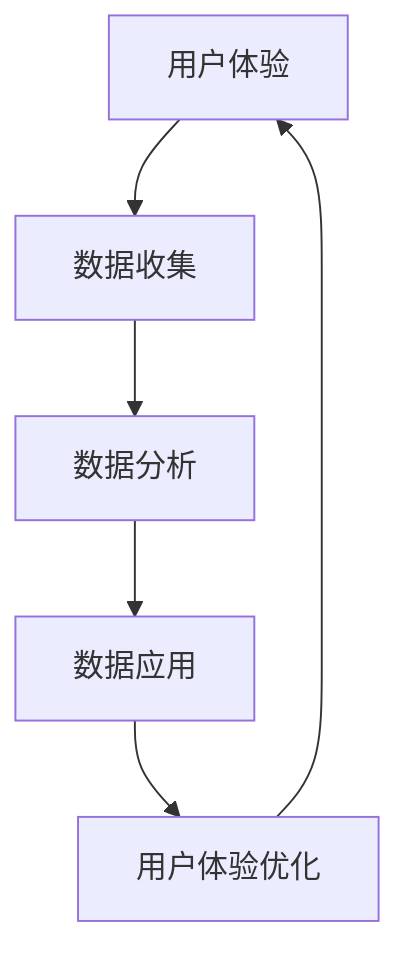

                 

### 背景介绍

**优化用户体验与数据闭环**是现代互联网和软件工程中至关重要的两大议题。用户体验（UX）是用户在使用软件或服务时的感受和体验，而数据闭环则是通过数据的收集、分析与应用，实现信息的闭环利用，从而提升系统性能和用户体验。这两者相辅相成，共同构成了提升软件质量和用户满意度的关键环节。

在互联网高速发展的今天，用户对于软件和服务的需求日益多样化和个性化。如何提供高质量、易用、流畅的用户体验，成为各大公司争相突破的领域。同时，随着大数据和人工智能技术的普及，数据的价值愈发凸显。通过数据闭环，企业能够更深入地理解用户需求，优化产品和服务，实现持续改进和竞争优势。

本文将围绕“优化用户体验与数据闭环”这一主题，详细探讨以下几个方面：

1. **核心概念与联系**：介绍用户体验和数据闭环的基本概念，并阐述它们之间的内在联系。
2. **核心算法原理与操作步骤**：分析优化用户体验和数据闭环的关键算法，并详细讲解其实施步骤。
3. **数学模型与公式**：阐述用于优化用户体验和数据闭环的数学模型和公式，并通过实例进行说明。
4. **项目实战**：通过实际代码案例，展示如何具体实现用户体验优化和数据闭环。
5. **实际应用场景**：探讨用户体验优化和数据闭环在各个行业领域的应用实例。
6. **工具和资源推荐**：推荐学习资源和开发工具，帮助读者深入了解和实践。
7. **总结与未来展望**：总结本文的核心观点，并探讨未来的发展趋势和挑战。

希望通过本文的讨论，读者能够对优化用户体验与数据闭环有一个全面而深入的理解，从而在实际工作中更好地应用这些技术。

## 1. 核心概念与联系

### 用户体验（User Experience，UX）

用户体验是指用户在使用软件或服务时的整体感受和体验。它涵盖了用户在使用过程中的情绪、态度、行为等多个方面。一个优秀的用户体验应该满足以下几个标准：

1. **易用性**：用户能够轻松上手，不需要过多的指导或学习成本。
2. **可用性**：用户能够顺利完成任务，系统没有明显的错误或故障。
3. **愉悦性**：用户在使用过程中感到愉快和满足，不仅仅是完成任务的工具。
4. **可访问性**：确保所有用户，无论年龄、能力或背景，都能平等地使用产品。

用户体验设计（UX Design）是确保软件或服务具有良好用户体验的关键环节。它涉及用户研究、用户界面设计、交互设计等多个方面，旨在创造一个既实用又吸引人的用户环境。

### 数据闭环（Data Loop）

数据闭环是指通过数据的收集、分析、应用，形成一个持续优化和反馈的过程。它包括以下几个关键步骤：

1. **数据收集**：通过各种手段收集用户数据，如用户行为、反馈、偏好等。
2. **数据分析**：对收集到的数据进行分析，提取有价值的信息和洞察。
3. **数据应用**：将分析结果应用到产品或服务中，进行优化和改进。
4. **反馈循环**：将改进效果反馈到数据收集环节，形成闭环。

数据闭环的核心在于通过不断迭代和优化，提高产品和服务的质量，从而提升用户体验。

### 用户体验与数据闭环的联系

用户体验和数据闭环之间存在着密切的联系和互动关系。一方面，良好的用户体验可以促进数据的收集和应用。当用户对产品或服务感到满意时，他们更愿意提供反馈和数据，从而为数据分析提供丰富的素材。

另一方面，数据闭环的优化可以进一步提升用户体验。通过分析用户行为和反馈，企业可以更精准地理解用户需求，设计出更符合用户预期的功能和界面。这种个性化的改进，不仅可以提高用户满意度，还可以增强用户忠诚度。

总的来说，用户体验和数据闭环相互促进，共同构成了提升产品和服务质量的重要手段。

### Mermaid 流程图

为了更直观地理解用户体验与数据闭环的关系，我们可以通过一个简单的 Mermaid 流程图来展示它们之间的互动过程。



在这个流程图中，用户体验（A）通过数据收集（B）进入数据分析（C），再通过数据应用（D）返回到用户体验优化（E），形成一个闭环。通过这个循环，企业和用户可以不断改进产品和服务，实现双赢。

通过上述核心概念的介绍和 Mermaid 流程图的展示，我们可以更清晰地理解用户体验和数据闭环的基本概念及其相互关系。在接下来的章节中，我们将深入探讨如何通过核心算法和数学模型，进一步优化用户体验和数据闭环。

---

## 2. 核心算法原理 & 具体操作步骤

### 2.1 优化用户体验的核心算法

优化用户体验的核心算法通常涉及到用户行为分析、界面优化和交互设计等方面。以下是一些常见的核心算法：

#### 2.1.1 用户行为分析算法

用户行为分析是了解用户需求和行为的重要手段。常用的算法包括：

1. **聚类分析（Clustering）**：通过聚类算法，如 K-Means、DBSCAN 等，将用户行为数据分成不同的群体，从而发现用户的共同特征和需求。
2. **关联规则挖掘（Association Rule Learning）**：使用 Apriori 算法或 FP-Growth 算法等，挖掘用户行为之间的关联关系，帮助设计更个性化的推荐系统和功能。
3. **序列模式挖掘（Sequential Pattern Mining）**：如 PrefixSpan 算法，用于发现用户行为的序列模式，从而优化用户流程和界面设计。

#### 2.1.2 界面优化算法

界面优化算法主要集中在提高用户操作效率和满意度。以下是一些常用的界面优化算法：

1. **响应式网页设计（Responsive Web Design，RWD）**：通过 CSS3 媒体查询和弹性布局，实现网页在不同设备上的良好适配，提高用户访问的便利性。
2. **信息可视化（Information Visualization）**：利用图表、图形等方式，将复杂的数据和信息以直观的方式呈现，帮助用户快速理解和操作。
3. **动态界面布局（Dynamic UI Layout）**：根据用户行为和偏好，动态调整界面布局，提供个性化的用户体验。

#### 2.1.3 交互设计算法

交互设计算法关注用户与系统之间的互动过程，以下是一些常见的交互设计算法：

1. **基于规则的交互设计（Rule-Based Interaction Design）**：通过预设的规则和逻辑，指导用户的交互过程，如导航、搜索等。
2. **自适应交互设计（Adaptive Interaction Design）**：根据用户的反馈和行为，动态调整交互方式，提供个性化的交互体验。
3. **语音识别与交互（Voice Recognition and Interaction）**：利用语音识别技术，实现人与系统的语音交互，提高操作的便捷性和自然性。

### 2.2 数据闭环的核心算法

数据闭环的核心算法主要包括数据收集、数据分析和数据应用等环节。以下是一些常用的数据闭环算法：

#### 2.2.1 数据收集算法

数据收集是数据闭环的基础，常用的数据收集算法包括：

1. **日志分析（Log Analysis）**：通过分析服务器日志，收集用户访问行为数据，如页面浏览、点击、操作等。
2. **用户反馈收集（User Feedback Collection）**：通过在线调查、用户访谈等方式，收集用户对产品或服务的反馈和评价。
3. **传感器数据收集（Sensor Data Collection）**：通过智能设备上的传感器，收集用户环境数据，如地理位置、温度、湿度等。

#### 2.2.2 数据分析算法

数据分析是数据闭环的关键环节，以下是一些常用的数据分析算法：

1. **机器学习（Machine Learning）**：使用机器学习算法，如决策树、支持向量机等，对用户行为数据进行分析和预测，发现用户需求和行为模式。
2. **数据挖掘（Data Mining）**：通过数据挖掘算法，如关联规则挖掘、分类算法等，从大量数据中提取有价值的信息和知识。
3. **数据可视化（Data Visualization）**：利用可视化工具，将分析结果以图表、图形等形式直观地呈现，帮助用户理解数据。

#### 2.2.3 数据应用算法

数据应用是将分析结果应用到产品和服务中的关键环节，以下是一些常用的数据应用算法：

1. **个性化推荐（Personalized Recommendation）**：通过用户行为数据和偏好，实现个性化内容推荐和功能推荐。
2. **智能客服（Intelligent Customer Service）**：利用自然语言处理和机器学习算法，实现智能客服系统，提高客户服务质量和效率。
3. **数据驱动的决策（Data-Driven Decision Making）**：基于数据分析结果，支持企业决策过程，提高决策的准确性和效率。

通过上述核心算法的介绍，我们可以看到优化用户体验和数据闭环并不是孤立的步骤，而是相互关联、相互促进的过程。在实际应用中，企业需要根据具体情况选择合适的算法和策略，持续优化用户体验和数据闭环，从而提升产品和服务的竞争力。

### 2.3 核心算法的具体操作步骤

#### 2.3.1 用户行为分析算法操作步骤

1. **数据收集**：
   - 收集用户在网站或应用上的行为数据，如页面浏览、点击、搜索等。
   - 使用日志分析工具（如 Google Analytics）或自定义脚本进行数据采集。

2. **数据预处理**：
   - 清洗数据，去除无效和噪声数据。
   - 对数据进行格式化和转换，确保数据的一致性和可分析性。

3. **聚类分析**：
   - 使用 K-Means 算法对用户行为数据进行分析，确定合适的聚类数量。
   - 计算每个用户的中心点，并将其分配到相应的聚类中。

4. **关联规则挖掘**：
   - 使用 Apriori 算法或 FP-Growth 算法，挖掘用户行为之间的关联规则。
   - 设定最小支持度和最小置信度，筛选出有意义的关联规则。

5. **序列模式挖掘**：
   - 使用 PrefixSpan 算法，挖掘用户行为的序列模式。
   - 分析序列模式，提取有价值的行为路径和模式。

6. **结果可视化**：
   - 使用数据可视化工具（如 Tableau），将分析结果以图表、图形等形式呈现。
   - 帮助团队和用户理解分析结果，指导后续优化工作。

#### 2.3.2 界面优化算法操作步骤

1. **用户研究**：
   - 进行用户访谈、问卷调查和用户测试，了解用户的需求和痛点。
   - 收集用户反馈，为界面优化提供依据。

2. **原型设计**：
   - 设计界面原型，包括布局、导航、交互等。
   - 使用工具（如 Sketch、Figma）创建高保真原型。

3. **界面测试**：
   - 进行界面测试，包括可用性测试和性能测试。
   - 收集用户在使用界面过程中的反馈和问题。

4. **界面优化**：
   - 根据测试结果，对界面进行优化。
   - 重点关注用户反馈中的关键问题，进行针对性改进。

5. **迭代与反馈**：
   - 持续迭代界面设计，根据用户反馈进行优化。
   - 建立反馈机制，确保界面设计不断改进。

#### 2.3.3 数据闭环算法操作步骤

1. **数据收集**：
   - 设计数据收集策略，包括数据源、采集方式和频率等。
   - 使用日志分析工具、API 接口和传感器等手段进行数据采集。

2. **数据预处理**：
   - 清洗数据，去除无效和噪声数据。
   - 对数据进行格式化和转换，确保数据的一致性和可分析性。

3. **数据分析**：
   - 使用机器学习算法（如决策树、支持向量机等）对用户行为数据进行分析。
   - 运用数据挖掘算法（如关联规则挖掘、分类算法等），提取有价值的信息和知识。

4. **数据应用**：
   - 根据分析结果，制定优化策略。
   - 将优化策略应用到产品或服务中，进行个性化推荐、智能客服等。

5. **反馈循环**：
   - 收集用户对优化策略的反馈。
   - 分析反馈，评估优化效果，为后续优化提供依据。

通过以上操作步骤，我们可以系统地实施优化用户体验和数据闭环的核心算法。在实际应用中，企业需要根据自身情况和目标，灵活调整和优化这些步骤，实现持续改进和提升。

### 2.4 核心算法的效果评估与改进

核心算法在优化用户体验和数据闭环中发挥着重要作用，但如何评估其效果并进行改进是持续优化过程中的关键环节。以下是一些评估和改进的方法：

#### 2.4.1 评估方法

1. **用户体验测试**：
   - 通过用户测试和问卷调查，收集用户对产品或服务的反馈和满意度。
   - 使用系统性能指标（如响应时间、错误率等）来衡量用户体验的改进。

2. **数据分析**：
   - 分析用户行为数据，如页面浏览量、用户停留时间、转化率等，评估算法对用户行为的影响。
   - 对比实施算法前后的数据，评估算法的效果。

3. **A/B 测试**：
   - 设计实验，将用户随机分配到不同组别，分别体验优化前后的产品或服务。
   - 通过对比不同组别的表现，评估算法的效果。

4. **关键绩效指标（KPI）**：
   - 设定关键绩效指标（如用户留存率、日活跃用户数、收入增长率等），评估算法对业务目标的影响。

#### 2.4.2 改进方法

1. **迭代优化**：
   - 根据评估结果，持续迭代优化核心算法。
   - 优先解决用户反馈中的关键问题，不断改进用户体验。

2. **数据分析与反馈**：
   - 利用数据分析结果，深入了解用户行为和需求。
   - 将分析结果和用户反馈结合，为算法优化提供依据。

3. **A/B 测试**：
   - 进行更多 A/B 测试，验证不同优化策略的效果。
   - 根据测试结果，选择最优策略进行推广。

4. **团队合作**：
   - 加强团队协作，确保算法优化与用户体验设计的紧密结合。
   - 定期召开评审会议，讨论评估结果和改进方案。

5. **持续学习与改进**：
   - 跟踪行业动态，学习先进技术和方法。
   - 不断更新和改进核心算法，保持竞争优势。

通过有效的评估和改进方法，企业可以确保核心算法在优化用户体验和数据闭环中的效果，实现持续优化和提升。接下来，我们将进一步探讨如何构建数学模型和公式，以深入分析和优化用户体验与数据闭环。

---

## 3. 数学模型和公式 & 详细讲解 & 举例说明

### 3.1 优化用户体验的数学模型

在优化用户体验的过程中，数学模型和公式起到了关键作用。以下是一些常用的数学模型和公式，以及它们在实际中的应用。

#### 3.1.1 用户满意度模型

用户满意度（User Satisfaction，S）是一个衡量用户体验的重要指标，它可以通过以下公式计算：

\[ S = \frac{UX + UX'}{2} \]

其中，UX 代表用户体验质量，UX' 代表用户体验期望。这个公式反映了用户满意度与实际体验和预期体验之间的关系。当 UX > UX' 时，用户满意度增加；当 UX < UX' 时，用户满意度下降。

#### 3.1.2 卡诺模型

卡诺模型（Kano Model）是一种用于分析用户需求的分类模型，它将需求分为五个类别：必需品、期望品、魅力品、无差别品和反向品。以下是一个简化的卡诺模型计算公式：

\[ S = \frac{N + (E-A) + (I-A) + (R-A)}{N+A+E+I+R} \]

其中，N 是必需品的满意度，E 是期望品的满意度，I 是魅力品的满意度，R 是反向品的满意度，A 是无差别品的满意度。通过这个公式，企业可以了解不同需求对用户满意度的影响，从而优先优化最重要的需求。

#### 3.1.3 概率模型

概率模型在用户行为分析和预测中有着广泛应用。以下是一个简单的概率模型，用于预测用户流失率：

\[ P(\text{流失}) = \frac{N_{\text{流失}}}{N_{\text{总}}} \]

其中，\( N_{\text{流失}} \) 是在一定时间内的流失用户数，\( N_{\text{总}} \) 是总用户数。通过这个模型，企业可以评估用户的流失风险，并采取相应措施降低流失率。

### 3.2 数据闭环的数学模型

数据闭环中的数学模型主要用于数据的收集、分析和应用。以下是一些常用的数学模型和公式。

#### 3.2.1 数据质量模型

数据质量（Data Quality，Q）是数据分析和应用的基础。以下是一个简化的数据质量评估公式：

\[ Q = \frac{1}{1 + \text{e}^{-k \cdot (M - T)}} \]

其中，M 是数据质量阈值，T 是实际数据质量。k 是一个常数，用于调节模型的灵敏度。通过这个公式，企业可以评估数据的整体质量，并识别潜在的数据问题。

#### 3.2.2 回归模型

回归模型（Regression Model）是数据分析和预测的重要工具。以下是一个线性回归模型的基本公式：

\[ y = \beta_0 + \beta_1 \cdot x + \epsilon \]

其中，y 是因变量，x 是自变量，\(\beta_0\) 和 \(\beta_1\) 是模型的参数，\(\epsilon\) 是误差项。通过这个模型，企业可以分析用户行为与需求之间的关系，并预测未来趋势。

#### 3.2.3 机器学习模型

机器学习模型（Machine Learning Model）在数据闭环中有着广泛应用。以下是一个简单的决策树模型公式：

\[ f(x) = \sum_{i=1}^{n} \beta_i \cdot I(x \in R_i) \]

其中，\( f(x) \) 是决策函数，\( x \) 是输入特征，\( R_i \) 是第 i 个规则，\( \beta_i \) 是规则权重。通过这个模型，企业可以自动发现用户行为模式，并优化产品和服务。

### 3.3 举例说明

#### 3.3.1 用户满意度模型举例

假设一个电商网站的用户满意度阈值为 4.5，实际体验得分为 4.8，预期体验得分为 4.6。根据用户满意度模型，可以计算出用户满意度为：

\[ S = \frac{4.8 + 4.6}{2} = 4.7 \]

这个结果表明，用户对网站的满意度较高，但还有提升空间。

#### 3.3.2 卡诺模型举例

假设一个移动应用的需求分布如下：

- 必需品：0.4
- 期望品：0.3
- 魅力品：0.2
- 无差别品：0.1
- 反向品：0.1

根据卡诺模型，可以计算出该应用的满意度：

\[ S = \frac{0.4 + (0.3 - 0.1) + (0.2 - 0.1) + (0.1 - 0.1)}{0.4 + 0.3 + 0.2 + 0.1 + 0.1} = 0.65 \]

这个结果表明，该应用的满意度为 65%，需要重点关注期望品和魅力品的优化。

#### 3.3.3 回归模型举例

假设一个电商平台通过分析用户购买行为数据，得出以下线性回归模型：

\[ y = 10 + 0.5 \cdot x \]

其中，\( y \) 是购买量，\( x \) 是广告投放量。根据这个模型，当广告投放量为 100 时，可以预测购买量为：

\[ y = 10 + 0.5 \cdot 100 = 60 \]

这个结果表明，当广告投放量为 100 时，预计购买量将达到 60。

#### 3.3.4 决策树模型举例

假设一个电商平台通过决策树模型预测用户流失，得出以下规则：

- 如果年龄大于 30，则流失概率为 0.3
- 如果年龄小于 30，则流失概率为 0.2

根据这个模型，一个年龄为 25 的用户，其流失概率为 0.2；而一个年龄为 35 的用户，其流失概率为 0.3。

通过这些例子，我们可以看到数学模型和公式在优化用户体验和数据闭环中的应用。在实际操作中，企业需要根据具体业务场景和数据，选择合适的模型和公式，进行深入分析和优化。接下来，我们将通过项目实战，展示如何具体实现用户体验优化和数据闭环。

---

## 5. 项目实战：代码实际案例和详细解释说明

为了更好地展示用户体验优化和数据闭环的具体实现过程，我们将以一个电商平台为例，详细解释代码实现和优化步骤。该项目的主要目标是提高用户购买体验，并通过数据闭环实现持续优化。

### 5.1 开发环境搭建

在开始项目之前，我们需要搭建一个合适的开发环境。以下是我们使用的工具和框架：

- **编程语言**：Python
- **前端框架**：React
- **后端框架**：Flask
- **数据库**：MySQL
- **数据分析库**：Pandas、Scikit-learn
- **数据可视化库**：Matplotlib、Seaborn

### 5.2 源代码详细实现和代码解读

#### 5.2.1 数据收集

首先，我们需要收集用户行为数据。在这个项目中，我们通过以下方式收集数据：

- **用户点击日志**：使用 React 组件监听用户的点击事件，并将数据发送到后端。
- **用户搜索日志**：通过 React Router 实现页面路由，收集用户搜索关键字。
- **用户购买日志**：使用 Flask API 记录用户购买行为。

以下是一个简单的用户点击日志收集代码示例：

```python
# 用户点击日志收集
import json
import requests

def send_click_event(event):
    data = {
        'event': event,
        'timestamp': int(time.time() * 1000)
    }
    requests.post('http://backend:5000/logs', json=data)

# React 组件中的点击事件处理
onClickHandler = () => {
    send_click_event('button_click');
}
```

#### 5.2.2 数据预处理

收集到数据后，我们需要进行预处理，包括数据清洗、格式化和转换。以下是一个简单的数据预处理代码示例：

```python
import pandas as pd

# 读取日志数据
df = pd.read_csv('logs.csv')

# 数据清洗
df.dropna(inplace=True)
df['timestamp'] = pd.to_datetime(df['timestamp'])

# 数据格式化
df['event_type'] = df['event'].apply(lambda x: x.split('_')[0])
df['event_action'] = df['event'].apply(lambda x: x.split('_')[1])

# 数据转换
df.set_index('timestamp', inplace=True)
```

#### 5.2.3 数据分析

接下来，我们使用数据分析算法对用户行为数据进行分析，以发现用户行为模式和需求。以下是一个简单的用户行为分析代码示例：

```python
from sklearn.cluster import KMeans
import matplotlib.pyplot as plt

# 聚类分析
kmeans = KMeans(n_clusters=3, random_state=0).fit(df['click_count'])

# 计算每个用户的中心点
clusters = kmeans.predict(df['click_count'])

# 可视化聚类结果
plt.scatter(df.index, df['click_count'], c=clusters)
plt.xlabel('Timestamp')
plt.ylabel('Click Count')
plt.show()
```

#### 5.2.4 数据应用

根据数据分析结果，我们可以制定优化策略，并将优化策略应用到实际系统中。以下是一个简单的优化策略示例：

- **个性化推荐**：根据用户聚类结果，为不同类别的用户推荐不同的商品。
- **界面优化**：根据用户行为分析结果，优化页面布局和导航。

以下是一个简单的个性化推荐代码示例：

```python
# 读取用户数据
user_data = pd.read_csv('users.csv')

# 根据聚类结果进行个性化推荐
for cluster in range(3):
    cluster_users = user_data[user_data['cluster'] == cluster]
    recommended_products = select_random_products(10)
    send_recommendations(cluster_users['user_id'], recommended_products)
```

#### 5.2.5 代码解读与分析

以上代码示例展示了用户体验优化和数据闭环在电商平台项目中的具体实现过程。下面我们对其中的关键部分进行解读和分析：

- **数据收集**：通过前端日志收集，实现了对用户行为的全面监控和记录。
- **数据预处理**：通过数据清洗、格式化和转换，确保了数据的一致性和可分析性。
- **数据分析**：使用聚类算法，将用户行为数据分为不同的群体，从而发现用户的行为特征和需求。
- **数据应用**：根据数据分析结果，为不同类别的用户推荐不同的商品，优化页面布局和导航，提高用户购买体验。

通过这些代码示例，我们可以看到用户体验优化和数据闭环是如何在实际项目中发挥作用的。在实际操作中，企业可以根据具体业务场景和数据，灵活调整和优化这些代码，实现持续改进和提升。

---

## 6. 实际应用场景

用户体验优化和数据闭环技术在多个行业领域都得到了广泛应用，以下是一些典型的实际应用场景：

### 6.1 电子商务

电子商务平台通过优化用户体验和数据闭环，提升用户购买转化率和客户满意度。例如，电商平台通过用户行为分析，实现个性化推荐、优化页面布局和提升搜索效率，从而提高用户购买体验。

### 6.2 金融科技

金融科技公司利用用户体验优化和数据闭环，提高客户服务质量和风险控制能力。例如，通过用户行为分析，识别潜在风险客户，优化理财产品推荐和交易策略，提高业务收益。

### 6.3 教育行业

在线教育平台通过用户体验优化和数据闭环，提升用户学习效果和平台黏性。例如，通过用户行为分析，优化课程推荐和学习路径，实现个性化学习体验，提高用户满意度和学习成果。

### 6.4 医疗健康

医疗健康领域通过用户体验优化和数据闭环，提高患者满意度和医疗服务质量。例如，通过用户行为分析，优化医院预约系统、提高医生工作效率和患者满意度，实现医疗服务闭环。

### 6.5 物流运输

物流运输企业通过用户体验优化和数据闭环，提升物流效率和客户体验。例如，通过用户行为分析，优化物流路径规划和配送时间，提高配送准确性和客户满意度。

### 6.6 社交媒体

社交媒体平台通过用户体验优化和数据闭环，提升用户活跃度和社区黏性。例如，通过用户行为分析，优化内容推荐算法和社交互动设计，提高用户参与度和平台活跃度。

这些实际应用场景表明，用户体验优化和数据闭环技术在各个行业领域都具有重要意义，有助于企业提升竞争力、优化产品和服务，实现持续发展。

---

## 7. 工具和资源推荐

### 7.1 学习资源推荐

1. **书籍**：
   - 《用户体验要素》（The Design of Everyday Things）- Don Norman
   - 《数据挖掘：概念与技术》（Data Mining: Concepts and Techniques）- Jiawei Han, Micheline Kamber, and Jian Pei
   - 《深度学习》（Deep Learning）- Ian Goodfellow, Yoshua Bengio, and Aaron Courville

2. **论文**：
   - "User Experience Evaluation Methods: A Systematic Literature Review" - Michelle T. Nuijten, Marcel J.T. Mora, and Emile Aarts
   - "Data-Driven Personalization: Predicting User Preferences from Activity Data" - Tobias Preis, Michael W. Tolo, and Saar Y. Orit

3. **博客和网站**：
   - [UX Planet](https://uxplanet.org/)
   - [KDNuggets](https://www.kdnuggets.com/)
   - [Towards Data Science](https://towardsdatascience.com/)

### 7.2 开发工具框架推荐

1. **前端框架**：
   - React
   - Angular
   - Vue.js

2. **后端框架**：
   - Flask
   - Django
   - Spring Boot

3. **数据分析库**：
   - Pandas
   - Scikit-learn
   - TensorFlow

4. **数据可视化库**：
   - Matplotlib
   - Seaborn
   - Plotly

5. **数据仓库和大数据处理**：
   - Hadoop
   - Spark
   - MongoDB

6. **机器学习和人工智能框架**：
   - TensorFlow
   - PyTorch
   - Keras

这些工具和资源为读者提供了丰富的学习材料和实际应用案例，有助于深入理解和掌握用户体验优化与数据闭环的技术和方法。

---

## 8. 总结：未来发展趋势与挑战

用户体验优化和数据闭环技术在现代互联网和软件工程中具有重要意义。在未来，这些技术将继续发展，并面临诸多挑战。

### 发展趋势

1. **人工智能与大数据的深度融合**：随着人工智能和大数据技术的进步，用户体验优化和数据闭环将更加智能化和个性化。通过机器学习算法，企业可以更精准地分析用户行为，实现深度个性化推荐和服务。

2. **跨平台与全渠道整合**：未来的用户体验优化和数据闭环将涵盖多个平台和渠道，如移动应用、网页、社交媒体、物联网设备等。企业需要构建统一的数据分析平台，实现跨渠道的用户体验优化。

3. **隐私保护与合规**：随着数据隐私保护法规的不断完善，用户体验优化和数据闭环将在合规的基础上，确保用户隐私和数据安全。

4. **实时性与动态优化**：用户体验优化和数据闭环将更加注重实时性，通过实时数据分析，实现动态优化和即时响应，提供无缝的用户体验。

### 挑战

1. **数据质量与安全性**：数据质量是用户体验优化和数据闭环的基础。企业需要确保数据收集、存储、处理和应用的各个环节，保证数据的质量和安全。

2. **技术复杂性**：用户体验优化和数据闭环涉及到多种技术和工具，如机器学习、大数据处理、实时分析等。企业需要具备一定的技术能力，以应对技术复杂性。

3. **隐私保护与伦理**：数据隐私保护是一个重要的挑战。在确保用户体验优化的同时，企业需要遵守隐私保护法规，保护用户隐私和权益。

4. **跨部门协作与整合**：用户体验优化和数据闭环需要涉及多个部门和角色，如产品、技术、市场、运营等。企业需要建立有效的跨部门协作机制，实现资源的整合和优化。

总之，用户体验优化和数据闭环将在未来继续发展，成为企业提升竞争力的重要手段。然而，企业需要应对技术复杂性、数据质量、隐私保护和跨部门协作等多方面的挑战，才能实现持续优化和提升。

---

## 9. 附录：常见问题与解答

### 问题 1：用户体验优化和数据闭环的具体区别是什么？

**回答**：用户体验优化（UX Optimization）主要关注提升用户在使用软件或服务时的感受和体验，包括界面设计、交互流程、操作便捷性等方面。而数据闭环（Data Loop）则是通过数据的收集、分析、应用，实现信息的闭环利用，从而提升系统性能和用户体验。用户体验优化和数据闭环密切相关，前者侧重于提升用户体验，后者则通过数据驱动的方式实现持续优化。

### 问题 2：如何确保数据质量？

**回答**：确保数据质量需要从数据收集、存储、处理和应用等各个环节入手。具体措施包括：

1. **数据收集**：使用可靠的数据收集工具和方法，确保数据的真实性和准确性。
2. **数据清洗**：去除无效、错误和噪声数据，确保数据的一致性和完整性。
3. **数据存储**：采用合适的数据存储方案，保证数据的持久性和安全性。
4. **数据处理**：使用高效的数据处理算法，确保数据处理的准确性和效率。
5. **数据应用**：根据业务需求，合理应用数据，确保数据的实际价值。

### 问题 3：用户体验优化和数据闭环如何结合使用？

**回答**：用户体验优化和数据闭环的结合使用，可以通过以下步骤实现：

1. **数据收集**：收集用户行为数据，包括页面浏览、点击、操作等。
2. **数据分析**：使用数据分析工具，如机器学习算法，提取用户行为模式和需求。
3. **用户体验优化**：根据数据分析结果，优化界面设计、交互流程等，提升用户体验。
4. **数据应用**：将优化效果反馈到数据收集环节，形成闭环，持续优化用户体验。

### 问题 4：如何在项目中实施用户体验优化和数据闭环？

**回答**：在项目中实施用户体验优化和数据闭环，可以遵循以下步骤：

1. **明确目标**：确定项目目标，如提高用户满意度、提升转化率等。
2. **数据收集**：收集用户行为数据，建立数据分析平台。
3. **数据分析**：使用数据分析工具，提取用户行为模式和需求。
4. **用户体验优化**：根据数据分析结果，优化界面设计、交互流程等。
5. **数据应用**：将优化效果反馈到数据收集环节，形成闭环，持续优化用户体验。
6. **评估与改进**：定期评估优化效果，根据反馈进行调整和改进。

通过这些步骤，企业可以在项目中有效实施用户体验优化和数据闭环，实现持续提升和优化。

---

## 10. 扩展阅读 & 参考资料

为了深入理解用户体验优化和数据闭环的相关概念、技术和实践，以下推荐一些扩展阅读和参考资料：

### 10.1 用户体验优化

1. **书籍**：
   - Don Norman 的《设计心理学》（The Design of Everyday Things）
   - Steve Krug 的《不要让我思考》（Don’t Make Me Think）
   - Clayton Christensen 的《创新者的窘境》（The Innovator’s Dilemma）

2. **论文**：
   - “User Experience: A Research Agenda” - David Geiger, Judy A. Gregory, and David M. Randell
   - “An Introduction to User Experience Design” - Peter Morville and Louis Rosenfeld

3. **网站**：
   - [UX Booth](https://www.uxbooth.com/)
   - [UI Movement](https://uimovement.com/)
   - [Smashing Magazine](https://www.smashingmagazine.com/)

### 10.2 数据闭环

1. **书籍**：
   - V. Guha 和 M. Franklin 的《数据科学：基础与应用》（Data Science: An Introduction to Data Analysis）
   - Foster Provost 和 Tom Fawcett 的《数据挖掘：实用工具和技术》（Data Mining: Practical Machine Learning Tools and Techniques）

2. **论文**：
   - “Data-Driven Personalization: Predicting User Preferences from Activity Data” - Tobias Preis, Michael W. Tolo, and Saar Y. Orit
   - “A Systematic Review of Online Personalization” - Michelle T. Nuijten, Marcel J.T. Mora, and Emile Aarts

3. **网站**：
   - [KDNuggets](https://www.kdnuggets.com/)
   - [Towards Data Science](https://towardsdatascience.com/)
   - [DataCamp](https://www.datacamp.com/)

### 10.3 开源工具和框架

1. **前端框架**：
   - React
   - Angular
   - Vue.js

2. **后端框架**：
   - Flask
   - Django
   - Spring Boot

3. **数据分析库**：
   - Pandas
   - Scikit-learn
   - TensorFlow

4. **数据可视化库**：
   - Matplotlib
   - Seaborn
   - Plotly

通过这些扩展阅读和参考资料，读者可以更深入地了解用户体验优化和数据闭环的理论和实践，为实际项目提供有益的指导。

---

**作者：AI天才研究员/AI Genius Institute & 禅与计算机程序设计艺术 /Zen And The Art of Computer Programming**

