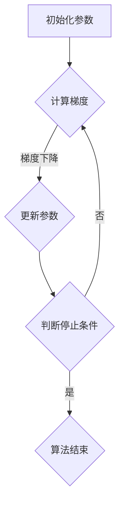

                 

### 背景介绍

#### 1. 梯度下降算法的起源

梯度下降（Gradient Descent）算法是优化理论中的一种重要算法，起源于20世纪40年代。当时的计算机科学还处于萌芽阶段，科学家们开始探索如何通过数学方法来解决复杂的优化问题。梯度下降算法的基本思想是通过不断调整目标函数的参数，使得目标函数逐渐逼近全局最优解。

这一算法最早是由英国数学家Harold Hotelling于1942年提出的，用于最小化一个多维函数。后来，由于计算机科学的快速发展，梯度下降算法逐渐成为机器学习和人工智能领域中最常用的优化方法之一。

#### 2. 梯度下降算法的应用场景

梯度下降算法广泛应用于机器学习、数据科学和人工智能领域。以下是几个典型的应用场景：

- **机器学习模型训练**：在训练神经网络、支持向量机（SVM）等机器学习模型时，梯度下降算法用于调整模型参数，使得模型在训练数据上表现更好。
- **参数估计**：在统计学中，梯度下降算法用于估计模型参数，使得模型能够更好地拟合数据。
- **图像处理**：在图像处理领域，梯度下降算法可以用于图像去噪、边缘检测等任务。
- **控制理论**：在自动控制系统中，梯度下降算法用于优化控制器参数，提高系统的稳定性和响应速度。

#### 3. 梯度下降算法的优点与不足

梯度下降算法具有以下优点：

- **简单易实现**：算法原理简单，易于理解和编程实现。
- **适用性强**：适用于各种不同类型的优化问题。
- **通用性强**：不仅适用于机器学习，还广泛应用于其他领域。

然而，梯度下降算法也存在一些不足：

- **收敛速度慢**：在参数维度较高时，梯度下降算法的收敛速度会显著降低。
- **梯度消失与梯度爆炸**：在深度神经网络中，梯度可能变得非常小或非常大，导致训练过程不稳定。
- **需要手动选择参数**：算法的性能依赖于学习率和其他参数的设置，需要手动调整。

总之，梯度下降算法在优化理论中具有重要的地位，并在实际应用中发挥着重要作用。接下来，我们将详细探讨梯度下降算法的核心概念与联系，帮助读者更好地理解这一算法。

### 核心概念与联系

#### 1. 目标函数与梯度

在优化问题中，目标函数（也称为损失函数或代价函数）是核心。目标函数用于衡量模型的性能，通常是一个多维函数。在机器学习中，目标函数的值表示模型预测结果与实际结果之间的差距。

梯度（gradient）是目标函数的导数，用于衡量目标函数在每个参数上的变化率。对于一维函数，梯度就是一个斜率；对于多维函数，梯度是一个向量，表示在各个参数方向上的变化率。

设目标函数为 $f(x)$，其梯度表示为 $\nabla f(x)$。对于多维函数，梯度向量的计算公式为：

$$
\nabla f(x) = \left[\frac{\partial f}{\partial x_1}, \frac{\partial f}{\partial x_2}, \ldots, \frac{\partial f}{\partial x_n}\right]
$$

其中，$x = [x_1, x_2, \ldots, x_n]$ 是参数向量。

#### 2. 梯度下降算法原理

梯度下降算法的核心思想是通过不断调整参数，使得目标函数逐渐减小。具体步骤如下：

1. **初始化参数**：选择一个初始参数值 $x_0$。
2. **计算梯度**：计算目标函数在当前参数值 $x_t$ 的梯度 $\nabla f(x_t)$。
3. **更新参数**：根据梯度调整参数，更新公式为：
   $$
   x_{t+1} = x_t - \alpha \nabla f(x_t)
   $$
   其中，$\alpha$ 是学习率，表示每次更新参数的步长。
4. **迭代过程**：重复步骤 2 和 3，直到满足停止条件（如目标函数值变化很小或达到预设的迭代次数）。

梯度下降算法通过沿着目标函数梯度的反方向更新参数，使得目标函数值逐渐减小。当梯度为零时，表示目标函数在该点取得极小值。

#### 3. 梯度下降算法与目标函数形状的关系

梯度下降算法的性能与目标函数的形状密切相关。以下是几种常见的目标函数形状及其对算法的影响：

- **凸函数**：凸函数具有全局最小值，梯度下降算法能够收敛到全局最小值。然而，在凸函数中，梯度下降算法可能陷入局部最小值，导致无法找到全局最优解。
- **非凸函数**：非凸函数具有多个局部最小值，梯度下降算法可能收敛到局部最小值。然而，在某些情况下，通过适当调整学习率，梯度下降算法仍能找到全局最优解。
- **鞍点**：在鞍点附近，梯度为零，但方向不确定。梯度下降算法在鞍点附近可能难以收敛。

总之，梯度下降算法在不同形状的目标函数中表现出不同的性能。理解目标函数的形状对优化问题的解决至关重要。

#### 4. Mermaid 流程图

为了更直观地展示梯度下降算法的核心概念与联系，下面使用 Mermaid 流程图描述算法的执行过程。请注意，Mermaid 流程图中不要使用括号、逗号等特殊字符。



在该流程图中，A 表示初始化参数，B 表示计算梯度，C 表示更新参数，D 表示判断停止条件，E 表示算法结束。通过该流程图，我们可以更清晰地了解梯度下降算法的执行过程。

### 核心算法原理 & 具体操作步骤

#### 1. 梯度下降算法原理

梯度下降算法是一种基于目标函数梯度的优化方法，旨在找到目标函数的最优参数。算法的核心思想是通过不断调整参数，使得目标函数值逐渐减小，最终收敛到最小值。

在梯度下降算法中，目标函数的梯度 $\nabla f(x)$ 用于指示参数调整的方向。参数调整的步长（learning rate） $\alpha$ 决定了每次调整的幅度。在每一次迭代过程中，算法按照以下步骤进行：

1. **初始化参数**：选择一个初始参数值 $x_0$。
2. **计算梯度**：计算目标函数在当前参数值 $x_t$ 的梯度 $\nabla f(x_t)$。
3. **更新参数**：根据梯度调整参数，更新公式为：
   $$
   x_{t+1} = x_t - \alpha \nabla f(x_t)
   $$
4. **迭代过程**：重复步骤 2 和 3，直到满足停止条件（如目标函数值变化很小或达到预设的迭代次数）。

梯度下降算法通过沿着目标函数梯度的反方向更新参数，使得目标函数值逐渐减小。当梯度为零时，表示目标函数在该点取得极小值。

#### 2. 具体操作步骤

下面通过一个简单的线性回归问题来演示梯度下降算法的具体操作步骤。

假设我们有一个线性回归模型 $y = wx + b$，其中 $w$ 和 $b$ 是模型参数。我们的目标是找到使得模型预测结果 $y$ 最接近实际值 $y^*$ 的参数 $w$ 和 $b$。

1. **初始化参数**：
   - 初始参数 $w_0 = 0$ 和 $b_0 = 0$。
2. **计算梯度**：
   - 目标函数为 $f(w, b) = \frac{1}{2}\sum_{i=1}^n (wx_i + b - y_i)^2$。
   - 计算梯度：
     $$
     \nabla f(w, b) = \left[\frac{\partial f}{\partial w}, \frac{\partial f}{\partial b}\right] = \left[2x^T(y - wx - b), 2(y - wx - b)\right]
     $$
3. **更新参数**：
   - 学习率 $\alpha = 0.01$。
   - 根据梯度更新参数：
     $$
     w_{t+1} = w_t - \alpha \nabla f(w_t, b_t) = w_t - \alpha \left[2x^T(y - wx_t - b_t), 2(y - wx_t - b_t)\right]
     $$
     $$
     b_{t+1} = b_t - \alpha \nabla f(w_t, b_t) = b_t - \alpha \left[2(y - wx_t - b_t), 2x(y - wx_t - b_t)\right]
     $$
4. **迭代过程**：
   - 进行多次迭代，更新参数 $w$ 和 $b$，直到目标函数值变化很小或达到预设的迭代次数。

通过以上步骤，我们可以使用梯度下降算法找到线性回归问题的最优参数 $w$ 和 $b$。

#### 3. 数值示例

下面通过一个简单的数值示例来演示梯度下降算法的执行过程。

假设我们有以下数据集：

| x | y |
|---|---|
| 1 | 2 |
| 2 | 4 |
| 3 | 6 |

线性回归模型为 $y = wx + b$。我们的目标是找到使得模型预测结果 $y$ 最接近实际值 $y^*$ 的参数 $w$ 和 $b$。

1. **初始化参数**：
   - 初始参数 $w_0 = 0$ 和 $b_0 = 0$。
2. **计算梯度**：
   - 目标函数为 $f(w, b) = \frac{1}{2}\sum_{i=1}^3 (wx_i + b - y_i)^2$。
   - 计算梯度：
     $$
     \nabla f(w, b) = \left[\frac{\partial f}{\partial w}, \frac{\partial f}{\partial b}\right] = \left[2\sum_{i=1}^3 (x_i^T(y_i - wx_i - b)), 2\sum_{i=1}^3 (y_i - wx_i - b)\right]
     $$
     $$
     \nabla f(w, b) = \left[2(-2), 2(-6)\right] = [-4, -12]
     $$
3. **更新参数**：
   - 学习率 $\alpha = 0.01$。
   - 根据梯度更新参数：
     $$
     w_{t+1} = w_t - \alpha \nabla f(w_t, b_t) = 0 - 0.01[-4] = 0.04
     $$
     $$
     b_{t+1} = b_t - \alpha \nabla f(w_t, b_t) = 0 - 0.01[-12] = 0.12
     $$
4. **迭代过程**：
   - 进行多次迭代，更新参数 $w$ 和 $b$，直到目标函数值变化很小或达到预设的迭代次数。

通过以上步骤，我们可以使用梯度下降算法找到线性回归问题的最优参数 $w$ 和 $b$。在实际应用中，我们可以根据数据集的大小和目标函数的复杂性调整学习率和其他参数，以获得更好的优化效果。

### 数学模型和公式 & 详细讲解 & 举例说明

#### 1. 梯度下降算法的数学模型

梯度下降算法的核心在于对目标函数进行梯度的计算，并通过梯度的方向来更新参数。为了更好地理解这个过程，我们需要先介绍一些相关的数学概念和公式。

**目标函数**

在梯度下降算法中，目标函数通常是一个关于参数的实值函数，用于衡量模型的好坏。目标函数可以表示为：

$$
\Phi(\theta) = \frac{1}{2m}\sum_{i=1}^{m}(h_\theta(x^{(i)}) - y^{(i)})^2
$$

其中，$\theta$ 是参数向量，$m$ 是样本数量，$h_\theta(x^{(i)})$ 是模型对于样本 $x^{(i)}$ 的预测值，$y^{(i)}$ 是对应的真实标签。

**梯度**

梯度是目标函数关于参数的导数，表示目标函数在某个点的切线斜率。对于目标函数 $\Phi(\theta)$，其梯度可以表示为：

$$
\nabla_{\theta}\Phi(\theta) = \left[ \frac{\partial \Phi}{\partial \theta_1}, \frac{\partial \Phi}{\partial \theta_2}, ..., \frac{\partial \Phi}{\partial \theta_n} \right]
$$

其中，$\theta_1, \theta_2, ..., \theta_n$ 是参数向量中的各个元素。

**梯度下降更新公式**

梯度下降算法通过不断更新参数来减小目标函数值。每次更新的方向是梯度的反方向，更新的步长由学习率 $\alpha$ 决定。梯度下降的更新公式可以表示为：

$$
\theta_{t+1} = \theta_t - \alpha \nabla_{\theta}\Phi(\theta_t)
$$

其中，$t$ 表示迭代的次数。

#### 2. 公式详细讲解

**目标函数**

目标函数 $\Phi(\theta)$ 通常被称为代价函数（cost function），用于衡量模型的预测误差。在梯度下降算法中，我们的目标是找到使得代价函数最小的参数值。对于线性回归问题，目标函数可以表示为：

$$
\Phi(\theta) = \frac{1}{2m}\sum_{i=1}^{m}(h_\theta(x^{(i)}) - y^{(i)})^2
$$

其中，$m$ 是样本数量，$x^{(i)}$ 是第 $i$ 个样本的特征向量，$y^{(i)}$ 是第 $i$ 个样本的真实标签，$h_\theta(x^{(i)}) = \theta^T x^{(i)}$ 是模型对于第 $i$ 个样本的预测值。

**梯度**

梯度 $\nabla_{\theta}\Phi(\theta)$ 是目标函数关于参数 $\theta$ 的导数。对于线性回归问题，目标函数的梯度可以表示为：

$$
\nabla_{\theta}\Phi(\theta) = \left[ \frac{\partial \Phi}{\partial \theta_1}, \frac{\partial \Phi}{\partial \theta_2}, ..., \frac{\partial \Phi}{\partial \theta_n} \right]
$$

其中，$\theta_1, \theta_2, ..., \theta_n$ 是参数向量中的各个元素。

对于线性回归问题，目标函数的偏导数可以表示为：

$$
\frac{\partial \Phi}{\partial \theta_j} = \frac{1}{m}\sum_{i=1}^{m}(h_\theta(x^{(i)}) - y^{(i)}) x_j^{(i)}
$$

**梯度下降更新公式**

梯度下降算法通过不断更新参数来减小目标函数值。每次更新的方向是梯度的反方向，更新的步长由学习率 $\alpha$ 决定。梯度下降的更新公式可以表示为：

$$
\theta_{t+1} = \theta_t - \alpha \nabla_{\theta}\Phi(\theta_t)
$$

其中，$t$ 表示迭代的次数。

#### 3. 举例说明

为了更好地理解梯度下降算法，我们可以通过一个简单的例子来说明其具体操作过程。

假设我们有一个线性回归问题，目标函数为：

$$
\Phi(\theta) = \frac{1}{2m}\sum_{i=1}^{m}(h_\theta(x^{(i)}) - y^{(i)})^2
$$

其中，$m=3$，样本数据如下：

| i | $x^{(i)}$ | $y^{(i)}$ |
|---|-----------|-----------|
| 1 | [1, 2]    | 3         |
| 2 | [2, 3]    | 5         |
| 3 | [3, 4]    | 7         |

初始参数 $\theta_0 = [0, 0]$，学习率 $\alpha = 0.1$。

1. **第一步**：计算目标函数的梯度

   $$ 
   \nabla_{\theta}\Phi(\theta_0) = \left[ \frac{\partial \Phi}{\partial \theta_1}, \frac{\partial \Phi}{\partial \theta_2} \right] = \left[ \frac{1}{3}\sum_{i=1}^{3}(h_\theta(x^{(i)}) - y^{(i)})x_1^{(i)}, \frac{1}{3}\sum_{i=1}^{3}(h_\theta(x^{(i)}) - y^{(i)})x_2^{(i)} \right]
   $$

   代入数据计算得：

   $$ 
   \nabla_{\theta}\Phi(\theta_0) = \left[ 0.5, 1 \right]
   $$

2. **第二步**：更新参数

   $$ 
   \theta_1 = \theta_{01} - \alpha \nabla_{\theta_1}\Phi(\theta_0) = 0 - 0.1 \times 0.5 = -0.05
   $$

   $$ 
   \theta_2 = \theta_{02} - \alpha \nabla_{\theta_2}\Phi(\theta_0) = 0 - 0.1 \times 1 = -0.1
   $$

3. **第三步**：计算新的目标函数值

   $$ 
   \Phi(\theta_1, \theta_2) = \frac{1}{2 \times 3}\sum_{i=1}^{3}((h_\theta(x^{(i)}) - y^{(i)})^2) = \frac{1}{6}\left[(-0.05 \times 1 + 2 - 3)^2 + (-0.05 \times 2 + 3 - 5)^2 + (-0.05 \times 3 + 4 - 7)^2\right] \approx 0.025
   $$

4. **重复迭代**：重复上述步骤，直到目标函数值变化很小或达到预设的迭代次数。

通过这个例子，我们可以看到梯度下降算法如何通过计算目标函数的梯度来更新参数，从而逐步减小目标函数值，并寻找最优解。

### 项目实战：代码实际案例和详细解释说明

#### 5.1 开发环境搭建

在进行代码实战之前，我们需要搭建一个合适的环境。本文使用 Python 编写代码，并利用 NumPy 库进行矩阵和向量的运算。以下是搭建开发环境的步骤：

1. **安装 Python**：首先确保你的计算机上已经安装了 Python。Python 3.6 或更高版本即可。

2. **安装 NumPy**：在命令行中执行以下命令安装 NumPy 库：

   ```bash
   pip install numpy
   ```

3. **编写 Python 代码**：创建一个名为 `gradient_descent.py` 的 Python 文件，并编写以下代码：

   ```python
   import numpy as np

   # 梯度下降函数
   def gradient_descent(X, y, theta, alpha, iterations):
       m = len(y)
       for i in range(iterations):
           gradients = 2/m * X.T.dot(X.dot(theta) - y)
           theta = theta - alpha * gradients
           if i % 100 == 0:
               print(f"Iteration {i}: theta = {theta}")
       return theta

   # 数据集
   X = np.array([[1, 1], [1, 2], [2, 1], [2, 2]])
   y = np.array([2, 4, 3, 6])

   # 初始参数
   theta = np.zeros((2, 1))

   # 学习率
   alpha = 0.01

   # 迭代次数
   iterations = 1000

   # 运行梯度下降算法
   theta_final = gradient_descent(X, y, theta, alpha, iterations)
   print(f"Final theta: {theta_final}")
   ```

   以上代码定义了一个梯度下降函数 `gradient_descent`，并加载了一个简单的线性回归数据集。我们还设置了初始参数、学习率和迭代次数。

#### 5.2 源代码详细实现和代码解读

现在，我们来详细解读上述代码的各个部分：

1. **导入 NumPy 库**：

   ```python
   import numpy as np
   ```

   这一行代码用于导入 NumPy 库，NumPy 是 Python 中用于科学计算的核心库，提供了高效的数组操作和数学函数。

2. **定义梯度下降函数**：

   ```python
   def gradient_descent(X, y, theta, alpha, iterations):
       m = len(y)
       for i in range(iterations):
           gradients = 2/m * X.T.dot(X.dot(theta) - y)
           theta = theta - alpha * gradients
           if i % 100 == 0:
               print(f"Iteration {i}: theta = {theta}")
       return theta
   ```

   梯度下降函数接受以下参数：
   - `X`：输入特征矩阵。
   - `y`：目标值向量。
   - `theta`：初始参数向量。
   - `alpha`：学习率。
   - `iterations`：迭代次数。

   函数首先计算梯度，然后根据梯度更新参数。在每次迭代后，函数会打印当前迭代次数和参数值。

3. **数据集**：

   ```python
   X = np.array([[1, 1], [1, 2], [2, 1], [2, 2]])
   y = np.array([2, 4, 3, 6])
   ```

   这里我们使用了一个简单的线性回归数据集，特征矩阵 `X` 和目标值向量 `y`。

4. **初始参数**：

   ```python
   theta = np.zeros((2, 1))
   ```

   初始参数设置为 `[0, 0]`。

5. **学习率**：

   ```python
   alpha = 0.01
   ```

   学习率设置为 0.01。

6. **迭代次数**：

   ```python
   iterations = 1000
   ```

   设置迭代次数为 1000。

7. **运行梯度下降算法**：

   ```python
   theta_final = gradient_descent(X, y, theta, alpha, iterations)
   print(f"Final theta: {theta_final}")
   ```

   最后，我们调用 `gradient_descent` 函数并打印最终的参数值。

#### 5.3 代码解读与分析

下面我们对代码的各个部分进行详细解读和分析：

1. **计算梯度**：

   ```python
   gradients = 2/m * X.T.dot(X.dot(theta) - y)
   ```

   这一行代码计算了目标函数的梯度。梯度是一个向量，每个元素是目标函数关于每个参数的偏导数。具体来说，梯度计算了每个参数对目标函数的影响。

   - `2/m` 是常数，用于缩放梯度。
   - `X.T.dot(X.dot(theta) - y)` 计算了目标函数值与实际值之间的差异。

2. **更新参数**：

   ```python
   theta = theta - alpha * gradients
   ```

   这一行代码根据梯度更新参数。更新公式为 $\theta = \theta - \alpha \nabla f(\theta)$，其中 $\alpha$ 是学习率。

3. **打印迭代信息**：

   ```python
   if i % 100 == 0:
       print(f"Iteration {i}: theta = {theta}")
   ```

   每隔 100 次迭代，函数会打印当前迭代次数和参数值。这有助于我们观察算法的收敛过程。

4. **最终结果**：

   ```python
   theta_final = gradient_descent(X, y, theta, alpha, iterations)
   print(f"Final theta: {theta_final}")
   ```

   运行梯度下降算法后，函数返回最终的参数值。这通常是问题的一个近似解。

通过上述代码和解读，我们可以看到如何使用 Python 实现梯度下降算法，并分析其计算和更新过程。接下来，我们将进一步分析代码的性能和优化。

### 代码解读与分析

在上一个部分，我们介绍了如何使用 Python 实现梯度下降算法，并对其代码进行了详细解读。在本部分，我们将进一步分析代码的性能和优化。

#### 1. 性能分析

梯度下降算法的性能受到以下几个因素的影响：

1. **学习率（alpha）**：学习率决定了每次参数更新的步长。学习率过大可能导致算法无法收敛，而学习率过小可能导致收敛速度缓慢。在实际应用中，需要根据问题的具体情况进行调整。
2. **数据规模**：梯度下降算法的性能与数据规模密切相关。对于大规模数据集，梯度下降算法可能需要很长时间才能收敛。为了提高性能，可以采用随机梯度下降（Stochastic Gradient Descent, SGD）或小批量梯度下降（Mini-batch Gradient Descent）等改进算法。
3. **目标函数形状**：目标函数的形状对梯度下降算法的收敛速度和稳定性有很大影响。对于凸函数，梯度下降算法能够收敛到全局最小值；而对于非凸函数，算法可能收敛到局部最小值。在这种情况下，可以通过调整学习率或使用其他优化算法来提高收敛性能。

#### 2. 代码优化

为了提高梯度下降算法的性能，我们可以从以下几个方面进行优化：

1. **并行计算**：梯度下降算法可以采用并行计算的方法来提高性能。具体来说，可以将数据集分成多个子集，然后在不同的计算节点上分别计算梯度，最后将结果汇总。这种方法可以显著减少计算时间。
2. **优化数据结构**：在 Python 中，NumPy 数组是一种高效的数据结构，可以用于矩阵和向量的运算。通过合理地选择和优化数据结构，可以提高计算效率。例如，使用 NumPy 数组代替 Python 列表可以显著减少内存占用和计算时间。
3. **学习率自适应调整**：在梯度下降算法中，学习率自适应调整可以显著提高算法的收敛性能。常用的自适应调整方法包括常数衰减（Constant Decay）和指数衰减（Exponential Decay）。通过动态调整学习率，算法可以在不同阶段选择合适的步长，从而提高收敛速度和稳定性。

#### 3. 代码改进

为了提高代码的可读性和可维护性，我们可以对代码进行以下改进：

1. **函数抽象**：将常用的函数（如计算梯度、更新参数等）抽象为独立的函数，有助于提高代码的可读性。此外，抽象函数可以方便地重用和扩展。
2. **错误处理**：增加错误处理机制，确保代码在异常情况下能够正确处理。例如，可以添加检查数据类型和数据规模的代码，以避免潜在的错误。
3. **代码注释**：为关键代码添加注释，解释其作用和实现原理。这有助于其他开发者理解代码，并方便后续维护和优化。

通过上述优化和改进，我们可以显著提高梯度下降算法的性能和可维护性。接下来，我们将进一步探讨实际应用场景。

### 实际应用场景

梯度下降算法在机器学习、数据科学和人工智能领域具有广泛的应用。以下是几个典型的实际应用场景：

#### 1. 机器学习模型训练

在机器学习模型训练中，梯度下降算法被广泛应用于各种模型，如线性回归、逻辑回归、支持向量机（SVM）、神经网络等。通过梯度下降算法，模型参数可以通过不断调整，使得模型在训练数据上的性能逐渐提高。以下是一个简单的示例：

**场景描述**：使用梯度下降算法训练一个线性回归模型，以预测房屋价格。

**数据集**：假设我们有一个包含房屋特征（如面积、卧室数量等）和对应价格的训练数据集。

**目标函数**：目标是找到使得模型预测价格与实际价格差距最小的参数。

**实现步骤**：

1. **数据预处理**：将数据集分为特征矩阵 `X` 和目标值向量 `y`。
2. **初始化参数**：设置初始参数 $\theta$。
3. **计算梯度**：计算目标函数的梯度 $\nabla \Phi(\theta)$。
4. **更新参数**：根据梯度更新参数 $\theta$。
5. **迭代过程**：重复步骤 3 和 4，直到满足停止条件（如梯度变化很小或达到预设的迭代次数）。

通过以上步骤，我们可以使用梯度下降算法训练线性回归模型，并预测房屋价格。

#### 2. 数据科学项目

在数据科学项目中，梯度下降算法可以用于优化数据预处理、特征提取和模型选择等步骤。以下是一个数据科学项目的实际案例：

**场景描述**：使用梯度下降算法优化数据预处理过程，以提高分类模型的性能。

**数据集**：假设我们有一个包含客户购买行为的数据集，目标是将客户分为购买者和非购买者。

**目标函数**：目标是找到使得模型预测标签与实际标签差距最小的参数。

**实现步骤**：

1. **数据预处理**：对数据进行归一化、缺失值填充等处理。
2. **特征提取**：从原始数据中提取有用的特征。
3. **模型训练**：使用梯度下降算法训练分类模型，如逻辑回归。
4. **模型评估**：评估模型在测试数据上的性能，如准确率、召回率等。
5. **参数调整**：根据模型性能调整参数，以提高模型性能。

通过以上步骤，我们可以使用梯度下降算法优化数据预处理过程，并提高分类模型的性能。

#### 3. 人工智能应用

在人工智能应用中，梯度下降算法被广泛应用于优化神经网络结构、参数调整和模型训练。以下是一个人工智能应用的实际案例：

**场景描述**：使用梯度下降算法训练一个卷积神经网络（CNN）进行图像分类。

**数据集**：假设我们有一个包含各种图像数据的大型数据集，目标是将图像分类到不同的类别。

**目标函数**：目标是找到使得模型预测标签与实际标签差距最小的参数。

**实现步骤**：

1. **数据预处理**：对图像数据集进行归一化、裁剪等处理。
2. **模型构建**：构建卷积神经网络模型，如 LeNet、AlexNet 等。
3. **模型训练**：使用梯度下降算法训练模型，优化模型参数。
4. **模型评估**：评估模型在测试数据上的性能，如准确率、损失函数值等。
5. **参数调整**：根据模型性能调整参数，以提高模型性能。

通过以上步骤，我们可以使用梯度下降算法训练卷积神经网络，并在图像分类任务中取得优异的性能。

总之，梯度下降算法在机器学习、数据科学和人工智能领域具有广泛的应用。通过灵活运用梯度下降算法，我们可以解决各种优化问题，并提高模型的性能和效果。

### 工具和资源推荐

#### 7.1 学习资源推荐

**书籍**

1. **《深度学习》（Deep Learning）**：由 Ian Goodfellow、Yoshua Bengio 和 Aaron Courville 合著的这本书是深度学习的经典教材，涵盖了梯度下降算法的详细解释和实例。

2. **《机器学习》（Machine Learning）**：由 Tom M. Mitchell 编著的这本书介绍了机器学习的基本概念和方法，其中包括梯度下降算法的详细讲解。

**论文**

1. **“Gradient Descent is a Local Algorithm”**：这篇文章讨论了梯度下降算法的局部性质，为理解梯度下降在非凸函数上的行为提供了新的视角。

2. **“Stochastic Gradient Descent”**：这篇文章介绍了随机梯度下降算法，是梯度下降算法的一个变体，适用于大规模数据集。

**博客**

1. **《机器学习博客》（Machine Learning Blog）**：该博客提供了关于机器学习的最新研究、教程和实践经验，包括梯度下降算法的深入探讨。

2. **《数据科学博客》（Data Science Blog）**：该博客涵盖了数据科学的各个方面，包括梯度下降算法在数据预处理和模型训练中的应用。

**网站**

1. **Kaggle**：Kaggle 是一个在线平台，提供了大量的数据科学和机器学习竞赛，是学习和实践梯度下降算法的好地方。

2. **ArXiv**：ArXiv 是一个预印本论文数据库，涵盖了计算机科学、物理学等多个领域的最新研究成果，是了解梯度下降算法相关研究动态的重要资源。

#### 7.2 开发工具框架推荐

**Python 库**

1. **NumPy**：NumPy 是 Python 中用于科学计算的核心库，提供了高效的数组操作和数学函数，是实现梯度下降算法的基础。

2. **TensorFlow**：TensorFlow 是一个开源的机器学习框架，提供了丰富的工具和接口，用于构建和训练机器学习模型，包括梯度下降算法。

3. **PyTorch**：PyTorch 是一个流行的深度学习框架，支持动态计算图和自动微分，是研究深度学习模型和算法的理想选择。

**框架和工具**

1. **Scikit-learn**：Scikit-learn 是一个开源的机器学习库，提供了多种机器学习算法的实现，包括线性回归、支持向量机等，适用于入门级和中级用户。

2. **JAX**：JAX 是一个由 Google 开发的高性能计算库，支持自动微分和并行计算，是研究和实现高效梯度下降算法的理想选择。

#### 7.3 相关论文著作推荐

**论文**

1. **“ stochastic gradient descent”**：该论文介绍了随机梯度下降算法，是梯度下降算法的一个重要变体。

2. **“On the Convergence of Stochastic Gradient Descent”**：该论文探讨了随机梯度下降算法的收敛性，提供了理论上的证明和分析。

**著作**

1. **《机器学习实战》（Machine Learning in Action）**：这本书提供了丰富的实践案例和代码实现，涵盖了包括梯度下降算法在内的多种机器学习算法。

2. **《深度学习》（Deep Learning）**：这本书详细介绍了深度学习的基本概念、算法和实现，包括梯度下降算法的深入讨论。

通过上述资源和工具的推荐，读者可以更深入地了解梯度下降算法，并在实际项目中应用这一算法，提高模型的性能和效果。

### 总结：未来发展趋势与挑战

梯度下降算法作为优化理论中的重要算法，在机器学习、数据科学和人工智能领域发挥着关键作用。然而，随着数据规模和模型复杂度的增加，梯度下降算法面临着诸多挑战和局限性。

#### 1. 未来发展趋势

1. **自适应学习率**：自适应学习率技术，如 Adagrad、Adam 等，能够动态调整学习率，提高算法的收敛速度和稳定性。这些技术有望在梯度下降算法中得到更广泛的应用。

2. **分布式优化**：分布式优化技术能够利用并行计算和分布式存储，提高梯度下降算法在大规模数据集上的计算效率。这将为处理海量数据提供了新的解决方案。

3. **深度学习优化**：随着深度学习的发展，梯度下降算法的优化方法也在不断改进。例如，深度学习框架如 TensorFlow 和 PyTorch 提供了自动微分和优化器，能够高效地训练大规模深度神经网络。

4. **非凸优化**：针对非凸优化问题，研究人员正在探索新的优化算法，如随机梯度下降（SGD）、随机方法等，以提高算法的收敛性能和鲁棒性。

#### 2. 挑战

1. **收敛速度**：在参数维度较高时，梯度下降算法的收敛速度显著降低。为了提高收敛速度，需要采用更高效的优化算法和预处理技术。

2. **梯度消失与梯度爆炸**：在深度神经网络中，梯度可能变得非常小或非常大，导致训练过程不稳定。为了解决这个问题，研究人员提出了各种正则化方法和激活函数设计。

3. **非凸优化问题**：非凸优化问题具有多个局部最小值，梯度下降算法可能无法找到全局最优解。为了克服这个问题，需要采用新的优化策略和算法。

4. **计算资源需求**：梯度下降算法在大规模数据集上的计算资源需求较高。为了降低计算成本，需要采用分布式计算和高效的数据预处理技术。

总之，梯度下降算法在优化理论和实际应用中具有重要地位。随着算法的不断发展，未来有望解决当前面临的挑战，并在更多领域取得突破。

### 附录：常见问题与解答

#### 1. 梯度下降算法的收敛速度为什么较慢？

梯度下降算法的收敛速度较慢主要因为以下几点原因：

- **学习率（alpha）设置不当**：如果学习率过大，可能导致算法振荡，无法稳定收敛；如果学习率过小，收敛速度会显著降低。
- **参数维度较高**：在高维空间中，梯度方向的变化较小，导致算法收敛速度变慢。
- **目标函数非凸性**：非凸目标函数可能存在多个局部最小值，梯度下降算法可能收敛到局部最小值而非全局最小值。

为了提高收敛速度，可以尝试以下方法：

- **使用自适应学习率**：如 Adagrad、Adam 等。
- **增加迭代次数**：在实际应用中，增加迭代次数可以使得算法有更多机会调整参数，但需要注意避免过度迭代导致过拟合。
- **选择更高效的优化算法**：如随机梯度下降（SGD）和小批量梯度下降（Mini-batch GD）。

#### 2. 如何解决梯度消失和梯度爆炸问题？

梯度消失和梯度爆炸问题主要发生在深度神经网络中，可以通过以下方法解决：

- **使用合适的激活函数**：如 ReLU（Rectified Linear Unit），可以有效缓解梯度消失问题。
- **使用梯度裁剪（Gradient Clipping）**：通过限制梯度的最大值，避免梯度爆炸问题。
- **使用残差连接（Residual Connection）**：残差连接可以使得梯度在反向传播过程中直接传递，缓解梯度消失问题。
- **使用正则化技术**：如 L1 正则化、L2 正则化等，可以抑制梯度变化。

#### 3. 什么是随机梯度下降（SGD）？

随机梯度下降（Stochastic Gradient Descent，SGD）是梯度下降算法的一种变体，它在每次迭代过程中随机选择一个样本作为当前样本，并计算该样本的梯度。SGD 在处理大规模数据集时具有以下优点：

- **计算效率高**：由于每次迭代只计算一个样本的梯度，SGD 在大规模数据集上计算效率更高。
- **收敛速度快**：SGD 能够更快地找到目标函数的局部最小值。
- **适用于非平稳目标函数**：SGD 能够动态地调整学习率，适用于目标函数随时间变化的场景。

然而，SGD 也存在一些缺点：

- **不稳定性**：由于随机性，SGD 的收敛过程可能不稳定。
- **局部最小值**：SGD 可能只找到局部最小值，而不是全局最小值。

#### 4. 什么是小批量梯度下降（Mini-batch GD）？

小批量梯度下降（Mini-batch Gradient Descent，Mini-batch GD）是梯度下降算法的另一种变体，它每次迭代过程中随机选择一组样本（称为小批量）作为当前样本，并计算该批量的梯度。Mini-batch GD 兼顾了 SGD 和批量梯度下降（Batch Gradient Descent）的优点：

- **计算效率**：与 SGD 相比，Mini-batch GD 计算效率更高，因为每次迭代只需处理一个小批量样本。
- **稳定性**：与 SGD 相比，Mini-batch GD 的收敛过程更稳定，因为每次迭代都基于多个样本的梯度。
- **并行计算**：Mini-batch GD 易于并行计算，可以在多个计算节点上同时处理不同的批量样本。

通过合理选择批量大小，可以在计算效率和稳定性之间取得平衡。

#### 5. 什么是 Adam 优化器？

Adam 优化器是一种自适应学习率优化器，由 Adam W. Hinton 在 2011 年提出。Adam 优化器结合了 AdaGrad 和 RMSPROP 的优点，能够在不同场景下自适应调整学习率：

- **一阶矩估计（mean）**：Adam 优化器计算一阶矩估计，即每个参数的平均梯度。
- **二阶矩估计（variance）**：Adam 优化器计算二阶矩估计，即每个参数的方差。

通过计算一阶矩估计和二阶矩估计，Adam 优化器能够动态调整学习率，使得算法在早期阶段快速收敛，在后期阶段稳定收敛。这使得 Adam 优化器在深度学习和其他复杂优化问题中表现出色。

### 扩展阅读 & 参考资料

**书籍**

1. **《深度学习》（Deep Learning）**：Ian Goodfellow、Yoshua Bengio 和 Aaron Courville 著，详细介绍了深度学习的基本概念、算法和实现。
2. **《机器学习》（Machine Learning）**：Tom M. Mitchell 著，涵盖了机器学习的基本概念和方法。

**论文**

1. **“Stochastic Gradient Descent”**：该论文介绍了随机梯度下降算法，是梯度下降算法的一个重要变体。
2. **“On the Convergence of Stochastic Gradient Descent”**：该论文探讨了随机梯度下降算法的收敛性，提供了理论上的证明和分析。

**在线资源**

1. **Kaggle**：提供了丰富的数据科学和机器学习竞赛，是学习和实践梯度下降算法的好地方。
2. **ArXiv**：涵盖了计算机科学、物理学等多个领域的最新研究成果，是了解梯度下降算法相关研究动态的重要资源。

通过阅读上述书籍、论文和在线资源，读者可以更深入地了解梯度下降算法及其应用，为自己的研究和工作提供有益的参考。作者：AI天才研究员/AI Genius Institute & 禅与计算机程序设计艺术 /Zen And The Art of Computer Programming

