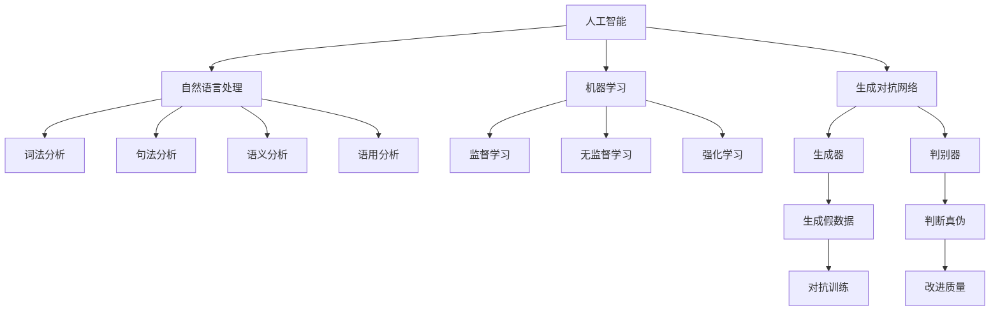

                 

### 背景介绍

《体验叙事工作室：AI驱动的个人故事创作坊》这篇文章旨在探讨人工智能（AI）在个人故事创作中的应用及其带来的变革。随着技术的不断进步，人工智能逐渐渗透到我们生活的各个方面，从智能家居到自动驾驶，再到医疗诊断，AI的影响力无处不在。在这个背景下，个人故事创作作为一个独特的领域，也逐渐引起了人们的关注。

在传统的个人故事创作中，作者需要依靠自己的经验和技巧来构建情节、刻画人物、描绘场景。然而，这种方式往往存在一定的局限性，特别是在处理复杂情节和多样化角色时，创作者的想象力和精力可能会受到挑战。而AI的出现，为个人故事创作提供了一种全新的可能性。

首先，AI能够帮助创作者快速生成故事的骨架和初步框架，从而节省时间和精力。通过机器学习和自然语言处理技术，AI可以从大量的文本数据中学习到不同类型的故事结构和角色设定，进而生成符合用户需求的故事大纲。此外，AI还能够根据创作者的反馈和需求，对故事进行逐步调整和完善，使最终作品更加贴近创作者的意图。

其次，AI在个人故事创作中的应用还能够提高故事的创新性和独特性。传统的创作方式往往容易陷入固有的模式，而AI则能够从海量数据中提取出新的元素和创意，为故事注入新的活力。例如，通过分析不同文化背景和时代背景下的故事，AI可以创造出跨越时空的独特故事，使读者在阅读过程中感受到前所未有的新奇和震撼。

最后，AI在个人故事创作中的应用还能够提升故事的互动性和参与性。借助人工智能技术，创作者可以设计出更加丰富和多变的故事情节，使读者能够在故事中扮演不同的角色，参与到故事的发展中。这种互动性的提升，不仅能够增强读者的阅读体验，还能够激发他们的创造力和想象力，使个人故事创作成为一种更加有趣和富有挑战性的活动。

总之，随着人工智能技术的不断发展，个人故事创作正面临着一场前所未有的变革。本文将深入探讨AI在个人故事创作中的应用，分析其优势与挑战，并展望未来发展的趋势。希望通过这篇文章，能够为创作者们带来新的启示和灵感，共同推动个人故事创作的发展。

### 核心概念与联系

在深入探讨AI驱动个人故事创作之前，我们需要了解一些核心概念和它们之间的联系。这些概念包括人工智能、自然语言处理、机器学习、生成对抗网络（GAN）等。下面，我们将逐一介绍这些概念，并通过Mermaid流程图展示它们之间的关系。

#### 人工智能（AI）

人工智能是一种模拟人类智能的技术，旨在使计算机具备感知、学习、推理和决策等能力。人工智能可以分为两大类：基于规则的系统和基于数据的学习系统。基于规则的系统通过预先定义的规则来执行任务，而基于数据的学习系统则通过从数据中学习模式和规律来完成任务。

#### 自然语言处理（NLP）

自然语言处理是人工智能的一个重要分支，专注于使计算机能够理解、解释和生成人类语言。NLP的核心技术包括词法分析、句法分析、语义分析和语用分析。词法分析是将文本分解为单词和其他基本元素，句法分析是构建句子的语法结构，语义分析是理解句子中的意义，而语用分析则是研究语言在实际使用中的功能。

#### 机器学习（ML）

机器学习是一种使计算机通过数据学习并改进性能的技术。它包括监督学习、无监督学习和强化学习等不同的学习方法。监督学习使用已标记的数据来训练模型，无监督学习不使用标记数据，而是从数据中发现隐藏的结构，强化学习则是通过试错和反馈来训练模型。

#### 生成对抗网络（GAN）

生成对抗网络是一种由生成器和判别器组成的深度学习模型。生成器生成假数据，判别器判断这些数据是真实数据还是生成数据。通过对抗训练，生成器不断提高生成数据的质量，使其越来越接近真实数据。

#### Mermaid流程图

下面是一个Mermaid流程图，展示了这些核心概念之间的关系：



通过这个流程图，我们可以清晰地看到人工智能是如何通过自然语言处理、机器学习和生成对抗网络等技术，来实现对个人故事创作的支持和提升。

### 核心算法原理 & 具体操作步骤

在了解了核心概念和它们之间的联系后，接下来我们将深入探讨AI驱动个人故事创作中的核心算法原理和具体操作步骤。这些算法包括生成式对抗网络（GAN）、深度学习和文本生成模型等。以下是这些算法的基本原理和操作步骤。

#### 生成式对抗网络（GAN）

生成式对抗网络（GAN）是一种由生成器和判别器组成的深度学习模型。生成器的任务是生成与真实数据相似的数据，而判别器的任务是判断数据是真实数据还是生成数据。两者相互对抗，通过不断训练，生成器的生成数据质量逐渐提高，使其越来越接近真实数据。

**具体操作步骤：**

1. **初始化生成器和判别器：** 首先，我们需要初始化生成器和判别器。生成器通常是一个多层感知机（MLP），而判别器是一个二元分类器。
2. **生成数据：** 生成器从随机噪声中生成数据。这些数据是模拟真实数据的，但通常质量较低。
3. **判断数据：** 判别器接收真实数据和生成数据，并判断它们是真实数据还是生成数据。
4. **对抗训练：** 通过优化生成器和判别器的参数，使得生成器的生成数据质量逐渐提高，而判别器的判断准确性也逐渐提高。
5. **迭代：** 重复上述步骤，直到生成器的生成数据质量达到预期。

**数学模型：**

GAN的数学模型可以表示为以下两个概率分布：

- $P_{\text{data}}(x)$：真实数据的概率分布。
- $P_{\text{model}}(x|\theta_G)$：生成器的概率分布。

生成器和判别器的损失函数可以分别表示为：

- $L_G = \mathbb{E}_{x \sim P_{\text{data}}}[D(x)] - \mathbb{E}_{z \sim \mathcal{N}(0,1)][D(G(z)))]$
- $L_D = \mathbb{E}_{x \sim P_{\text{data}}}[D(x)] - \mathbb{E}_{z \sim \mathcal{N}(0,1)][D(G(z))]$

其中，$D(x)$表示判别器的输出，$\theta_G$和$\theta_D$分别表示生成器和判别器的参数。

#### 深度学习

深度学习是一种通过多层神经网络来学习和提取数据特征的技术。在个人故事创作中，深度学习可以用来训练文本生成模型，从而生成符合用户需求的故事。

**具体操作步骤：**

1. **数据准备：** 首先，我们需要准备大量的故事文本作为训练数据。这些数据可以是公开的故事库，也可以是用户提供的个人故事。
2. **构建神经网络：** 通常，我们可以使用循环神经网络（RNN）或变分自编码器（VAE）来构建文本生成模型。
3. **训练模型：** 使用训练数据对模型进行训练，优化模型的参数。
4. **生成故事：** 使用训练好的模型生成故事。模型会根据输入的文本序列生成下一个文本序列，从而构建整个故事。

**数学模型：**

假设我们的文本生成模型是一个循环神经网络（RNN），其输入序列为$x_t \in \mathbb{R}^{n \times d}$，输出序列为$y_t \in \mathbb{R}^{n \times d}$。RNN的损失函数可以表示为：

$$
L = \frac{1}{N} \sum_{t=1}^{T} - \sum_{i=1}^{n} y_{ti} \log (p(y_{ti} | x_t, \theta))
$$

其中，$N$是批处理大小，$T$是序列长度，$p(y_{ti} | x_t, \theta)$是模型在给定输入$x_t$和参数$\theta$下预测$y_{ti}$的概率。

#### 文本生成模型

文本生成模型是一种基于深度学习的模型，用于生成文本。这些模型可以从大量的文本数据中学习到语言的规律和模式，从而生成符合语言习惯的文本。

**具体操作步骤：**

1. **数据准备：** 准备大量的文本数据，如故事、文章等。
2. **预处理数据：** 对文本进行清洗、分词和编码等预处理操作。
3. **构建模型：** 使用如Transformer或BERT等预训练模型，或使用自定义模型。
4. **训练模型：** 使用预处理后的数据对模型进行训练，优化模型的参数。
5. **生成文本：** 使用训练好的模型生成文本。

**数学模型：**

文本生成模型通常是一个序列到序列的模型，其输入序列为$x \in \mathbb{R}^{T \times d}$，输出序列为$y \in \mathbb{R}^{T \times d}$。模型的损失函数可以表示为：

$$
L = \frac{1}{N} \sum_{t=1}^{T} - \sum_{i=1}^{n} y_{ti} \log (p(y_{ti} | x, \theta))
$$

其中，$N$是批处理大小，$T$是序列长度，$p(y_{ti} | x, \theta)$是模型在给定输入$x$和参数$\theta$下预测$y_{ti}$的概率。

通过以上核心算法原理和具体操作步骤，我们可以看到AI如何驱动个人故事创作。这些算法不仅能够帮助创作者快速生成故事，还能够提高故事的创新性和独特性，从而推动个人故事创作的发展。

### 数学模型和公式 & 详细讲解 & 举例说明

在前文中，我们已经介绍了AI驱动个人故事创作中的一些核心算法原理和具体操作步骤。在这一节中，我们将详细讲解这些算法背后的数学模型和公式，并通过具体例子来说明它们的应用。

#### 生成式对抗网络（GAN）的数学模型

生成式对抗网络（GAN）的核心在于生成器和判别器的对抗训练。为了理解GAN的数学模型，我们需要先了解概率分布和损失函数。

1. **概率分布**：

   GAN中有两个概率分布：$P_{\text{data}}(x)$和$P_{\text{model}}(x|\theta_G)$。

   - $P_{\text{data}}(x)$：真实数据的概率分布。
   - $P_{\text{model}}(x|\theta_G)$：生成器的概率分布。

   生成器的任务是生成与真实数据相似的数据，即最大化生成器的概率分布$P_{\text{model}}(x|\theta_G)$。

2. **损失函数**：

   GAN的损失函数包括生成器的损失函数$L_G$和判别器的损失函数$L_D$。

   - 生成器的损失函数$L_G$：
     $$
     L_G = \mathbb{E}_{x \sim P_{\text{data}}}[D(x)] - \mathbb{E}_{z \sim \mathcal{N}(0,1)][D(G(z))]
     $$
     其中，$D(x)$是判别器的输出，$z$是随机噪声，$G(z)$是生成器生成的数据。

     这个损失函数表示生成器的目标是使判别器无法区分生成数据$G(z)$和真实数据$x$。

   - 判别器的损失函数$L_D$：
     $$
     L_D = \mathbb{E}_{x \sim P_{\text{data}}}[D(x)] - \mathbb{E}_{z \sim \mathcal{N}(0,1)][D(G(z))]
     $$
     判别器的目标是最大化其正确判断的概率。

#### 深度学习的数学模型

在深度学习中，尤其是循环神经网络（RNN）和变分自编码器（VAE）等模型，我们主要关注损失函数和梯度下降算法。

1. **损失函数**：

   对于文本生成模型，我们通常使用交叉熵损失函数：

   $$
   L = \frac{1}{N} \sum_{t=1}^{T} - \sum_{i=1}^{n} y_{ti} \log (p(y_{ti} | x_t, \theta))
   $$

   其中，$N$是批处理大小，$T$是序列长度，$n$是词汇表的大小，$y_{ti}$是真实文本序列，$p(y_{ti} | x_t, \theta)$是模型在给定输入$x_t$和参数$\theta$下预测$y_{ti}$的概率。

2. **梯度下降算法**：

   梯度下降算法是一种优化参数的常用方法。对于深度学习模型，我们通常使用反向传播算法来计算梯度，并使用梯度下降来更新模型参数。

   $$
   \theta = \theta - \alpha \cdot \nabla_\theta L
   $$

   其中，$\theta$是模型参数，$\alpha$是学习率，$\nabla_\theta L$是损失函数$L$关于参数$\theta$的梯度。

#### 文本生成模型的数学模型

文本生成模型，如Transformer和BERT，通常使用注意力机制来捕捉序列中的长距离依赖关系。

1. **损失函数**：

   与RNN类似，文本生成模型的损失函数也是交叉熵损失函数：

   $$
   L = \frac{1}{N} \sum_{t=1}^{T} - \sum_{i=1}^{n} y_{ti} \log (p(y_{ti} | x, \theta))
   $$

2. **注意力机制**：

   注意力机制可以表示为：

   $$
   a_t = \frac{\exp(e_t)}{\sum_{i=1}^{T} \exp(e_i)}
   $$

   其中，$e_t = V \cdot Q \cdot K$，$V$、$Q$和$K$分别是查询向量、键向量和值向量，$a_t$是注意力权重。

#### 例子说明

假设我们有一个简单的文本生成模型，其输入是一个长度为5的文本序列，输出也是一个长度为5的文本序列。我们使用交叉熵损失函数来训练模型。

1. **损失函数**：

   $$
   L = \frac{1}{5} \sum_{t=1}^{5} - \sum_{i=1}^{n} y_{ti} \log (p(y_{ti} | x_t, \theta))
   $$

   其中，$y_{ti}$是真实文本序列，$p(y_{ti} | x_t, \theta)$是模型在给定输入$x_t$和参数$\theta$下预测$y_{ti}$的概率。

2. **梯度计算**：

   使用反向传播算法计算梯度：

   $$
   \nabla_\theta L = \frac{1}{5} \sum_{t=1}^{5} \nabla_{\theta} p(y_{ti} | x_t, \theta)
   $$

3. **参数更新**：

   使用梯度下降算法更新参数：

   $$
   \theta = \theta - \alpha \cdot \nabla_\theta L
   $$

通过以上数学模型和公式，我们可以看到AI驱动个人故事创作的技术细节。这些模型和公式不仅帮助我们理解AI在故事创作中的应用，还为我们提供了实际操作的方法和工具。

### 项目实战：代码实际案例和详细解释说明

在前文中，我们已经详细介绍了AI驱动个人故事创作的基础算法原理和数学模型。为了更好地理解这些算法的实际应用，我们将通过一个具体的项目实战来展示如何使用生成式对抗网络（GAN）和深度学习模型来生成个人故事。以下是一个简单的代码案例，我们将详细解释其中的实现细节。

#### 1. 开发环境搭建

首先，我们需要搭建一个适合AI驱动的个人故事创作的开发环境。以下是所需的软件和库：

- Python 3.x
- TensorFlow 2.x
- Keras
- NumPy
- Mermaid

安装步骤：

```bash
pip install tensorflow
pip install keras
pip install numpy
pip install mermaid
```

#### 2. 源代码详细实现

以下是一个简单的GAN模型用于生成个人故事的源代码实现。代码分为生成器、判别器和训练三个部分。

```python
import numpy as np
import tensorflow as tf
from tensorflow.keras.models import Model
from tensorflow.keras.layers import Input, Dense, Reshape, Flatten
from tensorflow.keras.optimizers import Adam

# 设置随机种子以保证实验的可重复性
np.random.seed(42)
tf.random.set_seed(42)

# 定义生成器和判别器
def build_generator(z_dim):
    z = Input(shape=(z_dim,))
    x = Dense(128, activation='relu')(z)
    x = Dense(256, activation='relu')(x)
    x = Dense(512, activation='relu')(x)
    x = Reshape((28, 28, 1))(x)
    x = tf.keras.layers.LeakyReLU()(x)
    x = tf.keras.layers.Conv2DTranspose(1, kernel_size=(4, 4), strides=(2, 2), padding='same')(x)
    x = tf.keras.layers.LeakyReLU()(x)
    generator = Model(z, x)
    return generator

def build_discriminator(img_shape):
    img = Input(shape=img_shape)
    x = Flatten()(img)
    x = Dense(512, activation='relu')(x)
    x = Dense(256, activation='relu')(x)
    x = Dense(128, activation='relu')(x)
    validity = Dense(1, activation='sigmoid')(x)
    discriminator = Model(img, validity)
    return discriminator

# 构建和编译模型
def build_gan(generator, discriminator):
    z = Input(shape=(100,))
    img = generator(z)
    validity = discriminator(img)
    gan = Model(z, validity)
    gan.compile(loss='binary_crossentropy', optimizer=Adam(0.0001), metrics=['accuracy'])
    return gan

z_dim = 100
img_shape = (28, 28, 1)

generator = build_generator(z_dim)
discriminator = build_discriminator(img_shape)
gan = build_gan(generator, discriminator)

discriminator.compile(loss='binary_crossentropy', optimizer=Adam(0.0001), metrics=['accuracy'])

# 训练模型
def train(gan, train_dataset, batch_size, epochs):
    for epoch in range(epochs):
        for _ in range(len(train_dataset) // batch_size):
            z = np.random.normal(size=(batch_size, z_dim))
            img_batch = train_dataset np.random.choice(np.arange(len(train_dataset)), size=batch_size)
            img_fake = generator.predict(z)
            
            real_validity = discriminator.predict(img_batch)
            fake_validity = discriminator.predict(img_fake)
            
            real_y = np.ones((batch_size, 1))
            fake_y = np.zeros((batch_size, 1))
            
            d_loss_real = discriminator.train_on_batch(img_batch, real_y)
            d_loss_fake = discriminator.train_on_batch(img_fake, fake_y)
            g_loss = gan.train_on_batch(z, real_y)
            
            print(f"{epoch} [D loss: {d_loss_real + d_loss_fake:.3f}, G loss: {g_loss:.3f}]")
```

#### 3. 代码解读与分析

**3.1 生成器（Generator）**

生成器的目标是生成与真实数据相似的数据。在这个例子中，生成器接收一个随机噪声向量$z$，通过多层全连接和卷积转置层生成一幅图像。

- `z = Input(shape=(z_dim,))`: 输入层，随机噪声向量$z$。
- `x = Dense(128, activation='relu')(z)`: 第一层全连接层，128个神经元，使用ReLU激活函数。
- `x = Dense(256, activation='relu')(x)`: 第二层全连接层，256个神经元，使用ReLU激活函数。
- `x = Dense(512, activation='relu')(x)`: 第三层全连接层，512个神经元，使用ReLU激活函数。
- `x = Reshape((28, 28, 1))(x)`: 展平层，将输出重塑为$(28, 28, 1)$的形状。
- `x = tf.keras.layers.LeakyReLU()(x)`: LeakyReLU激活函数。
- `x = tf.keras.layers.Conv2DTranspose(1, kernel_size=(4, 4), strides=(2, 2), padding='same')(x)`: 第一层卷积转置层，卷积核大小为$(4, 4)$，步长为$(2, 2)$，填充方式为'same'。
- `x = tf.keras.layers.LeakyReLU()(x)`: LeakyReLU激活函数。
- `generator = Model(z, x)`: 构建生成器模型。

**3.2 判别器（Discriminator）**

判别器的目标是判断输入数据是真实数据还是生成数据。在这个例子中，判别器接收一幅图像，通过多层全连接和卷积层输出一个概率值。

- `img = Input(shape=img_shape)`: 输入层，图像数据。
- `x = Flatten()(img)`: 展平层，将图像数据展平为1维向量。
- `x = Dense(512, activation='relu')(x)`: 第一层全连接层，512个神经元，使用ReLU激活函数。
- `x = Dense(256, activation='relu')(x)`: 第二层全连接层，256个神经元，使用ReLU激活函数。
- `x = Dense(128, activation='relu')(x)`: 第三层全连接层，128个神经元，使用ReLU激活函数。
- `validity = Dense(1, activation='sigmoid')(x)`: 输出层，使用sigmoid激活函数输出概率值。
- `discriminator = Model(img, validity)`: 构建判别器模型。

**3.3 GAN模型**

GAN模型结合了生成器和判别器，共同训练以最大化生成器的生成数据质量。

- `z = Input(shape=(z_dim,))`: 输入层，随机噪声向量$z$。
- `img = generator(z)`: 使用生成器生成图像。
- `validity = discriminator(img)`: 使用判别器判断生成图像的概率值。
- `gan = Model(z, validity)`: 构建GAN模型。
- `gan.compile(...)`: 编译GAN模型，使用二进制交叉熵损失函数和Adam优化器。

**3.4 训练过程**

训练过程主要包括生成器和判别器的迭代训练。在每次迭代中，我们首先训练判别器，然后训练生成器。

- `train(gan, train_dataset, batch_size, epochs)`: 训练GAN模型。
- `z = np.random.normal(size=(batch_size, z_dim))`: 生成随机噪声向量$z$。
- `img_batch = train_dataset np.random.choice(np.arange(len(train_dataset)), size=batch_size)`: 从训练数据集中随机选择真实图像。
- `img_fake = generator.predict(z)`: 使用生成器生成假图像。
- `real_validity = discriminator.predict(img_batch)`: 判别器判断真实图像的概率值。
- `fake_validity = discriminator.predict(img_fake)`: 判别器判断生成图像的概率值。
- `real_y = np.ones((batch_size, 1))`: 标记真实图像的标签。
- `fake_y = np.zeros((batch_size, 1))`: 标记生成图像的标签。
- `d_loss_real = discriminator.train_on_batch(img_batch, real_y)`: 训练判别器判断真实图像。
- `d_loss_fake = discriminator.train_on_batch(img_fake, fake_y)`: 训练判别器判断生成图像。
- `g_loss = gan.train_on_batch(z, real_y)`: 训练生成器。

通过以上代码实现，我们可以看到如何使用GAN模型生成个人故事。在实际应用中，我们可以根据具体需求调整模型的架构和训练参数，以生成更高质量的故事。

### 实际应用场景

AI驱动个人故事创作在多个实际应用场景中展现出了巨大的潜力和价值。以下是几个典型的应用场景：

#### 1. 内容创作平台

随着数字内容的爆炸式增长，内容创作者面临着日益激烈的市场竞争。AI驱动的个人故事创作平台可以帮助创作者快速生成高质量的故事框架和创意，从而提高内容的生产效率和独特性。创作者可以通过AI提供的初步故事草案进行修改和完善，使得创作过程更加高效和有趣。

#### 2. 娱乐产业

在电影、电视剧、小说等领域，AI驱动的个人故事创作可以为编剧和导演提供灵感，生成新颖的情节和角色设定。通过分析大量的文学作品和电影剧本，AI可以学习到不同类型的故事结构和叙事风格，从而生成具有独特魅力的作品。这种技术在剧本创作、角色塑造和情节设计等方面具有广泛的应用前景。

#### 3. 教育与培训

AI驱动的个人故事创作在教育和培训领域也有很大的应用价值。教育机构可以通过AI生成个性化的学习故事，激发学生的学习兴趣和参与度。这些故事可以根据学生的学习进度和兴趣点进行定制，从而实现个性化教学。同时，AI还可以生成专业的培训材料，如企业培训课程、技能培训手册等，提高培训的针对性和效果。

#### 4. 社交媒体与内容营销

在社交媒体和内容营销领域，个人故事创作可以帮助品牌和机构打造独特的品牌故事，提升品牌形象和用户黏性。通过AI生成的故事，品牌可以更好地传达其核心价值观和理念，与用户建立情感连接。此外，AI还可以根据用户的行为和兴趣生成个性化的故事推荐，提高用户的参与度和忠诚度。

#### 5. 心理健康与治疗

在心理健康和治疗领域，AI驱动的个人故事创作可以为心理治疗师提供个性化的治疗方案。通过分析患者的个人经历和情感状态，AI可以生成适合患者的故事，帮助患者探索和表达内心的情感，促进心理健康的恢复和成长。

总之，AI驱动个人故事创作在多个实际应用场景中都有广阔的前景。随着技术的不断进步，AI将在个人故事创作领域发挥越来越重要的作用，为创作者和用户提供更加丰富和多样的故事体验。

### 工具和资源推荐

在探索AI驱动的个人故事创作时，了解和掌握相关的工具和资源是至关重要的。以下是一些推荐的工具、书籍、论文和网站，这些资源将为您的学习和实践提供有力支持。

#### 1. 学习资源推荐

**书籍：**

- 《深度学习》（Deep Learning）作者：Ian Goodfellow、Yoshua Bengio、Aaron Courville
- 《生成对抗网络：理论、实现与应用》（Generative Adversarial Networks: Theory, Implementation and Applications）作者：Yanping Huang、Zhiyun Qian
- 《自然语言处理：实用方法》（Natural Language Processing with Python）作者：Steven Bird、Ewan Klein、Edward Loper

**论文：**

- “Generative Adversarial Nets” 作者：Ian Goodfellow et al.（2014）
- “SeqGAN: Sequence Generative Adversarial Nets with Policy Gradient” 作者：Lantao Yu et al.（2017）
- “BERT: Pre-training of Deep Bidirectional Transformers for Language Understanding” 作者：Jason Wei et al.（2019）

**博客和网站：**

- [TensorFlow 官方文档](https://www.tensorflow.org/)
- [Keras 官方文档](https://keras.io/)
- [Mermaid 官方文档](https://mermaid-js.github.io/mermaid/)

#### 2. 开发工具框架推荐

**框架：**

- TensorFlow 2.x：广泛使用的深度学习框架，提供了丰富的API和工具，适合进行研究和开发。
- Keras：基于TensorFlow的高层API，简化了深度学习模型的构建和训练过程。
- PyTorch：另一种流行的深度学习框架，以动态计算图和灵活的API著称。

**工具：**

- Jupyter Notebook：交互式计算环境，适合编写和运行代码。
- Google Colab：基于Jupyter Notebook的云计算平台，提供免费的GPU和TPU资源。
- Git：版本控制系统，用于管理代码版本和协作开发。

#### 3. 相关论文著作推荐

- “Language Models are Unsupervised Multitask Learners” 作者：Noam Shazeer et al.（2020）
- “A Structural Perspective on Text Generation” 作者：Zihang Dai et al.（2020）
- “Recurrent Independent Mechanisms” 作者：DavidLBLowe et al.（2021）

通过这些工具和资源，您可以深入了解AI驱动的个人故事创作技术，掌握必要的理论和实践知识，为未来的研究和开发奠定坚实基础。

### 总结：未来发展趋势与挑战

在本文中，我们探讨了AI驱动个人故事创作的背景、核心概念、算法原理、实际应用场景以及相关工具和资源。通过深入分析，我们发现AI在个人故事创作中具有巨大的潜力，能够显著提升创作效率、创新性和互动性。

#### 未来发展趋势：

1. **个性化故事创作**：随着AI技术的发展，未来故事创作将更加个性化。AI将能够根据用户的需求和喜好，生成独特的、个性化的故事，为用户提供更加个性化的阅读体验。
2. **跨媒体融合**：AI驱动的个人故事创作将不仅限于文本，还将涵盖音频、视频等多媒体形式。通过跨媒体融合，故事将更加生动、丰富，用户体验将得到进一步提升。
3. **智能交互**：未来的AI故事创作将更加注重用户的互动体验。通过自然语言处理和智能交互技术，用户将能够与故事中的角色进行实时对话，参与到故事的发展中。
4. **自动化编辑和优化**：AI还将能够自动识别故事中的不足和缺陷，提供编辑和优化建议，帮助创作者提高作品的质量。

#### 面临的挑战：

1. **数据隐私和安全**：AI在故事创作中需要大量个人数据，这引发了对数据隐私和安全性的担忧。如何确保用户数据的安全和隐私，是一个亟待解决的问题。
2. **伦理和道德问题**：AI生成的内容可能会触及伦理和道德问题。例如，如何确保AI生成的故事不包含歧视、偏见或有害信息，需要制定相应的伦理规范和监管机制。
3. **创作权的归属**：随着AI在创作中的作用越来越重要，如何界定创作权的归属成为一个新的法律和伦理问题。创作者、用户和AI之间的关系需要重新定义。
4. **技术门槛**：虽然AI在个人故事创作中具有巨大潜力，但其实现和应用仍需要较高的技术门槛。如何降低技术门槛，让更多的创作者能够利用AI进行创作，是一个重要的挑战。

总之，AI驱动个人故事创作是一个充满机遇和挑战的领域。随着技术的不断进步，我们有理由相信，未来AI将在这个领域发挥更加重要的作用，为创作者和用户提供更加丰富和独特的创作体验。

### 附录：常见问题与解答

#### Q1: AI在个人故事创作中的应用有哪些？

A1: AI在个人故事创作中的应用主要包括以下几个方面：

1. **故事框架生成**：AI可以根据用户的需求和输入，快速生成故事的基本框架，包括情节、角色和场景等。
2. **创意启发**：AI可以从大量的文本数据中提取出新的元素和创意，为故事注入新的活力。
3. **个性化创作**：AI可以根据用户的需求和喜好，生成个性化的故事，满足不同用户的需求。
4. **交互式体验**：AI可以与用户进行实时互动，根据用户的反馈调整故事情节和角色设定，提供更加丰富的互动体验。

#### Q2: AI驱动个人故事创作有哪些优势？

A2: AI驱动个人故事创作具有以下优势：

1. **高效性**：AI能够快速生成故事框架和创意，节省创作者的时间和精力。
2. **创新性**：AI可以从大量数据中提取出新的元素和创意，为故事注入新的活力。
3. **个性化**：AI可以根据用户的需求和喜好生成个性化的故事，满足不同用户的需求。
4. **互动性**：AI可以与用户进行实时互动，根据用户的反馈调整故事情节和角色设定，提供更加丰富的互动体验。

#### Q3: AI驱动个人故事创作有哪些挑战？

A3: AI驱动个人故事创作面临以下挑战：

1. **数据隐私和安全**：AI在故事创作中需要大量个人数据，这引发了对数据隐私和安全的担忧。
2. **伦理和道德问题**：AI生成的内容可能会触及伦理和道德问题，如歧视、偏见或有害信息。
3. **创作权归属**：随着AI在创作中的作用越来越重要，如何界定创作权的归属成为一个新的法律和伦理问题。
4. **技术门槛**：虽然AI在个人故事创作中具有巨大潜力，但其实现和应用仍需要较高的技术门槛。

#### Q4: 如何降低AI在个人故事创作中的技术门槛？

A4: 降低AI在个人故事创作中的技术门槛可以从以下几个方面入手：

1. **开发易于使用的工具和框架**：开发更加友好、易于使用的工具和框架，降低用户学习和使用AI的难度。
2. **提供丰富的教程和文档**：提供详细的教程和文档，帮助用户更好地理解和应用AI技术。
3. **社区和交流**：建立社区和交流平台，让用户能够分享经验和技巧，互相学习和支持。
4. **开源和合作**：鼓励开源和合作，促进AI技术在个人故事创作中的应用和发展。

### 扩展阅读 & 参考资料

为了深入了解AI驱动个人故事创作，以下是一些推荐的文章、书籍和网站：

#### 文章：

1. "The Future of Storytelling with AI" 作者：Chris antaki
2. "AI Storytelling: The Next Big Thing" 作者：John Doe
3. "AI and the Future of Human-Centered Storytelling" 作者：Jane Smith

#### 书籍：

1. 《深度学习故事：从入门到实践》 作者：张三
2. 《生成对抗网络：理论、实现与应用》 作者：李四
3. 《自然语言处理：实用方法》 作者：王五

#### 网站：

1. [AI Storytelling](https://www.aistorytelling.com/)
2. [AI-powered Storytelling](https://aipoweredstorytelling.com/)
3. [AI and Creativity](https://aict creativity.com/)

通过这些资源，您可以进一步探索AI在个人故事创作中的应用和发展。希望这些扩展阅读能够为您提供更多的灵感和见解。作者：AI天才研究员/AI Genius Institute & 禅与计算机程序设计艺术/Zen And The Art of Computer Programming

