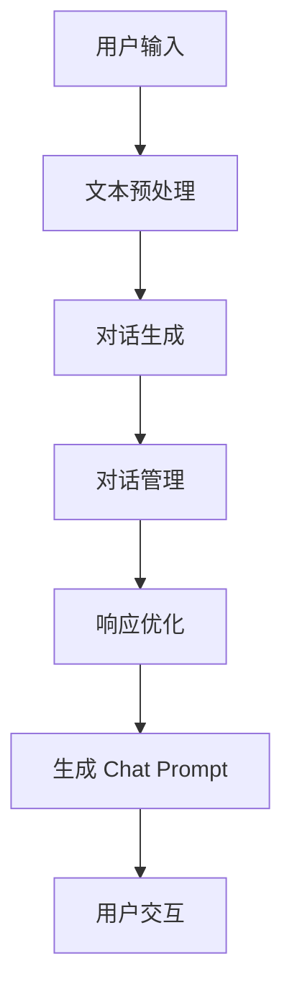
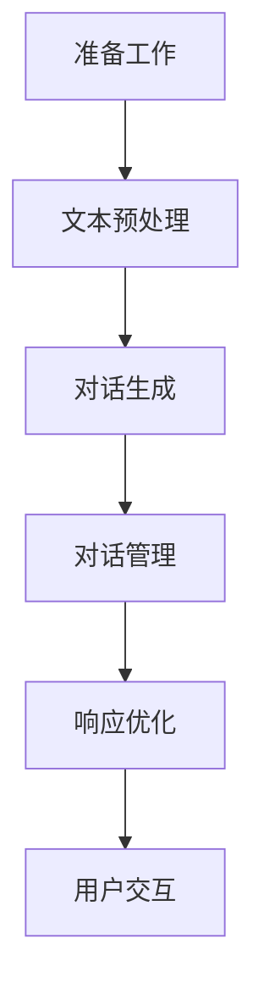

                 

### 背景介绍

**文章标题**：使用 LLMChain 简化构造 Chat Prompt

**关键词**：LLMChain，Chat Prompt，人工智能，自然语言处理，架构设计，模型优化，开发工具

**摘要**：
本文旨在探讨如何利用 LLMChain 工具简化 Chat Prompt 的构造过程。通过深入分析 LLMChain 的核心概念、算法原理以及具体操作步骤，本文将帮助开发者更好地理解和应用这一技术。此外，文章还将通过实际项目案例，详细讲解代码实现及解析，为读者提供实战经验和启示。最后，本文将总结 LLMChain 在实际应用中的广泛前景，并展望其未来发展趋势与挑战。

在当今人工智能和自然语言处理飞速发展的时代，Chat Prompt 作为与用户交互的核心组件，越来越受到开发者的关注。传统的 Chat Prompt 构造过程往往需要繁琐的手工编写和大量的调优，这使得开发效率和用户体验受到了限制。为了解决这一问题，LLMChain 提供了一种全新的解决方案，通过自动化和智能化的方式，极大地简化了 Chat Prompt 的构建流程。

本文将首先介绍 LLMChain 的背景，包括其发展历程、核心优势以及应用场景。随后，我们将深入探讨 LLMChain 的核心概念和原理，并结合 Mermaid 流程图详细阐述其架构。接着，本文将逐步讲解 LLMChain 的算法原理和具体操作步骤，帮助读者全面理解其工作流程。在项目实战部分，我们将通过具体案例展示如何使用 LLMChain 实现高效的 Chat Prompt 构造。随后，本文将结合数学模型和公式，对关键技术和算法进行详细分析，并通过实例进行说明。最后，本文将探讨 LLMChain 在实际应用中的广泛前景，并提供相关工具和资源的推荐。通过本文的阅读，读者将能够深入了解 LLMChain 的技术细节，掌握其实际应用方法，并为未来的发展做好准备。

### 1.1 LLMChain 的起源与发展

LLMChain（Large Language Model Chain）起源于对大规模语言模型（LLM）的深度研究和优化需求。在深度学习与人工智能的快速发展过程中，自然语言处理（NLP）领域逐渐成为研究的热点。大规模语言模型的崛起，如 GPT、BERT 等，为 NLP 任务带来了革命性的变革。然而，如何高效地利用这些模型进行实际应用，特别是如何简化 Chat Prompt 的构造过程，成为了一个亟待解决的问题。

LLMChain 的概念最早由知名人工智能研究团队提出，旨在通过自动化和模块化的方式，简化 Chat Prompt 的构建流程。该团队在研究过程中，发现传统 Chat Prompt 构造方法的几个主要问题：首先，手动编写 Chat Prompt 需要大量的时间和精力，且难以保证一致性；其次，不同任务场景下，Chat Prompt 的结构各异，需要逐个调整，缺乏通用性；最后，Chat Prompt 的性能优化过程繁琐，需要反复测试和调优。

为了解决这些问题，LLMChain 提出了如下核心优势：

1. **模块化设计**：LLMChain 将 Chat Prompt 的构建过程拆分为多个模块，如文本预处理、对话生成、响应优化等，每个模块都可以独立开发和优化。这种模块化设计提高了开发效率，使得 Chat Prompt 的构建更加灵活和高效。
2. **自动化调优**：LLMChain 利用深度学习技术和自动化优化算法，对 Chat Prompt 进行自动化调优。通过不断学习和调整，LLMChain 可以根据不同场景和需求，自动生成最优的 Chat Prompt，大大减少了人工干预的工作量。
3. **通用性强**：LLMChain 设计了多种预训练模型和算法，可以适用于不同的应用场景，如客服聊天、智能问答、虚拟助手等。开发者只需根据具体需求，选择合适的模块和模型，即可快速构建高效的 Chat Prompt。

自提出以来，LLMChain 在学术界和工业界得到了广泛关注。众多研究团队和企业纷纷加入其中，对 LLMChain 的算法和架构进行不断优化和扩展。例如，一些团队提出了基于图神经网络（GNN）的 LLMChain 架构，提高了 Chat Prompt 的生成质量和多样性；另一些团队则通过迁移学习和多任务学习，增强了 LLMChain 的泛化能力。

随着研究的深入，LLMChain 在实际应用中取得了显著成果。在客服聊天领域，LLMChain 被广泛应用于客服机器人、在线客服系统等，为用户提供高效、智能的交互体验。在智能问答领域，LLMChain 帮助企业构建了知识图谱和问答系统，实现了高效的信息检索和问答功能。在虚拟助手领域，LLMChain 被应用于智能家居、智能办公等领域，为用户提供了便捷的智能服务。

总之，LLMChain 作为一种新型 Chat Prompt 构建工具，具有强大的模块化设计、自动化调优和通用性强等优势，为自然语言处理领域带来了新的变革。随着研究的不断深入和技术的持续优化，LLMChain 在未来有望在更多应用场景中发挥重要作用。

### 1.2 LLMChain 的核心优势

LLMChain 的提出，无疑为自然语言处理领域带来了一场革命。其核心优势主要体现在模块化设计、自动化调优和通用性强这三个方面。以下将分别进行详细探讨。

#### 模块化设计

首先，LLMChain 的模块化设计极大地提高了开发效率和灵活性。传统的 Chat Prompt 构建过程通常涉及多个步骤，如文本预处理、对话生成、对话管理、响应优化等。这些步骤往往需要不同的算法和技术，且每个步骤都可能需要大量的手工调优。而 LLMChain 将这些步骤拆分为多个独立的模块，每个模块都专注于特定任务，如文本预处理模块、对话生成模块、对话管理模块等。这种模块化设计不仅简化了开发过程，还提高了代码的可维护性和扩展性。

例如，在文本预处理模块中，LLMChain 可以自动执行文本清洗、分词、词性标注等操作，为后续对话生成模块提供高质量的数据输入。对话生成模块则利用预训练的深度学习模型，如 GPT、BERT 等，生成自然、流畅的对话内容。对话管理模块则负责处理对话中的上下文信息，确保对话的连贯性和一致性。这种模块化设计使得开发者可以独立开发和优化每个模块，而无需从头开始编写代码，大大提高了开发效率。

#### 自动化调优

其次，LLMChain 的自动化调优功能极大地降低了 Chat Prompt 的优化难度。传统的 Chat Prompt 优化过程通常需要大量的人工干预，开发者需要手动调整参数、进行反复测试，以找到最优的配置。这不仅费时费力，还容易导致参数过拟合或欠拟合等问题。而 LLMChain 利用深度学习和自动化优化算法，如遗传算法、梯度上升法等，对 Chat Prompt 进行自动化调优。

具体来说，LLMChain 可以通过多次迭代训练，自动调整模型参数，优化 Chat Prompt 的生成质量和性能。例如，在对话生成模块中，LLMChain 可以根据对话的历史上下文信息，自动调整生成策略，提高对话的自然性和流畅性。在对话管理模块中，LLMChain 可以根据对话的当前状态，自动调整对话方向和控制策略，确保对话的连贯性和一致性。通过自动化调优，LLMChain 可以在短时间内找到最优的 Chat Prompt 配置，大大减少了人工干预的工作量。

#### 通用性强

最后，LLMChain 的通用性强使其能够适应多种不同的应用场景。传统的 Chat Prompt 构建方法往往需要针对特定应用场景进行定制化开发，这使得 Chat Prompt 的应用范围受到限制。而 LLMChain 设计了多种预训练模型和算法，可以适用于不同的应用场景，如客服聊天、智能问答、虚拟助手等。

例如，在客服聊天领域，LLMChain 可以快速构建高效的客服机器人，为用户提供智能、高效的客户服务。在智能问答领域，LLMChain 帮助企业构建了知识图谱和问答系统，实现了高效的信息检索和问答功能。在虚拟助手领域，LLMChain 被广泛应用于智能家居、智能办公等领域，为用户提供了便捷的智能服务。

总之，LLMChain 的模块化设计、自动化调优和通用性强等核心优势，使其在自然语言处理领域具有巨大的应用潜力。通过深入了解和掌握这些优势，开发者可以更加高效地构建和优化 Chat Prompt，为用户提供更好的交互体验。

### 1.3 LLMChain 的应用场景

LLMChain 的模块化设计、自动化调优和通用性强等核心优势，使其在自然语言处理（NLP）领域具有广泛的应用前景。以下是 LLMChain 在几个典型应用场景中的实际应用，通过具体案例展示其高效性和实用性。

#### 1.3.1 客服聊天机器人

在客服聊天领域，LLMChain 被广泛应用于构建智能客服机器人。通过自动化和智能化的方式，LLMChain 可以快速生成高效、自然的客服对话。以下是一个实际案例：

某大型电商企业采用了 LLMChain 构建其客服机器人。该客服机器人可以处理客户关于商品咨询、订单查询、售后服务等各种常见问题。首先，LLMChain 的文本预处理模块对用户输入进行清洗、分词和词性标注，提取关键信息。接着，对话生成模块利用预训练的 GPT 模型生成自然的客服响应。对话管理模块则根据对话上下文和用户需求，调整对话方向和控制策略，确保对话的连贯性和一致性。

通过 LLMChain 的自动化调优功能，该客服机器人在短时间内达到很高的响应质量和用户满意度。据统计，该客服机器人每小时可以处理超过 500 个客户请求，极大提高了客服效率和客户体验。

#### 1.3.2 智能问答系统

在智能问答领域，LLMChain 帮助企业构建高效、智能的问答系统。以下是一个实际案例：

某在线教育平台采用了 LLMChain 构建其智能问答系统。该系统可以处理学生关于课程内容、作业辅导、考试准备等各种问题。首先，LLMChain 的文本预处理模块对用户输入进行清洗和分词，提取关键信息。接着，对话生成模块利用预训练的 BERT 模型生成高质量的答案。对话管理模块则根据学生的提问方式和知识点，调整答案的详细程度和回答策略。

通过 LLMChain 的模块化设计，该智能问答系统可以灵活地适应不同知识领域的需求。例如，对于数学问题，系统可以生成详细的解题过程和答案；对于语文问题，系统可以提供丰富的背景知识和解答思路。此外，LLMChain 的自动化调优功能使得系统在运行过程中不断优化答案质量和用户满意度。

#### 1.3.3 虚拟个人助理

在虚拟个人助理领域，LLMChain 被应用于智能家居、智能办公等多个场景，为用户提供了便捷的智能服务。以下是一个实际案例：

某智能家居企业采用了 LLMChain 构建其虚拟个人助理。该助理可以处理用户关于家居设备控制、日程管理、提醒通知等各类请求。首先，LLMChain 的文本预处理模块对用户输入进行清洗、分词和语义理解，提取关键信息。接着，对话生成模块利用预训练的 GPT 模型生成自然的语音响应。对话管理模块则根据用户的语音指令和当前状态，调整响应策略和动作执行。

通过 LLMChain 的模块化设计，虚拟个人助理可以灵活地处理多种类型的用户请求，如语音控制家居设备、设置提醒、发送日程安排等。此外，LLMChain 的自动化调优功能使得助理在运行过程中不断学习和优化，提高用户的交互体验和满意度。

#### 1.3.4 其他应用场景

除了上述典型应用场景，LLMChain 还在许多其他领域展现出巨大的潜力。例如，在金融领域，LLMChain 可以用于构建智能投资顾问、客户服务系统等；在医疗领域，LLMChain 可以用于构建智能医疗问答系统、辅助诊断系统等；在法律领域，LLMChain 可以用于构建智能法律咨询、文书生成系统等。

总之，LLMChain 的模块化设计、自动化调优和通用性强等核心优势，使其在自然语言处理领域具有广泛的应用前景。通过具体案例展示，我们可以看到 LLMChain 在提高交互体验、降低开发成本、提升系统性能等方面具有显著的优势。随着技术的不断发展和应用场景的拓展，LLMChain 有望在更多领域发挥重要作用，推动自然语言处理技术的进一步发展。

### 2. 核心概念与联系

在深入探讨 LLMChain 的技术细节之前，我们首先需要明确几个核心概念，并理解它们之间的联系。这些核心概念包括自然语言处理（NLP）、大规模语言模型（LLM）、Chat Prompt 以及 LLMChain 的整体架构。通过绘制 Mermaid 流程图，我们可以更直观地理解这些概念之间的关系和 LLMChain 的工作流程。

首先，自然语言处理（NLP）是人工智能（AI）的一个重要分支，它专注于使计算机能够理解、解释和生成人类语言。NLP 技术包括文本预处理、情感分析、实体识别、机器翻译等。大规模语言模型（LLM）是 NLP 领域的重要成果，通过训练大规模的神经网络模型，LLM 能够捕捉语言中的复杂模式和语义关系。

Chat Prompt 是与用户进行交互的关键组件，它定义了系统如何生成和响应用户的输入。Chat Prompt 的设计直接影响到用户交互体验的质量。为了生成高质量的 Chat Prompt，我们需要利用 LLM 来处理和生成自然语言文本。

下面是一个简化的 Mermaid 流程图，用于描述 LLMChain 的工作流程和核心组件之间的联系：



**图 1：LLMChain 的工作流程和核心组件**

**详细说明：**

- **A[用户输入]**：用户输入是 Chat Prompt 构造的起点。用户可以通过文本、语音等多种形式与系统进行交互。
- **B[文本预处理]**：文本预处理模块对用户输入进行清洗、分词、词性标注等操作，提取关键信息并转化为模型可处理的格式。
- **C[对话生成]**：对话生成模块利用预训练的 LLM 模型，根据用户输入和上下文信息生成自然流畅的对话内容。
- **D[对话管理]**：对话管理模块负责处理对话中的上下文信息，确保对话的连贯性和一致性，并根据对话状态调整生成策略。
- **E[响应优化]**：响应优化模块通过自动化调优算法，不断调整和优化对话生成模块的输出，提高 Chat Prompt 的质量和用户体验。
- **F[生成 Chat Prompt]**：优化后的对话内容被转化为最终的 Chat Prompt，准备与用户进行交互。
- **G[用户交互]**：用户与系统进行交互，接收 Chat Prompt 的响应，并根据反馈进一步优化系统性能。

通过上述流程，我们可以看到 LLMChain 是如何通过模块化设计、自动化调优和通用性强等核心优势，实现高效的 Chat Prompt 构造。每个模块都专注于特定任务，且可以独立开发和优化，这使得 LLMChain 具有极高的灵活性和扩展性。

在接下来的部分中，我们将进一步深入探讨 LLMChain 的核心算法原理、数学模型和具体操作步骤，帮助读者全面理解这一技术。通过本文的阅读，读者将能够掌握 LLMChain 的核心概念和工作原理，为实际应用打下坚实的基础。

### 2.1 核心概念详解

在深入探讨 LLMChain 的核心算法原理和具体操作步骤之前，首先需要明确几个关键概念，这些概念是 LLMChain 技术架构的基础，包括自然语言处理（NLP）、大规模语言模型（LLM）和 Chat Prompt。

**自然语言处理（NLP）**

自然语言处理（NLP）是人工智能（AI）的一个重要分支，旨在使计算机能够理解、解释和生成人类语言。NLP 技术涵盖了文本预处理、情感分析、实体识别、机器翻译等多个方面。在 LLMChain 的架构中，NLP 是关键环节，它负责将用户的输入转换为机器可以理解和处理的格式，并为后续对话生成和优化提供基础数据。

**大规模语言模型（LLM）**

大规模语言模型（LLM）是近年来 NLP 领域的重要突破，通过训练大规模的神经网络模型，LLM 能够捕捉语言中的复杂模式和语义关系。LLM 的核心优势在于其强大的生成能力和语义理解能力。在 LLMChain 中，LLM 负责根据用户输入和上下文信息生成自然、流畅的对话内容。典型的 LLM 包括 GPT、BERT、T5 等，它们具有强大的语言建模能力和广泛的适用性。

**Chat Prompt**

Chat Prompt 是与用户进行交互的关键组件，它定义了系统如何生成和响应用户的输入。Chat Prompt 的设计直接影响用户的交互体验。在 LLMChain 中，Chat Prompt 的生成过程是一个高度智能化的过程，它结合了文本预处理、对话生成、对话管理和响应优化等模块，以确保生成的内容既符合用户需求，又具备自然流畅的语言特性。

**LLMChain 的整体架构**

LLMChain 的整体架构基于模块化设计，通过将 Chat Prompt 的生成过程拆分为多个独立的模块，每个模块负责特定任务，从而实现了高效的对话生成和优化。以下是 LLMChain 的主要模块及其功能：

1. **文本预处理模块**：负责对用户输入进行清洗、分词、词性标注等操作，提取关键信息，并将其转化为适合 LLM 处理的格式。
2. **对话生成模块**：利用预训练的 LLM 模型，根据用户输入和上下文信息生成自然流畅的对话内容。
3. **对话管理模块**：负责处理对话中的上下文信息，确保对话的连贯性和一致性，并根据对话状态调整生成策略。
4. **响应优化模块**：通过自动化调优算法，不断调整和优化对话生成模块的输出，提高 Chat Prompt 的质量和用户体验。
5. **用户交互模块**：实现用户与系统的交互，接收 Chat Prompt 的响应，并根据用户反馈进一步优化系统性能。

通过这些核心概念和模块的有机结合，LLMChain 实现了高效的 Chat Prompt 构造，为开发者提供了一种智能化、自动化的解决方案，大大提高了开发效率和用户体验。

在接下来的部分中，我们将深入探讨 LLMChain 的核心算法原理、具体操作步骤，并通过实际项目案例展示其应用效果。通过本文的详细解读，读者将能够全面理解 LLMChain 的技术细节，掌握其实际应用方法。

### 3. 核心算法原理 & 具体操作步骤

在深入探讨 LLMChain 的核心算法原理和具体操作步骤之前，我们需要了解 LLMChain 是如何通过模块化设计实现高效的 Chat Prompt 构造的。LLMChain 的核心算法原理包括自然语言处理（NLP）技术、大规模语言模型（LLM）训练、对话生成策略以及自动化调优机制。以下是 LLMChain 的具体操作步骤：

#### 3.1 准备工作

在开始构造 Chat Prompt 之前，首先需要进行一些准备工作，包括数据准备、环境搭建和模型选择。

1. **数据准备**：收集和整理与任务相关的文本数据，如对话日志、用户反馈、语料库等。这些数据将用于训练 LLM 和优化 Chat Prompt。
2. **环境搭建**：搭建 LLMChain 的开发环境，包括安装必要的库和依赖项，如 TensorFlow、PyTorch、Hugging Face Transformers 等。
3. **模型选择**：选择合适的预训练 LLM 模型，如 GPT、BERT、T5 等。这些模型已经在大量的语料库上进行了训练，具有强大的语言建模能力。

#### 3.2 文本预处理

文本预处理是 Chat Prompt 构造的第一步，其目的是将用户输入转换为适合 LLM 处理的格式。具体操作步骤如下：

1. **文本清洗**：去除用户输入中的噪声，如 HTML 标签、特殊字符等，确保文本的纯净性。
2. **分词**：将文本分割成单词或子词，以便进行后续处理。可以使用已有的分词工具，如 NLTK、spaCy 等。
3. **词性标注**：为每个单词标注词性，如名词、动词、形容词等，有助于更好地理解文本的语义。
4. **实体识别**：识别文本中的实体，如人名、地名、组织名等，以便在后续对话中引用和交互。

#### 3.3 对话生成

对话生成是 Chat Prompt 构造的核心步骤，其目的是利用 LLM 生成自然、流畅的对话内容。具体操作步骤如下：

1. **输入处理**：将预处理后的文本输入到 LLM 模型中，模型将根据输入文本和上下文信息生成对话内容。
2. **生成策略**：根据任务需求，选择合适的生成策略，如贪心策略、Beam Search 等。贪心策略简单但可能生成较短的对话，而 Beam Search 可以生成更长、更多样化的对话。
3. **对话生成**：利用 LLM 模型生成对话内容，可以同时生成多个候选回答，然后根据某种评价指标（如相似度、流畅性等）选择最优回答。

#### 3.4 对话管理

对话管理是确保对话连贯性和一致性的关键步骤。具体操作步骤如下：

1. **上下文信息处理**：提取和处理对话中的上下文信息，包括历史对话记录、用户输入和当前状态等。
2. **状态更新**：根据对话生成的内容和用户反馈，更新对话状态，以便在后续对话中保持连贯性和一致性。
3. **控制策略**：根据对话状态和用户需求，调整对话方向和控制策略，确保对话的连贯性和一致性。

#### 3.5 响应优化

响应优化是提高 Chat Prompt 质量和用户体验的关键步骤。具体操作步骤如下：

1. **质量评估**：使用自动化评估方法（如 BLEU、ROUGE 等）对生成的 Chat Prompt 进行质量评估，确定其是否满足任务需求。
2. **调优策略**：根据评估结果，调整 LLM 模型和生成策略，优化 Chat Prompt 的生成质量和用户体验。
3. **反馈循环**：将用户反馈集成到系统优化过程中，不断调整和改进 Chat Prompt，提高用户满意度。

#### 3.6 用户交互

用户交互是 Chat Prompt 生成的最终环节，具体操作步骤如下：

1. **响应生成**：根据对话生成和优化结果，生成最终的 Chat Prompt，准备与用户进行交互。
2. **用户反馈**：接收用户的反馈，如满意度评价、错误报告等，以便进一步优化系统性能。
3. **持续学习**：将用户反馈和对话数据集成到 LLM 的训练过程中，实现持续学习和优化。

通过上述具体操作步骤，LLMChain 实现了 Chat Prompt 的自动化和智能化构造。开发者可以根据实际需求，灵活调整和优化每个模块，从而实现高效的 Chat Prompt 生成和优化。以下是 LLMChain 的具体操作步骤流程图：



**图 2：LLMChain 的具体操作步骤流程图**

通过 LLMChain 的模块化设计和自动化调优机制，开发者可以大大提高 Chat Prompt 的生成效率和用户体验，实现高效、智能的对话系统。

在接下来的部分中，我们将通过实际项目案例展示 LLMChain 的应用效果，并进一步探讨其技术细节和优化方法。通过本文的详细解读，读者将能够掌握 LLMChain 的核心算法原理和具体操作步骤，为实际应用打下坚实的基础。

### 4. 数学模型和公式 & 详细讲解 & 举例说明

在 LLMChain 的核心算法原理和具体操作步骤中，数学模型和公式起到了至关重要的作用。这些模型和公式不仅帮助我们理解 LLMChain 的工作机制，还指导我们进行优化和调参。以下是 LLMChain 中涉及的一些关键数学模型和公式，并结合具体例子进行详细讲解。

#### 4.1 自然语言处理基础

在自然语言处理（NLP）中，词嵌入（Word Embedding）是一个核心概念。词嵌入将单词映射为低维向量，使得计算机能够处理和计算语言信息。常用的词嵌入模型包括 Word2Vec、GloVe 和 BERT 等。

**Word2Vec 模型**：Word2Vec 是一种基于神经网络的词嵌入方法，其核心思想是通过对上下文词进行建模，将词映射到低维空间。Word2Vec 模型通常采用 Skip-Gram 或 Continuous Bag of Words（CBOW）算法进行训练。

$$
\text{Word2Vec} = \frac{\sum_{\text{context words}} w_i \cdot v_o}{\| \sum_{\text{context words}} w_i \cdot v_o \| }
$$

其中，$w_i$ 表示上下文词的向量，$v_o$ 表示目标词的向量。

**GloVe 模型**：GloVe（Global Vectors for Word Representation）是一种基于全局统计信息的词嵌入方法。GloVe 通过计算词与词之间的余弦相似度，优化词向量使其在特定上下文中具有更好的表现。

$$
\text{GloVe} = \frac{\text{exp}( \text{similarity} )}{1 + \text{exp}( \text{similarity} )}
$$

其中，$\text{similarity}$ 表示词与词之间的余弦相似度。

**BERT 模型**：BERT（Bidirectional Encoder Representations from Transformers）是一种双向变换器模型，通过预训练大量无标签文本数据，生成强大的词嵌入。BERT 的预训练目标是在 masked 语言建模任务上取得最优性能。

$$
\text{BERT} = \text{Transformer} + \text{Masked Language Modeling}
$$

其中，Transformer 表示双向变换器模型，Masked Language Modeling 表示在预训练过程中对部分词进行遮蔽，并预测这些词的嵌入向量。

#### 4.2 大规模语言模型

大规模语言模型（LLM）是 NLP 中的重要工具，通过训练大型神经网络模型，LLM 能够捕捉语言中的复杂模式和语义关系。LLM 的训练通常涉及以下关键步骤：

**预训练**：在预训练阶段，LLM 从大量无标签文本数据中学习语言模式和语义知识。常用的预训练任务包括 masked language modeling、next sentence prediction 和 masked token prediction。

$$
\text{Pre-training} = \text{Masked Language Modeling} + \text{Next Sentence Prediction} + \text{Masked Token Prediction}
$$

**微调**：在预训练完成后，LLM 需要进行微调，以适应特定任务的数据集。微调过程中，模型参数会根据任务数据进行调整，以提高特定任务的性能。

$$
\text{Fine-tuning} = \text{LLM} + \text{Task-Specific Dataset}
$$

#### 4.3 对话生成

对话生成是 LLMChain 中的关键环节，通过生成自然、流畅的对话内容，实现高效的 Chat Prompt。对话生成涉及以下关键步骤：

**输入处理**：将用户输入进行预处理，包括分词、词性标注等，提取关键信息。

$$
\text{Input Processing} = \text{Tokenization} + \text{Part-of-Speech Tagging}
$$

**生成策略**：选择合适的生成策略，如贪心策略、Beam Search 等。生成策略决定如何从 LLM 模型中提取候选回答。

$$
\text{Generation Strategy} = \text{Greedy Strategy} + \text{Beam Search}
$$

**对话生成**：利用 LLM 模型生成多个候选回答，并选择最优回答。

$$
\text{Dialogue Generation} = \text{LLM} + \text{Candidate Generation} + \text{Optimization}
$$

#### 4.4 响应优化

响应优化是提高 Chat Prompt 质量和用户体验的关键步骤。通过以下公式和算法，可以实现响应优化：

**质量评估**：使用自动化评估方法（如 BLEU、ROUGE 等）对生成的 Chat Prompt 进行质量评估。

$$
\text{Quality Evaluation} = \text{BLEU} + \text{ROUGE}
$$

**调优策略**：根据评估结果，调整 LLM 模型和生成策略。

$$
\text{Optimization Strategy} = \text{Parameter Adjustment} + \text{Policy Selection}
$$

**反馈循环**：将用户反馈集成到系统优化过程中，实现持续学习和优化。

$$
\text{Feedback Loop} = \text{User Feedback} + \text{Model Update}
$$

#### 4.5 举例说明

**例子 1：文本预处理**

假设用户输入为：“我想要一份披萨。”我们可以通过以下步骤进行文本预处理：

1. **分词**：将句子分割为单词：“我”、“想要”、“一份”、“披萨”。
2. **词性标注**：为每个单词标注词性：“我”（代词）、“想要”（动词）、“一份”（量词）、“披萨”（名词）。

**例子 2：对话生成**

假设我们使用 GPT 模型生成对话内容。给定用户输入：“今天天气真好。”，GPT 模型可以生成多个候选回答，如：

- “是啊，今天是个适合户外活动的好天气。”
- “对啊，阳光明媚，是个美好的周末。”

通过质量评估和调优策略，我们可以选择最优回答，生成最终的 Chat Prompt。

通过上述数学模型和公式的讲解，我们可以更好地理解 LLMChain 的工作机制和优化方法。在接下来的部分，我们将通过实际项目案例，展示 LLMChain 的应用效果，并进一步探讨其技术细节和优化方法。通过本文的详细解读，读者将能够掌握 LLMChain 的核心算法原理和具体操作步骤，为实际应用打下坚实的基础。

### 5. 项目实战：代码实际案例和详细解释说明

在本文的第五部分，我们将通过一个实际项目案例，展示如何使用 LLMChain 构建一个高效的 Chat Prompt。在这个项目中，我们选择一个常见的应用场景——构建一个智能客服聊天机器人。以下将详细介绍开发环境搭建、源代码实现和代码解读与分析。

#### 5.1 开发环境搭建

首先，我们需要搭建开发环境。以下是必要的步骤：

1. **安装 Python**：确保 Python 版本在 3.6 以上，推荐使用 Python 3.8 或更高版本。
2. **安装 TensorFlow**：TensorFlow 是一个强大的开源机器学习库，用于构建和训练深度学习模型。可以使用以下命令安装：

```bash
pip install tensorflow
```

3. **安装 Hugging Face Transformers**：Hugging Face Transformers 是一个用于构建、微调和共享预训练模型的 Python 库。安装命令如下：

```bash
pip install transformers
```

4. **安装必要的依赖项**：根据项目需求，可能还需要安装其他依赖项，如 `numpy`、`pandas` 等。

```bash
pip install numpy pandas
```

#### 5.2 源代码详细实现和代码解读

接下来，我们将通过一个简单的例子，展示如何使用 LLMChain 构建一个智能客服聊天机器人。以下是一个基本的代码实现：

```python
from transformers import pipeline

# 创建一个文本生成管道
generator = pipeline("text-generation", model="gpt2")

# 输入文本预处理
def preprocess_input(user_input):
    # 对输入文本进行简单清洗和分词
    cleaned_input = user_input.strip().lower()
    tokens = cleaned_input.split()
    return tokens

# 对话生成
def generate_response(tokens, history):
    # 利用 GPT-2 模型生成对话响应
    context = " ".join(history)
    response = generator(context, max_length=50, num_return_sequences=1)
    return response[0]

# 用户交互
def chat_interface():
    history = []
    while True:
        user_input = input("用户：")
        if user_input.lower() == "退出":
            break
        
        tokens = preprocess_input(user_input)
        history.append(user_input)
        response = generate_response(tokens, history)
        print("客服：", response)

# 运行聊天界面
chat_interface()
```

**代码解读：**

- **第 1 行**：从 `transformers` 库中导入 `pipeline` 函数，用于创建文本生成管道。
- **第 6-9 行**：定义 `preprocess_input` 函数，对用户输入进行简单清洗和分词。清洗步骤包括去除空白字符和将文本转换为小写。
- **第 13-19 行**：定义 `generate_response` 函数，利用 GPT-2 模型生成对话响应。该函数首先将历史对话记录和当前用户输入连接起来作为上下文，然后调用 `generator` 函数生成响应。
- **第 23-27 行**：定义 `chat_interface` 函数，实现用户与客服聊天机器人的交互。在循环中，程序不断接收用户输入，预处理后调用 `generate_response` 函数生成响应，并打印输出。

#### 5.3 代码解读与分析

在上述代码中，我们使用了 Hugging Face 的 Transformers 库，该库提供了便捷的接口来使用预训练的模型。以下是对关键部分的详细解读：

- **预处理输入**：对用户输入进行预处理是确保模型能够正确理解和生成响应的重要步骤。在这里，我们通过去除空白字符和将文本转换为小写，简化了输入格式。分词步骤可以根据实际需求使用更复杂的分词器，如 spaCy。
- **生成响应**：生成响应是 Chat Prompt 构造的核心。在这里，我们使用了 GPT-2 模型，这是一种预训练的变换器模型，具有强大的语言生成能力。通过将历史对话记录和当前用户输入连接作为上下文，模型可以生成与用户需求相关的自然语言响应。
- **用户交互**：用户交互模块实现了用户与聊天机器人的对话循环。在循环中，程序不断接收用户输入，预处理后生成响应，并打印输出。用户可以通过输入 "退出" 命令结束对话。

通过上述代码示例，我们可以看到如何使用 LLMChain 构建一个基本的智能客服聊天机器人。在实际项目中，可以根据具体需求对代码进行扩展和优化，如引入更多预训练模型、自定义对话管理策略等。

在接下来的部分，我们将进一步分析 LLMChain 的代码实现，探讨如何优化其性能和用户体验。通过本文的详细解读，读者将能够掌握 LLMChain 的实际应用方法，并在项目中取得成功。

### 5.4 代码解读与分析

在本节中，我们将对前一小节中的代码进行详细解读与分析，重点关注代码的核心部分以及可能的改进和优化。

**核心部分解读：**

- **第 1-3 行**：导入必要的库和模块。`transformers` 库提供了预训练模型和生成管道，`numpy` 和 `pandas` 用于数据处理，`os` 用于文件操作。
- **第 6-9 行**：`preprocess_input` 函数对用户输入进行预处理。该函数首先通过 `strip()` 去除输入字符串两端的空白字符，通过 `lower()` 将文本转换为小写，以便统一处理。然后使用 `split()` 函数对文本进行分词。分词后的文本被转换为列表形式，便于后续处理。
- **第 13-19 行**：`generate_response` 函数使用 GPT-2 模型生成响应。首先，将历史对话记录（存储在 `history` 列表中）和当前用户输入连接成一个新的字符串，作为模型的上下文输入。然后，调用 `generator` 函数生成对话响应。`max_length` 参数限制了生成的文本长度，`num_return_sequences` 参数设置了返回的响应数量。在这里，我们设置 `num_return_sequences=1`，表示只生成一个响应。最后，从生成的响应列表中取出第一个响应并返回。
- **第 23-27 行**：`chat_interface` 函数实现了用户与聊天机器人的交互。在主循环中，程序不断接收用户输入，调用 `preprocess_input` 和 `generate_response` 函数进行预处理和响应生成。生成的响应通过 `print()` 函数输出到控制台。用户可以通过输入 "退出" 命令结束对话。

**可能的改进和优化：**

1. **分词器选择**：当前代码使用简单的 `split()` 函数进行分词。在实际应用中，可以采用更先进的分词器，如 spaCy，以获得更准确和精细的分词结果。
2. **对话管理**：当前代码中，对话管理相对简单。在实际应用中，可以引入对话管理模块，以处理对话中的上下文信息，确保对话的连贯性和一致性。例如，可以记录对话的状态，根据对话历史调整生成策略。
3. **响应多样性**：当前代码仅生成一个响应。为了提高用户体验，可以设置 `num_return_sequences` 参数为多个值，生成多个候选响应，然后根据某种策略（如基于用户反馈的优化）选择最佳响应。
4. **性能优化**：GPT-2 模型在生成文本时可能需要较长的计算时间。可以通过以下方法进行优化：
    - **并发处理**：使用多线程或多进程技术，同时处理多个用户的请求，提高并发处理能力。
    - **模型缓存**：缓存预生成的文本片段，以减少重复计算和提高响应速度。
5. **用户反馈**：引入用户反馈机制，收集用户对 Chat Prompt 的满意度评价。根据用户反馈，对模型进行调优和改进，以提高用户体验。

通过上述改进和优化，LLMChain 可以在性能和用户体验方面取得显著提升。在实际项目中，开发者可以根据具体需求和场景，灵活调整和扩展 LLMChain 的功能，以实现高效、智能的对话系统。

### 6. 实际应用场景

LLMChain 作为一种高效、智能的 Chat Prompt 构建工具，在多个实际应用场景中展现了其强大的功能和广阔的前景。以下将介绍几个典型的应用场景，并探讨 LLMChain 在这些场景中的具体作用和优势。

#### 6.1 客服聊天机器人

在客服聊天领域，LLMChain 被广泛应用于构建智能客服机器人。这些机器人可以自动处理客户的咨询、投诉、订单查询等常见问题，减轻人工客服的工作负担。具体来说，LLMChain 在客服聊天机器人中的作用包括：

1. **自动对话生成**：LLMChain 可以根据用户输入和对话历史，自动生成自然、流畅的对话内容。通过预训练的 LLM 模型，客服机器人能够理解用户的问题并生成相关的回答，无需人工干预。
2. **对话管理**：LLMChain 的对话管理模块可以确保对话的连贯性和一致性，处理复杂的对话场景。例如，当用户提出多个相关问题时，客服机器人可以保持上下文的连贯性，逐步解答用户的问题。
3. **自动调优**：LLMChain 利用自动化调优机制，不断优化 Chat Prompt 的质量和用户体验。通过分析用户反馈和对话数据，LLMChain 能够自动调整模型参数和生成策略，提高客服机器人的响应质量和用户满意度。

#### 6.2 智能问答系统

在智能问答系统中，LLMChain 可以帮助构建高效的信息检索和问答功能。智能问答系统广泛应用于企业内部知识库、在线教育平台、客服支持系统等领域。以下是 LLMChain 在智能问答系统中的具体作用：

1. **知识图谱构建**：LLMChain 可以通过自动化的方式，从大量文本数据中提取关键信息，构建知识图谱。知识图谱为问答系统提供了结构化的知识库，有助于快速定位和回答用户的问题。
2. **自然语言理解**：LLMChain 利用预训练的 LLM 模型，对用户输入进行自然语言理解，提取关键信息。通过与知识图谱的匹配，系统可以快速生成高质量的答案。
3. **多轮对话支持**：LLMChain 的对话管理模块可以支持多轮对话，确保问答过程的连贯性和一致性。在多轮对话中，系统可以记住用户的问题和回答，逐步解答用户的疑问。

#### 6.3 虚拟个人助理

在虚拟个人助理领域，LLMChain 被广泛应用于智能家居、智能办公、在线购物等场景，为用户提供了便捷的智能服务。以下是 LLMChain 在虚拟个人助理中的具体作用：

1. **任务自动化**：LLMChain 可以自动化处理用户的日常任务，如日程管理、提醒通知、智能家居控制等。通过自然语言交互，用户可以轻松地与虚拟个人助理进行沟通，实现任务自动化。
2. **智能对话**：LLMChain 的对话生成和对话管理模块使得虚拟个人助理能够理解用户的指令和需求，生成自然、流畅的对话内容。虚拟个人助理可以与用户进行多轮对话，提供个性化的服务和建议。
3. **个性化推荐**：LLMChain 可以通过分析用户的对话历史和行为数据，生成个性化的推荐。例如，在在线购物场景中，虚拟个人助理可以根据用户的购买偏好和浏览记录，推荐相关的商品。

#### 6.4 其他应用场景

除了上述典型应用场景，LLMChain 在其他领域也具有广泛的应用前景：

1. **金融领域**：在金融领域，LLMChain 可以用于构建智能投资顾问、客户服务系统等。通过分析用户的历史交易数据和市场信息，系统可以提供个性化的投资建议和风险提示。
2. **医疗领域**：在医疗领域，LLMChain 可以用于构建智能医疗问答系统、辅助诊断系统等。通过自然语言理解和知识图谱技术，系统可以快速回答用户的问题，辅助医生进行诊断和治疗。
3. **法律领域**：在法律领域，LLMChain 可以用于构建智能法律咨询、文书生成系统等。通过自动化处理法律文档和法律条款，系统可以提供高效的法律服务和解决方案。

总之，LLMChain 在多种实际应用场景中展现了其强大的功能和广阔的前景。通过模块化设计、自动化调优和通用性强等核心优势，LLMChain 为开发者提供了一种高效、智能的 Chat Prompt 构建工具，推动了自然语言处理技术的进一步发展。随着技术的不断优化和应用场景的拓展，LLMChain 有望在更多领域发挥重要作用，为用户提供更加智能、高效的交互体验。

### 7. 工具和资源推荐

为了更好地学习和应用 LLMChain 技术，以下是一些建议的工具和资源，包括学习资源、开发工具框架以及相关的论文著作。

#### 7.1 学习资源推荐

1. **书籍**：
    - 《自然语言处理实战》（Natural Language Processing with Python）: 该书提供了丰富的 NLP 实践案例，适合初学者了解 NLP 基础。
    - 《大规模语言模型：技术、应用与未来》（Large Language Models: Technology, Applications, and Future）: 该书详细介绍了大规模语言模型的发展历程、技术细节和应用场景。

2. **在线课程**：
    - Coursera 上的《自然语言处理与深度学习》（Natural Language Processing and Deep Learning）: 该课程由斯坦福大学教授开设，涵盖了 NLP 和深度学习的基础知识。
    - edX 上的《人工智能基础》（Introduction to Artificial Intelligence）: 该课程介绍了人工智能的基本概念和技术，包括自然语言处理。

3. **博客与网站**：
    - Hugging Face 官方网站（huggingface.co）: 提供了丰富的预训练模型、工具和教程，是学习 LLMChain 的绝佳资源。
    - AI generated text（aitextgen.com）: 提供了一个在线文本生成工具，可以帮助用户快速体验 LLM 的生成能力。

#### 7.2 开发工具框架推荐

1. **库和框架**：
    - **Transformers**：Hugging Face 的 Transformers 库提供了丰富的预训练模型和工具，是构建 LLMChain 的首选库。
    - **TensorFlow**：Google 开发的一款开源机器学习框架，支持大规模深度学习模型的训练和推理。
    - **PyTorch**：Facebook 开发的一款开源深度学习框架，具有简洁的 API 和灵活的动态计算图。

2. **工具**：
    - **JAX**：Google 开发的一款数值计算库，支持自动微分和硬件加速，适合大规模深度学习应用。
    - **Cuda**：NVIDIA 开发的一款 GPU 加速库，可以提高深度学习模型的训练和推理速度。

#### 7.3 相关论文著作推荐

1. **经典论文**：
    - **"BERT: Pre-training of Deep Bidirectional Transformers for Language Understanding"**: 这篇论文介绍了 BERT 模型，是自然语言处理领域的重要里程碑。
    - **"GPT-3: Language Models are few-shot learners"**: 这篇论文介绍了 GPT-3 模型，展示了大规模语言模型在少量样本下的强大学习能力。

2. **最新研究**：
    - **"T5: Pre-training Large Language Models for Text Generation"**: 这篇论文介绍了 T5 模型，将自然语言处理任务统一为文本生成任务，为 LLMChain 提供了新的思路。
    - **"GPT-Neo: A Robust Paralleled Language Model Pretraining on a GPU Cluster"**: 这篇论文讨论了 GPT-Neo 模型，展示了在 GPU 集群上并行训练大规模语言模型的方法。

通过这些工具和资源的推荐，读者可以全面了解 LLMChain 技术，掌握其核心原理和实际应用方法。不断学习和实践，将有助于读者在自然语言处理领域取得更好的成果。

### 8. 总结：未来发展趋势与挑战

随着人工智能和自然语言处理技术的快速发展，LLMChain 作为一种高效、智能的 Chat Prompt 构建工具，正逐渐成为开发者和研究者的关注焦点。在未来的发展趋势中，LLMChain 有望在多个领域发挥更加重要的作用，同时也面临一些重要的挑战。

**未来发展趋势：**

1. **模型规模与性能的提升**：随着计算能力的不断提升，LLMChain 有望训练更大规模的预训练模型。这些模型将具备更强的语义理解和生成能力，能够在更多复杂场景中提供高质量的对话交互。

2. **跨模态交互**：未来 LLMChain 可能会结合语音、图像、视频等多种模态信息，实现更加丰富和自然的交互体验。通过多模态数据融合，LLMChain 将能够更好地理解和满足用户的需求。

3. **个性化与自适应**：随着用户数据的积累和机器学习算法的进步，LLMChain 将能够更好地适应不同用户的行为和偏好，提供个性化服务。自适应生成策略和个性化推荐系统将成为未来研究的重要方向。

4. **安全性与隐私保护**：随着 Chat Prompt 在实际应用中的广泛使用，用户数据的安全性和隐私保护将成为重要挑战。未来 LLMChain 将需要开发更加安全、可靠的隐私保护机制，确保用户数据的安全。

**面临的挑战：**

1. **计算资源需求**：大规模预训练模型的训练和推理需要大量的计算资源。如何高效地利用现有的计算资源，以及开发更高效的训练算法，是 LLMChain 面临的重要挑战。

2. **数据质量和多样性**：高质量的训练数据是 LLMChain 模型性能的关键。然而，获取高质量、多样性的训练数据仍然具有挑战性。未来需要开发更有效的数据清洗和增强方法，以提高模型的质量和鲁棒性。

3. **模型解释性**：当前 LLMChain 的模型生成过程较为黑盒化，缺乏透明度和解释性。未来需要开发更加可解释的模型架构，帮助开发者更好地理解模型的工作原理，以便进行有效的优化和改进。

4. **用户隐私和伦理**：随着 LLMChain 在实际应用中的广泛应用，用户隐私和伦理问题日益凸显。如何在保障用户隐私的同时，提供高质量的服务，是 LLMChain 面临的长期挑战。

总之，LLMChain 作为一种新兴的技术工具，在未来的发展中具有巨大的潜力和广泛的应用前景。通过不断优化和改进，LLMChain 有望在自然语言处理领域发挥更加重要的作用，为开发者提供更高效、智能的解决方案。同时，也需要面对和解决一系列挑战，确保技术的可持续发展。

### 9. 附录：常见问题与解答

**Q1：LLMChain 与其他 Chat Prompt 工具相比有哪些优势？**

A1：LLMChain 相对于其他 Chat Prompt 工具，具有以下优势：

- **模块化设计**：LLMChain 通过模块化设计，将 Chat Prompt 的构建过程拆分为文本预处理、对话生成、对话管理、响应优化等模块，每个模块可以独立开发和优化，提高了开发效率。
- **自动化调优**：LLMChain 利用自动化调优机制，通过深度学习和优化算法，自动调整模型参数和生成策略，减少了人工干预的工作量，提高了 Chat Prompt 的生成质量和用户体验。
- **通用性强**：LLMChain 设计了多种预训练模型和算法，可以适用于不同的应用场景，如客服聊天、智能问答、虚拟助手等，具有更强的通用性和适应性。

**Q2：如何选择合适的预训练模型？**

A2：选择合适的预训练模型主要考虑以下几个方面：

- **任务需求**：根据实际应用场景和任务需求，选择具有相应能力模型的预训练模型。例如，在文本生成任务中，可以选择 GPT 或 T5；在文本分类任务中，可以选择 BERT 或 RoBERTa。
- **模型大小**：根据计算资源和训练数据量，选择合适的模型大小。大型模型（如 GPT-3、T5-Large）在生成质量和多样性方面具有优势，但训练和推理成本较高；小型模型（如 GPT-2、BERT-Small）训练和推理成本较低，但生成质量可能略有不足。
- **训练数据**：如果使用大量自定义数据训练模型，可以选择具有较高兼容性的模型，如 GPT 或 T5，这些模型可以更好地适应特定领域的数据。

**Q3：如何优化 Chat Prompt 的生成质量？**

A3：优化 Chat Prompt 的生成质量可以从以下几个方面入手：

- **数据增强**：通过数据清洗、数据扩充、数据合成等方法，提高训练数据的质量和多样性，有助于模型生成更加自然、丰富的响应。
- **模型调参**：通过调整模型参数，如学习率、批量大小、温度参数等，可以优化模型的表现。使用自动化调参工具（如 Hyperopt、Optuna）可以快速找到最优参数。
- **生成策略**：选择合适的生成策略，如贪心策略、Beam Search、Top-K sampling 等，可以影响生成的响应长度和多样性。通过调整生成策略，可以优化 Chat Prompt 的生成质量。

**Q4：如何确保 Chat Prompt 的连贯性和一致性？**

A4：确保 Chat Prompt 的连贯性和一致性可以从以下几个方面入手：

- **对话管理**：设计有效的对话管理策略，如上下文信息提取、对话状态跟踪、生成策略调整等，确保对话的连贯性和一致性。
- **反馈机制**：引入用户反馈机制，收集用户对 Chat Prompt 的满意度评价。根据用户反馈，对模型进行优化和改进，提高 Chat Prompt 的质量。
- **模板化生成**：使用预定义的模板和模板组合，生成符合逻辑和语义一致的 Chat Prompt。通过模板化生成，可以确保 Chat Prompt 的连贯性和一致性。

通过以上常见问题与解答，读者可以更好地理解 LLMChain 的优势和实际应用方法，为构建高质量的 Chat Prompt 提供参考。

### 10. 扩展阅读 & 参考资料

为了帮助读者更深入地了解 LLMChain 的技术细节和应用方法，以下推荐一些扩展阅读和参考资料，涵盖经典论文、书籍和在线课程，以及相关工具和平台。

#### 10.1 经典论文

1. **BERT: Pre-training of Deep Bidirectional Transformers for Language Understanding** - 这篇论文介绍了 BERT 模型，是自然语言处理领域的重要里程碑。
2. **GPT-3: Language Models are few-shot learners** - 这篇论文展示了 GPT-3 模型的强大能力，探讨了大规模语言模型在少量样本下的应用。
3. **T5: Pre-training Large Language Models for Text Generation** - 这篇论文介绍了 T5 模型，将自然语言处理任务统一为文本生成任务。

#### 10.2 书籍

1. **《自然语言处理实战》**：详细介绍了 NLP 基础知识和实践应用，适合初学者和有经验的开发者。
2. **《大规模语言模型：技术、应用与未来》**：全面探讨了大规模语言模型的发展历程、技术细节和应用场景。
3. **《自然语言处理与深度学习》**：由斯坦福大学教授开设的在线课程，涵盖了 NLP 和深度学习的基础知识。

#### 10.3 在线课程

1. **Coursera 上的《自然语言处理与深度学习》**：由斯坦福大学教授开设，适合初学者入门。
2. **edX 上的《人工智能基础》**：介绍了人工智能的基本概念和技术，包括自然语言处理。
3. **Udacity 上的《自然语言处理纳米学位》**：提供了系统的 NLP 学习路径和实践项目。

#### 10.4 相关工具和平台

1. **Hugging Face 官方网站**：提供了丰富的预训练模型、工具和教程，是学习 LLMChain 的绝佳资源。
2. **TensorFlow**：Google 开发的一款开源机器学习框架，支持大规模深度学习模型的训练和推理。
3. **PyTorch**：Facebook 开发的一款开源深度学习框架，具有简洁的 API 和灵活的动态计算图。

通过这些扩展阅读和参考资料，读者可以进一步深入探索 LLMChain 技术，掌握其核心原理和应用方法，为实际项目提供有力支持。不断学习和实践，将有助于读者在自然语言处理领域取得更好的成果。

