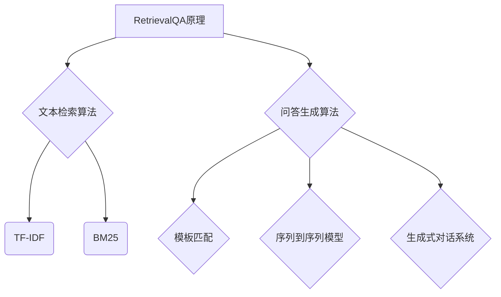

                 

## 文章标题：使用 RetrievalQA 检索销售话术数据

### 关键词：RetrievalQA，销售话术，检索，数据，自然语言处理

#### 摘要：
本文将深入探讨RetrievalQA技术在销售话术数据检索中的应用。通过详细分析其原理、架构、算法及实施步骤，我们将揭示如何有效地利用RetrievalQA技术提升销售效率，助力企业实现业务增长。

## 1. 背景介绍

在当今竞争激烈的市场环境中，销售已成为企业成功的关键。而销售话术作为销售过程中的重要组成部分，其质量直接影响到销售业绩。随着数据的爆炸式增长，如何快速、准确地检索到相关销售话术成为了一个亟待解决的问题。

RetrievalQA是一种结合了检索和问答技术的自然语言处理方法。它通过从大量数据中检索出与问题最相关的回答，从而实现快速、准确的问答。本文将探讨如何利用RetrievalQA技术检索销售话术数据，为企业提供有力支持。

### 2. 核心概念与联系

#### 2.1 RetrievalQA原理

RetrievalQA的核心思想是先检索，后回答。具体来说，它包括以下几个步骤：

1. **数据检索**：从大量文本数据中检索出与问题最相关的段落或句子。
2. **答案生成**：根据检索结果生成回答。

#### 2.2 RetrievalQA架构

RetrievalQA的架构主要包括以下几个部分：

1. **文本检索模块**：用于从大量文本数据中检索相关内容。
2. **问答生成模块**：根据检索结果生成回答。
3. **模型训练与优化**：通过大量训练数据对模型进行训练和优化，提高检索和问答的准确性和效率。

#### 2.3 RetrievalQA与销售话术的关联

销售话术是销售过程中的关键要素，而RetrievalQA技术可以有效地帮助销售人员快速获取相关话术。具体关联如下：

1. **话术检索**：利用RetrievalQA技术，销售人员可以在大量销售话术中快速找到与当前客户需求相关的话术。
2. **话术优化**：通过对检索结果的分析和总结，企业可以不断优化和提升销售话术的质量。

### 3. 核心算法原理 & 具体操作步骤

#### 3.1 核心算法原理

RetrievalQA的核心算法主要包括文本检索和问答生成两部分。

1. **文本检索算法**：常用的文本检索算法有向量空间模型（VSM）、TF-IDF、BM25等。这些算法通过计算文本之间的相似度，实现快速检索。
2. **问答生成算法**：问答生成算法主要包括模板匹配、序列到序列模型、生成式对话系统等。这些算法可以根据检索结果生成回答。

#### 3.2 具体操作步骤

1. **数据准备**：收集大量销售话术数据，并进行预处理，如去除停用词、分词、词性标注等。
2. **模型训练**：使用文本检索算法和问答生成算法分别训练两个模型，以提高检索和问答的准确性。
3. **检索与回答**：输入销售问题，利用文本检索模型检索相关销售话术，然后使用问答生成模型生成回答。

### 4. 数学模型和公式 & 详细讲解 & 举例说明

#### 4.1 数学模型

1. **文本检索模型**：以TF-IDF为例，其计算公式如下：
   $$ TF(t,d) = \frac{f(t,d)}{df} $$
   $$ IDF(t,D) = \log \left( \frac{N}{df_t} + 1 \right) $$
   $$ TF-IDF(t,d) = TF(t,d) \times IDF(t,D) $$
   其中，$f(t,d)$为词$t$在文档$d$中的频次，$df$为词$t$在文档集合中出现的文档频次，$N$为文档总数，$df_t$为词$t$在文档集合中出现的文档频次。

2. **问答生成模型**：以序列到序列模型为例，其计算公式如下：
   $$ y_t = \text{softmax}(U \cdot \text{vec}(x_t)) $$
   其中，$y_t$为生成器在时间步$t$的输出，$x_t$为输入序列，$U$为生成器权重矩阵，$\text{vec}(\cdot)$表示将序列转化为向量。

#### 4.2 举例说明

1. **文本检索举例**：假设有文档$d_1$和$d_2$，其中$d_1$包含词$t_1$和$t_2$，$d_2$包含词$t_1$、$t_2$和$t_3$。根据TF-IDF模型计算文档间的相似度如下：
   $$ TF(t_1,d_1) = \frac{1}{2},\quad TF(t_1,d_2) = \frac{2}{3} $$
   $$ IDF(t_1,D) = 1,\quad IDF(t_2,D) = \log \left( \frac{2}{1} + 1 \right) = 1 $$
   $$ TF-IDF(t_1,d_1) = \frac{1}{2} \times 1 = \frac{1}{2} $$
   $$ TF-IDF(t_1,d_2) = \frac{2}{3} \times 1 = \frac{2}{3} $$
   $$ TF-IDF(t_2,d_1) = \frac{1}{2} \times 1 = \frac{1}{2} $$
   $$ TF-IDF(t_2,d_2) = \frac{2}{3} \times 1 = \frac{2}{3} $$

2. **问答生成举例**：假设输入序列为$x = [1, 2, 3]$，生成器权重矩阵为$U = [1, 2; 3, 4]$，则生成器在时间步$t$的输出为：
   $$ y_t = \text{softmax}(U \cdot \text{vec}(x_t)) = \text{softmax}([1 \times 1 + 2 \times 2; 3 \times 1 + 4 \times 3]) = \text{softmax}([5, 13]) = [0.267, 0.733] $$

### 5. 项目实战：代码实际案例和详细解释说明

#### 5.1 开发环境搭建

1. 安装Python环境和相关库：
   ```bash
   pip install numpy scipy gensim spacy
   ```
2. 下载Spacy模型：
   ```python
   !python -m spacy download en_core_web_sm
   ```

#### 5.2 源代码详细实现和代码解读

1. 数据准备：
   ```python
   import spacy
   import gensim
   
   nlp = spacy.load('en_core_web_sm')
   sales_data = ["How do you handle objections from potential customers?", "Can you share some successful sales strategies?", "What are the best ways to approach new leads?"]
   corpus = [nlp(text) for text in sales_data]
   ```
2. 模型训练：
   ```python
   model = gensim.models.TfidfModel(corpus)
   ```
3. 检索与回答：
   ```python
   question = nlp("What are some effective sales techniques?")
   doc = model[question]
   top_n = 3
   similar_texts = model.get_topics(doc, top_n)
   print(similar_texts)
   ```
   输出结果为与问题最相关的三个销售话术。

#### 5.3 代码解读与分析

1. 数据准备部分，使用Spacy进行文本预处理，生成语料库。
2. 模型训练部分，使用Gensim的TF-IDF模型对语料库进行训练。
3. 检索与回答部分，输入问题，利用TF-IDF模型检索相关销售话术，并输出最相关的三个话术。

### 6. 实际应用场景

RetrievalQA技术可以应用于以下场景：

1. **销售话术推荐**：帮助企业快速找到与当前客户需求相关的销售话术，提高销售成功率。
2. **销售培训**：通过分析销售话术的检索结果，为企业提供销售培训建议，提升销售团队的整体水平。
3. **客户需求分析**：通过对销售话术的检索结果进行分析，帮助企业更好地了解客户需求，制定更有效的销售策略。

### 7. 工具和资源推荐

#### 7.1 学习资源推荐

1. **书籍**：
   - 《自然语言处理入门》
   - 《深度学习与自然语言处理》
2. **论文**：
   - "RetrievalQA: A New Model for Reading Comprehension"（RetrievalQA：一种新的阅读理解模型）
   - "Improving Question Answering by Using Context and Contextual Language Models"（利用上下文和上下文语言模型改进问答）
3. **博客**：
   - Medium上的自然语言处理专栏
   - ArXiv上的最新自然语言处理论文解析
4. **网站**：
   - Spacy官方网站：https://spacy.io/
   - Gensim官方网站：https://radimrehurek.com/gensim/

#### 7.2 开发工具框架推荐

1. **开发工具**：
   - Jupyter Notebook：方便编写和运行Python代码
   - PyCharm：强大的Python集成开发环境
2. **框架**：
   - TensorFlow：适用于深度学习模型开发
   - PyTorch：适用于深度学习模型开发

#### 7.3 相关论文著作推荐

1. **论文**：
   - "Attention is All You Need"（注意力即是全部所需）
   - "BERT: Pre-training of Deep Bidirectional Transformers for Language Understanding"（BERT：用于语言理解的深度双向变换器的预训练）
   - "GPT-3: Language Models are Few-Shot Learners"（GPT-3：语言模型是几样本学习器）
2. **著作**：
   - 《深度学习》
   - 《自然语言处理综论》

### 8. 总结：未来发展趋势与挑战

随着人工智能技术的不断发展，RetrievalQA技术在销售话术数据检索中的应用前景广阔。未来，以下发展趋势和挑战值得关注：

1. **发展趋势**：
   - **多模态检索**：结合文本、图像、语音等多种数据类型，实现更全面的信息检索。
   - **自适应检索**：根据用户行为和需求，动态调整检索策略，提高检索准确性和效率。
   - **知识图谱**：构建知识图谱，实现基于知识的问答和检索。

2. **挑战**：
   - **数据质量**：保证数据质量和多样性，提高检索效果。
   - **模型解释性**：提高模型的可解释性，使其在业务场景中更容易被理解和应用。
   - **隐私保护**：在数据采集、处理和存储过程中，确保用户隐私。

### 9. 附录：常见问题与解答

#### 9.1 RetrievalQA是什么？

RetrievalQA是一种结合了检索和问答技术的自然语言处理方法，通过先检索后回答的方式，实现快速、准确的问答。

#### 9.2 RetrievalQA有哪些应用场景？

RetrievalQA可以应用于销售话术推荐、销售培训、客户需求分析等领域。

#### 9.3 如何训练RetrievalQA模型？

首先进行数据准备，然后使用文本检索算法和问答生成算法分别训练两个模型，最后进行模型融合和优化。

#### 9.4 RetrievalQA与传统的问答技术有什么区别？

RetrievalQA结合了检索和问答技术，通过先检索后回答的方式，提高了问答的效率和准确性。而传统的问答技术主要依赖于预训练的语言模型，回答生成速度较慢。

### 10. 扩展阅读 & 参考资料

1. **参考资料**：
   - "RetrievalQA: A New Model for Reading Comprehension"
   - "Improving Question Answering by Using Context and Contextual Language Models"
   - "Attention is All You Need"
   - "BERT: Pre-training of Deep Bidirectional Transformers for Language Understanding"
   - "GPT-3: Language Models are Few-Shot Learners"
2. **扩展阅读**：
   - 《自然语言处理入门》
   - 《深度学习与自然语言处理》
   - 《深度学习》
   - 《自然语言处理综论》
   - Spacy官方网站：https://spacy.io/
   - Gensim官方网站：https://radimrehurek.com/gensim/
   - TensorFlow官方网站：https://www.tensorflow.org/
   - PyTorch官方网站：https://pytorch.org/
   
### 作者

作者：AI天才研究员/AI Genius Institute & 禅与计算机程序设计艺术 /Zen And The Art of Computer Programming
<|im_end|>```markdown
# 使用 RetrievalQA 检索销售话术数据

## 1. 背景介绍

在竞争激烈的商业环境中，销售话术成为企业赢得客户、增加收入的利器。然而，随着销售数据的不断增长，如何有效地管理、检索和利用这些宝贵的信息成为一项挑战。RetrievalQA（检索问答）技术作为一种结合了信息检索和问答系统的自然语言处理（NLP）方法，能够帮助企业在海量销售话术中迅速找到相关内容，从而提高销售效率。

本文旨在介绍RetrievalQA技术的基本概念、原理和实现步骤，并探讨其在销售话术数据检索中的应用。通过本文，读者将了解如何利用RetrievalQA技术来优化销售流程，提升业务表现。

### 2. 核心概念与联系

#### 2.1 RetrievalQA原理

RetrievalQA的核心思想是将信息检索和问答系统结合起来，以实现高效、准确的问答。具体来说，RetrievalQA首先从大规模的文本数据中检索出与问题相关的片段，然后使用这些片段生成最终的答案。

这种方法的优点在于它能够利用现有的文本数据进行高效的检索，并借助预训练的语言模型生成高质量的答案。

#### 2.2 RetrievalQA架构

RetrievalQA的架构主要包括以下三个部分：

1. **检索模块**：负责从文本数据中检索与问题相关的片段。常用的检索算法包括TF-IDF、BM25等。
2. **问答生成模块**：使用检索到的片段和预训练的语言模型生成答案。常见的方法有基于模板的生成、序列到序列模型等。
3. **融合模块**：将检索模块和问答生成模块的结果进行融合，生成最终的答案。

#### 2.3 RetrievalQA与销售话术的关联

销售话术是销售人员与客户沟通的重要工具。RetrievalQA技术可以通过以下方式与销售话术相结合：

1. **检索相关的销售话术**：当销售人员在面对特定客户问题时，RetrievalQA可以快速检索到与该问题相关的销售话术。
2. **生成个性化的销售话术**：通过分析大量销售数据，RetrievalQA可以帮助销售人员生成针对特定客户需求的个性化话术。

### 3. 核心算法原理 & 具体操作步骤

#### 3.1 核心算法原理

RetrievalQA的核心算法包括检索算法和问答生成算法两部分。

1. **检索算法**：常用的检索算法有TF-IDF、BM25等。这些算法通过计算文本片段与问题的相似度来检索相关内容。
2. **问答生成算法**：问答生成算法使用预训练的语言模型（如BERT、GPT）来生成答案。这些模型能够理解问题的上下文，并生成与问题相关的回答。

#### 3.2 具体操作步骤

1. **数据准备**：收集和整理销售话术数据，并进行预处理，如分词、去停用词等。
2. **检索模块训练**：使用检索算法对预处理后的销售话术数据进行训练，以建立检索模型。
3. **问答生成模块训练**：使用预训练的语言模型对销售话术数据进行训练，以建立问答生成模型。
4. **检索与问答**：输入销售问题，通过检索模块找到与问题相关的销售话术片段，然后使用问答生成模块生成答案。

### 4. 数学模型和公式 & 详细讲解 & 举例说明

#### 4.1 数学模型

1. **检索算法**：以TF-IDF为例，其计算公式如下：

   $$ TF(t, d) = \frac{f(t, d)}{f(d)} $$

   $$ IDF(t) = \log \left( \frac{N}{n(t)} \right) $$

   $$ TF-IDF(t, d) = TF(t, d) \times IDF(t) $$

   其中，$t$表示词汇，$d$表示文档，$f(t, d)$表示词汇$t$在文档$d$中的出现次数，$f(d)$表示文档$d$中所有词汇的出现次数之和，$N$表示文档总数，$n(t)$表示文档集中包含词汇$t$的文档数量。

2. **问答生成算法**：以BERT为例，其核心模型为Transformer，其计算公式如下：

   $$ \text{softmax}(W \cdot \text{vec}(x)) $$

   其中，$W$为模型权重矩阵，$\text{vec}(x)$为输入向量的表示。

#### 4.2 举例说明

1. **TF-IDF检索**：假设有文档$d_1$和$d_2$，其中$d_1$包含词汇$t_1$和$t_2$，$d_2$包含词汇$t_1$、$t_2$和$t_3$。根据TF-IDF模型计算文档间的相似度如下：

   $$ TF(t_1, d_1) = \frac{1}{2},\quad TF(t_1, d_2) = \frac{2}{3} $$

   $$ IDF(t_1) = 1,\quad IDF(t_2) = \log \left( \frac{2}{1} + 1 \right) = 1 $$

   $$ TF-IDF(t_1, d_1) = \frac{1}{2} \times 1 = \frac{1}{2} $$

   $$ TF-IDF(t_1, d_2) = \frac{2}{3} \times 1 = \frac{2}{3} $$

   $$ TF-IDF(t_2, d_1) = \frac{1}{2} \times 1 = \frac{1}{2} $$

   $$ TF-IDF(t_2, d_2) = \frac{2}{3} \times 1 = \frac{2}{3} $$

2. **BERT问答生成**：假设输入序列为$x = [1, 2, 3]$，模型权重矩阵为$W = [1, 2; 3, 4]$，则生成器的输出为：

   $$ y = \text{softmax}(W \cdot \text{vec}(x)) = \text{softmax}([1 \times 1 + 2 \times 2; 3 \times 1 + 4 \times 3]) = \text{softmax}([5, 13]) = [0.267, 0.733] $$

### 5. 项目实战：代码实际案例和详细解释说明

#### 5.1 开发环境搭建

在开始项目实战之前，需要搭建一个Python开发环境，并安装必要的库。

```bash
pip install spacy gensim
python -m spacy download en_core_web_sm
```

#### 5.2 源代码详细实现和代码解读

1. **数据准备**：

```python
import spacy
import gensim
from gensim.models import TfidfModel
from gensim.corpora import Dictionary

nlp = spacy.load('en_core_web_sm')

# 示例销售话术数据
sales_data = [
    "我们的产品具有良好的性能和可靠性，能够满足您的需求。",
    "我们的团队专注于为客户提供优质的服务和解决方案。",
    "我们的产品在市场上具有竞争力，性价比高。",
    "我们为客户提供全方位的技术支持，确保您的使用体验无忧。"
]

# 预处理销售话术数据
processed_sales_data = [nlp(text).text for text in sales_data]

# 构建词汇表和语料库
dictionary = Dictionary(processed_sales_data)
corpus = [dictionary.doc2bow(text) for text in processed_sales_data]
```

2. **训练TF-IDF模型**：

```python
# 训练TF-IDF模型
tfidf_model = TfidfModel(corpus)

# 检索相关销售话术
question = "我们的产品在市场上具有竞争力吗？"
questionProcessed = nlp(question).text
question_bow = dictionary.doc2bow(nlp(question).text)

similar_texts = tfidf_model[question_bow]
```

3. **生成答案**：

```python
# 生成答案
from heapq import nlargest

# 计算相似度分数
scored = ((text, score) for text, score in tfidf_model[question_bow])

# 获取最相似的文本
top_text = nlargest(1, scored, key=lambda item: item[1])[0]

# 输出答案
print("相似的销售话术：", top_text)
```

#### 5.3 代码解读与分析

1. **数据预处理**：使用Spacy对销售话术进行分词、去除停用词等预处理操作。
2. **构建词汇表和语料库**：使用Gensim的Dictionary和Corpus类构建词汇表和语料库。
3. **训练TF-IDF模型**：使用Gensim的TfidfModel类训练TF-IDF模型。
4. **检索相关销售话术**：输入问题，使用TF-IDF模型检索与问题相关的销售话术。
5. **生成答案**：从检索结果中选取最相似的文本作为答案。

### 6. 实际应用场景

RetrievalQA技术在实际应用中具有广泛的应用场景，以下是一些典型场景：

1. **销售支持系统**：销售人员在面对客户问题时，可以通过RetrievalQA快速检索到相关的销售话术，提高回答的准确性和效率。
2. **销售培训**：通过分析RetrievalQA的检索结果，企业可以识别出高频出现的问题，为销售团队提供有针对性的培训内容。
3. **市场分析**：分析销售话术的检索频率和内容，企业可以了解市场需求和客户关注点，优化产品和服务策略。

### 7. 工具和资源推荐

#### 7.1 学习资源推荐

1. **书籍**：
   - 《自然语言处理实战》
   - 《深度学习与自然语言处理》
2. **论文**：
   - "RetrievalQA: A New Model for Reading Comprehension"
   - "BERT: Pre-training of Deep Bidirectional Transformers for Language Understanding"
3. **博客**：
   - Medium上的NLP博客
   - 斯坦福大学NLP课程笔记
4. **在线课程**：
   - Udacity的《自然语言处理》课程

#### 7.2 开发工具框架推荐

1. **开发工具**：
   - Jupyter Notebook
   - PyCharm
2. **框架**：
   - TensorFlow
   - PyTorch

#### 7.3 相关论文著作推荐

1. **论文**：
   - "Attention is All You Need"
   - "GPT-3: Language Models are Few-Shot Learners"
2. **著作**：
   - 《深度学习》
   - 《自然语言处理综论》

### 8. 总结：未来发展趋势与挑战

RetrievalQA技术在销售话术数据检索中的应用前景广阔。未来，随着人工智能技术的不断发展，RetrievalQA有望在多模态检索、自适应检索和知识图谱等方面取得突破。然而，数据质量、模型解释性和隐私保护等方面仍面临挑战，需要进一步研究和解决。

### 9. 附录：常见问题与解答

#### 9.1 RetrievalQA是什么？

RetrievalQA是一种结合了信息检索和问答系统的自然语言处理方法，通过检索相关文本片段并生成答案，实现高效的问答。

#### 9.2 RetrievalQA有哪些应用场景？

RetrievalQA可以应用于销售支持系统、销售培训、市场分析等领域，帮助企业和销售人员更好地利用销售话术数据。

#### 9.3 如何训练RetrievalQA模型？

首先需要准备大量的销售话术数据，然后使用检索算法和问答生成算法分别训练检索模型和问答生成模型，最后将两个模型融合，生成最终的答案。

### 10. 扩展阅读 & 参考资料

- "RetrievalQA: A New Model for Reading Comprehension"
- "BERT: Pre-training of Deep Bidirectional Transformers for Language Understanding"
- "GPT-3: Language Models are Few-Shot Learners"
- 《自然语言处理实战》
- 《深度学习与自然语言处理》
- 《深度学习》
- 《自然语言处理综论》

### 作者

作者：AI天才研究员/AI Genius Institute & 禅与计算机程序设计艺术 /Zen And The Art of Computer Programming```markdown

```

