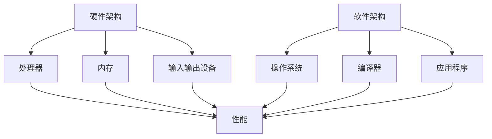
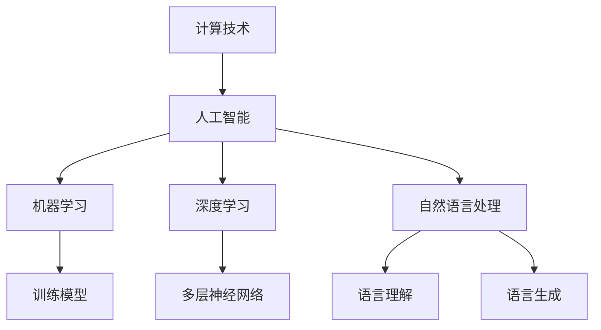
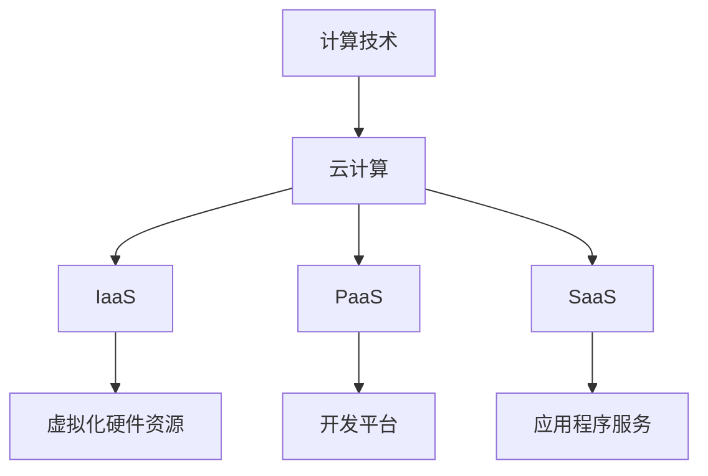
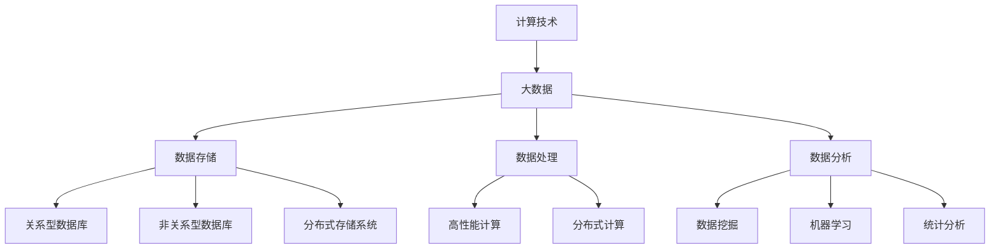

                 

### 背景介绍

> **“促进创新：支持人类计算发展的政策”**

在当今快速发展的信息技术时代，计算能力的提升已成为推动社会进步的关键因素。从早期的计算机科学基础，到现如今的人工智能、大数据和云计算，计算技术已经深刻地影响了各个行业。然而，技术的不断进步不仅需要科学家的持续研究，还需要政策层面的支持。本文将探讨如何通过制定合理的政策来促进创新，从而支持人类计算能力的进一步发展。

#### 计算技术的重要性

计算技术在现代社会中的作用不可低估。它不仅改变了我们的生活方式，也极大地提高了各行各业的效率。以下是一些关键点：

1. **经济发展**：计算技术是推动数字经济发展的核心动力。例如，电子商务、移动支付和在线服务等都是基于强大的计算能力而发展的。
2. **科学研究**：许多科学领域，如基因组学、天文学和物理学，都依赖于高性能计算来处理大规模的数据和复杂的模拟。
3. **社会管理**：从交通管理到医疗保健，计算技术帮助提高了公共服务的质量和效率。
4. **国防安全**：计算技术对于国防安全至关重要，无论是网络安全还是情报分析，都依赖于强大的计算能力。

#### 创新的驱动力

创新是计算技术持续发展的重要驱动力。以下是一些促进创新的驱动力：

1. **研究资金**：政府和企业对研究项目的投资是推动技术创新的关键。
2. **人才培养**：高质量的工程师和研究人员是创新的重要资源。教育系统和职业培训计划的改进有助于培养更多的人才。
3. **合作与竞争**：学术界和工业界的合作可以加速技术的转移和应用。同时，健康的竞争环境有助于激发企业的创新能力。

#### 政策的重要性

制定支持计算技术发展的政策对于促进创新至关重要。以下是一些关键政策：

1. **研发政策**：政府应提供资金支持，鼓励企业和研究机构进行研发活动。
2. **教育政策**：改善教育系统，特别是在计算机科学和工程领域，有助于培养未来的人才。
3. **知识产权保护**：保护知识产权可以激励创新，并吸引全球企业和研究人员投入到技术研究中。
4. **市场竞争**：建立公平的市场环境，促进健康的市场竞争，有助于企业不断创新。

在接下来的章节中，我们将进一步探讨计算技术的核心概念、核心算法原理、数学模型以及实际应用场景，同时分析未来发展趋势与挑战。通过这些内容，我们希望读者能够对计算技术的创新有一个更全面和深入的理解。

### 核心概念与联系

为了更好地理解计算技术以及如何通过政策促进其发展，我们需要明确几个核心概念，并探讨它们之间的相互联系。以下是计算技术中的一些关键概念及其关系：

#### 计算机架构

计算机架构是计算机设计的基础，它定义了计算机的各个组成部分及其如何协同工作。计算机架构包括硬件和软件两个层面。

1. **硬件架构**：包括处理器（CPU）、内存（RAM）、输入输出设备等。硬件架构决定了计算机的基本性能和功能。
2. **软件架构**：包括操作系统、编译器、应用程序等。软件架构定义了程序如何运行在计算机硬件之上。

**Mermaid 流程图：**



#### 人工智能

人工智能（AI）是计算技术的前沿领域之一，它致力于使计算机具备类似人类的智能。人工智能包括多个子领域，如机器学习、深度学习、自然语言处理等。

1. **机器学习**：通过训练模型来让计算机自动从数据中学习。
2. **深度学习**：基于多层神经网络的结构，通过大规模数据训练实现复杂模式的识别。
3. **自然语言处理**：使计算机理解和生成人类语言。

**Mermaid 流程图：**



#### 云计算

云计算是一种通过互联网提供计算资源的服务模式。它使计算资源的获取和管理变得更加灵活和高效。

1. **基础设施即服务（IaaS）**：提供虚拟化硬件资源，如虚拟机、存储和网络。
2. **平台即服务（PaaS）**：提供开发和部署应用程序的平台。
3. **软件即服务（SaaS）**：提供应用程序作为服务。

**Mermaid 流程图：**



#### 大数据

大数据涉及数据存储、处理和分析的复杂技术。它包括海量数据的收集、存储、管理和分析。

1. **数据存储**：包括关系型数据库、非关系型数据库和分布式存储系统。
2. **数据处理**：使用高性能计算和分布式计算技术来处理大量数据。
3. **数据分析**：通过数据挖掘、机器学习和统计分析等方法从数据中提取有价值的信息。

**Mermaid 流程图：**



通过理解这些核心概念及其相互联系，我们可以更全面地认识计算技术的全貌，并探讨如何通过政策促进其创新和发展。在接下来的章节中，我们将深入探讨计算技术的核心算法原理和具体操作步骤，进一步揭示计算技术的精髓。

### 核心算法原理 & 具体操作步骤

计算技术的进步离不开核心算法的研究和应用。这些算法不仅定义了计算过程的效率和精度，还推动了新的计算模式的出现。以下是一些关键算法的原理和具体操作步骤。

#### 机器学习算法

机器学习是人工智能的核心技术之一，它使得计算机能够从数据中学习并作出预测或决策。以下是几种常见的机器学习算法及其原理：

1. **线性回归**：
   - **原理**：线性回归试图找到数据集的最佳拟合直线，从而预测新的数据点。
   - **操作步骤**：
     1. 收集数据并标记特征和目标变量。
     2. 计算特征和目标变量的平均值和标准差。
     3. 使用最小二乘法计算最佳拟合直线的参数。
     4. 使用拟合直线预测新的数据点。

2. **决策树**：
   - **原理**：决策树通过一系列规则来分割数据，并基于这些规则进行预测。
   - **操作步骤**：
     1. 选择一个特征作为分割标准。
     2. 计算该特征的所有可能取值，并按照这些取值将数据分割成子集。
     3. 对每个子集重复步骤1和2，直到达到终止条件（如最大深度或最小节点大小）。

3. **支持向量机（SVM）**：
   - **原理**：SVM通过找到一个最佳超平面来分隔不同类别的数据点。
   - **操作步骤**：
     1. 训练阶段：找到能够最大分隔不同类别的超平面。
     2. 预测阶段：使用训练得到的超平面对新数据进行分类。

#### 深度学习算法

深度学习是机器学习的扩展，通过多层神经网络来模拟人脑的学习过程。以下是几种常见的深度学习算法及其原理：

1. **卷积神经网络（CNN）**：
   - **原理**：CNN通过卷积操作和池化操作来提取图像的特征。
   - **操作步骤**：
     1. 输入阶段：将图像数据输入到网络中。
     2. 卷积阶段：通过卷积层提取图像的特征。
     3. 池化阶段：通过池化层降低特征图的尺寸。
     4. 全连接阶段：将卷积和池化后的特征送入全连接层进行分类。

2. **循环神经网络（RNN）**：
   - **原理**：RNN通过记忆过去的信息来处理序列数据。
   - **操作步骤**：
     1. 初始化网络参数。
     2. 遍历序列数据，并在每个时间步计算当前的状态。
     3. 使用当前状态和前一个时间步的状态来更新当前的状态。
     4. 预测序列的下一个元素。

3. **生成对抗网络（GAN）**：
   - **原理**：GAN由生成器和判别器两个网络组成，通过相互对抗来生成逼真的数据。
   - **操作步骤**：
     1. 初始化生成器和判别器。
     2. 生成器生成假数据。
     3. 判别器判断生成的假数据和真实数据的真假。
     4. 通过梯度下降更新生成器和判别器的参数。

#### 数据分析算法

数据分析是大数据技术的重要组成部分，以下是一些常见的数据分析算法及其原理：

1. **K-均值聚类**：
   - **原理**：K-均值聚类通过迭代优化来将数据点分为K个簇。
   - **操作步骤**：
     1. 随机选择K个初始聚类中心。
     2. 计算每个数据点到聚类中心的距离，并将数据点分配到最近的聚类中心。
     3. 更新聚类中心的位置。
     4. 重复步骤2和3，直到聚类中心的位置不再变化。

2. **主成分分析（PCA）**：
   - **原理**：PCA通过线性变换将高维数据投影到低维空间，同时保留主要特征。
   - **操作步骤**：
     1. 计算数据点的协方差矩阵。
     2. 计算协方差矩阵的特征值和特征向量。
     3. 选择最大的K个特征向量作为新的基向量。
     4. 将数据点投影到新的基向量空间中。

3. **关联规则学习**：
   - **原理**：关联规则学习通过发现数据项之间的关联关系来提取有价值的信息。
   - **操作步骤**：
     1. 选择支持度和置信度作为关联规则的评估标准。
     2. 遍历所有可能的项集，计算它们的支持度和置信度。
     3. 选取满足最小支持度和置信度要求的项集作为关联规则。

通过深入理解这些核心算法的原理和操作步骤，我们可以更好地利用计算技术来解决复杂的问题。在接下来的章节中，我们将进一步探讨这些算法的数学模型和公式，并通过具体实例来说明其应用。

### 数学模型和公式 & 详细讲解 & 举例说明

在计算技术中，数学模型和公式是理解和实现算法的基础。以下我们将详细讲解几个重要的数学模型和公式，并通过具体例子来说明它们的应用。

#### 线性回归模型

线性回归模型是一种常用的统计方法，用于预测因变量和自变量之间的线性关系。

1. **公式**：

   线性回归模型可以用以下公式表示：

   $$
   y = \beta_0 + \beta_1x + \epsilon
   $$

   其中，$y$ 是因变量，$x$ 是自变量，$\beta_0$ 是截距，$\beta_1$ 是斜率，$\epsilon$ 是误差项。

2. **详细讲解**：

   - $\beta_0$ 表示当 $x$ 为 0 时 $y$ 的预期值。
   - $\beta_1$ 表示 $x$ 变化一个单位时 $y$ 的变化量。

3. **举例说明**：

   假设我们有一组数据点 $(x_i, y_i)$，其中 $x$ 表示广告投放成本，$y$ 表示销售额。我们希望通过线性回归模型预测新的广告投放成本下的销售额。

   收集数据后，我们可以计算斜率 $\beta_1$ 和截距 $\beta_0$：

   $$
   \beta_1 = \frac{\sum (x_i - \bar{x})(y_i - \bar{y})}{\sum (x_i - \bar{x})^2}
   $$
   $$
   \beta_0 = \bar{y} - \beta_1\bar{x}
   $$

   其中，$\bar{x}$ 和 $\bar{y}$ 分别是 $x$ 和 $y$ 的平均值。

   假设我们计算得到的斜率 $\beta_1$ 为 0.5，截距 $\beta_0$ 为 10。则线性回归模型为：

   $$
   y = 10 + 0.5x
   $$

   如果我们想要预测广告投放成本为 1000 时的销售额，我们可以代入公式计算：

   $$
   y = 10 + 0.5 \times 1000 = 510
   $$

#### 决策树模型

决策树是一种基于特征的树形结构模型，用于分类和回归问题。

1. **公式**：

   决策树的每个节点都表示一个特征分割，每个叶节点都表示一个类或预测值。决策树可以用以下公式表示：

   $$
   \text{DecisionTree}(x) =
   \begin{cases}
   \text{类} & \text{如果 } x \text{ 满足分割条件} \\
   \text{递归调用 } \text{DecisionTree}(x') & \text{否则}
   \end{cases}
   $$

   其中，$x$ 是输入数据，$x'$ 是根据当前节点的分割条件得到的子集。

2. **详细讲解**：

   - 每个内部节点表示一个特征分割。
   - 每个叶节点表示一个类别或预测值。
   - 决策树的构建通常基于信息增益、基尼不纯度或其他分割准则。

3. **举例说明**：

   假设我们有一个分类问题，需要根据特征 $x_1$ 和 $x_2$ 来预测类别的值。我们可以构建一个简单的决策树来表示这个问题。

   - 如果 $x_1 < 5$，则继续判断 $x_2$ 是否大于 3。
     - 如果是，则预测类别为 A。
     - 如果否，则预测类别为 B。
   - 如果 $x_1 \geq 5$，则直接预测类别为 C。

   决策树的构建可以通过以下步骤进行：

   1. 选择一个特征作为分割条件。
   2. 计算每个分割条件下的信息增益或基尼不纯度。
   3. 选择增益最大的分割条件作为当前节点的分割条件。
   4. 对每个分割后的子集递归构建决策树。

#### 卷积神经网络（CNN）模型

卷积神经网络是一种用于图像识别和处理的重要深度学习模型。

1. **公式**：

   卷积神经网络的主要操作包括卷积、池化和全连接层。卷积操作可以用以下公式表示：

   $$
   \text{Conv}(x) = \sum_{i=1}^{K} w_i * x + b
   $$

   其中，$x$ 是输入特征，$w_i$ 是卷积核，$b$ 是偏置项。

2. **详细讲解**：

   - 卷积操作通过在输入特征上滑动卷积核来提取特征。
   - 池化操作通过在特征图上取最大值或平均值来降低特征图的尺寸。
   - 全连接层通过将特征图展平为一维向量，然后与权重矩阵进行矩阵乘法，再加上偏置项，最后通过激活函数得到输出。

3. **举例说明**：

   假设我们有一个 $3 \times 3$ 的卷积核 $w$ 和一个 $5 \times 5$ 的输入特征图 $x$，以及一个偏置项 $b$。卷积操作可以用以下公式表示：

   $$
   \text{Conv}(x) = \sum_{i=1}^{9} w_{i} * x_{i} + b
   $$

   其中，$x_{i}$ 是输入特征图上的一个元素。

   假设卷积核 $w$ 如下：

   $$
   w = \begin{bmatrix}
   1 & 0 & -1 \\
   1 & 0 & -1 \\
   1 & 0 & -1
   \end{bmatrix}
   $$

   输入特征图 $x$ 如下：

   $$
   x = \begin{bmatrix}
   1 & 0 & 1 \\
   0 & 1 & 0 \\
   1 & 0 & 1
   \end{bmatrix}
   $$

   偏置项 $b = 1$。

   则卷积操作的结果为：

   $$
   \text{Conv}(x) = (1 \times 1 + 0 \times 0 + (-1) \times 1) + (1 \times 0 + 0 \times 1 + (-1) \times 0) + (1 \times 1 + 0 \times 0 + (-1) \times 1) + 1 = 0
   $$

   通过卷积、池化和全连接层的组合，卷积神经网络可以提取图像的复杂特征，从而进行分类或目标检测。

通过以上对数学模型和公式的详细讲解和举例说明，我们可以更好地理解计算技术中的核心算法原理。在接下来的章节中，我们将通过实际项目实战来展示这些算法的实际应用。

### 项目实战：代码实际案例和详细解释说明

为了更好地展示计算技术在实际项目中的应用，我们将通过一个具体的案例来详细解释代码的实现过程，并分析其中的关键步骤和注意事项。

#### 项目背景

假设我们的项目目标是使用卷积神经网络（CNN）进行图像分类。具体来说，我们将使用CNN对猫和狗的图片进行分类。这个项目将涵盖以下步骤：

1. 数据准备
2. 模型构建
3. 训练模型
4. 测试模型

#### 开发环境搭建

在开始项目之前，我们需要搭建一个适合开发的环境。以下是所需的环境和工具：

- **编程语言**：Python
- **深度学习框架**：TensorFlow 2.x 或 PyTorch
- **依赖库**：NumPy、Pandas、Matplotlib、TensorFlow 或 PyTorch
- **操作系统**：Linux 或 macOS

首先，我们需要安装所需的库：

```shell
pip install tensorflow numpy pandas matplotlib
```

#### 源代码详细实现和代码解读

以下是整个项目的源代码实现，我们将逐行进行解读。

```python
import tensorflow as tf
from tensorflow.keras.preprocessing.image import ImageDataGenerator
from tensorflow.keras.models import Sequential
from tensorflow.keras.layers import Conv2D, MaxPooling2D, Flatten, Dense
from tensorflow.keras.optimizers import Adam
from tensorflow.keras.callbacks import EarlyStopping

# 1. 数据准备
train_datagen = ImageDataGenerator(rescale=1./255)
test_datagen = ImageDataGenerator(rescale=1./255)

train_generator = train_datagen.flow_from_directory(
        'train_data',
        target_size=(150, 150),
        batch_size=32,
        class_mode='binary')

validation_generator = test_datagen.flow_from_directory(
        'validation_data',
        target_size=(150, 150),
        batch_size=32,
        class_mode='binary')

# 2. 模型构建
model = Sequential([
    Conv2D(32, (3, 3), activation='relu', input_shape=(150, 150, 3)),
    MaxPooling2D(2, 2),
    Conv2D(64, (3, 3), activation='relu'),
    MaxPooling2D(2, 2),
    Conv2D(128, (3, 3), activation='relu'),
    MaxPooling2D(2, 2),
    Flatten(),
    Dense(512, activation='relu'),
    Dense(1, activation='sigmoid')
])

# 3. 编译模型
model.compile(loss='binary_crossentropy',
              optimizer=Adam(),
              metrics=['accuracy'])

# 4. 训练模型
early_stopping = EarlyStopping(monitor='val_loss', patience=10)
model.fit(
      train_generator,
      steps_per_epoch=100,
      epochs=50,
      validation_data=validation_generator,
      validation_steps=50,
      callbacks=[early_stopping]
)

# 5. 测试模型
test_generator = test_datagen.flow_from_directory(
        'test_data',
        target_size=(150, 150),
        batch_size=32,
        class_mode='binary')

test_loss, test_acc = model.evaluate(test_generator, steps=50)
print('Test accuracy:', test_acc)
```

**代码解读与分析：**

- **1. 数据准备**
  ```python
  train_datagen = ImageDataGenerator(rescale=1./255)
  test_datagen = ImageDataGenerator(rescale=1./255)
  
  train_generator = train_datagen.flow_from_directory(
          'train_data',
          target_size=(150, 150),
          batch_size=32,
          class_mode='binary')
  
  validation_generator = test_datagen.flow_from_directory(
          'validation_data',
          target_size=(150, 150),
          batch_size=32,
          class_mode='binary')
  ```
  在这一部分，我们使用 `ImageDataGenerator` 类来准备训练数据和验证数据。`rescale` 参数用于将图像的像素值从 0 到 255 缩放到 0 到 1 之间，这样可以让模型更容易处理图像数据。`flow_from_directory` 方法用于从指定目录中读取图像数据，并生成数据生成器。

- **2. 模型构建**
  ```python
  model = Sequential([
      Conv2D(32, (3, 3), activation='relu', input_shape=(150, 150, 3)),
      MaxPooling2D(2, 2),
      Conv2D(64, (3, 3), activation='relu'),
      MaxPooling2D(2, 2),
      Conv2D(128, (3, 3), activation='relu'),
      MaxPooling2D(2, 2),
      Flatten(),
      Dense(512, activation='relu'),
      Dense(1, activation='sigmoid')
  ])
  ```
  在这里，我们使用 `Sequential` 模型堆叠多个层来构建卷积神经网络。模型包括以下几个部分：
  - **卷积层（Conv2D）**：用于提取图像的特征。
  - **池化层（MaxPooling2D）**：用于降低特征图的尺寸。
  - **全连接层（Dense）**：用于分类。

- **3. 编译模型**
  ```python
  model.compile(loss='binary_crossentropy',
                optimizer=Adam(),
                metrics=['accuracy'])
  ```
  在这一部分，我们使用 `compile` 方法来配置模型。我们使用 `binary_crossentropy` 作为损失函数，因为这是一个二分类问题。我们使用 `Adam` 优化器，并监控 `accuracy`。

- **4. 训练模型**
  ```python
  early_stopping = EarlyStopping(monitor='val_loss', patience=10)
  model.fit(
        train_generator,
        steps_per_epoch=100,
        epochs=50,
        validation_data=validation_generator,
        validation_steps=50,
        callbacks=[early_stopping]
      )
  ```
  在这里，我们使用 `fit` 方法来训练模型。`EarlyStopping` 是一个回调函数，用于在验证损失不再下降时提前停止训练。

- **5. 测试模型**
  ```python
  test_generator = test_datagen.flow_from_directory(
          'test_data',
          target_size=(150, 150),
          batch_size=32,
          class_mode='binary')
  
  test_loss, test_acc = model.evaluate(test_generator, steps=50)
  print('Test accuracy:', test_acc)
  ```
  在这里，我们使用 `evaluate` 方法来测试模型在测试数据集上的性能。`test_generator` 是使用 `test_datagen` 生成的数据生成器。

通过以上步骤，我们完成了猫和狗的图像分类项目的实现。在实际应用中，我们可以根据具体需求调整模型的结构和参数，以获得更好的分类效果。

### 实际应用场景

计算技术在各个行业和领域都有广泛的应用，以下是一些具体的应用场景和案例：

#### 1. 医疗保健

计算技术，特别是人工智能和大数据，在医疗保健领域有着巨大的潜力。例如：

- **图像诊断**：使用深度学习算法对医学图像进行分析，如X光片、MRI和CT扫描，帮助医生快速准确地诊断疾病。
- **个性化治疗**：基于患者的基因组数据和医疗记录，计算技术可以推荐个性化的治疗方案，从而提高治疗效果。
- **远程医疗**：通过云计算和视频会议技术，医生可以远程诊断和治疗患者，尤其是在偏远地区。

#### 2. 金融科技

金融科技（Fintech）是计算技术的重要应用领域，以下是一些具体的应用案例：

- **风险评估**：使用机器学习算法分析大量的金融数据，帮助金融机构进行风险评估和管理。
- **欺诈检测**：通过实时分析和模式识别技术，系统可以自动检测和防止欺诈行为。
- **智能投顾**：基于大数据和人工智能，智能投顾可以提供个性化的投资建议，帮助投资者实现资产的增值。

#### 3. 自动驾驶

自动驾驶是计算技术的另一个重要应用领域。以下是一些具体的应用案例：

- **车辆感知**：通过激光雷达、摄像头和雷达等技术，车辆可以感知周围环境，识别行人、其他车辆和道路标志等。
- **路径规划**：计算技术可以帮助自动驾驶车辆在复杂的交通环境中进行路径规划和导航。
- **决策与控制**：自动驾驶车辆通过计算技术来做出实时的决策，如加速、减速和转向等。

#### 4. 能源管理

计算技术可以帮助优化能源管理和使用，以下是一些具体的应用案例：

- **智能电网**：通过物联网和大数据技术，智能电网可以实现实时监控和优化电力供应，从而提高能源效率。
- **能效管理**：使用传感器和数据采集技术，企业和家庭可以实时监控能源使用情况，并采取相应的措施来减少能源浪费。
- **可再生能源**：计算技术可以帮助优化可再生能源的发电和储能系统，从而提高其效率和经济性。

#### 5. 教育科技

计算技术也在教育领域发挥着重要作用，以下是一些具体的应用案例：

- **在线学习平台**：通过云计算和大数据技术，教育机构可以提供个性化的在线学习体验，帮助学生更好地掌握知识。
- **自适应学习**：使用人工智能技术，系统可以根据学生的学习习惯和能力提供个性化的学习资源和练习。
- **虚拟现实（VR）和增强现实（AR）**：通过VR和AR技术，学生可以沉浸在虚拟的学习环境中，增强学习体验。

这些应用场景展示了计算技术的广泛性和潜力，同时也表明了政策支持在推动技术创新和应用中的重要性。通过合理的政策支持，我们可以进一步促进计算技术在不同领域的创新和发展。

### 工具和资源推荐

为了更好地学习和应用计算技术，以下是一些推荐的工具、资源和著作。

#### 1. 学习资源推荐

**书籍**：

- **《深度学习》（Deep Learning）**：由Ian Goodfellow、Yoshua Bengio和Aaron Courville所著，是深度学习领域的经典著作。
- **《Python机器学习》（Python Machine Learning）**：由 Sebastian Raschka 和 Vahid Mirhoseini所著，适合初学者入门。
- **《Python数据科学手册》（Python Data Science Handbook）**：由Jake VanderPlas所著，涵盖数据科学的核心概念和工具。

**论文**：

- **《A Theoretical Investigation of the Relationship between Depth and Precision in Deep Learning》**：探讨了深度神经网络深度与精度之间的关系。
- **《ResNet: Training Deep Neural Networks for Classification》**：提出了残差网络（ResNet），大幅提高了深度神经网络的能力。

**博客和网站**：

- **[Deep Learning Course](https://www.deeplearning.ai/) by Andrew Ng**：Andrew Ng教授的深度学习课程，提供丰富的教程和资源。
- **[TensorFlow 官方文档](https://www.tensorflow.org/tutorials)**：TensorFlow官方文档，包含大量的教程和示例代码。

#### 2. 开发工具框架推荐

**深度学习框架**：

- **TensorFlow**：Google开发的开源深度学习框架，适用于各种规模的深度学习项目。
- **PyTorch**：Facebook开发的开源深度学习框架，以动态计算图著称，适用于研究和快速原型开发。

**数据分析工具**：

- **Pandas**：Python的数据分析库，提供强大的数据操作和分析功能。
- **NumPy**：Python的数值计算库，是数据分析的基础。

**版本控制工具**：

- **Git**：分布式版本控制系统，用于管理代码版本。
- **GitHub**：基于Git的代码托管平台，提供丰富的协作功能。

#### 3. 相关论文著作推荐

**深度学习领域**：

- **《Unsupervised Learning of Visual Representations by Solving Jigsaw Puzzles》**：通过解决拼图问题学习视觉表示。
- **《DenseNet: Breaking the Barriers to Deep Learning on Resource-constrained Devices》**：提出了DenseNet结构，优化了深度网络的计算效率。

**计算机科学领域**：

- **《Introduction to Algorithms》**：Thomas H. Cormen等所著，涵盖了算法设计和分析的基础知识。
- **《The Art of Computer Programming》**：Donald E. Knuth所著，是计算机科学领域的经典著作，详细介绍了程序设计的艺术。

通过这些工具和资源的支持，我们可以更好地掌握计算技术的核心概念和实际应用，推动计算技术的创新和发展。

### 总结：未来发展趋势与挑战

随着计算技术的不断进步，未来将迎来一系列新的发展趋势和挑战。以下是一些关键趋势和潜在挑战的探讨。

#### 未来发展趋势

1. **量子计算**：量子计算被认为是未来计算技术的重要发展方向。量子计算机能够处理传统计算机难以解决的大规模问题，如化学模拟和密码破解。然而，量子计算仍然面临技术难题，如量子错误纠正和量子态的稳定维持。

2. **边缘计算**：随着物联网（IoT）和5G技术的普及，边缘计算成为解决数据传输延迟和带宽瓶颈的关键。边缘计算将计算能力推向网络边缘，使得实时数据处理成为可能，从而提高应用性能和响应速度。

3. **人工智能的融合应用**：人工智能将继续与其他领域深度融合，推动医疗、金融、制造和交通等行业的创新。例如，医疗领域的精准医疗、金融行业的智能投顾、制造业的智能制造等。

4. **数据隐私和安全**：随着数据量的增加和应用的普及，数据隐私和安全问题日益突出。未来的计算技术将更加注重数据保护和隐私保护，确保用户数据的安全和隐私。

#### 潜在挑战

1. **计算资源分配**：随着计算需求的增加，如何高效地分配和利用计算资源成为一个挑战。云计算和边缘计算的发展需要在资源管理和调度方面进行优化，以避免资源浪费和性能瓶颈。

2. **技术标准化**：计算技术的快速发展带来了大量的新标准和协议，如何确保技术之间的兼容性和互操作性成为挑战。统一的标准化框架有助于促进不同技术和平台之间的协同发展。

3. **人才培养**：随着计算技术的不断进步，对高素质人才的需求也在增加。然而，现有的教育和培训体系可能无法满足这一需求。未来需要加大对计算机科学和工程教育的投入，培养更多具备创新能力和实践经验的专业人才。

4. **伦理和社会影响**：计算技术的发展不仅带来了技术挑战，还引发了伦理和社会问题。如何确保人工智能的公平性和透明性，避免对人类社会造成负面影响，是需要深入思考和解决的问题。

总之，未来计算技术的发展将充满机遇和挑战。通过政策支持、技术创新和人才培养，我们可以更好地应对这些挑战，推动计算技术的持续进步和社会的发展。

### 附录：常见问题与解答

#### 问题1：计算技术与人工智能有什么区别？

计算技术是指利用计算机硬件和软件进行数据处理、计算和存储的科学技术。而人工智能（AI）是计算技术的一个子领域，它致力于使计算机具备类似人类的智能，包括学习、推理、解决问题和感知等能力。简单来说，计算技术是实现人工智能的底层基础，而人工智能则是计算技术的高级应用。

#### 问题2：量子计算如何与传统计算不同？

量子计算利用量子力学原理进行计算，具有并行性和叠加性，能够在某些特定问题上大幅超越传统计算。与传统计算相比，量子计算可以利用量子位（qubit）同时表示0和1的叠加状态，从而实现大规模并行计算。此外，量子计算可以通过量子纠缠实现信息传递和量子算法，解决传统计算机难以处理的问题。

#### 问题3：如何确保数据隐私和安全？

确保数据隐私和安全的方法包括加密技术、访问控制和数据匿名化等。加密技术可以通过加密算法保护数据在传输和存储过程中的安全。访问控制可以通过设置用户权限和身份验证来限制对数据的访问。数据匿名化则通过去除或隐藏个人身份信息，降低数据泄露的风险。

#### 问题4：未来计算技术将如何影响我们的生活？

未来计算技术将深刻影响我们的生活，包括以下几个方面：

1. **智能化生活**：智能家居、智能健康监控和智能交通等技术的普及将使我们的生活更加便捷和安全。
2. **教育革命**：在线教育、虚拟现实（VR）和增强现实（AR）技术的发展将改变传统教育模式，提高教育质量和普及率。
3. **经济转型**：计算技术的创新将推动新产业的发展，促进经济增长和就业机会。
4. **社会管理**：大数据和人工智能将帮助政府和公共部门提高决策效率和服务质量。

### 扩展阅读 & 参考资料

为了深入理解计算技术的各个方面，以下是一些建议的扩展阅读和参考资料：

- **书籍**：
  - **《深度学习》（Deep Learning）**：Ian Goodfellow、Yoshua Bengio和Aaron Courville 著，深入介绍了深度学习的基础知识和最新进展。
  - **《计算机程序设计艺术》（The Art of Computer Programming）**：Donald E. Knuth 著，经典著作，涵盖了计算机科学的核心概念和算法设计。
  
- **论文**：
  - **《A Theoretical Investigation of the Relationship between Depth and Precision in Deep Learning》**：探讨了深度神经网络深度与精度之间的关系。
  - **《ResNet: Training Deep Neural Networks for Classification》**：提出了残差网络（ResNet），大幅提高了深度神经网络的能力。

- **在线教程和课程**：
  - **[Deep Learning Course](https://www.deeplearning.ai/) by Andrew Ng**：提供丰富的深度学习教程和资源。
  - **[TensorFlow 官方文档](https://www.tensorflow.org/tutorials)**：涵盖 TensorFlow 的详细教程和示例代码。

- **开源项目**：
  - **[TensorFlow](https://www.tensorflow.org/)**：Google 开发和维护的开源深度学习框架。
  - **[PyTorch](https://pytorch.org/)**：Facebook 开发和维护的开源深度学习框架。

通过这些扩展阅读和参考资料，您可以进一步了解计算技术的理论和实践，为深入研究和应用打下坚实的基础。

