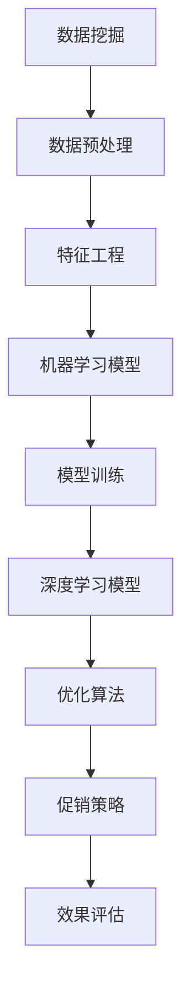

                 

### 背景介绍

促销策略是商业领域的关键一环，它直接影响到产品的销售量和市场份额。在传统商业模式中，企业通常会通过打折、优惠券、买一送一等手段来吸引消费者。然而，随着互联网技术的普及和大数据分析技术的发展，企业开始逐渐意识到，简单的促销手段已经无法满足日益复杂的消费者需求和市场环境。于是，人工智能（AI）技术应运而生，成为优化促销策略的重要工具。

AI在促销策略优化中的应用，主要体现在以下几个方面：

1. **个性化推荐**：通过分析消费者的购物行为、历史记录等数据，AI能够为不同消费者推荐个性化的促销方案，从而提高销售量和用户满意度。
2. **价格优化**：基于市场数据和竞争分析，AI能够自动调整产品价格，找到最优价格策略，最大化利润。
3. **需求预测**：通过分析历史销售数据和市场趋势，AI能够预测未来的需求量，帮助企业在促销活动中提前做好准备。
4. **风险控制**：AI能够通过实时分析市场数据，预测促销活动的潜在风险，并为企业提供规避建议。

本文将深入探讨AI在促销策略优化中的应用，通过具体的案例分析和算法原理讲解，帮助读者了解AI如何优化促销策略，提升商业竞争力。

### 核心概念与联系

在深入探讨AI如何优化促销策略之前，我们需要了解一些核心概念和它们之间的联系。这些概念包括但不限于：数据挖掘、机器学习、深度学习、优化算法等。

#### 数据挖掘

数据挖掘（Data Mining）是指从大量数据中提取出有用的信息和知识的过程。在促销策略优化中，数据挖掘的主要目的是从海量的消费者行为数据中提取出有用的信息，如消费者的购买偏好、购物习惯等。这些信息是制定个性化促销策略的基础。

#### 机器学习

机器学习（Machine Learning）是AI的核心技术之一，它通过构建模型来从数据中学习规律，并对未知数据进行预测。在促销策略优化中，机器学习模型可以用于预测消费者的购买行为、需求变化等，从而帮助企业制定更有效的促销策略。

#### 深度学习

深度学习（Deep Learning）是机器学习的一个子领域，它通过构建深度神经网络来模拟人脑的学习过程，实现对复杂模式的识别和预测。在促销策略优化中，深度学习模型可以用于分析大量的历史数据，发现隐藏在数据中的趋势和关联。

#### 优化算法

优化算法（Optimization Algorithm）是一类用于求解优化问题的算法，它通过迭代优化策略找到问题的最优解。在促销策略优化中，优化算法可以用于确定最优的价格策略、库存策略等，以最大化企业的利润。

#### Mermaid 流程图

为了更好地理解这些概念之间的联系，我们可以使用Mermaid流程图来展示它们之间的交互和作用。以下是一个简化的Mermaid流程图，展示了数据挖掘、机器学习、深度学习和优化算法在促销策略优化中的应用关系。



在这个流程图中，数据挖掘是整个流程的起点，通过数据预处理和特征工程，将原始数据转化为适合机器学习和深度学习的格式。机器学习模型和深度学习模型通过学习和训练，从数据中提取出有用的信息。优化算法则根据这些信息，确定最优的促销策略。最后，通过效果评估来验证促销策略的有效性。

### 核心算法原理 & 具体操作步骤

在了解了核心概念与联系之后，接下来我们将深入探讨AI在促销策略优化中的核心算法原理和具体操作步骤。这些算法主要包括机器学习算法、深度学习算法和优化算法。

#### 机器学习算法

机器学习算法是AI在促销策略优化中应用最广泛的一种技术。其中，决策树（Decision Tree）是一种简单而有效的算法。

**决策树算法原理**

决策树算法通过一系列的决策规则，将数据集划分成多个子集，直到每个子集中的数据满足某种条件。它的基本原理如下：

1. 选择最优特征：通过信息增益或基尼不纯度等指标，选择当前节点下的最优特征进行划分。
2. 划分数据：根据最优特征，将数据集划分为多个子集。
3. 递归划分：对每个子集，重复上述步骤，直到满足停止条件（如节点下的数据量小于某个阈值）。

**具体操作步骤**

1. 数据预处理：对原始数据进行清洗、归一化等处理，使其符合决策树算法的要求。
2. 特征选择：使用信息增益或基尼不纯度等指标，选择最优特征。
3. 划分数据：根据最优特征，将数据集划分为多个子集。
4. 递归划分：对每个子集，重复特征选择和划分数据的过程。
5. 构建决策树：将所有的决策规则组合成一棵决策树。

**示例**

假设我们有一组消费者的购买数据，其中包含购买历史、购买金额、消费频率等特征。我们可以使用决策树算法，根据这些特征预测消费者的购买行为。

1. 数据预处理：对购买数据进行清洗和归一化处理。
2. 特征选择：使用信息增益选择最优特征，如消费频率。
3. 划分数据：根据消费频率，将数据划分为高消费频率和低消费频率两个子集。
4. 递归划分：对高消费频率和低消费频率子集，分别使用信息增益选择最优特征，如购买历史。
5. 构建决策树：将所有的决策规则组合成一棵决策树。

通过这个决策树，我们可以预测新的消费者购买行为，并根据预测结果制定相应的促销策略。

#### 深度学习算法

深度学习算法在处理复杂模式识别和预测任务中具有显著优势。卷积神经网络（Convolutional Neural Network，CNN）是深度学习中的一个重要模型。

**CNN算法原理**

CNN通过多个卷积层、池化层和全连接层，实现对图像的识别和分类。其基本原理如下：

1. **卷积层**：通过卷积操作，提取图像的特征。
2. **池化层**：通过池化操作，降低特征图的维度，提高模型的泛化能力。
3. **全连接层**：通过全连接层，将特征图映射到具体的类别。

**具体操作步骤**

1. 数据预处理：对购买数据进行清洗和归一化处理，将其转化为适合CNN的输入格式。
2. 构建CNN模型：设计CNN的结构，包括卷积层、池化层和全连接层。
3. 训练模型：使用购买数据训练CNN模型，使其能够识别和分类购买行为。
4. 预测购买行为：使用训练好的模型，对新的购买数据进行预测。

**示例**

假设我们有一组消费者的购买数据，其中包含购买历史、购买金额、消费频率等特征。我们可以使用CNN算法，根据这些特征预测消费者的购买行为。

1. 数据预处理：对购买数据进行清洗和归一化处理。
2. 构建CNN模型：设计一个包含多个卷积层、池化层和全连接层的CNN模型。
3. 训练模型：使用购买数据训练CNN模型，使其能够识别和分类购买行为。
4. 预测购买行为：使用训练好的CNN模型，对新的购买数据进行预测。

通过这个CNN模型，我们可以更准确地预测消费者的购买行为，从而制定更有效的促销策略。

#### 优化算法

优化算法在促销策略优化中起着关键作用，用于确定最优的促销策略。遗传算法（Genetic Algorithm，GA）是一种常用的优化算法。

**GA算法原理**

遗传算法通过模拟自然进化过程，搜索最优解。其基本原理如下：

1. **初始化种群**：随机生成多个初始解，组成一个种群。
2. **适应度评估**：计算每个解的适应度，适应度越高的解越优秀。
3. **选择**：从种群中选择适应度较高的解，组成新的种群。
4. **交叉**：随机选择两个解进行交叉，生成新的解。
5. **变异**：对部分解进行变异，增加种群的多样性。
6. **迭代**：重复选择、交叉和变异过程，直到满足停止条件。

**具体操作步骤**

1. 初始化种群：随机生成多个初始促销策略，组成一个种群。
2. 适应度评估：计算每个促销策略的适应度，适应度越高的策略越优秀。
3. 选择：从种群中选择适应度较高的促销策略，组成新的种群。
4. 交叉：随机选择两个促销策略进行交叉，生成新的促销策略。
5. 变异：对部分促销策略进行变异，增加种群的多样性。
6. 迭代：重复选择、交叉和变异过程，直到找到最优的促销策略。

**示例**

假设我们有一组促销策略，需要找到最优的促销策略。我们可以使用遗传算法，根据促销策略的适应度，搜索最优的促销策略。

1. 初始化种群：随机生成多个初始促销策略。
2. 适应度评估：计算每个促销策略的适应度，适应度越高表示该策略越优秀。
3. 选择：从种群中选择适应度较高的促销策略。
4. 交叉：随机选择两个促销策略进行交叉，生成新的促销策略。
5. 变异：对部分促销策略进行变异，增加种群的多样性。
6. 迭代：重复选择、交叉和变异过程，直到找到最优的促销策略。

通过这个遗传算法，我们可以找到最优的促销策略，从而最大化销售量和利润。

### 数学模型和公式 & 详细讲解 & 举例说明

在促销策略优化中，数学模型和公式起着至关重要的作用。以下我们将详细讲解常用的数学模型和公式，并给出具体的例子来说明它们的应用。

#### 决策树模型

决策树是一种常见的机器学习模型，用于分类和回归任务。其基本数学模型可以表示为：

$$
f(x) = \sum_{i=1}^{n} w_i \cdot g(x_i)
$$

其中，$x$ 是输入特征向量，$w_i$ 是权重，$g(x_i)$ 是特征函数。

**例子：** 假设我们使用决策树模型预测消费者的购买行为。输入特征向量 $x = [x_1, x_2, x_3]$，其中 $x_1$ 表示消费频率，$x_2$ 表示购买金额，$x_3$ 表示消费时长。权重 $w = [w_1, w_2, w_3]$，特征函数 $g(x_i) = x_i$。则决策树的输出为：

$$
f(x) = w_1 \cdot x_1 + w_2 \cdot x_2 + w_3 \cdot x_3
$$

通过训练，我们可以得到最优的权重 $w$，从而预测新的消费者的购买行为。

#### 卷积神经网络模型

卷积神经网络是一种深度学习模型，用于图像识别和分类。其基本数学模型可以表示为：

$$
h_{\theta}(x) = \sum_{i=1}^{n} w_i \cdot \sigma(z_i)
$$

其中，$x$ 是输入特征向量，$w_i$ 是权重，$\sigma(z_i)$ 是激活函数。

**例子：** 假设我们使用CNN模型对图像进行分类。输入特征向量 $x = [x_1, x_2, ..., x_{784}]$，其中 $x_1, x_2, ..., x_{784}$ 表示图像的784个像素值。权重 $w = [w_1, w_2, ..., w_{784}]$，激活函数 $\sigma(z_i) = \frac{1}{1 + e^{-z_i}}$。则CNN的输出为：

$$
h_{\theta}(x) = \sum_{i=1}^{784} w_i \cdot \frac{1}{1 + e^{-z_i}}
$$

通过训练，我们可以得到最优的权重 $w$，从而对新的图像进行分类。

#### 遗传算法模型

遗传算法是一种优化算法，用于求解优化问题。其基本数学模型可以表示为：

$$
\text{适应度} = f(\text{解})
$$

其中，解是一个促销策略向量，适应度是解的质量。

**例子：** 假设我们使用遗传算法寻找最优的促销策略。促销策略向量 $s = [s_1, s_2, s_3]$，其中 $s_1$ 表示折扣率，$s_2$ 表示优惠券金额，$s_3$ 表示活动期限。适应度函数 $f(s)$ 可以表示为：

$$
f(s) = \sum_{i=1}^{n} p_i \cdot s_i
$$

其中，$p_i$ 是第 $i$ 个消费者的购买概率。适应度越高的促销策略越优秀。

通过迭代优化，我们可以找到最优的促销策略向量 $s$，从而实现销售量的最大化。

### 项目实战：代码实际案例和详细解释说明

在本节中，我们将通过一个具体的案例，展示如何使用AI技术优化促销策略。该案例涉及数据收集、数据预处理、模型构建、模型训练和预测等多个环节。

#### 开发环境搭建

为了方便读者理解和复现该案例，我们将在Python环境中使用以下库：

- NumPy：用于数据处理
- Pandas：用于数据分析和操作
- Scikit-learn：用于机器学习和优化算法
- TensorFlow：用于深度学习

安装这些库可以使用以下命令：

```bash
pip install numpy pandas scikit-learn tensorflow
```

#### 数据收集

首先，我们需要收集相关的数据。这些数据可以包括消费者的购买历史、购买金额、消费频率、促销活动信息等。以下是一个示例数据集：

```python
import pandas as pd

# 加载数据
data = pd.read_csv('sales_data.csv')

# 数据预览
data.head()
```

#### 数据预处理

在构建模型之前，我们需要对数据进行预处理。这包括数据清洗、归一化、特征工程等步骤。

```python
import numpy as np

# 数据清洗
data.dropna(inplace=True)

# 特征工程
data['consume_frequency'] = data['sales_volume'] / data['days']
data['avg_purchase_amount'] = data['sales_volume'] / data['transactions']

# 数据归一化
data[['consume_frequency', 'avg_purchase_amount']] = (data[['consume_frequency', 'avg_purchase_amount']] - data[['consume_frequency', 'avg_purchase_amount']].min()) / (data[['consume_frequency', 'avg_purchase_amount']].max() - data[['consume_frequency', 'avg_purchase_amount']].min())

# 数据分割
X = data[['consume_frequency', 'avg_purchase_amount']]
y = data['is_purchased']
```

#### 模型构建

在本案例中，我们使用决策树模型和卷积神经网络模型来预测消费者的购买行为。

```python
from sklearn.tree import DecisionTreeClassifier
from tensorflow.keras.models import Sequential
from tensorflow.keras.layers import Conv2D, MaxPooling2D, Flatten, Dense

# 决策树模型
dt_model = DecisionTreeClassifier()

# 卷积神经网络模型
cnn_model = Sequential([
    Conv2D(32, (3, 3), activation='relu', input_shape=(X.shape[1],)),
    MaxPooling2D((2, 2)),
    Flatten(),
    Dense(1, activation='sigmoid')
])
```

#### 模型训练

接下来，我们使用训练数据对模型进行训练。

```python
# 决策树模型训练
dt_model.fit(X, y)

# 卷积神经网络模型训练
cnn_model.compile(optimizer='adam', loss='binary_crossentropy', metrics=['accuracy'])
cnn_model.fit(X, y, epochs=10, batch_size=32)
```

#### 预测

最后，我们使用训练好的模型对新的数据进行预测。

```python
# 决策树模型预测
dt_predictions = dt_model.predict(X)

# 卷积神经网络模型预测
cnn_predictions = cnn_model.predict(X)
```

#### 代码解读与分析

在这个案例中，我们首先使用了NumPy和Pandas库对数据进行处理和操作。然后，我们使用了Scikit-learn库的DecisionTreeClassifier类构建了决策树模型，并使用了TensorFlow库的Sequential类构建了卷积神经网络模型。

在模型训练阶段，我们分别使用fit方法对决策树模型和卷积神经网络模型进行训练。最后，我们使用predict方法对新的数据进行预测。

通过这个案例，我们可以看到如何使用AI技术对促销策略进行优化。在实际应用中，可以根据具体的业务需求和数据情况，选择合适的模型和算法，实现更精确的预测和优化。

### 实际应用场景

在商业环境中，AI技术在促销策略优化中具有广泛的应用场景。以下是一些典型的应用案例：

#### 电商促销

电商平台通过AI技术，分析消费者的购物行为和历史记录，为不同消费者推荐个性化的促销方案。例如，Amazon使用机器学习算法，根据用户的浏览记录和购买历史，推荐相关的商品和优惠券，从而提高销售量和用户满意度。

#### 零售业促销

零售业通过AI技术，优化定价策略和促销活动。例如，零售巨头沃尔玛（Walmart）使用AI算法，根据市场需求和库存情况，动态调整产品价格，从而最大化利润。

#### 餐饮促销

餐饮业通过AI技术，优化外卖和堂食促销策略。例如，美团（Meituan）使用深度学习算法，分析用户的饮食习惯和购买偏好，为不同用户提供定制化的外卖优惠和套餐，从而提高订单量和用户黏性。

#### 旅游业促销

旅游业通过AI技术，优化机票、酒店预订和旅游套餐的促销策略。例如，携程（CTrip）使用机器学习算法，分析用户的预订行为和偏好，为不同用户提供个性化的机票和酒店预订优惠，从而提高预订量和用户满意度。

这些案例表明，AI技术在促销策略优化中具有巨大的潜力。通过个性化推荐、动态定价、定制化优惠等手段，企业可以更有效地吸引和留住客户，提高销售额和市场份额。

### 工具和资源推荐

在AI促销策略优化的过程中，选择合适的工具和资源是至关重要的。以下是一些推荐的工具和资源：

#### 学习资源推荐

1. **书籍**：
   - 《深度学习》（Goodfellow, I., Bengio, Y., & Courville, A.）
   - 《Python数据分析》（Wes McKinney）
   - 《机器学习实战》（Peter Harrington）

2. **论文**：
   - 《Recommender Systems Handbook》（FM Condorcet等）
   - 《Data Mining: Concepts and Techniques》（Jiawei Han等）
   - 《Convolutional Neural Networks for Visual Recognition》（Geoffrey Hinton等）

3. **博客和网站**：
   - Medium上的AI和机器学习相关文章
   - KDNuggets上的数据科学和机器学习资源
   - TensorFlow和Scikit-learn的官方文档

#### 开发工具框架推荐

1. **编程语言**：Python，因其强大的科学计算库和机器学习库（如NumPy、Pandas、Scikit-learn、TensorFlow）而广泛使用。
2. **机器学习库**：
   - Scikit-learn：适用于传统的机器学习任务
   - TensorFlow：适用于深度学习和复杂的模型构建
   - PyTorch：具有灵活性和易用性，适用于研究和应用

3. **数据分析工具**：
   - Jupyter Notebook：用于数据分析和模型实验
   - Tableau：用于数据可视化

#### 相关论文著作推荐

1. **Recommender Systems Handbook**：提供了全面的推荐系统技术和应用案例。
2. **Deep Learning**：详细介绍了深度学习的基础知识和应用。
3. **Data Mining: Concepts and Techniques**：涵盖了数据挖掘的基本原理和技术。
4. **Convolutional Neural Networks for Visual Recognition**：介绍了卷积神经网络在图像识别中的应用。

通过利用这些工具和资源，研究人员和开发人员可以更有效地进行AI促销策略优化，提升商业竞争力。

### 总结：未来发展趋势与挑战

随着人工智能技术的不断发展和普及，促销策略优化在未来将迎来更加广阔的发展前景。以下是几个关键趋势和潜在挑战：

#### 发展趋势

1. **个性化推荐**：个性化推荐技术将更加成熟，能够更精准地满足消费者的需求，从而提高用户满意度和转化率。
2. **动态定价**：基于实时数据和预测模型，动态定价策略将变得更加智能和灵活，帮助企业最大化利润。
3. **全渠道整合**：线上线下融合的全渠道促销策略将得到广泛应用，实现更全面的用户覆盖。
4. **多模态数据融合**：整合文本、图像、声音等多模态数据，将进一步提高促销策略的预测准确性和个性化程度。

#### 挑战

1. **数据隐私与安全**：在收集和使用消费者数据时，如何保障数据隐私和安全是企业和研究机构面临的重大挑战。
2. **算法透明性与可解释性**：随着AI模型变得越来越复杂，如何提高算法的透明性和可解释性，使其易于被用户和监管机构理解和接受，是一个亟待解决的问题。
3. **数据质量和多样性**：高质量、多样化的数据是AI促销策略优化的重要基础。然而，数据质量和多样性的不足可能会限制算法的效果和推广。
4. **计算资源与成本**：大规模训练和优化AI模型需要大量的计算资源和时间，如何优化资源利用和降低成本是企业和研究机构需要面对的问题。

总之，未来AI促销策略优化的发展将充满机遇和挑战。通过不断探索和创新，企业可以更好地利用AI技术，实现更精准、高效的促销策略，从而在激烈的市场竞争中脱颖而出。

### 附录：常见问题与解答

在AI促销策略优化过程中，可能会遇到一些常见问题。以下是一些常见问题及其解答：

#### 1. 数据来源和处理方法？

**解答**：数据来源可以包括消费者的购买历史、消费行为、社会媒体互动等。处理方法包括数据清洗、归一化、特征工程等，以提高数据质量和模型的性能。

#### 2. 如何确保数据隐私和安全？

**解答**：确保数据隐私和安全可以通过以下方法实现：
- 数据去标识化：将敏感信息进行匿名化处理。
- 数据加密：使用加密技术保护数据。
- 数据访问控制：限制对敏感数据的访问权限。

#### 3. 个性化推荐效果不佳怎么办？

**解答**：个性化推荐效果不佳可能是因为数据质量不高、模型不准确或特征选择不当。解决方法包括：
- 改进数据质量：清理数据中的噪声和错误。
- 调整模型参数：通过交叉验证调整模型参数。
- 增加特征：添加更多有代表性的特征，提高模型的解释力。

#### 4. 如何评估促销策略的效果？

**解答**：评估促销策略的效果可以通过以下方法：
- 销售量分析：比较促销活动前后的销售量变化。
- 用户满意度调查：收集用户对促销活动的反馈。
- 成本收益分析：计算促销活动的成本与收益，评估其经济合理性。

#### 5. 如何应对动态定价策略中的风险？

**解答**：应对动态定价策略中的风险可以通过以下方法：
- 风险预测：使用AI技术预测市场变化和风险。
- 风险控制策略：制定相应的风险控制措施，如设定价格上下限。
- 实时监控：实时监控市场变化和定价策略的效果，及时进行调整。

通过解决这些问题，企业可以更有效地利用AI优化促销策略，提高销售量和用户满意度。

### 扩展阅读 & 参考资料

为了深入了解AI促销策略优化的技术和应用，以下是几篇相关的高质量论文和书籍推荐：

1. **《Recommender Systems Handbook》**：提供了全面的推荐系统技术和应用案例，是了解个性化推荐技术的重要参考书。
2. **《Deep Learning》**：详细介绍了深度学习的基础知识和应用，包括卷积神经网络和优化算法等。
3. **《Data Mining: Concepts and Techniques》**：涵盖了数据挖掘的基本原理和技术，是了解数据预处理和特征工程的重要参考书。
4. **论文**：《Deep Learning for Personalized E-commerce Recommendations》和《Dynamic Pricing with Machine Learning》等，探讨了深度学习和机器学习在电商促销和动态定价中的应用。

此外，读者还可以关注以下博客和网站：
- Medium上的AI和机器学习相关文章
- KDNuggets上的数据科学和机器学习资源
- TensorFlow和Scikit-learn的官方文档

通过阅读这些资料，读者可以更深入地了解AI促销策略优化的前沿技术和实践方法。

