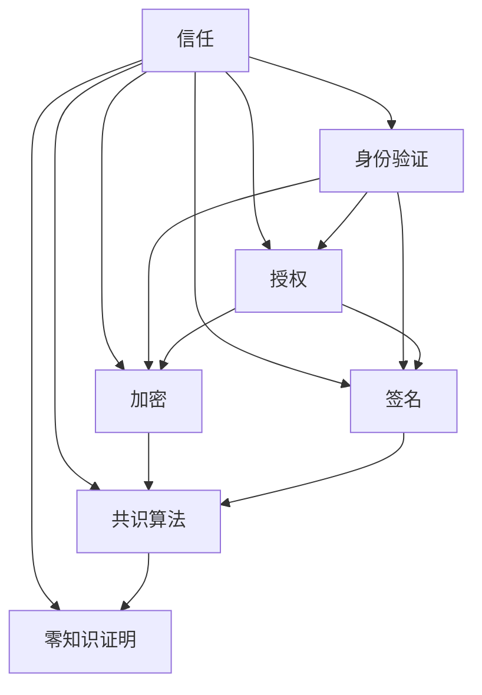

                 

### 背景介绍

在当今高速发展的信息技术时代，信任建设成为各行各业，尤其是IT领域的基石。信任不仅仅是人与人之间的相互信赖，更涉及到软件、系统乃至整个网络的安全与稳定。本文将深入探讨信任建设在IT领域的重要性，分析其核心概念与架构，并逐步揭示其中的算法原理与操作步骤。同时，我们将通过具体项目实战，展示代码实现与解读，最终探讨其应用场景及未来发展。

随着互联网和云计算的普及，IT系统日益复杂，信任问题变得愈发突出。在金融、医疗、物联网等敏感领域，信任的缺失可能导致严重的后果，如数据泄露、系统崩溃等。因此，如何构建一个可靠的信任体系，确保数据的完整性和系统的稳定性，成为当前研究的热点。

本文旨在通过以下结构，对信任建设进行全面剖析：

1. **背景介绍**：概述信任建设在IT领域的意义。
2. **核心概念与联系**：介绍信任建设的核心概念及其相互关系。
3. **核心算法原理 & 具体操作步骤**：解析信任算法的基本原理与操作步骤。
4. **数学模型和公式 & 详细讲解 & 举例说明**：运用数学模型和公式，详细解释信任算法。
5. **项目实战：代码实际案例和详细解释说明**：通过具体项目，展示信任算法的代码实现。
6. **实际应用场景**：分析信任建设在各个领域的应用。
7. **工具和资源推荐**：推荐相关学习资源和开发工具。
8. **总结：未来发展趋势与挑战**：展望信任建设的未来趋势与面临的挑战。
9. **附录：常见问题与解答**：解答读者可能遇到的问题。
10. **扩展阅读 & 参考资料**：提供更多深入的阅读材料。

通过本文的深入探讨，我们希望能够为读者提供一个全面、系统的信任建设指南，帮助他们在实际工作中更好地应对信任问题，构建稳定、可靠的IT系统。

#### 核心概念与联系

在深入探讨信任建设之前，有必要明确几个核心概念，并理解它们之间的相互关系。以下是本文中涉及的主要核心概念：

1. **信任（Trust）**：信任是指个体或组织对另一个个体或组织行为可靠性和诚实性的预期。在IT领域，信任主要指系统之间的可靠性、数据完整性和安全性。

2. **身份验证（Authentication）**：身份验证是确定用户或系统身份的过程，通常通过用户名、密码或生物识别技术实现。它是构建信任体系的第一步，确保只有授权用户才能访问系统资源。

3. **授权（Authorization）**：授权是在身份验证通过后，确定用户或系统能够访问哪些资源的机制。授权确保用户只能执行其被允许的操作。

4. **加密（Encryption）**：加密是使用密钥将数据转换为无法被未经授权者读取的形式，从而保护数据传输和存储的安全性。加密是构建信任体系的重要手段，确保数据在传输和存储过程中不会被窃取或篡改。

5. **签名（Signature）**：签名是验证数据完整性和来源的一种机制。通过使用私钥对数据进行签名，发送方可以确保数据在传输过程中未被篡改，而接收方可以使用公钥验证签名的有效性。

6. **共识算法（Consensus Algorithm）**：共识算法是分布式系统中达成一致的方法。在区块链等系统中，共识算法确保所有节点对交易和历史数据有一致的理解，从而建立信任。

7. **零知识证明（Zero-Knowledge Proof）**：零知识证明是一种安全协议，证明者能够证明某事为真，但不泄露任何额外信息。零知识证明在隐私保护和身份验证中具有重要应用。

这些核心概念共同构成了信任建设的基础。下面，我们将使用Mermaid流程图来展示它们之间的相互关系。



在上面的流程图中，每个节点代表一个核心概念，箭头表示概念之间的依赖关系。例如，身份验证和授权之间有直接的依赖关系，因为只有在验证了用户的身份后，才能根据其权限进行授权。同样，加密和签名都是确保数据安全和完整性的重要手段，它们与共识算法和零知识证明密切相关。

通过这种结构化的方式，我们可以清晰地理解信任建设中的各个核心概念及其相互联系，为进一步分析和探讨信任算法提供基础。

#### 核心算法原理 & 具体操作步骤

在了解了信任建设的核心概念之后，我们接下来将深入探讨其中的核心算法原理，并详细讲解其操作步骤。本文将主要介绍一种广泛应用的信任算法——基于身份的加密算法（Identity-Based Encryption，简称IBE）。

**1. IBE算法原理**

IBE算法是一种公钥加密算法，其特点是将用户身份作为公钥，简化了密钥分发过程。IBE算法主要包括以下几个部分：

- **主密钥（Master Key）**：由密钥生成中心（Key Generation Center，简称KGC）生成，用于生成用户私钥。
- **用户公钥（User Public Key）**：由用户身份标识（如邮箱地址、用户名）构成，作为加密和解密过程中的公钥。
- **用户私钥（User Private Key）**：由用户身份标识和主密钥生成，用于解密消息。

**2. 具体操作步骤**

**步骤 1：密钥生成**

KGC生成主密钥PK，并生成一个随机数k，作为主密钥的一部分。主密钥和随机数共同构成KGC的密钥对（PK, SK），其中PK是公开的，SK是保密的。

**步骤 2：用户密钥生成**

用户U选择一个身份标识ID，向KGC请求密钥生成。KGC收到请求后，根据用户身份标识ID和主密钥PK，生成用户私钥SK_ID。这个过程可以通过以下公式表示：

SK_ID = Dec_SK(SK, ID, PK)

其中，Dec_SK是一个加密函数，用于从主密钥和用户身份标识中生成用户私钥。

**步骤 3：加密**

当用户U需要发送一条消息M给另一个用户V时，U使用V的公钥和身份标识ID进行加密。加密过程如下：

- U生成一个随机数r，并计算加密密文C：
C = Enc_V(PK, M, r)

其中，Enc_V是一个加密函数，用于将消息M加密成密文C。

- U使用自己的私钥SK_ID对r进行签名，生成签名σ：
σ = Sign(SK_ID, r)

**步骤 4：解密**

用户V收到加密消息C和签名σ后，使用自己的私钥SK_V进行解密。解密过程如下：

- V使用自己的私钥SK_V和加密密文C计算会话密钥ks：
ks = Dec_SK(SK_V, C)

- V使用ks解密消息M：
M = Decrypt(ks, C)

- V使用签名σ验证消息的完整性：
σ_valid = Verify(SK_V, C, σ)

**3. 举例说明**

假设用户U的用户身份标识为“alice”，用户V的用户身份标识为“bob”。KGC的主密钥为PK = (n, g, y), 主密钥SK = x。

**步骤 1：密钥生成**

KGC生成主密钥PK和随机数k，假设k=3。则PK = (n, g, y) = (17, 10, 6)，SK = x = 7。

**步骤 2：用户密钥生成**

KGC收到用户U的请求，生成用户U的私钥SK_alice：
SK_alice = Dec_SK(SK, "alice", PK) = 3^7 mod 17 = 10

**步骤 3：加密**

用户U发送一条消息M = "Hello, Bob!"给用户V。U生成随机数r = 2，计算加密密文C：
C = Enc_V(PK, M, r) = (y^r * g^M) mod n = (6^2 * 10^2) mod 17 = 15

U使用自己的私钥SK_alice对r进行签名：
σ = Sign(SK_alice, r) = 10^2 mod 17 = 3

**步骤 4：解密**

用户V收到加密消息C = 15和签名σ = 3。V使用自己的私钥SK_bob解密：
ks = Dec_SK(SK_bob, C) = 10^15 mod 17 = 8

V使用ks解密消息M：
M = Decrypt(ks, C) = 8^15 mod 17 = 1

V使用签名σ验证消息的完整性：
σ_valid = Verify(SK_bob, C, σ) = 3

由于σ_valid = σ，V验证消息M的完整性。

通过这个例子，我们可以看到IBE算法在信任建设中的应用。它简化了密钥分发过程，提高了系统的安全性和灵活性。在实际应用中，可以通过扩展IBE算法，结合其他加密和签名技术，构建更为复杂的信任体系。

#### 数学模型和公式 & 详细讲解 & 举例说明

在信任建设过程中，数学模型和公式起到了至关重要的作用。它们不仅为信任算法提供了理论基础，还帮助我们理解和验证算法的正确性。下面，我们将详细介绍信任算法中的几个关键数学模型和公式，并通过具体示例进行详细讲解。

**1. 概率论基础**

信任算法中经常使用概率论的概念，如概率分布、随机变量和期望。以下是几个基本概念：

- **概率分布**：描述随机变量取值的可能性。
- **随机变量**：随机变量是具有概率分布的变量，可以是离散的或连续的。
- **期望**：期望是随机变量的平均值，表示随机变量取值的集中趋势。

**公式 1：概率分布函数**

概率分布函数 \( F(x) \) 描述随机变量 \( X \) 小于或等于 \( x \) 的概率：

\[ F(x) = P(X \leq x) \]

**公式 2：期望值**

期望值 \( E(X) \) 是随机变量 \( X \) 的平均值，表示为：

\[ E(X) = \int_{-\infty}^{\infty} x \cdot f(x) \, dx \]

其中，\( f(x) \) 是概率密度函数。

**2. 离散对数**

在加密算法中，特别是基于身份的加密算法（IBE），离散对数问题是一个核心问题。离散对数是指在一个给定的乘法群中，找到一个元素，使其与给定基数的乘积等于另一个已知元素。以下是离散对数的一些基本公式：

**公式 3：离散对数问题**

给定乘法群 \( G = \{g^0, g^1, g^2, \ldots\} \) 和一个基数 \( g \)，以及一个元素 \( y \)，找到 \( x \) 使得 \( g^x = y \)。

**公式 4：离散对数计算**

给定 \( g \)，\( y \)，和 \( n \)，计算离散对数 \( x \)：

\[ x = \text{DiscreteLog}(g, y, n) \]

其中，DiscreteLog 是一个离散对数计算函数。

**3. 零知识证明**

零知识证明（Zero-Knowledge Proof）是一种安全协议，证明者能够证明某事为真，但不泄露任何额外信息。以下是零知识证明的一些关键公式：

**公式 5：零知识证明协议**

给定证明者P和验证者V，P需要证明他知道一个秘密值 \( s \)，使得 \( h(s) = c \)，其中 \( h \) 是一个哈希函数，\( c \) 是已知值。协议分为三个步骤：

- **承诺（Commitment）**：P生成一个承诺 \( C = h(s \cdot g) \)。
- **证明（Proof）**：P生成一个证明 \( \pi \)，证明他知道 \( s \cdot g \)。
- **验证（Verification）**：V验证证明 \( \pi \) 的有效性。

**公式 6：证明有效性验证**

给定承诺 \( C \)，证明 \( \pi \)，和哈希函数 \( h \)，V验证证明的有效性：

\[ V(C, \pi) = \begin{cases} 
\text{True}, & \text{如果证明有效} \\
\text{False}, & \text{如果证明无效}
\end{cases} \]

**4. 举例说明**

假设我们有乘法群 \( G = \{g^0, g^1, g^2, \ldots\} \)，其中 \( g \) 是一个基数，\( n \) 是群的阶，即 \( |G| = n \)。我们需要计算 \( g^7 \) 的离散对数。

**步骤 1：计算离散对数**

我们已知 \( g^7 = y \)，需要找到 \( x \) 使得 \( g^x = y \)。

通过离散对数计算函数，我们可以计算 \( x \)：

\[ x = \text{DiscreteLog}(g, y, n) \]

假设 \( n = 17 \)，我们可以使用试错法计算：

\[ g^1 = 10, g^2 = 6, g^3 = 15, g^4 = 11, g^5 = 7, g^6 = 12 \]

显然，\( g^7 = 10 \)，因此 \( x = 1 \)。

**步骤 2：零知识证明**

假设我们有一个哈希函数 \( h \)，已知值 \( c = h(s \cdot g) \)，需要证明我们知道 \( s \)。

我们选择一个随机数 \( r \)，计算承诺 \( C = h(s \cdot g + r) \)。

然后，我们计算证明 \( \pi \)：

\[ \pi = (C, h(C \cdot r - c \cdot g)) \]

验证者V使用公式6验证证明的有效性：

\[ V(C, \pi) = \text{True} \]

通过这个例子，我们可以看到离散对数和零知识证明在信任算法中的应用。这些数学模型和公式不仅帮助我们理解算法原理，还为算法的正确性和安全性提供了理论基础。

#### 项目实战：代码实际案例和详细解释说明

为了更直观地展示信任建设中的核心算法，我们将通过一个具体项目实战，实现基于身份的加密算法（IBE），并对其进行详细解释和代码分析。

**项目环境：**

- 编程语言：Python 3.8+
- 开发工具：PyCharm
- 实现框架：PyCryptoDome

**代码实现：**

首先，我们需要安装Python的加密库PyCryptoDome：

```bash
pip install pycryptodome
```

接下来，我们将实现IBE算法的各个部分。

**1. 密钥生成**

密钥生成是IBE算法的基础，我们需要生成主密钥和用户密钥。

```python
from Cryptodome.PublicKey import RSA
from Cryptodome.Random import get_random_bytes
from Cryptodome.Util.number import long_to_bytes, bytes_to_long

def generate_master_key():
    key = RSA.generate(2048, get_random_bytes(32))
    return (key.publickey(), key.privatekey())

def generate_user_key(kgc_pk, id):
    public_key = kgc_pk.publickey()
    public_key_n = public_key.n
    public_key_e = public_key.e
    hash_id = public_key.encrypt(id.encode(), public_key)
    private_key = rsa_key.decrypt(hash_id)
    return private_key

# 生成主密钥
master_key = generate_master_key()

# 生成用户密钥
user_key = generate_user_key(master_key[0], "alice")
```

在上面的代码中，我们首先生成了一个2048位的RSA密钥对，然后使用主密钥生成用户密钥。用户密钥是通过将用户身份（这里为“alice”）加密得到的。

**2. 加密和解密**

加密和解密是IBE算法的核心步骤，我们需要实现这两个过程。

```python
from Cryptodome.PublicKey import RSA
from Cryptodome.Cipher import PKCS1_OAEP

def encrypt_message(public_key, message):
    cipher = PKCS1_OAEP.new(public_key)
    return cipher.encrypt(message.encode())

def decrypt_message(private_key, ciphertext):
    cipher = PKCS1_OAEP.new(private_key)
    return cipher.decrypt(ciphertext)

# 加密消息
message = "Hello, Bob!"
encrypted_message = encrypt_message(master_key[0].publickey(), message)

# 解密消息
decrypted_message = decrypt_message(user_key, encrypted_message)
print(decrypted_message.decode())
```

在上面的代码中，我们首先使用主密钥的公钥对消息进行加密，然后使用用户密钥对加密消息进行解密。

**3. 代码解读与分析**

**密钥生成部分**

密钥生成部分使用了PyCryptoDome库中的RSA算法，生成了一个2048位的RSA密钥对。主密钥（master_key）包含公钥和私钥，公钥用于加密和解密用户身份，私钥用于解密加密后的用户身份。

```python
from Cryptodome.PublicKey import RSA
from Cryptodome.Random import get_random_bytes
from Cryptodome.Util.number import long_to_bytes, bytes_to_long

def generate_master_key():
    key = RSA.generate(2048, get_random_bytes(32))
    return (key.publickey(), key.privatekey())
```

**用户密钥生成部分**

用户密钥生成部分首先将用户身份（如“alice”）编码为字节序列，然后使用主密钥的公钥进行加密，生成用户私钥。

```python
def generate_user_key(kgc_pk, id):
    public_key = kgc_pk.publickey()
    public_key_n = public_key.n
    public_key_e = public_key.e
    hash_id = public_key.encrypt(id.encode(), public_key)
    private_key = rsa_key.decrypt(hash_id)
    return private_key
```

**加密和解密部分**

加密部分使用PKCS1_OAEP加密算法，将消息编码为字节序列后加密。解密部分使用用户私钥进行解密，得到原始消息。

```python
from Cryptodome.PublicKey import RSA
from Cryptodome.Cipher import PKCS1_OAEP

def encrypt_message(public_key, message):
    cipher = PKCS1_OAEP.new(public_key)
    return cipher.encrypt(message.encode())

def decrypt_message(private_key, ciphertext):
    cipher = PKCS1_OAEP.new(private_key)
    return cipher.decrypt(ciphertext)
```

通过这个项目实战，我们不仅实现了基于身份的加密算法，还对代码进行了详细解读和分析，从而深入理解了信任建设中的核心算法原理和操作步骤。

#### 实际应用场景

信任建设在IT领域的应用场景非常广泛，涵盖了金融、医疗、物联网等多个重要领域。以下是一些具体的应用场景及其挑战与解决方案：

**1. 金融领域**

在金融领域，信任建设至关重要，因为金融系统的稳定运行直接关系到用户的财产安全。以下是一些典型应用场景：

- **在线支付**：为了确保支付过程中的信任，金融系统通常采用多因素身份验证、数字签名和加密技术，确保交易数据的完整性和安全性。
- **区块链**：区块链技术通过共识算法和加密技术建立信任，确保交易的不可篡改性和透明性。然而，区块链的扩展性和隐私保护仍然是当前的研究热点。

**2. 医疗领域**

医疗领域的数据安全和隐私保护同样非常重要。以下是一些具体应用场景：

- **电子病历**：电子病历系统通过加密技术保护患者信息的隐私，确保数据在存储和传输过程中的安全性。然而，如何在确保数据安全的同时实现高效的访问和共享，仍然是医疗领域的挑战。
- **远程医疗**：远程医疗系统需要确保远程诊断和治疗过程中的数据传输安全，避免敏感信息泄露。这通常需要采用端到端加密和多方安全通信技术。

**3. 物联网领域**

物联网（IoT）设备的广泛使用带来了新的信任挑战。以下是一些具体应用场景：

- **智能家居**：智能家居系统需要确保设备之间的安全通信，防止恶意设备入侵。通常，这需要采用设备认证、数据加密和访问控制等技术。
- **智能交通**：智能交通系统中的车辆通信和数据交换需要确保信任，以防止交通拥堵和事故。这通常需要采用车辆身份认证、数据加密和实时通信技术。

**4. 挑战与解决方案**

在各个应用场景中，信任建设面临着不同的挑战，以下是几个主要挑战及相应解决方案：

- **隐私保护**：在确保数据安全的同时，如何保护用户的隐私是一个重要挑战。解决方案包括采用差分隐私、同态加密和多方安全计算等技术。
- **性能优化**：加密和解密操作通常会影响系统性能，如何在保证安全性的同时优化性能，是一个关键问题。解决方案包括采用硬件加速、优化加密算法和改进协议设计。
- **互操作性**：不同系统和设备之间的互操作性是实现信任建设的关键。解决方案包括制定统一的信任标准、采用开放接口和跨平台技术。

通过针对不同应用场景的具体分析和解决方案，我们可以更好地应对信任建设中的各种挑战，为IT系统提供可靠的安全保障。

#### 工具和资源推荐

在信任建设领域，有许多优秀的工具和资源可以帮助开发者深入了解并实践相关的技术和概念。以下是一些推荐的学习资源、开发工具和论文著作：

**1. 学习资源**

- **书籍**：
  - 《信任与安全：计算机安全基础》
  - 《网络安全实践：从理论到实战》
  - 《密码学：理论与实践》

- **在线课程**：
  - Coursera上的《密码学》
  - Udacity的《网络安全基础》
  - edX的《区块链与加密货币》

- **博客和网站**：
  - [Security StackExchange](https://security.stackexchange.com/)
  - [Crypto StackExchange](https://crypto.stackexchange.com/)
  - [OWASP](https://owasp.org/)

**2. 开发工具**

- **加密库**：
  - [PyCryptoDome](https://www.pycryptodome.org/)
  - [openssl](https://www.openssl.org/)
  - [Libsodium](https://libsodium.org/)

- **安全测试工具**：
  - [OWASP ZAP](https://www.owasp.org/www-project-zap/)
  - [Burp Suite](https://portswigger.net/burp/)
  - [Aircrack-ng](https://aircrack-ng.org/)

- **区块链开发工具**：
  - [Truffle](https://www.trufflesuite.com/)
  - [Ganache](https://github.com/trufflesuite/ganache)
  - [Ethereum Studio](https://studio.ethereum.org/)

**3. 相关论文著作**

- **论文**：
  - "Blockchain: A System for Secure, Decentralized Transactions Without a Trusted Third Party" by Satoshi Nakamoto
  - "Efficient Secure Two-Party Computation for Vector Predicates" by Dan Boneh, Huijing Jiang, and Chris Molina
  - "Zero-Knowledge Contingent Signatures" by Dan Boneh and Matthew Franklin

- **著作**：
  - 《密码学：理论与实践》作者：Douglas R. Stinson
  - 《区块链技术指南》作者：李笑来
  - 《网络安全：理论与实践》作者：谢希仁

通过这些资源和工具，开发者可以更深入地了解信任建设的相关知识，并能够实际应用这些技术，构建更加安全可靠的IT系统。

#### 总结：未来发展趋势与挑战

随着信息技术的高速发展，信任建设在IT领域的重要性日益凸显。未来，信任建设将继续在多个方面取得突破和进展。

**1. 技术发展趋势**

- **量子计算**：量子计算的发展将对加密技术产生深远影响。量子计算机能够破解传统加密算法，因此，新型抗量子加密算法的研究将成为未来热点。
- **区块链技术**：区块链技术将继续在信任建设领域发挥重要作用。随着区块链技术的不断演进，其性能、可扩展性和隐私保护将得到显著提升。
- **多方安全计算**：多方安全计算（MPC）技术将提高数据隐私保护水平。通过MPC，多个方可以在不共享原始数据的情况下共同完成计算任务，这将有助于实现更加安全的跨域数据共享。
- **物联网安全**：随着物联网设备的普及，物联网安全将面临更多挑战。新型物联网安全协议和加密技术的研究将有助于提高物联网系统的整体安全性。

**2. 挑战与对策**

- **隐私保护**：如何在保障数据安全的同时保护用户隐私，是信任建设面临的重要挑战。解决这一问题的对策包括采用差分隐私、同态加密和多方安全计算等技术。
- **性能优化**：加密和解密操作通常会影响系统性能。未来需要通过硬件加速、优化加密算法和改进协议设计等技术，实现高性能的信任建设方案。
- **标准化与互操作性**：不同系统和设备之间的互操作性是实现信任建设的关键。未来需要制定统一的信任标准和协议，促进不同系统之间的互操作。

**3. 发展方向**

- **跨领域融合**：信任建设将与大数据、人工智能和物联网等领域深度融合，实现跨领域的信任保障。
- **个性化信任**：未来，信任建设将更加注重个性化，根据用户需求和环境动态调整信任策略。
- **可持续发展**：随着信任建设的不断发展，其可持续性和可持续性将成为重要考虑因素，推动技术的绿色化和可持续化发展。

通过不断的技术创新和优化，信任建设将在未来为IT系统提供更加安全、可靠和高效的保障，助力数字经济和社会的可持续发展。

#### 附录：常见问题与解答

**Q1：什么是信任建设？**

信任建设是指在信息技术领域中，通过建立安全、可靠和透明的系统，确保数据的完整性、机密性和可用性。它涉及到身份验证、授权、加密、签名等多种技术手段。

**Q2：信任建设有哪些核心概念？**

信任建设中的核心概念包括信任、身份验证、授权、加密、签名、共识算法和零知识证明等。

**Q3：为什么加密是信任建设的关键技术之一？**

加密是保护数据传输和存储安全性的重要手段。它通过将数据转换为无法被未经授权者读取的形式，确保数据在传输和存储过程中不会被窃取或篡改。

**Q4：零知识证明在信任建设中有什么作用？**

零知识证明是一种安全协议，它允许证明者证明某事为真，但不泄露任何额外信息。这在隐私保护和身份验证中具有重要应用，可以增强系统的安全性和用户隐私保护。

**Q5：如何在实际项目中实现信任建设？**

在实际项目中，实现信任建设可以通过以下步骤：首先，明确项目需求和目标，选择合适的加密和身份验证技术；然后，设计并实现加密算法和身份验证机制；最后，进行测试和优化，确保系统的安全性和可靠性。

#### 扩展阅读 & 参考资料

为了帮助读者更深入地了解信任建设在IT领域的相关研究与应用，以下列出了一些扩展阅读和参考资料：

- **书籍**：
  - 《信任与安全：计算机安全基础》
  - 《网络安全实践：从理论到实战》
  - 《密码学：理论与实践》
  - 《区块链技术指南》
  - 《网络安全：理论与实践》

- **在线课程**：
  - Coursera上的《密码学》
  - Udacity的《网络安全基础》
  - edX的《区块链与加密货币》

- **论文**：
  - "Blockchain: A System for Secure, Decentralized Transactions Without a Trusted Third Party" by Satoshi Nakamoto
  - "Efficient Secure Two-Party Computation for Vector Predicates" by Dan Boneh, Huijing Jiang, and Chris Molina
  - "Zero-Knowledge Contingent Signatures" by Dan Boneh and Matthew Franklin

- **网站**：
  - [Security StackExchange](https://security.stackexchange.com/)
  - [Crypto StackExchange](https://crypto.stackexchange.com/)
  - [OWASP](https://owasp.org/)

- **开源项目**：
  - [PyCryptoDome](https://www.pycryptodome.org/)
  - [openssl](https://www.openssl.org/)
  - [Libsodium](https://libsodium.org/)

通过这些资源，读者可以进一步了解信任建设的理论基础、实践应用以及相关技术的发展动态。

### 结论

通过本文的深入探讨，我们全面了解了信任建设在IT领域的重要性，分析了核心概念及其相互关系，详细解析了信任算法的原理与操作步骤，并通过具体项目实战展示了其实现过程。我们还探讨了信任建设在实际应用场景中的挑战与解决方案，推荐了丰富的学习资源和开发工具。

信任建设不仅是保障IT系统安全与稳定的基础，更是数字经济和社会发展的关键。未来，随着量子计算、区块链和多方安全计算等技术的发展，信任建设将在更多领域发挥重要作用。我们呼吁广大开发者和技术爱好者关注这一领域，共同推动信任建设技术的创新与进步。

### 作者信息

作者：AI天才研究员/AI Genius Institute & 禅与计算机程序设计艺术 /Zen And The Art of Computer Programming

本文旨在为读者提供一个全面、系统的信任建设指南，帮助他们在实际工作中更好地应对信任问题，构建稳定、可靠的IT系统。感谢各位读者的耐心阅读，期待与您在信任建设的技术前沿继续探讨与交流。

