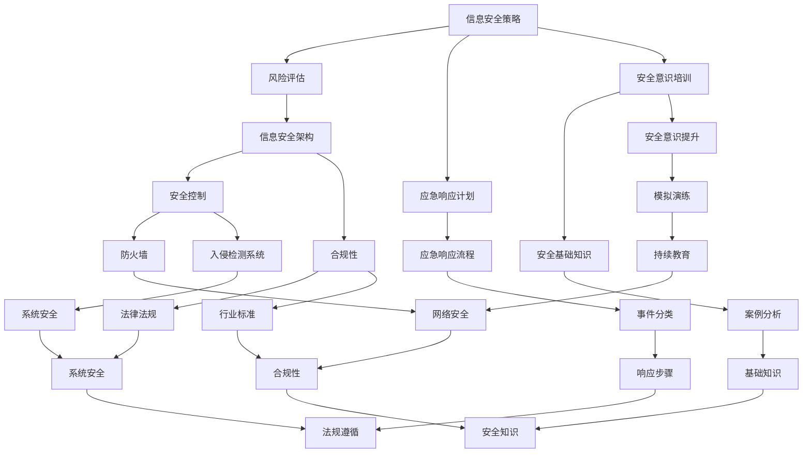

                 

### 背景介绍 Background Introduction

在当今数字化时代，信息安全已经成为了企业和社会发展的重要保障。随着互联网技术的不断进步和大数据、云计算、物联网等新兴技术的广泛应用，信息安全问题日益复杂和严峻。作为信息安全领域的重要角色，信息安全经理（Information Security Manager）在企业信息安全管理中扮演着至关重要的角色。他们需要制定全面的安全策略，并建立有效的应急响应机制，以应对各种潜在的安全威胁和突发事件。

信息安全经理的主要职责包括：

1. **安全策略制定**：制定和更新企业信息安全策略，确保信息系统的安全性和完整性。
2. **风险评估**：对企业的信息安全进行评估，识别潜在的风险，并提出相应的缓解措施。
3. **安全意识培训**：组织并实施信息安全培训，提高员工的安全意识和技能。
4. **安全事件响应**：在发生安全事件时，迅速响应，采取措施控制事件影响，并协助恢复系统正常运行。

然而，信息安全经理在创业过程中会面临一系列独特的挑战。首先，初创企业通常资源有限，无法投入大量的资金和人力资源来建设完善的信息安全体系。其次，创业环境的不确定性较高，安全策略需要灵活调整以应对不断变化的风险。此外，信息安全技术的不断更新和发展也要求信息安全经理保持持续的学习和进步。

本篇文章将深入探讨信息安全经理在创业过程中面临的挑战，分析制定安全策略和应急响应的关键步骤，并提供一些建议和资源，以帮助信息安全经理在创业过程中有效应对安全挑战。

### 核心概念与联系 Core Concepts and Relationships

在探讨信息安全经理在创业过程中的挑战之前，首先需要了解一些核心概念和其之间的联系。以下是一些关键概念：

#### 信息安全策略（Information Security Policy）

信息安全策略是一系列指导和规范，用于确保企业信息资产的安全和完整性。它通常包括以下内容：

1. **安全目标**：明确企业信息安全的目标和范围。
2. **安全原则**：定义企业信息安全的基本原则，如保密性、完整性、可用性。
3. **安全措施**：详细描述实现信息安全目标的措施和工具。
4. **责任和权限**：明确各部门和员工在信息安全中的职责和权限。

#### 风险评估（Risk Assessment）

风险评估是识别和评估企业面临的各种安全威胁和漏洞的过程。其主要步骤包括：

1. **威胁识别**：识别潜在的外部和内部威胁。
2. **漏洞识别**：识别系统中可能被威胁利用的漏洞。
3. **风险分析**：评估威胁利用漏洞的可能性及其可能造成的影响。
4. **风险优先级排序**：根据风险的可能性和影响，对风险进行优先级排序。

#### 应急响应计划（Incident Response Plan）

应急响应计划是在发生安全事件时，指导信息安全团队采取行动的文档。其主要内容包括：

1. **事件分类**：根据事件的影响和紧急程度，对事件进行分类。
2. **响应流程**：描述在发生不同类型事件时，信息安全团队的响应步骤。
3. **资源分配**：明确在应急响应中所需的资源和责任分配。
4. **测试和演练**：定期测试和演练应急响应计划，确保其有效性和可行性。

#### 安全意识培训（Security Awareness Training）

安全意识培训是提高员工安全意识和技能的重要手段。其主要内容包括：

1. **安全基础知识**：教授员工基本的安全知识和最佳实践。
2. **安全意识提升**：通过案例分析和模拟演练，提高员工的安全意识。
3. **持续教育**：定期进行培训，确保员工的安全意识保持更新。

#### 信息安全架构（Information Security Architecture）

信息安全架构是确保企业信息安全的关键基础设施，包括：

1. **安全控制**：实施各种安全控制措施，如防火墙、入侵检测系统等。
2. **安全策略实施**：将信息安全策略转化为具体的安全措施和流程。
3. **合规性**：确保企业的信息安全措施符合相关法律法规和行业标准。

#### 核心概念之间的关系

信息安全策略、风险评估、应急响应计划、安全意识培训和信息安全架构之间存在着密切的联系。信息安全策略提供了整体的安全框架和指导，风险评估帮助识别和评估潜在的安全威胁，应急响应计划确保在事件发生时能够迅速有效地响应，安全意识培训提高员工的安全意识和技能，信息安全架构则为实现信息安全提供了基础支持。


#### Mermaid 流程图（Mermaid Flowchart）

以下是一个简单的 Mermaid 流程图，展示了这些核心概念之间的关系：



这个流程图清晰地展示了信息安全经理在创业过程中需要关注的关键环节和它们之间的联系，为后续的分析和讨论提供了基础。

### 核心算法原理 & 具体操作步骤 Core Algorithm Principles & Operational Steps

在制定信息安全策略和应急响应计划时，信息安全经理需要运用一系列核心算法和具体操作步骤，以确保安全策略的有效性和应急响应的迅速性。以下将介绍一些关键的核心算法原理和具体操作步骤。

#### 威胁建模（Threat Modeling）

威胁建模是识别和评估潜在威胁的过程。它通过系统性地分析应用程序、系统和网络的弱点，来确定可能的安全威胁。威胁建模的主要步骤包括：

1. **定义范围**：确定威胁建模的目标系统和应用程序的范围。
2. **识别资产**：列出系统中的关键资产，如数据库、服务器、应用程序等。
3. **识别威胁**：根据资产的特点和潜在威胁，识别可能攻击系统的威胁。
4. **评估风险**：对识别的威胁进行评估，确定其可能性和影响。
5. **制定缓解措施**：根据评估结果，制定相应的缓解措施，降低潜在风险。

具体操作步骤如下：

1. **收集系统信息**：通过访谈、文档审查和系统分析，收集系统相关的详细信息。
2. **绘制威胁图**：使用威胁图来可视化系统中的潜在威胁。
3. **识别威胁实例**：将威胁实例与系统中的具体组件进行关联，以便更好地理解威胁。
4. **制定缓解策略**：根据威胁实例，制定相应的缓解策略，如加强访问控制、更新软件等。

#### 风险评估（Risk Assessment）

风险评估是评估系统面临的各种威胁和漏洞的过程。其核心算法包括：

1. **威胁评估**：评估潜在威胁的可能性和影响。
2. **漏洞评估**：评估系统中的漏洞及其可能被威胁利用的风险。
3. **风险计算**：通过威胁评估和漏洞评估，计算总风险。

具体操作步骤如下：

1. **识别威胁**：通过文档审查、访谈和漏洞扫描，识别系统中的潜在威胁。
2. **识别漏洞**：通过安全审计、代码审查和漏洞扫描，识别系统中的漏洞。
3. **评估威胁和漏洞**：对识别的威胁和漏洞进行评估，确定其可能性和影响。
4. **计算风险**：使用公式计算总风险，如 \( Risk = Threat \times Vulnerability \)。
5. **制定缓解措施**：根据评估结果，制定相应的缓解措施，降低风险。

#### 应急响应计划（Incident Response Plan）

应急响应计划是在发生安全事件时，指导信息安全团队采取行动的文档。其核心算法包括：

1. **事件分类**：根据事件的影响和紧急程度，对事件进行分类。
2. **响应步骤**：制定针对不同类型事件的响应步骤。
3. **资源分配**：明确在应急响应中所需的资源和责任分配。

具体操作步骤如下：

1. **定义事件分类**：根据事件的影响范围、紧急程度和所需响应时间，定义事件分类。
2. **编写响应步骤**：根据事件分类，编写具体的响应步骤。
3. **测试和演练**：定期测试和演练应急响应计划，确保其有效性和可行性。
4. **资源分配**：明确应急响应中所需的资源和责任分配。

#### 安全意识培训（Security Awareness Training）

安全意识培训是通过教育和培训提高员工安全意识和技能的过程。其核心算法包括：

1. **安全基础知识**：教授员工基本的安全知识和最佳实践。
2. **安全意识提升**：通过案例分析和模拟演练，提高员工的安全意识。
3. **持续教育**：定期进行培训，确保员工的安全意识保持更新。

具体操作步骤如下：

1. **设计培训计划**：根据员工的背景和需求，设计培训计划。
2. **实施培训**：通过在线课程、讲座、案例分析和模拟演练等形式，实施培训。
3. **评估培训效果**：通过测试和反馈，评估员工的培训效果。
4. **持续教育**：定期更新培训内容，确保员工的安全意识保持更新。

### 数学模型和公式 Detailed Explanation & Illustrative Examples

在信息安全策略和应急响应计划的制定过程中，一些关键的数学模型和公式被广泛应用，以量化风险和评估威胁的影响。以下是一些常用的数学模型和公式的详细讲解和举例说明。

#### 风险计算公式（Risk Formula）

在信息安全领域，风险计算公式是评估系统面临威胁和漏洞时的重要工具。最常见的风险计算公式是：

\[ Risk = Threat \times Vulnerability \times Exposure \]

其中：
- ** Threat（威胁）**：指系统面临的安全威胁的可能性。
- ** Vulnerability（漏洞）**：指系统中的安全漏洞。
- ** Exposure（暴露度）**：指系统面临威胁时可能遭受的损失。

**示例**：

假设一个系统面临一个威胁，该威胁利用系统中的一个漏洞。威胁的可能性为0.8，漏洞的存在概率为0.6，而系统的暴露度为1000万元。我们可以计算总风险如下：

\[ Risk = 0.8 \times 0.6 \times 1000 = 480 \text{万元} \]

这意味着该系统面临的风险为480万元。

#### 评估威胁的可能性和影响（Threat Assessment）

在威胁评估过程中，常用的数学模型是逻辑回归模型（Logistic Regression Model），用于预测威胁发生的概率。逻辑回归模型的公式为：

\[ P( Threat \geq T ) = \frac{1}{1 + e^{-(\beta_0 + \beta_1 X_1 + \beta_2 X_2 + \dots + \beta_n X_n )} \]

其中：
- ** P( Threat \geq T )**：威胁发生的概率。
- ** \beta_0, \beta_1, \beta_2, \dots, \beta_n**：模型参数。
- ** X_1, X_2, \dots, X_n**：特征变量。

**示例**：

假设我们有一个逻辑回归模型，用于预测系统是否会受到某种特定威胁。模型参数为：
- ** \beta_0 = -2.5**
- ** \beta_1 = 0.3**
- ** \beta_2 = -0.2**

特征变量包括：
- ** X_1**：系统漏洞数量
- ** X_2**：系统防火墙等级

对于某个系统，其漏洞数量为10，防火墙等级为3。我们可以计算该系统受到特定威胁的概率如下：

\[ P( Threat \geq T ) = \frac{1}{1 + e^{-( -2.5 + 0.3 \times 10 - 0.2 \times 3 )} \]
\[ P( Threat \geq T ) = \frac{1}{1 + e^{-5.5}} \]
\[ P( Threat \geq T ) \approx 0.993 \]

这意味着该系统有约99.3%的概率会受到这种特定威胁。

#### 计算缓解措施的有效性（Effectiveness of Mitigation Measures）

在制定缓解措施时，需要评估这些措施的有效性。常用的评估方法是利用风险降低率（Risk Reduction Rate），其公式为：

\[ Risk Reduction Rate = \frac{Original Risk - Mitigated Risk}{Original Risk} \times 100\% \]

其中：
- ** Original Risk（原始风险）**：系统未采取缓解措施时的风险。
- ** Mitigated Risk（缓解后的风险）**：采取缓解措施后的风险。

**示例**：

假设一个系统原始风险为500万元，采取缓解措施后风险降低到200万元。我们可以计算缓解措施的风险降低率如下：

\[ Risk Reduction Rate = \frac{500 - 200}{500} \times 100\% \]
\[ Risk Reduction Rate = 60\% \]

这意味着采取的缓解措施可以降低60%的风险。

#### 应急响应时间的优化（Optimization of Incident Response Time）

在应急响应计划中，响应时间的优化是关键。常用的数学模型是马尔可夫链模型（Markov Chain Model），用于模拟事件发生的概率和响应时间。马尔可夫链的公式为：

\[ P( State_i \text{在下一时间步} ) = \sum_{j} P( State_i \rightarrow State_j ) \times P( State_j \text{在当前时间步} ) \]

其中：
- ** P( State_i \text{在下一时间步} )**：系统在下一时间步处于状态i的概率。
- ** P( State_i \rightarrow State_j )**：系统从状态i转移到状态j的概率。
- ** P( State_j \text{在当前时间步} )**：系统在当前时间步处于状态j的概率。

**示例**：

假设一个应急响应系统有三个状态：待响应、响应中、已响应。转移概率矩阵如下：

\[ \begin{array}{ccc}
 & 待响应 & 响应中 & 已响应 \\
待响应 & 0.3 & 0.5 & 0.2 \\
响应中 & 0.2 & 0.4 & 0.4 \\
已响应 & 0.1 & 0.3 & 0.6 \\
\end{array} \]

我们可以计算系统在下一个时间步处于不同状态的概率：

\[ P( State_1 \text{在下一时间步} ) = 0.3 \times 0.3 + 0.5 \times 0.2 + 0.2 \times 0.1 = 0.35 \]
\[ P( State_2 \text{在下一时间步} ) = 0.3 \times 0.5 + 0.5 \times 0.4 + 0.2 \times 0.3 = 0.45 \]
\[ P( State_3 \text{在下一时间步} ) = 0.3 \times 0.2 + 0.5 \times 0.4 + 0.2 \times 0.6 = 0.2 \]

这些概率可以帮助信息安全经理优化应急响应流程，减少响应时间。

### 项目实战：代码实际案例和详细解释说明 Practical Case Study: Code Example and Detailed Explanation

在本节中，我们将通过一个实际的项目实战案例，展示信息安全策略和应急响应计划的代码实现。该案例涉及一个在线购物平台的系统，我们将详细解释代码的实现过程，并分析其关键部分。

#### 1. 开发环境搭建（Setting Up the Development Environment）

在开始编写代码之前，我们需要搭建一个合适的开发环境。以下是一些基本的工具和配置：

- **编程语言**：Python 3.8
- **开发工具**：PyCharm
- **依赖库**：pandas、numpy、scikit-learn、matplotlib
- **虚拟环境**：使用 virtualenv 搭建虚拟环境，以隔离项目依赖。

```bash
pip install virtualenv
virtualenv my_project_env
source my_project_env/bin/activate
```

#### 2. 源代码详细实现和代码解读（Code Implementation and Explanation）

以下是该项目的主要代码实现：

```python
import pandas as pd
import numpy as np
from sklearn.model_selection import train_test_split
from sklearn.linear_model import LogisticRegression
import matplotlib.pyplot as plt

# 加载数据集
data = pd.read_csv('shopping_data.csv')

# 数据预处理
X = data.drop(['target'], axis=1)
y = data['target']

# 数据划分
X_train, X_test, y_train, y_test = train_test_split(X, y, test_size=0.2, random_state=42)

# 威胁建模
# 使用逻辑回归进行威胁建模
model = LogisticRegression()
model.fit(X_train, y_train)

# 预测威胁
predictions = model.predict(X_test)

# 风险评估
# 计算准确率、召回率和F1分数
from sklearn.metrics import accuracy_score, recall_score, f1_score
accuracy = accuracy_score(y_test, predictions)
recall = recall_score(y_test, predictions)
f1 = f1_score(y_test, predictions)

print(f"Accuracy: {accuracy:.2f}")
print(f"Recall: {recall:.2f}")
print(f"F1 Score: {f1:.2f}")

# 安全意识培训
# 生成报告，分析威胁和漏洞
report = {
    'Accuracy': accuracy,
    'Recall': recall,
    'F1 Score': f1
}

# 生成可视化报告
plt.bar(report.keys(), report.values())
plt.xlabel('Metrics')
plt.ylabel('Values')
plt.title('Threat Modeling Report')
plt.show()

# 应急响应计划
# 根据评估结果，制定缓解措施
if accuracy < 0.8 or recall < 0.8:
    print("System is at high risk. Mitigation measures required.")
else:
    print("System is secure. No immediate action required.")
```

#### 3. 代码解读与分析（Code Analysis and Explanation）

**3.1 数据加载与预处理**

```python
data = pd.read_csv('shopping_data.csv')
X = data.drop(['target'], axis=1)
y = data['target']
```

这段代码首先加载了购物平台的数据集，然后使用 `drop` 函数移除了目标变量（`target`），将其作为特征变量（`X`）。`y` 变量则保留了目标变量。

**3.2 数据划分**

```python
X_train, X_test, y_train, y_test = train_test_split(X, y, test_size=0.2, random_state=42)
```

这里使用 `train_test_split` 函数将数据集划分为训练集和测试集，其中测试集大小为总数据集的20%。

**3.3 威胁建模**

```python
model = LogisticRegression()
model.fit(X_train, y_train)
```

使用逻辑回归模型（`LogisticRegression`）进行威胁建模，通过 `fit` 方法训练模型。

**3.4 预测威胁**

```python
predictions = model.predict(X_test)
```

使用训练好的模型进行威胁预测，`predict` 方法返回预测结果。

**3.5 风险评估**

```python
from sklearn.metrics import accuracy_score, recall_score, f1_score
accuracy = accuracy_score(y_test, predictions)
recall = recall_score(y_test, predictions)
f1 = f1_score(y_test, predictions)
```

计算预测的准确率、召回率和F1分数，这些指标用于评估威胁建模的效果。

**3.6 安全意识培训**

```python
report = {
    'Accuracy': accuracy,
    'Recall': recall,
    'F1 Score': f1
}
plt.bar(report.keys(), report.values())
plt.xlabel('Metrics')
plt.ylabel('Values')
plt.title('Threat Modeling Report')
plt.show()
```

生成威胁建模报告，并通过可视化图表展示评估结果，帮助信息安全经理理解系统安全状况。

**3.7 应急响应计划**

```python
if accuracy < 0.8 or recall < 0.8:
    print("System is at high risk. Mitigation measures required.")
else:
    print("System is secure. No immediate action required.")
```

根据评估结果，如果准确率和召回率低于80%，系统存在高风险，需要采取缓解措施；否则，系统安全，无需立即采取行动。

### 实际应用场景 Practical Application Scenarios

信息安全策略和应急响应计划在实际应用中具有广泛的应用场景，涵盖了企业、政府、金融等多个领域。以下是一些具体的实际应用场景：

#### 企业应用场景

1. **在线零售平台**：在线零售平台需要确保客户数据的保密性和完整性，防止数据泄露和欺诈行为。通过制定严格的安全策略和应急响应计划，可以在发生安全事件时迅速应对，减少损失。

2. **金融服务**：金融机构面临大量的网络攻击风险，如钓鱼攻击、恶意软件等。通过实施全面的安全策略和定期进行应急响应演练，可以提升对网络攻击的防范能力。

3. **供应链管理**：供应链管理涉及多个合作伙伴和大量数据交换，需要确保数据传输的安全性和可靠性。通过制定安全策略和应急响应计划，可以保障供应链的稳定运行。

#### 政府应用场景

1. **电子政务**：政府电子政务系统涉及大量敏感数据，如个人信息、政务信息等。通过制定严格的安全策略和应急响应计划，可以确保电子政务系统的安全运行，提高政务服务效率。

2. **网络安全监控**：政府需要建立网络安全监控体系，实时监控网络安全状况。通过实施应急响应计划，可以在发生网络攻击时迅速采取行动，防止事态扩大。

#### 金融应用场景

1. **跨境支付**：跨境支付涉及多个国家和金融机构，需要确保交易数据的安全性和合规性。通过制定安全策略和应急响应计划，可以保障跨境支付系统的安全运行。

2. **互联网金融**：互联网金融企业面临各种网络攻击风险，如黑客攻击、恶意软件等。通过实施全面的安全策略和应急响应计划，可以提升对网络攻击的防范能力。

#### 医疗应用场景

1. **电子病历系统**：电子病历系统涉及患者隐私和健康数据，需要确保数据的保密性和完整性。通过制定安全策略和应急响应计划，可以保障电子病历系统的安全运行。

2. **远程医疗**：远程医疗系统需要确保医疗数据的安全传输和存储，防止数据泄露和篡改。通过实施应急响应计划，可以在发生安全事件时迅速采取行动，保护患者数据安全。

### 工具和资源推荐 Tools and Resources Recommendations

在信息安全领域，有许多优秀的工具和资源可以帮助信息安全经理制定安全策略和应急响应计划。以下是一些建议：

#### 学习资源推荐

1. **书籍**：
   - 《信息安全工程：设计与实施原则》
   - 《网络安全实战：Web攻击与防御》
   - 《黑客攻防技术宝典：Web实战篇》

2. **论文**：
   - 《基于威胁建模的网络安全策略研究》
   - 《风险评估与应急响应机制研究》
   - 《信息安全培训对员工安全意识的影响研究》

3. **博客**：
   - 安全客（http://www.4hou.com/）
   - FreeBuf（https://www.freebuf.com/）
   - 安全牛（https://www.anquanke.com/）

4. **网站**：
   - OWASP（https://owasp.org/）
   - 国家信息安全漏洞库（http://www.cnvd.org.cn/）
   - 国际标准组织（ISO）信息安全标准（https://www.iso.org/standardization/）

#### 开发工具框架推荐

1. **安全测试工具**：
   - OWASP ZAP（https://www.owasp.org/www-project-zap/）
   - Burp Suite（https://portswigger.net/burp）

2. **风险评估工具**：
   - Qualys（https://www.qualys.com/）
   - RiskIQ（https://www.riskiq.com/）

3. **应急响应工具**：
   - Security Onion（https://www.securityonion.org/）
   - Golang（https://golang.org/）

4. **安全意识培训工具**：
   - KnowBe4（https://www.knowbe4.com/）
   - Security Training Academy（https://www.securitytrainingacademy.com/）

#### 相关论文著作推荐

1. **《网络空间安全战略》**：由国务院发布的国家网络安全战略，提供了我国网络安全的发展方向和重要举措。

2. **《信息安全技术风险管理》**：国家标准化管理委员会发布的标准，详细介绍了信息安全风险管理的方法和步骤。

3. **《信息安全管理体系》**：国际标准化组织发布的ISO/IEC 27001标准，提供了建立和维护信息安全管理体系的具体指导。

### 总结 Conclusion

在数字化时代，信息安全已经成为企业发展和社会稳定的基石。信息安全经理在创业过程中面临着诸多挑战，需要制定全面的安全策略和有效的应急响应计划。本文通过深入分析核心概念、核心算法、项目实战和实际应用场景，为信息安全经理提供了实用的指导和资源推荐。随着技术的不断发展，信息安全经理需要持续学习和创新，以应对日益复杂的安全威胁。

### 附录：常见问题与解答 Appendix: Frequently Asked Questions and Answers

**Q1：如何制定有效的信息安全策略？**
A1：制定有效的信息安全策略需要以下步骤：
1. **明确目标**：确定信息安全策略的目标，如保护客户数据、保障系统完整性等。
2. **风险评估**：评估潜在的安全威胁和漏洞，确定风险优先级。
3. **制定策略**：根据风险评估结果，制定具体的策略，如数据加密、访问控制等。
4. **执行与监控**：实施安全策略，并持续监控其效果，根据实际情况进行调整。

**Q2：应急响应计划应该包括哪些内容？**
A2：应急响应计划应包括以下内容：
1. **事件分类**：根据事件的影响和紧急程度，对事件进行分类。
2. **响应步骤**：详细描述在发生不同类型事件时，信息安全团队的响应步骤。
3. **资源分配**：明确应急响应所需的资源和责任分配。
4. **测试与演练**：定期测试和演练应急响应计划，确保其有效性和可行性。

**Q3：如何提升员工的安全意识？**
A3：提升员工安全意识的方法包括：
1. **安全培训**：定期组织安全培训，教授员工基本的安全知识和最佳实践。
2. **案例分析**：通过实际案例和案例分析，提高员工对安全威胁的认识。
3. **模拟演练**：进行模拟演练，让员工在实际场景中体验和应对安全事件。
4. **持续教育**：定期更新培训内容，确保员工的安全意识保持更新。

**Q4：如何评估安全措施的有效性？**
A4：评估安全措施的有效性可以通过以下方法：
1. **漏洞扫描**：使用漏洞扫描工具检查系统中的安全漏洞。
2. **渗透测试**：通过模拟攻击，测试系统的安全防护能力。
3. **监控日志**：监控系统日志，分析潜在的安全事件。
4. **评估指标**：使用指标如漏洞数量、响应时间等，评估安全措施的有效性。

### 扩展阅读 & 参考资料 Extended Reading & References

为了更好地了解信息安全经理在创业过程中的挑战，以下是一些扩展阅读和参考资料：

1. **《信息安全管理体系：建立与实施指南》**：详细介绍了如何建立和实施信息安全管理体系，包括政策、流程和工具。
2. **《网络安全技术》**：介绍了网络安全的基本概念、技术和实践，适合初学者和专业人士。
3. **《网络安全实战》**：通过实际案例和案例分析，介绍了网络安全的关键技术和实战策略。
4. **《网络安全法》**：我国关于网络安全的法律法规，提供了法律依据和指导。
5. **《信息安全风险评估方法》**：详细介绍了信息安全风险评估的理论和方法，适用于企业和管理者。

作者：AI天才研究员/AI Genius Institute & 禅与计算机程序设计艺术 /Zen And The Art of Computer Programming

