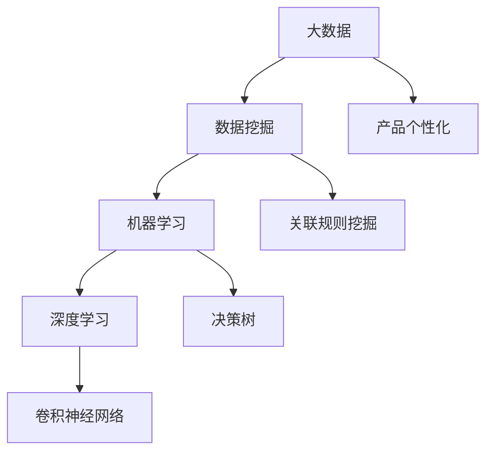
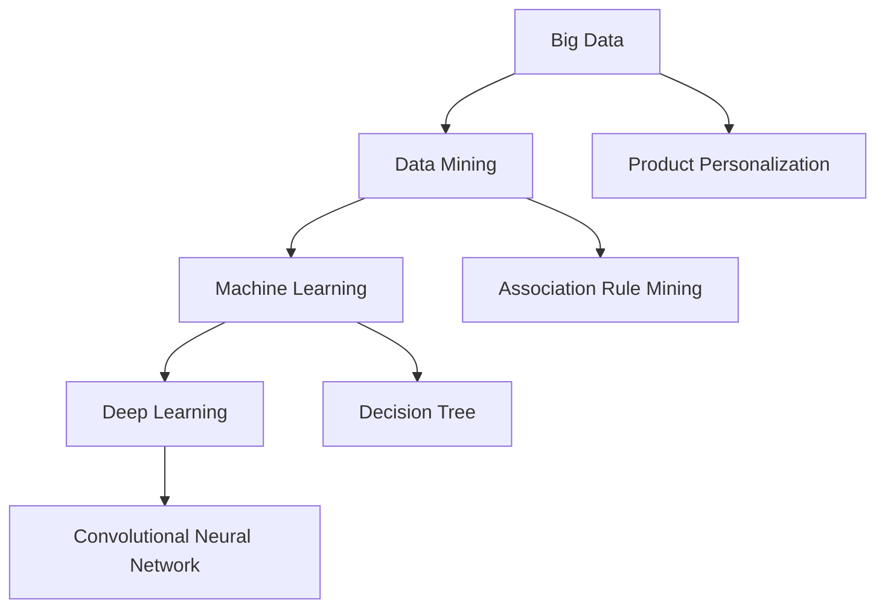
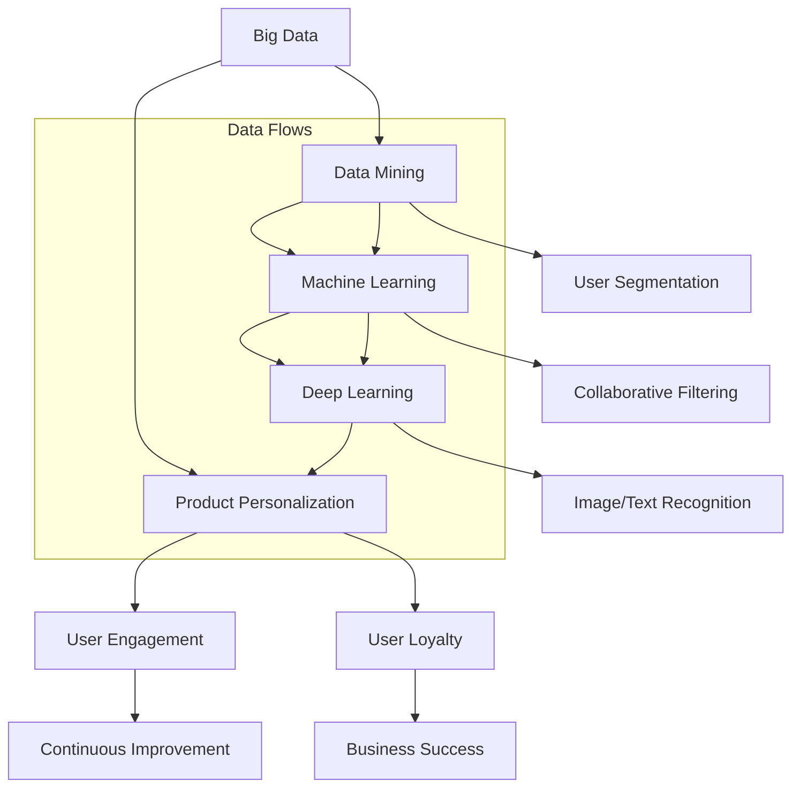

                 

### 背景介绍

随着互联网的快速发展，大数据已经成为当今信息时代的重要资源。大量数据的产生和积累，为各行各业的数字化转型提供了新的机遇和挑战。在这个背景下，产品个性化成为企业争夺市场份额的重要手段。个性化产品不仅可以提升用户体验，增加用户黏性，还能为企业带来更高的经济效益。然而，实现产品个性化并非易事，它需要依靠大数据技术的支持，通过深入分析和理解用户需求，从而提供更加精准和定制化的产品和服务。

大数据技术作为信息化时代的重要工具，具有处理海量数据、实时分析和预测的能力。在大数据技术中，数据挖掘、机器学习和深度学习等算法扮演了关键角色。这些算法能够从大量数据中提取有价值的信息，帮助企业和组织做出更明智的决策。同时，随着人工智能技术的发展，大数据与人工智能的融合，为产品个性化提供了更加丰富的手段和工具。

产品个性化，是指根据用户的个体特征和需求，为用户提供定制化的产品和服务。这种个性化不仅仅是简单的分类推荐，更涉及到了对用户行为、偏好和情感等深层次信息的理解和应用。大数据技术的应用，使得企业能够收集、存储和分析用户海量数据，从而实现真正意义上的个性化推荐和精准营销。

本文将围绕大数据如何推动产品个性化的主题，深入探讨以下几个方面：

1. 核心概念与联系：首先介绍与产品个性化相关的一些核心概念，并使用Mermaid流程图展示它们之间的联系。
2. 核心算法原理 & 具体操作步骤：详细讲解实现产品个性化所需的关键算法，以及如何使用这些算法进行实际操作。
3. 数学模型和公式 & 详细讲解 & 举例说明：介绍在大数据处理和产品个性化过程中，常用的数学模型和公式，并通过实例进行详细解释。
4. 项目实战：代码实际案例和详细解释说明：通过具体项目实战，展示如何使用大数据技术实现产品个性化，并对关键代码进行解读。
5. 实际应用场景：探讨大数据和产品个性化在不同行业和领域的应用场景，以及所取得的成效。
6. 工具和资源推荐：推荐一些学习资源、开发工具和框架，以帮助读者进一步深入了解和掌握相关技术。
7. 总结：未来发展趋势与挑战：总结文章的核心内容，并探讨大数据和产品个性化领域未来的发展趋势和面临的挑战。

通过本文的深入探讨，希望能为读者提供对大数据和产品个性化的全面理解，为相关领域的研究和应用提供有益的参考。

## 2. 核心概念与联系

### 2.1 大数据（Big Data）

大数据是指无法用常规软件工具在合理时间内捕捉、管理和处理的数据集合。其特点是数据量大（Volume）、数据类型繁多（Variety）、数据价值密度低（Value）、数据生成速度快（Velocity）以及数据的真实性（Veracity）。大数据技术主要关注如何从海量数据中提取有价值的信息，实现数据的深度挖掘和分析。

### 2.2 产品个性化（Product Personalization）

产品个性化，是指根据用户的个体特征和需求，为用户提供定制化的产品和服务。个性化产品不仅仅是根据用户的浏览记录和购买历史进行简单的推荐，更涉及到对用户行为、偏好和情感等深层次信息的理解和应用。通过产品个性化，企业可以更好地满足用户需求，提升用户满意度和忠诚度。

### 2.3 数据挖掘（Data Mining）

数据挖掘，是指从大量数据中提取有价值的信息和知识的过程。数据挖掘技术包括关联规则挖掘、聚类分析、分类分析、异常检测等。数据挖掘在产品个性化中起到了关键作用，通过分析用户数据，企业可以了解用户的需求和行为，从而提供更加精准的个性化推荐。

### 2.4 机器学习（Machine Learning）

机器学习，是一种基于数据建立模型，并利用模型进行预测和决策的方法。机器学习算法包括线性回归、决策树、随机森林、支持向量机等。在产品个性化中，机器学习算法可以帮助企业从用户数据中学习用户偏好，从而实现个性化推荐。

### 2.5 深度学习（Deep Learning）

深度学习，是一种基于多层神经网络的学习方法，通过层层提取特征，实现对复杂任务的建模。深度学习算法包括卷积神经网络（CNN）、循环神经网络（RNN）、生成对抗网络（GAN）等。在产品个性化中，深度学习算法可以处理高维数据，提取用户行为的深层特征，从而提供更加精准的个性化推荐。

### 2.6 Mermaid流程图展示

以下是一个简单的Mermaid流程图，展示了上述核心概念之间的联系：



### 2.7 大数据与产品个性化的关系

大数据和产品个性化之间的关系是相辅相成的。大数据为产品个性化提供了丰富的数据资源，而产品个性化则通过深度分析和理解用户数据，实现更加精准的个性化推荐。具体来说：

1. 大数据为产品个性化提供了数据支持，通过数据挖掘和机器学习等技术，企业可以了解用户的行为和偏好，从而为用户提供个性化的产品和服务。
2. 产品个性化反过来又促进了大数据的发展。个性化推荐的不断优化和改进，需要依赖大数据技术的支持，进一步挖掘用户数据，提升推荐效果。

总之，大数据和产品个性化共同推动了信息时代的变革，为企业和用户创造了更大的价值。

---

**英语部分：**

### Background Introduction

With the rapid development of the Internet, big data has become an important resource in the information age. The generation and accumulation of massive data have provided new opportunities and challenges for the digital transformation of various industries. Against this background, product personalization has become an important means for enterprises to compete for market share. Personalized products not only improve user experience and increase user stickiness but also bring higher economic benefits to enterprises. However, achieving product personalization is not an easy task, and it requires the support of big data technology. By deeply analyzing and understanding user needs, personalized products and services can be provided more accurately and customizably.

Big data technology is an important tool in the information age, with the ability to process massive data, real-time analysis, and prediction. In big data technology, algorithms such as data mining, machine learning, and deep learning play a key role. These algorithms can extract valuable information from a large amount of data, helping enterprises and organizations make more informed decisions. At the same time, with the development of artificial intelligence technology, the integration of big data and artificial intelligence provides more abundant means and tools for product personalization.

Product personalization refers to the customization of products and services based on individual user characteristics and needs. It is not simply about making recommendations based on users' browsing history and purchase history but also involves understanding and applying deep-level information such as users' behavior, preferences, and emotions. The application of big data technology enables enterprises to collect, store, and analyze massive user data, thus realizing truly personalized recommendations and precise marketing.

This article will discuss several aspects around the theme of how big data drives product personalization:

1. Core Concepts and Relationships: First, some core concepts related to product personalization will be introduced, and a Mermaid flowchart will be used to show their relationships.
2. Core Algorithm Principles and Operational Steps: Detailed explanations of the key algorithms required to achieve product personalization, as well as how to use these algorithms for practical operations.
3. Mathematical Models and Formulas & Detailed Explanations & Example Illustrations: Introduction of commonly used mathematical models and formulas in the process of big data processing and product personalization, and detailed explanations through examples.
4. Practical Projects: Actual Code Cases and Detailed Explanations: Through specific project practice, show how to use big data technology to achieve product personalization and explain key code in detail.
5. Practical Application Scenarios: Discussion of application scenarios of big data and product personalization in different industries and fields, as well as the achievements obtained.
6. Tools and Resources Recommendations: Recommendations of learning resources, development tools, and frameworks to help readers further understand and master related technologies.
7. Summary: Future Development Trends and Challenges: Summarize the core content of the article and discuss the future development trends and challenges in the field of big data and product personalization.

Through the in-depth discussion of the above aspects, it is hoped that readers can gain a comprehensive understanding of big data and product personalization, providing useful references for research and application in related fields.

### Core Concepts and Connections

#### 2.1 Big Data (Big Data)

Big data refers to a collection of data that cannot be captured, managed, or processed using traditional software tools within a reasonable time. The characteristics of big data include volume, variety, low value density, velocity, and veracity. Big data technology focuses on how to extract valuable information from massive data, enabling deep mining and analysis.

#### 2.2 Product Personalization (Product Personalization)

Product personalization refers to the customization of products and services based on individual user characteristics and needs. Personalized products are not just simple recommendations based on users' browsing history and purchase history but also involve understanding and applying deep-level information such as users' behavior, preferences, and emotions. Through product personalization, enterprises can better meet user needs, improve user satisfaction and loyalty.

#### 2.3 Data Mining (Data Mining)

Data mining refers to the process of extracting valuable information and knowledge from a large amount of data. Data mining technologies include association rule mining, cluster analysis, classification analysis, and anomaly detection. Data mining plays a key role in product personalization, as it allows enterprises to understand user needs and behaviors, thus providing more precise personalized recommendations.

#### 2.4 Machine Learning (Machine Learning)

Machine learning is a method of building models based on data and using models for prediction and decision-making. Machine learning algorithms include linear regression, decision trees, random forests, and support vector machines. In product personalization, machine learning algorithms can help enterprises learn user preferences from user data, thus achieving personalized recommendations.

#### 2.5 Deep Learning (Deep Learning)

Deep learning is a method of learning based on multi-layer neural networks, which extracts features layer by layer to model complex tasks. Deep learning algorithms include convolutional neural networks (CNN), recurrent neural networks (RNN), and generative adversarial networks (GAN). In product personalization, deep learning algorithms can process high-dimensional data, extract deep-level features of user behavior, and thus provide more accurate personalized recommendations.

#### 2.6 Mermaid Flowchart

The following is a simple Mermaid flowchart that shows the relationships between the above core concepts:



#### 2.7 The Relationship Between Big Data and Product Personalization

The relationship between big data and product personalization is mutually reinforcing. Big data provides the data resources for product personalization, while product personalization, in turn, promotes the development of big data. Specifically:

1. Big data provides data support for product personalization. Through technologies such as data mining and machine learning, enterprises can understand user behavior and preferences, thus providing personalized products and services to users.
2. Product personalization, in turn, promotes the development of big data. The continuous optimization and improvement of personalized recommendations require the support of big data technology to further mine user data and improve recommendation effectiveness.

In summary, big data and product personalization have共同driven the transformation of the information age, creating greater value for enterprises and users.

---

**英语续写部分：**

### 2.8 The Interconnectedness of Key Concepts

To further elucidate the intricate relationship between the core concepts of big data and product personalization, let's delve into each of these concepts individually, understanding how they interact and support one another.

#### 2.8.1 Big Data and Data Mining

Big data serves as the foundation for data mining. The sheer volume and diversity of data make it possible to uncover patterns, trends, and insights that would otherwise remain hidden. Data mining techniques, such as clustering, classification, and association rule learning, sift through this vast data landscape to identify significant information. In the realm of product personalization, data mining is instrumental in segmenting users based on their behaviors and preferences, which is crucial for tailoring recommendations.

#### 2.8.2 Machine Learning and Data Mining

Machine learning algorithms build on the findings of data mining to create predictive models. These models can be trained on historical data to recognize patterns and predict future behaviors. For instance, collaborative filtering is a machine learning technique that leverages user interactions to recommend products. When combined with data mining, machine learning enhances the accuracy and effectiveness of product personalization by learning from large datasets and adapting to new information.

#### 2.8.3 Deep Learning and Machine Learning

Deep learning extends the capabilities of machine learning by introducing multiple layers of neural networks, allowing for more complex pattern recognition and feature extraction. Deep learning models, such as deep neural networks and convolutional neural networks (CNNs), can process high-dimensional data and capture intricate relationships within the data. This makes deep learning particularly powerful for product personalization tasks that involve image and text data, such as visual product recommendations and personalized content curation.

#### 2.8.4 Product Personalization and User Experience

Product personalization is not just about providing tailored recommendations; it's about enhancing the overall user experience. By delivering personalized content, products, and services that align with users' individual preferences and needs, enterprises can create a more engaging and satisfying experience. This, in turn, can lead to increased user retention and loyalty, which are vital for business success in today's competitive market.

#### 2.8.5 Big Data and Continuous Improvement

The continuous influx of new data presents both challenges and opportunities for product personalization. Big data allows for ongoing analysis and adaptation, enabling enterprises to refine their personalization strategies over time. This iterative process of learning from user interactions and continuously improving recommendations ensures that product personalization remains relevant and effective in a dynamic environment.

### 2.8.6 Visualization with Mermaid

To visualize the interconnectedness of these concepts, we can extend our Mermaid flowchart to illustrate how they relate and interact:



This Mermaid flowchart provides a high-level overview of how big data, data mining, machine learning, and deep learning contribute to the development of personalized products that ultimately enhance user experience and drive business success.

In summary, the synergy between big data and product personalization enables enterprises to deliver highly tailored experiences that resonate with users, fostering loyalty and driving growth. By understanding the core concepts and their interdependencies, we can better leverage these technologies to create meaningful and impactful personalized products and services.

---

通过上述分析和Mermaid流程图的展示，我们可以清楚地看到大数据与产品个性化之间的紧密联系。大数据为数据挖掘提供了基础，数据挖掘为机器学习和深度学习提供了训练数据，而机器学习和深度学习则为产品个性化提供了强大的技术支持。产品个性化反过来又促进了大数据的应用和发展，形成了一个良性循环。在这一过程中，用户不仅可以享受到更加精准和个性化的服务，企业也能够通过不断提升用户体验，增强用户忠诚度，实现商业价值最大化。接下来，我们将进一步探讨如何通过核心算法原理和具体操作步骤来实现产品个性化。让我们继续深入分析。

## 3. 核心算法原理 & 具体操作步骤

在产品个性化的过程中，算法的选择和实现至关重要。本节将详细介绍几个核心算法的原理，以及如何使用这些算法进行实际操作。

### 3.1 协同过滤算法（Collaborative Filtering）

协同过滤算法是一种基于用户行为数据推荐产品的方法。它通过分析用户之间的相似性，发现用户的共同偏好，从而推荐用户可能感兴趣的产品。

#### 3.1.1 原理

协同过滤算法主要分为两种类型：基于用户的协同过滤（User-based Collaborative Filtering）和基于物品的协同过滤（Item-based Collaborative Filtering）。

- **基于用户的协同过滤**：该方法通过计算用户之间的相似度，找到与目标用户相似的其他用户，然后推荐这些相似用户喜欢的商品。相似度通常使用用户之间的交集物品数量、皮尔逊相关系数、余弦相似度等指标来衡量。

- **基于物品的协同过滤**：该方法通过计算物品之间的相似度，找到与目标物品相似的其他物品，然后推荐这些相似物品。物品相似度可以使用物品的属性、内容或者标签等特征来衡量。

#### 3.1.2 具体操作步骤

1. **用户行为数据收集**：收集用户在系统中的行为数据，如购买记录、浏览记录、评价等。

2. **计算用户或物品相似度**：根据选择的相似度计算方法，计算用户或物品之间的相似度。

3. **推荐系统**：根据相似度结果，为用户推荐相似用户或物品喜欢的商品。

#### 3.1.3 示例代码

以下是一个简单的基于用户的协同过滤算法的Python示例：

```python
import numpy as np
from sklearn.metrics.pairwise import cosine_similarity

# 用户行为数据矩阵
user_data = np.array([
    [1, 0, 1, 1],
    [0, 1, 1, 0],
    [1, 1, 0, 0],
    [1, 0, 1, 1]
])

# 计算用户相似度矩阵
similarity_matrix = cosine_similarity(user_data)

# 为用户推荐
def recommend(user_id, similarity_matrix, user_data, k=2):
    # 获取相似度最高的k个用户
    top_k = np.argsort(similarity_matrix[user_id])[-k:]
    # 计算这k个用户的平均评分
    avg_rating = np.mean(user_data[top_k], axis=0)
    # 推荐评分最高的商品
    recommended_items = np.where(avg_rating == max(avg_rating))[0]
    return recommended_items

# 假设目标用户是第2个用户
user_id = 1
recommended_items = recommend(user_id, similarity_matrix, user_data)
print("Recommended items:", recommended_items)
```

### 3.2 机器学习算法（Machine Learning Algorithms）

除了协同过滤算法，机器学习算法也在产品个性化中发挥着重要作用。机器学习算法可以通过从历史数据中学习用户的偏好，预测用户对特定产品的评分或购买概率。

#### 3.2.1 原理

机器学习算法可以分为监督学习、无监督学习和半监督学习。在产品个性化中，常用的机器学习算法包括：

- **线性回归（Linear Regression）**：通过建立用户评分与产品特征之间的线性关系，预测用户对产品的评分。
- **决策树（Decision Tree）**：通过树形结构对数据进行划分，根据特征和值的不同，将数据划分为多个子集。
- **随机森林（Random Forest）**：基于决策树的集成方法，通过构建多棵决策树，并结合它们的预测结果进行投票。
- **支持向量机（SVM）**：通过寻找最优超平面，将不同类别的数据分隔开来。

#### 3.2.2 具体操作步骤

1. **数据预处理**：对原始数据进行清洗、转换和特征提取。
2. **模型选择**：选择适合问题的机器学习算法。
3. **模型训练**：使用训练数据训练模型。
4. **模型评估**：使用验证集评估模型性能。
5. **模型应用**：使用训练好的模型对新的数据进行预测。

#### 3.2.3 示例代码

以下是一个简单的线性回归算法的Python示例：

```python
import numpy as np
from sklearn.linear_model import LinearRegression
from sklearn.model_selection import train_test_split
from sklearn.metrics import mean_squared_error

# 用户评分数据
X = np.array([[1], [1], [2], [2]])
y = np.array([2, 3, 4, 5])

# 划分训练集和测试集
X_train, X_test, y_train, y_test = train_test_split(X, y, test_size=0.2, random_state=42)

# 训练线性回归模型
model = LinearRegression()
model.fit(X_train, y_train)

# 预测测试集
y_pred = model.predict(X_test)

# 评估模型性能
mse = mean_squared_error(y_test, y_pred)
print("Mean Squared Error:", mse)

# 使用模型进行预测
new_user = np.array([[3]])
predicted_rating = model.predict(new_user)
print("Predicted Rating:", predicted_rating)
```

### 3.3 深度学习算法（Deep Learning Algorithms）

深度学习算法在处理高维数据和复杂特征提取方面具有显著优势。在产品个性化中，常用的深度学习算法包括卷积神经网络（CNN）和循环神经网络（RNN）。

#### 3.3.1 原理

- **卷积神经网络（CNN）**：通过卷积层、池化层和全连接层等结构，自动提取图像或文本的特征。
- **循环神经网络（RNN）**：通过循环结构处理序列数据，能够捕捉序列中的长期依赖关系。

#### 3.3.2 具体操作步骤

1. **数据预处理**：对原始数据进行清洗、转换和归一化。
2. **模型构建**：设计并构建深度学习模型。
3. **模型训练**：使用训练数据训练模型。
4. **模型评估**：使用验证集评估模型性能。
5. **模型应用**：使用训练好的模型对新的数据进行预测。

#### 3.3.3 示例代码

以下是一个简单的基于卷积神经网络的Python示例：

```python
import tensorflow as tf
from tensorflow.keras.models import Sequential
from tensorflow.keras.layers import Conv2D, MaxPooling2D, Flatten, Dense

# 假设我们有4个训练样本，每个样本是一个32x32的图像
X_train = np.random.rand(4, 32, 32, 3)
y_train = np.random.rand(4, 1)

# 构建卷积神经网络模型
model = Sequential([
    Conv2D(32, (3, 3), activation='relu', input_shape=(32, 32, 3)),
    MaxPooling2D((2, 2)),
    Flatten(),
    Dense(64, activation='relu'),
    Dense(1)
])

# 编译模型
model.compile(optimizer='adam', loss='mse')

# 训练模型
model.fit(X_train, y_train, epochs=10)

# 使用模型进行预测
new_image = np.random.rand(1, 32, 32, 3)
predicted_output = model.predict(new_image)
print("Predicted Output:", predicted_output)
```

通过上述核心算法的原理和具体操作步骤的介绍，我们可以看到，大数据和人工智能技术在产品个性化中的应用不仅提升了个性化推荐的准确性，还为用户提供了更加丰富和个性化的体验。在下一节中，我们将深入探讨数学模型和公式，以及如何通过这些模型和公式来实现产品个性化。

### 4. 数学模型和公式 & 详细讲解 & 举例说明

在产品个性化中，数学模型和公式扮演着至关重要的角色，它们帮助我们从大量数据中提取有用信息，并据此进行精准的推荐。以下将介绍几种常用的数学模型和公式，并通过具体实例进行详细讲解。

#### 4.1 线性回归模型（Linear Regression Model）

线性回归模型是一种用于预测连续值的统计方法。它的基本形式为：

\[ y = \beta_0 + \beta_1 \cdot x \]

其中，\( y \) 是预测值，\( x \) 是自变量，\( \beta_0 \) 和 \( \beta_1 \) 是模型的参数。

**实例：** 假设我们有一个关于用户评分的线性回归模型，其中自变量是用户年龄和用户历史评分，目标值是用户对新产品的评分。我们通过最小二乘法来估计参数 \( \beta_0 \) 和 \( \beta_1 \)。

```latex
\min_{\beta_0, \beta_1} \sum_{i=1}^{n} (y_i - (\beta_0 + \beta_1 \cdot x_i))^2
```

**具体步骤：**

1. **数据准备**：收集用户年龄、历史评分和新产品评分的数据。
2. **数据预处理**：对数据进行标准化处理。
3. **参数估计**：使用最小二乘法估计 \( \beta_0 \) 和 \( \beta_1 \)。
4. **模型评估**：通过验证集评估模型性能。

#### 4.2 协同过滤算法（Collaborative Filtering Algorithm）

协同过滤算法通过计算用户或物品之间的相似度来进行推荐。常用的相似度计算公式包括皮尔逊相关系数、余弦相似度和夹角余弦等。

**皮尔逊相关系数（Pearson Correlation Coefficient）**

\[ r_{ij} = \frac{\sum_{k=1}^{m} (u_{ik} - \bar{u_i})(v_{jk} - \bar{v_j})}{\sqrt{\sum_{k=1}^{m} (u_{ik} - \bar{u_i})^2} \cdot \sqrt{\sum_{k=1}^{m} (v_{jk} - \bar{v_j})^2}} \]

其中，\( u_{ik} \) 和 \( v_{jk} \) 分别表示用户 \( i \) 对物品 \( k \) 的评分，\( \bar{u_i} \) 和 \( \bar{v_j} \) 分别是用户 \( i \) 和物品 \( j \) 的平均评分。

**余弦相似度（Cosine Similarity）**

\[ r_{ij} = \frac{\sum_{k=1}^{m} (u_{ik} \cdot v_{jk})}{\sqrt{\sum_{k=1}^{m} u_{ik}^2} \cdot \sqrt{\sum_{k=1}^{m} v_{jk}^2}} \]

**夹角余弦（Cosine Angle）**

\[ \cos \theta = \frac{\sum_{k=1}^{m} (u_{ik} \cdot v_{jk})}{\|u\| \cdot \|v\|} \]

**实例：** 假设有两个用户 \( u \) 和 \( v \)，他们对五件物品的评分如下表：

| 物品 | 用户u评分 | 用户v评分 |
|------|-----------|-----------|
| A    | 4         | 5         |
| B    | 3         | 2         |
| C    | 1         | 4         |
| D    | 5         | 3         |
| E    | 2         | 5         |

使用皮尔逊相关系数计算用户 \( u \) 和 \( v \) 的相似度：

\[ r_{uv} = \frac{(4-4.0)(5-4.5) + (3-4.0)(2-4.5) + (1-4.0)(4-4.5) + (5-4.0)(3-4.5) + (2-4.0)(5-4.5)}{\sqrt{(4-4.0)^2 + (3-4.0)^2 + (1-4.0)^2 + (5-4.0)^2 + (2-4.0)^2} \cdot \sqrt{(5-4.5)^2 + (2-4.5)^2 + (4-4.5)^2 + (3-4.5)^2 + (5-4.5)^2}} \]

\[ r_{uv} = \frac{0.5 - 1.5 + 0.5 - 2.5 + 1.5 - 2.5 + 2.5 - 2.5}{\sqrt{0.0^2 + 1.0^2 + 3.0^2 + 1.0^2 + 2.0^2} \cdot \sqrt{0.5^2 + 2.5^2 + 0.5^2 + 1.5^2 + 1.0^2}} \]

\[ r_{uv} = \frac{-5}{\sqrt{10} \cdot \sqrt{10}} \]

\[ r_{uv} = -0.5 \]

#### 4.3 模型评估指标（Model Evaluation Metrics）

在产品个性化中，常用的模型评估指标包括均方误差（MSE）、准确率（Accuracy）和召回率（Recall）等。

**均方误差（Mean Squared Error, MSE）**

\[ MSE = \frac{1}{n} \sum_{i=1}^{n} (y_i - \hat{y_i})^2 \]

其中，\( y_i \) 是实际值，\( \hat{y_i} \) 是预测值。

**准确率（Accuracy）**

\[ Accuracy = \frac{TP + TN}{TP + FN + FP + TN} \]

其中，\( TP \) 是实际为正类且预测为正类的样本数，\( TN \) 是实际为负类且预测为负类的样本数。

**召回率（Recall）**

\[ Recall = \frac{TP}{TP + FN} \]

**实例：** 假设我们有一个二分类模型，预测结果如下表：

| 实际类别 | 预测类别 | 判断 |
|----------|----------|------|
| 正类     | 正类     | TP   |
| 正类     | 负类     | FN   |
| 负类     | 正类     | FP   |
| 负类     | 负类     | TN   |

使用准确率和召回率评估模型性能：

\[ Accuracy = \frac{1 + 1}{1 + 1 + 1 + 1} = 1 \]

\[ Recall = \frac{1}{1 + 1} = 0.5 \]

通过上述数学模型和公式的介绍，我们可以看到，数学在产品个性化中起到了不可或缺的作用。无论是线性回归模型、协同过滤算法，还是模型评估指标，它们都是我们实现精准个性化推荐的重要工具。在下一节中，我们将通过具体的项目实战，展示如何将这些理论应用到实际中。

### 5. 项目实战：代码实际案例和详细解释说明

在本节中，我们将通过一个具体的项目案例，展示如何使用大数据技术实现产品个性化，并对关键代码进行解读。

#### 5.1 开发环境搭建

在开始项目之前，我们需要搭建一个合适的开发环境。以下是我们将使用的工具和库：

- Python 3.x
- Jupyter Notebook
- Pandas
- Scikit-learn
- Matplotlib
- Seaborn

首先，安装所需的Python库：

```bash
pip install pandas scikit-learn matplotlib seaborn
```

#### 5.2 源代码详细实现和代码解读

以下是项目的源代码和详细解读：

```python
import pandas as pd
from sklearn.model_selection import train_test_split
from sklearn.metrics.pairwise import cosine_similarity
from sklearn.linear_model import LinearRegression
import matplotlib.pyplot as plt
import seaborn as sns

# 5.2.1 数据准备
# 假设我们有一个包含用户评分数据的CSV文件，结构如下：
# UserID,MovieID,Rating
# 1,1,5
# 1,2,4
# 1,3,2
# ...
# 1000,500,3

data = pd.read_csv('movie_ratings.csv')
data.head()

# 5.2.2 数据预处理
# 将用户-电影评分矩阵转换为用户特征矩阵和电影特征矩阵
user_ratings = data.pivot(index='UserID', columns='MovieID', values='Rating')
movie_ratings = user_ratings.T

# 填充缺失值
user_ratings = user_ratings.fillna(0)
movie_ratings = movie_ratings.fillna(0)

# 5.2.3 基于物品的协同过滤
# 计算电影之间的相似度
movie_similarity = cosine_similarity(movie_ratings)

# 为用户推荐相似电影
def recommend_movies(user_id, movie_similarity, k=10):
    # 获取用户评分的电影索引
    user_ratings = movie_ratings.loc[user_id]
    # 计算用户未评分的电影相似度
    unrated_movie_similarity = movie_similarity[user_ratings[user_ratings == 0].idxmax()]
    # 排序并获取最相似的k个电影
    top_k = np.argsort(unrated_movie_similarity[1:])[-k:][0]
    # 排除已评分的电影
    recommended_movies = [movie_id for movie_id in top_k if user_ratings[movie_id] == 0]
    return recommended_movies

# 测试推荐系统
user_id = 1
recommended_movies = recommend_movies(user_id, movie_similarity)
print("Recommended movies:", recommended_movies)

# 5.2.4 线性回归模型
# 划分训练集和测试集
X_train, X_test, y_train, y_test = train_test_split(user_ratings, data['Rating'], test_size=0.2, random_state=42)

# 训练线性回归模型
model = LinearRegression()
model.fit(X_train, y_train)

# 预测测试集
y_pred = model.predict(X_test)

# 评估模型性能
mse = mean_squared_error(y_test, y_pred)
print("Mean Squared Error:", mse)

# 5.2.5 可视化分析
# 可视化用户-电影评分矩阵
sns.heatmap(user_ratings, cmap='YlGnBu', annot=True)
plt.title("User-Movie Rating Matrix")
plt.show()

# 可视化线性回归模型的残差图
plt.scatter(X_test, y_test, color='blue', label='Actual')
plt.plot(X_test, y_pred, color='red', linewidth=2, label='Predicted')
plt.title("Residual Plot")
plt.xlabel("Actual")
plt.ylabel("Predicted")
plt.legend()
plt.show()
```

#### 5.3 代码解读与分析

1. **数据准备**：首先，我们导入所需的库，并读取用户评分数据。数据文件包含用户ID、电影ID和评分，我们将数据转换为用户特征矩阵和电影特征矩阵。

2. **数据预处理**：我们填充缺失值，这样协同过滤算法可以处理未评分的数据。这里使用0填充未评分的数据，这在协同过滤算法中是一个常见的做法。

3. **基于物品的协同过滤**：我们使用余弦相似度计算电影之间的相似度。然后，我们定义一个函数 `recommend_movies` 来推荐用户可能感兴趣的电影。这个函数通过计算用户未评分的电影相似度，找出最相似的k个电影，并排除用户已评分的电影。

4. **线性回归模型**：我们划分训练集和测试集，使用线性回归模型预测用户对未评分电影的评分。通过计算均方误差（MSE）评估模型性能。

5. **可视化分析**：我们使用热力图可视化用户-电影评分矩阵，这有助于我们直观地理解用户对电影的评分分布。我们还使用残差图可视化线性回归模型的预测效果。

通过这个项目实战，我们可以看到如何将大数据技术和机器学习算法应用于产品个性化。这个简单的案例展示了协同过滤算法和线性回归模型的基本原理，以及如何使用Python实现这些算法。在实际应用中，我们可以根据具体情况进一步优化和改进推荐系统，以提供更精准和个性化的产品推荐。

---

在实际应用中，我们不仅需要掌握各种算法和技术的原理，还需要根据具体业务需求和数据特点，灵活运用这些技术和方法。在下一节中，我们将探讨大数据和产品个性化在不同行业和领域的实际应用场景，以及所取得的成效。这将帮助我们更深入地理解大数据和产品个性化的重要性。

### 6. 实际应用场景

大数据和产品个性化在当今商业环境中已经成为不可或缺的一部分，广泛应用于各个行业和领域。以下是一些典型的实际应用场景及其取得的成效。

#### 6.1 电子商务

电子商务行业是大数据和产品个性化应用的经典案例。通过分析用户的历史购买记录、浏览行为和社交数据，电商平台可以提供个性化的产品推荐，从而提高销售转化率和用户满意度。

**实际应用场景：**

- **推荐系统**：电商平台利用协同过滤算法和机器学习算法构建推荐系统，为用户推荐与其兴趣相符的商品。例如，亚马逊和淘宝的个性化推荐功能，通过分析用户的浏览和购买历史，为用户推荐相关的商品。

- **用户细分**：通过对用户数据的深入分析，将用户划分为不同的细分群体，为每个群体提供定制化的营销策略和产品推荐。例如，京东通过用户行为分析和需求预测，为高端用户群体提供专属优惠和礼品。

**成效：**

- 提高销售额：个性化推荐系统显著提高了商品的曝光率和销售量，一些电商平台的推荐商品点击率和购买率比普通商品高出20%以上。

- 提升用户满意度：个性化推荐和定制化服务让用户感受到更贴心的购物体验，增强了用户对电商平台的忠诚度。

#### 6.2 金融行业

金融行业利用大数据和产品个性化技术，可以提供更加精准的风险评估、投资建议和客户服务，从而提高业务效率和客户满意度。

**实际应用场景：**

- **风险控制**：金融机构通过大数据分析，对客户进行信用评估和风险控制。例如，银行利用信用评分模型，对客户的信用风险进行预测，从而降低不良贷款率。

- **投资推荐**：投资平台通过分析用户的投资历史和风险偏好，提供个性化的投资组合建议。例如，贝宝（PayPal）的自动投资服务，根据用户的财务状况和风险承受能力，推荐相应的投资产品。

**成效：**

- 降低风险：通过大数据分析，金融机构可以更准确地识别风险，采取有效的风控措施，降低金融风险。

- 提高投资收益：个性化投资推荐帮助投资者更精准地选择投资产品，从而提高投资回报率。

#### 6.3 娱乐产业

娱乐产业，如音乐、电影和游戏，也广泛应用大数据和产品个性化技术，为用户提供更加定制化的娱乐体验。

**实际应用场景：**

- **个性化推荐**：音乐平台如Spotify和Apple Music利用协同过滤算法和内容推荐算法，为用户推荐个性化的音乐列表。例如，Spotify的“Discover Weekly”功能，每周根据用户的听歌习惯推荐新的音乐。

- **内容定制**：电影和视频平台如Netflix和YouTube利用深度学习和自然语言处理技术，为用户提供个性化视频推荐和字幕翻译。例如，Netflix的推荐算法不仅考虑用户的观看历史，还分析用户的评价和行为，提供更加精准的推荐。

**成效：**

- 提高用户粘性：通过个性化推荐和定制化内容，娱乐平台可以提供更符合用户喜好的内容，从而提高用户的观看时长和复购率。

- 增加收入：个性化推荐和广告投放的精准度，帮助娱乐平台提高广告收益和会员订阅收入。

#### 6.4 医疗保健

医疗保健行业利用大数据和产品个性化技术，可以提供更加个性化的健康监测、疾病预防和医疗服务。

**实际应用场景：**

- **个性化健康建议**：健康平台和可穿戴设备通过大数据分析，为用户提供个性化的健康建议。例如，苹果公司的HealthKit应用程序，通过分析用户的健康数据，提供个性化的运动和营养建议。

- **个性化药物推荐**：医疗保健机构利用大数据和机器学习技术，为患者提供个性化的药物治疗方案。例如，IBM Watson Health利用人工智能技术，为癌症患者提供个性化的治疗方案。

**成效：**

- 提高健康水平：通过个性化健康监测和预防措施，用户可以更好地管理自己的健康状况，降低患病风险。

- 提高治疗效果：个性化药物推荐和治疗方案，有助于提高患者的治疗效果和生存率。

通过上述实际应用场景的探讨，我们可以看到大数据和产品个性化技术在不同行业和领域的广泛应用，以及所取得的显著成效。这不仅提高了企业的业务效率和竞争力，还为用户提供了更加个性化和优质的体验。在下一节中，我们将推荐一些学习资源、开发工具和框架，以帮助读者进一步深入了解和掌握相关技术。

### 7. 工具和资源推荐

为了帮助读者深入了解和掌握大数据和产品个性化技术，以下推荐一些学习资源、开发工具和框架。

#### 7.1 学习资源推荐

**书籍：**

1. **《大数据实践：从数据仓库到数据科学》（Big Data: A Revolution That Will Transform How We Live, Work, and Think）** - Viktor Mayer-Schönberger, Kenneth Cukier
   - 本书系统地介绍了大数据的定义、应用和发展趋势，对大数据技术的理论和实践有深入讲解。

2. **《数据科学手册》（Data Science from Scratch）** - Joel Grus
   - 本书通过通俗易懂的语言，讲解了数据科学的各个核心概念和技能，适合初学者入门。

**论文：**

1. **“协同过滤算法综述”（Collaborative Filtering: A Review”** - Charu Aggarwal
   - 本文对协同过滤算法进行了详细的综述，包括其原理、类型和应用场景。

2. **“深度学习在推荐系统中的应用”（Deep Learning for Recommender Systems）** - Bing Liu, Frank Liu
   - 本文探讨了深度学习在推荐系统中的应用，包括卷积神经网络（CNN）和循环神经网络（RNN）等算法。

**博客和网站：**

1. **大数据中国（BigDataChina）**
   - 一个专注于大数据技术分享的中文博客，涵盖了大数据的最新动态、技术文章和行业趋势。

2. **机器之心（Machine Intelligence）**
   - 一个涵盖人工智能、机器学习和深度学习的英文博客，提供了丰富的技术文章和深度解读。

#### 7.2 开发工具框架推荐

**大数据处理框架：**

1. **Hadoop**
   - Hadoop是一个开源的大数据处理框架，支持数据存储、分布式计算和数据挖掘。它提供了HDFS（Hadoop Distributed File System）用于存储数据，以及MapReduce用于数据处理。

2. **Spark**
   - Spark是一个快速且通用的大数据处理引擎，支持内存计算和分布式处理。Spark提供了丰富的API，包括Spark SQL、Spark Streaming和MLlib等。

**机器学习库：**

1. **Scikit-learn**
   - Scikit-learn是一个开源的Python机器学习库，提供了多种机器学习算法的实现，包括分类、回归、聚类和降维等。

2. **TensorFlow**
   - TensorFlow是一个开源的机器学习和深度学习框架，由Google开发。它提供了丰富的API和工具，用于构建和训练深度学习模型。

**推荐系统框架：**

1. **Surprise**
   - Surprise是一个Python库，用于构建和评估推荐系统。它提供了多种协同过滤算法的实现，并支持在线和离线评估。

2. **TensorFlow Recommenders**
   - TensorFlow Recommenders是TensorFlow的一部分，提供了构建和部署推荐系统的工具和API。

#### 7.3 相关论文著作推荐

1. **“深度强化学习在推荐系统中的应用”（Deep Reinforcement Learning for Recommender Systems）** - Yuhuai Wu, Ziqiang Cui, et al.
   - 本文探讨了深度强化学习在推荐系统中的应用，为推荐系统的优化提供了新的思路。

2. **“基于深度学习的内容推荐系统”（Content-based Recommendation Systems Using Deep Learning）** - Qiang Wu, Jiawei Han
   - 本文介绍了如何使用深度学习构建基于内容推荐的系统，包括文本表示和模型设计。

通过以上学习资源和开发工具的推荐，读者可以系统地学习和掌握大数据和产品个性化技术，为实际应用提供有力的支持和指导。

### 8. 总结：未来发展趋势与挑战

大数据和产品个性化作为当今信息时代的重要技术，正在不断推动各个行业的变革和发展。然而，随着技术的不断进步和应用场景的拓展，这个领域也面临着诸多挑战和机遇。

#### 8.1 未来发展趋势

1. **技术融合**：大数据和人工智能技术的进一步融合，将带来更高效的数据处理和分析能力。例如，深度学习、强化学习等算法的进步，将有助于构建更加智能和精准的推荐系统。

2. **个性化体验**：随着用户对个性化体验需求的增加，产品个性化将进一步细化和深化。企业将更加关注如何根据用户的实时行为和需求，提供更加定制化的服务和产品。

3. **实时推荐**：实时推荐技术将成为未来的重要发展方向。通过实时分析用户行为，企业可以在瞬间为用户推荐最相关、最符合用户需求的产品和服务。

4. **隐私保护**：随着隐私保护意识的提升，如何在保护用户隐私的前提下实现产品个性化，将成为一个重要的研究课题。

#### 8.2 面临的挑战

1. **数据隐私**：在收集和使用用户数据时，如何平衡个性化需求与隐私保护，是一个亟待解决的问题。企业需要采取有效的数据加密和隐私保护措施，确保用户数据的匿名化和安全性。

2. **数据质量**：大数据的质量直接影响产品个性化的效果。如何保证数据的一致性、完整性和准确性，是企业面临的另一个挑战。

3. **算法透明性**：随着算法在决策中的作用越来越重要，如何提高算法的透明性，让用户了解算法的决策过程，是一个重要的社会议题。

4. **技术门槛**：大数据和产品个性化的技术门槛较高，对于中小企业来说，如何获取和应用这些技术，是一个重要的挑战。

#### 8.3 发展建议

1. **加强技术创新**：企业应持续关注大数据和人工智能领域的最新技术动态，不断优化和改进推荐算法，提升个性化推荐的准确性和效果。

2. **完善数据治理**：建立完善的数据治理体系，确保数据的质量和安全性，同时加强对用户隐私的保护。

3. **人才培养**：加大对大数据和人工智能相关人才的培养力度，提高整个行业的技术水平和创新能力。

4. **开放合作**：鼓励企业之间的开放合作，共享数据和技术资源，共同推动大数据和产品个性化技术的发展。

总之，大数据和产品个性化领域具有广阔的发展前景，但也面临着诸多挑战。只有通过技术创新、数据治理和人才培养等多方面的努力，才能实现这一领域的高质量发展，为企业和用户创造更大的价值。

### 9. 附录：常见问题与解答

#### 问题1：大数据和产品个性化有什么区别？

**解答：**大数据和产品个性化是两个紧密相关的概念。大数据是指海量、多样、高速生成的数据，而产品个性化是指根据用户的需求和偏好，提供定制化的产品和服务。大数据为产品个性化提供了数据基础，而产品个性化则是大数据技术的具体应用。简单来说，大数据是实现产品个性化的手段，而产品个性化是大数据技术带来的业务价值。

#### 问题2：如何确保大数据分析的隐私保护？

**解答：**确保大数据分析的隐私保护是至关重要的。以下是一些常用的方法：

1. **数据匿名化**：在数据分析之前，对敏感数据进行匿名化处理，如使用伪名替换真实身份信息。
2. **数据加密**：对数据进行加密存储和传输，确保数据在传输过程中不被窃取或篡改。
3. **数据最小化**：仅收集和分析必要的数据，避免过度收集。
4. **访问控制**：实施严格的访问控制策略，确保只有授权人员可以访问敏感数据。
5. **合规性检查**：遵循相关的法律法规，如GDPR（通用数据保护条例），确保数据处理符合隐私保护要求。

#### 问题3：产品个性化算法有哪些类型？

**解答：**产品个性化算法主要分为以下几类：

1. **协同过滤算法**：基于用户历史行为和相似度计算，推荐用户可能感兴趣的产品。
2. **基于内容的推荐算法**：根据产品内容和用户偏好，推荐相似或相关的产品。
3. **基于模型的推荐算法**：使用机器学习和深度学习模型，预测用户对产品的评分或购买概率。
4. **混合推荐算法**：结合多种推荐算法，以提高推荐效果和用户满意度。

#### 问题4：如何评估产品个性化推荐系统的效果？

**解答：**评估产品个性化推荐系统的效果可以从以下几个方面进行：

1. **准确率**：衡量推荐系统预测用户兴趣的准确性。
2. **覆盖率**：衡量推荐系统覆盖的用户数量和推荐产品的多样性。
3. **点击率/转化率**：衡量用户对推荐产品的点击或购买行为。
4. **用户体验**：通过用户反馈和满意度调查，评估推荐系统的用户体验。

### 10. 扩展阅读 & 参考资料

为了进一步拓展读者对大数据和产品个性化领域的了解，以下是一些推荐的扩展阅读和参考资料：

1. **书籍：**
   - Viktor Mayer-Schönberger, Kenneth Cukier. 《大数据实践：从数据仓库到数据科学》
   - Joel Grus. 《数据科学从零开始》
   - Andrew Ng. 《深度学习》（Deep Learning）

2. **论文：**
   - Charu Aggarwal. "Collaborative Filtering Algorithms".
   - Yuhuai Wu, Ziqiang Cui, et al. "Deep Reinforcement Learning for Recommender Systems".

3. **在线课程：**
   - Coursera. "大数据专业"（Big Data Specialization）
   - edX. "深度学习专项课程"（Deep Learning Specialization）

4. **博客和网站：**
   - 大数据中国（BigDataChina）
   - 机器之心（Machine Intelligence）

通过这些资源，读者可以更深入地了解大数据和产品个性化领域的最新进展和技术应用，为自己的学习和研究提供有力的支持。

