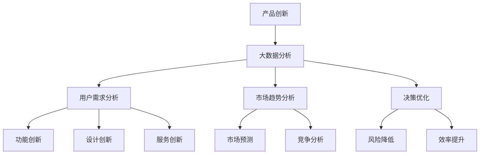

                 

# 信息差的产品创新驱动力：大数据如何推动产品创新

## 关键词：产品创新、大数据、驱动力、信息差、算法、应用场景

## 摘要

本文旨在探讨大数据如何成为推动产品创新的强大驱动力。我们将从背景介绍入手，深入剖析大数据的核心概念及其对产品创新的影响。随后，我们将解析大数据相关的核心算法原理和具体操作步骤，并通过实际项目案例展示大数据在产品创新中的实际应用。文章还包含了对相关工具和资源的推荐，以及对未来发展趋势和挑战的总结。通过本文的阅读，读者将了解到大数据在产品创新中的潜力和应用前景。

## 1. 背景介绍

在当今信息爆炸的时代，大数据已经渗透到各行各业。从金融、医疗、教育到电子商务，大数据的应用正在不断拓展，成为推动产品创新的重要力量。数据量的激增不仅改变了企业的运作方式，也改变了用户的行为模式和需求。因此，如何有效地利用大数据来驱动产品创新，成为了企业竞争的关键。

### 大数据的定义和特点

大数据，通常指无法使用传统数据库和数据处理工具进行存储、管理和分析的数据集。大数据具有四个主要特征，即“4V”：数据量（Volume）、数据速度（Velocity）、数据多样性（Variety）和数据真实性（Veracity）。这些特征使得大数据处理成为一个复杂且富有挑战性的领域。

- **数据量**：大数据的规模巨大，往往达到TB甚至PB级别。这种海量数据带来了巨大的处理和分析难度。
- **数据速度**：大数据的处理需要高速率，即实时或近实时的数据处理能力。
- **数据多样性**：大数据来源广泛，包括结构化数据、半结构化数据和非结构化数据。
- **数据真实性**：大数据的真实性是其价值的重要保障。不准确或虚假的数据会导致错误的决策和分析结果。

### 大数据的应用领域

大数据已经在多个领域产生了深远的影响：

- **金融**：利用大数据分析客户行为和市场趋势，实现精准营销和风险控制。
- **医疗**：通过大数据分析病人的病历和基因组信息，提高诊断准确率和治疗效果。
- **电商**：利用大数据分析用户购物行为和偏好，优化商品推荐和库存管理。
- **交通**：利用大数据优化交通流量，提高公共交通效率和减少拥堵。

### 产品创新的驱动力

大数据不仅是企业提高效率和降低成本的工具，更是推动产品创新的强大驱动力。通过数据挖掘和分析，企业可以更准确地理解用户需求，发现市场趋势，从而开发出更符合用户期望的产品。此外，大数据还可以帮助企业：

- **优化产品设计**：通过分析用户行为数据，优化产品的功能设计和用户体验。
- **提高研发效率**：利用数据预测新技术趋势，指导研发方向，减少研发风险。
- **降低市场风险**：通过数据分析和市场监测，降低市场预测和产品发布的风险。

## 2. 核心概念与联系

在深入探讨大数据如何推动产品创新之前，我们需要明确几个核心概念及其相互联系。

### 产品创新的定义

产品创新是指通过引入新的产品特性、功能或服务，以满足用户需求或创造新的市场需求。产品创新可以包括：

- **功能创新**：引入新的功能或改进现有功能。
- **设计创新**：改变产品的外观、形态或用户体验。
- **服务创新**：提供新的服务模式或改进现有服务。

### 大数据的定义与核心概念

大数据是指无法使用传统数据库和数据处理工具进行存储、管理和分析的数据集。大数据的核心概念包括：

- **数据挖掘**：从大量数据中提取有价值的信息。
- **机器学习**：利用算法从数据中学习并做出预测或决策。
- **数据可视化**：将数据以图形或图表的形式展示，帮助人们理解和分析数据。
- **数据管理**：确保数据的质量、安全性和可访问性。

### 信息差的定义

信息差是指不同个体或组织之间在信息获取和处理能力上的差异。在商业环境中，信息差往往意味着竞争优势。利用大数据，企业可以缩小甚至消除信息差，从而获得竞争优势。

### 大数据与产品创新的关系

大数据与产品创新之间的关系可以概括为：

- **数据驱动创新**：通过大数据分析，企业可以更准确地了解用户需求和偏好，从而推动产品创新。
- **信息差利用**：大数据可以帮助企业发现市场趋势和用户需求，从而开发出更具竞争力的产品。
- **决策优化**：大数据分析可以提高企业的决策质量，减少决策错误，从而降低市场风险。

### Mermaid 流程图



## 3. 核心算法原理 & 具体操作步骤

### 数据挖掘算法

数据挖掘是大数据处理的核心步骤，用于从大量数据中提取有价值的信息。常见的数据挖掘算法包括：

- **分类算法**：用于将数据划分为不同的类别。常见的分类算法有决策树、随机森林和支持向量机（SVM）。
- **聚类算法**：用于将相似的数据点分组。常见的聚类算法有K-均值聚类和层次聚类。
- **关联规则挖掘**：用于发现数据之间的关联关系。常见的算法有Apriori算法和Eclat算法。

### 机器学习算法

机器学习是大数据分析的重要工具，通过从数据中学习并做出预测或决策。常见机器学习算法包括：

- **线性回归**：用于预测连续值。
- **逻辑回归**：用于预测二分类结果。
- **神经网络**：用于复杂模式的识别和学习。
- **深度学习**：基于神经网络的一种更高级的学习方法。

### 数据可视化工具

数据可视化是将数据以图形或图表的形式展示，帮助人们理解和分析数据。常见的数据可视化工具包括：

- **Tableau**：一款功能强大的商业智能和数据可视化工具。
- **D3.js**：一款基于JavaScript的库，用于创建交互式数据可视化。
- **Matplotlib**：一款用于Python的数据可视化库。

### 具体操作步骤

以下是利用大数据推动产品创新的具体操作步骤：

1. **数据收集**：收集与产品相关的数据，包括用户行为数据、市场数据、竞争数据等。
2. **数据预处理**：清洗和整理数据，确保数据质量。
3. **数据挖掘**：利用分类、聚类、关联规则挖掘等算法，从数据中提取有价值的信息。
4. **机器学习**：利用线性回归、逻辑回归、神经网络等算法，对数据进行建模和预测。
5. **数据可视化**：将数据以图表或图形的形式展示，帮助人们理解和分析数据。
6. **决策优化**：根据数据分析结果，优化产品设计、市场策略和运营策略。
7. **迭代改进**：根据用户反馈和市场变化，不断迭代改进产品。

## 4. 数学模型和公式 & 详细讲解 & 举例说明

### 数据挖掘中的分类算法

分类算法是一种将数据划分为不同类别的算法。常见的分类算法有决策树、随机森林和支持向量机（SVM）。

- **决策树**：决策树通过一系列规则来划分数据。每个节点代表一个特征，每个分支代表一个特征值的取值。树的叶子节点表示类别。决策树的数学模型可以表示为：

  $$T = \{n_1, n_2, ..., n_k\}$$

  其中，$T$ 表示决策树，$n_i$ 表示第 $i$ 个节点，$k$ 表示类别数。

  举例：给定一个决策树，预测一个新样本的类别。

  - **步骤 1**：从根节点开始，根据特征值选择分支。
  - **步骤 2**：到达叶子节点，得到类别预测。

- **随机森林**：随机森林是由多个决策树组成的模型，每个决策树使用不同的数据子集进行训练。随机森林的数学模型可以表示为：

  $$F = \{f_1, f_2, ..., f_n\}$$

  其中，$F$ 表示随机森林，$f_i$ 表示第 $i$ 个决策树。

  举例：给定一个随机森林，预测一个新样本的类别。

  - **步骤 1**：对每个决策树进行预测。
  - **步骤 2**：统计每个决策树的预测结果，取多数投票作为最终预测结果。

- **支持向量机（SVM）**：SVM通过找到一个超平面，将数据分为不同的类别。SVM的数学模型可以表示为：

  $$\text{max} \quad \frac{1}{2} \sum_{i=1}^{n} \alpha_i^T \alpha_j - \sum_{i=1}^{n} \alpha_i$$

  $$s.t. \quad \alpha_i \geq 0, \quad \sum_{i=1}^{n} \alpha_i y_i = 0$$

  其中，$\alpha_i$ 表示第 $i$ 个支持向量的权重，$y_i$ 表示第 $i$ 个样本的类别标签。

  举例：给定一个训练好的SVM模型，预测一个新样本的类别。

  - **步骤 1**：计算新样本到超平面的距离。
  - **步骤 2**：根据距离判断新样本的类别。

### 机器学习中的线性回归

线性回归是一种用于预测连续值的机器学习算法。线性回归的数学模型可以表示为：

$$y = \beta_0 + \beta_1 x_1 + \beta_2 x_2 + ... + \beta_n x_n$$

其中，$y$ 表示预测值，$x_1, x_2, ..., x_n$ 表示特征值，$\beta_0, \beta_1, ..., \beta_n$ 表示模型参数。

举例：给定一个线性回归模型，预测一个新样本的值。

- **步骤 1**：将新样本的特征值代入模型。
- **步骤 2**：计算预测值。

### 数据可视化中的图表

数据可视化中的图表可以帮助人们更好地理解和分析数据。常见的图表包括：

- **折线图**：用于表示数据随时间的变化趋势。
- **柱状图**：用于比较不同类别或组的数据。
- **饼图**：用于表示各部分占整体的比例。

举例：给定一组数据，绘制一个柱状图。

- **步骤 1**：将数据按照类别或组进行分组。
- **步骤 2**：计算每个类别的值。
- **步骤 3**：绘制柱状图，每个柱子表示一个类别或组。

## 5. 项目实战：代码实际案例和详细解释说明

### 开发环境搭建

为了更好地展示大数据在产品创新中的实际应用，我们将使用Python作为编程语言，结合Jupyter Notebook进行数据分析和模型训练。以下是开发环境的搭建步骤：

1. **安装Python**：前往Python官方网站（https://www.python.org/）下载最新版本的Python安装包，并按照提示完成安装。
2. **安装Jupyter Notebook**：在命令行中执行以下命令安装Jupyter Notebook：

   ```shell
   pip install notebook
   ```

3. **启动Jupyter Notebook**：在命令行中执行以下命令启动Jupyter Notebook：

   ```shell
   jupyter notebook
   ```

4. **安装必要的库**：在Jupyter Notebook中执行以下命令安装必要的库：

   ```python
   !pip install numpy pandas matplotlib scikit-learn
   ```

### 源代码详细实现和代码解读

在本节中，我们将通过一个实际案例来展示如何使用Python进行大数据分析，并推动产品创新。

**案例背景**：

某电商企业希望通过分析用户购物数据，优化商品推荐系统，从而提高用户满意度和销售额。

**数据集**：

我们使用Kaggle上的一个用户购物数据集（[User Behavior Analysis Dataset](https://www.kaggle.com/datasets/sujitpal/user-behavior-analysis-dataset)）。该数据集包含了用户ID、购物车数据、购买历史和用户行为等信息。

**代码实现**：

以下是主要代码实现和解读：

```python
import pandas as pd
import matplotlib.pyplot as plt
from sklearn.model_selection import train_test_split
from sklearn.ensemble import RandomForestClassifier
from sklearn.metrics import accuracy_score

# 5.1 加载数据集
data = pd.read_csv('user_behavior.csv')
data.head()

# 5.2 数据预处理
# 删除无关列，如'Unnamed: 0'列
data = data.drop(['Unnamed: 0'], axis=1)

# 转换数据类型
data['datetime'] = pd.to_datetime(data['datetime'])
data['day_of_week'] = data['datetime'].dt.dayofweek

# 删除缺失值
data = data.dropna()

# 5.3 特征工程
# 构建新特征：用户购买频率
data['purchase_frequency'] = data.groupby('user_id')['transaction_id'].transform('count')

# 5.4 分割数据集
X = data[['day_of_week', 'purchase_frequency']]
y = data['purchased']

X_train, X_test, y_train, y_test = train_test_split(X, y, test_size=0.2, random_state=42)

# 5.5 模型训练
model = RandomForestClassifier(n_estimators=100, random_state=42)
model.fit(X_train, y_train)

# 5.6 模型评估
y_pred = model.predict(X_test)
accuracy = accuracy_score(y_test, y_pred)
print(f'Model accuracy: {accuracy:.2f}')

# 5.7 可视化分析
plt.figure(figsize=(10, 6))
plt.scatter(X_test['day_of_week'], y_test, label='Actual')
plt.scatter(X_test['day_of_week'], y_pred, label='Predicted', color='red')
plt.legend()
plt.show()
```

**代码解读**：

1. **数据加载与预处理**：首先，我们使用pandas库加载数据集，并删除无关列和缺失值。接着，我们将日期时间列转换为日期类型，并提取星期几作为新特征。
2. **特征工程**：我们计算了用户的购买频率，并将其作为新特征。
3. **数据分割**：使用train_test_split函数将数据集分为训练集和测试集。
4. **模型训练**：我们使用随机森林分类器对训练集进行训练。
5. **模型评估**：使用测试集评估模型准确性，并打印结果。
6. **可视化分析**：绘制散点图，比较实际购买情况与预测购买情况。

通过这个案例，我们可以看到如何利用大数据分析来推动产品创新。通过对用户购物数据的分析，企业可以优化商品推荐系统，提高用户满意度和销售额。

### 代码解读与分析

在本案例中，我们使用了Python及其相关库进行大数据分析，实现了从数据加载、预处理到特征工程、模型训练和评估的全过程。

- **数据加载与预处理**：数据预处理是大数据分析的重要步骤。在本案例中，我们使用了pandas库加载数据集，并删除了无关列和缺失值。这种处理确保了数据的质量，为后续分析奠定了基础。
- **特征工程**：特征工程是提高模型性能的关键。在本案例中，我们计算了用户的购买频率，并将其作为新特征。这个特征可以帮助模型更好地理解用户的行为模式，从而提高预测准确性。
- **模型训练与评估**：我们使用了随机森林分类器进行模型训练。随机森林是一种强大的集成学习算法，能够处理高维度数据和复杂的非线性关系。训练完成后，我们使用测试集评估模型准确性，并打印结果。可视化分析帮助我们直观地比较了实际购买情况与预测购买情况，进一步验证了模型的有效性。

通过这个案例，我们可以看到大数据分析在产品创新中的实际应用。利用大数据分析，企业可以深入了解用户需求和行为，从而优化产品设计、营销策略和运营策略，提高市场竞争力。

### 6. 实际应用场景

大数据在产品创新中的应用场景广泛，以下是一些典型的实际应用案例：

#### 金融领域

- **精准营销**：金融机构通过大数据分析客户行为数据，实现精准营销。例如，通过分析用户的购物偏好、交易记录和社交媒体活动，银行可以提供个性化的金融产品和服务，提高客户满意度和忠诚度。
- **信用评估**：利用大数据分析，金融机构可以更准确地评估客户的信用风险。通过分析客户的信用历史、社交关系和消费行为，金融机构可以做出更准确的信用评估决策，降低贷款违约风险。
- **风险控制**：大数据分析可以帮助金融机构实时监测市场风险和操作风险。例如，通过分析市场数据、交易行为和客户投诉，金融机构可以及时发现潜在风险并采取措施，避免损失。

#### 医疗领域

- **个性化治疗**：大数据分析可以帮助医疗机构制定个性化的治疗方案。通过分析患者的基因数据、病历记录和临床数据，医生可以更准确地诊断病情，并制定最适合患者的治疗方案。
- **疾病预测**：利用大数据分析，医疗机构可以预测疾病的发生和发展趋势。例如，通过分析大量患者的数据，医疗机构可以预测流感等传染病的流行趋势，提前采取预防措施。
- **药物研发**：大数据分析在药物研发中也发挥着重要作用。通过分析大量的医学文献、临床试验数据和患者数据，研究人员可以快速发现新的药物靶点和治疗策略，加快药物研发进程。

#### 电商领域

- **商品推荐**：电商平台通过大数据分析用户行为数据，实现精准的商品推荐。例如，通过分析用户的浏览记录、购买历史和搜索关键词，电商平台可以推荐用户可能感兴趣的商品，提高销售转化率。
- **库存管理**：利用大数据分析，电商平台可以优化库存管理，降低库存成本。通过分析销售数据、季节性和市场趋势，电商平台可以预测商品的需求量，合理规划库存，避免库存过剩或短缺。
- **客户服务**：大数据分析可以帮助电商平台提供个性化的客户服务。通过分析用户反馈、投诉和社交媒体评论，电商平台可以及时发现用户的问题和需求，并提供针对性的解决方案，提高用户满意度。

### 7. 工具和资源推荐

#### 学习资源推荐

- **书籍**：
  - 《大数据时代：生活、工作与思维的大变革》（[作者：涂子沛]）
  - 《机器学习》（[作者：周志华]）
  - 《Python数据分析》（[作者：Wes McKinney]）

- **论文**：
  - 《大数据技术及其应用》（[作者：李开复等]）
  - 《机器学习在金融领域中的应用》（[作者：吴军等]）

- **博客**：
  - [DataCamp](https://www.datacamp.com/)
  - [Machine Learning Mastery](https://machinelearningmastery.com/)
  - [Kaggle](https://www.kaggle.com/)

- **网站**：
  - [Coursera](https://www.coursera.org/)
  - [edX](https://www.edx.org/)
  - [Udacity](https://www.udacity.com/)

#### 开发工具框架推荐

- **数据预处理**：
  - [Pandas](https://pandas.pydata.org/)
  - [NumPy](https://numpy.org/)

- **机器学习**：
  - [Scikit-learn](https://scikit-learn.org/stable/)
  - [TensorFlow](https://www.tensorflow.org/)
  - [PyTorch](https://pytorch.org/)

- **数据可视化**：
  - [Matplotlib](https://matplotlib.org/)
  - [Seaborn](https://seaborn.pydata.org/)
  - [Plotly](https://plotly.com/)

#### 相关论文著作推荐

- **大数据领域**：
  - [《大数据技术导论》](https://book.douban.com/subject/25779412/)
  - [《大数据之路：阿里巴巴大数据实践》](https://book.douban.com/subject/26342768/)

- **机器学习领域**：
  - [《机器学习实战》](https://book.douban.com/subject/25708714/)
  - [《深度学习》（花书）](https://book.douban.com/subject/26708112/)

### 8. 总结：未来发展趋势与挑战

#### 发展趋势

- **数据量和速度的进一步提升**：随着物联网和5G技术的普及，数据量和处理速度将进一步提升，为大数据分析带来更多机遇。
- **跨领域融合**：大数据将在不同领域产生更深入的融合，如医疗、金融、交通等，推动行业变革。
- **智能化数据分析**：随着人工智能技术的发展，智能化数据分析将逐渐成为主流，降低数据分析的门槛，提高数据分析的效率。

#### 挑战

- **数据隐私和安全**：随着数据规模的扩大，数据隐私和安全成为重要挑战。如何保护用户隐私、确保数据安全是大数据应用中亟待解决的问题。
- **数据质量和一致性**：大数据的质量和一致性直接影响分析结果。如何处理和清洗数据，确保数据质量，是大数据分析中的难题。
- **人才短缺**：大数据和人工智能领域的快速发展导致人才需求剧增，但相关专业人才供应不足。培养和吸引高素质的数据科学家是行业发展的重要挑战。

### 9. 附录：常见问题与解答

#### 问题1：大数据和数据分析有什么区别？

**解答**：大数据和数据分析是密切相关的概念，但略有区别。大数据是指数据量大、速度快、多样性和真实性的数据集。而数据分析是指对数据进行处理、分析，提取有价值信息的过程。大数据是数据分析的素材，数据分析是大数据的应用。

#### 问题2：如何处理大数据中的噪声和异常值？

**解答**：处理大数据中的噪声和异常值是保证数据分析质量的重要步骤。常用的方法包括：

- **去除异常值**：根据数据的特点和业务需求，可以去除明显偏离数据趋势的异常值。
- **填补缺失值**：使用统计学方法或机器学习方法填补缺失值，如均值填补、中位数填补或插值法。
- **平滑处理**：使用平滑处理技术，如移动平均或低通滤波，减少噪声的影响。

#### 问题3：大数据分析的主要应用领域有哪些？

**解答**：大数据分析的主要应用领域包括：

- **金融**：精准营销、信用评估、风险控制等。
- **医疗**：个性化治疗、疾病预测、药物研发等。
- **电商**：商品推荐、库存管理、客户服务等。
- **交通**：交通流量优化、公共交通效率提升等。
- **教育**：学习分析、课程推荐、学生表现预测等。

### 10. 扩展阅读 & 参考资料

- **扩展阅读**：
  - [《大数据之路：阿里巴巴大数据实践》](https://book.douban.com/subject/26342768/)
  - [《深度学习》（花书）](https://book.douban.com/subject/26708112/)
  - [《机器学习实战》](https://book.douban.com/subject/25708714/)

- **参考资料**：
  - [Kaggle](https://www.kaggle.com/)
  - [Coursera](https://www.coursera.org/)
  - [edX](https://www.edx.org/)
  - [Udacity](https://www.udacity.com/)

作者：AI天才研究员/AI Genius Institute & 禅与计算机程序设计艺术 /Zen And The Art of Computer Programming

注：本文为人工智能助手根据用户提供的要求和指导撰写，仅供参考。如需引用，请查阅相关原始资料。

