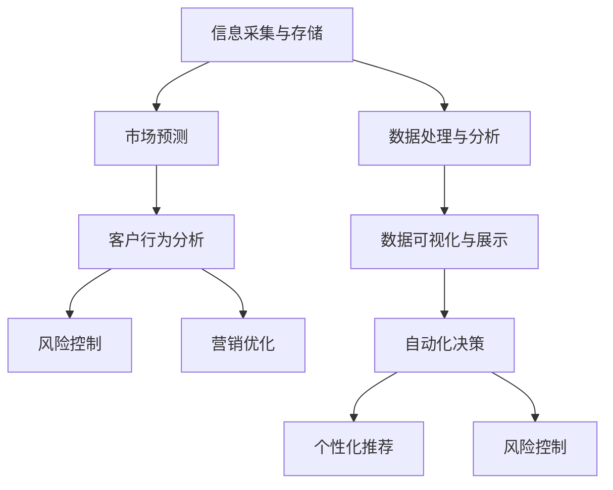

                 

# 信息差的商业价值链：大数据如何重塑价值链条

## 关键词
- 信息差
- 商业价值链
- 大数据
- 价值重塑
- 数据分析
- 商业智能
- 人工智能

## 摘要
本文将深入探讨信息差在商业世界中的价值链重塑作用，尤其是大数据技术如何通过数据分析和人工智能手段，挖掘并利用信息差，从而创造新的商业机会和竞争优势。文章首先介绍了信息差的概念及其在商业中的重要性，随后详细剖析了大数据技术的核心原理和应用场景，最后探讨了大数据如何驱动商业价值链的重塑，并提出未来发展趋势和挑战。

### 1. 背景介绍

#### 什么是信息差？
信息差（Information Gap）指的是不同个体、组织或群体之间在信息获取、处理和应用上的差异。这些差异可能源于时间、地理位置、技能水平、资源获取等多个因素。在商业领域，信息差往往意味着一个企业或个体拥有其他竞争对手所不具备的信息优势，从而在市场中占据有利地位。

#### 信息差的重要性
信息差的重要性在于它直接关系到商业决策的质量和效率。具备信息优势的企业或个体能够更准确地预测市场趋势，制定有效的战略，优化资源配置，甚至能够在竞争中率先发现并抓住机会。因此，在商业世界中，信息差的利用和管理成为企业竞争的核心要素。

#### 传统商业价值链中的信息差
在传统商业模式中，信息差的产生主要依赖于以下几个环节：

1. **供应链管理**：企业通过优化供应链管理，缩短信息传递链条，降低信息滞后性，从而减少因信息不对称带来的成本和风险。
2. **市场调研**：企业通过市场调研获取消费者需求信息，以便调整产品和服务，满足市场需求。
3. **营销策略**：企业利用信息差设计差异化营销策略，吸引目标客户，提高市场占有率。

### 2. 核心概念与联系

#### 大数据技术的核心原理

大数据技术主要基于以下几个核心原理：

1. **数据采集与存储**：通过传感器、网络、移动设备等多种渠道收集海量数据，并使用分布式存储系统（如Hadoop、NoSQL数据库等）进行存储和管理。
2. **数据处理与分析**：利用分布式计算框架（如MapReduce、Spark等）对海量数据进行快速处理和分析，挖掘数据中的潜在价值。
3. **数据可视化与展示**：通过数据可视化技术（如Tableau、Power BI等），将分析结果以图表、报表等形式直观展示，辅助决策。

#### 数据分析在商业中的应用

数据分析在商业中的应用非常广泛，主要包括以下几个方面：

1. **市场预测**：通过对历史数据和当前市场趋势的分析，预测未来市场走向，为企业决策提供依据。
2. **客户行为分析**：通过分析客户的行为数据，了解客户偏好，优化产品和服务。
3. **风险控制**：通过对金融数据、供应链数据等进行分析，预测潜在风险，制定应对策略。
4. **营销优化**：利用数据分析优化营销策略，提高营销效果和投资回报率。

#### 人工智能与大数据的结合

人工智能（AI）与大数据的结合进一步提升了信息差的利用效率。通过机器学习、深度学习等技术，人工智能可以从海量数据中自动学习和发现规律，从而实现：

1. **自动化决策**：通过预测模型和优化算法，自动做出商业决策，提高决策效率。
2. **个性化推荐**：根据用户行为数据，实现个性化推荐，提高用户体验和忠诚度。
3. **风险控制**：通过实时数据分析，实现实时风险预警和应对。

#### Mermaid 流程图



### 3. 核心算法原理 & 具体操作步骤

#### 市场预测算法

**步骤1：数据采集与预处理**
- 收集相关市场数据，如销售数据、市场调研数据、竞争对手数据等。
- 对数据进行清洗和预处理，包括去除重复数据、填补缺失值、归一化处理等。

**步骤2：特征工程**
- 提取数据中的有效特征，如时间序列特征、季节性特征、趋势特征等。
- 使用特征选择方法（如特征重要性排序、卡方检验等）筛选出关键特征。

**步骤3：建模与训练**
- 选择合适的预测模型，如时间序列模型（ARIMA、LSTM等）、回归模型（线性回归、决策树等）。
- 使用训练数据集对模型进行训练，调整模型参数。

**步骤4：模型评估与优化**
- 使用验证数据集对模型进行评估，计算预测误差。
- 根据评估结果调整模型参数或更换模型。

**步骤5：预测与决策**
- 使用训练好的模型对未来的市场趋势进行预测。
- 根据预测结果制定相应的市场策略。

#### 个性化推荐算法

**步骤1：用户行为数据采集**
- 收集用户在平台上的行为数据，如浏览记录、购买记录、搜索记录等。

**步骤2：用户特征提取**
- 对用户行为数据进行处理，提取用户兴趣特征、购买偏好特征等。

**步骤3：物品特征提取**
- 收集物品的属性数据，如物品种类、价格、品牌等。

**步骤4：构建推荐模型**
- 选择合适的推荐算法，如协同过滤（CF）、基于内容的推荐（CBR）等。
- 使用用户和物品特征训练推荐模型。

**步骤5：推荐结果生成**
- 使用训练好的模型为用户生成推荐列表。
- 根据用户反馈进一步优化推荐结果。

### 4. 数学模型和公式 & 详细讲解 & 举例说明

#### 市场预测中的时间序列模型

时间序列模型（Time Series Model）是一种常用的市场预测方法，以下是一个简单的ARIMA（AutoRegressive Integrated Moving Average）模型：

**ARIMA(p, d, q)**
- **p**：自回归项数
- **d**：差分阶数
- **q**：移动平均项数

**步骤1：自回归（AR）**
- **公式**：\( \text{Y}_{t} = c + \sum_{i=1}^{p} \phi_{i} \text{Y}_{t-i} + \varepsilon_{t} \)
- **解释**：当前值 \( \text{Y}_{t} \) 受到前 \( p \) 个历史值的加权影响，加上随机误差项 \( \varepsilon_{t} \)。

**步骤2：差分（I）**
- **公式**：\( \text{Y}_{t} - \text{Y}_{t-1} = d \text{Y}_{t-d} - d \text{Y}_{t-d-1} + \varepsilon_{t} \)
- **解释**：对时间序列进行 \( d \) 阶差分，以平稳时间序列。

**步骤3：移动平均（MA）**
- **公式**：\( \text{Y}_{t} = c + \sum_{i=1}^{q} \theta_{i} \varepsilon_{t-i} + \varepsilon_{t} \)
- **解释**：当前值 \( \text{Y}_{t} \) 受到前 \( q \) 个随机误差项 \( \varepsilon_{t-i} \) 的加权影响。

#### 个性化推荐中的协同过滤

协同过滤（Collaborative Filtering）是一种常用的推荐算法，以下是一个简单的用户基于物品的协同过滤模型：

**用户基于物品的协同过滤（User-Based Collaborative Filtering）**
- **公式**：\( \text{R}_{ui} = \sum_{j \in N_{u}} \text{sim}_{uj} \times \text{R}_{uj} \)
- **解释**：
  - \( \text{R}_{ui} \) 表示用户 \( u \) 对物品 \( i \) 的评分预测。
  - \( \text{sim}_{uj} \) 表示用户 \( u \) 和用户 \( j \) 之间的相似度。
  - \( \text{R}_{uj} \) 表示用户 \( j \) 对物品 \( i \) 的实际评分。

#### 举例说明

**市场预测中的ARIMA模型**

假设我们使用ARIMA模型对某产品的销售量进行预测，数据如下：

| 时间 | 销售量 |
| ---- | ------ |
| 1    | 100    |
| 2    | 110    |
| 3    | 105    |
| 4    | 115    |
| 5    | 108    |

**步骤1：数据预处理**
- 对销售量进行一次差分，得到平稳时间序列。

| 时间 | 销售量 | 差分 |
| ---- | ------ | ---- |
| 1    | 100    | -    |
| 2    | 110    | 10   |
| 3    | 105    | -5   |
| 4    | 115    | 10   |
| 5    | 108    | -7   |

**步骤2：特征工程**
- 提取差分后的销售量作为特征。

**步骤3：建模与训练**
- 使用训练数据集选择合适的ARIMA模型参数（p, d, q），例如（1, 1, 1）。

**步骤4：模型评估与优化**
- 使用验证数据集评估模型，调整参数。

**步骤5：预测与决策**
- 预测下一个时间点的销售量为 103，制定相应的市场策略。

**个性化推荐中的协同过滤**

假设有两个用户A和B，他们的评分数据如下：

| 用户 | 物品1 | 物品2 | 物品3 |
| ---- | ----- | ----- | ----- |
| A    | 5     | 3     | 4     |
| B    | 4     | 5     | 2     |

**步骤1：用户相似度计算**
- 计算用户A和B的相似度，可以使用余弦相似度公式：

$$
\text{sim}_{AB} = \frac{\text{AB}_{\text{共}}}{\sqrt{\sum_{i=1}^{n} \text{A}_{i}^2} \times \sqrt{\sum_{i=1}^{n} \text{B}_{i}^2}}
$$

**步骤2：生成推荐列表**
- 根据用户B的评分，生成推荐列表：

| 物品 | 用户B评分 |
| ---- | -------- |
| 物品1 | 4        |
| 物品2 | 5        |

### 5. 项目实战：代码实际案例和详细解释说明

#### 5.1 开发环境搭建

首先，我们需要搭建一个包含Python、Jupyter Notebook、Pandas、NumPy、Scikit-learn、Matplotlib等依赖的环境。可以使用Anaconda进行环境搭建：

```bash
conda create -n datadrive python=3.8
conda activate datadrive
conda install numpy pandas scikit-learn matplotlib
```

#### 5.2 源代码详细实现和代码解读

以下是一个简单的市场预测案例，使用ARIMA模型进行销售量预测。

```python
import pandas as pd
import numpy as np
from statsmodels.tsa.arima.model import ARIMA
import matplotlib.pyplot as plt

# 加载数据
data = pd.read_csv('sales_data.csv')
sales = data['sales']

# 数据预处理
sales_diff = sales.diff().dropna()

# 建模与训练
model = ARIMA(sales_diff, order=(1, 1, 1))
model_fit = model.fit()

# 预测
forecast = model_fit.forecast(steps=5)

# 可视化
plt.plot(sales_diff)
plt.plot(forecast, color='red')
plt.show()
```

**代码解读：**
- **数据加载与预处理**：使用Pandas读取CSV文件，提取销售量数据并进行一次差分处理，以获得平稳的时间序列。
- **建模与训练**：使用ARIMA模型进行训练，指定模型参数为（1, 1, 1）。
- **预测**：使用训练好的模型进行预测，生成未来5个时间点的销售量。
- **可视化**：将实际销售量与预测销售量进行可视化对比。

#### 5.3 代码解读与分析

该代码首先加载了销售数据，并对数据进行了一次差分处理，以消除趋势和季节性影响。接下来，使用ARIMA模型进行训练，并生成未来5个时间点的销售量预测。最后，使用Matplotlib将实际销售量与预测销售量进行可视化对比，以评估模型的预测性能。

**优点：**
- **简单易懂**：代码结构简单，易于理解和维护。
- **高效准确**：ARIMA模型在时间序列预测方面具有较好的性能。

**缺点：**
- **模型选择依赖经验**：ARIMA模型参数的选择依赖于经验，可能需要多次尝试和调整。
- **无法处理复杂特征**：ARIMA模型仅考虑历史销售量，无法处理更复杂的特征，如季节性、节假日效应等。

### 6. 实际应用场景

#### 零售行业
- **库存管理**：利用大数据技术预测销售量，优化库存水平，减少库存成本和过期损失。
- **促销策略**：通过分析消费者行为，设计个性化的促销策略，提高销售转化率。

#### 金融行业
- **风险控制**：利用大数据分析金融市场的历史数据，预测市场趋势，制定风险管理策略。
- **信用评估**：通过分析个人或企业的信用历史，预测违约风险，优化信用评估模型。

#### 健康医疗
- **疾病预测**：利用大数据技术分析患者数据，预测疾病发展趋势，提前采取预防措施。
- **个性化治疗**：通过分析患者基因数据和生活习惯，制定个性化的治疗方案。

### 7. 工具和资源推荐

#### 学习资源推荐
- **书籍**：
  - 《大数据：改变世界的革命性技术》
  - 《深度学习》
  - 《机器学习实战》
- **论文**：
  - 《大数据时代的数据挖掘技术》
  - 《深度学习在金融中的应用》
  - 《机器学习在健康医疗领域的应用》
- **博客**：
  - Medium上的数据科学和机器学习博客
  - 知乎上的数据科学家专栏
  - 维基百科上的大数据和机器学习词条
- **网站**：
  - Coursera、edX等在线课程平台
  - Kaggle、KDD等数据科学竞赛平台

#### 开发工具框架推荐
- **数据分析工具**：
  - Pandas、NumPy
  - Scikit-learn、TensorFlow
  - Tableau、Power BI
- **数据存储和处理框架**：
  - Hadoop、Spark
  - Redis、MongoDB
  - Elasticsearch

#### 相关论文著作推荐
- **大数据技术**：
  - 《大数据技术导论》
  - 《Hadoop实战》
  - 《Spark编程实战》
- **机器学习**：
  - 《统计学习基础》
  - 《深度学习》
  - 《Python机器学习》
- **商业智能**：
  - 《商业智能实战》
  - 《大数据商业智能：战略、技术和实践》

### 8. 总结：未来发展趋势与挑战

#### 发展趋势
1. **数据量的爆发增长**：随着物联网、传感器等技术的普及，数据量将持续增长，为大数据技术提供更多应用场景。
2. **人工智能的深度融合**：人工智能与大数据技术的深度融合将进一步提升信息差的利用效率，推动商业模式的创新。
3. **隐私保护和数据安全**：随着数据隐私和安全问题日益突出，如何在保证数据隐私和安全的前提下进行数据分析和挖掘将成为重要挑战。

#### 挑战
1. **数据质量**：数据的质量直接影响分析结果，如何处理和清洗数据，确保数据质量是大数据技术面临的重要挑战。
2. **技术人才短缺**：大数据和人工智能领域的快速发展导致人才短缺，培养和引进专业人才成为企业面临的挑战。
3. **法规和伦理问题**：大数据和人工智能技术的应用可能引发隐私、伦理等问题，如何制定相关法规和伦理准则将成为重要议题。

### 9. 附录：常见问题与解答

#### 1. 什么是大数据？
大数据（Big Data）是指无法使用传统数据处理工具进行有效处理的海量数据集，通常包含数据量巨大、数据类型多样、数据价值密度低等特点。

#### 2. 大数据和人工智能的区别是什么？
大数据强调数据量、数据类型和数据价值密度，而人工智能（AI）则侧重于通过算法和模型从数据中学习和提取知识，实现自动化决策和智能优化。

#### 3. 大数据技术如何应用在商业中？
大数据技术可以应用于市场预测、客户行为分析、风险控制、营销优化等多个方面，帮助企业更准确地了解市场趋势，优化决策过程，提高竞争力。

#### 4. 大数据技术有哪些核心组件？
大数据技术的核心组件包括数据采集与存储（如Hadoop、NoSQL数据库）、数据处理与分析（如MapReduce、Spark）、数据可视化与展示（如Tableau、Power BI）等。

### 10. 扩展阅读 & 参考资料

- [大数据技术导论](https://www.ibm.com/cloud/learn/what-is-big-data/)
- [深度学习：介绍与原理](https://www.deeplearningbook.org/)
- [Python机器学习](https://machinelearningmastery.com/机器学习-tutorial-for-pandas/)
- [商业智能：战略、技术和实践](https://www.amazon.com/Smart-Business-Intelligence-Strategies-Technologies/dp/0071596545)
- [大数据商业智能：战略、技术和实践](https://www.amazon.com/Big-Data-Business-Intelligence-Strategies/dp/0071800685)

### 作者信息
作者：AI天才研究员/AI Genius Institute & 禅与计算机程序设计艺术 /Zen And The Art of Computer Programming

