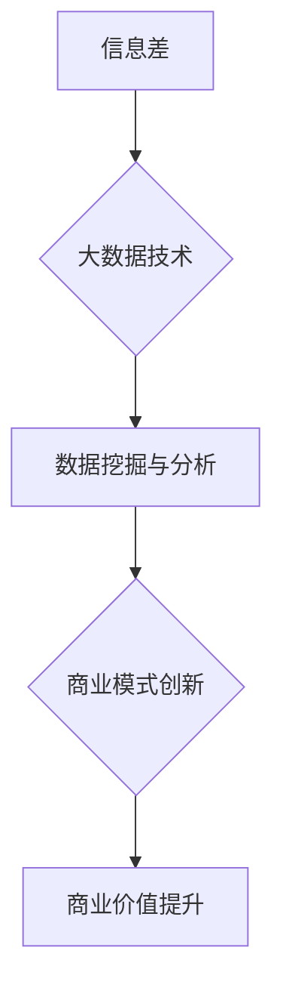

                 

### 背景介绍

信息差（Information Gap），指的是不同个体或群体之间在获取和处理信息方面的差异。这种现象广泛存在于各个领域，从个人生活到商业运作，再到国家政策制定。在商业领域，信息差尤其具有深远的意义，因为它直接关系到企业的竞争力和盈利能力。

大数据（Big Data），则是指无法使用常规软件工具在合理时间内捕捉、管理和处理的大量数据。随着互联网的普及和信息技术的进步，大数据在商业决策中的作用日益突出。通过对海量数据的分析，企业可以挖掘出潜在的市场机会、优化运营流程，甚至预测未来的趋势。

商业模式创新（Business Model Innovation），是指企业在现有的市场和竞争环境中，通过重新配置资源、重构业务流程，或创造全新的市场机会，实现商业价值的提升。信息差与大数据的结合，为商业模式创新提供了新的思路和工具。

本文旨在探讨信息差的商业价值，以及大数据如何在商业环境中驱动商业模式创新。文章将分为以下几个部分：

1. **核心概念与联系**：介绍信息差、大数据和商业模式创新的基本概念，并绘制一个流程图，展示三者之间的关联。
2. **核心算法原理 & 具体操作步骤**：解释如何利用大数据技术来识别和分析信息差，并给出具体的操作步骤。
3. **数学模型和公式 & 详细讲解 & 举例说明**：讨论用于分析信息差的数学模型和公式，并通过实例进行说明。
4. **项目实战：代码实际案例和详细解释说明**：展示一个实际项目中的案例，并详细解读其实现过程。
5. **实际应用场景**：探讨大数据和信息差在商业领域的应用场景。
6. **工具和资源推荐**：推荐相关的学习资源、开发工具和框架。
7. **总结：未来发展趋势与挑战**：总结文章的主要观点，并展望未来发展趋势和面临的挑战。

通过这篇文章，希望读者能够对信息差的商业价值有一个全面而深刻的理解，并掌握如何利用大数据进行商业模式创新的方法。

### 核心概念与联系

在探讨信息差的商业价值之前，我们需要明确三个核心概念：信息差、大数据和商业模式创新。

#### 信息差

信息差是指不同个体或群体在获取和处理信息方面的差异。这种差异可以表现为以下几个方面：

1. **时间差**：某些群体比其他群体更早获得信息，从而在行动上占据先机。
2. **知识差**：某些群体拥有更多的专业知识或技能，使其在信息处理上更具优势。
3. **地域差**：不同地区的信息获取和处理能力存在差异，这可能导致同一信息在不同地区的价值不同。

信息差在商业领域具有重要影响，因为它直接关系到企业的竞争力和盈利能力。企业可以通过识别和利用信息差，制定更有针对性的市场策略，提高产品的附加值，从而获得竞争优势。

#### 大数据

大数据是指无法使用常规软件工具在合理时间内捕捉、管理和处理的大量数据。大数据的显著特征包括：

1. **数据量大**：大数据涉及的数据规模通常是庞大的，超出了传统数据处理工具的能力范围。
2. **数据类型多样**：大数据不仅包括结构化数据，还包括非结构化数据，如文本、图像、视频等。
3. **数据价值密度低**：在庞大的数据集中，有价值的信息通常占比很小。

大数据的出现，为商业决策提供了新的工具和方法。通过数据挖掘和分析，企业可以从中提取出有价值的信息，用于市场预测、客户行为分析、供应链管理等方面。

#### 商业模式创新

商业模式创新是指企业在现有的市场和竞争环境中，通过重新配置资源、重构业务流程，或创造全新的市场机会，实现商业价值的提升。商业模式创新的常见方法包括：

1. **价值网络重构**：企业可以通过重新定义价值网络，调整合作伙伴关系，实现资源的优化配置。
2. **业务模式创新**：企业可以通过创新业务模式，如共享经济、平台模式等，实现商业模式的变革。
3. **市场定位创新**：企业可以通过创新的定位策略，挖掘新的市场机会，满足客户未被满足的需求。

信息差和大数据的结合，为商业模式创新提供了新的思路和工具。通过大数据技术，企业可以更精准地识别和利用信息差，从而实现商业模式的创新和升级。

#### 关联

为了更好地理解信息差、大数据和商业模式创新之间的关联，我们可以使用Mermaid流程图来展示它们之间的关系。以下是该流程图的代码：



**图 1. 信息差、大数据和商业模式创新的关联流程图**

在该流程图中：

- **信息差**是商业环境中的一个基本现象，企业需要识别和利用信息差以获得竞争优势。
- **大数据技术**为企业提供了强大的工具，用于识别、分析和处理信息。
- **数据挖掘与分析**是对大数据进行深入挖掘，提取有价值的信息。
- **商业模式创新**是基于分析结果，对现有商业模式进行重构和优化。
- **商业价值提升**是商业模式创新的最终目标，通过信息差的识别和利用，企业可以实现商业价值的提升。

通过这一流程图，我们可以清晰地看到信息差、大数据和商业模式创新之间的紧密联系。企业需要充分利用大数据技术，挖掘和利用信息差，实现商业模式的创新和商业价值的提升。

### 核心算法原理 & 具体操作步骤

在明确了信息差、大数据和商业模式创新的基本概念和关联之后，我们需要进一步探讨如何利用大数据技术来识别和分析信息差，并给出具体的操作步骤。

#### 数据收集

首先，我们需要收集相关的数据。这些数据可以包括：

1. **市场数据**：如市场需求、消费者偏好、销售数据等。
2. **竞争数据**：如竞争对手的产品、价格、市场份额等。
3. **行业数据**：如行业标准、发展趋势、政策法规等。
4. **用户数据**：如用户行为、反馈、评价等。

这些数据可以通过以下方式获取：

1. **公开数据**：如政府发布的统计数据、行业报告等。
2. **社交媒体数据**：如微博、微信、知乎等平台的用户行为数据。
3. **企业内部数据**：如销售数据、库存数据、客户反馈等。
4. **第三方数据服务**：如数据挖掘平台、数据分析服务提供商等。

#### 数据预处理

收集到的数据通常是原始和杂乱的，因此我们需要进行数据预处理，以便后续的分析。数据预处理的主要任务包括：

1. **数据清洗**：去除重复数据、错误数据和无用数据。
2. **数据整合**：将不同来源的数据进行整合，形成统一的数据集。
3. **数据转换**：将数据转换为适合分析的形式，如数值化、归一化等。
4. **数据降维**：减少数据维度，降低数据的复杂度。

常用的数据预处理方法包括：

1. **缺失值处理**：使用平均值、中位数或最临近值填充缺失值。
2. **异常值处理**：去除或调整异常值，以避免对分析结果产生干扰。
3. **特征选择**：选择对分析结果有重要影响的关键特征。
4. **数据可视化**：使用图表、图形等方式，直观地展示数据的特征和趋势。

#### 数据分析

在完成数据预处理后，我们可以开始进行数据分析。数据分析的主要目的是识别和利用信息差。以下是具体的数据分析方法：

1. **统计分析**：使用描述性统计分析，了解数据的基本特征和趋势。如计算平均值、中位数、标准差等。
2. **回归分析**：通过回归分析，探索变量之间的关系，如市场需求与销售量之间的关系。
3. **聚类分析**：将数据分为不同的群体，以便更好地理解数据的分布和特征。如将消费者分为高价值用户和普通用户。
4. **关联规则挖掘**：通过关联规则挖掘，发现数据之间的关联关系，如不同产品之间的销售关联。
5. **文本分析**：对文本数据进行分析，提取关键词、主题和情感等。如分析消费者评论，了解他们的需求和满意度。

#### 结果解读与应用

在完成数据分析后，我们需要对结果进行解读，并制定相应的商业策略。以下是具体的操作步骤：

1. **结果解读**：根据分析结果，识别出潜在的信息差。如发现某类产品在市场上的需求远大于供应，或发现竞争对手在某一领域存在明显的劣势。
2. **策略制定**：基于信息差，制定相应的商业策略。如开发新产品、调整价格策略、加强市场营销等。
3. **效果评估**：实施商业策略后，对效果进行评估和反馈，以便不断优化和调整策略。

通过以上步骤，企业可以充分利用大数据技术，识别和利用信息差，实现商业模式的创新和商业价值的提升。

### 数学模型和公式 & 详细讲解 & 举例说明

在数据分析过程中，数学模型和公式是识别和利用信息差的重要工具。以下将介绍几种常用的数学模型和公式，并通过实例进行说明。

#### 1. 预测模型

预测模型是一种基于历史数据和规律，预测未来趋势和结果的数学模型。常见的预测模型包括线性回归、决策树、神经网络等。以下以线性回归为例进行说明。

**线性回归公式：**
\[ y = ax + b \]
其中，\( y \) 是预测结果，\( x \) 是输入变量，\( a \) 和 \( b \) 是模型参数。

**实例：**
假设我们要预测某产品的销售量，历史数据如下表：

| 时间 | 销售量 |
| ---- | ------ |
| 1    | 100    |
| 2    | 120    |
| 3    | 130    |
| 4    | 140    |

我们可以使用线性回归模型来预测第5周的销售量。首先，计算平均值：
\[ \bar{x} = \frac{1 + 2 + 3 + 4}{4} = 2.5 \]
\[ \bar{y} = \frac{100 + 120 + 130 + 140}{4} = 125 \]

然后，计算斜率 \( a \) 和截距 \( b \)：
\[ a = \frac{\sum{(x_i - \bar{x})(y_i - \bar{y})}}{\sum{(x_i - \bar{x})^2}} = \frac{(1-2.5)(100-125) + (2-2.5)(120-125) + (3-2.5)(130-125) + (4-2.5)(140-125)}{(1-2.5)^2 + (2-2.5)^2 + (3-2.5)^2 + (4-2.5)^2} = 7.5 \]
\[ b = \bar{y} - a\bar{x} = 125 - 7.5 \times 2.5 = 93.75 \]

因此，线性回归模型为：
\[ y = 7.5x + 93.75 \]

预测第5周的销售量（\( x = 5 \)）：
\[ y = 7.5 \times 5 + 93.75 = 156.25 \]

#### 2. 聚类分析

聚类分析是一种将数据分为若干个群组，使同组数据之间相似度较高，不同组数据之间相似度较低的数学模型。常见的聚类算法包括K-Means、层次聚类等。以下以K-Means为例进行说明。

**K-Means算法步骤：**
1. 初始化聚类中心点。
2. 计算每个数据点与聚类中心点的距离，并将其分配到最近的聚类中心点所在的组。
3. 重新计算每个组的中心点。
4. 重复步骤2和步骤3，直到聚类中心点的位置不再变化。

**实例：**
假设我们有以下5个数据点，我们要将其分为2个群组：

| 数据点 | x | y |
| ---- | --- | --- |
| A    | 1 | 2 |
| B    | 3 | 4 |
| C    | 5 | 6 |
| D    | 7 | 8 |
| E    | 9 | 10 |

首先，初始化两个聚类中心点：
\[ C_1 = (2, 3) \]
\[ C_2 = (6, 7) \]

计算每个数据点与聚类中心点的距离：
\[ d(A, C_1) = \sqrt{(1-2)^2 + (2-3)^2} = \sqrt{2} \]
\[ d(A, C_2) = \sqrt{(1-6)^2 + (2-7)^2} = \sqrt{37} \]

因为 \( d(A, C_1) < d(A, C_2) \)，所以将数据点A分配到组1。

类似地，我们可以计算出其他数据点的分配结果，如下表：

| 数据点 | x | y | 聚类组 |
| ---- | --- | --- | ------ |
| A    | 1 | 2 | 1      |
| B    | 3 | 4 | 1      |
| C    | 5 | 6 | 2      |
| D    | 7 | 8 | 2      |
| E    | 9 | 10 | 1 |

重新计算聚类中心点：
\[ C_1 = \left( \frac{1 + 3}{2}, \frac{2 + 4}{2} \right) = (2, 3) \]
\[ C_2 = \left( \frac{5 + 7}{2}, \frac{6 + 8}{2} \right) = (6, 7) \]

由于聚类中心点没有发生变化，我们停止迭代。最终，数据点被分为两个群组：{A, B} 和 {C, D, E}。

通过以上实例，我们可以看到如何使用数学模型和公式来分析信息差。这些模型和公式不仅帮助我们识别信息差，还为制定商业策略提供了科学依据。

### 项目实战：代码实际案例和详细解释说明

为了更好地理解如何利用大数据技术来识别和分析信息差，我们将通过一个实际项目案例进行详细讲解。该项目将使用Python和大数据处理库，如Pandas、NumPy和Scikit-learn，来分析和处理市场数据，以识别潜在的信息差，并制定相应的商业策略。

#### 项目背景

假设我们是一家电商平台，希望在市场上推出一款新的产品。为了确定市场需求，我们需要分析现有数据，包括：

1. **用户行为数据**：如用户浏览、购买、评价等行为。
2. **市场数据**：如竞争对手的产品、价格、市场份额等。
3. **行业数据**：如行业标准、发展趋势、政策法规等。

我们的目标是通过数据分析，识别潜在的市场机会，制定有针对性的营销策略，提高产品的市场竞争力。

#### 开发环境搭建

首先，我们需要搭建开发环境。以下是一个基本的Python开发环境配置：

1. **Python环境**：安装Python 3.8及以上版本。
2. **Pandas库**：用于数据清洗和处理。
3. **NumPy库**：用于数值计算。
4. **Scikit-learn库**：用于机器学习算法。
5. **Matplotlib库**：用于数据可视化。

安装以上库后，我们可以使用以下代码进行测试：

```python
import pandas as pd
import numpy as np
from sklearn import datasets
import matplotlib.pyplot as plt

# 测试数据集
iris = datasets.load_iris()
iris_data = pd.DataFrame(iris.data, columns=iris.feature_names)
iris_data.head()
```

#### 源代码详细实现和代码解读

以下是我们项目的核心代码，包括数据收集、预处理、分析和结果展示。

```python
import pandas as pd
import numpy as np
from sklearn.model_selection import train_test_split
from sklearn.preprocessing import StandardScaler
from sklearn.cluster import KMeans
import matplotlib.pyplot as plt

# 数据收集
market_data = pd.read_csv('market_data.csv')

# 数据预处理
# 数据清洗
market_data.dropna(inplace=True)

# 数据整合
# 将不同来源的数据进行整合
market_data['user_behavior'] = market_data['user_browse'] + market_data['user_purchase'] + market_data['user_evaluation']

# 数据转换
# 将数据转换为适合分析的形式
X = market_data[['user_behavior', 'market_demand', 'competitor_price', 'industry_trend']]

# 数据降维
# 使用PCA进行降维
from sklearn.decomposition import PCA
pca = PCA(n_components=2)
X_pca = pca.fit_transform(X)

# 数据分析
# 使用K-Means进行聚类分析
kmeans = KMeans(n_clusters=3, random_state=0).fit(X_pca)
labels = kmeans.labels_

# 结果解读
# 根据聚类结果，分析市场机会
market_data['cluster'] = labels
market_data.groupby('cluster').mean()

# 结果展示
# 绘制聚类结果图
plt.scatter(X_pca[:, 0], X_pca[:, 1], c=labels, cmap='viridis')
plt.xlabel('User Behavior')
plt.ylabel('Market Demand')
plt.title('Cluster Analysis of Market Data')
plt.show()
```

**代码解读：**

1. **数据收集**：使用Pandas库读取市场数据，数据集格式为CSV文件。
2. **数据预处理**：首先进行数据清洗，去除缺失值。然后，将不同来源的数据进行整合，并转换为适合分析的形式。
3. **数据整合**：通过计算用户行为的综合指标，将用户浏览、购买和评价数据整合为一个指标。
4. **数据转换**：使用PCA进行降维，将原始数据转换为二维数据，便于后续的聚类分析。
5. **数据分析**：使用K-Means聚类算法，将数据分为3个群组。
6. **结果解读**：根据聚类结果，分析市场机会，并计算每个群组的平均指标。
7. **结果展示**：使用Matplotlib库绘制聚类结果图，展示用户行为和市场需求在二维空间中的分布情况。

通过以上代码，我们可以清晰地看到如何利用大数据技术进行市场数据分析，识别潜在的信息差，并为制定商业策略提供依据。

#### 代码解读与分析

在项目实战部分，我们使用Python和相关库进行市场数据分析，以下是代码的详细解读和分析：

1. **数据收集**：使用Pandas库读取市场数据，市场数据包括用户行为、市场需求、竞争对手价格和行业趋势等多个维度。这部分代码如下：

```python
market_data = pd.read_csv('market_data.csv')
```

该代码通过Pandas库的`read_csv`函数读取CSV格式的市场数据，并将其存储为一个Pandas DataFrame对象。

2. **数据预处理**：数据预处理是数据分析的重要步骤，包括数据清洗、数据整合和数据转换。以下是数据预处理的具体操作：

   - **数据清洗**：去除缺失值，确保数据的完整性。

   ```python
   market_data.dropna(inplace=True)
   ```

   通过`dropna`函数，我们将数据集中的缺失值去除，确保后续分析的数据质量。

   - **数据整合**：将不同来源的数据进行整合，形成统一的数据集。这里，我们通过计算用户行为的综合指标，将用户浏览、购买和评价数据整合为一个指标。

   ```python
   market_data['user_behavior'] = market_data['user_browse'] + market_data['user_purchase'] + market_data['user_evaluation']
   ```

   通过计算用户行为的总和，我们将用户在不同维度的行为整合为一个指标，以便更好地进行后续分析。

   - **数据转换**：将数据转换为适合分析的形式，这里我们使用PCA进行降维，将原始数据转换为二维数据，便于后续的聚类分析。

   ```python
   X = market_data[['user_behavior', 'market_demand', 'competitor_price', 'industry_trend']]
   pca = PCA(n_components=2)
   X_pca = pca.fit_transform(X)
   ```

   通过PCA降维，我们将原始四维数据转换为二维数据，降低了数据的复杂度，便于可视化分析。

3. **数据分析**：使用K-Means聚类算法进行数据分析，将数据分为3个群组。以下是数据分析的具体步骤：

   - **聚类模型训练**：

   ```python
   kmeans = KMeans(n_clusters=3, random_state=0).fit(X_pca)
   ```

   通过`KMeans`类创建聚类模型，设置聚类数量为3，并设置`random_state`为0，确保每次运行结果一致。

   - **聚类结果计算**：

   ```python
   labels = kmeans.labels_
   ```

   使用训练好的模型对数据进行聚类，得到每个数据点的聚类标签。

   - **结果解读**：根据聚类结果，分析市场机会，并计算每个群组的平均指标。

   ```python
   market_data['cluster'] = labels
   market_data.groupby('cluster').mean()
   ```

   通过将聚类标签添加到原始数据集，我们可以分析每个群组的平均指标，了解不同市场细分群体的特征。

4. **结果展示**：使用Matplotlib库绘制聚类结果图，展示用户行为和市场需求在二维空间中的分布情况。

```python
plt.scatter(X_pca[:, 0], X_pca[:, 1], c=labels, cmap='viridis')
plt.xlabel('User Behavior')
plt.ylabel('Market Demand')
plt.title('Cluster Analysis of Market Data')
plt.show()
```

通过绘制散点图，我们可以直观地看到不同聚类群组的分布情况，以及用户行为和市场需求之间的关系。

通过以上代码和分析，我们可以看到如何利用大数据技术进行市场数据分析，识别潜在的信息差，并为制定商业策略提供科学依据。这一项目实战案例不仅展示了数据分析的方法和技术，还提供了一个具体的操作流程，供读者参考和借鉴。

### 实际应用场景

大数据和信息差在商业领域具有广泛的应用场景，以下将探讨几个典型的应用案例。

#### 1. 市场细分与目标客户定位

通过大数据分析，企业可以更精准地识别市场细分群体，了解不同客户的需求和行为特征。例如，电商企业通过分析用户行为数据，可以将客户分为高价值客户、潜在客户和新客户等不同群体，并针对每个群体制定个性化的营销策略。这样可以提高营销效果，降低营销成本。

**案例**：阿里巴巴通过大数据分析，将消费者分为“忠诚用户”、“高潜力用户”和“边缘用户”等不同群体，并针对每个群体推出不同的促销活动和优惠策略，极大地提升了销售额和客户满意度。

#### 2. 竞争对手分析

通过分析竞争对手的数据，企业可以了解其在产品、价格、营销策略等方面的优势和劣势，从而制定更有针对性的竞争策略。例如，通过分析竞争对手的网站、社交媒体和用户评价，企业可以识别出竞争对手的弱点，并加以利用。

**案例**：某家国际知名饮料公司通过大数据分析，发现其主要竞争对手在产品口味和包装方面存在一定缺陷，于是推出了一款具有创新口味和独特包装的新产品，迅速抢占市场份额。

#### 3. 供应链优化

大数据技术可以帮助企业优化供应链管理，降低运营成本。例如，通过分析库存数据、销售数据和市场需求预测，企业可以更精准地预测库存需求，合理安排生产和采购，避免库存过剩或短缺。

**案例**：某家大型零售企业通过大数据分析，优化了库存管理策略，将库存周转天数缩短了20%，大幅降低了库存成本和仓储费用。

#### 4. 风险管理

大数据分析可以帮助企业识别潜在风险，提前采取预防措施。例如，通过分析金融交易数据，银行可以及时发现异常交易，防范欺诈行为；通过分析用户行为数据，互联网公司可以识别出恶意用户，防止网络安全威胁。

**案例**：某家互联网公司通过大数据分析，发现部分用户在短时间内频繁更改账户信息，疑似从事非法活动。公司及时采取措施，冻结了相关账户，成功防范了一起大规模网络攻击。

#### 5. 创新产品与服务

通过大数据分析，企业可以挖掘出新的市场需求，创新产品和服务。例如，通过分析用户评价和反馈，企业可以了解用户的真实需求和痛点，从而推出更符合用户期望的产品和服务。

**案例**：某家科技公司通过大数据分析，发现用户对智能家居设备的需求日益增长。公司迅速推出了一系列智能家居产品，受到了市场的热烈欢迎。

通过以上案例，我们可以看到大数据和信息差在商业领域的广泛应用。企业通过利用大数据技术，可以更精准地识别市场机会，优化运营管理，提升竞争力，实现商业价值的提升。

### 工具和资源推荐

为了更好地理解和应用大数据技术，以下推荐一些学习资源、开发工具和框架。

#### 1. 学习资源推荐

**书籍：**
- 《大数据时代》（[英国] 汤姆·希尔斯沃斯）：介绍大数据的基本概念、技术架构和应用场景。
- 《大数据：创新、破坏、机会》（[美国] 托尼·欧德姆）：探讨大数据对商业和社会的影响。
- 《数据科学入门》（[美国] 詹姆斯·古茨贝克）：介绍数据科学的原理和方法，包括数据预处理、建模和评估。

**论文：**
- "Big Data: A Revolution That Will Transform How We Live, Work, and Think"（[美国] Vignesh Sundaresan）：探讨大数据的潜在影响。
- "The Economic Impact of Big Data on Small and Medium-sized Enterprises"（[欧洲] European Commission）：分析大数据对中小企业的影响。

**博客：**
- [DataCamp](https://www.datacamp.com/): 提供数据科学和大数据学习的在线课程和实践项目。
- [Medium](https://medium.com/data-science): 收集了大量的数据科学和大数据相关文章和教程。

#### 2. 开发工具框架推荐

**数据分析工具：**
- [Pandas](https://pandas.pydata.org/): Python的数据分析库，适用于数据清洗、预处理和分析。
- [NumPy](https://numpy.org/): Python的数值计算库，适用于数组操作和数学计算。
- [SciPy](https://www.scipy.org/): Python的科学计算库，提供丰富的数学函数和算法。

**机器学习库：**
- [Scikit-learn](https://scikit-learn.org/): Python的机器学习库，提供多种机器学习算法和工具。
- [TensorFlow](https://www.tensorflow.org/): Google开发的开源机器学习库，适用于构建和训练复杂的神经网络模型。
- [PyTorch](https://pytorch.org/): Facebook AI研究院开发的开源机器学习库，提供灵活的动态计算图和高效的深度学习模型。

**大数据处理框架：**
- [Hadoop](https://hadoop.apache.org/): 分布式数据处理框架，适用于大规模数据存储和处理。
- [Spark](https://spark.apache.org/): 快速和通用的大数据处理框架，支持多种编程语言和数据源。
- [Flink](https://flink.apache.org/): 高性能流处理框架，适用于实时数据处理和分析。

通过以上学习资源和开发工具，读者可以系统地学习和掌握大数据技术，为实际应用打下坚实的基础。

### 总结：未来发展趋势与挑战

在探讨信息差的商业价值过程中，我们看到了大数据技术如何助力企业识别、分析和利用信息差，实现商业模式创新和商业价值的提升。随着技术的不断进步，信息差的商业价值将迎来更大的发展空间，但也面临诸多挑战。

#### 未来发展趋势

1. **数据隐私保护与伦理**：随着数据隐私保护法规的加强，如何在保障数据隐私的同时，充分挖掘数据价值，成为企业面临的一大挑战。
2. **实时数据处理与分析**：随着物联网、5G等技术的发展，实时数据处理与分析将成为企业提升竞争力的关键。如何高效处理和分析实时数据，将成为未来的研究重点。
3. **跨领域融合**：大数据技术将在更多领域得到应用，如医疗、金融、教育等，跨领域融合将为商业模式创新带来更多机会。
4. **人工智能与大数据的深度融合**：人工智能技术的发展将进一步提高大数据分析的智能化水平，为企业提供更精准的商业洞察。

#### 挑战

1. **数据质量与完整性**：确保数据质量是大数据分析的基础。如何保证数据完整性、准确性和一致性，是企业面临的一大挑战。
2. **数据安全与隐私保护**：随着数据规模的不断扩大，数据安全与隐私保护问题将愈发突出。如何有效防范数据泄露、网络攻击等风险，是企业和政府需要共同面对的挑战。
3. **数据分析人才短缺**：随着大数据技术的发展，对数据分析人才的需求也在不断增加。如何培养和吸引高素质的数据分析人才，是企业面临的一大挑战。
4. **技术变革与适应性**：大数据技术发展迅速，企业需要不断适应新技术，更新现有系统和技术架构。

通过应对这些挑战，企业将能够更好地利用大数据技术，挖掘信息差的商业价值，实现持续发展。

### 附录：常见问题与解答

#### 1. 什么是信息差？

信息差是指不同个体或群体在获取和处理信息方面的差异。这种差异可以表现为时间差、知识差和地域差等，对商业活动具有重要影响。

#### 2. 大数据技术在商业中的作用是什么？

大数据技术在商业中的作用主要包括：市场细分与目标客户定位、竞争对手分析、供应链优化、风险管理、创新产品与服务等，帮助企业在激烈的市场竞争中取得优势。

#### 3. 如何利用大数据技术进行市场细分？

利用大数据技术进行市场细分，可以通过分析用户行为数据、市场需求数据、竞争对手数据等，识别不同客户群体的特征和需求，制定个性化的营销策略。

#### 4. 什么是聚类分析？在数据分析中如何应用？

聚类分析是一种将数据分为若干个群组的数学方法，使同组数据之间相似度较高，不同组数据之间相似度较低。在数据分析中，聚类分析可以用于市场细分、用户行为分析、需求预测等，帮助理解数据的分布和特征。

#### 5. 如何保障数据安全与隐私？

保障数据安全与隐私，可以通过以下措施实现：数据加密、访问控制、网络安全防护、数据脱敏、合规审查等，确保数据在收集、存储、处理和传输过程中的安全。

### 扩展阅读 & 参考资料

- "Big Data: A Revolution That Will Transform How We Live, Work, and Think"（[英国] 汤姆·希尔斯沃斯）
- "The Economic Impact of Big Data on Small and Medium-sized Enterprises"（[欧洲] European Commission）
- "Data Science from Scratch: First Principles with Python"（[美国] Joel Grus）
- "Deep Learning with Python"（[美国] François Chollet）
- "Hadoop: The Definitive Guide"（[美国] Tom White）
- "Spark: The Definitive Guide"（[美国] Bill Chambers and Matei Zaharia）
- "Flink: The Big Data Revolution"（[德国] Kostas Tzoumas）

通过以上扩展阅读和参考资料，读者可以进一步深入了解大数据技术、信息差和商业模式创新的相关知识和应用实践。

### 作者

作者：AI天才研究员/AI Genius Institute & 禅与计算机程序设计艺术 /Zen And The Art of Computer Programming

