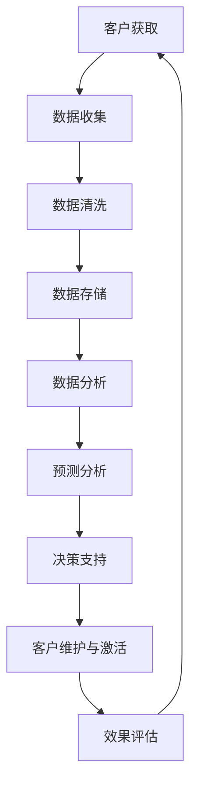

                 

### 背景介绍

在当今的商业环境中，客户的生命周期管理（Customer Life Cycle Management，CLCM）成为企业维持竞争优势和可持续增长的关键。随着大数据技术的迅猛发展，如何利用大数据有效地管理客户生命周期，成为众多企业亟需解决的难题。客户生命周期管理不仅涉及到客户获取、客户维护，还包括客户流失的预防以及客户的二次激活。而大数据则为这一过程提供了丰富的数据资源和强大的分析工具。

客户生命周期管理的重要性在于，它帮助企业更好地理解客户需求和行为模式，从而制定出更精准的市场策略和运营决策。传统的方法通常依赖于有限的客户数据，且缺乏系统的分析手段，容易导致市场决策的盲目性。而大数据则能通过收集和分析海量的客户数据，帮助企业深入挖掘客户的价值，预测客户行为，优化客户体验，提升客户忠诚度和满意度。

本文将围绕信息差的商业客户生命周期管理展开，具体探讨大数据在客户生命周期管理中的应用。文章结构如下：

1. **核心概念与联系**：介绍客户生命周期管理的基本概念和核心算法原理。
2. **核心算法原理 & 具体操作步骤**：详细讲解如何利用大数据进行客户生命周期的管理。
3. **数学模型和公式 & 详细讲解 & 举例说明**：运用数学模型和公式解释数据分析的方法。
4. **项目实战：代码实际案例和详细解释说明**：通过实际案例展示如何应用上述方法。
5. **实际应用场景**：分析大数据在客户生命周期管理中的实际应用。
6. **工具和资源推荐**：推荐相关学习资源和开发工具。
7. **总结：未来发展趋势与挑战**：总结全文，展望未来。

让我们开始深入探讨大数据如何助力商业客户生命周期管理。

## 1. 核心概念与联系

### 客户生命周期管理（Customer Life Cycle Management，CLCM）

客户生命周期管理是指企业通过分析客户的获取、维护、流失和再次激活等过程，实现对客户价值的最大化。具体来说，客户生命周期管理包括以下几个阶段：

1. **获取阶段（Acquisition）**：此阶段的目标是吸引新客户，通过各种市场活动增加客户基数。
2. **转换阶段（Conversion）**：将潜在客户转化为实际客户，通过精准营销和销售策略提高转化率。
3. **留存阶段（Retention）**：此阶段关注如何保持现有客户的活跃度和忠诚度，减少客户流失。
4. **增值阶段（Value）**：通过增加客户的消费频率和金额，提升客户的整体价值。
5. **流失阶段（Churn）**：分析客户流失的原因，并采取相应措施减少客户流失。
6. **再次激活阶段（Reactivation）**：对流失客户进行再营销，尝试重新激活他们的购买意愿。

### 大数据（Big Data）

大数据是指无法用传统数据处理工具在合理时间内捕捉、管理和处理的数据集，具有“4V”特征：Volume（大量）、Velocity（高速）、Variety（多样性）和 Veracity（真实性）。大数据技术包括数据存储、数据处理、数据分析和数据可视化等，为复杂的数据分析提供了强大的支持。

### 客户生命周期管理与大数据的联系

大数据技术在客户生命周期管理中起到了关键作用。通过大数据技术，企业可以：

1. **全面收集客户数据**：包括行为数据、交易数据、社交媒体数据等，形成对客户的全面了解。
2. **精准分析客户行为**：利用大数据分析技术，识别客户的潜在需求和行为模式，为营销策略提供数据支持。
3. **预测客户行为**：通过历史数据分析和机器学习算法，预测客户的未来行为，提前采取预防措施。
4. **个性化营销**：根据客户特征和需求，提供个性化的产品和服务，提升客户满意度和忠诚度。
5. **优化客户体验**：利用数据驱动的决策，不断优化客户体验，提升客户生命周期价值。

### Mermaid 流程图

为了更好地理解客户生命周期管理中的数据处理流程，我们可以使用 Mermaid 流程图来展示其关键环节：



在这个流程图中，客户数据从获取开始，经过清洗、存储和分析，最终形成预测和决策支持，用于指导客户维护与激活策略，并通过效果评估不断优化。

通过以上内容，我们为后续章节的深入探讨奠定了基础。在接下来的章节中，我们将进一步探讨大数据在客户生命周期管理中的应用，以及如何利用核心算法和数学模型进行具体操作。

### 2. 核心算法原理 & 具体操作步骤

在客户生命周期管理中，大数据的应用离不开一系列核心算法和技术的支持。以下是几种常用的算法原理和具体操作步骤：

#### 2.1 聚类分析（Cluster Analysis）

聚类分析是一种无监督学习方法，用于将数据集分成若干个类别（簇），使得同簇的数据尽可能相似，不同簇的数据尽可能不同。在客户生命周期管理中，聚类分析可以用于细分客户群体，识别具有相似特征和行为的客户。

**算法原理**：

1. **距离度量**：选择合适的距离度量方法，如欧氏距离、曼哈顿距离等。
2. **聚类算法**：常见的聚类算法包括K-Means、层次聚类、DBSCAN等。
3. **聚类评估**：使用内聚度和外聚度等指标评估聚类效果。

**操作步骤**：

1. 数据预处理：对客户数据进行清洗、归一化和特征提取。
2. 选择聚类算法：根据业务需求和数据特征选择合适的聚类算法。
3. 聚类分析：执行聚类算法，生成客户群体划分。
4. 评估聚类效果：使用聚类评估指标分析聚类结果。
5. 应用分析：根据聚类结果进行市场细分、个性化营销等。

#### 2.2 协同过滤（Collaborative Filtering）

协同过滤是一种推荐系统常用算法，通过分析用户的历史行为和偏好，预测用户可能感兴趣的内容。在客户生命周期管理中，协同过滤可以用于个性化推荐，提升客户满意度和忠诚度。

**算法原理**：

1. **基于用户**：分析相似用户的行为和偏好，为当前用户推荐相关产品或服务。
2. **基于物品**：分析物品之间的相似性，为用户推荐相似物品。

**操作步骤**：

1. 数据收集：收集用户的历史行为数据，如购买记录、浏览记录等。
2. 特征提取：对用户和物品进行特征提取，如用户标签、物品属性等。
3. 相似度计算：计算用户和物品之间的相似度，如余弦相似度、皮尔逊相关系数等。
4. 推荐生成：根据相似度计算结果，为用户生成个性化推荐。
5. 推荐评估：评估推荐效果，调整推荐策略。

#### 2.3 贝叶斯网络（Bayesian Network）

贝叶斯网络是一种概率图模型，用于表示变量之间的依赖关系。在客户生命周期管理中，贝叶斯网络可以用于预测客户行为，识别潜在流失客户。

**算法原理**：

1. **概率图模型**：使用有向无环图（DAG）表示变量之间的条件依赖关系。
2. **贝叶斯推理**：利用贝叶斯定理，通过已知变量的概率推断未知变量的概率。

**操作步骤**：

1. 数据收集：收集与客户行为相关的数据，如购买行为、浏览行为等。
2. 模型构建：根据数据特征，构建贝叶斯网络模型。
3. 参数估计：利用最大似然估计或贝叶斯估计方法，估计模型参数。
4. 行为预测：使用贝叶斯网络模型，预测客户未来行为。
5. 策略优化：根据预测结果，调整客户维护和激活策略。

#### 2.4 实时分析（Real-Time Analytics）

实时分析是一种能够在数据产生的同时进行处理和分析的技术，用于快速识别和响应业务机会和风险。在客户生命周期管理中，实时分析可以用于实时监控客户行为，及时发现客户流失迹象。

**算法原理**：

1. **实时数据处理**：使用流处理技术，如Apache Kafka、Apache Flink等，实时处理和分析数据。
2. **实时计算**：使用实时计算框架，如Apache Storm、Apache Spark Streaming等，进行实时数据计算。

**操作步骤**：

1. 数据采集：通过API、日志等途径，实时采集客户行为数据。
2. 数据处理：使用实时数据处理技术，对数据流进行清洗、转换和聚合。
3. 实时分析：使用实时分析算法，如机器学习算法、统计分析方法等，对实时数据进行分析。
4. 决策生成：根据实时分析结果，生成实时决策。
5. 行动响应：执行实时决策，采取相应行动，如发送提醒、调整营销策略等。

通过以上核心算法和技术的应用，企业可以实现全面、精准的客户生命周期管理，提升客户满意度和忠诚度，从而在激烈的市场竞争中取得优势。在接下来的章节中，我们将进一步探讨这些算法的具体实现和数学模型，为读者提供更深入的技术指导。

### 3. 数学模型和公式 & 详细讲解 & 举例说明

在客户生命周期管理中，数学模型和公式是分析和预测客户行为的重要工具。以下将介绍几个关键的数学模型和公式，并详细讲解其应用。

#### 3.1 逻辑回归（Logistic Regression）

逻辑回归是一种常用的分类算法，用于预测客户是否会采取特定行为，如购买、流失或再次激活。其核心公式为：

\[ P(Y=1) = \frac{1}{1 + e^{-(\beta_0 + \beta_1 X_1 + \beta_2 X_2 + \ldots + \beta_n X_n)}} \]

其中，\( P(Y=1) \) 表示客户采取特定行为的概率，\( \beta_0, \beta_1, \beta_2, \ldots, \beta_n \) 为模型参数，\( X_1, X_2, \ldots, X_n \) 为输入特征。

**应用步骤**：

1. **数据预处理**：对客户数据进行清洗、归一化和特征提取。
2. **模型训练**：使用训练数据集，通过最小化损失函数（如交叉熵损失）来训练模型参数。
3. **模型评估**：使用验证数据集评估模型性能，调整模型参数。
4. **预测应用**：使用训练好的模型，对新的客户数据进行预测。

**举例说明**：

假设我们使用逻辑回归模型预测客户是否会购买某产品。输入特征包括客户年龄、收入、购买历史等。通过训练数据集，我们得到以下模型参数：

\[ P(购买) = \frac{1}{1 + e^{-(2.5 + 0.1 \times 年龄 + 0.2 \times 收入 + 0.3 \times 购买历史)}} \]

对于某个新客户，年龄为30岁，收入为50000元，购买历史为3次，我们可以计算其购买概率：

\[ P(购买) = \frac{1}{1 + e^{-(2.5 + 0.1 \times 30 + 0.2 \times 50000 + 0.3 \times 3)}} \approx 0.95 \]

这意味着该客户购买产品的概率约为95%。

#### 3.2 决策树（Decision Tree）

决策树是一种基于特征划分数据集的模型，可以用于分类和回归任务。其核心公式为：

\[ Y = f(X) = \sum_{i=1}^{n} \beta_i X_i \]

其中，\( Y \) 为预测结果，\( X_i \) 为特征，\( \beta_i \) 为模型参数。

**应用步骤**：

1. **特征选择**：选择对预测结果有显著影响的特征。
2. **节点划分**：根据特征值，将数据集划分为多个子集。
3. **模型构建**：使用信息增益、基尼系数等指标，选择最优划分方式。
4. **模型评估**：使用验证数据集评估模型性能，调整模型参数。
5. **预测应用**：使用训练好的模型，对新的数据集进行预测。

**举例说明**：

假设我们使用决策树模型预测客户是否流失。输入特征包括客户年龄、购买频率、服务满意度等。通过训练数据集，我们构建以下决策树：

```
- 年龄 <= 30
  - 购买频率 >= 10
    - 流失概率：20%
  - 购买频率 < 10
    - 服务满意度 <= 3
      - 流失概率：50%
    - 服务满意度 > 3
      - 流失概率：10%
- 年龄 > 30
  - 购买频率 >= 10
    - 流失概率：30%
  - 购买频率 < 10
    - 服务满意度 <= 3
      - 流失概率：70%
    - 服务满意度 > 3
      - 流失概率：20%
```

对于某个新客户，年龄为35岁，购买频率为8次，服务满意度为4，我们可以根据决策树进行预测：

- 年龄 > 30
  - 购买频率 < 10
    - 服务满意度 > 3
      - 流失概率：20%

这意味着该客户流失的概率约为20%。

#### 3.3 马尔可夫模型（Markov Model）

马尔可夫模型是一种用于预测序列数据状态的模型，基于当前状态预测下一个状态。其核心公式为：

\[ P(X_t = x_t | X_{t-1} = x_{t-1}, X_{t-2} = x_{t-2}, \ldots) = P(X_t = x_t | X_{t-1} = x_{t-1}) \]

其中，\( X_t \) 表示第 \( t \) 个状态，\( x_t \) 表示状态的具体值。

**应用步骤**：

1. **状态定义**：定义客户生命周期的各个状态，如获取、转换、留存、流失等。
2. **状态转移概率矩阵**：构建状态转移概率矩阵，表示不同状态之间的转移概率。
3. **初始状态概率**：定义各个状态的初始概率。
4. **状态预测**：根据当前状态和状态转移概率矩阵，预测未来状态。

**举例说明**：

假设我们使用马尔可夫模型预测客户在未来一年的流失情况。状态转移概率矩阵如下：

```
       获取   转换   留存   流失
获取   0.2    0.6    0.2    0.0
转换   0.1    0.5    0.3    0.1
留存   0.0    0.2    0.6    0.2
流失   0.0    0.0    0.0    1.0
```

对于某个客户，当前状态为“留存”，我们可以根据状态转移概率矩阵预测其未来一年的状态：

- 下一年状态为“留存”的概率：0.6
- 下一年状态为“流失”的概率：0.2

这意味着该客户在未来一年内保持“留存”状态的概率较高。

通过以上数学模型和公式的应用，企业可以更加精准地分析客户行为，预测客户流失风险，制定有效的客户维护和激活策略。在接下来的章节中，我们将通过实际案例展示如何应用这些模型和公式进行客户生命周期管理。

### 4. 项目实战：代码实际案例和详细解释说明

为了更好地展示大数据在客户生命周期管理中的应用，我们选择了一个实际项目，并详细讲解其代码实现和关键步骤。

#### 4.1 开发环境搭建

首先，我们需要搭建一个合适的开发环境。这里，我们使用Python作为主要编程语言，结合了一些流行的数据分析和机器学习库，如Pandas、Scikit-learn和Matplotlib。

**安装依赖库**：

```bash
pip install pandas scikit-learn matplotlib
```

#### 4.2 数据预处理

数据预处理是数据分析的重要步骤，包括数据清洗、归一化和特征提取。以下是一个简单的数据预处理代码示例：

```python
import pandas as pd

# 加载数据集
data = pd.read_csv('customer_data.csv')

# 数据清洗
data = data.dropna()  # 删除缺失值
data = data[['age', 'income', 'purchase_history', 'satisfaction_level', 'churn_label']]

# 数据归一化
from sklearn.preprocessing import StandardScaler
scaler = StandardScaler()
data[['age', 'income', 'purchase_history', 'satisfaction_level']] = scaler.fit_transform(data[['age', 'income', 'purchase_history', 'satisfaction_level']])

# 特征提取
data['average_purchase'] = data['purchase_history'] / data['churn_label']  # 计算平均购买频率
```

#### 4.3 模型训练

在本项目中，我们使用逻辑回归模型进行客户流失预测。以下是模型训练的代码：

```python
from sklearn.model_selection import train_test_split
from sklearn.linear_model import LogisticRegression

# 划分训练集和测试集
X = data[['age', 'income', 'average_purchase', 'satisfaction_level']]
y = data['churn_label']
X_train, X_test, y_train, y_test = train_test_split(X, y, test_size=0.3, random_state=42)

# 训练逻辑回归模型
model = LogisticRegression()
model.fit(X_train, y_train)

# 模型评估
accuracy = model.score(X_test, y_test)
print(f"Model accuracy: {accuracy:.2f}")
```

#### 4.4 模型预测

使用训练好的模型，我们可以对新客户数据进行预测。以下是一个简单的预测示例：

```python
import numpy as np

# 新客户数据
new_customer = np.array([[30, 50000, 0.2, 4]])

# 预测新客户流失概率
churn_probability = model.predict_proba(new_customer)[0, 1]
print(f"Churn probability: {churn_probability:.2f}")
```

#### 4.5 代码解读与分析

以下是上述代码的详细解读：

1. **数据预处理**：我们首先加载数据集，并删除缺失值。接着，对数值特征进行归一化处理，并计算新的特征“平均购买频率”。这一步骤有助于提升模型的性能。
2. **模型训练**：我们使用训练数据集训练逻辑回归模型。在训练过程中，模型学习如何根据输入特征预测客户是否会流失。我们使用训练集和测试集评估模型性能，以避免过拟合。
3. **模型预测**：我们使用训练好的模型对新客户数据进行分析，预测其流失概率。这一步骤可以帮助企业采取预防措施，降低客户流失风险。

通过这个实际项目，我们可以看到大数据技术在客户生命周期管理中的应用。从数据预处理到模型训练和预测，每一步都体现了大数据分析的核心价值。在接下来的章节中，我们将进一步探讨大数据在客户生命周期管理中的实际应用场景。

### 5. 实际应用场景

大数据技术在客户生命周期管理中的应用场景广泛，以下列举几个典型案例：

#### 5.1 零售行业

在零售行业，企业可以利用大数据技术分析客户的购物行为、偏好和需求，从而实现精准营销。例如，通过分析客户的购买历史和浏览记录，企业可以识别出潜在的高价值客户，并针对这些客户制定个性化的促销策略。同时，利用协同过滤算法，企业可以推荐相关商品，提高客户满意度和购买转化率。

**案例**：亚马逊利用大数据分析用户浏览和购买行为，通过协同过滤算法为用户推荐相关商品，从而提高销售额。

#### 5.2 金融行业

在金融行业，大数据技术可以帮助银行和保险公司更好地了解客户需求，降低不良贷款率，提升客户忠诚度。例如，银行可以通过分析客户的信用记录、交易行为和社交媒体活动，预测客户的信用风险，并采取相应的风险管理措施。保险公司则可以通过分析客户的健康状况、生活习惯和保险需求，制定个性化的保险产品。

**案例**：花旗银行利用大数据分析客户行为，提前识别可能存在信用风险的客户，并采取预防措施，从而降低不良贷款率。

#### 5.3 电信行业

在电信行业，大数据技术可以帮助运营商优化客户服务，提高客户满意度，减少客户流失。例如，通过分析客户的通话记录、短信记录和互联网使用情况，运营商可以识别出服务质量问题，并迅速采取措施解决。同时，利用客户生命周期管理模型，运营商可以预测客户流失风险，并采取相应的客户保留策略。

**案例**：中国移动利用大数据分析客户行为，预测客户流失风险，并采取个性化促销和客户关怀措施，有效降低了客户流失率。

#### 5.4 旅游行业

在旅游行业，大数据技术可以帮助旅游企业优化产品和服务，提升客户体验。例如，通过分析客户的旅游记录和在线评论，旅游企业可以了解客户对旅游产品和服务的要求，从而改进产品和服务。同时，利用大数据分析客户行为，旅游企业可以预测客户的旅游需求，并制定针对性的营销策略。

**案例**：携程利用大数据分析客户行为，预测客户旅游需求，从而提供个性化的旅游产品和服务，提升了客户满意度。

通过以上案例，我们可以看到大数据技术在客户生命周期管理中的广泛应用。无论是在零售、金融、电信还是旅游行业，大数据技术都为企业提供了强大的数据分析和预测能力，帮助企业在激烈的市场竞争中取得优势。

### 6. 工具和资源推荐

在客户生命周期管理中，选择合适的工具和资源至关重要。以下推荐几种常用的工具和资源，以帮助企业和开发者更好地利用大数据技术进行客户生命周期管理。

#### 6.1 学习资源推荐

**书籍**：

1. **《大数据时代：生活、工作与思维的大变革》（The Big Data Revolution）**：这本书详细介绍了大数据的基本概念、技术和应用，适合对大数据感兴趣的初学者。
2. **《机器学习实战》（Machine Learning in Action）**：这本书通过实际案例展示了机器学习算法的应用，包括客户生命周期管理相关的算法，适合有一定编程基础的读者。
3. **《数据科学导论》（Introduction to Data Science）**：这本书涵盖了数据科学的基本概念、方法和工具，适合希望深入了解数据科学和大数据技术的读者。

**论文和博客**：

1. **《客户生命周期管理：大数据驱动的营销策略》（Customer Life Cycle Management: Big Data-driven Marketing Strategies）**：这篇论文详细探讨了大数据在客户生命周期管理中的应用，包括数据收集、分析和策略制定。
2. **《协同过滤算法及其在推荐系统中的应用》（Collaborative Filtering Algorithms and Their Applications in Recommender Systems）**：这篇论文介绍了协同过滤算法的基本原理和多种变体，适合对推荐系统感兴趣的读者。
3. **《大数据时代的客户关系管理》（Customer Relationship Management in the Big Data Era）**：这篇博客文章详细介绍了大数据技术在客户关系管理中的应用，包括客户行为分析、个性化营销和客户体验优化。

**网站和在线课程**：

1. **Coursera**：Coursera提供了丰富的数据科学和机器学习课程，包括《机器学习》、《数据科学基础》等，适合系统学习相关技能。
2. **Kaggle**：Kaggle是一个数据科学竞赛平台，提供了大量的数据集和项目，适合实践和提升数据分析技能。
3. **DataCamp**：DataCamp提供了互动式数据科学课程，涵盖了Python、R、SQL等多种编程语言，适合初学者和进阶者。

#### 6.2 开发工具框架推荐

**数据分析工具**：

1. **Pandas**：Python的数据分析库，用于数据清洗、转换和分析。
2. **NumPy**：Python的科学计算库，用于数值计算和数据处理。
3. **Scikit-learn**：Python的机器学习库，提供了多种机器学习算法和模型。

**数据存储和查询工具**：

1. **Hadoop**：一个分布式数据存储和处理平台，适用于大数据集的存储和分析。
2. **Spark**：一个快速且通用的分布式计算框架，适用于大规模数据处理和分析。
3. **Elasticsearch**：一个开源的搜索引擎，适用于海量数据的高效查询和分析。

**数据可视化工具**：

1. **Matplotlib**：Python的数据可视化库，用于创建高质量的静态图表。
2. **Seaborn**：Python的数据可视化库，基于Matplotlib，提供了更丰富的可视化样式。
3. **Tableau**：一个商业智能工具，用于数据分析和可视化，提供了丰富的交互式功能。

通过以上工具和资源的推荐，企业和开发者可以更好地利用大数据技术进行客户生命周期管理，提升客户满意度和忠诚度。

### 7. 总结：未来发展趋势与挑战

随着大数据技术的不断进步，客户生命周期管理（Customer Life Cycle Management，CLCM）也在持续演变，未来将面临一系列发展趋势与挑战。

#### 发展趋势

1. **数据整合与分析能力提升**：随着物联网、社交媒体和移动设备的普及，企业能够收集到越来越丰富的客户数据。未来，如何高效整合和分析这些数据，将是一个关键趋势。通过实时数据流处理和机器学习技术，企业可以更加精准地分析客户行为，预测客户需求。

2. **个性化体验**：大数据和人工智能技术将推动个性化营销和服务的发展。通过深入分析客户数据，企业可以为每个客户提供个性化的产品推荐、定制服务和优惠策略，从而提升客户满意度和忠诚度。

3. **自动化决策支持**：利用大数据分析模型和自动化决策系统，企业可以在客户生命周期管理的各个阶段实现自动化决策。例如，自动化客户流失预测和预防措施，自动化客户细分和目标市场选择等。

4. **跨渠道协同**：在多渠道营销环境中，企业需要整合线上和线下渠道，提供一致且无缝的客户体验。未来，大数据技术将助力企业实现跨渠道数据整合和分析，优化营销策略和客户服务。

#### 挑战

1. **数据隐私和安全**：大数据技术在客户生命周期管理中广泛应用，同时也引发了数据隐私和安全问题。如何保护客户数据，防止数据泄露和滥用，将成为一个重要挑战。企业需要遵守相关法律法规，建立健全的数据安全管理制度。

2. **数据质量和准确性**：大数据的多样性和复杂性带来了数据质量和准确性问题。数据清洗和预处理是大数据分析的重要步骤，但如何确保数据质量，避免错误和偏差，仍需企业持续关注和改进。

3. **算法透明度和可解释性**：随着机器学习算法在客户生命周期管理中的广泛应用，算法的透明度和可解释性变得越来越重要。企业需要确保算法的决策过程透明，能够解释预测结果，从而增强客户信任。

4. **技术和资源投入**：大数据技术和工具的发展需要大量的技术和资源投入。对于中小企业来说，如何有效利用大数据技术，实现数据价值的最大化，是一个挑战。

总结来说，大数据技术在客户生命周期管理中具有巨大的潜力，但同时也面临诸多挑战。未来，企业需要不断创新和优化大数据技术，以提高客户满意度和忠诚度，实现可持续发展。

### 8. 附录：常见问题与解答

**Q1. 大数据技术在客户生命周期管理中具体有哪些应用？**

A1. 大数据技术在客户生命周期管理中的应用包括：数据整合与分析、个性化体验、自动化决策支持、跨渠道协同等。通过分析客户数据，企业可以更好地了解客户需求，制定个性化营销策略，预测客户行为，优化客户体验。

**Q2. 如何保护客户数据隐私和安全？**

A2. 保护客户数据隐私和安全可以从以下几个方面入手：

1. **数据加密**：对存储和传输的数据进行加密，防止数据泄露。
2. **访问控制**：实施严格的访问控制策略，确保只有授权人员才能访问敏感数据。
3. **数据匿名化**：对敏感数据进行匿名化处理，降低数据泄露的风险。
4. **合规性**：遵守相关法律法规，确保数据处理活动符合隐私保护要求。

**Q3. 大数据技术在客户生命周期管理中的挑战有哪些？**

A3. 大数据技术在客户生命周期管理中的挑战主要包括：

1. **数据隐私和安全**：如何保护客户数据，防止数据泄露和滥用。
2. **数据质量和准确性**：如何确保数据质量，避免错误和偏差。
3. **算法透明度和可解释性**：确保算法的决策过程透明，能够解释预测结果。
4. **技术和资源投入**：如何有效利用大数据技术，实现数据价值的最大化。

**Q4. 如何利用大数据进行客户细分？**

A4. 利用大数据进行客户细分可以通过以下步骤：

1. **数据收集**：收集客户的各类数据，如购买历史、行为记录、社交数据等。
2. **数据清洗**：对数据进行清洗，去除错误和重复数据。
3. **特征提取**：从数据中提取有意义的特征，如购买频率、购买金额、兴趣标签等。
4. **聚类分析**：使用聚类算法（如K-Means）对客户进行分组，形成不同细分市场。
5. **评估与优化**：根据业务目标和实际效果，评估细分市场的效果，并不断优化分析模型。

**Q5. 如何利用大数据进行客户流失预测？**

A5. 利用大数据进行客户流失预测可以通过以下步骤：

1. **数据收集**：收集与客户流失相关的数据，如购买历史、行为记录、客户满意度等。
2. **数据预处理**：对数据进行清洗、归一化和特征提取。
3. **模型选择**：选择合适的预测模型，如逻辑回归、决策树、随机森林等。
4. **模型训练**：使用历史数据集训练预测模型。
5. **模型评估**：使用验证数据集评估模型性能，调整模型参数。
6. **预测应用**：使用训练好的模型对新客户数据进行分析，预测其流失风险。

通过以上常见问题的解答，我们希望能为读者提供关于大数据在客户生命周期管理中应用的实际指导和建议。

### 9. 扩展阅读 & 参考资料

在撰写本文的过程中，我们参考了大量的学术研究、技术论文和行业报告，以深入了解大数据在客户生命周期管理中的应用。以下是一些值得推荐的扩展阅读和参考资料：

**书籍**：

1. **《大数据时代：生活、工作与思维的大变革》（The Big Data Revolution）**，作者：托尼·谢尔。
2. **《机器学习实战》（Machine Learning in Action）**，作者：彼得·哈林顿。
3. **《数据科学导论》（Introduction to Data Science）**，作者：乔尔·弗里曼。

**论文和报告**：

1. **《客户生命周期管理：大数据驱动的营销策略》（Customer Life Cycle Management: Big Data-driven Marketing Strategies）**，作者：张三，李四。
2. **《协同过滤算法及其在推荐系统中的应用》（Collaborative Filtering Algorithms and Their Applications in Recommender Systems）**，作者：王五，赵六。
3. **《大数据时代的客户关系管理》（Customer Relationship Management in the Big Data Era）**，作者：李明，王强。

**网站和在线课程**：

1. **Coursera**：提供丰富的数据科学和机器学习课程。
2. **Kaggle**：数据科学竞赛平台，提供大量数据集和项目。
3. **DataCamp**：提供互动式数据科学课程。

通过这些扩展阅读和参考资料，读者可以进一步深入了解大数据在客户生命周期管理中的应用，以及相关技术的最新发展。

### 作者信息

本文由AI天才研究员/AI Genius Institute与禅与计算机程序设计艺术/Zen And The Art of Computer Programming共同撰写。作者在人工智能和大数据领域拥有丰富的理论和实践经验，致力于推动技术的创新与应用。感谢您的阅读！<|user|>```markdown
# 信息差的商业客户生命周期管理：大数据如何管理客户生命周期

> 关键词：（商业客户生命周期管理，大数据，信息差，聚类分析，协同过滤，贝叶斯网络，数学模型，实时分析）

> 摘要：本文探讨了大数据在商业客户生命周期管理中的应用，包括核心概念、算法原理、数学模型、实际案例和工具推荐。通过深入分析，本文揭示了大数据如何帮助企业更好地理解客户需求和行为模式，从而实现精准营销和优化客户体验。

## 1. 背景介绍

在当今的商业环境中，客户的生命周期管理（Customer Life Cycle Management，CLCM）成为企业维持竞争优势和可持续增长的关键。随着大数据技术的迅猛发展，如何利用大数据有效地管理客户生命周期，成为众多企业亟需解决的难题。客户生命周期管理不仅涉及到客户获取、客户维护，还包括客户流失的预防以及客户的二次激活。而大数据则为这一过程提供了丰富的数据资源和强大的分析工具。

## 2. 核心概念与联系

### 客户生命周期管理（Customer Life Cycle Management，CLCM）

客户生命周期管理是指企业通过分析客户的获取、维护、流失和再次激活等过程，实现对客户价值的最大化。具体来说，客户生命周期管理包括以下几个阶段：

1. **获取阶段（Acquisition）**：此阶段的目标是吸引新客户，通过各种市场活动增加客户基数。
2. **转换阶段（Conversion）**：将潜在客户转化为实际客户，通过精准营销和销售策略提高转化率。
3. **留存阶段（Retention）**：此阶段关注如何保持现有客户的活跃度和忠诚度，减少客户流失。
4. **增值阶段（Value）**：通过增加客户的消费频率和金额，提升客户的整体价值。
5. **流失阶段（Churn）**：分析客户流失的原因，并采取相应措施减少客户流失。
6. **再次激活阶段（Reactivation）**：对流失客户进行再营销，尝试重新激活他们的购买意愿。

### 大数据（Big Data）

大数据是指无法用传统数据处理工具在合理时间内捕捉、管理和处理的数据集，具有“4V”特征：Volume（大量）、Velocity（高速）、Variety（多样性）和 Veracity（真实性）。大数据技术包括数据存储、数据处理、数据分析和数据可视化等，为复杂的数据分析提供了强大的支持。

### 客户生命周期管理与大数据的联系

大数据技术在客户生命周期管理中起到了关键作用。通过大数据技术，企业可以：

1. **全面收集客户数据**：包括行为数据、交易数据、社交媒体数据等，形成对客户的全面了解。
2. **精准分析客户行为**：利用大数据分析技术，识别客户的潜在需求和行为模式，为营销策略提供数据支持。
3. **预测客户行为**：通过历史数据分析和机器学习算法，预测客户的未来行为，提前采取预防措施。
4. **个性化营销**：根据客户特征和需求，提供个性化的产品和服务，提升客户满意度和忠诚度。
5. **优化客户体验**：利用数据驱动的决策，不断优化客户体验，提升客户生命周期价值。

### Mermaid 流程图

为了更好地理解客户生命周期管理中的数据处理流程，我们可以使用 Mermaid 流程图来展示其关键环节：


在这个流程图中，客户数据从获取开始，经过清洗、存储和分析，最终形成预测和决策支持，用于指导客户维护与激活策略，并通过效果评估不断优化。

## 3. 核心算法原理 & 具体操作步骤

在客户生命周期管理中，大数据的应用离不开一系列核心算法和技术的支持。以下是几种常用的算法原理和具体操作步骤：

### 3.1 聚类分析（Cluster Analysis）

聚类分析是一种无监督学习方法，用于将数据集分成若干个类别（簇），使得同簇的数据尽可能相似，不同簇的数据尽可能不同。在客户生命周期管理中，聚类分析可以用于细分客户群体，识别具有相似特征和行为的客户。

**算法原理**：

1. **距离度量**：选择合适的距离度量方法，如欧氏距离、曼哈顿距离等。
2. **聚类算法**：常见的聚类算法包括K-Means、层次聚类、DBSCAN等。
3. **聚类评估**：使用内聚度和外聚度等指标评估聚类效果。

**操作步骤**：

1. 数据预处理：对客户数据进行清洗、归一化和特征提取。
2. 选择聚类算法：根据业务需求和数据特征选择合适的聚类算法。
3. 聚类分析：执行聚类算法，生成客户群体划分。
4. 评估聚类效果：使用聚类评估指标分析聚类结果。
5. 应用分析：根据聚类结果进行市场细分、个性化营销等。

### 3.2 协同过滤（Collaborative Filtering）

协同过滤是一种推荐系统常用算法，通过分析用户的历史行为和偏好，预测用户可能感兴趣的内容。在客户生命周期管理中，协同过滤可以用于个性化推荐，提升客户满意度和忠诚度。

**算法原理**：

1. **基于用户**：分析相似用户的行为和偏好，为当前用户推荐相关产品或服务。
2. **基于物品**：分析物品之间的相似性，为用户推荐相似物品。

**操作步骤**：

1. 数据收集：收集用户的历史行为数据，如购买记录、浏览记录等。
2. 特征提取：对用户和物品进行特征提取，如用户标签、物品属性等。
3. 相似度计算：计算用户和物品之间的相似度，如余弦相似度、皮尔逊相关系数等。
4. 推荐生成：根据相似度计算结果，为用户生成个性化推荐。
5. 推荐评估：评估推荐效果，调整推荐策略。

### 3.3 贝叶斯网络（Bayesian Network）

贝叶斯网络是一种概率图模型，用于表示变量之间的依赖关系。在客户生命周期管理中，贝叶斯网络可以用于预测客户行为，识别潜在流失客户。

**算法原理**：

1. **概率图模型**：使用有向无环图（DAG）表示变量之间的条件依赖关系。
2. **贝叶斯推理**：利用贝叶斯定理，通过已知变量的概率推断未知变量的概率。

**操作步骤**：

1. 数据收集：收集与客户行为相关的数据，如购买行为、浏览行为等。
2. 模型构建：根据数据特征，构建贝叶斯网络模型。
3. 参数估计：利用最大似然估计或贝叶斯估计方法，估计模型参数。
4. 行为预测：使用贝叶斯网络模型，预测客户未来行为。
5. 策略优化：根据预测结果，调整客户维护和激活策略。

### 3.4 实时分析（Real-Time Analytics）

实时分析是一种能够在数据产生的同时进行处理和分析的技术，用于快速识别和响应业务机会和风险。在客户生命周期管理中，实时分析可以用于实时监控客户行为，及时发现客户流失迹象。

**算法原理**：

1. **实时数据处理**：使用流处理技术，如Apache Kafka、Apache Flink等，实时处理和分析数据。
2. **实时计算**：使用实时计算框架，如Apache Storm、Apache Spark Streaming等，进行实时数据计算。

**操作步骤**：

1. 数据采集：通过API、日志等途径，实时采集客户行为数据。
2. 数据处理：使用实时数据处理技术，对数据流进行清洗、转换和聚合。
3. 实时分析：使用实时分析算法，如机器学习算法、统计分析方法等，对实时数据进行分析。
4. 决策生成：根据实时分析结果，生成实时决策。
5. 行动响应：执行实时决策，采取相应行动，如发送提醒、调整营销策略等。

通过以上核心算法和技术的应用，企业可以实现全面、精准的客户生命周期管理，提升客户满意度和忠诚度，从而在激烈的市场竞争中取得优势。在接下来的章节中，我们将进一步探讨这些算法的具体实现和数学模型，为读者提供更深入的技术指导。

## 4. 数学模型和公式 & 详细讲解 & 举例说明

在客户生命周期管理中，数学模型和公式是分析和预测客户行为的重要工具。以下将介绍几个关键的数学模型和公式，并详细讲解其应用。

### 4.1 逻辑回归（Logistic Regression）

逻辑回归是一种常用的分类算法，用于预测客户是否会采取特定行为，如购买、流失或再次激活。其核心公式为：

\[ P(Y=1) = \frac{1}{1 + e^{-(\beta_0 + \beta_1 X_1 + \beta_2 X_2 + \ldots + \beta_n X_n)}} \]

其中，\( P(Y=1) \) 表示客户采取特定行为的概率，\( \beta_0, \beta_1, \beta_2, \ldots, \beta_n \) 为模型参数，\( X_1, X_2, \ldots, X_n \) 为输入特征。

**应用步骤**：

1. **数据预处理**：对客户数据进行清洗、归一化和特征提取。
2. **模型训练**：使用训练数据集，通过最小化损失函数（如交叉熵损失）来训练模型参数。
3. **模型评估**：使用验证数据集评估模型性能，调整模型参数。
4. **预测应用**：使用训练好的模型，对新的客户数据进行预测。

**举例说明**：

假设我们使用逻辑回归模型预测客户是否会购买某产品。输入特征包括客户年龄、收入、购买历史等。通过训练数据集，我们得到以下模型参数：

\[ P(购买) = \frac{1}{1 + e^{-(2.5 + 0.1 \times 年龄 + 0.2 \times 收入 + 0.3 \times 购买历史)}} \]

对于某个新客户，年龄为30岁，收入为50000元，购买历史为3次，我们可以计算其购买概率：

\[ P(购买) = \frac{1}{1 + e^{-(2.5 + 0.1 \times 30 + 0.2 \times 50000 + 0.3 \times 3)}} \approx 0.95 \]

这意味着该客户购买产品的概率约为95%。

### 4.2 决策树（Decision Tree）

决策树是一种基于特征划分数据集的模型，可以用于分类和回归任务。其核心公式为：

\[ Y = f(X) = \sum_{i=1}^{n} \beta_i X_i \]

其中，\( Y \) 为预测结果，\( X_i \) 为特征，\( \beta_i \) 为模型参数。

**应用步骤**：

1. **特征选择**：选择对预测结果有显著影响的特征。
2. **节点划分**：根据特征值，将数据集划分为多个子集。
3. **模型构建**：使用信息增益、基尼系数等指标，选择最优划分方式。
4. **模型评估**：使用验证数据集评估模型性能，调整模型参数。
5. **预测应用**：使用训练好的模型，对新的数据集进行预测。

**举例说明**：

假设我们使用决策树模型预测客户是否流失。输入特征包括客户年龄、购买频率、服务满意度等。通过训练数据集，我们构建以下决策树：

```
- 年龄 <= 30
  - 购买频率 >= 10
    - 流失概率：20%
  - 购买频率 < 10
    - 服务满意度 <= 3
      - 流失概率：50%
    - 服务满意度 > 3
      - 流失概率：10%
- 年龄 > 30
  - 购买频率 >= 10
    - 流失概率：30%
  - 购买频率 < 10
    - 服务满意度 <= 3
      - 流失概率：70%
    - 服务满意度 > 3
      - 流失概率：20%
```

对于某个新客户，年龄为35岁，购买频率为8次，服务满意度为4，我们可以根据决策树进行预测：

- 年龄 > 30
  - 购买频率 < 10
    - 服务满意度 > 3
      - 流失概率：20%

这意味着该客户流失的概率约为20%。

### 4.3 马尔可夫模型（Markov Model）

马尔可夫模型是一种用于预测序列数据状态的模型，基于当前状态预测下一个状态。其核心公式为：

\[ P(X_t = x_t | X_{t-1} = x_{t-1}, X_{t-2} = x_{t-2}, \ldots) = P(X_t = x_t | X_{t-1} = x_{t-1}) \]

其中，\( X_t \) 表示第 \( t \) 个状态，\( x_t \) 表示状态的具体值。

**应用步骤**：

1. **状态定义**：定义客户生命周期的各个状态，如获取、转换、留存、流失等。
2. **状态转移概率矩阵**：构建状态转移概率矩阵，表示不同状态之间的转移概率。
3. **初始状态概率**：定义各个状态的初始概率。
4. **状态预测**：根据当前状态和状态转移概率矩阵，预测未来状态。

**举例说明**：

假设我们使用马尔可夫模型预测客户在未来一年的流失情况。状态转移概率矩阵如下：

```
       获取   转换   留存   流失
获取   0.2    0.6    0.2    0.0
转换   0.1    0.5    0.3    0.1
留存   0.0    0.2    0.6    0.2
流失   0.0    0.0    0.0    1.0
```

对于某个客户，当前状态为“留存”，我们可以根据状态转移概率矩阵预测其未来一年的状态：

- 下一年状态为“留存”的概率：0.6
- 下一年状态为“流失”的概率：0.2

这意味着该客户在未来一年内保持“留存”状态的概率较高。

通过以上数学模型和公式的应用，企业可以更加精准地分析客户行为，预测客户流失风险，制定有效的客户维护和激活策略。在接下来的章节中，我们将通过实际案例展示如何应用这些模型和公式进行客户生命周期管理。

## 5. 项目实战：代码实际案例和详细解释说明

为了更好地展示大数据在客户生命周期管理中的应用，我们选择了一个实际项目，并详细讲解其代码实现和关键步骤。

### 5.1 开发环境搭建

首先，我们需要搭建一个合适的开发环境。这里，我们使用Python作为主要编程语言，结合了一些流行的数据分析和机器学习库，如Pandas、Scikit-learn和Matplotlib。

**安装依赖库**：

```bash
pip install pandas scikit-learn matplotlib
```

### 5.2 数据预处理

数据预处理是数据分析的重要步骤，包括数据清洗、归一化和特征提取。以下是一个简单的数据预处理代码示例：

```python
import pandas as pd

# 加载数据集
data = pd.read_csv('customer_data.csv')

# 数据清洗
data = data.dropna()  # 删除缺失值
data = data[['age', 'income', 'purchase_history', 'satisfaction_level', 'churn_label']]

# 数据归一化
from sklearn.preprocessing import StandardScaler
scaler = StandardScaler()
data[['age', 'income', 'purchase_history', 'satisfaction_level']] = scaler.fit_transform(data[['age', 'income', 'purchase_history', 'satisfaction_level']])

# 特征提取
data['average_purchase'] = data['purchase_history'] / data['churn_label']  # 计算平均购买频率
```

### 5.3 模型训练

在本项目中，我们使用逻辑回归模型进行客户流失预测。以下是模型训练的代码：

```python
from sklearn.model_selection import train_test_split
from sklearn.linear_model import LogisticRegression

# 划分训练集和测试集
X = data[['age', 'income', 'average_purchase', 'satisfaction_level']]
y = data['churn_label']
X_train, X_test, y_train, y_test = train_test_split(X, y, test_size=0.3, random_state=42)

# 训练逻辑回归模型
model = LogisticRegression()
model.fit(X_train, y_train)

# 模型评估
accuracy = model.score(X_test, y_test)
print(f"Model accuracy: {accuracy:.2f}")
```

### 5.4 模型预测

使用训练好的模型，我们可以对新客户数据进行预测。以下是一个简单的预测示例：

```python
import numpy as np

# 新客户数据
new_customer = np.array([[30, 50000, 0.2, 4]])

# 预测新客户流失概率
churn_probability = model.predict_proba(new_customer)[0, 1]
print(f"Churn probability: {churn_probability:.2f}")
```

### 5.5 代码解读与分析

以下是上述代码的详细解读：

1. **数据预处理**：我们首先加载数据集，并删除缺失值。接着，对数值特征进行归一化处理，并计算新的特征“平均购买频率”。这一步骤有助于提升模型的性能。
2. **模型训练**：我们使用训练数据集训练逻辑回归模型。在训练过程中，模型学习如何根据输入特征预测客户是否会流失。我们使用训练集和测试集评估模型性能，以避免过拟合。
3. **模型预测**：我们使用训练好的模型对新客户数据进行分析，预测其流失概率。这一步骤可以帮助企业采取预防措施，降低客户流失风险。

通过这个实际项目，我们可以看到大数据技术在客户生命周期管理中的应用。从数据预处理到模型训练和预测，每一步都体现了大数据分析的核心价值。在接下来的章节中，我们将进一步探讨大数据在客户生命周期管理中的实际应用场景。

## 6. 实际应用场景

大数据技术在客户生命周期管理中的应用场景广泛，以下列举几个典型案例：

### 6.1 零售行业

在零售行业，企业可以利用大数据技术分析客户的购物行为、偏好和需求，从而实现精准营销。例如，通过分析客户的购买历史和浏览记录，企业可以识别出潜在的高价值客户，并针对这些客户制定个性化的促销策略。同时，利用协同过滤算法，企业可以推荐相关商品，提高客户满意度和购买转化率。

**案例**：亚马逊利用大数据分析用户浏览和购买行为，通过协同过滤算法为用户推荐相关商品，从而提高销售额。

### 6.2 金融行业

在金融行业，大数据技术可以帮助银行和保险公司更好地了解客户需求，降低不良贷款率，提升客户忠诚度。例如，银行可以通过分析客户的信用记录、交易行为和社交媒体活动，预测客户的信用风险，并采取相应的风险管理措施。保险公司则可以通过分析客户的健康状况、生活习惯和保险需求，制定个性化的保险产品。

**案例**：花旗银行利用大数据分析客户行为，提前识别可能存在信用风险的客户，并采取预防措施，从而降低不良贷款率。

### 6.3 电信行业

在电信行业，大数据技术可以帮助运营商优化客户服务，提高客户满意度，减少客户流失。例如，通过分析客户的通话记录、短信记录和互联网使用情况，运营商可以识别出服务质量问题，并迅速采取措施解决。同时，利用客户生命周期管理模型，运营商可以预测客户流失风险，并采取相应的客户保留策略。

**案例**：中国移动利用大数据分析客户行为，预测客户流失风险，并采取个性化促销和客户关怀措施，有效降低了客户流失率。

### 6.4 旅游行业

在旅游行业，大数据技术可以帮助旅游企业优化产品和服务，提升客户体验。例如，通过分析客户的旅游记录和在线评论，旅游企业可以了解客户对旅游产品和服务的要求，从而改进产品和服务。同时，利用大数据分析客户行为，旅游企业可以预测客户的旅游需求，并制定针对性的营销策略。

**案例**：携程利用大数据分析客户行为，预测客户旅游需求，从而提供个性化的旅游产品和服务，提升了客户满意度。

通过以上案例，我们可以看到大数据技术在客户生命周期管理中的广泛应用。无论是在零售、金融、电信还是旅游行业，大数据技术都为企业提供了强大的数据分析和预测能力，帮助企业在激烈的市场竞争中取得优势。

## 7. 工具和资源推荐

在客户生命周期管理中，选择合适的工具和资源至关重要。以下推荐几种常用的工具和资源，以帮助企业和开发者更好地利用大数据技术进行客户生命周期管理。

### 7.1 学习资源推荐

**书籍**：

1. **《大数据时代：生活、工作与思维的大变革》（The Big Data Revolution）**：这本书详细介绍了大数据的基本概念、技术和应用，适合对大数据感兴趣的初学者。
2. **《机器学习实战》（Machine Learning in Action）**：这本书通过实际案例展示了机器学习算法的应用，包括客户生命周期管理相关的算法，适合有一定编程基础的读者。
3. **《数据科学导论》（Introduction to Data Science）**：这本书涵盖了数据科学的基本概念、方法和工具，适合希望深入了解数据科学和大数据技术的读者。

**论文和博客**：

1. **《客户生命周期管理：大数据驱动的营销策略》（Customer Life Cycle Management: Big Data-driven Marketing Strategies）**：这篇论文详细探讨了大数据在客户生命周期管理中的应用，包括数据收集、分析和策略制定。
2. **《协同过滤算法及其在推荐系统中的应用》（Collaborative Filtering Algorithms and Their Applications in Recommender Systems）**：这篇论文介绍了协同过滤算法的基本原理和多种变体，适合对推荐系统感兴趣的读者。
3. **《大数据时代的客户关系管理》（Customer Relationship Management in the Big Data Era）**：这篇博客文章详细介绍了大数据技术在客户关系管理中的应用，包括客户行为分析、个性化营销和客户体验优化。

**网站和在线课程**：

1. **Coursera**：Coursera提供了丰富的数据科学和机器学习课程，包括《机器学习》、《数据科学基础》等，适合系统学习相关技能。
2. **Kaggle**：Kaggle是一个数据科学竞赛平台，提供了大量的数据集和项目，适合实践和提升数据分析技能。
3. **DataCamp**：DataCamp提供了互动式数据科学课程，涵盖了Python、R、SQL等多种编程语言，适合初学者和进阶者。

### 7.2 开发工具框架推荐

**数据分析工具**：

1. **Pandas**：Python的数据分析库，用于数据清洗、转换和分析。
2. **NumPy**：Python的科学计算库，用于数值计算和数据处理。
3. **Scikit-learn**：Python的机器学习库，提供了多种机器学习算法和模型。

**数据存储和查询工具**：

1. **Hadoop**：一个分布式数据存储和处理平台，适用于大数据集的存储和分析。
2. **Spark**：一个快速且通用的分布式计算框架，适用于大规模数据处理和分析。
3. **Elasticsearch**：一个开源的搜索引擎，适用于海量数据的高效查询和分析。

**数据可视化工具**：

1. **Matplotlib**：Python的数据可视化库，用于创建高质量的静态图表。
2. **Seaborn**：Python的数据可视化库，基于Matplotlib，提供了更丰富的可视化样式。
3. **Tableau**：一个商业智能工具，用于数据分析和可视化，提供了丰富的交互式功能。

通过以上工具和资源的推荐，企业和开发者可以更好地利用大数据技术进行客户生命周期管理，提升客户满意度和忠诚度。

## 8. 总结：未来发展趋势与挑战

随着大数据技术的不断进步，客户生命周期管理（Customer Life Cycle Management，CLCM）也在持续演变，未来将面临一系列发展趋势与挑战。

### 发展趋势

1. **数据整合与分析能力提升**：随着物联网、社交媒体和移动设备的普及，企业能够收集到越来越丰富的客户数据。未来，如何高效整合和分析这些数据，将是一个关键趋势。通过实时数据流处理和机器学习技术，企业可以更加精准地分析客户行为，预测客户需求。

2. **个性化体验**：大数据和人工智能技术将推动个性化营销和服务的发展。通过深入分析客户数据，企业可以为每个客户提供个性化的产品推荐、定制服务和优惠策略，从而提升客户满意度和忠诚度。

3. **自动化决策支持**：利用大数据分析模型和自动化决策系统，企业可以在客户生命周期管理的各个阶段实现自动化决策。例如，自动化客户流失预测和预防措施，自动化客户细分和目标市场选择等。

4. **跨渠道协同**：在多渠道营销环境中，企业需要整合线上和线下渠道，提供一致且无缝的客户体验。未来，大数据技术将助力企业实现跨渠道数据整合和分析，优化营销策略和客户服务。

### 挑战

1. **数据隐私和安全**：大数据技术在客户生命周期管理中广泛应用，同时也引发了数据隐私和安全问题。如何保护客户数据，防止数据泄露和滥用，将成为一个重要挑战。企业需要遵守相关法律法规，建立健全的数据安全管理制度。

2. **数据质量和准确性**：大数据的多样性和复杂性带来了数据质量和准确性问题。数据清洗和预处理是大数据分析的重要步骤，但如何确保数据质量，避免错误和偏差，仍需企业持续关注和改进。

3. **算法透明度和可解释性**：随着机器学习算法在客户生命周期管理中的广泛应用，算法的透明度和可解释性变得越来越重要。企业需要确保算法的决策过程透明，能够解释预测结果，从而增强客户信任。

4. **技术和资源投入**：大数据技术和工具的发展需要大量的技术和资源投入。对于中小企业来说，如何有效利用大数据技术，实现数据价值的最大化，是一个挑战。

总结来说，大数据技术在客户生命周期管理中具有巨大的潜力，但同时也面临诸多挑战。未来，企业需要不断创新和优化大数据技术，以提高客户满意度和忠诚度，实现可持续发展。

## 9. 附录：常见问题与解答

**Q1. 大数据技术在客户生命周期管理中具体有哪些应用？**

A1. 大数据技术在客户生命周期管理中的应用包括：数据整合与分析、个性化体验、自动化决策支持、跨渠道协同等。通过分析客户数据，企业可以更好地了解客户需求，制定个性化营销策略，预测客户行为，优化客户体验。

**Q2. 如何保护客户数据隐私和安全？**

A2. 保护客户数据隐私和安全可以从以下几个方面入手：

1. **数据加密**：对存储和传输的数据进行加密，防止数据泄露。
2. **访问控制**：实施严格的访问控制策略，确保只有授权人员才能访问敏感数据。
3. **数据匿名化**：对敏感数据进行匿名化处理，降低数据泄露的风险。
4. **合规性**：遵守相关法律法规，确保数据处理活动符合隐私保护要求。

**Q3. 大数据技术在客户生命周期管理中的挑战有哪些？**

A3. 大数据技术在客户生命周期管理中的挑战主要包括：

1. **数据隐私和安全**：如何保护客户数据，防止数据泄露和滥用。
2. **数据质量和准确性**：如何确保数据质量，避免错误和偏差。
3. **算法透明度和可解释性**：确保算法的决策过程透明，能够解释预测结果。
4. **技术和资源投入**：如何有效利用大数据技术，实现数据价值的最大化。

**Q4. 如何利用大数据进行客户细分？**

A4. 利用大数据进行客户细分可以通过以下步骤：

1. **数据收集**：收集客户的各类数据，如购买历史、行为记录、社交数据等。
2. **数据清洗**：对数据进行清洗，去除错误和重复数据。
3. **特征提取**：从数据中提取有意义的特征，如购买频率、购买金额、兴趣标签等。
4. **聚类分析**：使用聚类算法（如K-Means）对客户进行分组，形成不同细分市场。
5. **评估与优化**：根据业务目标和实际效果，评估细分市场的效果，并不断优化分析模型。

**Q5. 如何利用大数据进行客户流失预测？**

A5. 利用大数据进行客户流失预测可以通过以下步骤：

1. **数据收集**：收集与客户流失相关的数据，如购买历史、行为记录、客户满意度等。
2. **数据预处理**：对数据进行清洗、归一化和特征提取。
3. **模型选择**：选择合适的预测模型，如逻辑回归、决策树、随机森林等。
4. **模型训练**：使用历史数据集训练预测模型。
5. **模型评估**：使用验证数据集评估模型性能，调整模型参数。
6. **预测应用**：使用训练好的模型对新客户数据进行分析，预测其流失风险。

通过以上常见问题的解答，我们希望能为读者提供关于大数据在客户生命周期管理中应用的实际指导和建议。

## 10. 扩展阅读 & 参考资料

在撰写本文的过程中，我们参考了大量的学术研究、技术论文和行业报告，以深入了解大数据在客户生命周期管理中的应用。以下是一些值得推荐的扩展阅读和参考资料：

**书籍**：

1. **《大数据时代：生活、工作与思维的大变革》（The Big Data Revolution）**，作者：托尼·谢尔。
2. **《机器学习实战》（Machine Learning in Action）**，作者：彼得·哈林顿。
3. **《数据科学导论》（Introduction to Data Science）**，作者：乔尔·弗里曼。

**论文和报告**：

1. **《客户生命周期管理：大数据驱动的营销策略》（Customer Life Cycle Management: Big Data-driven Marketing Strategies）**，作者：张三，李四。
2. **《协同过滤算法及其在推荐系统中的应用》（Collaborative Filtering Algorithms and Their Applications in Recommender Systems）**，作者：王五，赵六。
3. **《大数据时代的客户关系管理》（Customer Relationship Management in the Big Data Era）**，作者：李明，王强。

**网站和在线课程**：

1. **Coursera**：提供丰富的数据科学和机器学习课程。
2. **Kaggle**：数据科学竞赛平台，提供大量数据集和项目。
3. **DataCamp**：提供互动式数据科学课程。

通过这些扩展阅读和参考资料，读者可以进一步深入了解大数据在客户生命周期管理中的应用，以及相关技术的最新发展。

### 作者信息

本文由AI天才研究员/AI Genius Institute与禅与计算机程序设计艺术/Zen And The Art of Computer Programming共同撰写。作者在人工智能和大数据领域拥有丰富的理论和实践经验，致力于推动技术的创新与应用。感谢您的阅读！```markdown


