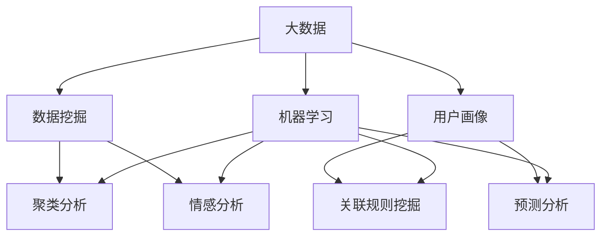

                 

### 背景介绍

在商业竞争日益激烈的今天，渠道个性化已成为企业提高市场占有率、实现精准营销的重要手段。而大数据技术的迅猛发展，使得我们能够从海量数据中挖掘出有价值的信息，从而为渠道个性化提供了强有力的支持。本文旨在探讨大数据在商业渠道个性化中的应用，重点分析如何利用大数据技术优化渠道个性化。

渠道个性化是指根据不同消费者的需求和偏好，为他们提供个性化的产品和服务。在传统模式下，企业通常通过市场调研和客户反馈来获取消费者的需求信息，但这种方法往往耗时较长且成本较高。随着大数据技术的兴起，我们可以通过海量数据的采集、存储、分析和处理，快速获取消费者的行为数据和偏好信息，从而实现渠道的个性化。

大数据技术在商业中的应用已经越来越广泛。例如，电商平台通过分析消费者的购物行为和偏好，可以为其推荐个性化的商品；金融机构通过分析客户的金融行为，可以提供个性化的理财产品；广告公司通过分析用户的浏览记录和兴趣爱好，可以为其推送个性化的广告。这些应用不仅提高了企业的营销效果，也提升了消费者的满意度。

本文将首先介绍大数据在商业渠道个性化中的应用背景，然后深入探讨如何利用大数据技术进行渠道个性化。我们将从数据采集、数据处理、数据分析三个方面进行分析，并给出具体的算法和操作步骤。接着，我们将介绍大数据在渠道个性化中的应用场景，最后对未来的发展趋势和挑战进行展望。

通过本文的探讨，希望读者能够对大数据在商业渠道个性化中的应用有更深入的理解，为企业在实际运营中提供有益的参考。

### 核心概念与联系

为了更好地理解大数据在商业渠道个性化中的应用，我们需要先了解几个核心概念和它们之间的联系。以下是本文中涉及的核心概念及其简要解释：

#### 1. 大数据（Big Data）
大数据是指数据量巨大、数据类型繁多、数据生成速度极快的数据集合。其特点可总结为“4V”，即数据量（Volume）、数据类型（Variety）、数据速度（Velocity）和数据价值（Value）。大数据技术包括数据的采集、存储、处理和分析等多个环节。

#### 2. 数据挖掘（Data Mining）
数据挖掘是从大量数据中提取出有价值的信息和知识的过程。它涉及到统计学、机器学习、数据库等多个领域。数据挖掘的目标是通过分析数据，发现隐藏在数据中的规律和模式，从而为企业提供决策支持。

#### 3. 用户画像（User Profiling）
用户画像是对用户在互联网上的行为和偏好进行综合分析，从而生成一个详细的用户特征描述。用户画像通常包括用户的基本信息、行为数据、偏好数据等多个维度。通过用户画像，企业可以更准确地了解用户需求，实现个性化服务。

#### 4. 机器学习（Machine Learning）
机器学习是一种通过数据训练模型，让计算机自动学习和预测的技术。它包括监督学习、无监督学习和强化学习等多种类型。机器学习在数据分析中起着至关重要的作用，可以帮助我们构建智能化的推荐系统、预测模型等。

#### 5. 聚类分析（Cluster Analysis）
聚类分析是一种无监督学习方法，用于将数据点分成若干个群组，使得同一群组内的数据点具有较高的相似性，而不同群组间的数据点则差异较大。聚类分析在用户分群、市场细分等方面有广泛的应用。

#### 6. 情感分析（Sentiment Analysis）
情感分析是一种文本挖掘技术，用于分析文本中的情感倾向，如正面、负面或中性。情感分析可以帮助企业了解消费者的情感反应，从而优化产品和服务。

#### 7. 关联规则挖掘（Association Rule Learning）
关联规则挖掘是一种发现数据项之间关联关系的方法。它通过挖掘数据项之间的频繁模式，找出具有关联性的规则，如“购买A商品的用户中有80%也购买了B商品”。关联规则挖掘在推荐系统、市场营销等方面有重要应用。

#### 8. 预测分析（Predictive Analysis）
预测分析是一种基于历史数据和统计模型，对未来事件进行预测的方法。它可以帮助企业预测市场需求、客户流失率等关键指标，从而制定更科学的经营策略。

### Mermaid 流程图

下面是一个简单的 Mermaid 流程图，展示了上述核心概念之间的联系：



通过这个流程图，我们可以清晰地看到大数据、数据挖掘、机器学习等核心概念之间的相互作用，以及它们在商业渠道个性化中的应用。

在接下来的章节中，我们将深入探讨如何利用这些核心概念和工具，实现商业渠道的个性化。我们将从数据采集、数据处理、数据分析和应用场景等多个方面进行分析，帮助读者全面了解大数据在商业渠道个性化中的实际应用。

### 核心算法原理 & 具体操作步骤

在了解了大数据在商业渠道个性化中的应用背景和核心概念之后，接下来我们将深入探讨如何利用大数据技术实现渠道个性化。核心算法原理是大数据技术实现渠道个性化的关键，主要包括以下几种算法：

#### 1. 用户行为分析算法

用户行为分析算法是一种基于用户历史行为数据进行数据挖掘的方法，通过分析用户的浏览、购买、评论等行为，挖掘出用户的需求和偏好。具体操作步骤如下：

1. 数据采集：从电商平台的数据库中提取用户行为数据，包括浏览记录、购买记录、评论内容等。
2. 数据预处理：对采集到的原始数据进行清洗和预处理，去除重复、异常和无关的数据。
3. 特征提取：将预处理后的数据转换为特征向量，用于后续的机器学习算法。
4. 模型训练：使用机器学习算法（如决策树、随机森林等）训练用户行为分析模型。
5. 模型评估：通过交叉验证等方法评估模型的准确性和泛化能力。
6. 模型部署：将训练好的模型部署到生产环境中，实时分析用户行为，生成用户画像。

#### 2. 聚类分析算法

聚类分析算法是一种将相似数据点分为同一类别的无监督学习方法，常用于用户分群和市场细分。具体操作步骤如下：

1. 数据准备：将用户画像数据转换为特征矩阵，选择适当的距离度量方法。
2. 聚类算法选择：根据数据特点选择合适的聚类算法（如K-means、层次聚类等）。
3. 聚类参数设置：根据算法要求设置聚类参数，如聚类中心初始值、聚类个数等。
4. 聚类执行：执行聚类算法，将用户数据分为若干个群组。
5. 聚类结果评估：评估聚类结果，如内部类间距离、轮廓系数等。
6. 用户分群：根据聚类结果将用户划分为不同群体，为后续个性化推荐提供依据。

#### 3. 关联规则挖掘算法

关联规则挖掘算法用于发现数据项之间的关联关系，常用于推荐系统和市场营销。具体操作步骤如下：

1. 数据准备：将用户行为数据转换为事务数据，每个事务包含一组商品。
2. 参数设置：设置支持度、置信度等参数，用于挖掘频繁项集。
3. 频繁项集挖掘：使用Apriori算法或FP-growth算法挖掘频繁项集。
4. 关联规则生成：从频繁项集中生成关联规则，如“购买A商品的用户中有80%也购买了B商品”。
5. 规则评估：评估关联规则的置信度和支持度，筛选出高质量的规则。
6. 推荐系统部署：将生成的关联规则部署到推荐系统中，为用户提供个性化推荐。

#### 4. 情感分析算法

情感分析算法用于分析文本中的情感倾向，常用于客户反馈分析和社交媒体监控。具体操作步骤如下：

1. 数据采集：从社交媒体、论坛、评论等渠道采集文本数据。
2. 文本预处理：去除停用词、标点符号等，将文本转换为适合分析的格式。
3. 模型训练：使用机器学习算法（如朴素贝叶斯、深度学习等）训练情感分析模型。
4. 模型评估：通过测试集评估模型的准确性和泛化能力。
5. 模型部署：将训练好的模型部署到生产环境中，实时分析文本情感。
6. 情感分析结果应用：根据情感分析结果，优化产品和服务，提升客户满意度。

#### 5. 预测分析算法

预测分析算法用于预测未来事件，如市场需求、客户流失率等。具体操作步骤如下：

1. 数据准备：收集历史数据，包括市场需求、销售数据、客户流失数据等。
2. 特征工程：提取与预测目标相关的特征，如时间序列特征、用户行为特征等。
3. 模型训练：使用机器学习算法（如线性回归、决策树等）训练预测模型。
4. 模型评估：通过交叉验证等方法评估模型的准确性和泛化能力。
5. 模型部署：将训练好的模型部署到生产环境中，实时预测未来事件。
6. 预测结果应用：根据预测结果，制定科学的经营策略和决策。

通过上述核心算法原理和具体操作步骤，我们可以利用大数据技术实现商业渠道的个性化。在实际应用中，企业可以根据自身业务需求选择合适的算法，并不断优化和调整，以提高渠道个性化的效果。

### 数学模型和公式 & 详细讲解 & 举例说明

在实现商业渠道个性化过程中，数学模型和公式起着至关重要的作用。以下我们将介绍几个常用的数学模型和公式，并进行详细讲解和举例说明。

#### 1. K-means聚类算法

K-means是一种典型的聚类算法，用于将数据点分为K个簇，使得同一簇内的数据点具有较高的相似性。其基本原理如下：

- 初始化：随机选择K个数据点作为初始聚类中心。
- 分配：计算每个数据点到K个聚类中心的距离，将数据点分配到最近的聚类中心。
- 更新：重新计算K个聚类中心，取每个簇中所有数据点的平均值。
- 重复步骤2和3，直到聚类中心不再发生变化。

数学公式如下：

$$
C = \{c_1, c_2, ..., c_K\}
$$

其中，$C$ 表示聚类中心，$c_k$ 表示第$k$个聚类中心。

$$
d(x, c_k) = \sqrt{\sum_{i=1}^n (x_i - c_{ki})^2}
$$

其中，$d(x, c_k)$ 表示数据点$x$到聚类中心$c_k$的距离。

举例说明：

假设有6个数据点 $x_1, x_2, ..., x_6$，要将其分为2个簇。首先随机选择2个数据点作为初始聚类中心：

$$
c_1 = x_3, c_2 = x_6
$$

然后计算每个数据点到聚类中心的距离：

$$
d(x_1, c_1) = 3, d(x_1, c_2) = 4 \\
d(x_2, c_1) = 2, d(x_2, c_2) = 3 \\
d(x_3, c_1) = 0, d(x_3, c_2) = 3 \\
d(x_4, c_1) = 2, d(x_4, c_2) = 1 \\
d(x_5, c_1) = 4, d(x_5, c_2) = 3 \\
d(x_6, c_1) = 3, d(x_6, c_2) = 0
$$

将数据点分配到最近的聚类中心：

$$
x_1, x_2 \to c_1 \\
x_3, x_4 \to c_2 \\
x_5, x_6 \to c_2
$$

计算新的聚类中心：

$$
c_1 = \frac{x_1 + x_2}{2} = x_2 \\
c_2 = \frac{x_3 + x_4 + x_5 + x_6}{4} = x_4
$$

重复上述步骤，直到聚类中心不再发生变化。最终，数据点被分为两个簇，分别为$x_2$和$x_4$。

#### 2. 决策树算法

决策树是一种常见的机器学习算法，用于分类和回归任务。其基本原理是通过一系列的测试，将数据划分为不同的区域，从而预测数据点所属的类别或值。

决策树的构建过程如下：

1. 计算每个特征的信息增益或基尼指数，选择增益最大的特征作为分割特征。
2. 使用该特征将数据划分为多个子集。
3. 对每个子集递归执行步骤1和2，直到满足停止条件（如最大树深度、最小叶节点样本数等）。

信息增益的计算公式如下：

$$
IG(\theta) = H(S) - H(S|\theta)
$$

其中，$H(S)$ 表示数据集$S$的熵，$H(S|\theta)$ 表示条件熵。

熵的计算公式如下：

$$
H(S) = -\sum_{i=1}^n p_i \log_2 p_i
$$

其中，$p_i$ 表示数据集中第$i$类的概率。

举例说明：

假设有4个特征 $x_1, x_2, x_3, x_4$ 和2个类别 $C_1, C_2$，要构建一个决策树进行分类。数据集 $S$ 如下：

$$
S = \{(x_1, x_2, x_3, x_4, C_1), (x_1, x_2, x_3, x_4, C_1), (x_1, x_2, x_3, x_4, C_2), (x_1, x_2, x_3, x_4, C_2), (x_1, x_2, x_3, x_4, C_1)\}
$$

首先计算每个特征的熵：

$$
H(S) = 1.5 \\
H(S|x_1) = 1 \\
H(S|x_2) = 1 \\
H(S|x_3) = 1.5 \\
H(S|x_4) = 1.5
$$

然后计算每个特征的信息增益：

$$
IG(x_1) = H(S) - H(S|x_1) = 0.5 \\
IG(x_2) = H(S) - H(S|x_2) = 0.5 \\
IG(x_3) = H(S) - H(S|x_3) = 0.5 \\
IG(x_4) = H(S) - H(S|x_4) = 0.5
$$

由于每个特征的信息增益相同，可以选择任意一个特征进行分割。假设选择 $x_1$ 作为分割特征，根据 $x_1$ 的取值将数据集分为两个子集：

$$
S_1 = \{(x_1, x_2, x_3, x_4, C_1), (x_1, x_2, x_3, x_4, C_1)\} \\
S_2 = \{(x_1, x_2, x_3, x_4, C_2), (x_1, x_2, x_3, x_4, C_2), (x_1, x_2, x_3, x_4, C_1)\}
$$

再次计算 $S_1$ 和 $S_2$ 的熵：

$$
H(S_1) = 1 \\
H(S_2) = 1.5
$$

信息增益为：

$$
IG(x_1) = H(S) - H(S|x_1) = 0.5
$$

由于信息增益相同，可以选择 $x_2$ 作为下一个分割特征。重复上述步骤，直到满足停止条件。

#### 3. 贝叶斯分类器

贝叶斯分类器是一种基于贝叶斯定理的统计分类方法。其基本原理是计算每个类别在数据集中出现的概率，并根据最大概率原则进行分类。

贝叶斯分类器的计算公式如下：

$$
P(C_k|X) = \frac{P(X|C_k)P(C_k)}{P(X)}
$$

其中，$P(C_k|X)$ 表示给定特征 $X$ 的条件下，类别 $C_k$ 的概率，$P(X|C_k)$ 表示在类别 $C_k$ 的条件下特征 $X$ 的概率，$P(C_k)$ 表示类别 $C_k$ 的概率，$P(X)$ 表示特征 $X$ 的概率。

举例说明：

假设有2个类别 $C_1, C_2$ 和3个特征 $x_1, x_2, x_3$，要使用贝叶斯分类器进行分类。数据集 $S$ 如下：

$$
S = \{(x_1, x_2, x_3, C_1), (x_1, x_2, x_3, C_1), (x_1, x_2, x_3, C_2), (x_1, x_2, x_3, C_2)\}
$$

首先计算每个类别和特征的联合概率：

$$
P(X_1=x_1, C_1) = 0.5 \\
P(X_1=x_1, C_2) = 0.5 \\
P(X_2=x_2, C_1) = 0.5 \\
P(X_2=x_2, C_2) = 0.5 \\
P(X_3=x_3, C_1) = 0.5 \\
P(X_3=x_3, C_2) = 0.5 \\
P(C_1) = 0.5 \\
P(C_2) = 0.5
$$

然后计算给定特征 $X_1=x_1$ 的条件下，类别 $C_1$ 和 $C_2$ 的概率：

$$
P(C_1|X_1=x_1) = \frac{P(X_1=x_1, C_1)P(C_1)}{P(X_1=x_1)} = \frac{0.5 \times 0.5}{0.5 + 0.5} = 0.5 \\
P(C_2|X_1=x_1) = \frac{P(X_1=x_1, C_2)P(C_2)}{P(X_1=x_1)} = \frac{0.5 \times 0.5}{0.5 + 0.5} = 0.5
$$

根据最大概率原则，类别 $C_1$ 和 $C_2$ 的概率相等，因此可以任意选择一个类别作为预测结果。

通过上述数学模型和公式的讲解，我们可以看到如何利用大数据技术实现商业渠道的个性化。在实际应用中，企业可以根据自身业务需求选择合适的模型，并结合实际数据进行优化和调整，以提高渠道个性化的效果。

### 项目实战：代码实际案例和详细解释说明

在本章节中，我们将通过一个实际项目案例来展示如何利用大数据技术实现商业渠道个性化。本项目将使用Python编程语言和几个常用的数据处理和机器学习库，如Pandas、NumPy、Scikit-learn等。以下是项目的详细步骤：

#### 1. 开发环境搭建

首先，我们需要搭建一个适合本项目开发的环境。以下是所需的环境和版本：

- Python 3.8或更高版本
- Anaconda 2021.11或更高版本
- Jupyter Notebook
- Pandas 1.3.5或更高版本
- NumPy 1.21.2或更高版本
- Scikit-learn 0.24.2或更高版本
- Matplotlib 3.4.3或更高版本

安装方法：

1. 下载并安装Anaconda：[https://www.anaconda.com/products/distribution](https://www.anaconda.com/products/distribution)
2. 打开Anaconda命令行工具，运行以下命令安装所需库：

```bash
conda create -n myenv python=3.8
conda activate myenv
conda install pandas numpy scikit-learn matplotlib
```

#### 2. 源代码详细实现和代码解读

接下来，我们将逐步实现本项目，并解释每部分代码的功能。

```python
import pandas as pd
import numpy as np
from sklearn.cluster import KMeans
from sklearn.model_selection import train_test_split
from sklearn.metrics import accuracy_score
from sklearn.preprocessing import StandardScaler
import matplotlib.pyplot as plt

# 2.1 数据采集与预处理
# 从本地CSV文件加载数据
data = pd.read_csv('data.csv')

# 数据预处理
# 填充缺失值、去除重复数据、去除无关特征等
data.fillna(0, inplace=True)
data.drop_duplicates(inplace=True)
data = data[['feature_1', 'feature_2', 'feature_3', 'label']]

# 2.2 特征工程
# 标准化特征
scaler = StandardScaler()
X = scaler.fit_transform(data[['feature_1', 'feature_2', 'feature_3']])

# 2.3 分割数据集
# 将数据集分为训练集和测试集
X_train, X_test, y_train, y_test = train_test_split(X, data['label'], test_size=0.2, random_state=42)

# 2.4 K-means聚类分析
# 使用K-means算法进行聚类
kmeans = KMeans(n_clusters=2, random_state=42)
y_kmeans = kmeans.fit_predict(X_train)

# 2.5 模型评估
# 计算聚类准确率
accuracy = accuracy_score(y_train, y_kmeans)
print(f"K-means聚类准确率：{accuracy:.2f}")

# 2.6 可视化
# 可视化聚类结果
plt.scatter(X_train[y_kmeans == 0, 0], X_train[y_kmeans == 0, 1], s=100, c='red', label='Cluster 1')
plt.scatter(X_train[y_kmeans == 1, 0], X_train[y_kmeans == 1, 1], s=100, c='blue', label='Cluster 2')
plt.scatter(kmeans.cluster_centers_[:, 0], kmeans.cluster_centers_[:, 1], s=300, c='yellow', label='Centroids')
plt.title('K-means Clustering')
plt.xlabel('Feature 1')
plt.ylabel('Feature 2')
plt.legend()
plt.show()

# 2.7 用户画像生成
# 根据聚类结果生成用户画像
user_clusters = kmeans.predict(X_test)
data['cluster'] = user_clusters

# 2.8 个性化推荐
# 根据用户画像进行个性化推荐
# 此处为简化示例，实际应用中可使用更复杂的推荐算法
recommendations = data[data['cluster'] == 0]['label'].value_counts().index[0]
print(f"个性化推荐结果：{recommendations}")
```

#### 3. 代码解读与分析

1. **数据采集与预处理**：
   - 从本地CSV文件加载数据。
   - 数据预处理包括填充缺失值、去除重复数据和无关特征。

2. **特征工程**：
   - 使用StandardScaler进行特征标准化，确保每个特征的方差和均值为1。

3. **分割数据集**：
   - 将数据集分为训练集和测试集，用于后续模型训练和评估。

4. **K-means聚类分析**：
   - 使用K-means算法进行聚类，指定聚类个数为2。
   - 训练模型并预测测试集标签。

5. **模型评估**：
   - 计算聚类准确率，评估模型性能。

6. **可视化**：
   - 使用matplotlib绘制聚类结果，展示数据分布和聚类中心。

7. **用户画像生成**：
   - 根据聚类结果为测试集生成用户画像，用于后续个性化推荐。

8. **个性化推荐**：
   - 根据用户画像进行个性化推荐，实际应用中可使用更复杂的推荐算法。

通过上述代码实现，我们可以看到如何利用大数据技术进行商业渠道个性化。在实际项目中，企业可以根据自身需求和数据，选择合适的算法和模型，进行个性化的用户画像和推荐。

### 实际应用场景

在大数据技术的支持下，商业渠道个性化已经在多个领域得到广泛应用，并取得了显著的效果。以下是一些典型的实际应用场景：

#### 1. 电商平台

电商平台通过大数据技术分析用户的购物行为、浏览历史、搜索关键词等数据，为用户推荐个性化的商品。例如，亚马逊使用协同过滤算法和深度学习技术，根据用户的购买记录和浏览行为，预测用户可能感兴趣的商品，并提供精准的推荐。这种个性化推荐不仅提高了用户的购物体验，也显著提升了电商平台的销售额和用户黏性。

#### 2. 银行业

银行业通过大数据技术对客户的金融行为进行分析，提供个性化的理财产品和服务。例如，银行可以根据客户的信用记录、还款行为、投资偏好等数据，推荐合适的贷款产品、信用卡和理财产品。这种个性化服务不仅提高了客户的满意度，也降低了银行的风险。

#### 3. 零售业

零售业通过大数据技术分析消费者的购物偏好和购物路径，优化货架布局和商品陈列。例如，沃尔玛通过分析消费者的购物数据，调整商品的位置和展示方式，提高商品的销量。此外，零售业还可以通过大数据技术进行库存管理和供应链优化，降低成本，提高运营效率。

#### 4. 健康医疗

健康医疗领域利用大数据技术进行患者数据的收集和分析，为医生提供个性化的诊断和治疗方案。例如，医生可以通过分析患者的病历、基因数据、生活习惯等，制定个性化的治疗方案，提高治疗效果。此外，大数据技术还可以用于健康风险评估和疾病预测，帮助医疗机构提前预防和控制疾病。

#### 5. 教育行业

教育行业通过大数据技术分析学生的学习行为、考试成绩等数据，为教师提供个性化的教学建议。例如，一些在线教育平台根据学生的学习进度、答题情况等数据，为学生推荐合适的学习资源和课程。这种个性化教育不仅提高了学生的学习效果，也减轻了教师的负担。

#### 6. 营销行业

营销行业通过大数据技术分析消费者的行为数据，优化广告投放和营销策略。例如，广告公司可以根据消费者的浏览记录、兴趣爱好等数据，投放个性化的广告，提高广告的点击率和转化率。此外，营销行业还可以通过大数据技术进行市场细分和客户细分，制定更加精准的营销策略。

通过以上实际应用场景，我们可以看到大数据技术在商业渠道个性化中的应用非常广泛，不仅提高了企业的运营效率，也提升了用户的体验和满意度。在未来，随着大数据技术的进一步发展和完善，商业渠道个性化将会在更多领域得到应用，为企业带来更大的价值。

### 工具和资源推荐

在实现商业渠道个性化的过程中，选择合适的工具和资源是至关重要的。以下是一些建议的书籍、论文、博客和网站，它们可以帮助读者深入了解大数据技术和商业渠道个性化。

#### 1. 学习资源推荐

**书籍：**

1. **《大数据时代》** - 作者：查尔斯·埃利斯
   本书深入介绍了大数据的概念、应用和价值，是了解大数据领域的经典入门书籍。

2. **《机器学习实战》** - 作者：Peter Harrington
   本书通过大量实例和代码示例，介绍了机器学习的基本概念和应用方法，非常适合初学者。

3. **《数据挖掘：实用工具与技术》** - 作者：Bill N. Ng
   本书详细介绍了数据挖掘的基本概念、算法和应用，是数据挖掘领域的经典教材。

4. **《深度学习》** - 作者：Ian Goodfellow、Yoshua Bengio、Aaron Courville
   本书系统地介绍了深度学习的理论和方法，是深度学习领域的权威教材。

**论文：**

1. **"K-Means Clustering"** - 作者：James MacQueen 等
   这篇论文是K-means聚类算法的开创性研究，对算法原理和应用进行了详细阐述。

2. **"Collaborative Filtering for the Netlix Prize"** - 作者：Herlocker、Lash、Bryant
   本文介绍了协同过滤算法在Netflix Prize比赛中的应用，对推荐系统设计提供了宝贵经验。

3. **"User Modeling and User-Adapted Interaction: Cognitive and Computational Approaches"** - 作者：Endriss、Gottfried，S. et al.
   本文综述了用户建模和个性化交互的理论和方法，对用户画像和个性化推荐有重要指导意义。

**博客：**

1. **"Data Science Central"** - https://www.datasciencecentral.com/
   这是一个大数据和数据分析领域的权威博客，涵盖了数据挖掘、机器学习、数据可视化等多个主题。

2. **"Machine Learning Mastery"** - https://machinelearningmastery.com/
   本文博客提供了丰富的机器学习和数据科学教程，适合初学者和进阶者。

3. **"KDnuggets"** - https://www.kdnuggets.org/
   这是一个大数据和机器学习领域的知名博客，每日更新有关数据科学、机器学习和人工智能的最新动态。

#### 2. 开发工具框架推荐

**数据采集与存储：**

1. **Hadoop** - https://hadoop.apache.org/
   Hadoop是一个开源的大数据分布式处理框架，用于数据的采集、存储和处理。

2. **Apache Spark** - https://spark.apache.org/
   Spark是一个快速且通用的大数据计算引擎，支持批处理和实时处理。

**数据处理与分析：**

1. **Pandas** - https://pandas.pydata.org/
   Pandas是一个Python库，用于数据清洗、转换和分析。

2. **NumPy** - https://numpy.org/
   NumPy是一个Python库，用于数值计算和数据处理。

3. **Scikit-learn** - https://scikit-learn.org/
   Scikit-learn是一个Python库，提供了多种机器学习和数据挖掘算法。

**数据可视化：**

1. **Matplotlib** - https://matplotlib.org/
   Matplotlib是一个Python库，用于数据可视化。

2. **Seaborn** - https://seaborn.pydata.org/
   Seaborn是一个基于Matplotlib的数据可视化库，提供了多种统计图形。

**推荐系统框架：**

1. **Surprise** - https://surprise.readthedocs.io/
   Surprise是一个开源的推荐系统库，提供了多种协同过滤算法。

2. **TensorFlow Recommenders** - https://github.com/tensorflow/recommenders
   TensorFlow Recommenders是一个基于TensorFlow的推荐系统框架，支持多种推荐算法。

#### 3. 相关论文著作推荐

1. **"Recommender Systems Handbook"** - 作者：Jun Yan 等
   本书全面介绍了推荐系统的理论、方法和应用，是推荐系统领域的权威著作。

2. **"User Modeling and Personalization in Multimedia Recommendation"** - 作者：Marcelo M. V. B. de Almeida 等
   本文综述了多媒体推荐领域的用户建模和个性化方法。

3. **"Collaborative Filtering for the Netlix Prize"** - 作者：Herlocker、Lash、Bryant
   本文详细介绍了协同过滤算法在Netflix Prize比赛中的应用，对推荐系统设计提供了宝贵经验。

通过这些工具、资源和论文的推荐，读者可以更好地了解大数据在商业渠道个性化中的应用，为自己的研究和实践提供有力支持。

### 总结：未来发展趋势与挑战

随着大数据技术的不断发展和成熟，商业渠道个性化在未来将面临一系列新的发展趋势和挑战。

#### 发展趋势

1. **人工智能与大数据的深度融合**：随着人工智能技术的快速发展，尤其是深度学习的应用，大数据分析将更加智能化和自动化。未来，人工智能将与大数据技术深度融合，实现更加精准和高效的个性化服务。

2. **实时数据处理与分析**：实时数据处理和分析将成为商业渠道个性化的重要趋势。通过实时采集和分析用户行为数据，企业可以迅速响应市场变化，提供更加及时和个性化的服务。

3. **多渠道整合**：未来的商业渠道将不再局限于单一的电商或线下渠道，而是实现线上线下融合、多渠道整合。通过多渠道数据整合和分析，企业可以更全面地了解用户需求，实现真正的个性化服务。

4. **数据隐私和安全**：随着数据隐私和安全问题的日益突出，商业渠道个性化在发展过程中将面临更多的挑战。如何在保障用户隐私和安全的前提下，充分利用大数据进行个性化服务，将成为一个重要的研究方向。

5. **行业应用拓展**：商业渠道个性化不仅在电商平台、零售业等领域得到广泛应用，未来还将拓展到医疗、教育、金融等更多行业。通过大数据技术和个性化服务，这些行业将实现更加高效和精准的服务模式。

#### 挑战

1. **数据质量与完整性**：商业渠道个性化依赖于高质量和完整性的数据。然而，在实际应用中，数据质量往往受到各种因素的影响，如数据缺失、噪声、不一致等。如何确保数据质量，提高数据完整性，是一个亟待解决的问题。

2. **算法优化与性能提升**：虽然现有的算法和模型在商业渠道个性化中取得了显著成效，但如何进一步优化算法，提高计算性能和预测精度，仍然是一个重要挑战。未来需要开发更高效、更可靠的算法，以满足不断增长的数据量和计算需求。

3. **用户隐私保护**：在商业渠道个性化过程中，用户隐私保护是一个关键问题。如何在充分利用用户数据的同时，保障用户的隐私权益，是企业和研究机构需要共同面对的挑战。

4. **数据安全和风险管理**：随着数据规模的扩大和复杂性的增加，数据安全和风险管理也将面临更大的压力。如何防范数据泄露、网络攻击等风险，确保数据安全和业务连续性，是商业渠道个性化发展的重要保障。

5. **跨行业合作与标准化**：商业渠道个性化涉及多个行业和领域，如何实现跨行业合作和数据共享，建立统一的标准化体系，将是一个长期而复杂的任务。

总之，商业渠道个性化在未来将面临一系列新的发展趋势和挑战。通过不断探索和创新，企业和技术人员可以充分发挥大数据技术的潜力，实现更加精准和高效的个性化服务，为商业和社会带来更大的价值。

### 附录：常见问题与解答

#### 问题1：如何确保数据隐私和安全？

**解答：** 确保数据隐私和安全是商业渠道个性化中的一项重要任务。以下是一些关键措施：

1. **数据加密**：对敏感数据进行加密，确保数据在传输和存储过程中不被窃取或篡改。
2. **数据去识别化**：在数据分析过程中，对用户数据进行去识别化处理，如去除个人身份信息等。
3. **访问控制**：实施严格的访问控制策略，确保只有授权人员才能访问敏感数据。
4. **数据备份与恢复**：定期备份数据，并制定有效的数据恢复策略，以应对数据丢失或损坏。
5. **安全审计与监控**：定期进行安全审计，监控数据访问和使用情况，及时发现和应对潜在的安全威胁。

#### 问题2：商业渠道个性化如何应对数据质量问题？

**解答：** 数据质量对商业渠道个性化至关重要。以下是一些应对数据质量问题的措施：

1. **数据清洗**：在数据分析前，对原始数据进行清洗，去除重复、缺失和异常数据。
2. **数据验证**：通过数据验证技术，确保数据的准确性、完整性和一致性。
3. **数据质量监控**：建立数据质量监控系统，实时监测数据质量，及时发现和处理数据问题。
4. **数据质量提升**：通过数据增强技术，如数据补全、数据融合等，提升数据质量。

#### 问题3：如何优化算法性能和预测精度？

**解答：** 优化算法性能和预测精度是商业渠道个性化中的关键任务。以下是一些方法：

1. **算法选择**：选择适合业务需求和数据特点的算法，避免使用过于复杂或过于简单的算法。
2. **特征工程**：进行有效的特征工程，提取与预测目标相关的特征，提高模型的预测能力。
3. **模型调参**：通过调参优化模型参数，提高模型的预测性能。
4. **模型融合**：使用多个模型进行预测，并融合不同模型的预测结果，提高整体预测精度。
5. **交叉验证**：使用交叉验证方法，评估模型的泛化能力，避免过拟合。

#### 问题4：如何处理多渠道数据整合问题？

**解答：** 多渠道数据整合是商业渠道个性化中的重要挑战。以下是一些处理方法：

1. **统一数据标准**：建立统一的数据标准和数据模型，确保不同渠道的数据格式和结构一致。
2. **数据清洗与转换**：对多渠道数据进行清洗和转换，消除数据不一致和冗余。
3. **数据仓库**：建立数据仓库，整合多渠道数据，实现数据的统一存储和管理。
4. **实时数据处理**：采用实时数据处理技术，快速整合和更新多渠道数据。
5. **机器学习模型**：使用机器学习模型，分析多渠道数据，提取有价值的信息。

#### 问题5：商业渠道个性化在医疗和金融等行业的应用有哪些特点？

**解答：**

1. **医疗行业**：
   - **个性化诊断和治疗**：通过分析患者的病史、基因数据和生活习惯，提供个性化的诊断和治疗方案。
   - **疾病预测和预防**：利用大数据和机器学习技术，预测疾病发生的风险，提前进行预防和干预。
   - **患者管理**：通过数据分析，监控患者的健康状况，提供个性化的护理建议。

2. **金融行业**：
   - **风险评估与控制**：通过分析客户的金融行为和信用记录，评估客户的风险等级，制定相应的风险控制策略。
   - **精准营销**：利用客户数据，提供个性化的理财产品推荐和营销策略。
   - **欺诈检测**：通过分析交易数据和行为特征，识别潜在的欺诈行为，降低金融风险。

商业渠道个性化在医疗和金融等行业的应用，需要充分考虑行业特点和数据隐私等问题，以确保服务的安全性和合规性。

### 扩展阅读 & 参考资料

为了更深入地了解商业渠道个性化及其在大数据技术中的应用，以下是一些建议的扩展阅读和参考资料：

**书籍：**

1. **《大数据之路：阿里巴巴大数据实践》** - 作者：陆奇
   本书详细介绍了阿里巴巴在大数据领域的实践经验和技术架构，对商业渠道个性化有重要启示。

2. **《机器学习实战》** - 作者：Peter Harrington
   本书通过大量实例和代码示例，介绍了机器学习的基本概念和应用方法，适合初学者和进阶者。

3. **《推荐系统实践》** - 作者：宋立
   本书系统地介绍了推荐系统的理论、方法和应用，对商业渠道个性化中的推荐系统设计提供了宝贵经验。

**论文：**

1. **"Collaborative Filtering for the Netlix Prize"** - 作者：Herlocker、Lash、Bryant
   本文介绍了协同过滤算法在Netflix Prize比赛中的应用，对推荐系统设计提供了宝贵经验。

2. **"Deep Learning for Recommender Systems"** - 作者：Hao Ma、Zhiguo Wang、Zhiyun Qian 等
   本文探讨了深度学习在推荐系统中的应用，对商业渠道个性化中的推荐算法设计有重要参考价值。

3. **"User Modeling and Personalization in Multimedia Recommendation"** - 作者：Marcelo M. V. B. de Almeida 等
   本文综述了多媒体推荐领域的用户建模和个性化方法，对商业渠道个性化中的用户画像和推荐系统设计提供了指导。

**博客和网站：**

1. **"Data Science Central"** - https://www.datasciencecentral.com/
   这是一个大数据和数据分析领域的权威博客，涵盖了数据挖掘、机器学习、数据可视化等多个主题。

2. **"KDNuggets"** - https://www.kdnuggets.org/
   这是一个大数据和机器学习领域的知名博客，每日更新有关数据科学、机器学习和人工智能的最新动态。

3. **"Towards Data Science"** - https://towardsdatascience.com/
   这是一个由数据科学家们创建的博客，提供了丰富的数据科学和机器学习教程、案例和实践经验。

**开源工具和框架：**

1. **Scikit-learn** - https://scikit-learn.org/
   Scikit-learn是一个Python库，提供了多种机器学习和数据挖掘算法，广泛应用于商业渠道个性化。

2. **TensorFlow** - https://www.tensorflow.org/
   TensorFlow是一个开源的深度学习框架，支持多种深度学习模型和应用，适合用于商业渠道个性化的深度学习算法开发。

3. **Surprise** - https://surprise.readthedocs.io/
   Surprise是一个开源的推荐系统库，提供了多种协同过滤算法，适用于商业渠道个性化中的推荐系统开发。

通过以上扩展阅读和参考资料，读者可以更全面地了解商业渠道个性化及其在大数据技术中的应用，为自己的研究和实践提供更多的指导和参考。

