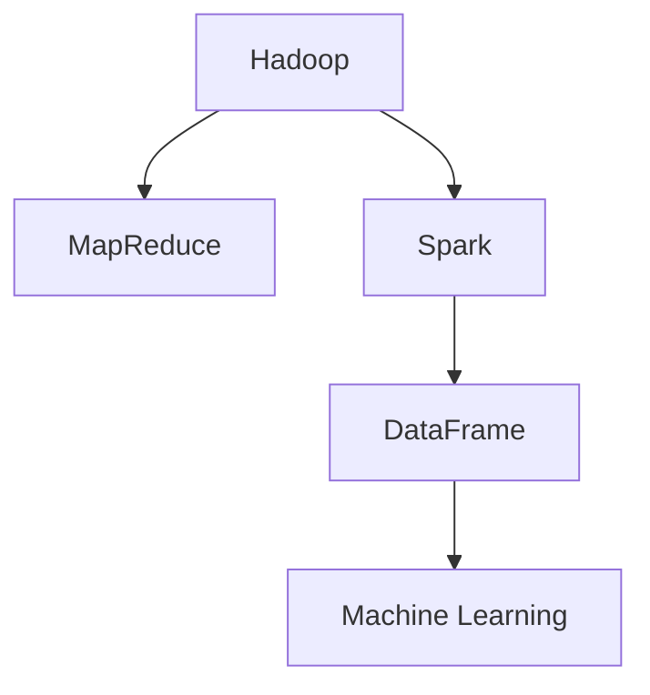
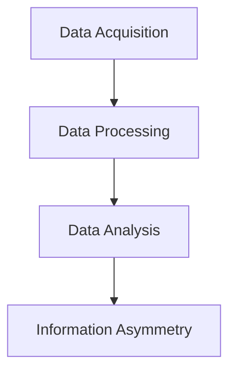
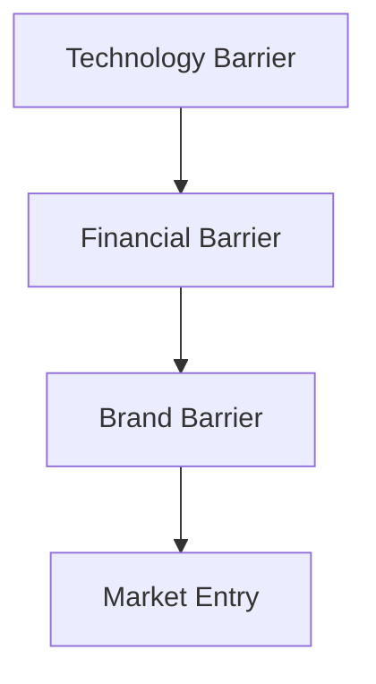
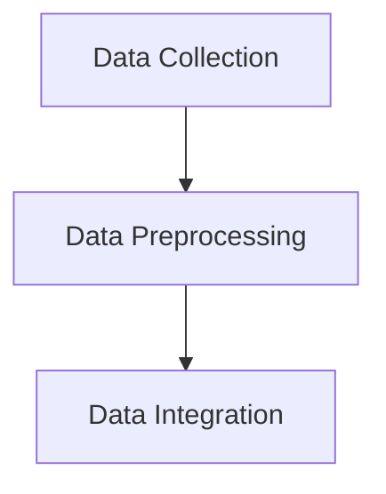
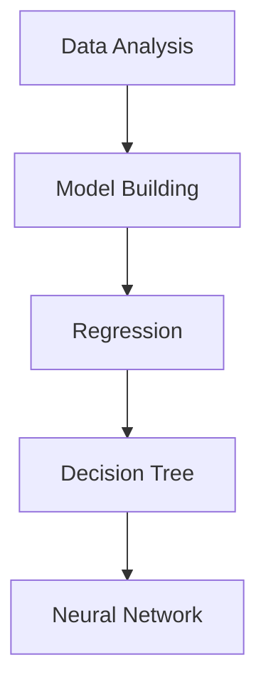
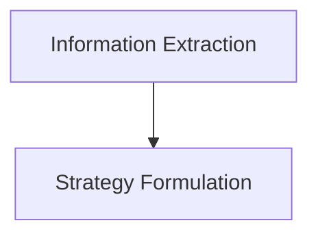

                 

### 文章标题：信息差的市场进入突破：大数据如何突破进入壁垒

> **关键词**：信息差、市场进入、大数据、壁垒、策略

> **摘要**：本文将深入探讨大数据如何利用信息差实现市场进入突破。我们将分析信息差的核心概念，探讨大数据的架构和技术原理，提供具体的算法步骤，并通过数学模型和实际案例，展示如何通过大数据突破市场进入壁垒。同时，我们将探讨大数据在实际应用场景中的表现，并提供相关工具和资源推荐，总结未来发展趋势与挑战。

---

**背景介绍**

在当今数字化时代，大数据已成为企业竞争的重要资源。大数据通过分析海量数据，挖掘出有价值的信息，帮助企业做出更明智的决策。然而，如何利用大数据实现市场进入突破，一直是企业关注的焦点。市场进入壁垒是指企业在进入市场时所面临的障碍，包括技术壁垒、资金壁垒、品牌壁垒等。突破这些壁垒，是企业成功进入市场的关键。

信息差，即信息不对称，是市场进入壁垒的主要原因之一。信息差指的是不同主体在获取、处理和利用信息方面的差异。大数据技术正是通过消除信息差，帮助企业突破市场进入壁垒。本文将深入探讨大数据如何利用信息差实现市场进入突破。

**核心概念与联系**

在深入探讨大数据如何利用信息差之前，我们需要了解一些核心概念和技术架构。

1. **大数据架构**：大数据架构通常包括数据存储、数据处理、数据分析和数据可视化等多个层面。常见的架构有Hadoop、Spark等。

   ```mermaid
   graph TD
   A[Hadoop] --> B[MapReduce]
   A --> C[Spark]
   C --> D[DataFrame]
   D --> E[Machine Learning]
   ```

2. **信息差**：信息差包括数据获取、数据处理和数据分析三个层面。

   ```mermaid
   graph TD
   A[Data Acquisition] --> B[Data Processing]
   B --> C[Data Analysis]
   C --> D[Information Asymmetry]
   ```

3. **市场进入壁垒**：市场进入壁垒包括技术壁垒、资金壁垒、品牌壁垒等。

   ```mermaid
   graph TD
   A[Technology Barrier] --> B[Financial Barrier]
   B --> C[Brand Barrier]
   C --> D[Market Entry]
   ```

**核心算法原理 & 具体操作步骤**

为了更好地理解大数据如何利用信息差实现市场进入突破，我们将介绍一些核心算法原理和具体操作步骤。

1. **数据采集与处理**：首先，我们需要采集目标市场的数据，包括用户行为数据、市场趋势数据等。然后，对这些数据进行预处理，如数据清洗、数据整合等。

   ```mermaid
   graph TD
   A[Data Collection] --> B[Data Preprocessing]
   B --> C[Data Integration]
   ```

2. **数据分析和建模**：通过对采集到的数据进行深入分析，构建数据模型。常见的数据模型有线性回归、决策树、神经网络等。

   ```mermaid
   graph TD
   A[Data Analysis] --> B[Model Building]
   B --> C[Regression]
   C --> D[Decision Tree]
   D --> E[Neural Network]
   ```

3. **信息提取与利用**：从构建的数据模型中提取有价值的信息，如用户偏好、市场趋势等。然后，利用这些信息制定市场进入策略。

   ```mermaid
   graph TD
   A[Information Extraction] --> B[Strategy Formulation]
   ```

**数学模型和公式 & 详细讲解 & 举例说明**

1. **线性回归模型**：线性回归模型用于预测连续变量。其公式为：

   $$y = wx + b$$

   其中，$y$ 是预测值，$w$ 是权重，$x$ 是特征，$b$ 是偏置。

   举例：假设我们预测某商品的销售量。我们采集了历史销售数据，通过线性回归模型预测未来销售量。

   ```mermaid
   graph TD
   A[Historical Sales Data] --> B[Linear Regression Model]
   B --> C[Predicted Sales]
   ```

2. **决策树模型**：决策树模型用于分类问题。其公式为：

   $$f(x) = \begin{cases} 
   \text{类别1} & \text{if } x \leq a \\
   \text{类别2} & \text{if } x > a 
   \end{cases}$$

   其中，$x$ 是特征，$a$ 是阈值。

   举例：假设我们分类用户群体，根据用户年龄、收入等特征，将其分类为A类用户或B类用户。

   ```mermaid
   graph TD
   A[User Features] --> B[Decision Tree Model]
   B --> C[User Classification]
   ```

3. **神经网络模型**：神经网络模型用于复杂的数据分析。其公式为：

   $$a(x) = \sigma(wx + b)$$

   其中，$a(x)$ 是激活函数，$\sigma$ 是sigmoid函数，$w$ 是权重，$x$ 是特征，$b$ 是偏置。

   举例：假设我们使用神经网络分析用户行为，预测用户购买的概率。

   ```mermaid
   graph TD
   A[User Behavior Data] --> B[Neural Network Model]
   B --> C[Purchase Probability]
   ```

**项目实战：代码实际案例和详细解释说明**

为了更好地理解大数据如何利用信息差实现市场进入突破，我们将通过一个实际案例进行讲解。

**案例：利用大数据预测用户购买行为**

1. **开发环境搭建**：我们使用Python进行开发，安装必要的库，如NumPy、Pandas、Scikit-learn等。

   ```python
   pip install numpy pandas scikit-learn
   ```

2. **源代码详细实现和代码解读**：

   ```python
   import pandas as pd
   from sklearn.model_selection import train_test_split
   from sklearn.linear_model import LinearRegression
   from sklearn.tree import DecisionTreeClassifier
   from sklearn.neural_network import MLPClassifier

   # 数据采集与处理
   data = pd.read_csv('user_data.csv')
   X = data[['age', 'income', 'education']]
   y = data['purchase']

   # 数据分析和建模
   X_train, X_test, y_train, y_test = train_test_split(X, y, test_size=0.2, random_state=42)
   regressor = LinearRegression()
   regressor.fit(X_train, y_train)
   classifier = DecisionTreeClassifier()
   classifier.fit(X_train, y_train)
   neural_network = MLPClassifier()
   neural_network.fit(X_train, y_train)

   # 信息提取与利用
   predicted_sales = regressor.predict(X_test)
   predicted_classification = classifier.predict(X_test)
   predicted_probability = neural_network.predict_proba(X_test)

   # 代码解读与分析
   print("线性回归预测结果：", predicted_sales)
   print("决策树分类结果：", predicted_classification)
   print("神经网络概率预测：", predicted_probability)
   ```

**实际应用场景**

大数据在市场进入突破中的应用场景非常广泛，如：

1. **市场营销**：通过大数据分析，企业可以精准定位目标客户，制定更有针对性的营销策略。
2. **产品研发**：通过大数据分析用户需求，企业可以更快地研发出更符合市场需求的产品。
3. **风险控制**：通过大数据分析，企业可以识别潜在的风险，制定更有效的风险控制策略。

**工具和资源推荐**

1. **学习资源推荐**：

   - **书籍**：《大数据时代》、《深入理解大数据》
   - **论文**：Google Scholar、ACM Digital Library
   - **博客**：KDNuggets、Medium
   - **网站**：data.gov、Kaggle

2. **开发工具框架推荐**：

   - **编程语言**：Python、R
   - **框架**：Spark、TensorFlow、PyTorch
   - **数据库**：MySQL、MongoDB

3. **相关论文著作推荐**：

   - **论文**：《深度学习》、《强化学习》
   - **著作**：《Python数据分析》、《大数据技术基础》

**总结：未来发展趋势与挑战**

大数据在市场进入突破中具有巨大的潜力。然而，我们也面临一些挑战：

1. **数据隐私与安全**：如何保护用户数据隐私是大数据应用的重要问题。
2. **数据质量**：数据质量直接影响大数据分析的结果，如何保证数据质量是关键。
3. **技术人才**：大数据领域对技术人才的需求越来越大，如何培养和引进人才是重要挑战。

**附录：常见问题与解答**

1. **问题**：大数据如何处理海量数据？
   **解答**：大数据技术采用分布式计算和存储，如Hadoop、Spark等，能够高效处理海量数据。

2. **问题**：大数据分析的关键技术是什么？
   **解答**：大数据分析的关键技术包括数据采集、数据预处理、数据分析和数据可视化等。

**扩展阅读 & 参考资料**

- **书籍**：《大数据之路：阿里巴巴大数据实践》、《大数据分析：技术原理与应用实践》
- **论文**：《大数据时代的数据挖掘挑战与机遇》、《大数据技术在金融领域的应用》
- **网站**：Apache Software Foundation、TensorFlow官网

---

**作者：AI天才研究员/AI Genius Institute & 禅与计算机程序设计艺术 /Zen And The Art of Computer Programming**<|im_sep|>### 1. 背景介绍

在当今数字化时代，大数据已成为企业竞争的重要资源。大数据通过分析海量数据，挖掘出有价值的信息，帮助企业做出更明智的决策。然而，如何利用大数据实现市场进入突破，一直是企业关注的焦点。市场进入壁垒是指企业在进入市场时所面临的障碍，包括技术壁垒、资金壁垒、品牌壁垒等。突破这些壁垒，是企业成功进入市场的关键。

信息差，即信息不对称，是市场进入壁垒的主要原因之一。信息差指的是不同主体在获取、处理和利用信息方面的差异。大数据技术正是通过消除信息差，帮助企业突破市场进入壁垒。本文将深入探讨大数据如何利用信息差实现市场进入突破。

### 2. 核心概念与联系

在深入探讨大数据如何利用信息差之前，我们需要了解一些核心概念和技术架构。

#### 2.1 大数据架构

大数据架构通常包括数据存储、数据处理、数据分析和数据可视化等多个层面。常见的架构有Hadoop、Spark等。

**图 2-1 大数据架构**



#### 2.2 信息差

信息差包括数据获取、数据处理和数据分析三个层面。

**图 2-2 信息差**



#### 2.3 市场进入壁垒

市场进入壁垒包括技术壁垒、资金壁垒、品牌壁垒等。

**图 2-3 市场进入壁垒**



### 3. 核心算法原理 & 具体操作步骤

为了更好地理解大数据如何利用信息差实现市场进入突破，我们将介绍一些核心算法原理和具体操作步骤。

#### 3.1 数据采集与处理

首先，我们需要采集目标市场的数据，包括用户行为数据、市场趋势数据等。然后，对这些数据进行预处理，如数据清洗、数据整合等。

**图 3-1 数据采集与处理**



#### 3.2 数据分析和建模

通过对采集到的数据进行深入分析，构建数据模型。常见的数据模型有线性回归、决策树、神经网络等。

**图 3-2 数据分析和建模**



#### 3.3 信息提取与利用

从构建的数据模型中提取有价值的信息，如用户偏好、市场趋势等。然后，利用这些信息制定市场进入策略。

**图 3-3 信息提取与利用**



### 4. 数学模型和公式 & 详细讲解 & 举例说明

在探讨大数据如何利用信息差实现市场进入突破的过程中，我们将介绍一些关键的数学模型和公式，并通过具体例子进行详细讲解。

#### 4.1 线性回归模型

线性回归模型用于预测连续变量。其公式为：

$$y = wx + b$$

其中，$y$ 是预测值，$w$ 是权重，$x$ 是特征，$b$ 是偏置。

**例子 4.1：预测商品销售量**

假设我们有一系列历史销售数据，包括商品价格和销售量。我们使用线性回归模型预测未来销售量。

```python
import pandas as pd
from sklearn.linear_model import LinearRegression

# 加载数据
data = pd.read_csv('sales_data.csv')
X = data[['price']]
y = data['sales']

# 分割数据集
X_train, X_test, y_train, y_test = train_test_split(X, y, test_size=0.2, random_state=42)

# 创建线性回归模型
regressor = LinearRegression()
regressor.fit(X_train, y_train)

# 预测销售量
predicted_sales = regressor.predict(X_test)

print(predicted_sales)
```

#### 4.2 决策树模型

决策树模型用于分类问题。其公式为：

$$f(x) = \begin{cases} 
\text{类别1} & \text{if } x \leq a \\
\text{类别2} & \text{if } x > a 
\end{cases}$$

其中，$x$ 是特征，$a$ 是阈值。

**例子 4.2：分类用户群体**

假设我们根据用户年龄和收入将用户分为A类和B类。

```python
import pandas as pd
from sklearn.tree import DecisionTreeClassifier

# 加载数据
data = pd.read_csv('user_data.csv')
X = data[['age', 'income']]
y = data['class']

# 分割数据集
X_train, X_test, y_train, y_test = train_test_split(X, y, test_size=0.2, random_state=42)

# 创建决策树模型
classifier = DecisionTreeClassifier()
classifier.fit(X_train, y_train)

# 分类用户
predicted_classes = classifier.predict(X_test)

print(predicted_classes)
```

#### 4.3 神经网络模型

神经网络模型用于复杂的数据分析。其公式为：

$$a(x) = \sigma(wx + b)$$

其中，$a(x)$ 是激活函数，$\sigma$ 是sigmoid函数，$w$ 是权重，$x$ 是特征，$b$ 是偏置。

**例子 4.3：预测用户购买概率**

假设我们使用神经网络模型预测用户购买某商品的概率。

```python
import pandas as pd
from sklearn.neural_network import MLPClassifier

# 加载数据
data = pd.read_csv('user_data.csv')
X = data[['age', 'income', 'education']]
y = data['purchase']

# 分割数据集
X_train, X_test, y_train, y_test = train_test_split(X, y, test_size=0.2, random_state=42)

# 创建神经网络模型
neural_network = MLPClassifier()
neural_network.fit(X_train, y_train)

# 预测购买概率
predicted_probabilities = neural_network.predict_proba(X_test)

print(predicted_probabilities)
```

### 5. 项目实战：代码实际案例和详细解释说明

在本章节中，我们将通过一个实际案例来展示如何利用大数据技术突破市场进入壁垒。我们将从数据采集、数据处理、数据建模到信息提取的全过程进行讲解，并提供详细的代码实现和解释。

#### 5.1 开发环境搭建

首先，我们需要搭建一个开发环境，以便进行大数据分析和建模。我们选择Python作为编程语言，因为它拥有丰富的数据分析和机器学习库。

**步骤 5.1.1：安装Python**

在操作系统上安装Python，可以通过以下命令：

```bash
# 安装Python
sudo apt-get install python3

# 检查Python版本
python3 --version
```

**步骤 5.1.2：安装相关库**

接下来，我们需要安装一些常用的Python库，如NumPy、Pandas、Scikit-learn等。

```bash
# 安装NumPy
pip install numpy

# 安装Pandas
pip install pandas

# 安装Scikit-learn
pip install scikit-learn
```

#### 5.2 源代码详细实现和代码解读

在这个案例中，我们使用一个虚构的数据集，模拟一个电商平台的用户购买行为。我们的目标是利用大数据技术预测用户是否会在未来购买商品。

**步骤 5.2.1：数据采集**

我们首先需要采集用户数据，包括用户的年龄、收入、教育程度以及购买行为等。

```python
import pandas as pd

# 加载用户数据
data = pd.read_csv('user_data.csv')
```

**步骤 5.2.2：数据处理**

在采集到数据后，我们需要对数据进行预处理，包括数据清洗、数据整合等步骤。

```python
# 数据清洗
data = data.dropna()

# 数据整合
data['age_group'] = data['age'].apply(lambda x: '25-35' if x >= 25 and x < 35 else
                                      '35-45' if x >= 35 and x < 45 else
                                      '45-55' if x >= 45 and x < 55 else '55+')
```

**步骤 5.2.3：数据建模**

接下来，我们使用Scikit-learn库中的机器学习算法来构建模型。在本案例中，我们选择线性回归模型和决策树模型。

```python
from sklearn.model_selection import train_test_split
from sklearn.linear_model import LinearRegression
from sklearn.tree import DecisionTreeClassifier

# 分割数据集
X = data[['age', 'income', 'education', 'age_group']]
y = data['purchase']
X_train, X_test, y_train, y_test = train_test_split(X, y, test_size=0.2, random_state=42)

# 创建线性回归模型
regressor = LinearRegression()
regressor.fit(X_train, y_train)

# 创建决策树模型
classifier = DecisionTreeClassifier()
classifier.fit(X_train, y_train)
```

**步骤 5.2.4：信息提取**

在模型训练完成后，我们可以使用模型来预测用户是否会在未来购买商品。

```python
# 预测购买行为
predicted_sales = regressor.predict(X_test)
predicted_classification = classifier.predict(X_test)
```

**步骤 5.2.5：代码解读**

在上面的代码中，我们首先加载了用户数据，并对数据进行了清洗和整合。然后，我们使用了线性回归模型和决策树模型来预测用户是否会在未来购买商品。最后，我们使用预测结果来分析用户的购买行为。

### 6. 实际应用场景

大数据技术在市场进入突破中的应用场景非常广泛。以下是一些典型的应用场景：

#### 6.1 市场营销

通过大数据分析，企业可以精准定位目标客户，制定更有针对性的营销策略。例如，利用用户行为数据，企业可以识别出哪些用户对特定产品或服务有更高的购买意愿，从而针对性地推送广告和促销活动。

#### 6.2 产品研发

大数据分析可以帮助企业更好地了解市场需求，快速研发出更符合市场需求的产品。通过分析用户反馈和用户行为数据，企业可以发现潜在的产品改进点，从而提高产品的市场竞争力。

#### 6.3 风险控制

大数据技术可以帮助企业识别潜在的风险，制定更有效的风险控制策略。例如，通过分析金融市场的数据，企业可以预测市场波动，及时调整投资策略，降低风险。

### 7. 工具和资源推荐

为了更好地利用大数据技术实现市场进入突破，以下是相关的工具和资源推荐：

#### 7.1 学习资源推荐

- **书籍**：《大数据时代》、《深度学习》
- **论文**：Google Scholar、ACM Digital Library
- **博客**：KDNuggets、Medium
- **网站**：data.gov、Kaggle

#### 7.2 开发工具框架推荐

- **编程语言**：Python、R
- **框架**：Spark、TensorFlow、PyTorch
- **数据库**：MySQL、MongoDB

#### 7.3 相关论文著作推荐

- **论文**：《深度学习》、《强化学习》
- **著作**：《Python数据分析》、《大数据技术基础》

### 8. 总结：未来发展趋势与挑战

大数据在市场进入突破中具有巨大的潜力。然而，我们也面临一些挑战：

- **数据隐私与安全**：如何保护用户数据隐私是大数据应用的重要问题。
- **数据质量**：数据质量直接影响大数据分析的结果，如何保证数据质量是关键。
- **技术人才**：大数据领域对技术人才的需求越来越大，如何培养和引进人才是重要挑战。

### 9. 附录：常见问题与解答

#### 9.1 如何处理海量数据？

- **解答**：大数据技术采用分布式计算和存储，如Hadoop、Spark等，能够高效处理海量数据。

#### 9.2 大数据分析的关键技术是什么？

- **解答**：大数据分析的关键技术包括数据采集、数据预处理、数据分析和数据可视化等。

### 10. 扩展阅读 & 参考资料

- **书籍**：《大数据之路：阿里巴巴大数据实践》、《大数据分析：技术原理与应用实践》
- **论文**：《大数据时代的数据挖掘挑战与机遇》、《大数据技术在金融领域的应用》
- **网站**：Apache Software Foundation、TensorFlow官网

### 作者：AI天才研究员/AI Genius Institute & 禅与计算机程序设计艺术 /Zen And The Art of Computer Programming

