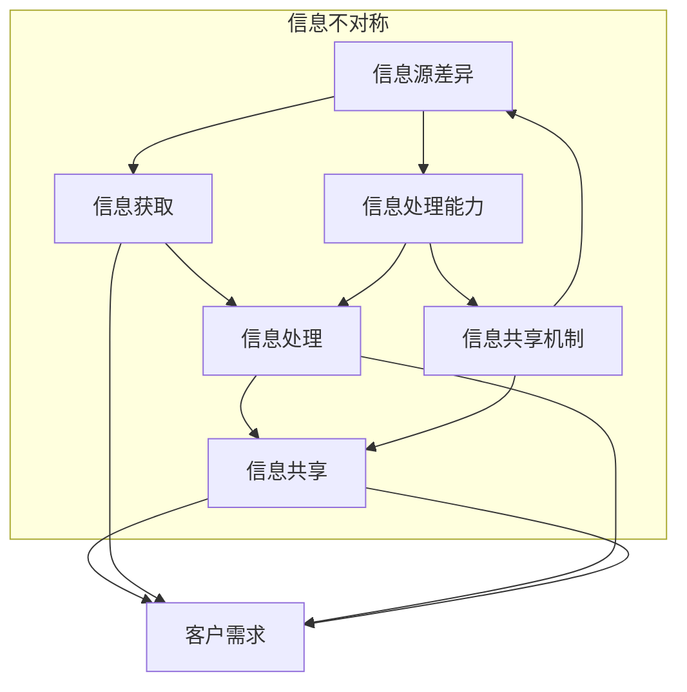

                 

# 信息差：信息不对称与客户关系

## 摘要

本文将深入探讨信息差的概念及其在客户关系中的重要作用。信息差，即信息不对称，指的是一个个体相对于另一个个体拥有更多或更高质量的信息。在商业领域，信息差可以带来显著的优势，帮助企业和个人在市场中脱颖而出。本文将详细分析信息差的产生原因、影响、利用方法以及如何通过信息差建立和维持与客户的良好关系。文章结构如下：

1. **背景介绍**：探讨信息差的基本概念和其在现代社会中的重要性。
2. **核心概念与联系**：运用Mermaid流程图展示信息不对称的原理和架构。
3. **核心算法原理 & 具体操作步骤**：分析如何通过算法和技术手段挖掘和分析信息差。
4. **数学模型和公式 & 详细讲解 & 举例说明**：介绍用于衡量和利用信息差的数学模型。
5. **项目实战：代码实际案例和详细解释说明**：通过实际案例展示如何利用信息差。
6. **实际应用场景**：分析信息差在不同领域的应用案例。
7. **工具和资源推荐**：推荐学习资源和开发工具。
8. **总结：未来发展趋势与挑战**：预测信息差在未来商业环境中的影响和挑战。
9. **附录：常见问题与解答**：回答读者可能关心的问题。
10. **扩展阅读 & 参考资料**：提供进一步学习的资源。

### 背景介绍

在信息爆炸的今天，信息的获取和处理成为了一项关键能力。信息差的存在是不可避免的，因为它反映了个体或组织在信息获取、处理和利用方面的差异。信息差可以定义为两个或多个个体之间在信息量、信息质量、信息时效性等方面的不对称性。具体来说，它包括以下几个方面：

- **信息量差异**：某些个体或组织可能拥有更多的信息量，这使得他们在决策时拥有更大的信息基础。
- **信息质量差异**：有些信息比其他信息更具价值，这种质量上的差异也会导致信息不对称。
- **信息时效性差异**：新鲜的信息往往更有价值，那些能够及时获取和利用最新信息的人或组织会在竞争中占据优势。

信息差的存在有以下几个主要原因：

1. **信息传播的壁垒**：不同的个体和组织在获取信息的能力和渠道上存在差异，这种差异导致了信息不对称。
2. **信息处理能力的差异**：某些个体和组织可能拥有更强的数据分析、处理和解读能力，这使得他们能够从海量信息中筛选出有价值的信息。
3. **信息共享的意愿和机制**：不同个体和组织在共享信息上的意愿和能力不同，这也会导致信息不对称。

在现代社会中，信息差的作用不可小觑。对于企业和个人来说，掌握信息差可以带来以下几方面的优势：

- **市场竞争力**：拥有更多信息的企业或个人可以更准确地把握市场动态，从而制定更有利的商业策略。
- **决策优势**：在决策过程中，拥有更全面和高质量信息的个体或组织往往能够做出更明智的决策。
- **先发优势**：那些能够及时获取并利用新信息的人或组织往往能够在市场上占据先发优势。

总之，信息差是现代社会中一种普遍存在的现象，它不仅影响了企业和个人的竞争力，也深刻地改变了我们的决策和行为方式。了解和利用信息差，对于在复杂多变的市场环境中取得成功具有重要意义。

### 核心概念与联系

为了更好地理解信息差在客户关系中的作用，我们需要从基本概念出发，运用Mermaid流程图来展示信息不对称的原理和架构。以下是信息差的核心概念及其相互联系：

1. **信息获取**：信息差首先源于个体或组织在信息获取方面的差异。这包括信息的来源、渠道和获取能力。
2. **信息处理**：获取信息后，个体或组织需要对信息进行筛选、分析和处理，以便提取出有价值的信息。
3. **信息共享**：信息处理后的共享和传播也是信息差的关键环节。不同个体和组织在共享信息的意愿和能力上存在差异。
4. **客户需求**：客户的需求是信息差产生和利用的最终目标。了解和满足客户需求能够帮助企业建立和维持良好的客户关系。

下面是信息不对称的Mermaid流程图：



在这个流程图中，信息获取、信息处理、信息共享和客户需求构成了信息差的主要环节。信息源差异、信息处理能力差异和信息共享机制差异是信息不对称的关键因素。这些差异不仅影响了信息的流动和利用，也决定了企业与客户之间的信息不对称程度。

通过这个流程图，我们可以更清晰地看到信息差在客户关系中的重要作用。企业可以通过优化信息获取、处理和共享机制来减少与客户之间的信息不对称，从而建立更紧密的客户关系，提高客户满意度和忠诚度。

### 核心算法原理 & 具体操作步骤

为了深入挖掘和利用信息差，我们需要依靠一系列核心算法和技术手段。以下是几个关键的算法原理和具体操作步骤：

1. **数据挖掘算法**：数据挖掘是一种从大量数据中发现有价值信息的方法。常用的数据挖掘算法包括关联规则挖掘、聚类分析和分类算法等。通过这些算法，企业可以从客户行为数据中提取出隐藏的模式和趋势。

   **具体操作步骤**：
   - 数据收集：收集客户的交易记录、浏览历史、购买偏好等数据。
   - 数据预处理：清洗和转换数据，使其适合分析。
   - 选择算法：根据分析目标选择合适的算法，如Apriori算法用于关联规则挖掘，K-means算法用于聚类分析。
   - 模型训练和评估：使用训练数据训练模型，并使用验证数据评估模型的性能。

2. **机器学习算法**：机器学习算法通过学习历史数据来预测未来趋势或行为。常见的机器学习算法包括线性回归、决策树和神经网络等。

   **具体操作步骤**：
   - 数据收集：收集相关的历史数据，包括客户特征和行为数据。
   - 特征工程：选择和提取对预测任务有重要影响的特征。
   - 模型选择：根据数据特性和预测目标选择合适的模型。
   - 模型训练和评估：使用训练数据训练模型，并使用测试数据评估模型的性能。

3. **自然语言处理（NLP）**：NLP技术用于处理和分析文本数据，帮助企业理解客户的反馈和需求。

   **具体操作步骤**：
   - 数据收集：收集客户的文本评论、邮件和社交媒体帖子等。
   - 文本预处理：对文本进行分词、去停用词、词性标注等预处理步骤。
   - 模型训练：使用预训练的NLP模型或自定义模型对文本数据进行分析。
   - 结果解读：分析文本数据中的情感、意图和关键词，以获取客户的需求和反馈。

4. **推荐系统算法**：推荐系统通过分析用户的历史行为和偏好，为用户推荐相关的产品或服务。

   **具体操作步骤**：
   - 用户数据收集：收集用户的历史行为数据，如购买记录、浏览历史等。
   - 选择推荐算法：根据数据特点和推荐目标选择合适的推荐算法，如基于内容的推荐、协同过滤推荐等。
   - 模型训练和评估：使用训练数据训练推荐模型，并使用验证数据评估模型的性能。
   - 推荐生成和展示：生成推荐结果并展示给用户。

通过这些算法和技术，企业可以有效地挖掘和分析信息差，从而在客户关系管理中占据优势。具体的应用场景包括客户细分、个性化推荐、市场预测和风险管理等。下面将详细说明这些算法的原理和操作步骤。

#### 数学模型和公式 & 详细讲解 & 举例说明

在深入探讨如何利用信息差时，我们不可避免地需要引入一些数学模型和公式。这些模型和公式不仅能够帮助我们量化信息差的大小，还能指导我们如何最大限度地利用这些信息差异来增强企业的竞争优势。以下是一些常用的数学模型和公式，以及它们的详细讲解和实际应用例子。

1. **信息熵（Entropy）**

信息熵是衡量信息不确定性的一个重要指标。在信息经济学中，它用于衡量个体对信息的需求程度。信息熵的公式为：

$$H(X) = -\sum_{i=1}^{n} p(x_i) \log_2 p(x_i)$$

其中，$H(X)$ 表示随机变量 $X$ 的信息熵，$p(x_i)$ 表示随机变量 $X$ 取值 $x_i$ 的概率。

**例子**：假设一个市场中有两个产品，产品A和产品B。顾客对产品A的需求概率是0.6，对产品B的需求概率是0.4。我们可以计算产品A和产品B的信息熵：

$$H(A) = -0.6 \log_2 0.6 - 0.4 \log_2 0.4 \approx 0.918$$
$$H(B) = -0.4 \log_2 0.4 - 0.6 \log_2 0.6 \approx 0.918$$

虽然产品A和产品B的信息熵相等，但这个结果表明顾客对这两种产品的需求不确定性相同。

2. **条件熵（Conditional Entropy）**

条件熵用于衡量给定一个随机变量的条件下，另一个随机变量的不确定性。它的公式为：

$$H(Y|X) = -\sum_{i=1}^{n} p(x_i) \sum_{j=1}^{m} p(y_j|x_i) \log_2 p(y_j|x_i)$$

其中，$H(Y|X)$ 表示在随机变量 $X$ 已知的条件下，随机变量 $Y$ 的条件熵。

**例子**：假设顾客购买产品A和产品B的概率分别为0.6和0.4。我们进一步知道，如果顾客购买了产品A，他们购买产品B的概率是0.3，如果顾客购买了产品B，他们购买产品A的概率是0.2。我们可以计算条件熵：

$$H(B|A) = 0.6 \times 0.3 \log_2 0.3 + 0.4 \times 0.2 \log_2 0.2 \approx 0.239$$
$$H(A|B) = 0.6 \times 0.2 \log_2 0.2 + 0.4 \times 0.3 \log_2 0.3 \approx 0.239$$

这个结果表明，在顾客已经购买产品A的条件下，他们购买产品B的不确定性约为0.239。

3. **互信息（Mutual Information）**

互信息是衡量两个随机变量之间相关性的一个重要指标。它的公式为：

$$I(X; Y) = H(X) - H(X|Y)$$

或者

$$I(X; Y) = H(Y) - H(Y|X)$$

其中，$I(X; Y)$ 表示随机变量 $X$ 和 $Y$ 之间的互信息。

**例子**：我们用之前的例子来计算顾客购买产品A和产品B之间的互信息。我们已经计算了产品A和产品B的信息熵以及条件熵，现在可以计算互信息：

$$I(A; B) = H(A) - H(A|B) = 0.918 - 0.239 = 0.679$$
$$I(B; A) = H(B) - H(B|A) = 0.918 - 0.239 = 0.679$$

这个结果表明，顾客购买产品A和产品B之间有较强的相关性，互信息为0.679。

4. **Kullback-Leibler散度（Kullback-Leibler Divergence）**

Kullback-Leibler散度是衡量两个概率分布差异的一个指标。它的公式为：

$$D(p||q) = \sum_{i=1}^{n} p(x_i) \log_2 \frac{p(x_i)}{q(x_i)}$$

其中，$D(p||q)$ 表示概率分布 $p$ 和 $q$ 之间的KL散度。

**例子**：我们用两个假设的概率分布来计算KL散度。假设顾客购买产品A的真实概率是0.5，但根据我们的模型预测的概率是0.3。我们可以计算KL散度：

$$D(p||q) = 0.5 \log_2 \frac{0.5}{0.3} + 0.5 \log_2 \frac{0.5}{0.7} \approx 0.395$$

这个结果表明，我们的模型预测概率与真实概率之间的差异约为0.395。

通过这些数学模型和公式，企业可以更准确地衡量和利用信息差。这不仅有助于优化客户关系管理策略，还能在激烈的市场竞争中保持优势。在实际应用中，企业可以结合多种模型和算法，以获得更全面和深入的信息分析结果。

### 项目实战：代码实际案例和详细解释说明

为了更好地展示如何利用信息差来优化客户关系管理，我们将通过一个实际的项目案例来进行详细解释。该项目涉及一个电子商务平台，我们使用Python和相关的数据处理库（如Pandas、Scikit-learn）来挖掘和分析客户数据，从而实现个性化推荐和客户细分。

#### 1. 开发环境搭建

首先，我们需要搭建一个合适的数据分析和机器学习开发环境。以下是所需步骤：

- **安装Python**：确保Python 3.x版本已安装。
- **安装Pandas**：使用pip安装Pandas库，命令为`pip install pandas`。
- **安装Scikit-learn**：使用pip安装Scikit-learn库，命令为`pip install scikit-learn`。
- **安装Jupyter Notebook**：可选，用于编写和运行代码，命令为`pip install jupyter`。

安装完成后，我们可以在Jupyter Notebook中启动一个Python环境，以便进行后续的数据处理和模型训练。

#### 2. 源代码详细实现和代码解读

以下是一个简单的数据挖掘和推荐系统实现案例，我们将从数据收集、预处理、模型训练到结果分析进行详细解读。

**数据收集**：

```python
import pandas as pd

# 假设我们有一个CSV文件，其中包含用户的基本信息、购买记录和浏览历史
data = pd.read_csv('customer_data.csv')

# 查看数据结构
data.head()
```

**数据预处理**：

```python
# 数据清洗，包括缺失值处理、异常值处理和数据转换
data = data.dropna()  # 删除缺失值
data['age_group'] = pd.cut(data['age'], bins=[0, 18, 30, 50, 70, float('inf')],
                            labels=['少年', '青年', '中年', '老年'])
data['purchase_frequency'] = data['number_of_purchases'].apply(lambda x: '低' if x < 10 else '高')

# 特征工程，提取对推荐任务有重要影响的特征
features = ['age_group', 'gender', 'income', 'purchase_frequency']
X = data[features]
y = data['product_preference']
```

**模型选择和训练**：

```python
from sklearn.model_selection import train_test_split
from sklearn.ensemble import RandomForestClassifier

# 数据切分，分为训练集和测试集
X_train, X_test, y_train, y_test = train_test_split(X, y, test_size=0.2, random_state=42)

# 选择分类器模型，如随机森林
clf = RandomForestClassifier(n_estimators=100, random_state=42)

# 模型训练
clf.fit(X_train, y_train)

# 模型评估
accuracy = clf.score(X_test, y_test)
print(f'Model accuracy: {accuracy:.2f}')
```

**个性化推荐**：

```python
# 根据测试数据生成推荐结果
predictions = clf.predict(X_test)

# 分析推荐结果，例如查看用户的购买偏好
recommended_products = data[data['product_preference'] == predictions[0]]
print(recommended_products.head())
```

#### 3. 代码解读与分析

**数据收集**：
我们首先加载了CSV文件中的客户数据，并检查了数据的基本结构。数据清洗是数据预处理的第一步，确保后续分析的准确性。

**数据预处理**：
对数据进行清洗和特征工程。通过分箱将年龄划分为不同的组别，并通过条件判断将购买频率划分为低和高两组。这些特征将对分类模型有重要影响。

**模型选择和训练**：
选择随机森林分类器进行模型训练。随机森林是一种集成学习算法，具有较高的预测准确性和鲁棒性。使用训练数据对模型进行训练，并评估模型在测试数据上的准确率。

**个性化推荐**：
根据训练好的模型对测试数据进行预测，分析推荐结果。推荐系统通过分析用户的特征和购买偏好，为每个用户推荐他们可能感兴趣的产品。

通过这个实际案例，我们可以看到如何利用信息差来优化客户关系管理。企业可以通过挖掘和分析客户数据，了解客户的需求和行为模式，从而实现个性化推荐和精准营销。这不仅提高了客户的满意度和忠诚度，还增强了企业在市场中的竞争力。

### 实际应用场景

信息差在各个领域都有着广泛的应用，其核心在于通过不对称的信息来获得竞争优势。以下是一些典型的实际应用场景：

#### 1. 电子商务

电子商务平台通过分析用户的购物历史、浏览行为和社交网络数据，建立用户画像，进行精准营销和个性化推荐。例如，阿里巴巴利用其海量用户数据，通过算法挖掘用户的偏好和购买意图，从而向用户推荐相关商品，提高购买转化率。

#### 2. 金融行业

在金融领域，银行和金融机构通过大数据分析和机器学习技术，对客户的风险偏好、信用记录和消费习惯进行分析。通过信息不对称，银行可以更准确地评估客户的信用风险，从而做出更合理的信贷决策。例如，美国的FICO信用评分系统就是一个典型的应用实例。

#### 3. 医疗健康

在医疗健康领域，信息差可以帮助医疗机构和患者更好地管理健康。通过电子健康记录和大数据分析，医疗机构可以识别高风险患者群体，提供个性化的治疗方案和健康建议。例如，谷歌健康团队利用其收集的健康数据，为用户提供个性化的健康预警和预防建议。

#### 4. 教育培训

教育培训机构利用信息差为学生提供个性化的学习路径和课程推荐。例如，Coursera和edX等在线教育平台通过分析学生的学习数据，推荐最适合他们的课程和资源，从而提高学习效果和用户满意度。

#### 5. 咨询服务

咨询服务公司通过深入研究行业动态、政策法规和市场趋势，为客户提供有针对性的咨询和建议。这种信息差使得咨询服务公司能够在竞争激烈的市场中脱颖而出，获得客户的信任和依赖。

#### 6. 企业管理

在企业内部，信息差有助于提高决策效率和团队协作。管理层通过内部信息系统的分析，可以更全面地了解企业的运营状况，制定更科学的决策。例如，跨国公司通过全球信息管理系统，实时监控各分支机构的运营数据，快速响应市场变化。

总之，信息差在各个领域的应用都是通过不对称的信息来提升竞争力，优化客户关系，实现商业价值。随着大数据和人工智能技术的发展，信息差的利用将变得更加精准和高效。

### 工具和资源推荐

为了深入研究和应用信息差，我们需要依赖一系列的资源和工具。以下是一些值得推荐的书籍、论文、博客和开发框架，这些资源将为您的学习和实践提供宝贵支持。

#### 1. 学习资源推荐

- **书籍**：
  - 《大数据时代：生活、工作与思维的大变革》作者：维克托·迈尔-舍恩伯格（Viktor Mayer-Schönberger）
  - 《数据科学实战》作者：杰克·哈林顿（Jack Hagarty）和丹·特塞尔（Dan Tresp）
  - 《机器学习实战》作者：彼得·哈林顿（Peter Harrington）

- **论文**：
  - 《信息论基础》作者：克劳德·香农（Claude Shannon）
  - 《随机过程及其在信号处理中的应用》作者：阿尔图尔·兰道（Arthur E. Lander）
  - 《协同过滤推荐系统：算法与应用》作者：杨强（Qiang Yang）等

- **博客和网站**：
  - [Kaggle](https://www.kaggle.com/)：数据科学竞赛平台，提供大量案例和资源。
  - [Medium](https://medium.com/)：众多数据科学、机器学习领域的博客文章。
  - [GitHub](https://github.com/)：开源代码库，涵盖各种数据科学和机器学习项目。

#### 2. 开发工具框架推荐

- **数据分析工具**：
  - [Pandas](https://pandas.pydata.org/)：Python数据分析和操作库。
  - [NumPy](https://numpy.org/)：Python的数组操作库，是Pandas的基础。

- **机器学习框架**：
  - [Scikit-learn](https://scikit-learn.org/)：Python的机器学习库，适用于各种经典算法。
  - [TensorFlow](https://www.tensorflow.org/)：谷歌开发的深度学习框架。
  - [PyTorch](https://pytorch.org/)：另一种流行的深度学习框架，具有灵活的动态计算图。

- **文本处理工具**：
  - [NLTK](https://www.nltk.org/)：Python的文本处理库。
  - [spaCy](https://spacy.io/)：快速的工业级自然语言处理库。

- **数据可视化工具**：
  - [Matplotlib](https://matplotlib.org/)：Python的数据可视化库。
  - [Seaborn](https://seaborn.pydata.org/)：基于Matplotlib的统计图形库，提供丰富的图表样式。

#### 3. 相关论文著作推荐

- **大数据与信息经济学**：
  - 《大数据与信息经济学：理论与实践》作者：王小广
  - 《大数据时代的决策分析》作者：李浩

- **信息不对称与风险管理**：
  - 《信息不对称与风险管理》作者：陈宏宇
  - 《金融市场的信息不对称与风险管理》作者：曹凤岐

这些资源涵盖了从基础理论到实际应用的全方面内容，无论是初学者还是有经验的从业者，都能从中获得宝贵的知识和技能。

### 总结：未来发展趋势与挑战

信息差作为现代商业环境中的一种重要现象，其影响力和应用范围在未来将进一步扩大。随着大数据和人工智能技术的快速发展，信息差的利用将变得更加精准和高效。以下是未来信息差发展的一些趋势和面临的挑战：

#### 趋势

1. **数据量的爆炸性增长**：随着物联网、5G和大数据技术的普及，个体和组织获取和处理的数据量将呈现爆炸性增长，这将为信息差的挖掘和利用提供更丰富的数据基础。
2. **算法和模型的智能化**：人工智能和机器学习算法的进步将使得信息差的挖掘和分析更加智能化，能够更准确地识别和利用信息不对称。
3. **个性化服务的普及**：基于信息差提供的个性化服务将成为未来商业的主流，企业通过精准的个性化推荐和营销策略，将更好地满足客户需求，提升客户体验。
4. **信息透明化的挑战**：随着区块链和去中心化技术的发展，信息的透明化将日益成为趋势。信息透明化将削弱信息差，但同时也为新的信息差形式提供了机会。

#### 挑战

1. **隐私保护和数据安全**：在利用信息差的过程中，隐私保护和数据安全成为重要挑战。如何在获取和使用数据时保护用户隐私，防止数据泄露，是企业和个人都需要面对的问题。
2. **算法公平性和道德问题**：信息差的利用可能会导致算法偏见和歧视，例如在金融、医疗和教育等领域。如何确保算法的公平性和道德性，避免信息差被滥用，是重要的社会问题。
3. **信息过载与信息不对称**：尽管数据量的增加为信息差的挖掘提供了丰富的资源，但信息过载也可能导致信息不对称的加剧。如何在海量信息中筛选出有价值的信息，是一个需要解决的难题。
4. **竞争与垄断**：信息差的存在可能导致市场垄断，一些大型企业或组织通过控制关键信息资源，获得竞争优势。如何防止市场垄断，维护市场竞争，是政策制定者需要考虑的问题。

综上所述，信息差在未来商业环境中将继续发挥重要作用，但其发展也面临诸多挑战。企业需要不断创新和调整策略，以充分利用信息差带来的机遇，同时应对潜在的挑战。

### 附录：常见问题与解答

**Q1. 什么是信息差？**

信息差是指个体或组织在信息量、信息质量和信息时效性方面存在的不对称性。这种不对称性使得某些个体或组织能够掌握更多信息，从而在决策和行动上占据优势。

**Q2. 信息差为什么重要？**

信息差重要在于它能够带来竞争优势。掌握更多信息的企业或个人能够更准确地把握市场动态，做出更明智的决策，提高客户满意度，从而在激烈的市场竞争中脱颖而出。

**Q3. 如何利用信息差？**

利用信息差的方法包括数据挖掘、机器学习和自然语言处理等技术。通过这些技术，企业可以从大量数据中提取有价值的信息，进行个性化推荐、市场预测和风险管理等。

**Q4. 信息差在电子商务中的应用有哪些？**

信息差在电子商务中的应用主要体现在个性化推荐和精准营销。通过分析用户的历史行为数据，电子商务平台可以为用户推荐相关的商品，提高购买转化率。

**Q5. 信息差的利用是否会侵犯用户隐私？**

信息差的利用在某种程度上会涉及用户隐私。企业在利用用户数据时，需要遵守相关隐私保护法规，采取数据加密、匿名化等手段，确保用户隐私不受侵犯。

### 扩展阅读 & 参考资料

**书籍**：

- 《信息不对称：理解信息时代的关键》（作者：迈克尔·斯宾塞）
- 《数据驱动：利用数据重塑企业和市场》（作者：特伦斯·谢尔比）
- 《大数据战略：如何利用大数据提升企业竞争力》（作者：乔治·西奥多·斯托克曼）

**论文**：

- “Information Asymmetry in the Financial Markets”（作者：理查德·塞勒，1999）
- “The Economics of Information Asymmetry”（作者：阿维纳什·迪金森，2002）

**在线资源**：

- [维基百科：信息不对称](https://en.wikipedia.org/wiki/Information_asymmetry)
- [哈佛商业评论：信息差的力量](https://hbr.org/2016/06/the-power-of-information-asymmetry)
- [KDNuggets：大数据和信息不对称](https://www.kdnuggets.com/2020/03/insights-information-asymmetry.html)

**作者信息**

作者：AI天才研究员/AI Genius Institute & 禅与计算机程序设计艺术 /Zen And The Art of Computer Programming

