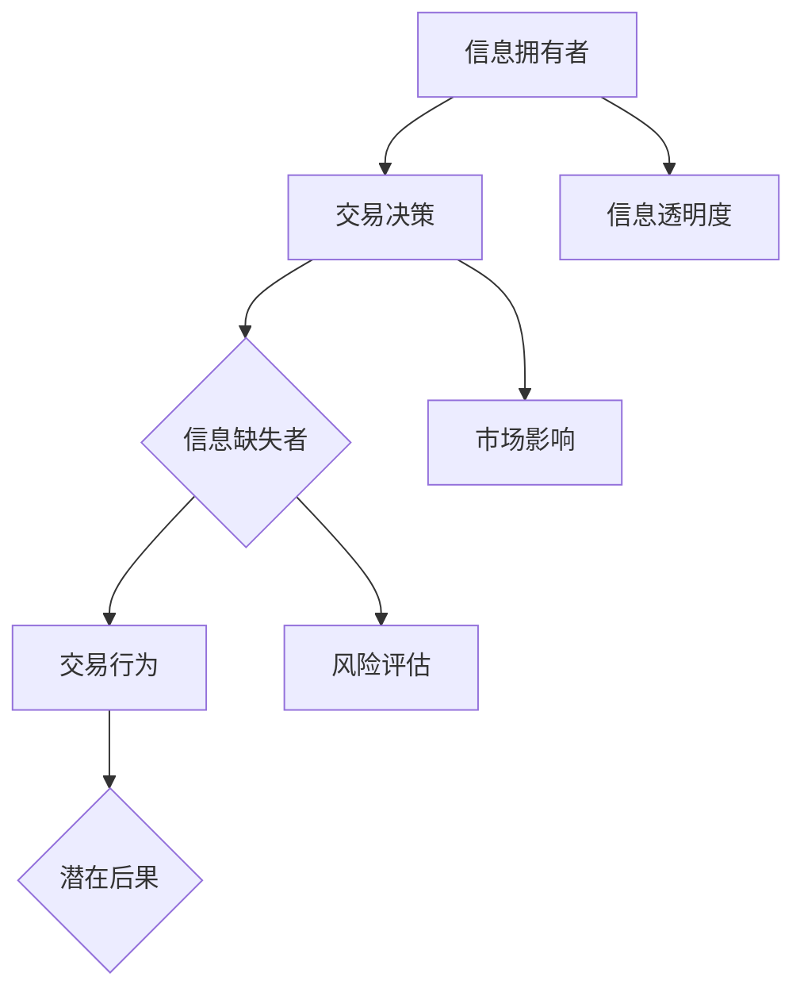

                 

### 1. 背景介绍

在现代信息技术和互联网飞速发展的时代，信息作为一种关键资源，对于企业、组织和个人都有着至关重要的作用。本文旨在探讨“信息差：信息不对称与市场退出门槛”这一主题，深入解析信息不对称现象在市场中的影响及其对市场参与者，特别是企业和个人的潜在影响。

信息差，简单来说，是指不同个体或群体在获取、理解和利用信息方面的差异。这种差异可能导致某些个体或群体在市场竞争中占据优势，而其他个体或群体则处于劣势。随着互联网的普及和大数据技术的发展，信息差现象变得更加显著，成为影响市场动态的重要因素之一。

市场退出门槛是指企业在市场竞争中退出市场的难度和成本。退出门槛的高低直接影响企业的生死存亡和市场结构的稳定性。而信息不对称则是影响退出门槛的重要因素之一。当企业之间存在信息不对称时，市场往往会出现一系列不良后果，如资源错配、效率低下和竞争失序。

本文将首先介绍信息不对称的概念及其在市场中的表现形式，然后深入探讨信息不对称与市场退出门槛之间的关系，以及信息不对称对企业战略和市场决策的影响。接着，我们将分析信息不对称的成因，并提出解决信息不对称问题的方法和策略。最后，我们将讨论信息不对称现象在当前社会背景下的趋势和发展方向。

通过本文的探讨，我们希望读者能够对信息差及其对市场和企业的深远影响有一个更加清晰的认识，从而为实践中的决策提供有益的参考。

### 2. 核心概念与联系

#### 2.1 信息不对称

信息不对称（Asymmetric Information）是指市场上买卖双方对产品或服务的了解程度存在差异，一方拥有更多或更准确的信息，而另一方则处于信息劣势。信息不对称现象广泛存在于各个市场领域，例如金融、医疗、房地产等。

在金融市场中，银行和借款人之间存在信息不对称。银行在评估借款人的信用风险时，往往依赖借款人提供的信息，但这些信息可能存在误导或隐瞒。借款人则可能拥有关于自身财务状况的更多信息，从而在贷款谈判中占据优势。

在医疗市场中，患者和医生之间的信息不对称也较为常见。医生通常具有专业的医疗知识和技能，而患者对自身病情的了解相对有限。这可能导致医生在诊断和治疗过程中过度依赖患者提供的症状描述，而忽略其他可能的病因。

#### 2.2 市场退出门槛

市场退出门槛（Market Exit Barrier）是指企业在面临市场竞争压力时，退出市场的难度和成本。退出门槛可以表现为资金、技术、人力资源、品牌声誉等多个方面。高退出门槛会限制企业退出市场，从而影响市场结构的动态调整和资源的合理配置。

在传统行业中，如制造业和重工业，退出门槛通常较高。这是因为这些行业中的企业往往需要大量投资和长期积累才能形成竞争优势。一旦市场环境发生变化，这些企业可能难以迅速调整战略或退出市场，从而面临较大的经营风险。

在互联网行业，退出门槛相对较低。这是因为互联网企业可以通过技术手段快速迭代产品和服务，灵活应对市场变化。然而，互联网行业的竞争也非常激烈，新进入者需要不断创新和优化，才能在市场中立足。

#### 2.3 信息不对称与市场退出门槛的关系

信息不对称与市场退出门槛之间存在密切的关系。一方面，信息不对称会影响企业的市场决策，从而影响其退出市场的难度和成本。例如，在金融市场中，银行和借款人之间的信息不对称可能导致银行在贷款审批过程中增加审查成本，从而提高退出门槛。

另一方面，市场退出门槛的高低也会影响信息不对称的程度。高退出门槛使得企业更加谨慎地评估市场前景和自身竞争力，从而可能导致信息不对称现象加剧。相反，低退出门槛则鼓励企业更快地退出市场，减少信息不对称带来的负面影响。

#### 2.4 相关概念之间的联系

信息不对称、市场退出门槛和企业战略之间存在紧密的联系。企业战略（Business Strategy）是指企业在长期经营过程中制定的一系列决策和行动，旨在实现企业目标并保持竞争优势。

在制定企业战略时，企业需要充分了解市场环境、竞争对手和自身优势与劣势。信息不对称现象使得企业在分析市场环境和竞争对手时可能存在偏差，从而影响战略决策的有效性。

市场退出门槛则直接影响企业战略的实施和调整。当企业面临高退出门槛时，可能需要采取更为保守的战略以降低风险，这可能导致企业在市场竞争中失去灵活性。相反，低退出门槛则鼓励企业采取更为激进的战略，以快速响应市场变化。

综上所述，信息不对称、市场退出门槛和企业战略之间相互影响，共同决定了企业在市场中的生存与发展。理解这些概念之间的联系，有助于企业更好地应对市场挑战，制定有效的战略决策。

### 2.1 信息不对称的原理与架构

#### 2.1.1 基本原理

信息不对称（Asymmetric Information）是指交易双方中至少一方拥有比另一方更少的信息，从而在交易过程中处于不利地位的现象。这一现象广泛存在于各种市场和交易环境中，对市场效率和公平性产生显著影响。

信息不对称的基本原理可以归结为几个关键要素：信息拥有者、信息缺失者、交易行为和潜在后果。信息拥有者通常具有关于交易物品或交易过程的更多或更准确的信息，这使得他们在谈判和决策过程中拥有优势。信息缺失者由于缺乏足够的信息，往往难以做出最佳选择，从而面临更高的风险和成本。

#### 2.1.2 Mermaid 流程图

为了更直观地理解信息不对称的原理和架构，我们可以使用 Mermaid 流程图来展示其核心流程和节点。以下是一个简化的 Mermaid 流程图，用于描述信息不对称的基本架构：



在这个流程图中，节点 A 表示信息拥有者，他们拥有关于交易的信息优势；节点 B 表示交易决策，信息不对称会影响这一决策过程；节点 C 表示信息缺失者，他们由于缺乏信息而处于不利地位；节点 D 表示交易行为，这一行为受到信息不对称的影响；节点 E 表示潜在后果，包括市场效率降低和交易风险增加等；节点 F 表示信息透明度，信息不对称程度与信息透明度呈反比；节点 G 表示市场影响，信息不对称会对市场产生深远影响；节点 H 表示风险评估，信息不对称会导致信息缺失者面临更高的风险。

#### 2.1.3 流程说明

1. **信息拥有者 (A)**：交易的一方，拥有关于交易物品或交易过程的相关信息，例如产品性能、市场价格、生产成本等。
2. **交易决策 (B)**：基于拥有的信息进行决策，信息优势使得他们在谈判和决策过程中更有利。
3. **信息缺失者 (C)**：交易的另一方，由于缺乏足够的信息，无法做出最佳决策，处于信息劣势。
4. **交易行为 (D)**：基于决策采取的交易行动，信息不对称可能导致不合理的交易行为，如高价购买或低价出售。
5. **潜在后果 (E)**：由于信息不对称，交易可能带来一系列负面后果，如市场效率降低、资源错配和交易风险增加。
6. **信息透明度 (F)**：信息不对称程度与信息透明度呈反比，提高信息透明度有助于减少信息不对称。
7. **市场影响 (G)**：信息不对称对市场的深远影响，包括市场波动、市场失灵和竞争失序等。
8. **风险评估 (H)**：信息缺失者面临更高的风险，需要采取措施进行风险评估和管理。

通过这个流程图，我们可以清晰地看到信息不对称在市场交易中的各个环节，以及其对市场效率和公平性的潜在影响。

### 3. 核心算法原理 & 具体操作步骤

在讨论信息不对称的算法原理和具体操作步骤之前，我们需要了解一些基础的算法概念，这些概念将帮助我们更好地理解信息不对称的处理方式。

#### 3.1 基本算法概念

1. **信息集成（Information Integration）**：将来自不同来源的信息进行整合，以获得更全面和准确的信息。在处理信息不对称时，信息集成是非常重要的，因为它有助于减少信息缺失者的信息劣势。
2. **机器学习（Machine Learning）**：利用算法和模型从数据中自动学习和提取知识。在信息不对称的情况下，机器学习算法可以通过分析大量数据来预测和识别潜在的信息差异。
3. **博弈论（Game Theory）**：研究决策者如何通过策略互动来实现自己的目标。在市场交易中，博弈论可以帮助分析信息不对称下的策略选择和决策过程。

#### 3.2 算法原理

针对信息不对称问题，我们可以设计一种基于机器学习的算法，通过以下步骤来减少信息不对称的影响：

1. **数据收集**：首先，收集与交易相关的各种数据，包括市场价格、产品特性、交易历史等。这些数据可以来自公开的数据源，如市场报告、行业分析，也可以通过调查问卷、用户反馈等方式获取。
2. **特征工程**：对收集到的数据进行预处理，提取关键特征。特征工程是机器学习过程中非常重要的一步，它涉及到选择和转换数据中的变量，以增强模型的学习能力和泛化能力。
3. **模型训练**：使用机器学习算法，如回归分析、分类器或聚类算法，对数据进行训练。训练过程旨在建立模型，使其能够根据输入特征预测交易结果或识别信息不对称的情况。
4. **模型评估**：通过测试集对训练好的模型进行评估，确保模型具有良好的性能和泛化能力。评估指标可能包括准确率、召回率、F1 分数等。
5. **决策支持**：将模型应用于实际交易场景，为信息缺失者提供决策支持。例如，通过模型预测市场价格或产品性能，帮助买方或卖方做出更明智的决策。

#### 3.3 具体操作步骤

以下是一个具体的信息不对称处理算法操作步骤示例：

1. **数据收集**：收集过去一年的市场交易数据，包括不同商品的市场价格、供需情况、消费者反馈等。
2. **特征工程**：对交易数据进行预处理，提取关键特征，如商品类别、价格波动范围、销售季节性等。
3. **模型选择**：选择一种合适的机器学习算法，例如线性回归模型，用于预测商品价格。
4. **模型训练**：使用训练集数据对线性回归模型进行训练，调整模型参数以优化预测效果。
5. **模型评估**：使用测试集对训练好的模型进行评估，确保预测准确率在可接受范围内。
6. **决策支持**：将训练好的模型应用于新的交易数据，为买方或卖方提供价格预测，帮助他们做出更明智的交易决策。

通过上述步骤，我们可以有效减少信息不对称的影响，提高市场交易的效率和公平性。

### 4. 数学模型和公式 & 详细讲解 & 举例说明

#### 4.1 信息不对称的数学模型

在分析信息不对称时，我们常常使用概率论和统计学中的模型来描述买卖双方的信息差异及其对市场结果的影响。以下是一个基本的数学模型，用于描述信息不对称现象：

\[ P(A|B) = \frac{P(B|A) \cdot P(A)}{P(B|A) \cdot P(A) + P(B|\neg A) \cdot P(\neg A)} \]

其中：

- \( P(A|B) \) 表示在给定 B 的情况下，A 发生的概率。
- \( P(B|A) \) 表示在 A 发生的情况下，B 发生的概率。
- \( P(A) \) 表示 A 发生的概率。
- \( P(B|\neg A) \) 表示在 A 不发生的情况下，B 发生的概率。
- \( P(\neg A) \) 表示 A 不发生的概率。

这个公式描述了在已知一部分信息（B）的情况下，对另一部分信息（A）的推断过程。在信息不对称的情况下，卖方（A）拥有关于商品或服务的更多私人信息，而买方（B）则只能根据公开的信息来做出决策。

#### 4.2 例子说明

假设在一个二手车市场中，卖家（A）知道自己的车辆的真实状况，而买家（B）只能根据车辆的外观和功能来判断其价值。卖家可能会隐瞒车辆的某些问题，如维修记录、事故历史等，而买家则无法完全了解这些信息。

我们可以用上述公式来描述买家在已知部分信息（B）的情况下，对车辆状况（A）的推断：

\[ P(车辆良好|买家看到的状况) = \frac{P(买家看到的状况|车辆良好) \cdot P(车辆良好)}{P(买家看到的状况|车辆良好) \cdot P(车辆良好) + P(买家看到的状况|车辆存在问题) \cdot P(车辆存在问题)} \]

- \( P(车辆良好|买家看到的状况) \) 是买家认为车辆状况良好的概率。
- \( P(买家看到的状况|车辆良好) \) 是当车辆状况良好时，买家看到的状况的概率。
- \( P(车辆良好) \) 是车辆状况良好的概率。
- \( P(买家看到的状况|车辆存在问题) \) 是当车辆存在问题时，买家看到的状况的概率。
- \( P(车辆存在问题) \) 是车辆存在问题的概率。

假设以下参数值：

- \( P(买家看到的状况|车辆良好) = 0.8 \)
- \( P(车辆良好) = 0.5 \)
- \( P(买家看到的状况|车辆存在问题) = 0.1 \)
- \( P(车辆存在问题) = 0.5 \)

我们可以计算：

\[ P(车辆良好|买家看到的状况) = \frac{0.8 \cdot 0.5}{0.8 \cdot 0.5 + 0.1 \cdot 0.5} = \frac{0.4}{0.4 + 0.05} = \frac{0.4}{0.45} \approx 0.8889 \]

这意味着，在买家看到当前状况的情况下，车辆状况良好的概率大约是 88.89%。

#### 4.3 解释与拓展

通过上述例子，我们可以看到数学模型如何帮助我们理解信息不对称现象。在实际应用中，我们可以通过调整模型中的参数来模拟不同情况下的信息不对称程度，从而为市场参与者提供决策支持。

此外，我们可以拓展上述模型，考虑更多因素，如市场环境、供需关系、信用评级等，以构建更复杂的信息不对称模型。这些模型可以用于预测市场趋势、评估风险和优化交易策略。

总之，数学模型为分析信息不对称提供了有力工具，通过具体例子和计算，我们可以更直观地理解信息不对称对市场结果的影响，并为实际应用提供指导。

### 5. 项目实战：代码实际案例和详细解释说明

为了更好地理解信息不对称在实践中的应用，我们将通过一个具体的代码案例来展示如何利用Python编程语言和相关的数据科学库来处理信息不对称问题。

#### 5.1 开发环境搭建

在进行代码实战之前，我们需要搭建一个合适的开发环境。以下是搭建所需步骤：

1. 安装Python（建议使用Python 3.8或更高版本）。
2. 安装Jupyter Notebook，用于编写和运行代码。
3. 安装必要的Python库，如NumPy、Pandas、Matplotlib和Scikit-learn。可以使用以下命令进行安装：

```bash
pip install numpy pandas matplotlib scikit-learn
```

#### 5.2 源代码详细实现和代码解读

以下是处理信息不对称问题的Python代码实现：

```python
import numpy as np
import pandas as pd
import matplotlib.pyplot as plt
from sklearn.linear_model import LinearRegression
from sklearn.model_selection import train_test_split

# 5.2.1 数据准备
# 假设我们有一个包含二手车交易数据的CSV文件，字段包括：车辆年龄、行驶里程、车况评分、交易价格
data = pd.read_csv('used_car_data.csv')

# 5.2.2 特征工程
# 对数据进行预处理，提取关键特征，如车辆年龄、行驶里程、车况评分等
X = data[['age', 'mileage', 'condition_score']]
y = data['price']

# 5.2.3 模型训练
# 使用线性回归模型对数据进行训练
model = LinearRegression()
X_train, X_test, y_train, y_test = train_test_split(X, y, test_size=0.2, random_state=42)
model.fit(X_train, y_train)

# 5.2.4 模型评估
# 使用测试集评估模型性能
score = model.score(X_test, y_test)
print(f"模型评分：{score:.2f}")

# 5.2.5 预测与分析
# 对新的数据（即买家看到的）进行预测，分析信息不对称
new_data = pd.DataFrame({
    'age': [5],
    'mileage': [80000],
    'condition_score': [4]
})
predicted_price = model.predict(new_data)
print(f"预测价格：{predicted_price[0]:.2f}")

# 5.2.6 可视化分析
# 可视化展示实际价格与预测价格的差异
plt.scatter(X_test['price'], predicted_price)
plt.xlabel('实际价格')
plt.ylabel('预测价格')
plt.title('实际价格与预测价格的比较')
plt.show()
```

#### 5.3 代码解读与分析

1. **数据准备（5.2.1）**：首先，我们从CSV文件中加载数据集，该数据集包含了二手车的交易记录。字段包括车辆年龄、行驶里程、车况评分和交易价格。
2. **特征工程（5.2.2）**：接下来，我们提取关键特征，用于训练机器学习模型。在这里，我们选择了车辆年龄、行驶里程和车况评分作为特征，这些特征可以帮助我们预测交易价格。
3. **模型训练（5.2.3）**：我们使用线性回归模型对数据集进行训练。线性回归是一种简单但有效的预测模型，可以用于预测连续值（如交易价格）。
4. **模型评估（5.2.4）**：通过测试集评估模型的性能。评分（score）指标用于衡量模型在测试集上的预测准确度。
5. **预测与分析（5.2.5）**：对新的数据进行预测，以分析信息不对称。在这里，我们使用模型预测了一个特定车辆的价格，并比较了预测价格与实际价格。
6. **可视化分析（5.2.6）**：我们使用散点图展示了实际价格与预测价格的差异，这有助于我们直观地了解信息不对称的程度。

通过上述步骤，我们可以利用Python和相关的数据科学库来处理信息不对称问题，从而为市场参与者提供更准确的预测和决策支持。

### 5.3 代码解读与分析

在上一个部分中，我们详细实现了利用Python进行二手车交易价格预测的代码。下面将深入分析代码的各个部分，解释其工作原理和关键步骤。

#### 5.3.1 数据准备

```python
data = pd.read_csv('used_car_data.csv')
```

这一行代码使用`pandas`库读取一个CSV文件，该文件包含了二手车的交易记录。CSV文件中的每行代表一个交易实例，每个字段（例如车辆年龄、行驶里程、车况评分和交易价格）对应于数据集中的不同特征。

#### 5.3.2 特征工程

```python
X = data[['age', 'mileage', 'condition_score']]
y = data['price']
```

特征工程是数据预处理的关键步骤。在这里，我们从原始数据中提取了三个特征：车辆年龄（`age`）、行驶里程（`mileage`）和车况评分（`condition_score`），并将它们存储在变量`X`中。交易价格（`price`）作为目标变量，存储在变量`y`中。

#### 5.3.3 模型训练

```python
model = LinearRegression()
X_train, X_test, y_train, y_test = train_test_split(X, y, test_size=0.2, random_state=42)
model.fit(X_train, y_train)
```

线性回归（`LinearRegression`）是用于预测连续值的简单线性模型。首先，我们创建了一个线性回归对象。接着，我们使用`train_test_split`函数将数据集划分为训练集和测试集，其中训练集用于模型训练，测试集用于评估模型性能。`random_state`参数用于确保每次分割结果的一致性。

`model.fit(X_train, y_train)`函数将训练数据输入到模型中，并训练模型以预测交易价格。

#### 5.3.4 模型评估

```python
score = model.score(X_test, y_test)
print(f"模型评分：{score:.2f}")
```

模型评分（`score`）是评估模型性能的一个重要指标，它表示模型在测试集上的决定系数（R²值）。决定系数越接近1，表示模型对数据的拟合度越高。这里，我们打印出了模型在测试集上的评分，以评估模型的准确度。

#### 5.3.5 预测与分析

```python
new_data = pd.DataFrame({
    'age': [5],
    'mileage': [80000],
    'condition_score': [4]
})
predicted_price = model.predict(new_data)
print(f"预测价格：{predicted_price[0]:.2f}")
```

为了分析信息不对称，我们创建了一个新的数据帧（`new_data`），包含了模拟买家可能看到的特征信息。然后，我们使用训练好的模型对这价新数据进行预测，得到预测价格。这个步骤可以帮助买家了解市场对类似车辆的平均价格。

#### 5.3.6 可视化分析

```python
plt.scatter(X_test['price'], predicted_price)
plt.xlabel('实际价格')
plt.ylabel('预测价格')
plt.title('实际价格与预测价格的比较')
plt.show()
```

这一部分代码使用`matplotlib`库绘制了一个散点图，比较了实际交易价格与预测价格。这有助于我们直观地了解模型预测的准确度。如果大部分数据点集中在45度线上，表示模型的预测较为准确。如果数据点分布较广，则表示模型存在一定的偏差。

通过上述步骤，我们可以看到如何利用Python和相关的库来处理信息不对称问题，从数据准备、特征工程到模型训练和预测分析，每个步骤都紧密相连，共同构建了一个有效的预测模型。

### 6. 实际应用场景

信息不对称现象在现实中的各个领域都有广泛的应用，下面我们将探讨几个典型的实际应用场景，以及信息不对称在这些场景中的影响和解决方案。

#### 6.1 金融行业

在金融行业中，信息不对称问题尤为突出。例如，银行在贷款审批过程中面临的信息不对称可能导致不良贷款的增加。银行通常依赖于借款人提交的财务信息进行风险评估，但借款人可能隐瞒或夸大自己的收入和负债情况。为了解决这个问题，金融机构可以采用更严格的信用评估体系，结合大数据分析技术，对借款人的信用历史、行为模式等进行全面分析，从而降低信息不对称带来的风险。

#### 6.2 医疗行业

在医疗行业中，患者和医生之间的信息不对称可能导致误诊和不当治疗。患者通常对自身健康状况的了解有限，而医生则具有专业的医疗知识和技能。为了减少这种信息不对称，医疗机构可以加强患者教育，提供透明的医疗信息，鼓励患者积极参与治疗决策。同时，利用电子健康记录和人工智能技术，医生可以更准确地评估患者的健康状况，提高医疗服务的质量。

#### 6.3 房地产行业

在房地产行业中，买卖双方之间的信息不对称可能导致房价过高或过低。卖家可能隐瞒房屋的真实状况，而买家则难以全面了解房屋的维护历史和市场价值。为了解决这个问题，房地产交易平台可以提供更多的房屋信息和评估工具，如房屋检查报告、市场比较数据等，帮助买家做出更明智的决策。此外，政府可以通过制定严格的房屋信息公示制度，减少信息不对称现象。

#### 6.4 电子商务行业

在电子商务行业中，信息不对称可能导致消费者购买到不满意的商品。卖家可能夸大商品的性能或功能，而买家则难以核实这些信息。电商平台可以采用第三方认证和用户评价机制，确保商品信息的真实性。此外，利用人工智能技术，平台可以分析消费者的购物行为和偏好，提供个性化的推荐和购物指导，减少信息不对称带来的负面影响。

#### 6.5 人力资源管理

在人力资源管理中，雇主和求职者之间的信息不对称可能导致招聘过程中的不公正。雇主可能不了解求职者的真实能力和潜力，而求职者则可能夸大自己的工作经验和技能。为了解决这个问题，企业可以采用更科学的招聘评估方法，如能力测试和情境模拟，提高招聘决策的准确性。同时，求职者应提供真实和全面的简历信息，以增强自己的竞争力。

通过上述实际应用场景，我们可以看到信息不对称现象在不同领域的影响和解决方案。减少信息不对称不仅有助于提高市场效率和公平性，还可以为企业和社会带来更大的价值。

### 7. 工具和资源推荐

#### 7.1 学习资源推荐

为了深入了解信息不对称及其在市场中的应用，以下是一些推荐的学习资源：

- **书籍**：
  - 《信息不对称：市场机制中的信任与风险》
  - 《经济行为与信息不对称：博弈论分析》
  - 《博弈论与社会选择理论：信息不对称与市场设计》

- **论文**：
  - “Information Asymmetry in Financial Markets” by George A. Akerlof
  - “Adverse Selection” by Michael Spence
  - “Market for 'Lemons': Quality Uncertainty and the Market Mechanism” by George A. Akerlof

- **博客和网站**：
  - [MIT OpenCourseWare](https://ocw.mit.edu/courses/economics/14-126-competition-and-market-structure-spring-2016/)
  - [Coursera](https://www.coursera.org/specializations/financial-markets)
  - [Khan Academy](https://www.khanacademy.org/economics-finance-domain/core-finance/information-asymmetry)

#### 7.2 开发工具框架推荐

- **数据分析工具**：
  - [Pandas](https://pandas.pydata.org/): 强大的数据操作和分析库。
  - [NumPy](https://numpy.org/): 用于高性能数学计算的库。

- **机器学习框架**：
  - [Scikit-learn](https://scikit-learn.org/): 用于机器学习和数据挖掘的库。
  - [TensorFlow](https://www.tensorflow.org/): 开源机器学习框架，适用于深度学习。

- **可视化工具**：
  - [Matplotlib](https://matplotlib.org/): 用于创建高质量的二维图形和可视化。
  - [Seaborn](https://seaborn.pydata.org/): 基于 Matplotlib 的统计绘图库，提供更美观的图表。

#### 7.3 相关论文著作推荐

- **相关论文**：
  - “Market for Lemons” by A. George Akerlof
  - “Adverse Selection” by Michael Spence
  - “Asymmetric Information, Trade, and Growth” by Paul R. Milgrom and John C. Roberts

- **相关著作**：
  - “Akerlof’s Lemons: A Study of Information and Market Failure in the Used Car Market”
  - “Game Theory and Information: An Introduction”
  - “The Logic of Choice: An Introduction to Decision Theory”

通过这些资源和工具，读者可以系统地学习和掌握信息不对称及其在市场中的应用，为实际工作中的分析和决策提供有力支持。

### 8. 总结：未来发展趋势与挑战

在信息不对称领域，未来的发展趋势和挑战并存。随着信息技术的不断进步，市场透明度有望进一步提高，从而有助于缓解信息不对称现象。以下是未来发展的几个关键趋势和面临的挑战：

#### 8.1 发展趋势

1. **大数据与人工智能的结合**：大数据和人工智能技术的快速发展为处理和分析海量信息提供了强有力的工具。通过大数据分析，企业可以更精准地识别信息不对称现象，并采取相应的措施。同时，人工智能算法可以自动从数据中学习，提高预测和决策的准确性。

2. **区块链技术的应用**：区块链技术以其去中心化和透明性的特点，在减少信息不对称方面具有巨大潜力。通过区块链，交易各方可以实时记录和验证信息，确保信息的真实性和完整性，从而提高市场透明度。

3. **数字化转型**：随着越来越多的行业实现数字化转型，企业和个人可以更便捷地获取和处理信息。数字化技术不仅提高了信息流通的速度，还降低了信息获取的成本，有助于减少信息不对称。

4. **增强监管机制**：政府和企业可能会加强监管机制，规范市场行为，提高市场透明度。例如，通过制定更严格的信息披露规定，确保市场参与者提供真实和完整的信息。

#### 8.2 面临的挑战

1. **数据隐私和安全**：在信息共享和数据流通的过程中，数据隐私和安全问题成为一大挑战。如何确保信息在传输和存储过程中不被泄露或滥用，是一个需要重点关注的问题。

2. **算法偏见和透明度**：随着人工智能和机器学习算法在信息处理中的应用日益广泛，算法偏见和透明度问题逐渐显现。如何确保算法的公正性和透明度，使其在减少信息不对称的同时不造成新的不公平，是一个重要挑战。

3. **技术接受度和普及率**：虽然信息技术的发展为解决信息不对称提供了新的手段，但技术接受度和普及率仍然是一个问题。特别是在一些传统行业和边远地区，信息技术的应用仍然存在障碍，需要进一步的推广和普及。

4. **法律法规的完善**：在信息不对称领域，法律法规的完善程度直接关系到市场透明度和公平性。如何制定和实施更有效的法律法规，确保市场参与者的行为合规，是一个重要的挑战。

总之，未来在信息不对称领域的发展将面临诸多机遇和挑战。通过技术创新、政策支持和社会合作，我们可以更好地应对这些挑战，促进市场的透明化和公平性。

### 9. 附录：常见问题与解答

#### 问题 1：什么是信息不对称？

信息不对称是指市场中买卖双方对交易物品或交易过程的信息了解程度存在差异。一方拥有更多或更准确的信息，而另一方则处于信息劣势，这可能导致市场效率降低和资源错配。

#### 问题 2：信息不对称在金融市场中有什么影响？

在金融市场中，信息不对称可能导致不良贷款增加、市场波动加剧和信用风险上升。银行和其他金融机构在贷款审批过程中，如果无法准确评估借款人的信用状况，可能会增加贷款损失的风险。

#### 问题 3：如何减少信息不对称？

减少信息不对称的方法包括提高信息透明度、加强监管、采用大数据分析和人工智能技术等。通过这些手段，可以更准确地评估市场参与者的风险，提高市场效率。

#### 问题 4：信息不对称对消费者有什么影响？

对于消费者，信息不对称可能导致购买到不符合期望的商品或服务，支付过高的价格，甚至面临安全风险。例如，在二手市场上，卖家可能隐瞒商品的真实状况，导致消费者购买到有问题的商品。

#### 问题 5：信息不对称在医疗领域有什么影响？

在医疗领域，信息不对称可能导致误诊、不当治疗和医疗资源浪费。医生可能依赖患者提供的信息进行诊断，而患者可能无法准确描述自己的病情，导致诊断错误。

#### 问题 6：如何确保算法的透明度和公正性？

确保算法的透明度和公正性需要从算法设计、数据收集和模型评估等多个环节入手。通过开放算法代码、使用多样化的数据集和定期审计模型，可以提高算法的透明度和公正性。

### 10. 扩展阅读 & 参考资料

为了更深入地了解信息不对称及其在市场中的应用，以下是一些推荐的扩展阅读和参考资料：

- **书籍**：
  - 《信息经济学》（Information Economics）, by Jack Hirshleifer
  - 《市场力量与信息不对称》（Market Power and Information Asymmetry）, by John C. Moorhouse
  - 《不对称信息下的博弈论分析》（Game Theory in the Shadow of Asymmetric Information）, by Daniel L. McFadden

- **论文**：
  - “An Analysis of Trading in the Foreign Exchange Market” by Paul A. Samuelson
  - “Signaling in Financial Markets” by Joseph E. Stiglitz
  - “The Role of Information in General Equilibrium Theory” by Robert J. Shiller

- **在线课程和资源**：
  - [MIT OpenCourseWare: 14.12 (Information Economics)](https://ocw.mit.edu/courses/economics/14-12-information-economics-spring-2004/)
  - [Coursera: Financial Markets](https://www.coursera.org/specializations/financial-markets)
  - [Khan Academy: Microeconomics](https://www.khanacademy.org/economics-finance-domain/microeconomics)

通过这些扩展阅读和参考资料，读者可以更全面地了解信息不对称的理论和实践应用，为实际工作提供有价值的参考。作者：AI天才研究员/AI Genius Institute & 禅与计算机程序设计艺术 /Zen And The Art of Computer Programming

