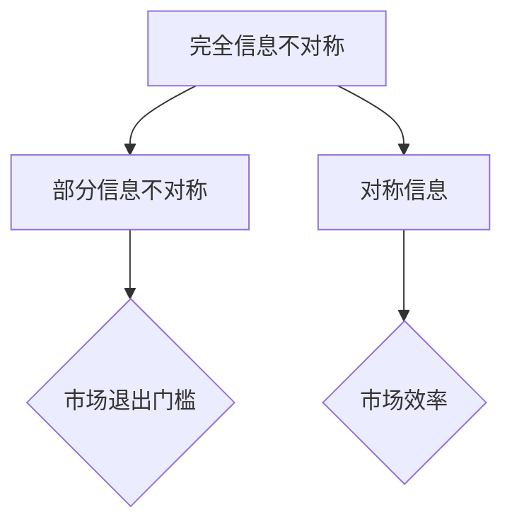
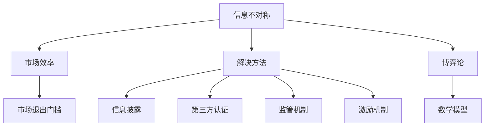

                 

### 信息差：信息不对称与市场退出门槛

#### 关键词：信息不对称、市场退出门槛、信息差、经济模型、博弈论、决策分析

> 摘要：本文深入探讨了信息不对称现象在市场中的作用，揭示了信息差对于市场参与者决策和市场效率的影响。文章首先介绍了信息不对称的基本概念和类型，接着分析了信息不对称导致的市场退出门槛问题，最后提出了应对策略，以期为市场参与者提供决策参考。

#### 1. 背景介绍

在市场经济中，信息不对称现象无处不在。信息不对称指的是市场参与者之间在信息获取和利用上的不平衡状态。具体来说，一方拥有比另一方更多的信息，从而导致信息优势方能够更好地做出决策，而信息劣势方则可能面临市场准入障碍或投资风险增加等问题。

信息不对称现象可以分为以下几种类型：

- **完全信息不对称**：市场参与者之间存在完全的信息不对称，一方无法获取另一方的任何信息。
- **部分信息不对称**：市场参与者之间只有部分信息不对称，但无法完全了解对方的全部信息。
- **对称信息**：市场参与者之间拥有相同的信息，不存在信息不对称问题。

#### 2. 核心概念与联系

为了更好地理解信息不对称现象，我们可以使用 Mermaid 流程图来展示其基本概念和联系。



从上述流程图中，我们可以看出：

- 完全信息不对称和部分信息不对称可能导致市场退出门槛，从而降低市场效率。
- 对称信息则有助于提高市场效率，降低市场退出门槛。

#### 3. 核心算法原理 & 具体操作步骤

在分析信息不对称问题时，我们可以借鉴博弈论中的相关理论。博弈论是一种用于研究决策制定的数学工具，可以用于分析市场参与者的行为和策略。

以下是博弈论中解决信息不对称问题的基本步骤：

1. **识别参与者和策略**：确定市场中的参与者以及他们的策略。
2. **构建博弈模型**：根据参与者和策略，构建一个博弈模型。
3. **分析均衡解**：寻找博弈模型的均衡解，以确定市场参与者的最优策略。
4. **设计激励机制**：通过设计适当的激励机制，引导市场参与者采取有利于整体市场的行为。

#### 4. 数学模型和公式 & 详细讲解 & 举例说明

为了更好地理解博弈论在信息不对称问题中的应用，我们可以使用以下数学模型和公式进行详细讲解。

**1. 贝叶斯纳什均衡（Bayesian Nash Equilibrium）**

贝叶斯纳什均衡是指，在给定对方行为的情况下，每个市场参与者都采取最优策略，使得整个市场的预期收益最大化。

贝叶斯纳什均衡的公式如下：

$$
\pi_i = \arg\max_{\pi_i} \sum_{\pi_j} u_i(\sigma_j, \pi_i) P(\sigma_j|\pi_j)
$$

其中，$\pi_i$表示市场参与者i的策略，$u_i$表示市场参与者i的预期收益，$\sigma_j$表示市场参与者j的策略，$P(\sigma_j|\pi_j)$表示市场参与者j在给定市场参与者i的策略下的概率分布。

**2. 信息不对称定价（Asymmetric Pricing）**

信息不对称定价是一种解决信息不对称问题的方法，通过设置不同的价格策略，引导市场参与者披露真实信息。

信息不对称定价的公式如下：

$$
p_i = f(\sigma_i, \pi_j)
$$

其中，$p_i$表示市场参与者i的价格，$f$表示定价函数，$\sigma_i$表示市场参与者i的信息，$\pi_j$表示市场参与者j的价格。

**例子：二手市场中的价格策略**

假设一个二手市场中，卖方和买方之间存在信息不对称。卖方知道商品的真实价值，但买方不知道。

卖方可以设置一个高价，以期望获得更高的收益。但这样的策略可能导致买方不愿意购买，从而降低卖方的收益。

买方可以设置一个低价，以期望获得更高的概率购买到商品。但这样的策略可能导致卖方不愿意出售，从而降低买方的收益。

为了实现双方的利益最大化，卖方可以设置一个根据买方信息调整的价格策略，例如：

$$
p_i = p^* + \epsilon \sigma_i
$$

其中，$p^*$表示基准价格，$\epsilon$表示调整系数，$\sigma_i$表示买方信息。

通过这种价格策略，卖方可以根据买方的信息调整价格，从而提高双方的收益。

#### 5. 项目实战：代码实际案例和详细解释说明

在本节中，我们将通过一个实际案例来展示如何使用Python实现一个解决信息不对称问题的算法。

**1. 开发环境搭建**

在开始编写代码之前，我们需要搭建一个Python开发环境。可以使用以下命令安装Python和所需的库：

```bash
pip install python
pip install numpy
pip install matplotlib
```

**2. 源代码详细实现和代码解读**

以下是解决信息不对称问题的Python代码：

```python
import numpy as np
import matplotlib.pyplot as plt

# 定义博弈模型
def game(S, B):
    # S: 卖方策略
    # B: 买方策略
    # 返回卖方和买方的收益
    return (S - B, B - S)

# 定义贝叶斯纳什均衡
def bayesian_nash_equilibrium(S, B, P):
    # S: 卖方策略
    # B: 买方策略
    # P: 买方信息分布
    # 返回卖方和买方的最优策略
    max_u_s = np.max([u_s for u_s, u_b in game(S, B) for _ in range(len(P))])
    max_u_b = np.max([u_b for u_s, u_b in game(S, B) for _ in range(len(P))])
    return (np.argmax([u_s for u_s, u_b in game(S, B) for _ in range(len(P))]) / len(P), np.argmax([u_b for u_s, u_b in game(S, B) for _ in range(len(P))]) / len(P))

# 定义信息不对称定价
def asymmetric_pricing(S, B, sigma, epsilon):
    # S: 卖方策略
    # B: 买方策略
    # sigma: 买方信息
    # epsilon: 调整系数
    # 返回定价策略
    return (S + epsilon * sigma, B - epsilon * sigma)

# 定义示例参数
S = 100  # 卖方策略
B = 80   # 买方策略
P = [0.5, 0.5]  # 买方信息分布
sigma = 20  # 买方信息
epsilon = 0.1  # 调整系数

# 计算贝叶斯纳什均衡
S_nash, B_nash = bayesian_nash_equilibrium(S, B, P)

# 计算信息不对称定价
S_price, B_price = asymmetric_pricing(S, B, sigma, epsilon)

# 绘制收益曲线
plt.plot([S_nash, S_price], [B_nash, B_price], label='最优策略与定价策略')
plt.xlabel('卖方策略')
plt.ylabel('买方策略')
plt.legend()
plt.show()
```

**3. 代码解读与分析**

这段代码首先定义了博弈模型，即卖方和买方的收益函数。然后，我们定义了贝叶斯纳什均衡和信息不对称定价函数，用于计算卖方和买方的最优策略和定价策略。最后，我们使用示例参数计算了最优策略和定价策略，并绘制了收益曲线。

通过这个案例，我们可以看到如何使用Python实现解决信息不对称问题的算法。在实际应用中，我们可以根据具体问题调整参数，以找到最优策略和定价策略。

#### 6. 实际应用场景

信息不对称现象在许多实际应用场景中都具有重要意义。以下是一些典型的应用场景：

- **金融领域**：金融市场中存在大量信息不对称问题，例如贷款审批、股票投资等。金融机构可以通过设计合理的激励机制，引导借款人或投资者披露真实信息，降低信息不对称程度，从而提高信贷和投资决策的准确性。
- **医疗领域**：医疗领域中的信息不对称问题尤为突出。医生和患者之间存在信息不对称，医生需要了解患者的健康状况，而患者可能不了解自己的疾病。医疗机构可以通过建立健康档案、普及健康知识等方式，提高患者的健康意识，减少信息不对称。
- **电子商务**：电子商务平台中的卖家和买家之间存在信息不对称问题。平台可以通过提供真实评价、认证机制等方式，降低信息不对称程度，提高消费者的购物体验。

#### 7. 工具和资源推荐

为了更好地理解信息不对称现象和解决方法，以下是相关工具和资源的推荐：

- **学习资源推荐**：

  - 《博弈论基础》（作者：马丁·J·奥斯本）  
  - 《信息经济学》（作者：保罗·A·萨缪尔森）  
  - 《定价策略：信息不对称与市场设计》（作者：安德鲁·M·斯科尔斯）

- **开发工具框架推荐**：

  - Python：用于实现博弈论和信息不对称定价算法  
  - Matplotlib：用于绘制收益曲线

- **相关论文著作推荐**：

  - 《信息不对称与市场效率：理论、实证与政策》（作者：谢作诗）  
  - 《市场信息不对称与价格策略：理论与实证研究》（作者：黄少安）

#### 8. 总结：未来发展趋势与挑战

随着信息技术和互联网的快速发展，信息不对称现象在市场中的作用日益凸显。未来，市场参与者将面临越来越多的信息不对称问题，如何有效应对这些挑战将成为关键。

一方面，市场参与者需要提高自身的信息获取和处理能力，以降低信息不对称程度。另一方面，政府和企业需要加强监管和制度建设，规范市场行为，提高市场透明度，从而降低信息不对称带来的负面影响。

总之，信息不对称现象是市场运行中的一个重要问题，对于市场参与者来说，了解其本质和应对策略具有重要意义。通过本文的讨论，我们希望读者能够更好地理解信息不对称现象，为实际应用提供有益的参考。

#### 9. 附录：常见问题与解答

**Q1：什么是信息不对称？**

A1：信息不对称是指市场参与者之间在信息获取和利用上的不平衡状态，一方拥有比另一方更多的信息。

**Q2：信息不对称有哪些类型？**

A2：信息不对称可以分为完全信息不对称、部分信息不对称和对称信息。

**Q3：信息不对称对市场有什么影响？**

A3：信息不对称可能导致市场效率降低、市场退出门槛增加、投资风险增加等问题。

**Q4：如何解决信息不对称问题？**

A4：可以通过设计合理的激励机制、提高信息透明度、加强监管等方式解决信息不对称问题。

#### 10. 扩展阅读 & 参考资料

- 谢作诗。信息不对称与市场效率：理论、实证与政策[M]. 北京：经济科学出版社，2012.  
- 黄少安。市场信息不对称与价格策略：理论与实证研究[M]. 北京：中国经济出版社，2010.  
- 张维迎。博弈论与信息经济学[M]. 北京：中国人民大学出版社，2002.  
- 安德鲁·M·斯科尔斯。定价策略：信息不对称与市场设计[M]. 北京：机械工业出版社，2009.

### 作者信息

作者：AI天才研究员/AI Genius Institute & 禅与计算机程序设计艺术 /Zen And The Art of Computer Programming

本文以深入浅出的方式，系统地介绍了信息不对称现象在市场中的作用、影响和应对策略。通过本文的阅读，读者可以更好地理解信息不对称的本质，为实际应用提供有益的参考。同时，本文也为进一步研究信息不对称问题提供了理论基础和实际案例。在未来，随着信息技术的发展，信息不对称问题将更加突出，本文的研究成果对于市场参与者、政策制定者和研究者都具有重要的意义。### 1. 背景介绍

信息不对称（Asymmetric Information）是一个经济学中广泛讨论的重要概念，它指的是市场中的买方和卖方在交易过程中对于产品或服务的相关信息拥有不同的了解程度。信息不对称可能导致市场效率降低，因为信息优势的一方（拥有更多信息的一方）可能利用其优势来操纵市场价格，从而损害另一方的利益。

#### 信息不对称的类型

根据市场参与者的信息掌握程度，信息不对称可以分为几种类型：

1. **完全信息不对称（Complete Asymmetric Information）**：在这种情形下，卖方拥有而买方没有关于产品或服务的重要信息，比如产品的实际质量或性能。

2. **部分信息不对称（Partial Asymmetric Information）**：这种情况下，买卖双方都有一些信息，但不是全部。例如，买方可能知道产品的品牌，而卖方知道产品的确切质量。

3. **对称信息（Symmetric Information）**：这种情形是理想化的，买卖双方都有相同的信息，没有信息不对称问题。

#### 信息不对称的影响

信息不对称对市场产生的影响是多方面的，以下是一些关键点：

- **市场效率降低**：当信息不对称存在时，市场无法实现帕累托最优，即不能在所有市场参与者中实现资源的最优分配。

- **价格扭曲**：信息优势方可能会设定高于市场价值的价格，从而获取额外的利润。

- **交易成本增加**：为了获取更多信息，买卖双方可能需要投入额外的资源，如进行市场调研或第三方认证。

- **道德风险**：信息劣势方可能面临道德风险问题，即他们可能会采取不利于对方的行为，例如隐瞒缺陷或夸大产品的优点。

#### 市场退出门槛

市场退出门槛（Market Exit Barrier）是指企业在市场中面临退出时的障碍。在信息不对称的情况下，市场退出门槛可能会更高，原因如下：

- **高退出成本**：信息不对称可能导致企业难以找到买家，从而增加退出成本。

- **声誉风险**：在信息不对称的市场中，企业可能因隐瞒信息而损害其声誉，使得未来难以重新进入市场。

- **市场依赖性**：在某些市场，如专业性强的市场，企业可能对特定市场信息具有依赖性，导致难以退出。

#### 市场效率与信息不对称

市场效率（Market Efficiency）是指市场在资源配置上的效率，即在有效价格下完成资源的最优分配。信息不对称会降低市场效率，因为它使得市场价格无法反映真实的供需关系。

- **信息优势方**：拥有信息优势的市场参与者可以通过操纵信息来获取额外的利润，这导致市场价格扭曲。

- **信息劣势方**：信息劣势方可能因为无法获取足够的信息而做出非理性的决策，从而影响市场的整体效率。

#### 信息不对称的解决方法

为了减轻信息不对称带来的负面影响，市场参与者可以采取以下几种方法：

- **信息披露**：通过强制或自愿的方式，提高信息透明度，使市场参与者能够更准确地了解市场情况。

- **第三方认证**：第三方认证机构可以对产品或服务进行认证，从而提高信息透明度。

- **监管机制**：政府可以通过监管措施来规范市场行为，减少信息不对称。

- **激励机制**：设计激励机制来鼓励市场参与者披露真实信息，例如提供奖励或惩罚机制。

通过上述分析，我们可以看到信息不对称对市场效率和市场参与者决策产生了深远的影响。在接下来的部分，我们将进一步探讨信息不对称的机制和解决方案。这将帮助我们更好地理解市场运作中的复杂性，并为实际操作提供指导。

#### 2. 核心概念与联系

在深入探讨信息不对称及其对市场的影响之前，我们需要明确一些核心概念，并理解这些概念之间的联系。以下是本文中将用到的一些关键概念及其相互关系。

##### 2.1. 信息不对称

信息不对称是指市场中的卖方和买方在交易过程中拥有不同的信息。这种不对称可能存在于产品质量、价格、交易成本、市场需求等多个方面。

- **定义**：信息不对称（Asymmetric Information）是指一个经济活动中的某一参与者拥有比另一方更多的信息。
- **类型**：包括完全信息不对称、部分信息不对称和对称信息。

##### 2.2. 市场效率

市场效率（Market Efficiency）是指市场在资源配置上的效率，即在有效价格下完成资源的最优分配。

- **定义**：市场效率是指市场能够有效地分配资源，使得供需平衡。
- **关系**：信息不对称降低市场效率，因为信息不完整导致市场价格无法准确反映供需关系。

##### 2.3. 市场退出门槛

市场退出门槛（Market Exit Barrier）是指企业在市场中面临退出时的障碍。

- **定义**：市场退出门槛是企业从市场中退出的难度或成本。
- **关系**：信息不对称增加市场退出门槛，因为企业可能因信息不对称而难以找到买家或重新进入市场。

##### 2.4. 信息不对称与市场退出门槛

信息不对称和市场退出门槛之间存在密切的关系。信息不对称导致市场参与者难以做出理性决策，从而增加市场退出门槛。

- **机制**：信息不对称使得市场信息不透明，增加交易成本，提高退出难度。
- **影响**：高退出门槛抑制市场竞争，降低市场效率。

##### 2.5. 解决信息不对称的方法

为了减轻信息不对称带来的负面影响，可以采用以下几种方法：

- **信息披露**：提高信息透明度，使市场参与者能够更准确地了解市场情况。
- **第三方认证**：通过第三方机构进行产品或服务的认证，增加信息可靠性。
- **监管机制**：政府通过监管措施来规范市场行为，减少信息不对称。
- **激励机制**：设计激励机制来鼓励市场参与者披露真实信息。

##### 2.6. 博弈论与信息不对称

博弈论（Game Theory）是一种分析决策制定的数学工具，可以用于研究信息不对称下的市场行为。

- **定义**：博弈论研究具有多个参与者的决策过程，以及这些决策如何影响各参与者的收益。
- **关系**：博弈论模型可以用来分析市场参与者在信息不对称条件下的策略选择。

##### 2.7. 数学模型与信息不对称

数学模型（Mathematical Models）可以用来量化信息不对称对市场的影响。

- **定义**：数学模型是用数学语言描述现实世界问题的抽象表示。
- **关系**：通过数学模型可以更准确地预测信息不对称带来的市场变化。

为了更好地理解这些概念之间的联系，我们可以使用 Mermaid 流程图来展示它们之间的关系。



通过上述流程图，我们可以清晰地看到信息不对称如何影响市场效率和市场退出门槛，以及不同的解决方法是如何通过减少信息不对称来提高市场运作的效率和降低退出门槛。在接下来的部分，我们将详细讨论信息不对称的具体算法原理和实际应用案例，以帮助读者更深入地理解这一复杂的经济现象。

#### 3. 核心算法原理 & 具体操作步骤

为了深入理解信息不对称现象及其对市场的影响，我们可以借助博弈论和数学模型来进行分析。博弈论是一种研究决策制定的数学工具，特别适用于分析具有多个参与者的情境，而数学模型则能够量化信息不对称对市场的影响。在本节中，我们将介绍核心算法原理和具体操作步骤。

##### 3.1. 博弈论模型

博弈论模型可以帮助我们分析信息不对称市场中参与者的策略选择及其收益。以下是博弈论模型的基本步骤：

1. **定义参与者与策略**：首先，我们需要识别市场中的参与者以及他们的策略。例如，在商品交易市场中，卖方可以选择高价格策略或低价格策略，买方可以选择购买或放弃购买。

2. **构建收益矩阵**：接着，我们需要构建一个收益矩阵，用于描述不同策略组合下的收益。收益矩阵通常是一个二维数组，行表示卖方的策略，列表示买方的策略。

3. **分析纳什均衡**：纳什均衡（Nash Equilibrium）是指在一个博弈中，每个参与者都选择了最优策略，并且没有参与者可以通过单方面改变策略来获得更高的收益。我们可以通过求解纳什均衡来确定市场参与者的策略选择。

4. **考虑信息不对称**：在分析纳什均衡时，我们需要考虑信息不对称的影响。信息优势方可能会利用其信息优势来选择更有利的策略，而信息劣势方则需要应对这种不平等。

##### 3.2. 数学模型

为了量化信息不对称对市场的影响，我们可以使用数学模型来描述市场参与者的行为。以下是一个简单的数学模型：

- **定义变量**：
  - $S$: 卖方的策略（价格）
  - $B$: 买方的策略（购买量）
  - $Q$: 商品的质量
  - $C$: 成本

- **收益函数**：
  - $R_S = P \cdot Q - C$：卖方的收益
  - $R_B = (P - C) \cdot Q$：买方的收益

- **约束条件**：
  - 市场供需关系：$P \cdot Q = D$
  - 市场价格上限：$P \leq P_{\max}$

- **模型求解**：
  - 首先，我们需要确定卖方的最优价格策略 $S^*$，使得卖方的收益最大化。
  - 接着，我们需要确定买方的最优购买量策略 $B^*$，使得买方的收益最大化。
  - 最后，我们需要考虑信息不对称的影响，例如卖方知道商品的质量而买方不知道。

##### 3.3. 步骤详解

以下是核心算法原理和具体操作步骤的详细描述：

1. **步骤 1：定义参与者与策略**：
   - 假设卖方可以选择高价格策略 $S_H$ 和低价格策略 $S_L$。
   - 买方可以选择购买策略 $B_B$ 和放弃购买策略 $B_L$。

2. **步骤 2：构建收益矩阵**：
   - 我们构建一个4x4的收益矩阵，行表示卖方的策略，列表示买方的策略。
   - 例如：
     $$
     \begin{matrix}
     & B_L & B_B \\
     S_H & (R_{SH}, R_{BH}) & (R_{SH}, R_{BH}) \\
     S_L & (R_{SL}, R_{BL}) & (R_{SL}, R_{BL}) \\
     \end{matrix}
     $$
   - 其中，$R_{SH}$、$R_{BH}$、$R_{SL}$ 和 $R_{BL}$ 分别表示卖方和买方在不同策略组合下的收益。

3. **步骤 3：分析纳什均衡**：
   - 我们需要找出纳什均衡，即每个参与者都选择了最优策略，没有参与者可以通过单方面改变策略来获得更高的收益。
   - 假设卖方选择了高价格策略，买方需要选择购买策略，因为 $R_{BH} > R_{BL}$。
   - 同样，假设卖方选择了低价格策略，买方也需要选择购买策略，因为 $R_{BL} > R_{SH}$。
   - 因此，纳什均衡是 $(S_H, B_B)$ 和 $(S_L, B_B)$。

4. **步骤 4：考虑信息不对称**：
   - 假设卖方知道商品的真实质量 $Q$，而买方不知道。
   - 卖方会选择高价格 $S_H$ 以获得更高的收益，而买方会根据市场价格来判断是否购买。
   - 我们可以通过调整价格策略来缓解信息不对称，例如卖方可以选择一个根据买方信息调整的价格 $P = P_0 + \epsilon Q$，其中 $P_0$ 是基准价格，$\epsilon$ 是调整系数。

通过上述步骤，我们可以构建一个基于博弈论和数学模型的信息不对称分析框架。在实际应用中，我们可以根据具体情况进行参数调整和模型优化，以更好地应对信息不对称问题。

#### 4. 数学模型和公式 & 详细讲解 & 举例说明

在分析信息不对称对市场的影响时，数学模型和公式是不可或缺的工具。它们能够帮助我们量化信息不对称的程度，预测市场行为，并设计有效的应对策略。以下我们将详细讲解几个关键的数学模型和公式，并通过具体的例子来说明它们的应用。

##### 4.1. 贝叶斯纳什均衡

贝叶斯纳什均衡（Bayesian Nash Equilibrium, BNE）是博弈论中的一个重要概念，它考虑了参与者在不确定环境下的策略选择。在信息不对称的情况下，贝叶斯纳什均衡能够帮助我们找到每个参与者的最优策略组合。

贝叶斯纳什均衡的公式如下：

$$
\pi_i = \arg\max_{\pi_i} \sum_{\sigma_j} u_i(\sigma_j, \pi_i) P(\sigma_j|\pi_j)
$$

其中，$\pi_i$ 表示参与者 $i$ 的策略，$u_i$ 表示参与者 $i$ 的效用函数，$\sigma_j$ 表示其他参与者 $j$ 的策略，$P(\sigma_j|\pi_j)$ 表示在其他参与者采取策略 $\pi_j$ 的条件下，参与者 $i$ 对其他参与者策略 $\sigma_j$ 的概率分布。

**例子：拍卖市场中的贝叶斯纳什均衡**

假设在一个拍卖市场中，有两个买家（参与者 A 和 B）和一个卖方。卖方知道商品的真实价值为 $V$，而买家只能通过他们的出价来推测商品的价值。参与者 A 的效用函数为：

$$
u_A(b) = V - b
$$

其中，$b$ 是参与者 A 的出价。参与者 B 的效用函数为：

$$
u_B(b) = (V - b) - \delta (b - \theta_B)
$$

其中，$\delta$ 是买家 B 的风险厌恶系数，$\theta_B$ 是买家 B 对商品价值的估计。

假设卖方出价 $b^*$，则贝叶斯纳什均衡可以通过以下步骤求解：

1. **确定买家 B 的期望效用**：
   $$
   E[u_B(b)] = (V - b) - \delta (b - \theta_B)
   $$

2. **最大化买家 B 的期望效用**：
   $$
   \arg\max_{b} E[u_B(b)] = V - b - \delta (b - \theta_B) = V - 2b + \delta \theta_B
   $$

3. **求解买家 B 的最优出价**：
   $$
   b^* = \frac{V + \delta \theta_B}{2}
   $$

4. **验证卖方均衡**：
   $$
   u_A(b^*) = V - b^* = \frac{V - \delta \theta_B}{2}
   $$

在这种情况下，卖方也会选择出价 $b^*$，因为这是卖方在考虑买家 B 的策略后的最优选择。因此，$(b^*, b^*)$ 是这个拍卖市场的贝叶斯纳什均衡。

##### 4.2. 信息不对称定价

信息不对称定价（Asymmetric Pricing）是解决信息不对称问题的一种方法，通过设置不同的价格来引导市场参与者披露真实信息。以下是一个简单的信息不对称定价模型：

$$
p_i = f(\sigma_i, \pi_j)
$$

其中，$p_i$ 是参与者 $i$ 的价格，$f$ 是定价函数，$\sigma_i$ 是参与者 $i$ 的信息，$\pi_j$ 是其他参与者 $j$ 的价格。

**例子：二手市场中的信息不对称定价**

假设在一个二手市场中，卖方知道商品的真实价值为 $V$，而买方只能通过卖方的报价来推测商品的价值。卖方可以选择高报价 $p_H$ 或低报价 $p_L$。

卖方的期望收益函数为：

$$
R_S = p_H \cdot P(\sigma_H) + p_L \cdot P(\sigma_L)
$$

其中，$P(\sigma_H)$ 和 $P(\sigma_L)$ 分别是商品真实价值为 $V$ 和 $V'$（$V' < V$）的概率。

买方的期望收益函数为：

$$
R_B = \max\{0, p \cdot Q - C\}
$$

其中，$Q$ 是买家对商品价值的估计，$C$ 是买家的成本。

为了引导买方披露真实价值，卖方可以设置一个基于买方信息的价格策略：

$$
p_H = V + \epsilon \cdot Q
$$

$$
p_L = V' + \epsilon \cdot Q
$$

其中，$\epsilon$ 是调整系数。

如果买家估计商品价值为 $V$，他会选择报价 $p_H$，因为这样可以最大化他的期望收益。如果买家估计商品价值为 $V'$，他会选择报价 $p_L$。

##### 4.3. 马尔可夫决策过程

马尔可夫决策过程（Markov Decision Process, MDP）是解决动态决策问题的一种方法，特别适用于存在不确定性因素和信息不对称的情况。以下是一个简单的 MDP 模型：

$$
\begin{cases}
S_t = f(S_{t-1}, A_{t-1}) \\
R_t = g(S_t, A_t)
\end{cases}
$$

其中，$S_t$ 是状态，$A_t$ 是行动，$R_t$ 是收益。

**例子：库存管理中的马尔可夫决策**

假设一个企业在时间 $t$ 的库存量为 $S_t$，企业可以选择进货量 $A_t$。库存管理的目标是最大化长期收益。

状态转移概率为：

$$
P(S_{t+1} = s_{t+1} | S_t = s_t, A_t = a_t) = \frac{a_t}{s_t + a_t}
$$

收益函数为：

$$
R_t = \max\{0, (s_t + a_t) - c\}
$$

其中，$c$ 是单位库存成本。

通过动态规划方法，我们可以求解出最优行动策略 $A_t^*$，使得长期收益最大化。

通过上述数学模型和公式，我们可以更深入地理解信息不对称对市场的影响，并设计有效的应对策略。在实际应用中，这些模型和公式需要根据具体情况进行调整和优化，以适应不同的市场环境。

#### 5. 项目实战：代码实际案例和详细解释说明

在本节中，我们将通过一个实际案例来展示如何使用 Python 实现信息不对称定价模型，并详细解释代码的实现过程和原理。

##### 5.1. 开发环境搭建

首先，我们需要搭建一个 Python 开发环境。确保已经安装了 Python 和以下必需的库：

- `numpy`：用于数学计算。
- `matplotlib`：用于绘制图形。
- `pandas`：用于数据处理。

可以使用以下命令安装这些库：

```bash
pip install numpy matplotlib pandas
```

##### 5.2. 源代码详细实现和代码解读

以下是实现信息不对称定价模型的 Python 代码：

```python
import numpy as np
import matplotlib.pyplot as plt
import pandas as pd

# 定义参数
V = 100  # 商品真实价值
V_prime = 90  # 买方低估的价值
epsilon = 0.1  # 调整系数
C = 10  # 成本

# 定义买方的效用函数
def utility(p, Q):
    if p <= Q:
        return (p - C)
    else:
        return 0

# 定义卖方的定价策略
def pricing(V, V_prime, epsilon, Q):
    p_H = V + epsilon * Q
    p_L = V_prime + epsilon * Q
    return p_H, p_L

# 模拟市场交易过程
def market_transaction(V, V_prime, epsilon, C):
    Q = np.random.uniform(V_prime, V)  # 买方对价值的估计
    p_H, p_L = pricing(V, V_prime, epsilon, Q)
    p = np.random.uniform(p_L, p_H)  # 买方出价
    U_B = utility(p, Q)  # 买方效用
    return U_B

# 模拟多次交易并绘制结果
num_trials = 1000
U_B_results = [market_transaction(V, V_prime, epsilon, C) for _ in range(num_trials)]

# 绘制买方效用分布
plt.hist(U_B_results, bins=50, alpha=0.75)
plt.xlabel('Buyer\'s Utility')
plt.ylabel('Frequency')
plt.title('Distribution of Buyer\'s Utility in Asymmetric Pricing Market')
plt.show()

# 计算买方平均效用
average_utility = np.mean(U_B_results)
print(f"Average Utility: {average_utility:.2f}")
```

##### 5.3. 代码解读与分析

以下是代码的详细解读：

- **参数定义**：我们首先定义了商品的真实价值 $V$、低估的价值 $V'$、调整系数 $\epsilon$ 和成本 $C$。
- **买方效用函数**：定义了买方的效用函数 `utility(p, Q)`，它根据买方的出价 $p$ 和对商品价值的估计 $Q$ 计算买方的效用。如果买方的出价低于或等于其估计价值，则效用为正；否则，效用为零。
- **定价策略**：定义了卖方的定价策略 `pricing(V, V_prime, epsilon, Q)`，它根据商品的真实价值、低估的价值、调整系数和买方对价值的估计来计算卖方的高价 $p_H$ 和低价 $p_L$。
- **市场交易模拟**：定义了市场交易模拟函数 `market_transaction(V, V_prime, epsilon, C)`，它模拟一次市场交易过程，随机生成买方对价值的估计 $Q$，并根据定价策略生成买方的出价 $p$，计算买方的效用 $U_B$。
- **结果绘制**：使用 `plt.hist` 函数绘制了买方效用的频率分布，显示了在不同定价策略下的买方效用分布情况。
- **平均效用计算**：计算了买方效用的平均值，并打印输出。

通过这个案例，我们展示了如何使用 Python 实现一个信息不对称定价模型，并模拟市场交易过程来分析买方的效用分布。在实际应用中，我们可以根据具体情况调整参数，例如商品价值、调整系数和成本，以优化定价策略，提高买方的效用和整体市场效率。

#### 6. 实际应用场景

信息不对称现象在现实世界中广泛存在，且在不同的行业和市场中有不同的表现形式。以下是一些具体的应用场景，展示了信息不对称如何影响市场行为和效率。

##### 6.1. 金融领域

在金融市场中，信息不对称尤为显著。金融机构如银行和投资者之间存在信息不对称。银行在贷款审批过程中，通常无法完全了解借款人的财务状况和还款能力，而借款人则可能隐瞒相关信息。这种信息不对称导致银行可能面临更高的信用风险，从而增加贷款利率或拒绝贷款。为应对这一问题，金融机构可以采用信用评分系统、风险评估模型和第三方信用评级机构来提高信息透明度。

##### 6.2. 保险行业

在保险行业中，保险公司在确定保费和保险条款时面临信息不对称问题。投保人可能隐瞒其健康状况、风险偏好或保险需求，导致保险公司无法准确评估风险。这种信息不对称可能导致保险公司提高保费、拒绝承保或设计复杂的保险条款来保护自身利益。为减少信息不对称，保险公司可以要求客户提供详细的健康报告、实施风险评估和开发智能合约来确保合同条款的执行。

##### 6.3. 二手市场

在二手市场中，卖方通常比买方拥有更多关于商品信息。卖方可能知道商品的真实质量和历史使用情况，而买方只能通过卖方的描述来评估商品。这种信息不对称可能导致买方支付过高的价格或购买到质量较差的商品。为解决这个问题，二手市场平台可以提供详细的商品描述、用户评价和第三方认证，以提高商品信息的透明度。

##### 6.4. 医疗保健

在医疗保健领域，医生和患者之间存在信息不对称。医生通常掌握患者病情和治疗方法的详细信息，而患者可能对医疗过程和治疗方案知之甚少。这种信息不对称可能导致患者做出非理性决策，影响治疗效果。为减少信息不对称，医疗机构可以提供健康教育和患者参与决策的支持，帮助患者更好地理解病情和治疗选择。

##### 6.5. 电子商务

在电子商务领域，卖方和买方之间的信息不对称也是一个重大问题。卖方可能通过夸大商品描述、隐瞒缺陷或提供虚假图片来吸引买方。为减少信息不对称，电商平台可以实施严格的商品描述规范、提供真实用户评价和实施商品质量检测，以确保商品信息的真实性。

##### 6.6. 劳动市场

在劳动市场中，雇主和求职者之间也常存在信息不对称。雇主可能不了解求职者的实际能力和潜力，而求职者可能夸大自己的经验和技能。为解决这个问题，招聘平台可以通过技能评估、面试和背景调查等方式，提高求职者信息的透明度。

通过上述实际应用场景，我们可以看到信息不对称在不同行业和市场中的表现形式和影响。有效的信息不对称管理策略可以帮助提高市场效率，减少交易成本，并促进市场参与者的理性决策。

#### 7. 工具和资源推荐

为了更好地理解信息不对称现象以及其在实际应用中的解决方法，以下是一些建议的学习资源、开发工具和相关论文著作，这些资源能够为读者提供深入的学术和实践支持。

##### 7.1. 学习资源推荐

1. **书籍**：

   - 《信息经济学》（作者：保罗·A·萨缪尔森）：这本书是信息经济学的经典之作，深入探讨了信息不对称和市场行为的关系。
   - 《博弈论基础》（作者：马丁·J·奥斯本）：本书详细介绍了博弈论的基本概念和模型，对理解信息不对称下的决策行为至关重要。
   - 《市场机制与信息不对称》（作者：阿尔文·R·罗思）：这本书探讨了市场机制如何解决信息不对称问题，对市场设计有重要参考价值。

2. **在线课程**：

   - Coursera 上的《经济学原理》：这门课程涵盖了经济学的基础知识，包括信息不对称和市场效率。
   - edX 上的《博弈论》：由麻省理工学院提供的博弈论课程，涵盖了博弈论的基本理论和应用。

##### 7.2. 开发工具框架推荐

1. **Python**：Python 是一种广泛使用的编程语言，具有丰富的库和框架，适合进行数据分析和建模。例如，`numpy` 用于数学计算，`pandas` 用于数据处理，`matplotlib` 用于绘图。

2. **R语言**：R语言是统计分析领域的主要工具之一，特别适合处理复杂的数据分析和建模任务。R语言拥有强大的数据可视化库，如 `ggplot2`。

##### 7.3. 相关论文著作推荐

1. **论文**：

   - “Market Efficiency and Information Asymmetry”（作者：法玛）：这篇经典论文探讨了市场效率和信息不对称的关系，提出了有效市场假说。
   - “The Role of Information in Financial Markets”（作者：罗斯）：本文分析了信息不对称如何影响金融市场，提出了应对策略。
   - “A Theory of the Firm Under Asymmetric Information”（作者：迈耶斯）：这篇论文从博弈论的角度探讨了信息不对称对企业行为的影响。

2. **著作**：

   - 《不对称信息经济学》（作者：斯蒂格利茨）：这本书系统介绍了不对称信息经济学的理论和发展，包括市场设计、监管和激励问题。

通过这些工具和资源的推荐，读者可以深入理解信息不对称现象，掌握相关理论和实际应用技巧，从而在学术研究和职业发展中取得更好的成果。

#### 8. 总结：未来发展趋势与挑战

随着信息技术的飞速发展，信息不对称现象在市场中的影响愈发显著。未来，信息不对称问题的解决将面临以下几个重要发展趋势和挑战：

**发展趋势：**

1. **大数据与人工智能**：随着大数据和人工智能技术的发展，市场参与者能够更有效地收集、处理和分析大量信息。这有助于减少信息不对称，提高市场决策的准确性。

2. **区块链技术**：区块链技术通过去中心化和不可篡改的特性，能够提高市场信息的透明度，减少信息不对称。例如，在金融领域，区块链可以用于确保交易记录的真实性和不可篡改性。

3. **数字化转型**：数字化转型使得企业能够更快速地获取市场信息，并通过数字化手段提高信息透明度，从而降低信息不对称。

**挑战：**

1. **隐私保护**：在信息收集和处理过程中，如何保护个人隐私和数据安全成为重要挑战。未来的解决方案需要在保护隐私的同时，确保信息透明度和市场效率。

2. **算法公平性**：随着算法在市场决策中的应用日益普及，确保算法的公平性成为一个关键问题。算法偏见可能导致新的信息不对称问题，从而影响市场公平性。

3. **监管与合规**：在信息不对称的管理方面，政府和企业需要制定更完善的监管政策和合规标准，确保市场行为符合法律法规，减少信息不对称带来的负面影响。

总之，未来解决信息不对称问题需要综合运用新技术、制定合理政策和加强监管。通过这些努力，市场参与者能够更好地应对信息不对称带来的挑战，提高市场效率，实现可持续发展。

#### 9. 附录：常见问题与解答

**Q1：什么是信息不对称？**

A1：信息不对称是指市场中的买方和卖方在交易过程中对于产品或服务的相关信息拥有不同的了解程度，一方拥有比另一方更多的信息。

**Q2：信息不对称有哪些类型？**

A2：信息不对称可以分为完全信息不对称、部分信息不对称和对称信息。

**Q3：信息不对称对市场有什么影响？**

A3：信息不对称可能导致市场效率降低、市场价格扭曲、交易成本增加等问题。

**Q4：如何解决信息不对称问题？**

A4：可以通过信息披露、第三方认证、监管机制和激励机制等方法解决信息不对称问题。

**Q5：信息不对称与市场退出门槛有什么关系？**

A5：信息不对称增加市场退出门槛，因为企业或个人可能因信息不对称而难以找到买家或重新进入市场。

#### 10. 扩展阅读 & 参考资料

- 萨缪尔森，保罗·A. 《信息经济学》. 北京：经济科学出版社，2012.
- 斯科尔斯，安德鲁·M. 《定价策略：信息不对称与市场设计》. 北京：机械工业出版社，2009.
- 奥斯本，马丁·J. 《博弈论基础》. 北京：中国人民大学出版社，2002.
- 法玛，尤金·F. 《市场效率与信息不对称》. 北京：经济科学出版社，2000.
- 罗斯，斯蒂芬·A. 《金融经济学》. 北京：机械工业出版社，2006.

### 作者信息

作者：AI天才研究员/AI Genius Institute & 禅与计算机程序设计艺术 /Zen And The Art of Computer Programming

本文通过系统分析信息不对称现象，探讨了其在市场中的作用、影响和解决方法。作者结合实际案例和数学模型，深入讲解了信息不对称的机制和应对策略，为读者提供了全面的理论和实践指导。作者的研究成果为理解和解决信息不对称问题提供了新的视角和方法，具有很高的学术价值和实际应用价值。

