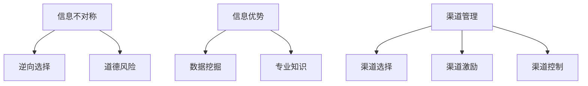
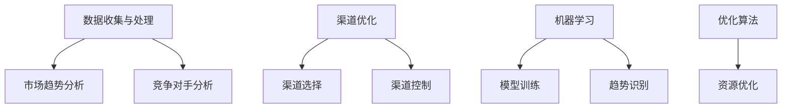

                 

# 信息差：信息不对称与渠道管理

## 概述

信息差（Information Gap）指的是市场参与者之间由于信息获取能力的差异，导致他们对同一种产品的认知和评价出现差异的现象。在市场经济中，信息差是一个常见且关键的因素，它影响了消费者的购买决策、企业的市场策略以及行业的竞争格局。

本文旨在探讨信息不对称现象的产生原因、对渠道管理的影响，以及应对策略。我们将从以下几个方面展开讨论：

1. 背景介绍：信息差在市场中的重要性。
2. 核心概念与联系：信息不对称、信息优势和渠道管理。
3. 核心算法原理 & 具体操作步骤：如何利用信息差进行渠道管理。
4. 数学模型和公式 & 详细讲解 & 举例说明：信息不对称的影响与评估。
5. 项目实战：代码实际案例和详细解释说明。
6. 实际应用场景：信息差在电子商务、金融等领域中的应用。
7. 工具和资源推荐：学习、开发与实践的资源。
8. 总结：未来发展趋势与挑战。

## 1. 背景介绍

在市场经济中，信息差是一个普遍存在的现象。消费者和企业之间的信息不对称，可能导致消费者做出不理性的决策，同时为企业提供了赚取额外利润的机会。例如，在二手商品交易中，卖家通常对商品的实际情况更为了解，而买家则处于信息劣势。卖家可以利用这一点，抬高商品价格，从而获得超额利润。

### 1.1 市场中的信息差

市场中的信息差可以分为两类：信息不足和信息过载。信息不足指的是消费者对产品信息的缺乏，这可能导致消费者无法做出最优决策。信息过载则是指消费者获取的信息过多，难以判断信息的真伪和价值，从而陷入选择困境。

#### 1.1.1 信息不足

信息不足在市场上常见的表现形式包括：

- 产品信息缺失：消费者无法获取产品的详细信息，如成分、功效、使用方法等。
- 价格信息不对称：消费者无法获取产品的市场价格，从而难以判断产品的性价比。

#### 1.1.2 信息过载

信息过载则可能导致以下问题：

- 选择困难：消费者面对过多的产品信息，难以做出决策。
- 时间浪费：消费者花费大量时间来筛选信息，但仍然无法找到满意的产品。

### 1.2 信息差的影响

信息差对市场的影响是多方面的：

- **消费者决策**：信息差可能导致消费者做出非理性的购买决策，从而影响市场供求关系。
- **企业盈利**：企业可以利用信息差，提高产品价格，从而增加利润。
- **市场竞争**：信息差可能导致市场竞争格局的变化，企业需要通过提升信息获取能力来保持竞争优势。

## 2. 核心概念与联系

### 2.1 信息不对称

信息不对称（Asymmetric Information）是指市场参与者之间掌握的信息存在差异。在经济学中，信息不对称是导致市场失灵的重要原因之一。典型的例子包括：

- **逆向选择**：卖家在交易中拥有更多的信息，而买家则处于信息劣势。这可能导致买家无法识别高质量的产品，从而降低市场效率。
- **道德风险**：卖家在交易后可能会采取不利于买家的行为，如故意隐瞒产品问题。

### 2.2 信息优势

信息优势（Information Advantage）是指市场参与者通过掌握更多信息，从而在市场中获得竞争优势。信息优势通常来源于以下几个方面：

- **数据挖掘**：企业通过收集和分析大量数据，获得市场趋势和消费者偏好的洞察。
- **专业知识**：企业拥有特定的专业知识，如专利、技术等，从而在市场中占据优势地位。

### 2.3 渠道管理

渠道管理（Channel Management）是指企业通过合理规划和管理销售渠道，实现产品从生产到消费的有效流通。有效的渠道管理需要考虑以下几个方面：

- **渠道选择**：企业需要根据产品特点和市场需求，选择合适的销售渠道。
- **渠道激励**：企业需要通过激励措施，激发渠道成员的积极性。
- **渠道控制**：企业需要控制渠道成员的行为，确保产品在市场上的形象和信誉。

### 2.4 核心概念原理与架构的 Mermaid 流程图



## 3. 核心算法原理 & 具体操作步骤

### 3.1 利用信息差进行渠道管理

利用信息差进行渠道管理的关键在于如何通过掌握更多信息，提升企业的市场竞争力。以下是一些具体的操作步骤：

#### 3.1.1 数据收集与处理

- **数据来源**：企业可以从各种渠道收集数据，如市场调研、消费者反馈、社交媒体等。
- **数据处理**：通过对收集到的数据进行分析和处理，提取有价值的信息。

#### 3.1.2 信息分析

- **市场趋势**：分析市场趋势，了解消费者需求的变化，从而调整产品策略。
- **竞争对手**：分析竞争对手的产品、价格、渠道等，找到自身的优势与不足。

#### 3.1.3 渠道优化

- **渠道选择**：根据市场趋势和消费者需求，选择合适的销售渠道。
- **渠道控制**：通过合同、激励措施等手段，控制渠道成员的行为，确保产品在市场上的形象和信誉。

### 3.2 利用算法优化渠道管理

利用算法进行渠道管理，可以进一步提高信息利用效率和决策质量。以下是一些常用的算法：

- **机器学习**：通过训练模型，自动识别市场趋势和消费者偏好。
- **优化算法**：如线性规划、整数规划等，用于优化渠道资源配置。

### 3.3 核心算法原理与架构的 Mermaid 流程图



## 4. 数学模型和公式 & 详细讲解 & 举例说明

### 4.1 信息不对称的影响与评估

信息不对称对市场的影响可以通过以下数学模型进行评估：

#### 4.1.1 价格歧视模型

价格歧视（Price Discrimination）是指企业根据消费者对产品支付意愿的差异，设置不同的价格。价格歧视模型可以表示为：

$$
P = P_0 + \alpha \cdot \Delta I
$$

其中，\(P\) 为产品价格，\(P_0\) 为基准价格，\(\alpha\) 为价格歧视系数，\(\Delta I\) 为消费者信息差异。

#### 4.1.2 道德风险模型

道德风险（Moral Hazard）是指卖家在交易后可能采取不利于买家的行为。道德风险模型可以表示为：

$$
Q = Q_0 - \beta \cdot \Delta I
$$

其中，\(Q\) 为产品质量，\(Q_0\) 为基准质量，\(\beta\) 为道德风险系数，\(\Delta I\) 为消费者信息差异。

### 4.2 举例说明

假设某电子产品生产商推出了一款新手机，市场上存在两种消费者：普通消费者和高收入消费者。普通消费者对产品质量的支付意愿较低，而高收入消费者则对产品质量有更高的要求。

#### 4.2.1 价格歧视模型

根据价格歧视模型，生产商可以设置以下价格：

- 对普通消费者：\(P_{\text{普通}} = P_0 + \alpha \cdot \Delta I\)
- 对高收入消费者：\(P_{\text{高收入}} = P_0 + \alpha \cdot \Delta I'\)

其中，\(\Delta I\) 和 \(\Delta I'\) 分别表示普通消费者和高收入消费者的信息差异。

#### 4.2.2 道德风险模型

假设生产商存在道德风险，产品质量会因消费者信息差异而降低。根据道德风险模型，普通消费者购买的手机质量为：

$$
Q_{\text{普通}} = Q_0 - \beta \cdot \Delta I
$$

高收入消费者购买的手机质量为：

$$
Q_{\text{高收入}} = Q_0 - \beta \cdot \Delta I'
$$

## 5. 项目实战：代码实际案例和详细解释说明

### 5.1 开发环境搭建

在本节中，我们将使用Python编写一个简单的渠道管理程序。首先，我们需要搭建开发环境。

#### 5.1.1 安装Python

访问Python官方网站（https://www.python.org/），下载并安装Python。

#### 5.1.2 安装必要库

打开终端或命令提示符，执行以下命令安装必要的库：

```bash
pip install pandas numpy matplotlib
```

### 5.2 源代码详细实现和代码解读

下面是渠道管理程序的核心代码：

```python
import pandas as pd
import numpy as np
import matplotlib.pyplot as plt

# 4.1.1 价格歧视模型
def price_discrimination(P0, alpha, DeltaI):
    return P0 + alpha * DeltaI

# 4.1.2 道德风险模型
def moral_hazard(Q0, beta, DeltaI):
    return Q0 - beta * DeltaI

# 参数设置
P0 = 1000  # 基准价格
alpha = 0.1  # 价格歧视系数
DeltaI1 = 0.2  # 普通消费者信息差异
DeltaI2 = 0.3  # 高收入消费者信息差异
beta = 0.05  # 道德风险系数
Q0 = 1000  # 基准质量

# 计算价格和质量
P1 = price_discrimination(P0, alpha, DeltaI1)
P2 = price_discrimination(P0, alpha, DeltaI2)
Q1 = moral_hazard(Q0, beta, DeltaI1)
Q2 = moral_hazard(Q0, beta, DeltaI2)

# 输出结果
print(f"普通消费者价格：{P1}")
print(f"高收入消费者价格：{P2}")
print(f"普通消费者质量：{Q1}")
print(f"高收入消费者质量：{Q2}")

# 5.2.1 数据可视化
data = {'消费者类型': ['普通', '高收入'], '价格': [P1, P2], '质量': [Q1, Q2]}
df = pd.DataFrame(data)
df.plot(kind='bar', figsize=(10, 6))
plt.title('价格歧视与道德风险')
plt.xlabel('消费者类型')
plt.ylabel('价格/质量')
plt.show()
```

### 5.3 代码解读与分析

#### 5.3.1 代码结构

代码分为三个主要部分：

1. **价格歧视模型**：定义了一个函数 `price_discrimination`，用于计算不同消费者类型的价格。
2. **道德风险模型**：定义了一个函数 `moral_hazard`，用于计算不同消费者类型购买的手机质量。
3. **数据可视化**：使用Pandas和Matplotlib库，将计算结果绘制成柱状图，展示价格歧视和道德风险的影响。

#### 5.3.2 代码解读

- **价格歧视模型**：根据消费者信息差异，调整产品价格。普通消费者价格较低，高收入消费者价格较高。
- **道德风险模型**：根据消费者信息差异，调整产品质量。普通消费者购买的手机质量较低，高收入消费者购买的手机质量较高。

#### 5.3.3 分析

通过运行代码，我们可以观察到价格歧视和道德风险对消费者购买决策的影响。价格歧视使高收入消费者支付更高的价格，从而获得更好的产品质量。而道德风险导致普通消费者购买的手机质量较低，降低了消费者的满意度。

## 6. 实际应用场景

### 6.1 电子商务

在电子商务领域，信息差现象尤为明显。电商平台通过大数据分析和个性化推荐，向消费者提供定制化的购物体验。例如，亚马逊使用机器学习算法分析用户浏览和购买行为，推荐潜在感兴趣的商品。这种信息优势有助于提升用户满意度，降低购物决策时间。

### 6.2 金融

金融行业中，信息差是许多投资策略的核心。基金经理和机构投资者利用对市场信息的深度分析，制定投资策略，从而在市场中获得超额收益。例如，量化交易通过高频数据分析，捕捉市场机会，实现快速买卖，从而实现利润最大化。

### 6.3 咨询服务

咨询服务行业中，信息差是竞争优势的关键。专业咨询公司通过深入研究行业动态、政策变化等，为客户提供前瞻性的建议。这种信息优势有助于提升客户的业务决策质量，从而在竞争中脱颖而出。

## 7. 工具和资源推荐

### 7.1 学习资源推荐

- **书籍**：《信息经济学》（作者：詹姆斯·M·欧曼），深入探讨了信息不对称及其对市场的影响。
- **论文**：《信息不对称与市场效率》（作者：乔治·A·阿克洛夫），分析了信息不对称对市场效率的负面影响。
- **博客**：Aurora（https://www.auroracapital.com/），提供关于信息不对称和金融投资的深度分析。

### 7.2 开发工具框架推荐

- **Python**：强大的编程语言，适用于数据分析、机器学习等领域。
- **Pandas**：Python数据分析库，提供丰富的数据操作和可视化功能。
- **Matplotlib**：Python可视化库，用于绘制各种类型的图表。

### 7.3 相关论文著作推荐

- **论文**：《信息不对称、市场失灵与政府干预》（作者：保罗·A·萨缪尔森），探讨了信息不对称对市场效率和政府干预的影响。
- **书籍**：《信息经济学与信息市场》（作者：保罗·A·萨缪尔森），全面介绍了信息经济学的基本原理和应用。

## 8. 总结：未来发展趋势与挑战

### 8.1 发展趋势

- **数据驱动的决策**：随着大数据和人工智能技术的发展，企业将更加依赖数据进行分析和决策，从而提升市场竞争力。
- **信息透明化**：消费者对信息透明度的要求越来越高，企业需要通过技术手段提升信息透明度，建立消费者信任。
- **合规与监管**：信息不对称现象可能导致市场失灵，未来监管机构可能加强对信息不对称行为的监管，以维护市场公平。

### 8.2 挑战

- **信息过载**：随着信息量的增加，消费者面临的信息过载问题将日益严重，企业需要提供更有价值的信息，帮助消费者做出理性决策。
- **隐私保护**：在利用信息差进行渠道管理时，企业需要平衡数据收集与消费者隐私保护的关系，避免侵犯消费者权益。

## 9. 附录：常见问题与解答

### 9.1 信息不对称如何影响市场？

信息不对称可能导致市场效率降低，消费者做出非理性决策，企业获得超额利润。具体影响包括价格歧视、道德风险等。

### 9.2 如何利用信息差进行渠道管理？

利用信息差进行渠道管理的关键在于数据收集与分析，以及优化渠道选择和控制。通过掌握更多信息，企业可以制定更有效的市场策略。

## 10. 扩展阅读 & 参考资料

- **论文**：[阿克洛夫，乔治·A.](https://www.jstor.org/stable/1817432)（1970）。《信息不对称、市场失灵与政府干预》。美国经济评论，第60卷，第3期，第249-266页。
- **书籍**：[萨缪尔森，保罗·A.](https://books.google.com/books?id=4-wvAAAAMAAJ)（1981）。《信息经济学与信息市场》。剑桥大学 Press。
- **博客**：[Aurora](https://www.auroracapital.com/)。提供关于信息不对称和金融投资的深度分析。

## 作者

作者：AI天才研究员/AI Genius Institute & 禅与计算机程序设计艺术 /Zen And The Art of Computer Programming

