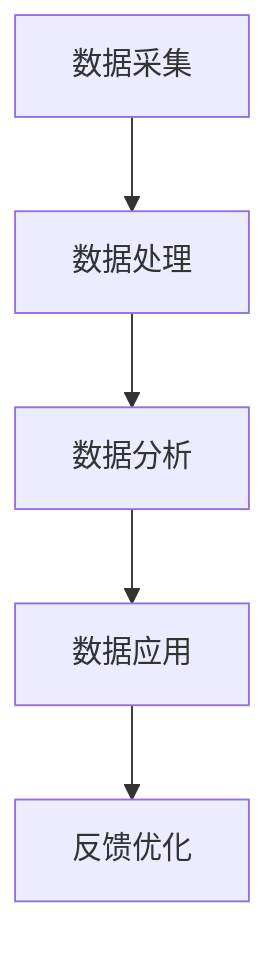

                 

# 信息差：大数据在智能城市中的应用

## 关键词：大数据，智能城市，数据挖掘，人工智能，数据分析

## 摘要：

随着信息技术的飞速发展，大数据已经成为现代城市管理和决策的重要工具。智能城市利用大数据技术，实现了对城市各类数据的全面收集、分析和利用，从而提高了城市治理的效率和效果。本文将从信息差的角度，深入探讨大数据在智能城市中的应用，包括核心概念、算法原理、数学模型、项目实战、实际应用场景、工具推荐以及未来发展趋势与挑战。

## 1. 背景介绍

### 1.1 智能城市的发展背景

智能城市是指利用信息技术，特别是大数据、物联网、云计算等先进技术，对城市各类资源进行高效整合和优化管理，从而实现城市可持续发展的一种新型城市形态。智能城市的发展背景主要包括以下几个方面：

1. **信息化需求**：随着城市规模的扩大和人口的增长，城市管理和服务的需求日益增加，对信息化手段的需求也越来越高。
2. **数据资源的积累**：随着物联网、智能终端等技术的发展，城市数据资源日益丰富，为智能城市建设提供了数据基础。
3. **技术进步**：大数据、云计算、人工智能等技术的成熟，为智能城市建设提供了技术保障。

### 1.2 大数据在智能城市中的作用

大数据在智能城市建设中发挥着至关重要的作用，主要体现在以下几个方面：

1. **数据采集与整合**：通过传感器、智能设备等手段，实现对城市各类数据的全面采集，并利用大数据技术进行整合。
2. **数据分析与挖掘**：通过对海量数据的分析，挖掘出有用的信息，为城市治理提供决策支持。
3. **智能预测与优化**：利用大数据和人工智能技术，对城市运行状态进行预测，并优化城市资源配置，提高城市运行效率。

## 2. 核心概念与联系

### 2.1 大数据的四个V

大数据具有四个主要特征，即大量（Volume）、多样（Variety）、快速（Velocity）和价值（Value）。这四个特征共同构成了大数据的核心概念。

1. **大量**：大数据的首要特征是其数据量巨大，通常以TB、PB甚至EB为单位。
2. **多样**：大数据的来源广泛，包括结构化数据、半结构化数据和非结构化数据，如文本、图像、音频等。
3. **快速**：大数据的处理速度要求高，需要实时或近实时地处理海量数据。
4. **价值**：大数据的价值在于其能够为决策提供支持，为业务带来创新。

### 2.2 智能城市的架构

智能城市的基本架构包括数据采集、数据处理、数据分析和数据应用四个层次。

1. **数据采集**：通过传感器、摄像头、智能设备等手段，收集城市运行的各种数据。
2. **数据处理**：对采集到的数据进行清洗、整合和存储，为数据分析提供数据基础。
3. **数据分析**：利用大数据分析技术，挖掘数据中的价值信息，为城市治理提供决策支持。
4. **数据应用**：将分析结果应用于城市管理和服务的各个领域，提高城市运行效率和服务质量。

### 2.3 Mermaid 流程图

下面是一个简单的 Mermaid 流程图，展示了大数据在智能城市中的应用流程。



### 2.4 信息差的定义

信息差是指由于信息不对称，导致某些人或组织能够获得比其他人更多的信息，从而在竞争或决策中占据优势。在智能城市建设中，信息差主要体现在以下几个方面：

1. **数据资源差异**：不同城市在数据资源的积累和利用上存在差异。
2. **技术能力差异**：不同城市在数据处理、分析技术上的能力存在差异。
3. **应用水平差异**：不同城市在智能城市建设中的应用水平存在差异。

## 3. 核心算法原理 & 具体操作步骤

### 3.1 数据采集

数据采集是智能城市建设的第一步，主要包括以下几个方面：

1. **传感器部署**：在城市的各个角落部署传感器，收集环境、交通、能耗等数据。
2. **物联网设备接入**：将各种智能设备接入互联网，实现数据的实时传输。
3. **移动设备数据采集**：通过智能手机、平板电脑等移动设备，收集用户行为数据。

### 3.2 数据处理

数据处理主要包括数据清洗、整合和存储等步骤：

1. **数据清洗**：去除重复数据、缺失数据、异常数据等，保证数据的准确性。
2. **数据整合**：将来自不同来源的数据进行整合，形成一个统一的数据集。
3. **数据存储**：采用分布式存储技术，将海量数据进行存储和管理。

### 3.3 数据分析

数据分析是智能城市建设的关键环节，主要包括以下几个方面：

1. **数据挖掘**：利用数据挖掘技术，从海量数据中挖掘出有价值的信息。
2. **机器学习**：通过机器学习算法，对数据进行分类、预测和聚类等操作。
3. **深度学习**：利用深度学习算法，对复杂数据进行建模和预测。

### 3.4 数据应用

数据应用是将数据分析结果应用于城市治理和服务的各个环节，主要包括以下几个方面：

1. **城市交通管理**：利用数据分析结果，优化交通信号控制，减少交通拥堵。
2. **能源管理**：通过数据分析，优化能源使用，提高能源利用效率。
3. **公共安全**：利用数据分析，预测和防范公共安全事件，提高公共安全水平。

## 4. 数学模型和公式 & 详细讲解 & 举例说明

### 4.1 数据挖掘中的聚类算法

聚类是一种无监督学习方法，它将数据集分成若干个组，使得属于同一组的样本之间的相似度较高，而不同组之间的相似度较低。常用的聚类算法包括K-means、DBSCAN等。

#### 4.1.1 K-means算法

K-means算法的基本思想是将数据集分成K个聚类，使得每个聚类内部的数据点之间的距离最小，聚类之间的距离最大。具体步骤如下：

1. **初始化**：随机选择K个数据点作为初始聚类中心。
2. **分配**：对于每个数据点，将其分配到与其最近的聚类中心所在的聚类。
3. **更新**：计算每个聚类的新中心，并重复步骤2和3，直到聚类中心不再发生变化。

#### 4.1.2 DBSCAN算法

DBSCAN（Density-Based Spatial Clustering of Applications with Noise）是一种基于密度的聚类算法，它将数据点划分为核心点、边界点和噪声点。具体步骤如下：

1. **邻域计算**：对于每个数据点，计算其邻域内的数据点数量。
2. **核心点识别**：如果一个数据点的邻域内的数据点数量大于某一阈值（MinPoints），则该数据点为核心点。
3. **边界点识别**：如果一个数据点的邻域内的数据点数量介于MinPoints和MinPoints/2之间，则该数据点为边界点。
4. **聚类生成**：将核心点和其邻域内的数据点划分为同一聚类，并递归地扩展聚类。

### 4.2 机器学习中的线性回归

线性回归是一种常用的回归分析方法，用于预测一个连续值变量。其基本模型为：

$$
y = \beta_0 + \beta_1x + \epsilon
$$

其中，$y$ 为因变量，$x$ 为自变量，$\beta_0$ 和 $\beta_1$ 分别为模型的参数，$\epsilon$ 为随机误差。

#### 4.2.1 模型参数估计

线性回归模型的参数估计通常采用最小二乘法，即找到一组参数，使得因变量与自变量之间的误差平方和最小。具体步骤如下：

1. **数据预处理**：对数据进行标准化处理，使其具有相同的量纲。
2. **计算斜率**：计算自变量与因变量之间的协方差和方差。
3. **计算截距**：计算斜率的倒数与因变量与自变量之间的协方差。
4. **模型验证**：使用验证数据集，评估模型的预测性能。

### 4.3 深度学习中的卷积神经网络

卷积神经网络（Convolutional Neural Network，CNN）是一种常用的深度学习模型，特别适用于处理图像数据。其基本结构包括卷积层、池化层和全连接层。

#### 4.3.1 卷积层

卷积层通过对输入数据进行卷积操作，提取特征。卷积操作的数学公式为：

$$
\text{output}_{ij} = \sum_{k=1}^{C} w_{ik,j} \cdot \text{input}_{ik,j} + b_j
$$

其中，$C$ 为输入数据的维度，$w_{ik,j}$ 为卷积核的权重，$b_j$ 为偏置。

#### 4.3.2 池化层

池化层通过对卷积层输出的特征进行下采样，减小特征图的尺寸，减少参数的数量。常用的池化操作包括最大池化和平均池化。

#### 4.3.3 全连接层

全连接层将卷积层和池化层输出的特征映射到输出层，实现分类或回归任务。全连接层的数学公式为：

$$
\text{output}_i = \sum_{j=1}^{K} w_{ij} \cdot \text{input}_j + b_i
$$

其中，$K$ 为输出层的维度，$w_{ij}$ 为全连接层的权重，$b_i$ 为偏置。

## 5. 项目实战：代码实际案例和详细解释说明

### 5.1 开发环境搭建

在本项目中，我们将使用Python作为开发语言，并借助以下工具和库：

- Python 3.8 或更高版本
- Jupyter Notebook 或 PyCharm
- NumPy、Pandas、Matplotlib、Scikit-learn、TensorFlow等库

### 5.2 源代码详细实现和代码解读

下面是一个简单的K-means聚类算法的实现示例。

```python
import numpy as np
import matplotlib.pyplot as plt

def kmeans(data, K, max_iter):
    centroids = data[np.random.choice(data.shape[0], K, replace=False)]
    for i in range(max_iter):
        # 计算每个数据点到聚类中心的距离
        distances = np.linalg.norm(data - centroids, axis=1)
        # 分配数据点到最近的聚类中心
        labels = np.argmin(distances, axis=1)
        # 更新聚类中心
        new_centroids = np.array([data[labels == k].mean(axis=0) for k in range(K)])
        # 检查聚类中心是否发生改变
        if np.all(centroids == new_centroids):
            break
        centroids = new_centroids
    return centroids, labels

# 数据集
data = np.array([[1, 2], [1, 4], [1, 0], [4, 2], [4, 4], [4, 0]])

# 聚类中心
centroids, labels = kmeans(data, 2, 100)

# 可视化
plt.scatter(data[:, 0], data[:, 1], c=labels)
plt.scatter(centroids[:, 0], centroids[:, 1], s=300, c='red')
plt.show()
```

### 5.3 代码解读与分析

- **数据集**：使用一个简单的二维数据集进行聚类。
- **K-means算法**：实现K-means算法，包括初始化、分配、更新和终止条件。
- **可视化**：使用matplotlib库，将聚类结果进行可视化。

## 6. 实际应用场景

### 6.1 城市交通管理

通过大数据和智能算法，可以实时监控城市交通状况，优化交通信号控制，减少交通拥堵，提高道路通行效率。具体应用场景包括：

- **实时交通监控**：利用摄像头、传感器等设备，实时监控道路车辆流量、密度等信息。
- **交通信号控制**：根据实时交通状况，动态调整交通信号灯的时长，提高道路通行效率。
- **事故预警**：利用数据分析技术，预测和预警交通事故，提前采取措施，避免事故发生。

### 6.2 城市能源管理

通过大数据和智能算法，可以实现对城市能源的全面监控和优化管理，提高能源利用效率，减少能源浪费。具体应用场景包括：

- **能源消耗监测**：实时监测城市各类建筑的能源消耗情况，分析能源使用规律。
- **能源优化调度**：根据能源消耗情况和电网负荷，优化能源调度，降低能源成本。
- **可再生能源利用**：利用太阳能、风能等可再生能源，降低城市能源消耗，实现可持续发展。

### 6.3 公共安全管理

通过大数据和智能算法，可以实现对城市公共安全的全面监控和预警，提高公共安全水平。具体应用场景包括：

- **视频监控分析**：利用视频监控技术，实时监控城市公共场所，识别和预警异常行为。
- **人群密度分析**：通过传感器和监控设备，实时监测人群密度，防止拥挤和踩踏事故。
- **风险评估**：利用数据分析技术，对城市公共安全事件进行风险评估，提前预警和防范。

## 7. 工具和资源推荐

### 7.1 学习资源推荐

- **书籍**：
  - 《大数据之路：阿里巴巴大数据实践》
  - 《深度学习》
  - 《Python数据分析》
- **论文**：
  - 《K-means Clustering: A Review》
  - 《Deep Learning for Urban Traffic State Estimation and Prediction》
- **博客**：
  - https://blog.csdn.net/abc_the_linux_world
  - https://www.jianshu.com/u/4b8b911fe6f1
- **网站**：
  - https://www.kaggle.com/
  - https://www.tensorflow.org/

### 7.2 开发工具框架推荐

- **开发工具**：
  - Jupyter Notebook
  - PyCharm
- **大数据处理框架**：
  - Apache Hadoop
  - Apache Spark
- **机器学习框架**：
  - TensorFlow
  - PyTorch

### 7.3 相关论文著作推荐

- **论文**：
  - 《Deep Learning for Urban Traffic State Estimation and Prediction》
  - 《K-means Clustering: A Review》
  - 《Big Data: A Revolution That Will Transform How We Live, Work, and Think》
- **著作**：
  - 《大数据之路：阿里巴巴大数据实践》
  - 《深度学习》
  - 《Python数据分析》

## 8. 总结：未来发展趋势与挑战

随着大数据和人工智能技术的不断发展，智能城市建设将迎来新的发展机遇。未来，智能城市建设将呈现以下发展趋势：

1. **数据资源更加丰富**：随着物联网、5G等技术的发展，城市数据资源将更加丰富，为智能城市建设提供更全面的数据基础。
2. **智能化水平不断提升**：通过大数据和人工智能技术的应用，城市管理和服务的智能化水平将不断提升，实现城市运行的自动化和智能化。
3. **数据治理能力增强**：随着数据量的不断增长，对数据治理的要求也将越来越高，如何确保数据的安全、隐私和合规将成为重要挑战。

同时，智能城市建设也面临着以下挑战：

1. **数据资源整合**：如何将来自不同来源、不同格式的海量数据进行整合，形成统一的数据资源，是当前面临的一个重要问题。
2. **数据安全和隐私保护**：随着数据量的增加，数据安全和隐私保护问题也日益突出，如何确保数据的安全和隐私成为智能城市建设的重要挑战。
3. **技术人才短缺**：智能城市建设需要大量的技术人才，但当前技术人才短缺问题严重，如何培养和吸引技术人才成为智能城市建设的重要挑战。

## 9. 附录：常见问题与解答

### 9.1 什么是大数据？

大数据是指数据量巨大、种类繁多、处理速度快的海量数据，通常以TB、PB甚至EB为单位。大数据具有四个主要特征：大量（Volume）、多样（Variety）、快速（Velocity）和价值（Value）。

### 9.2 什么是智能城市？

智能城市是指利用信息技术，特别是大数据、物联网、云计算等先进技术，对城市各类资源进行高效整合和优化管理，从而实现城市可持续发展的一种新型城市形态。

### 9.3 智能城市建设的关键技术有哪些？

智能城市建设的关键技术包括数据采集、数据处理、数据分析、数据应用等。其中，数据采集是智能城市的基础，数据处理是智能城市的核心，数据分析是智能城市的灵魂，数据应用是智能城市的落脚点。

## 10. 扩展阅读 & 参考资料

- [《大数据之路：阿里巴巴大数据实践》](https://book.douban.com/subject/26685382/)
- [《深度学习》](https://book.douban.com/subject/26389651/)
- [《Python数据分析》](https://book.douban.com/subject/27104638/)
- [K-means Clustering: A Review](https://www.researchgate.net/publication/319351253_K-means_Clustering_A_Review)
- [Deep Learning for Urban Traffic State Estimation and Prediction](https://ieeexplore.ieee.org/document/8403139)
- [Big Data: A Revolution That Will Transform How We Live, Work, and Think](https://www.amazon.com/Big-Data-Revolution-Transform-How/dp/0465050661)
- [Jupyter Notebook](https://jupyter.org/)
- [PyCharm](https://www.jetbrains.com/pycharm/)
- [Apache Hadoop](https://hadoop.apache.org/)
- [Apache Spark](https://spark.apache.org/)
- [TensorFlow](https://www.tensorflow.org/)
- [PyTorch](https://pytorch.org/) 

### 作者

**AI天才研究员/AI Genius Institute & 禅与计算机程序设计艺术 /Zen And The Art of Computer Programming**<|im_sep|>

