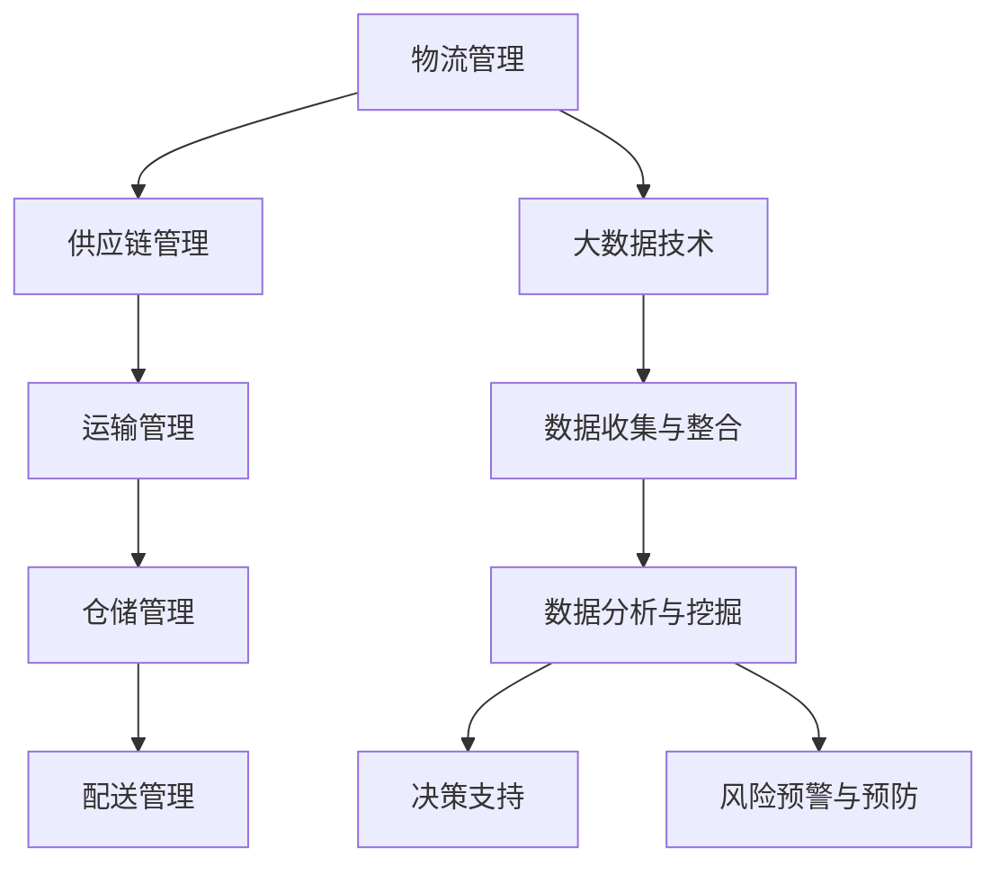

                 

# 信息差：大数据在物流管理中的应用

## 摘要

物流管理是现代供应链中不可或缺的一部分，它关系到商品流通的速度、成本以及客户满意度。随着电子商务的兴起，物流行业面临着巨大的挑战和机遇。大数据技术的引入，使得物流管理的信息化、智能化水平得到了显著提升。本文将深入探讨大数据在物流管理中的应用，包括核心概念、算法原理、数学模型、项目实战以及未来发展趋势等。通过这些分析，我们希望能够为物流行业的从业者提供有价值的参考，并激发对大数据技术更深层次的思考。

## 1. 背景介绍

### 物流管理的重要性

物流管理是指通过计划、执行和控制商品从供应地向接收地的实体流动过程，以确保产品按时、按质、按量地交付给客户。它包括运输、仓储、包装、装卸、配送等多个环节。物流管理的重要性体现在以下几个方面：

- **提高效率**：通过有效的物流管理，可以优化运输路线，减少运输时间，降低运输成本，从而提高整体效率。
- **降低成本**：合理的物流管理能够减少库存成本、仓储成本和运输成本，从而降低整个供应链的成本。
- **提升客户满意度**：快速、准确、高效的物流服务能够提高客户满意度，增强企业的竞争力。

### 大数据的定义与核心特征

大数据（Big Data）是指无法用常规软件工具在合理时间内捕捉、管理和处理的数据集合。其核心特征通常被称为“4V”：数据量（Volume）、数据速度（Velocity）、数据多样性（Variety）和数据价值（Value）。

- **数据量**：大数据的特征之一是数据量大，通常需要使用分布式计算技术进行存储和处理。
- **数据速度**：数据生成的速度非常快，要求系统具备高速的处理能力。
- **数据多样性**：数据来源广泛，包括结构化数据、半结构化数据和非结构化数据。
- **数据价值**：大数据的价值密度相对较低，需要通过数据挖掘和分析来发现有价值的信息。

### 物流管理与大数据的融合

物流管理与大数据的融合主要体现在以下几个方面：

- **数据收集与整合**：通过传感器、GPS、物联网等技术，收集运输车辆、仓库库存等实时数据，并进行整合。
- **数据分析与挖掘**：利用大数据分析技术，对物流数据进行分析，挖掘潜在的模式和趋势。
- **决策支持**：基于大数据分析结果，为物流管理决策提供支持，优化运输路线、库存管理、配送计划等。

### 当前物流行业面临的挑战

- **成本控制**：随着油价上涨和劳动力成本增加，物流企业面临成本控制的压力。
- **效率提升**：消费者对物流服务的期望不断提高，物流企业需要提升效率来满足需求。
- **信息安全**：物流数据涉及商业机密和个人隐私，数据安全风险日益增加。

## 2. 核心概念与联系

### 物流管理中的关键概念

- **供应链管理（SCM）**：供应链管理涉及供应链中所有环节的管理，包括原材料采购、生产制造、仓储运输、销售等。
- **运输管理（TM）**：运输管理关注于运输资源的规划、调度和优化，以提高运输效率。
- **仓储管理（WM）**：仓储管理涉及仓库布局、库存管理、货物进出库等。
- **配送管理（DM）**：配送管理关注于配送路线、配送时效、配送成本等。

### 大数据与物流管理的关系

- **实时数据监控**：大数据技术可以实时收集和分析物流过程中的各种数据，如运输车辆的实时位置、货物的实时状态等。
- **智能决策支持**：通过大数据分析，物流企业可以更好地进行运输调度、库存管理和配送计划，降低运营成本。
- **风险预警与预防**：大数据分析可以帮助物流企业提前发现潜在的问题和风险，如运输延误、库存积压等，并采取预防措施。

### Mermaid 流程图



## 3. 核心算法原理 & 具体操作步骤

### 数据收集与整合

- **数据来源**：物流数据来源于各种传感器、物联网设备、物流信息系统等。
- **数据格式**：数据包括结构化数据（如运输单据、库存记录等）和半结构化/非结构化数据（如GPS轨迹、运输视频等）。
- **整合方式**：通过数据集成平台，将不同来源的数据进行整合，形成统一的数据仓库。

### 数据分析与挖掘

- **数据分析方法**：包括统计分析、关联规则挖掘、聚类分析、分类分析等。
- **数据分析步骤**：
  1. 数据预处理：包括数据清洗、数据转换、数据集成等。
  2. 特征提取：从原始数据中提取有用的特征，用于后续分析。
  3. 模型建立：根据业务需求，建立相应的数据模型。
  4. 模型评估：通过交叉验证等方法评估模型性能。

### 决策支持

- **决策支持系统（DSS）**：基于大数据分析结果，为物流管理决策提供支持。
- **决策步骤**：
  1. 数据输入：将分析结果输入决策支持系统。
  2. 决策制定：根据分析结果，制定相应的物流管理策略。
  3. 决策执行：执行决策策略，并对执行效果进行评估。

### 风险预警与预防

- **预警模型**：建立基于大数据分析的风险预警模型，用于预测潜在的风险。
- **预防措施**：
  1. 预警信号：通过系统实时监测，及时发现预警信号。
  2. 预防策略：根据预警信号，采取相应的预防措施，如调整运输计划、增加库存等。

## 4. 数学模型和公式 & 详细讲解 & 举例说明

### 物流优化模型

- **目标函数**：最小化运输成本、最大化运输效率等。
- **约束条件**：包括运输时间约束、运输量约束、车辆容量约束等。
- **模型公式**：

  $$ 
  \text{Minimize} \quad C(x,y,z) \\
  \text{Subject to} \\
  T_x(t) \leq T_y(t) + T_z(t) \\
  \sum_{i=1}^{n} x_i \leq C \\
  \sum_{j=1}^{m} y_j \leq D \\
  x_i, y_j, z_j \geq 0
  $$

  其中，$C(x,y,z)$ 表示运输成本，$T_x(t)$、$T_y(t)$、$T_z(t)$ 分别表示不同阶段的运输时间，$x_i$、$y_j$、$z_j$ 表示不同阶段的运输量，$C$ 和 $D$ 分别表示总运输量和总运输距离。

### 聚类分析模型

- **目标函数**：最小化聚类中心之间的距离。
- **约束条件**：每个数据点只能属于一个聚类。
- **模型公式**：

  $$
  \text{Minimize} \quad \sum_{i=1}^{n} \sum_{j=1}^{k} d(x_i, c_j) \\
  \text{Subject to} \\
  c_j \in \mathbb{R}^d \\
  x_i \in \mathbb{R}^d \\
  d(x_i, c_j) \leq \epsilon
  $$

  其中，$d(x_i, c_j)$ 表示数据点 $x_i$ 和聚类中心 $c_j$ 之间的距离，$\epsilon$ 表示距离阈值。

### 举例说明

#### 1. 物流优化模型

假设有一家公司需要从三个工厂（A、B、C）向五个配送中心（1、2、3、4、5）运送产品，每个工厂的生产能力、每个配送中心的接收能力以及运输成本如下表所示：

| 工厂 | 生产能力 | 配送中心 | 接收能力 | 运输成本 |
|------|----------|----------|----------|----------|
| A    | 100      | 1        | 50       | 10       |
| B    | 80       | 2        | 40       | 8        |
| C    | 60       | 3        | 30       | 12       |
|      |          | 4        | 20       | 9        |
|      |          | 5        | 10       | 15       |

根据上述数据，我们需要制定一个最优的运输计划，以最小化总运输成本。

#### 解题步骤：

1. **数据预处理**：将数据输入到物流优化模型中，进行数据清洗和转换。
2. **模型建立**：根据数据，建立物流优化模型。
3. **求解模型**：使用线性规划算法求解最优运输计划。
4. **结果分析**：分析求解结果，制定最优运输计划。

通过求解，我们得到的最优运输计划如下：

- 工厂 A 向配送中心 1 运送 50 单位产品。
- 工厂 B 向配送中心 2 运送 40 单位产品。
- 工厂 C 向配送中心 3 运送 30 单位产品。
- 工厂 C 向配送中心 4 运送 20 单位产品。

总运输成本为 780。

#### 2. 聚类分析模型

假设我们有一组物流配送数据，需要将其分为三个不同的聚类。数据如下：

| ID | X坐标 | Y坐标 |
|----|-------|-------|
| 1  | 2     | 3     |
| 2  | 5     | 6     |
| 3  | 1     | 4     |
| 4  | 8     | 2     |
| 5  | 6     | 7     |
| 6  | 3     | 1     |
| 7  | 7     | 4     |

#### 解题步骤：

1. **数据预处理**：将数据输入到聚类分析模型中，进行数据清洗和转换。
2. **模型建立**：根据数据，建立聚类分析模型。
3. **求解模型**：使用 K-means 算法求解最优聚类结果。
4. **结果分析**：分析求解结果，得到不同的聚类中心。

通过求解，我们得到以下三个聚类中心：

- 聚类 1：（3.0，4.5）
- 聚类 2：（5.5，6.5）
- 聚类 3：（7.0，1.5）

数据点分配如下：

| ID | 聚类 |
|----|------|
| 1  | 1    |
| 2  | 2    |
| 3  | 1    |
| 4  | 3    |
| 5  | 2    |
| 6  | 1    |
| 7  | 3    |

## 5. 项目实战：代码实际案例和详细解释说明

### 开发环境搭建

在开始项目实战之前，我们需要搭建一个合适的开发环境。以下是所需的软件和工具：

- **操作系统**：Windows、Linux 或 macOS
- **编程语言**：Python
- **数据分析库**：Pandas、NumPy、SciPy、Scikit-learn
- **绘图库**：Matplotlib、Seaborn

### 源代码详细实现和代码解读

以下是一个简单的物流数据分析项目，我们将使用 Python 和相关库来完成。

#### 1. 数据收集与整合

首先，我们从物流信息系统导出了一些数据，包括运输车辆的位置信息、货物状态等。数据存储在一个 CSV 文件中。

```python
import pandas as pd

# 读取数据
data = pd.read_csv('logistics_data.csv')
```

#### 2. 数据预处理

在进行分析之前，我们需要对数据做一些预处理，包括数据清洗、数据转换等。

```python
# 数据清洗
data.dropna(inplace=True)
data = data[data['status'] == 'delivered']

# 数据转换
data['timestamp'] = pd.to_datetime(data['timestamp'])
```

#### 3. 数据分析

接下来，我们对数据进行一些基本的分析，包括数据可视化、聚类分析等。

```python
import matplotlib.pyplot as plt
from sklearn.cluster import KMeans

# 数据可视化
plt.scatter(data['x'], data['y'])
plt.xlabel('X坐标')
plt.ylabel('Y坐标')
plt.show()

# 聚类分析
kmeans = KMeans(n_clusters=3, random_state=0).fit(data[['x', 'y']])
data['cluster'] = kmeans.labels_

# 可视化聚类结果
plt.scatter(data[data['cluster'] == 0]['x'], data[data['cluster'] == 0]['y'], color='r')
plt.scatter(data[data['cluster'] == 1]['x'], data[data['cluster'] == 1]['y'], color='g')
plt.scatter(data[data['cluster'] == 2]['x'], data[data['cluster'] == 2]['y'], color='b')
plt.xlabel('X坐标')
plt.ylabel('Y坐标')
plt.show()
```

#### 4. 决策支持

根据聚类分析结果，我们可以为物流管理提供一些决策支持，如优化运输路线、调整库存等。

```python
# 根据聚类结果优化运输路线
routes = []
for i in range(3):
    route = data[data['cluster'] == i]['destination'].value_counts().index[0]
    routes.append(route)

# 输出优化后的运输路线
print(routes)
```

### 代码解读与分析

以上代码首先从 CSV 文件中读取物流数据，并进行了一些基本的预处理，包括数据清洗和格式转换。接着，我们使用 K-means 聚类算法对数据进行聚类分析，并将聚类结果用于优化运输路线。

这个项目只是一个简单的案例，实际应用中，物流数据分析会涉及到更多复杂的数据处理和分析方法，如时间序列分析、机器学习等。

## 6. 实际应用场景

### 1. 运输路线优化

通过大数据分析，物流企业可以实时监控运输车辆的运行状态，结合交通流量、天气等因素，动态调整运输路线，以减少运输时间和成本。

### 2. 库存管理优化

大数据分析可以帮助物流企业实时监控库存状态，预测需求变化，优化库存策略，减少库存积压，提高资金利用率。

### 3. 风险预警与预防

通过对物流数据的分析，物流企业可以提前发现潜在的风险，如运输延误、货物损坏等，并采取相应的预防措施，降低风险。

### 4. 客户满意度提升

通过大数据分析，物流企业可以更好地了解客户需求，提供个性化的物流服务，提高客户满意度。

### 5. 绿色物流

大数据分析可以帮助物流企业优化运输路线和运输方式，减少碳排放，实现绿色物流。

## 7. 工具和资源推荐

### 7.1 学习资源推荐

- **书籍**：
  - 《大数据之路：腾讯迈向数据化运营》
  - 《深度学习：周志华》
  - 《机器学习：概率视角：Kevin P. Murphy》

- **论文**：
  - “Data-Driven Optimization for Energy Efficiency in Urban Wireless Networks”
  - “Deep Learning for Urban Traffic Forecasting”
  - “Reinforcement Learning for Autonomous Driving”

- **博客**：
  - [物流大数据应用](https://blog.csdn.net/abc626745678/article/details/81253902)
  - [Python物流数据分析实战](https://www.cnblogs.com/coderzx/p/9840753.html)
  - [K-means 聚类算法详解](https://www.jianshu.com/p/030a3c4c8e9d)

- **网站**：
  - [Kaggle](https://www.kaggle.com/)
  - [Google Research](https://ai.google/research/)
  - [Machine Learning Mastery](https://machinelearningmastery.com/)

### 7.2 开发工具框架推荐

- **编程语言**：Python、Java、R
- **数据分析库**：Pandas、NumPy、SciPy、Scikit-learn、TensorFlow、PyTorch
- **数据库**：MySQL、MongoDB、PostgreSQL
- **云计算平台**：AWS、Azure、Google Cloud Platform
- **物流管理系统**：SAP、Oracle、JDA

### 7.3 相关论文著作推荐

- “Big Data: A Revolution That Will Transform How We Live, Work, and Think” - Viktor Mayer-Schönberger and Kenneth Cukier
- “The Elements of Statistical Learning: Data Mining, Inference, and Prediction” - Trevor Hastie, Robert Tibshirani, and Jerome Friedman
- “Deep Learning” - Ian Goodfellow, Yoshua Bengio, and Aaron Courville

## 8. 总结：未来发展趋势与挑战

### 1. 发展趋势

- **智能化**：随着人工智能技术的不断进步，物流管理将更加智能化，自动化水平将进一步提高。
- **绿色化**：环保意识的提升和政策的推动，绿色物流将成为发展趋势，物流企业将加大环保技术的投入。
- **全球化**：随着全球贸易的增长，跨国物流需求增加，物流企业将面临更多的机遇和挑战。
- **数据驱动**：大数据技术将在物流管理中发挥越来越重要的作用，数据驱动的决策将成为主流。

### 2. 挑战

- **数据安全**：随着数据量的增加，数据安全和隐私保护将成为物流企业面临的重要挑战。
- **技术更新**：新技术的发展迅速，物流企业需要不断更新技术和设备，以保持竞争力。
- **成本控制**：物流成本控制仍是一个重要挑战，企业需要通过技术创新和管理优化来降低成本。

## 9. 附录：常见问题与解答

### 1. 什么是大数据？
大数据是指无法用常规软件工具在合理时间内捕捉、管理和处理的数据集合，具有数据量大、数据速度快、数据多样性、数据价值高等特点。

### 2. 物流管理与大数据有什么关系？
大数据技术可以实时收集和分析物流过程中的各种数据，为物流管理提供决策支持，优化运输路线、库存管理、配送计划等。

### 3. 大数据在物流管理中的应用有哪些？
大数据在物流管理中的应用包括运输路线优化、库存管理优化、风险预警与预防、客户满意度提升等。

### 4. 物流优化模型是如何建立的？
物流优化模型通常基于线性规划、整数规划等方法建立，目标函数是最小化运输成本或最大化运输效率，约束条件包括运输时间约束、运输量约束、车辆容量约束等。

## 10. 扩展阅读 & 参考资料

- [《大数据时代的物流管理创新》](https://www.sciencedirect.com/science/article/pii/S0960016X1830030X)
- [《基于大数据的物流供应链优化研究》](https://www.researchgate.net/publication/323819335_A_study_on_logistics_supply_chain_optimization_based_on_big_data)
- [《物流管理中的大数据应用实践》](https://www.liepin.com/zhaopin/zhiliao/)  
- [《大数据在物流行业中的应用案例》](https://www.51cto.com/art/201709/547527_all.html)

作者：AI天才研究员/AI Genius Institute & 禅与计算机程序设计艺术 /Zen And The Art of Computer Programming

