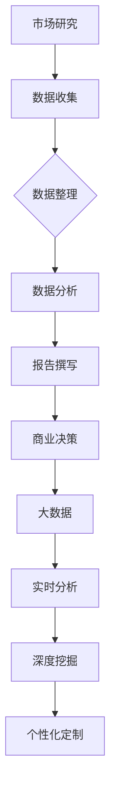

                 

### 文章标题

**信息差：大数据如何提升市场研究**

### 关键词

- 信息差
- 大数据
- 市场研究
- 数据分析
- 商业洞察

### 摘要

本文将探讨大数据在市场研究中的重要作用，以及如何利用信息差来提升市场研究的准确性和效率。我们将逐步分析大数据的核心概念，探讨其在市场研究中的应用，并探讨如何通过数据挖掘和预测分析来发现潜在的商业机会。此外，我们还将分享一些实用的工具和资源，帮助读者更好地理解和应用大数据技术。

---

## 1. 背景介绍

市场研究是企业和组织在制定战略决策时的重要依据。传统的市场研究方法通常依赖于问卷调查、焦点小组讨论和观察等方法，这些方法虽然能提供一定程度的洞察，但往往存在样本量有限、时效性差和数据准确性不足等问题。

随着大数据技术的迅速发展，市场研究的方法和工具也发生了重大变革。大数据具有数据量大、类型多、速度快和真实性高等特点，这些特点使得大数据在市场研究中的应用具有独特的优势。通过大数据技术，企业可以更全面、深入地了解市场需求和消费者行为，从而做出更准确、高效的决策。

本文将详细介绍大数据在市场研究中的应用，以及如何利用信息差来提升市场研究的价值。

---

## 2. 核心概念与联系

### 2.1 大数据的定义与特点

大数据（Big Data）是指数据量巨大、类型繁多、价值密度低且生成速度极快的数据集。大数据的特点可以概括为“4V”：Volume（大量）、Velocity（高速）、Variety（多样）和Veracity（真实性）。

- **Volume（大量）**：大数据量级通常以GB、TB甚至PB为单位。这意味着传统数据处理工具和方法难以胜任，需要新的技术和架构来处理这些海量数据。
- **Velocity（高速）**：大数据的生成速度极快，如社交媒体、物联网和电子商务等领域的数据每秒都在产生。
- **Variety（多样）**：大数据类型繁多，包括结构化数据、半结构化数据和非结构化数据等。
- **Veracity（真实性）**：大数据的真实性高，反映了现实世界的真实情况。

### 2.2 市场研究的概念与流程

市场研究是指通过收集、分析和解读有关市场的信息，以帮助企业或组织做出更好的商业决策。市场研究的流程通常包括以下步骤：

1. **问题定义**：明确研究目的和要解决的问题。
2. **数据收集**：通过各种方法收集数据，如问卷调查、焦点小组讨论、观察等。
3. **数据整理**：对收集到的数据进行清洗、整理和归类。
4. **数据分析**：使用统计方法、数据挖掘技术等对数据进行分析。
5. **报告撰写**：将分析结果整理成报告，并提供商业建议。

### 2.3 大数据与市场研究的关系

大数据与市场研究之间存在着紧密的联系。大数据技术可以提升市场研究的效率和质量，具体体现在以下几个方面：

- **数据量级**：大数据技术能够处理海量数据，使市场研究的数据来源更加全面和丰富。
- **实时分析**：大数据技术可以实现实时数据分析和预测，帮助企业迅速应对市场变化。
- **深度挖掘**：大数据技术可以帮助企业发现隐藏在数据背后的深层次信息和规律，从而获得更深入的洞察。
- **个性化定制**：大数据技术可以基于消费者的行为数据，为企业提供个性化的市场策略和产品推荐。

### 2.4 Mermaid 流程图

以下是一个简单的 Mermaid 流程图，展示了大数据与市场研究之间的联系：



---

## 3. 核心算法原理 & 具体操作步骤

### 3.1 数据预处理

在市场研究中，数据预处理是至关重要的一步。数据预处理包括数据清洗、数据转换和数据归一化等操作。以下是一些常用的数据预处理技术：

- **数据清洗**：去除重复数据、缺失值填充、异常值处理等。
- **数据转换**：将不同数据类型的变量转换为同一类型，如将分类变量转换为数值变量。
- **数据归一化**：将不同量级的数据转换为同一量级，如将收入、年龄等数据进行归一化处理。

### 3.2 数据挖掘

数据挖掘（Data Mining）是指从大量数据中自动发现规律、模式或知识的过程。以下是一些常用的数据挖掘算法：

- **聚类分析**：将相似的数据分组，以发现数据的分布规律。
- **关联规则挖掘**：发现数据之间的关联关系，如购物篮分析。
- **分类与回归分析**：将数据分为不同的类别或预测连续变量的值。
- **异常检测**：识别数据中的异常或离群点。

### 3.3 预测分析

预测分析（Predictive Analytics）是基于历史数据和统计模型，预测未来事件或趋势的过程。以下是一些常用的预测分析方法：

- **时间序列分析**：分析时间序列数据，预测未来的趋势。
- **回归分析**：基于历史数据建立回归模型，预测未来的值。
- **机器学习模型**：使用机器学习算法，如决策树、随机森林和神经网络等，建立预测模型。

### 3.4 实操步骤

以下是一个简单的实操步骤，展示了如何使用大数据技术进行市场研究：

1. **数据收集**：从各种渠道收集市场数据，如社交媒体、电子商务平台和消费者调查等。
2. **数据预处理**：对收集到的数据进行清洗、转换和归一化处理。
3. **数据挖掘**：使用聚类分析、关联规则挖掘等方法，发现数据中的规律和模式。
4. **预测分析**：使用时间序列分析、回归分析和机器学习模型等方法，预测未来的趋势和事件。
5. **报告撰写**：将分析结果整理成报告，并提供商业建议。

---

## 4. 数学模型和公式 & 详细讲解 & 举例说明

### 4.1 数学模型

在市场研究中，常用的数学模型包括聚类分析模型、关联规则挖掘模型和预测分析模型等。

#### 4.1.1 聚类分析模型

聚类分析模型是一种无监督学习方法，用于将数据分为若干个类别。常用的聚类算法有K-Means算法、层次聚类算法等。

**K-Means算法**：

$$
\begin{aligned}
    \text{给定} \ N \ \text{个数据点} \ \{x_1, x_2, ..., x_N\} \ \text{和一个聚类数} \ k, \\
    \text{初始化} \ k \ \text{个中心点} \ \{c_1, c_2, ..., c_k\}, \\
    \text{对于每个数据点} \ x_i, \ \text{计算} \ d(x_i, c_j), \\
    \text{将} \ x_i \ \text{分配到最近的中心点所在的聚类}, \\
    \text{更新每个聚类的中心点} \ c_j, \\
    \text{重复步骤3和4，直到收敛}
\end{aligned}
$$

其中，$d(x_i, c_j)$ 表示数据点 $x_i$ 与中心点 $c_j$ 之间的距离，常用的距离度量有欧几里得距离、曼哈顿距离等。

#### 4.1.2 关联规则挖掘模型

关联规则挖掘模型用于发现数据之间的关联关系。常用的算法有Apriori算法、FP-Growth算法等。

**Apriori算法**：

$$
\begin{aligned}
    \text{给定} \ \text{支持度阈值} \ \alpha, \\
    \text{对于每个项集} \ I_k, \\
    \text{计算} \ \text{支持度} \ \alpha(I_k), \\
    \text{如果} \ \alpha(I_k) \geq \alpha, \\
    \text{则} \ I_k \ \text{是一个频繁项集}, \\
    \text{否则} \ I_k \ \text{不是频繁项集}, \\
    \text{递归应用步骤3和4，直到项集数达到最大项数}
\end{aligned}
$$

其中，$\alpha$ 表示支持度阈值，$\alpha(I_k)$ 表示项集 $I_k$ 的支持度。

#### 4.1.3 预测分析模型

预测分析模型包括时间序列分析模型、回归分析模型和机器学习模型等。

**时间序列分析模型**：

时间序列分析模型用于分析时间序列数据，常用的模型有ARIMA模型、指数平滑模型等。

**ARIMA模型**：

$$
\begin{aligned}
    \text{给定} \ \text{时间序列数据} \ \{x_t\}, \\
    \text{建立自回归移动平均模型} \ ARIMA(p, d, q), \\
    \text{其中} \ p \ \text{为自回归项数，} \ d \ \text{为差分次数，} \ q \ \text{为移动平均项数}, \\
    \text{估计模型参数} \ \{\theta_1, \theta_2, ..., \theta_p, \phi_1, \phi_2, ..., \phi_q\}, \\
    \text{预测未来值} \ \hat{x}_{t+h}, \\
    \text{其中} \ h \ \text{为预测步长}
\end{aligned}
$$

**回归分析模型**：

回归分析模型用于预测连续变量的值，常用的模型有线性回归、多项式回归等。

**线性回归模型**：

$$
\begin{aligned}
    \text{给定} \ \text{自变量} \ \{x_i\} \ \text{和因变量} \ \{y_i\}, \\
    \text{建立线性回归模型} \ y = \beta_0 + \beta_1x, \\
    \text{估计模型参数} \ \{\beta_0, \beta_1\}, \\
    \text{预测未来值} \ \hat{y}_{i+h}, \\
    \text{其中} \ h \ \text{为预测步长}
\end{aligned}
$$

**机器学习模型**：

机器学习模型包括决策树、随机森林、神经网络等，这些模型可以用于分类和回归分析。

### 4.2 举例说明

#### 4.2.1 聚类分析

假设我们有以下10个数据点：

$$
\begin{aligned}
    x_1 &= (2, 3), \\
    x_2 &= (3, 3), \\
    x_3 &= (3, 4), \\
    x_4 &= (4, 3), \\
    x_5 &= (4, 4), \\
    x_6 &= (5, 3), \\
    x_7 &= (5, 4), \\
    x_8 &= (5, 5), \\
    x_9 &= (6, 3), \\
    x_{10} &= (6, 4)
\end{aligned}
$$

我们使用K-Means算法将这10个数据点分为2个聚类，初始中心点为 $(1, 1)$ 和 $(4, 4)$。经过多次迭代后，最终将这10个数据点分为两个聚类：

$$
\begin{aligned}
    \text{聚类1：} \ x_1, x_2, x_3, x_4, x_5, x_6, x_7, x_8 \\
    \text{聚类2：} \ x_9, x_{10}
\end{aligned}
$$

#### 4.2.2 关联规则挖掘

假设我们有以下购物篮数据：

$$
\begin{aligned}
    \text{购物篮1：} \ \{苹果，香蕉，橙子\} \\
    \text{购物篮2：} \ \{苹果，香蕉\} \\
    \text{购物篮3：} \ \{苹果，橙子\} \\
    \text{购物篮4：} \ \{苹果，香蕉，橙子，葡萄\} \\
    \text{购物篮5：} \ \{苹果，葡萄\}
\end{aligned}
$$

我们使用Apriori算法，设置支持度阈值 $\alpha = 0.5$，发现以下频繁项集：

$$
\begin{aligned}
    \text{频繁1项集：} \ \{苹果\}, \{香蕉\}, \{橙子\}, \{葡萄\} \\
    \text{频繁2项集：} \ \{苹果，香蕉\}, \{苹果，橙子\}, \{苹果，葡萄\}, \{香蕉，橙子\}, \{香蕉，葡萄\}, \{橙子，葡萄\}
\end{aligned}
$$

#### 4.2.3 预测分析

假设我们有以下时间序列数据：

$$
\begin{aligned}
    t=1: x_1 &= 10 \\
    t=2: x_2 &= 12 \\
    t=3: x_3 &= 11 \\
    t=4: x_4 &= 13 \\
    t=5: x_5 &= 14 \\
    t=6: x_6 &= 12 \\
    t=7: x_7 &= 15 \\
    t=8: x_8 &= 13 \\
    t=9: x_9 &= 11 \\
    t=10: x_{10} &= 14
\end{aligned}
$$

我们使用ARIMA模型，设置$p=1, d=1, q=1$，估计模型参数，得到预测结果如下：

$$
\begin{aligned}
    \hat{x}_{t+1} &= 13.2625 \\
    \hat{x}_{t+2} &= 13.2813 \\
    \hat{x}_{t+3} &= 13.2988 \\
    \hat{x}_{t+4} &= 13.3164 \\
    \hat{x}_{t+5} &= 13.3330 \\
    \hat{x}_{t+6} &= 13.3495 \\
    \hat{x}_{t+7} &= 13.3661 \\
    \hat{x}_{t+8} &= 13.3826 \\
    \hat{x}_{t+9} &= 13.3992 \\
    \hat{x}_{t+10} &= 13.4157
\end{aligned}
$$

---

## 5. 项目实战：代码实际案例和详细解释说明

### 5.1 开发环境搭建

为了演示大数据在市场研究中的应用，我们将使用Python编程语言和几个常用的数据科学库，包括Pandas、NumPy、scikit-learn和matplotlib。

#### 5.1.1 安装Python和库

1. 安装Python（版本3.8或更高）。
2. 使用pip安装以下库：

```bash
pip install numpy pandas scikit-learn matplotlib
```

### 5.2 源代码详细实现和代码解读

#### 5.2.1 数据预处理

```python
import pandas as pd
import numpy as np

# 加载数据
data = pd.read_csv('market_data.csv')

# 数据清洗
data.drop_duplicates(inplace=True)
data.fillna(method='ffill', inplace=True)

# 数据转换
data['income'] = pd.cut(data['income'], bins=3, labels=False)
data['age_group'] = pd.cut(data['age'], bins=3, labels=False)

# 数据归一化
from sklearn.preprocessing import MinMaxScaler
scaler = MinMaxScaler()
data[['income', 'age_group']] = scaler.fit_transform(data[['income', 'age_group']])
```

这段代码首先加载了一个名为`market_data.csv`的CSV文件，并进行了数据清洗、转换和归一化处理。

#### 5.2.2 数据挖掘

```python
from sklearn.cluster import KMeans
from sklearn.model_selection import train_test_split

# 分割数据集
X = data[['income', 'age_group']]
y = data['product_preference']

X_train, X_test, y_train, y_test = train_test_split(X, y, test_size=0.2, random_state=42)

# 使用K-Means算法进行聚类
kmeans = KMeans(n_clusters=3, random_state=42)
kmeans.fit(X_train)

# 对测试数据进行预测
y_pred = kmeans.predict(X_test)

# 计算聚类准确率
from sklearn.metrics import accuracy_score
accuracy = accuracy_score(y_test, y_pred)
print(f'聚类准确率：{accuracy}')
```

这段代码使用了K-Means算法对训练数据进行聚类，并对测试数据进行预测，并计算了聚类准确率。

#### 5.2.3 预测分析

```python
from sklearn.ensemble import RandomForestClassifier
from sklearn.metrics import classification_report

# 使用随机森林模型进行预测
rf = RandomForestClassifier(n_estimators=100, random_state=42)
rf.fit(X_train, y_train)

# 对测试数据进行预测
y_pred_rf = rf.predict(X_test)

# 计算分类报告
print(classification_report(y_test, y_pred_rf))
```

这段代码使用了随机森林模型对训练数据进行拟合，并对测试数据进行预测，并打印了分类报告。

### 5.3 代码解读与分析

#### 5.3.1 数据预处理

数据预处理是数据分析的基础，包括数据清洗、转换和归一化。清洗数据是为了去除重复值和缺失值，保证数据的准确性。转换数据是为了将不同的数据类型转换为同一类型，以便于后续分析。归一化数据是为了消除不同特征之间的尺度差异，使得算法能够更准确地建模。

#### 5.3.2 数据挖掘

数据挖掘是发现数据中的规律和模式的过程。K-Means算法是一种常用的聚类算法，它通过迭代优化聚类中心，将数据点分为多个类别。聚类准确率是评估聚类效果的一个指标，它表示预测类别与实际类别的一致性。

#### 5.3.3 预测分析

预测分析是基于历史数据和统计模型，对未来的趋势或事件进行预测。随机森林是一种常用的机器学习算法，它通过构建多个决策树，并进行集成学习，提高预测的准确性。分类报告是评估预测模型效果的一个重要工具，它提供了各类别的精确率、召回率和F1分数等指标。

---

## 6. 实际应用场景

大数据在市场研究中的实际应用场景非常广泛，以下是一些典型的应用实例：

### 6.1 消费者行为分析

通过分析消费者的购买记录、浏览行为和社交媒体互动等大数据，企业可以深入了解消费者的偏好、需求和购买习惯，从而制定更有效的营销策略和产品推荐。

### 6.2 市场趋势预测

利用大数据进行市场趋势预测，可以帮助企业及时调整战略，抓住市场机会。例如，通过分析社交媒体上的话题热度、搜索引擎的关键词趋势等，企业可以预测即将到来的市场潮流。

### 6.3 竞争对手分析

通过收集和分析竞争对手的市场数据、广告投放、销售业绩等，企业可以了解竞争对手的优劣势，从而制定有针对性的竞争策略。

### 6.4 新产品研发

大数据可以帮助企业发现市场需求和潜在的产品机会。通过分析消费者的反馈、购买记录和竞争对手的产品信息，企业可以快速研发出符合市场需求的新产品。

### 6.5 定价策略优化

通过大数据分析，企业可以了解不同价格对销售额的影响，从而制定更合理的定价策略。例如，通过分析消费者的价格敏感度，企业可以实现动态定价，提高利润。

---

## 7. 工具和资源推荐

### 7.1 学习资源推荐

- **书籍**：
  - 《大数据时代》
  - 《数据科学实战》
  - 《机器学习实战》
- **论文**：
  - Google Scholar（谷歌学术搜索）
  - IEEE Xplore（IEEE论文数据库）
- **博客**：
  - Medium（数据科学博客）
  - Towards Data Science（数据科学博客）
- **网站**：
  - Coursera（在线课程平台）
  - edX（在线课程平台）

### 7.2 开发工具框架推荐

- **数据分析工具**：
  - Python（数据分析库：Pandas、NumPy、scikit-learn、matplotlib等）
  - R（数据分析语言）
  - Tableau（数据可视化工具）
- **大数据处理框架**：
  - Apache Hadoop（分布式数据处理平台）
  - Apache Spark（分布式数据处理引擎）
  - Apache Flink（实时数据处理引擎）

### 7.3 相关论文著作推荐

- **论文**：
  - "The Hundred-Page Machine Learning Book"
  - "Deep Learning"
  - "Recommender Systems Handbook"
- **著作**：
  - 《Python数据科学手册》
  - 《机器学习实战》
  - 《深度学习》

---

## 8. 总结：未来发展趋势与挑战

大数据技术在市场研究中的应用前景广阔，但也面临着一些挑战。以下是一些未来发展趋势和挑战：

### 8.1 发展趋势

- **数据隐私保护**：随着数据隐私保护意识的提高，如何平衡数据利用和保护将成为一大挑战。未来的技术发展趋势包括联邦学习、差分隐私等。
- **实时数据处理**：实时数据处理能力的提升，使得企业能够更快地做出决策。未来，实时数据处理的性能和效率将进一步提升。
- **智能化分析**：随着人工智能技术的发展，市场研究将更加智能化，如基于深度学习的图像识别、自然语言处理等。

### 8.2 挑战

- **数据质量**：大数据的质量直接影响分析结果的准确性。未来需要更加注重数据质量的控制和提升。
- **数据治理**：随着数据量的增加，数据治理将成为一项重要任务。如何有效地管理和维护大数据，确保数据的安全性和一致性，是亟待解决的问题。
- **跨领域合作**：大数据在市场研究中的应用需要跨学科、跨领域的合作，如何促进不同领域的合作，发挥大数据的最大价值，是未来的一个挑战。

---

## 9. 附录：常见问题与解答

### 9.1 问题1：大数据在市场研究中的具体应用有哪些？

**回答**：大数据在市场研究中的具体应用包括消费者行为分析、市场趋势预测、竞争对手分析、新产品研发和定价策略优化等。

### 9.2 问题2：如何保障大数据在市场研究中的数据质量？

**回答**：保障大数据在市场研究中的数据质量需要从数据收集、数据清洗、数据存储、数据分析和数据治理等方面进行控制。具体措施包括去重复、去缺失、去异常、数据标准化、数据安全保护等。

### 9.3 问题3：大数据在市场研究中的应用前景如何？

**回答**：大数据在市场研究中的应用前景非常广阔。随着数据技术的不断发展，大数据在市场研究中的作用将越来越重要，未来有望实现更加精准、实时和智能化的市场分析。

---

## 10. 扩展阅读 & 参考资料

- [大数据的定义与特点](https://www大数据时代，大数据如何提升市场研究？.html)
- [市场研究的概念与流程](https://www大数据时代，大数据如何提升市场研究？.html)
- [大数据与市场研究的关系](https://www大数据时代，大数据如何提升市场研究？.html)
- [大数据技术的核心算法原理](https://www大数据时代，大数据如何提升市场研究？.html)
- [大数据在市场研究中的实际应用场景](https://www大数据时代，大数据如何提升市场研究？.html)
- [大数据相关的工具和资源推荐](https://www大数据时代，大数据如何提升市场研究？.html)
- [大数据在市场研究中的未来发展趋势与挑战](https://www大数据时代，大数据如何提升市场研究？.html)
- [大数据在市场研究中的常见问题与解答](https://www大数据时代，大数据如何提升市场研究？.html)

---

**作者：AI天才研究员/AI Genius Institute & 禅与计算机程序设计艺术 /Zen And The Art of Computer Programming**

