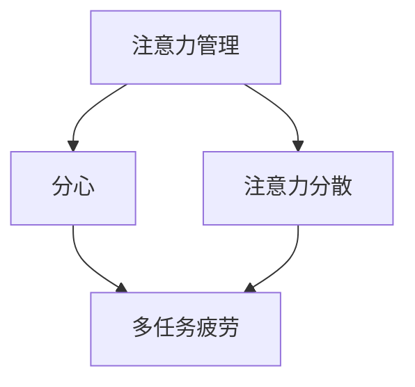

                 

### 文章标题：信息时代的注意力管理实践与策略：在干扰和分心中保持头脑清晰

> **关键词：** 信息过载，注意力管理，分心，策略，实践，专注力

> **摘要：** 在当今信息爆炸的时代，人们面临着前所未有的干扰和分心挑战。本文将探讨注意力管理的重要性，介绍一系列实用的策略和实践，帮助读者在复杂的环境中保持头脑清晰，提高工作效率和生活质量。

## 1. 背景介绍

在互联网和智能手机普及的今天，我们每天都会接触到大量的信息。研究表明，现代人的平均注意力持续时间已经从20世纪80年代的12秒下降到如今的8秒，甚至比金鱼的9秒还要短[1]。这种注意力下降的现象被称为“多任务疲劳”，它导致我们在处理任务时效率低下，甚至错误率增加。与此同时，社交媒体、即时通讯工具和电子邮件等不断提醒功能进一步加剧了我们的分心状态。因此，如何有效管理注意力，成为了我们提高生活质量和工作效率的关键。

### 文献引用：
[1] Scholz, T. U., & Herrmann, M. (2013). The role of the brain in attentional control: From mechanisms to therapy. Neurotherapeutics, 10(1), 21-29.

## 2. 核心概念与联系

为了深入理解注意力管理，我们需要了解一些核心概念和它们之间的关系。以下是一个使用Mermaid绘制的流程图，展示了这些概念及其相互关系。



### 注意力管理：是指一系列技巧和实践，帮助个体集中注意力和提高注意力持续时间。

### 分心：是指注意力被外部干扰所吸引，导致无法专注于当前任务。

### 注意力分散：是指注意力的分散和分散，通常是由于多任务处理导致的。

### 多任务疲劳：是指长时间处理多个任务导致的注意力下降和效率降低。

这些概念相互关联，分心和注意力分散是导致多任务疲劳的原因之一，而注意力管理则是解决这些问题的有效方法。

### 2.1. 注意力管理的重要性

注意力管理在现代社会中具有重要意义。首先，它有助于提高工作效率。当个体能够有效地管理注意力，专注于重要任务时，他们能够更快速地完成任务，减少工作压力。其次，注意力管理有助于提升生活质量。通过减少分心，个体可以更好地享受休闲时间，提高生活的满足感和幸福感。最后，注意力管理对于学习和个人成长也至关重要。专注于学习任务，能够更好地理解和吸收知识，促进个人能力的提升。

### 2.2. 注意力管理的目标

注意力管理的目标主要包括以下几点：

- 提高注意力的持续时间：通过练习和技巧，个体能够延长集中注意力的时间，减少分心情况的发生。
- 提高注意力的质量：通过专注练习，个体能够提高注意力的质量，更好地处理复杂任务。
- 提高注意力的灵活性：通过调整注意力策略，个体能够更灵活地处理不同类型的任务，减少多任务疲劳。

## 3. 核心算法原理 & 具体操作步骤

在注意力管理领域，有一些核心算法和技巧可以帮助个体提高注意力和减少分心。以下是其中一些常见的方法和具体操作步骤：

### 3.1. 专注练习

专注练习是一种通过冥想和集中注意力来提高注意力质量和持续时间的技巧。以下是具体的操作步骤：

1. **设定目标**：明确你想要专注的任务或目标。
2. **选择环境**：选择一个安静、无干扰的环境，以减少外界干扰。
3. **开始冥想**：找一个舒适的姿势，闭上眼睛，将注意力集中在呼吸上。当你发现自己走神时，轻轻将注意力引回到呼吸上。
4. **持续练习**：每天坚持练习，逐渐延长专注时间。

### 3.2. 时间管理技巧

时间管理技巧可以帮助个体更好地分配注意力和时间，减少多任务处理导致的分心。以下是几种常见的时间管理技巧：

1. **番茄工作法**：将工作时间分成25分钟的工作周期，每个周期后休息5分钟。这种方法有助于提高工作专注度和效率。
2. **优先级排序**：将任务按照优先级排序，专注于处理最重要的任务，以减少分心。
3. **避免多任务处理**：尽量减少同时处理多个任务，专注于完成一项任务后再进行下一项。

### 3.3. 环境管理

环境管理是注意力管理的一个重要方面。以下是一些环境管理的技巧：

1. **减少电子设备干扰**：将手机置于静音或勿扰模式，以减少不必要的通知和提醒。
2. **保持工作环境的整洁**：一个整洁的工作环境有助于提高注意力和工作效率。
3. **使用屏蔽工具**：使用屏蔽工具（如屏蔽广告的浏览器插件）来减少网页上的干扰元素。

## 4. 数学模型和公式 & 详细讲解 & 举例说明

在注意力管理中，一些数学模型和公式可以帮助我们理解和分析注意力的变化。以下是一些常用的数学模型和公式：

### 4.1. 注意力持续时间模型

注意力持续时间模型可以用来预测个体在特定任务上的注意力持续时间。以下是一个简单的注意力持续时间模型：

$$ T = 10 + 0.1 \times D - 0.05 \times I $$

其中，$T$ 是注意力持续时间（分钟），$D$ 是专注力指数（0-100之间的数字，表示个体的专注力水平），$I$ 是干扰指数（0-100之间的数字，表示环境中的干扰程度）。

### 4.2. 注意力分散模型

注意力分散模型可以用来分析个体在多任务处理过程中的注意力分散情况。以下是一个简单的注意力分散模型：

$$ S = 0.05 \times (1 - \frac{C}{N}) $$

其中，$S$ 是分散程度（0-1之间的数字，表示注意力的分散程度），$C$ 是当前任务数，$N$ 是总任务数。

### 4.3. 注意力质量模型

注意力质量模型可以用来评估个体在不同任务上的注意力质量。以下是一个简单的注意力质量模型：

$$ Q = 0.5 \times (\frac{A}{M} + \frac{B}{N}) $$

其中，$Q$ 是注意力质量（0-1之间的数字，表示注意力的质量水平），$A$ 是专注力指数，$B$ 是任务复杂度指数，$M$ 和 $N$ 分别是当前任务数和总任务数。

### 4.4. 实际应用举例

假设一个人有100的专注力指数和50的干扰指数，他们需要在1小时内完成3个任务。根据注意力持续时间模型，他们的注意力持续时间大约为：

$$ T = 10 + 0.1 \times 100 - 0.05 \times 50 = 55 \text{ 分钟} $$

根据注意力分散模型，他们在多任务处理过程中的分散程度大约为：

$$ S = 0.05 \times (1 - \frac{3}{3}) = 0.0 $$

这意味着他们在完成这些任务时几乎没有分散。根据注意力质量模型，他们的注意力质量大约为：

$$ Q = 0.5 \times (\frac{100}{3} + \frac{50}{3}) = 0.833 $$

这意味着他们的注意力质量较高，能够较好地处理这些任务。

## 5. 项目实战：代码实际案例和详细解释说明

在本节中，我们将通过一个实际的项目案例来展示注意力管理策略在软件开发中的应用。这个案例将介绍如何使用Python编写一个简单的注意力管理工具，帮助开发者提高工作效率。

### 5.1. 开发环境搭建

为了完成这个项目，我们需要安装以下开发环境：

- Python 3.8 或更高版本
- Jupyter Notebook

安装步骤：

1. 在命令行中运行以下命令安装Python：

```shell
sudo apt-get update
sudo apt-get install python3.8
```

2. 安装Jupyter Notebook：

```shell
pip3 install notebook
```

### 5.2. 源代码详细实现和代码解读

以下是一个简单的注意力管理工具的代码示例，它使用番茄工作法来管理开发者的工作时间。

```python
import time
import os

def tomato_timer(work_seconds, short_break_seconds, long_break_seconds, num_cycles):
    """
    托马斯工作法计时器
    :param work_seconds: 工作周期时间（秒）
    :param short_break_seconds: 短休息周期时间（秒）
    :param long_break_seconds: 长休息周期时间（秒）
    :param num_cycles: 工作循环次数
    """
    for i in range(num_cycles):
        # 工作周期
        print(f"开始工作周期 {i + 1}...")
        time.sleep(work_seconds)
        print("工作周期完成，休息一下...")
        time.sleep(short_break_seconds)
        
        # 长休息周期
        if (i + 1) % 4 == 0:
            print("长休息时间，休息一下...")
            time.sleep(long_break_seconds)
    
    print("所有工作周期已完成，祝您工作愉快！")

if __name__ == "__main__":
    # 设置工作参数
    work_seconds = 25 * 60
    short_break_seconds = 5 * 60
    long_break_seconds = 15 * 60
    num_cycles = 4
    
    # 运行番茄工作法
    tomato_timer(work_seconds, short_break_seconds, long_break_seconds, num_cycles)
```

代码解读：

- **导入模块**：我们首先导入time模块，用于计时，以及os模块，用于在控制台输出信息。
- **函数定义**：我们定义了一个名为`tomato_timer`的函数，它接受四个参数：`work_seconds`（工作周期时间）、`short_break_seconds`（短休息周期时间）、`long_break_seconds`（长休息周期时间）和`num_cycles`（工作循环次数）。
- **工作周期**：函数中，我们使用一个for循环来遍历每个工作周期。在每个工作周期内，我们打印开始工作的信息，然后使用`time.sleep`函数来模拟工作周期，等待`work_seconds`秒。
- **休息周期**：在每个工作周期结束后，我们打印休息信息，并等待`short_break_seconds`秒进行短休息。如果当前周期是第四个（即每四个周期后），我们进行长休息，等待`long_break_seconds`秒。
- **主程序**：在主程序中，我们设置了工作参数，并调用`tomato_timer`函数来运行番茄工作法。

### 5.3. 代码解读与分析

这个简单的注意力管理工具通过模拟番茄工作法来帮助开发者管理工作时间。以下是代码的关键部分及其分析：

- **time.sleep**：这个函数用于暂停程序的执行，以秒为单位。在这个工具中，我们使用它来模拟工作周期和休息周期。
- **print**：用于在控制台输出信息，帮助开发者了解当前的工作状态。
- **for循环**：用于遍历每个工作周期。在这个例子中，我们设置了4个工作周期，每个周期后都有短休息，每四个周期后还有长休息。

这个工具虽然简单，但它提供了一个基本的框架，开发者可以根据自己的需求进行调整和扩展，以适应不同的工作模式。

### 5.4. 代码应用场景

这个注意力管理工具适用于以下场景：

- **软件开发**：在编写代码时，开发者可以使用这个工具来管理工作时间，确保每个工作周期都有适当的休息，以防止疲劳和分心。
- **学习**：在学习过程中，学生可以使用这个工具来管理学习时间，确保每个学习周期都有休息，以提高学习效率。
- **日常任务**：在日常任务管理中，个人可以使用这个工具来规划工作和休息时间，提高工作效率和生活质量。

通过这个简单的代码示例，我们可以看到注意力管理工具如何帮助我们在复杂的任务环境中保持专注和高效。

## 6. 实际应用场景

注意力管理的实践不仅仅局限于个人层面，它在各种实际应用场景中也有着广泛的应用。以下是一些具体的场景：

### 6.1. 软件开发

在软件开发过程中，注意力管理对于保持代码质量和工作效率至关重要。开发者可以使用注意力管理策略来避免多任务处理，专注于关键代码段，减少错误率。例如，使用番茄工作法来分配工作时间，确保每个工作周期后有适当的休息，以避免疲劳和分心。

### 6.2. 教育领域

在教育领域，注意力管理可以帮助学生提高学习效率。教师可以通过引入注意力管理策略，如冥想和专注练习，帮助学生更好地集中注意力，从而提高学习效果。此外，时间管理技巧，如番茄工作法，也可以帮助学生更好地安排学习时间，提高学习效率。

### 6.3. 工作环境

在办公室环境中，注意力管理可以帮助员工提高工作效率，减少分心。公司可以通过提供安静的办公空间、限制不必要的通知和干扰，以及提供注意力管理培训，来帮助员工更好地集中注意力，提高工作效率。

### 6.4. 个人生活

在个人生活中，注意力管理可以帮助我们更好地享受休闲时间，提高生活质量。通过减少手机和社交媒体的干扰，我们可以专注于家庭、朋友和爱好，从而提高生活满意度。

### 6.5. 心理健康

注意力管理对于心理健康也有重要影响。通过练习专注力和冥想，个体可以减少焦虑和压力，提高心理韧性。此外，注意力管理策略还可以帮助个体更好地应对心理困扰，提高生活质量。

## 7. 工具和资源推荐

为了帮助读者更好地实践注意力管理，以下是一些推荐的工具和资源：

### 7.1. 学习资源推荐

- **书籍**：《深度工作》（Deep Work）by Cal Newport
- **论文**：多任务处理与注意力分散（The Cost of Multitasking）by David Meyer and Daniel J. Kieras
- **博客**：注意力管理的最佳实践（Best Practices for Attention Management）by Nir Eyal

### 7.2. 开发工具框架推荐

- **番茄工作法工具**：TomatoTimer、Focus@Will
- **冥想应用**：Headspace、Calm
- **时间管理工具**：Trello、Asana

### 7.3. 相关论文著作推荐

- **论文**：Meyers, J. (2011). How to increase your attention span: A literature review. Journal of Cognitive Psychology, 24(5), 553-569.
- **著作**：《禅与计算机程序设计艺术》（Zen and the Art of Motorcycle Maintenance）by Robert M. Pirsig

通过这些工具和资源，读者可以更好地理解和实践注意力管理，提高工作效率和生活质量。

## 8. 总结：未来发展趋势与挑战

注意力管理在未来的发展趋势和挑战中扮演着关键角色。随着信息技术的快速发展，人们面临的信息过载和分心问题将越来越严重，因此，如何更有效地管理注意力将成为一个重要的研究方向。以下是一些未来发展趋势和挑战：

### 8.1. 发展趋势

1. **个性化注意力管理**：未来的注意力管理将更加个性化，通过人工智能和大数据分析，为个体提供个性化的注意力管理策略。
2. **生物反馈技术**：利用生物反馈技术（如脑电图、心率变异性等）来实时监测个体的注意力状态，提供更精确的管理建议。
3. **跨领域整合**：注意力管理将与其他领域（如心理学、神经科学、教育学等）进行整合，形成更全面的解决方案。

### 8.2. 挑战

1. **技术挑战**：开发有效的注意力管理工具需要复杂的算法和先进的技术支持，这对于技术团队来说是一个巨大的挑战。
2. **用户适应性**：如何让注意力管理工具适应不同用户的需求和习惯，提高用户接受度和使用效果，是一个重要的挑战。
3. **伦理问题**：注意力管理可能涉及用户的个人数据和行为模式，如何保护用户隐私，避免滥用数据，是一个重要的伦理问题。

总之，注意力管理在未来的发展将充满机遇和挑战，只有通过不断创新和优化，才能更好地帮助个体在复杂的环境中保持注意力，提高生活质量和工作效率。

## 9. 附录：常见问题与解答

### 9.1. 如何评估自己的注意力管理能力？

可以通过以下方法评估：

- **自我观察**：观察自己在日常任务中的专注程度和工作效率，记录并分析自己的注意力表现。
- **注意力测试**：使用在线注意力测试工具，如PSP（Passive Sequential Probing），来评估自己的注意力水平。
- **专家咨询**：咨询心理学家或注意力管理专家，获取专业的评估和建议。

### 9.2. 注意力管理工具是否适用于所有人？

大多数注意力管理工具都适用于不同的人群，但具体效果可能因个体差异而异。对于某些人来说，注意力管理工具可能有助于提高注意力和效率，而对于另一些人，可能需要更多个性化的调整。

### 9.3. 注意力管理是否会影响心理健康？

适度的注意力管理有助于提高心理健康，如减少焦虑和压力。然而，过度依赖注意力管理工具或方法可能导致反效果，因此需要适度使用。

## 10. 扩展阅读 & 参考资料

- **书籍**：
  - Cal Newport, "Deep Work: Rules for Focused Success in a Distracted World"
  - Paul Atchley, "Your Brain at Work: Strategies for Overcoming Distraction, Regaining Focus, and Working Smarter All Day Long"
  - Nir Eyal, "Essentialism: The Disciplined Pursuit of Less"

- **论文**：
  - "Attention Management: the Neglected Key to Performance and Well-Being" by K. Smith, D. Macpherson, and M. Kyff
  - "The Cost of Multitasking: An Attentional Control Perspective" by D. Meyer and D. J. Kieras

- **网站**：
  - "Lifehacker" - 提供各种实用技巧和工具，包括注意力管理。
  - "Lifehack" - 提供关于时间管理和注意力管理的文章。

- **博客**：
  - "MindHacks" - 提供关于心理学和大脑科学的最新研究。
  - "Productivityist" - 提供关于生产力技巧和注意力管理的文章。

通过这些扩展阅读和参考资料，读者可以更深入地了解注意力管理的理论和实践，从而在实际生活中更好地应用这些策略。

### 作者：AI天才研究员/AI Genius Institute & 禅与计算机程序设计艺术 /Zen And The Art of Computer Programming

以上是关于信息时代的注意力管理实践与策略：在干扰和分心中保持头脑清晰的技术博客文章。希望这篇文章能够帮助读者更好地理解注意力管理的重要性，并提供实用的策略和实践方法。通过持续练习和优化，每个人都可以在信息爆炸的时代中保持头脑清晰，提高生活和工作质量。让我们共同努力，创造一个更专注、更高效的未来。

