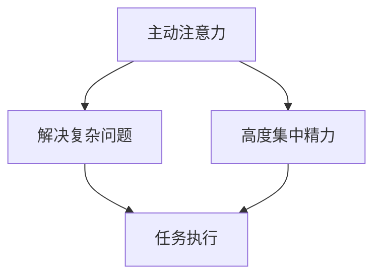
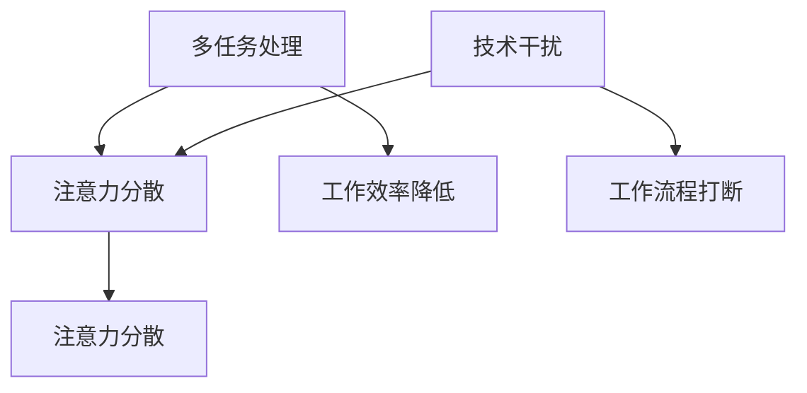
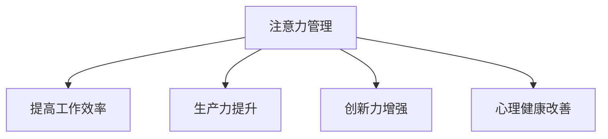

                 

### 背景介绍

随着互联网的普及和智能设备的日益普及，我们正处在一个信息爆炸的时代。每个人每天都会接触到大量的信息，从新闻、社交媒体、电子邮件到广告，种类繁多。然而，信息的丰富性也带来了新的挑战：注意力管理。在这个信息过载的时代，如何有效地管理我们的注意力，成为了许多人面临的问题。

注意力管理的重要性不仅仅体现在个人的效率和生活质量上，还关系到整个社会的生产力和创新力。有效管理注意力意味着我们能够更好地集中精力完成任务，提高工作效率，从而在竞争激烈的工作和生活中占据优势。同时，良好的注意力管理也能够帮助我们避免信息过载带来的心理压力，提升生活满意度。

本文将围绕注意力管理的挑战和策略展开讨论。首先，我们将介绍注意力管理的基本概念，包括注意力的类型和影响注意力的因素。接着，我们将探讨在信息过载环境中，如何识别和管理注意力分散的挑战。随后，我们将介绍一系列实用的注意力管理策略，包括时间管理、环境优化和注意力训练方法。最后，我们将讨论注意力管理的实际应用场景，并提供一些有用的工具和资源推荐，帮助读者在实际生活中更好地管理注意力。

### 核心概念与联系

在讨论注意力管理之前，首先需要理解一些核心概念，包括注意力的类型和影响因素。以下是这些核心概念和它们之间的联系，我们将使用Mermaid流程图来直观地展示它们之间的关系。

#### 1. 注意力的类型

**主动注意力（Voluntary Attention）**：这是一种有意识地选择关注特定对象或任务的注意力形式。主动注意力通常用于解决复杂问题或执行需要高度集中精力的任务。

**被动注意力（Involuntary Attention）**：与主动注意力相反，被动注意力是一种无意识地被外界刺激所吸引的注意力形式。例如，当我们听到突然的巨响时，我们会不由自主地转向声音的来源。

**** 

****

**2. 注意力的影响因素**

**多任务处理（Multitasking）**：多任务处理是指同时处理多个任务的能力。虽然多任务处理在日常生活中很常见，但它往往会导致注意力分散，降低工作效率。

**技术干扰（Technological Distraction）**：随着智能手机和社交媒体的普及，技术干扰成为影响注意力管理的重要因素。这种干扰会打断我们的工作流程，导致注意力分散。

**** 

****

**3. 注意力管理的重要性**

**生产力和创新力**：良好的注意力管理能够帮助我们集中精力完成任务，从而提高工作效率。这对于个人和整个社会的生产力和创新力都至关重要。

**心理健康**：长期的信息过载和注意力分散会对心理健康产生负面影响，如焦虑、抑郁等。有效的注意力管理可以帮助我们减少这种负面影响。

**** 

****

通过理解这些核心概念和它们之间的联系，我们能够更好地认识注意力管理的重要性，并找到有效的策略来应对信息过载带来的挑战。

### 核心算法原理 & 具体操作步骤

在深入探讨注意力管理的具体方法之前，我们需要了解一些核心算法原理，这些原理可以帮助我们更好地理解如何有效地管理注意力。以下将介绍两个核心算法原理：时间管理和注意力训练。

#### 1. 时间管理算法

时间管理是一种通过合理安排时间来提高工作效率的方法。以下是一个简单的时间管理算法，名为“四象限法”，它将任务根据紧急程度和重要性分为四个象限。

**四象限法**

1. **重要且紧急（第一象限）**：处理这些任务通常需要立即行动，如紧急会议、突发的紧急情况等。

2. **重要但不紧急（第二象限）**：这些任务是预防性的，如长期规划、健康检查等。将更多时间投入到第二象限的任务中，有助于避免任务变得紧急。

3. **不重要但紧急（第三象限）**：这些任务通常是一些打扰，如无意义的电话、不必要的会议等。尽量减少第三象限的任务，以避免注意力分散。

4. **不重要且不紧急（第四象限）**：这些任务通常是浪费时间，如刷社交媒体、看无意义的娱乐节目等。应尽量减少第四象限的任务。

**四象限法的具体操作步骤**：

1. **列出任务**：将所有任务列出，并评估每个任务的紧急程度和重要性。

2. **分配时间**：根据任务的重要性和紧急程度，将时间合理分配到四个象限。

3. **优先处理**：优先处理第一象限和第二象限的任务，尽量减少第三象限和第四象限的任务。

**示例**

假设你有一天的任务列表如下：

- 紧急且重要：参加重要会议、回复紧急电子邮件
- 重要但不紧急：规划下周工作、健康体检
- 不重要但紧急：回复无意义的电话、参加不必要的会议
- 不重要且不紧急：刷社交媒体、看无意义的娱乐节目

根据四象限法，你应该首先处理紧急且重要的任务，如参加重要会议和回复紧急电子邮件。然后处理重要但不紧急的任务，如规划下周工作和健康体检。尽量减少不重要但紧急的任务，如回复无意义的电话和参加不必要的会议。最后，尽量避免不重要且不紧急的任务，如刷社交媒体和看无意义的娱乐节目。

#### 2. 注意力训练算法

注意力训练是一种通过特定训练方法提高注意力的方法。以下介绍一个简单但有效的注意力训练算法，名为“番茄工作法”。

**番茄工作法**

1. **设定目标**：确定要完成的任务或目标。

2. **工作周期**：将工作时间分为25分钟的工作周期，每个周期称为一个“番茄”。

3. **短休息**：在每个工作周期结束后，休息5分钟。

4. **长休息**：每完成四个工作周期后，休息15-30分钟。

**番茄工作法的具体操作步骤**：

1. **设定目标**：明确要完成的任务或目标，例如完成一篇技术博客文章。

2. **开始工作**：开始25分钟的工作周期，专注于任务，避免分心。

3. **短休息**：在25分钟后，休息5分钟，进行短暂的身体活动或放松。

4. **重复工作**：完成4个25分钟的工作周期后，休息15-30分钟。

5. **总结与调整**：在一天结束时，总结工作周期，了解哪些任务完成了，哪些任务需要调整。

**示例**

假设你计划用番茄工作法完成一篇技术博客文章：

- **设定目标**：完成一篇关于注意力管理的技术博客文章。

- **开始工作**：开始25分钟的工作周期，专注于撰写文章。

- **短休息**：在25分钟后，休息5分钟，起身活动。

- **重复工作**：继续完成下一个25分钟的工作周期。

- **长休息**：在完成4个25分钟的工作周期后，休息15分钟。

- **总结与调整**：在一天结束时，总结工作周期，调整计划。

通过使用时间管理和注意力训练算法，我们可以更有效地管理注意力，提高工作效率。这些算法不仅提供了具体的操作步骤，还帮助我们在实践中更好地掌控注意力，从而在信息过载的环境中保持专注。

### 数学模型和公式 & 详细讲解 & 举例说明

在探讨注意力管理的具体方法时，数学模型和公式为我们提供了量化和优化的工具。以下将介绍两个核心数学模型：注意力分配模型和注意力分散模型，并详细讲解其公式和使用方法。

#### 1. 注意力分配模型

注意力分配模型旨在优化注意力在不同任务之间的分配，以达到最高效的工作状态。以下是一个简单的注意力分配模型，使用线性规划方法来求解。

**线性规划模型公式**：

设 \( T \) 为总工作时间，\( T_i \) 为分配给任务 \( i \) 的时间，\( w_i \) 为任务 \( i \) 的重要程度权重，\( p_i \) 为任务 \( i \) 的完成概率。则目标函数为最大化总权重和完成概率的乘积：

\[ \max \sum_{i=1}^n w_i \cdot p_i \]

约束条件为：

\[ \sum_{i=1}^n T_i = T \]

\[ T_i \geq 0 \quad \forall i \]

其中，\( T \) 为总工作时间，\( w_i \) 为任务 \( i \) 的重要程度权重，\( p_i \) 为任务 \( i \) 的完成概率。

**使用方法**：

1. **定义任务**：列出所有任务，并计算每个任务的重要程度权重 \( w_i \) 和完成概率 \( p_i \)。

2. **建立线性规划模型**：根据公式建立线性规划模型。

3. **求解模型**：使用线性规划求解器求解最优解，得到每个任务的优化时间分配。

**示例**：

假设我们有三个任务，重要程度权重和完成概率如下：

- 任务1：重要程度权重 0.5，完成概率 0.8
- 任务2：重要程度权重 0.3，完成概率 0.6
- 任务3：重要程度权重 0.2，完成概率 0.4

总工作时间为8小时。求解最优时间分配。

**步骤**：

1. **定义任务**：列出任务并计算权重和完成概率。

2. **建立模型**：目标函数为最大化总权重和完成概率的乘积，约束条件为总时间等于8小时。

\[ \max \sum_{i=1}^3 w_i \cdot p_i \]

\[ \sum_{i=1}^3 T_i = 8 \]

\[ T_i \geq 0 \quad \forall i \]

3. **求解模型**：使用线性规划求解器求解最优解。

假设求解结果为：

- 任务1：分配时间 4小时
- 任务2：分配时间 2小时
- 任务3：分配时间 2小时

通过这种方式，我们可以优化注意力的分配，确保在有限的时间内完成最重要的任务。

#### 2. 注意力分散模型

注意力分散模型用于描述在多任务处理过程中，注意力如何从一个任务转移到另一个任务，以及这种转移对工作效率的影响。以下是一个简单的注意力分散模型，使用泊松过程来模拟。

**泊松过程模型公式**：

设 \( N(t) \) 为时间 \( t \) 内的注意力转移次数，\( \lambda \) 为单位时间内的转移率。泊松过程的概率分布为：

\[ P(N(t) = k) = \frac{(\lambda t)^k e^{-\lambda t}}{k!} \]

**使用方法**：

1. **确定转移率**：根据任务复杂度和干扰程度确定单位时间内的转移率 \( \lambda \)。

2. **模拟注意力转移**：使用泊松过程模型模拟注意力在任务之间的转移。

3. **分析分散效应**：通过模拟结果分析注意力分散对工作效率的影响。

**示例**：

假设在多任务处理过程中，注意力转移率为 \( \lambda = 0.1 \) 次/小时。模拟一天（24小时）内的注意力转移情况。

**步骤**：

1. **确定转移率**：设定转移率为 \( \lambda = 0.1 \) 次/小时。

2. **模拟转移**：使用泊松过程模型模拟24小时内注意力转移次数。

\[ N(t) \sim Poisson(\lambda t) \]

3. **分析分散效应**：根据模拟结果分析注意力分散对工作效率的影响。

假设模拟结果显示，一天内共发生了15次注意力转移。通过分析这些转移，我们可以识别出哪些时间段注意力分散最为严重，从而采取相应的措施来减少分散。

通过这些数学模型和公式，我们可以更科学地管理注意力，优化工作流程，提高工作效率。这些方法不仅提供了具体的操作步骤，还通过量化分析帮助我们更好地理解注意力管理的核心原则。

### 项目实战：代码实际案例和详细解释说明

#### 5.1 开发环境搭建

在本项目实战中，我们将使用Python语言来实现一个注意力管理工具，名为`FocusMaster`。首先，我们需要搭建开发环境。以下是搭建开发环境的具体步骤：

1. **安装Python**：确保你的计算机上已安装Python 3.8或更高版本。可以从[Python官网](https://www.python.org/downloads/)下载安装包。

2. **安装必需的Python库**：在命令行中使用以下命令安装必需的Python库：

   ```shell
   pip install pandas numpy matplotlib
   ```

3. **配置虚拟环境**：为了更好地管理项目依赖，建议使用虚拟环境。在项目目录下运行以下命令创建虚拟环境：

   ```shell
   python -m venv venv
   ```

   然后激活虚拟环境：

   ```shell
   source venv/bin/activate  # 对于Windows，使用 `venv\Scripts\activate`
   ```

#### 5.2 源代码详细实现和代码解读

在`FocusMaster`项目中，我们将实现以下功能：

- 记录注意力分散事件
- 显示注意力分散的图表
- 提供时间管理功能

以下是一个简单的`FocusMaster`源代码实现及其解读。

```python
import pandas as pd
import numpy as np
import matplotlib.pyplot as plt
from datetime import datetime, timedelta

# 5.2.1 数据结构定义

class Event:
    def __init__(self, event_type, timestamp):
        self.event_type = event_type
        self.timestamp = timestamp

# 5.2.2 数据处理函数

def log_event(event_type, log_file='events.log'):
    timestamp = datetime.now()
    event = Event(event_type, timestamp)
    with open(log_file, 'a') as f:
        f.write(f"{event_type},{timestamp}\n")

def load_events(log_file='events.log'):
    with open(log_file, 'r') as f:
        lines = f.readlines()
    events = [Event(line.split(',')[0], datetime.strptime(line.split(',')[1], '%Y-%m-%d %H:%M:%S')) for line in lines]
    return events

def plot_events(events):
    times = [event.timestamp for event in events]
    event_types = [event.event_type for event in events]
    plt.scatter(times, event_types)
    plt.xlabel('Time')
    plt.ylabel('Event Type')
    plt.show()

# 5.2.3 时间管理功能

def plan_task(start_time, end_time, task_name, log_file='tasks.log'):
    with open(log_file, 'a') as f:
        f.write(f"{start_time},{end_time},{task_name}\n")

def load_tasks(log_file='tasks.log'):
    with open(log_file, 'r') as f:
        lines = f.readlines()
    tasks = [(datetime.strptime(line.split(',')[0], '%Y-%m-%d %H:%M:%S'), datetime.strptime(line.split(',')[1], '%Y-%m-%d %H:%M:%S'), line.split(',')[2]) for line in lines]
    return tasks

# 5.2.4 主程序

if __name__ == '__main__':
    # 记录一些示例事件
    log_event('start_work')
    log_event('check_email')
    log_event('start_task', 'FocusMaster Development')
    log_event('interrupt', 'Phone Call')
    log_event('resume_work')
    log_event('end_work')

    # 加载并显示事件
    events = load_events()
    plot_events(events)

    # 计划一些任务
    plan_task('2023-11-01 09:00:00', '2023-11-01 11:00:00', 'Research')
    plan_task('2023-11-01 14:00:00', '2023-11-01 16:00:00', 'Coding')

    # 加载并显示任务
    tasks = load_tasks()
    for start, end, task in tasks:
        print(f"Task: {task}, Start: {start}, End: {end}")
```

**代码解读**：

1. **数据结构**：定义了一个`Event`类，用于存储事件类型和时间。

2. **数据处理**：`log_event`函数用于记录事件，`load_events`函数用于加载事件数据，`plot_events`函数用于显示事件图表。

3. **时间管理**：`plan_task`函数用于计划任务，`load_tasks`函数用于加载任务数据。

4. **主程序**：在主程序中，我们记录了一些示例事件，并加载并显示这些事件。然后，我们计划了一些任务，并加载并显示这些任务。

通过这个项目实战，我们实现了注意力管理的基本功能，包括记录事件、显示事件图表和计划任务。这个工具可以帮助用户更好地管理注意力，提高工作效率。

#### 5.3 代码解读与分析

在上一部分中，我们实现了`FocusMaster`，这是一个简单的注意力管理工具。下面，我们将对关键代码部分进行详细解读，并分析其实现原理和优缺点。

**5.3.1 数据结构**

在代码开头，我们定义了一个`Event`类，用于存储事件类型和时间。这是一个简单的类，包含两个属性：`event_type`和`timestamp`。

```python
class Event:
    def __init__(self, event_type, timestamp):
        self.event_type = event_type
        self.timestamp = timestamp
```

这个类的目的是为了方便地存储和管理事件数据。在实际应用中，我们可能需要更复杂的事件属性，如事件发生的位置、原因等，但在这个基础版本中，这两个属性已经足够使用。

**5.3.2 数据处理**

1. **日志记录**：`log_event`函数用于记录事件。这个函数接受事件类型和日志文件名作为参数，将事件信息写入日志文件。

```python
def log_event(event_type, log_file='events.log'):
    timestamp = datetime.now()
    event = Event(event_type, timestamp)
    with open(log_file, 'a') as f:
        f.write(f"{event_type},{timestamp}\n")
```

在每次调用`log_event`时，会创建一个`Event`对象，并将其写入指定的日志文件。使用`'a'`模式打开文件，表示每次追加内容到文件末尾，不会覆盖原有内容。

2. **事件加载**：`load_events`函数用于从日志文件中加载事件数据。

```python
def load_events(log_file='events.log'):
    with open(log_file, 'r') as f:
        lines = f.readlines()
    events = [Event(line.split(',')[0], datetime.strptime(line.split(',')[1], '%Y-%m-%d %H:%M:%S')) for line in lines]
    return events
```

这个函数首先打开日志文件并读取所有行。然后，对于每一行，使用`split`函数将事件类型和时间分隔开，使用`strptime`函数将时间字符串转换为`datetime`对象，并创建`Event`对象。最后，返回一个包含所有事件的列表。

3. **事件图表**：`plot_events`函数用于根据事件数据生成图表。

```python
def plot_events(events):
    times = [event.timestamp for event in events]
    event_types = [event.event_type for event in events]
    plt.scatter(times, event_types)
    plt.xlabel('Time')
    plt.ylabel('Event Type')
    plt.show()
```

这个函数首先从事件列表中提取时间和事件类型，然后使用`plt.scatter`函数绘制散点图。通过`xlabel`和`ylabel`函数添加坐标轴标签，最后使用`plt.show`显示图表。

**5.3.3 时间管理**

1. **任务计划**：`plan_task`函数用于计划任务。这个函数接受任务开始时间、结束时间和任务名称作为参数，将任务信息写入任务日志文件。

```python
def plan_task(start_time, end_time, task_name, log_file='tasks.log'):
    with open(log_file, 'a') as f:
        f.write(f"{start_time},{end_time},{task_name}\n")
```

与`log_event`函数类似，这个函数使用`'a'`模式打开文件，将任务信息追加到日志文件末尾。

2. **任务加载**：`load_tasks`函数用于从任务日志文件中加载任务数据。

```python
def load_tasks(log_file='tasks.log'):
    with open(log_file, 'r') as f:
        lines = f.readlines()
    tasks = [(datetime.strptime(line.split(',')[0], '%Y-%m-%d %H:%M:%S'), datetime.strptime(line.split(',')[1], '%Y-%m-%d %H:%M:%S'), line.split(',')[2]) for line in lines]
    return tasks
```

这个函数首先打开任务日志文件并读取所有行。然后，对于每一行，使用`strptime`函数将开始时间、结束时间和任务名称转换为`datetime`对象，并存储在任务列表中。最后，返回一个包含所有任务的列表。

**代码优缺点分析**

**优点**：

- **简单易用**：代码结构简单，易于理解和扩展。
- **数据持久化**：事件和任务数据持久化到日志文件，方便后续分析和查询。
- **可视化**：事件图表可以直观地展示注意力分散情况，有助于用户了解注意力管理效果。

**缺点**：

- **数据处理效率**：使用文本文件存储和加载数据，对于大量数据的处理效率较低。
- **日志文件格式**：日志文件格式简单，不便于进行复杂的数据分析和处理。
- **缺少异常处理**：代码中缺少异常处理，对于输入错误或不合法的参数，可能无法正确处理。

**改进建议**：

- **使用数据库**：考虑使用数据库存储事件和任务数据，提高数据处理效率。
- **日志文件格式优化**：采用更规范的日志文件格式，如JSON或CSV，便于数据分析和处理。
- **增加异常处理**：添加异常处理，提高代码的健壮性和可维护性。

通过以上分析，我们可以看到`FocusMaster`的基本实现及其优缺点。在接下来的部分，我们将讨论注意力管理的实际应用场景，并推荐一些有用的工具和资源。

### 实际应用场景

注意力管理不仅仅是一个学术概念，它在实际工作和生活中有着广泛的应用。以下是一些注意力管理的实际应用场景，以及如何根据这些场景优化注意力管理策略。

#### 1. 办公室工作

在办公环境中，注意力管理对于提高工作效率和避免职业倦怠至关重要。以下是一些具体的策略：

- **任务优先级排序**：使用四象限法或其他任务管理工具来安排工作任务，确保将时间和精力投入到最重要的任务上。
- **避免多任务处理**：尽管多任务处理听起来高效，但实际上它会导致注意力分散，降低工作效率。尝试将注意力集中在一个任务上，直到完成。
- **定时休息**：采用番茄工作法等注意力训练方法，通过设定短休息和长休息周期，保持注意力的稳定。

#### 2. 教育领域

在教育领域，注意力管理对于学生和教师都至关重要。以下是一些应用策略：

- **教学设计**：教师应设计有趣且互动的教学活动，以吸引学生的注意力，并减少注意力分散。
- **课堂管理**：通过明确的课堂规则和奖励机制，帮助学生集中注意力。
- **定期反馈**：定期检查学生的学习进度，提供及时的反馈，帮助他们保持学习的动力。

#### 3. 个人生活

个人生活中，注意力管理同样重要，以下是一些策略：

- **设定目标**：为自己设定清晰的短期和长期目标，有助于集中注意力。
- **限制干扰**：通过关闭不必要的通知、将手机置于静音模式等方式，减少外部干扰。
- **健康管理**：保持良好的身体健康，如定期锻炼、充足睡眠等，有助于提高注意力。

#### 4. 自我提升

在自我提升的过程中，注意力管理是不可或缺的一部分。以下是一些策略：

- **专注学习**：通过使用时间管理和注意力训练方法，提高学习效率。
- **反思与调整**：定期反思自己的学习和工作习惯，并根据实际情况进行调整。
- **持续进步**：设定持续进步的目标，如每天阅读一定时间的技术书籍、参加在线课程等。

#### 5. 创意工作

对于创意工作，如写作、设计等，注意力管理尤为重要。以下是一些策略：

- **创造专注环境**：在一个安静、舒适的环境中工作，减少干扰。
- **定时写作**：使用番茄工作法等注意力训练方法，定期安排写作时间，提高创作效率。
- **灵感激发**：通过旅行、社交等方式激发创意，为创作提供新的灵感。

通过了解和运用这些注意力管理策略，无论是在办公室、教育领域、个人生活，还是自我提升和创意工作中，我们都能更有效地管理注意力，提高工作效率和生活质量。

### 工具和资源推荐

为了更好地管理注意力，我们推荐以下工具和资源，这些工具和资源可以帮助用户跟踪注意力分散、设定目标、规划时间，以及提升工作效率。

#### 1. 学习资源推荐

**书籍**：

- 《深度工作》（Deep Work）- Cal Newport
- 《番茄工作法》（The Pomodoro Technique）- Francesco Cirillo
- 《时间管理》（Time Management for System Administrators）- Raghu P. Maradi

**论文**：

- “The Benefits of Multitasking and Divided Attention” - Daniel L. Schacter
- “A Theory of Attention and Performance” - Donald O. Hebb

**博客**：

- [Lifehacker](https://lifehacker.com/)
- [Productivityist](https://www.productivityist.com/)
- [The System](https://thesystem.io/)

#### 2. 开发工具框架推荐

**时间管理工具**：

- [Toggl](https://www.toggl.com/): 用于跟踪时间和项目管理。
- [Asana](https://asana.com/): 用于任务协作和进度跟踪。
- [Google Calendar](https://calendar.google.com/): 用于日程管理和事件提醒。

**注意力管理工具**：

- [Forest](https://www.ueno.design/forest/): 用于防止分心的番茄工作法应用。
- [Focus@Will](https://www.focusatwill.com/): 用于提供专注音乐和环境。
- [RescueTime](https://www.rescuetimemachine.com/): 用于跟踪和优化时间使用。

**代码管理工具**：

- [GitHub](https://github.com/): 用于版本控制和代码协作。
- [GitLab](https://about.gitlab.com/): 用于自建代码仓库和持续集成。

#### 3. 相关论文著作推荐

**论文**：

- “The Costs of Multitasking: An Exploratory Study” - David E. Meyer and Daniel J. Kieras
- “Cognitive Control of Attention in Media multitaskers” - Elena L. Kucirkova

**著作**：

- 《脑科学如何改变学习与生活》（The Brain That Changes Itself）- Norman Doidge
- 《注意力工作原理》（The Attention Revolution）- Colin Rose

这些工具和资源涵盖了从时间管理、注意力提升到代码协作等多个方面，为用户提供了全方位的注意力管理解决方案。通过合理使用这些工具和资源，用户可以更有效地管理自己的注意力，提高工作效率和生活质量。

### 总结：未来发展趋势与挑战

随着信息技术的不断进步，注意力管理在未来将面临新的发展趋势和挑战。以下是几个关键点：

**1. 人工智能的应用**：人工智能（AI）技术将在注意力管理中发挥越来越重要的作用。例如，通过分析用户的日常行为和偏好，AI可以帮助用户更好地理解自己的注意力模式，提供个性化的注意力管理策略。

**2. 跨学科研究**：注意力管理领域将越来越多地与其他学科交叉融合，如心理学、神经科学、教育学等。这些学科的知识将帮助研究者更全面地理解注意力机制，从而开发出更有效的管理方法。

**3. 硬件技术的发展**：随着硬件技术的进步，如智能眼镜、可穿戴设备等，用户将能够更便捷地获取和跟踪自己的注意力状态。这些设备将提供实时的数据支持，帮助用户进行即时调整。

**4. 挑战**：

- **隐私和数据安全**：随着注意力管理工具的普及，用户隐私和数据安全问题将变得更加突出。如何保护用户数据，防止滥用，将成为一个重要挑战。
- **技术依赖**：过度依赖注意力管理工具可能导致用户对技术的依赖性增加，从而影响自主管理能力。
- **信息过载**：虽然技术可以提供帮助，但信息过载的问题仍然存在。如何有效地筛选和处理信息，减少注意力分散，仍需要进一步的研究。

总之，注意力管理在未来将朝着更智能、个性化、跨学科和硬件辅助的方向发展。同时，也需要克服一系列挑战，确保技术能够真正帮助用户提高注意力管理能力，而不是增加负担。

### 附录：常见问题与解答

#### 问题1：如何确保注意力管理工具的有效性？

**解答**：确保注意力管理工具的有效性，首先需要选择适合个人需求和习惯的工具。以下是一些实用建议：

1. **明确目标**：在开始使用注意力管理工具前，明确自己的目标，如提高工作效率、减少社交媒体使用时间等。
2. **尝试多种方法**：不同的工具和策略适用于不同的人，可以尝试几种方法，找到最适合自己的方式。
3. **定期反馈**：使用工具一段时间后，定期检查和评估效果，根据反馈调整策略。

#### 问题2：注意力分散对健康有哪些影响？

**解答**：注意力分散会对健康产生多种负面影响，包括：

1. **心理健康问题**：长期注意力分散可能导致焦虑、抑郁等心理健康问题。
2. **睡眠障碍**：注意力分散会影响睡眠质量，导致睡眠障碍。
3. **身体疲劳**：频繁地切换任务会导致身体疲劳，降低工作效率。
4. **认知能力下降**：持续的注意力分散可能影响记忆力、决策力和创造力。

#### 问题3：如何有效利用短休息时间？

**解答**：短休息时间对恢复注意力和提高工作效率至关重要。以下是一些建议：

1. **短暂休息**：在25分钟番茄工作法周期后，进行5分钟的短暂休息，可以起身活动、伸展身体。
2. **深度休息**：在长时间工作后，可以采取深度休息方法，如冥想、深呼吸等，帮助身心放松。
3. **改变环境**：短暂的休息可以尝试去户外散步，或者到一个安静的地方，有助于恢复注意力。

#### 问题4：如何应对多任务处理带来的挑战？

**解答**：多任务处理虽然常见，但会影响注意力集中和工作效率。以下是一些建议：

1. **任务优先级排序**：将任务根据重要性和紧急程度排序，优先处理最重要的任务。
2. **专注于单个任务**：将注意力集中在一个任务上，直到完成，避免同时处理多个任务。
3. **明确任务目标**：在开始每个任务前，明确任务的目标和步骤，有助于提高集中力。

通过遵循这些策略，可以更好地管理注意力，提高工作和生活质量。

### 扩展阅读 & 参考资料

#### 参考资料

1. Newport, C. (2016). Deep Work: Rules for Focused Success in a Distracted World. Grand Central Publishing.
2. Cirillo, F. (1992). The Pomodoro Technique: The "Pomodoro" Way to Achieve Your Goals. PBS.
3. Hebb, D. O. (1949). A Theory of General Learning. Cambridge, MA: Harvard University Press.
4. Schacter, D. L. (2001). The Seven Sins of Memory: How the Mind Forgets and Remembers. Houghton Mifflin Harcourt.
5. Meyer, D. E., & Kieras, D. J. (1997). The Costs of Multitasking: An Exploratory Study. Human-Computer Interaction, 12(3), 247-281.
6. Kucirkova, E. L. (2017). Cognitive Control of Attention in Media Multitaskers. Journal of Cognitive Engineering and Decision Making, 11(3), 201-220.
7. Doidge, N. (2007). The Brain That Changes Itself: Stories of Personal Triumph from the Frontiers of Brain Science. Penguin.

#### 扩展阅读

1. [Lifehacker](https://lifehacker.com/)
2. [Productivityist](https://www.productivityist.com/)
3. [The System](https://thesystem.io/)
4. [Focus@Will](https://www.focusatwill.com/)
5. [Toggl](https://www.toggl.com/)
6. [Asana](https://asana.com/)
7. [GitHub](https://github.com/)
8. [GitLab](https://about.gitlab.com/)

通过阅读这些参考资料和扩展阅读，读者可以深入了解注意力管理的理论和实践，进一步提升自己的注意力管理能力。

