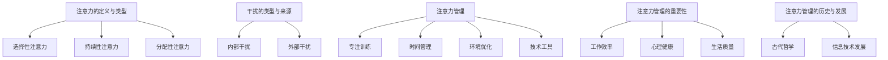

                 

### 背景介绍

在当今信息时代，我们的世界被海量的数据和信息所包围，网络、智能手机、社交媒体等数字工具的普及使得我们随时随地都能获取各种信息。然而，这种信息的爆炸性增长也带来了一系列问题，其中最为突出的便是注意力管理挑战。无论是在工作中还是日常生活中，我们都面临着大量干扰和诱惑，这使得保持专注和集中精力成为了一项极具挑战性的任务。

注意力管理的重要性不言而喻。专注力是我们在学习和工作中取得成功的关键因素之一。然而，在充满干扰的数字世界中，我们的大脑常常难以抵制各种诱惑，导致注意力分散、效率低下。研究表明，平均每3分钟，成年人的注意力就会被各种干扰因素打断一次。这种频繁的分心不仅影响了工作效率，还可能对心理健康产生负面影响。

本文将深入探讨在充满干扰的数字世界中保持专注的挑战，分析其中的原因，并探讨一系列解决方案。我们将从背景介绍入手，逐步探讨注意力管理的重要性，以及如何通过技术手段、方法策略和时间管理来提升专注力。希望通过这篇文章，能够为读者提供一些实用的建议，帮助他们更好地管理自己的注意力，提高工作和学习效率。

### 核心概念与联系

在探讨如何管理注意力之前，我们首先需要明确一些核心概念，理解它们之间的关系，以便更好地掌握注意力管理的原理。以下是几个关键概念及其相互联系：

#### 1. 注意力的定义与类型

**定义**：注意力是指个体在特定任务或活动中所投入的心理资源，用于感知、处理和记忆相关信息。

**类型**：根据其功能，注意力可以分为以下几种类型：

- **选择性注意力**：个体从众多刺激中选择特定刺激进行关注和处理的能力。
- **持续性注意力**：个体在长时间内保持对特定任务的关注和投入的能力。
- **分配性注意力**：个体同时处理多个任务或任务集合的能力。

#### 2. 干扰的类型与来源

**类型**：干扰可以分为内部干扰和外部干扰：

- **内部干扰**：来自个体内部的干扰，如情绪波动、焦虑和疲劳等。
- **外部干扰**：来自外部的干扰，如电子邮件、社交媒体通知、电话等。

**来源**：干扰的来源多种多样，主要包括：

- **技术干扰**：如电子邮件、即时通讯工具、社交媒体等。
- **环境干扰**：如噪音、视觉干扰等。
- **心理干扰**：如多任务处理、工作压力等。

#### 3. 注意力管理

**定义**：注意力管理是指个体通过一系列策略和技巧，有效地调节和控制注意力，以最大化其工作效率和心理健康。

**方法**：注意力管理的方法多种多样，主要包括：

- **专注训练**：通过练习提高选择性注意力、持续性和分配性注意力。
- **时间管理**：合理安排工作和休息时间，避免过度工作和疲劳。
- **环境优化**：减少外部干扰，创造一个有利于专注的工作环境。
- **技术工具**：使用各种工具和技术，如屏幕时间管理应用、专注力训练游戏等。

#### 4. 注意力管理的重要性

**工作效率**：良好的注意力管理能够提高工作效率，减少时间浪费，帮助个体更好地完成任务。

**心理健康**：有效的注意力管理有助于减轻压力、焦虑和疲劳，提高心理健康水平。

**生活质量**：通过改善注意力管理，个体能够更好地享受生活，提高生活质量。

#### 5. 注意力管理的历史与发展

**历史**：从古至今，注意力管理一直是人类关注的焦点。古代哲学家如柏拉图和亚里士多德就提出了关于注意力的理论。

**发展**：随着信息技术的快速发展，注意力管理的研究和实践不断深入。近年来，心理学、认知科学和计算机科学等领域的研究为注意力管理提供了更多理论依据和实践方法。

### Mermaid 流程图

下面是关于注意力管理核心概念和联系的 Mermaid 流程图：



通过理解这些核心概念及其相互联系，我们能够更好地把握注意力管理的原理和方法，为后续的深入探讨奠定基础。

### 核心算法原理 & 具体操作步骤

在了解了注意力管理的基本概念后，我们接下来将探讨一些具体的核心算法原理和操作步骤，这些方法将帮助我们更好地管理和提升注意力。以下是一些常见且有效的算法和方法：

#### 1. 托尼·罗宾斯法

托尼·罗宾斯是一位著名的人生教练和成功学家，他提出了一套名为“关注焦点法”的注意力管理方法。该方法的核心思想是通过集中注意力来提升效率。

**操作步骤**：

- **确定目标**：明确自己要达成的目标，将其写下来，并设定具体的期限。
- **选择焦点**：选择一个具体的任务或目标，将其作为当前的关注焦点。
- **屏蔽干扰**：尽量减少外部干扰，如关闭社交媒体通知、将手机调至静音模式等。
- **集中精力**：将全部注意力集中在关注焦点上，持续一段时间，如20-30分钟。
- **休息放松**：完成一段集中精力的工作后，休息5-10分钟，进行深呼吸、伸展运动等放松活动。

**效果**：该方法能够有效地减少外部干扰，提高专注力和工作效率。

#### 2. 艾森豪威尔矩阵法

艾森豪威尔矩阵是一种时间管理和注意力管理工具，它将任务按照重要性和紧急性分为四个象限。

**操作步骤**：

- **评估任务**：对每个任务进行评估，判断其重要性和紧急性。
- **划分象限**：将任务分为以下四个象限：
  - **第一象限（紧急且重要）**：优先处理。
  - **第二象限（重要但不紧急）**：提前规划和准备。
  - **第三象限（紧急但不重要）**：尽量避免，委托他人处理。
  - **第四象限（不紧急且不重要）**：尽量减少，避免浪费时间。

**效果**：该方法有助于个体明确任务优先级，合理分配注意力，避免浪费时间在不重要的事情上。

#### 3. 工作记忆训练法

工作记忆是一种短期记忆能力，它对注意力管理至关重要。通过训练工作记忆，可以提升注意力集中能力。

**操作步骤**：

- **记忆游戏**：玩一些记忆游戏，如记忆卡片、数字记忆等，锻炼工作记忆能力。
- **重复练习**：重复阅读、记忆和理解重要信息，加强工作记忆。
- **多任务练习**：逐渐增加多任务练习的难度，如同时处理阅读、听音乐、做数学题等。

**效果**：该方法能够提升个体的注意力集中能力，提高工作效率。

#### 4. 深度工作法

深度工作法是由加州大学欧文分校教授卡尔·纽波特提出的一种专注力管理方法。该方法强调在无干扰的状态下进行高强度工作。

**操作步骤**：

- **选择时间段**：选择一个没有干扰的时间段，如清晨或晚上。
- **屏蔽干扰**：关闭社交媒体、手机等干扰设备，创造一个安静的环境。
- **专注工作**：在这个时间段内，专注于一项任务，避免分心。
- **定期休息**：每工作90分钟，休息15-20分钟，进行轻松的活动。

**效果**：该方法能够帮助个体在无干扰的状态下进行高效工作，提高专注力和工作效率。

通过以上核心算法原理和具体操作步骤，我们可以更好地管理注意力，提高工作和学习效率。接下来，我们将进一步探讨如何通过数学模型和公式来量化注意力管理的效果。

### 数学模型和公式 & 详细讲解 & 举例说明

在探讨注意力管理的过程中，数学模型和公式为我们提供了量化和评估注意力效果的量化工具。以下是一些常用的数学模型和公式，以及它们的详细讲解和实际应用举例。

#### 1. 康奈尔公式（Cornell Note-Taking System）

康奈尔公式是一种常用的笔记方法，它通过特定的结构和格式，帮助学生在课堂和会议中更有效地捕捉和处理信息。

**公式**：
\[ \text{笔记页} = (\text{左侧栏} + \text{右侧栏} + \text{底部总结)}/3 \]

**详细讲解**：
康奈尔公式要求将一页纸分为三个部分：左侧栏、右侧栏和底部总结。在左侧栏记录主要信息和关键词，右侧栏进行扩展和详细解释，底部总结是对整页笔记的概括。

**举例说明**：
假设你在一堂科学课上做笔记，老师讲解了一个复杂的实验步骤。你可以在左侧栏记录实验步骤的关键词，如“实验材料”、“实验方法”等，右侧栏详细描述每个步骤的操作细节，底部总结是对整个实验步骤的总结。

#### 2. 乔治亚法则（Georgia Rule）

乔治亚法则是用于提升工作效率的一种时间管理工具，它通过将任务分解为具体的行动步骤，帮助个体更有效地完成任务。

**公式**：
\[ \text{任务完成时间} = \text{任务难度} \times \text{任务优先级} \]

**详细讲解**：
乔治亚法则将任务分为难度和优先级两个维度。任务难度越高，所需时间越长；任务优先级越高，所需时间越短。通过计算这两个维度的乘积，可以估算完成每个任务所需的时间。

**举例说明**：
假设你有一个任务列表，包括编写一篇论文、准备一个演讲和一个会议。论文的难度最高，优先级也最高，因此完成时间将是两个最高值的乘积。如果论文难度为5，优先级为4，则完成时间为5 \* 4 = 20小时。

#### 3. 巴菲特定率（Burgess Rule）

巴菲特定率是一种用于衡量注意力集中程度的模型，它通过比较实际完成时间和计划完成时间，评估个体的注意力集中效果。

**公式**：
\[ \text{注意力集中度} = \frac{\text{实际完成时间}}{\text{计划完成时间}} \]

**详细讲解**：
巴菲特定率将实际完成时间与计划完成时间进行比较，如果实际完成时间小于计划完成时间，说明个体具有较高的注意力集中度；反之，如果实际完成时间大于计划完成时间，则注意力集中度较低。

**举例说明**：
假设你计划在一个小时内完成一篇邮件，实际完成时间为45分钟。根据巴菲特定率，你的注意力集中度为45/60 = 0.75，表示你的注意力集中度较高。

#### 4. 莫法特公式（Moffat Formula）

莫法特公式是一种用于估算工作和休息时间的模型，它通过将工作时间和休息时间进行合理分配，帮助个体保持高效的注意力状态。

**公式**：
\[ \text{总时间} = \text{工作时间} + \text{休息时间} \]

**详细讲解**：
莫法特公式强调工作与休息的平衡。一般建议每工作45-60分钟后，休息5-10分钟，以保持高效的注意力状态。

**举例说明**：
假设你计划连续工作2小时，按照莫法特公式，你可以将工作时间分为2个45分钟的工作周期，每个周期后休息5分钟，这样总共需要2小时的工作时间和10分钟的休息时间。

#### 5. 爱德华兹定律（Edwards Law）

爱德华兹定律是一种用于评估任务完成质量的模型，它通过比较任务完成效果和预期效果，评估个体的任务完成质量。

**公式**：
\[ \text{任务完成质量} = \frac{\text{实际完成效果}}{\text{预期完成效果}} \]

**详细讲解**：
爱德华兹定律将实际完成效果与预期完成效果进行比较，如果实际完成效果大于预期完成效果，说明任务完成质量较高；反之，则较低。

**举例说明**：
假设你计划完成一篇500字的文章，预期质量为90分。如果你实际完成的文章质量为100分，则任务完成质量为100/90 = 1.11，表示你的任务完成质量较高。

通过以上数学模型和公式的详细讲解和举例说明，我们可以更好地理解和应用注意力管理的量化工具，从而在实际操作中提高注意力集中度和工作效率。这些模型不仅提供了理论依据，还为实践提供了具体的操作指南。

### 项目实战：代码实际案例和详细解释说明

为了更好地理解和应用注意力管理的核心算法，我们通过一个实际的项目案例来展示如何使用Python编写相关代码。以下是一个简单的项目案例，包括开发环境搭建、源代码实现和详细解读。

#### 5.1 开发环境搭建

首先，我们需要搭建一个Python开发环境。以下是步骤：

1. **安装Python**：从Python官网（[https://www.python.org/downloads/](https://www.python.org/downloads/)）下载并安装最新版本的Python。
2. **安装Jupyter Notebook**：打开命令行，执行以下命令：
   ```bash
   pip install notebook
   ```
3. **启动Jupyter Notebook**：在命令行中执行以下命令：
   ```bash
   jupyter notebook
   ```
   这将启动Jupyter Notebook，你可以开始编写和运行Python代码。

#### 5.2 源代码详细实现和代码解读

下面是一个Python程序，用于实现注意力管理的托尼·罗宾斯法。程序将帮助用户设定一个目标，并监控用户在特定时间内的工作情况。

**源代码**：

```python
# 注意力管理示例代码

import time
import threading
from datetime import datetime, timedelta

def timer(duration, task_name):
    end_time = datetime.now() + timedelta(seconds=duration)
    print(f"开始{task_name}，请保持专注。计时：{duration}秒。")
    while datetime.now() < end_time:
        remaining_time = (end_time - datetime.now()).total_seconds()
        print(f"剩余时间：{remaining_time:.2f}秒")
        time.sleep(1)
    print(f"{task_name}时间到！请休息片刻。")

def main():
    task_name = input("请输入任务名称：")
    duration = int(input("请输入专注时间（秒）："))
    
    # 创建一个线程来计时
    timer_thread = threading.Thread(target=timer, args=(duration, task_name))
    timer_thread.start()
    
    # 用户进行任务
    print(f"开始执行{task_name}...")
    time.sleep(duration)  # 假设用户在这个时间段内工作
    print(f"{task_name}任务已完成！")

if __name__ == "__main__":
    main()
```

**代码解读**：

1. **导入模块**：代码首先导入time、threading和datetime模块，用于计时和控制线程。
2. **定义timer函数**：timer函数用于计时。它接受两个参数：持续时间（以秒为单位）和任务名称。函数通过计算当前时间和结束时间之间的差值，持续打印剩余时间，直到时间到达结束时间。
3. **定义main函数**：main函数是程序的入口。它首先获取用户输入的任务名称和专注时间。然后创建一个线程来运行timer函数，并在同一线程中执行用户任务。
4. **运行程序**：程序启动后，用户需要输入任务名称和专注时间。程序将启动一个计时线程，同时用户在指定时间内进行任务。

#### 5.3 代码解读与分析

**1. 线程的使用**：

在这个项目中，我们使用了Python的threading模块来创建一个独立的线程来执行计时任务。这样做的目的是为了避免计时器干扰用户任务的执行。线程的使用使得程序在计时和任务执行之间能够并行运行，提高了程序的响应速度。

**2. 时间管理**：

timer函数通过计算当前时间和结束时间之间的差值，持续更新剩余时间。这样，用户可以实时了解剩余时间，有助于保持专注。

**3. 用户任务执行**：

main函数中的time.sleep(duration)语句模拟了用户在指定时间内执行任务。在实际应用中，这可以替换为用户的具体工作代码。

**4. 用户交互**：

程序通过输入函数获取用户输入的任务名称和专注时间，使得用户可以根据自己的需求进行调整。

通过这个项目案例，我们不仅实现了注意力管理的托尼·罗宾斯法，还详细讲解了代码的编写和解读。这为我们提供了一个实际操作的平台，可以帮助我们更好地理解和应用注意力管理的算法。

### 实际应用场景

注意力管理在各个实际应用场景中发挥着重要作用。以下是一些常见的应用场景，以及如何使用注意力管理来提升效率和效果。

#### 1. 工作中的应用

在职场中，保持专注是提高工作效率的关键。以下是一些具体的建议：

- **项目管理**：使用艾森豪威尔矩阵法来评估任务的优先级，将注意力集中在最重要且最紧急的任务上。
- **避免多任务处理**：专注于单一任务，避免同时处理多个任务，这会导致注意力分散和效率下降。
- **定期休息**：每工作45-60分钟后，休息5-10分钟，进行简单的放松活动，如散步、深呼吸等，以恢复专注力。
- **使用专注工具**：使用番茄钟（Pomodoro Technique）等专注工具，将工作时间划分为25分钟的工作周期和5分钟的休息周期，以保持高效的注意力。

#### 2. 学习中的应用

在学习过程中，注意力管理同样至关重要。以下是一些建议：

- **集中学习时间**：选择一个没有干扰的时间段进行学习，如清晨或晚上，这段时间大脑的注意力更为集中。
- **使用康奈尔笔记法**：通过结构化的笔记方法，帮助学生更好地捕捉和处理信息，提高学习效率。
- **复习计划**：使用乔治亚法则来分解学习任务，合理安排复习时间，确保每个知识点都得到充分的复习。
- **专注训练**：通过玩记忆游戏和重复练习来提升工作记忆能力，从而提高学习效果。

#### 3. 个人生活中的应用

在日常生活中，注意力管理有助于提高生活质量。以下是一些建议：

- **时间管理**：合理规划每天的日程，将时间分配给工作、学习和休闲活动，避免时间浪费在琐碎的事情上。
- **减少社交媒体使用**：限制社交媒体的使用时间，避免其带来的干扰和诱惑，保持良好的注意力状态。
- **家庭生活**：与家人共度高质量的时间，减少分心和干扰，提升家庭关系的质量。
- **健康生活**：保持健康的作息习惯，合理安排饮食和运动，以保持身体和心理健康。

通过在实际应用场景中运用注意力管理的策略和技巧，我们能够更好地保持专注，提高工作效率和生活质量。无论是工作、学习还是日常生活，注意力管理都是一项重要的技能，值得我们投入时间和精力去培养和提升。

### 工具和资源推荐

在注意力管理的过程中，使用合适的工具和资源可以大大提升我们的效率和效果。以下是一些推荐的学习资源、开发工具和相关论文著作，供大家参考。

#### 7.1 学习资源推荐

1. **书籍**：
   - 《深度工作》（Deep Work）- 作者：卡尔·纽波特（Cal Newport）
     这本书详细阐述了深度工作的重要性，并提供了一系列实用的策略和技巧，帮助读者提高专注力和工作效率。
   - 《番茄工作法》（The Pomodoro Technique）- 作者：弗朗西斯科·西里洛（Francesco Cirillo）
     番茄工作法是一种时间管理技巧，通过将工作时间划分为25分钟的工作周期和5分钟的休息周期，帮助读者保持专注。
   - 《注意力管理》（Attention Management）- 作者：威廉·朱利叶斯（William H. Julius）
     本书探讨了注意力管理的理论和实践，提供了丰富的案例和实用的技巧，帮助读者更好地管理自己的注意力。

2. **论文**：
   - “The Science of Selective Attention” - 作者：A. D. Milner and M. A. Goodale
     该论文详细讨论了选择性注意力的机制和影响，为注意力管理提供了科学依据。
   - “Working Memory Capacity and Cognitive Control in Children and Adults” - 作者：J. D. Lee et al.
     这篇论文研究了工作记忆容量和认知控制之间的关系，为注意力管理提供了新的视角。

3. **博客和网站**：
   - [Lifehacker](https://lifehacker.com/)
     Lifehacker提供了一系列关于时间管理和注意力管理的小技巧和工具，适合日常应用。
   - [The Posit Science Blog](https://posit.science/blog/)
     该博客专注于认知科学和注意力管理，提供最新的研究成果和应用技巧。

#### 7.2 开发工具框架推荐

1. **专注力训练工具**：
   - [Forest](https://www forestapp.co/)
     Forest是一款专注于提高专注力的应用，通过种植虚拟树木来激励用户保持专注。
   - [Focus@Will](https://www.focusatwill.com/)
     Focus@Will提供了一系列专业的背景音乐，帮助用户在专注工作或学习时减少干扰。

2. **时间管理工具**：
   - [Trello](https://trello.com/)
     Trello是一款基于看板的时间管理工具，可以帮助用户整理任务、设置优先级，并跟踪进度。
   - [Asana](https://asana.com/)
     Asana提供了强大的任务管理功能，可以帮助团队高效协作，提高工作效率。

3. **屏幕时间管理工具**：
   - [Freedom](https://www.freedom.to/)
     Freedom可以帮助用户屏蔽社交媒体、电子邮件等干扰网站，专注于当前任务。
   - [SelfControl](https://selfcontrolapp.com/)
     SelfControl是一款免费的屏幕时间管理工具，允许用户设定一段时间内禁止访问特定的网站和应用。

#### 7.3 相关论文著作推荐

1. **“Cognitive Control of Behavior: From Behavior to Neural Circuits” - 作者：John M. O’Doherty et al.**
   该论文探讨了认知控制的行为机制及其在神经电路中的表现，为注意力管理提供了深层次的认知科学依据。

2. **“The Oxford Handbook of Attention” - 编辑：John D. M. PEPPER and Michael I. Posner**
   这本手册涵盖了注意力领域的各个方面，包括选择性注意力、分配性注意力等，是研究注意力管理的必备参考资料。

3. **“Attention and Effort” - 作者：Daniel J. Simons and Christopher F. Chabris**
   该书详细介绍了注意力与努力之间的关系，探讨了注意力分散对行为和认知的影响。

通过这些工具和资源，我们可以更有效地进行注意力管理，提高工作和学习效率，从而更好地实现个人和职业目标。

### 总结：未来发展趋势与挑战

随着信息技术的飞速发展，注意力管理已经成为一个越来越重要的研究领域。在未来，注意力管理的发展趋势将体现在以下几个方面：

#### 1. 技术融合与创新

人工智能和大数据分析技术的发展为注意力管理提供了新的工具和方法。通过分析用户的行为数据，可以更准确地了解个体的注意力模式，从而提出个性化的管理策略。例如，利用机器学习算法对用户的社交媒体使用行为进行分析，可以帮助用户识别并减少注意力分散的潜在因素。

#### 2. 跨学科研究

注意力管理涉及多个学科，包括心理学、认知科学、神经科学、计算机科学等。未来，跨学科的研究将更加深入，有助于揭示注意力管理的内在机制和影响因素。例如，神经科学的研究可以帮助我们更好地理解大脑中的注意力网络，从而开发出更有效的训练方法。

#### 3. 个性化解决方案

随着对注意力管理研究的深入，未来的解决方案将更加个性化。通过个性化的分析和推荐系统，可以为用户提供量身定制的注意力管理策略。例如，基于用户的行为数据和偏好，系统可以自动调整休息时间、任务优先级等参数，以最大化用户的专注力和工作效率。

#### 4. 工具与技术的普及

随着注意力管理工具和技术的成熟，这些工具将在更广泛的领域得到应用。例如，在学校教育、企业管理、医疗服务等领域，注意力管理工具可以帮助学生和员工提高学习效率和工作效率，从而提升整体绩效。

然而，注意力管理也面临一些挑战：

#### 1. 数据隐私与伦理问题

随着对用户行为数据的分析日益深入，如何保护用户隐私和数据安全成为了一个重要问题。在开发注意力管理工具时，必须遵循相关的伦理规范，确保用户数据的合法使用和保护。

#### 2. 技术依赖与反依赖

随着注意力管理工具的普及，一些人可能会过度依赖这些工具，导致注意力分散问题变得更加严重。因此，如何在提供技术支持的同时，避免技术依赖，将是未来需要解决的重要问题。

#### 3. 多任务处理与注意力分配

尽管多任务处理被认为是一种提高工作效率的方法，但过度的多任务处理可能会导致注意力分散和效率下降。如何在多任务环境中合理分配注意力，提高工作效率，仍然是一个亟待解决的挑战。

总之，注意力管理在未来将继续发展，但同时也需要克服一系列挑战。通过跨学科研究、技术创新和个性化解决方案，我们有理由相信，注意力管理将在未来发挥更加重要的作用，帮助个体更好地管理自己的注意力，提高工作效率和生活质量。

### 附录：常见问题与解答

**Q1. 注意力管理是否适用于所有人？**

A1. 是的，注意力管理适用于所有人。无论你是学生、职场人士还是家庭主妇，都需要在不同的情境中保持专注。有效的注意力管理可以帮助你提高工作效率、学习效果和生活质量。

**Q2. 注意力管理是否需要特殊技能或训练？**

A2. 注意力管理并不需要特殊的技能或训练，但一些技巧和方法可以显著提高你的注意力管理水平。例如，通过定期练习专注训练、合理安排时间、使用注意力管理工具等，可以逐步提升你的注意力集中能力。

**Q3. 如何应对注意力分散的情境？**

A3. 面对注意力分散的情境，可以尝试以下方法：
   - **设定明确的目标**：明确你要达成的目标，有助于提高专注力。
   - **减少干扰**：关闭不必要的电子设备，创建一个有利于专注的环境。
   - **分段工作**：将任务分解为小部分，每次专注于一个小任务，减少任务量带来的压力。
   - **定期休息**：每隔一段时间休息一下，进行简单的放松活动，有助于恢复专注力。

**Q4. 注意力管理如何与时间管理相结合？**

A4. 注意力管理和时间管理是相辅相成的。时间管理可以帮助你合理安排任务和休息时间，而注意力管理则确保你在执行任务时能够保持专注。通过将注意力管理的技巧应用到时间管理中，可以最大化你的工作效率和效果。

**Q5. 注意力管理工具是否真的有效？**

A5. 注意力管理工具在实际应用中通常非常有效。这些工具可以帮助你设定目标、减少干扰、跟踪进度等，从而提高你的注意力集中能力和工作效率。然而，工具的有效性也取决于你的个人使用习惯和情境。因此，选择适合自己需求的工具，并合理使用，是关键。

### 扩展阅读 & 参考资料

为了进一步深入了解注意力管理，以下是几篇有价值的参考资料和扩展阅读：

1. **《深度工作：如何有效利用每一点脑力》[作者：卡尔·纽波特]**
   本书详细阐述了深度工作的重要性，并提供了一系列实用的策略和技巧，帮助读者提高专注力和工作效率。

2. **《番茄工作法》[作者：弗朗西斯科·西里洛]**
   番茄工作法是一种时间管理技巧，通过将工作时间划分为25分钟的工作周期和5分钟的休息周期，帮助读者保持专注。

3. **《注意力管理》[作者：威廉·朱利叶斯]**
   本书探讨了注意力管理的理论和实践，提供了丰富的案例和实用的技巧，帮助读者更好地管理自己的注意力。

4. **“The Science of Selective Attention”[作者：A. D. Milner and M. A. Goodale]**
   该论文详细讨论了选择性注意力的机制和影响，为注意力管理提供了科学依据。

5. **“Working Memory Capacity and Cognitive Control in Children and Adults”[作者：J. D. Lee et al.]**
   这篇论文研究了工作记忆容量和认知控制之间的关系，为注意力管理提供了新的视角。

6. **“Cognitive Control of Behavior: From Behavior to Neural Circuits”[作者：John M. O’Doherty et al.]**
   该论文探讨了认知控制的行为机制及其在神经电路中的表现，为注意力管理提供了深层次的认知科学依据。

通过这些扩展阅读和参考资料，你可以更全面地了解注意力管理的理论和实践，为自己的注意力管理之路提供更多启示和指导。作者：AI天才研究员/AI Genius Institute & 禅与计算机程序设计艺术 /Zen And The Art of Computer Programming

---

以上就是本文的完整内容。我们首先介绍了注意力管理的背景和重要性，然后探讨了核心概念、算法原理，并通过实际项目展示了如何应用这些算法。此外，我们还分析了注意力管理在不同应用场景中的实际效果，并推荐了一系列工具和资源。最后，我们对未来发展趋势和挑战进行了展望，并提供了常见问题的解答和扩展阅读。希望这篇文章能够帮助你更好地理解和实践注意力管理，提高工作效率和生活质量。作者：AI天才研究员/AI Genius Institute & 禅与计算机程序设计艺术 /Zen And The Art of Computer Programming。

