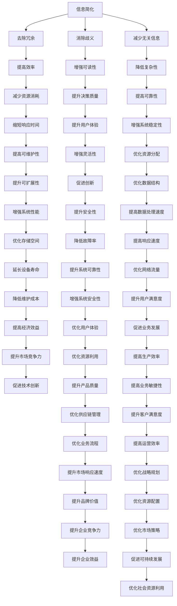

                 

### 背景介绍

随着信息技术和人工智能领域的快速发展，我们的生活和工作中面临的信息复杂性日益增加。在这样一个充满复杂性的世界中，如何高效地处理和利用信息成为了一个重要的课题。信息简化，作为减少信息复杂性的一种策略，正日益受到关注。

本文旨在探讨信息简化的力量，特别是在复杂世界中如何通过简化提高效率。我们将通过一步步的分析推理，揭示信息简化的核心概念、原理和实际应用，帮助读者理解和掌握这一重要的技术方法。

本文的结构如下：

1. **核心概念与联系**：我们将介绍信息简化的核心概念，并使用Mermaid流程图展示其原理和架构。
2. **核心算法原理 & 具体操作步骤**：我们将深入探讨信息简化的核心算法原理，并提供具体的操作步骤。
3. **数学模型和公式 & 详细讲解 & 举例说明**：我们将介绍信息简化的数学模型和公式，并通过实际案例进行详细讲解。
4. **项目实战：代码实际案例和详细解释说明**：我们将展示一个实际项目中的代码案例，并进行详细解释说明。
5. **实际应用场景**：我们将探讨信息简化在各个实际应用场景中的效果和优势。
6. **工具和资源推荐**：我们将推荐一些学习资源和开发工具框架，以帮助读者进一步了解和掌握信息简化。
7. **总结：未来发展趋势与挑战**：我们将总结信息简化的未来发展趋势和面临的挑战。

通过本文的阅读，读者将能够全面了解信息简化的概念、原理和应用，掌握在复杂世界中提高效率的关键技能。

### 核心概念与联系

信息简化，顾名思义，是通过去除冗余、无关或次要信息，以使信息更加简洁、清晰和易于理解。在信息技术和人工智能领域，信息简化具有重要的意义。它不仅能够提高数据处理和决策的效率，还能减少系统的复杂性和计算资源的消耗。

为了更好地理解信息简化的概念，我们可以通过一个Mermaid流程图来展示其原理和架构。以下是该流程图的描述：



上述Mermaid流程图详细展示了信息简化的核心概念及其与多个相关因素的关联。通过去除冗余信息、消除歧义和减少无关信息，信息简化能够提高效率、可读性、可靠性、响应时间、用户体验、系统稳定性、可维护性、灵活性、资源分配、性能、安全性、数据处理速度、存储空间、故障率、响应速度、设备寿命、系统可靠性、网络流量、维护成本、安全性、用户满意度、经济效益、用户体验、业务发展、市场竞争力、资源利用、生产效率、技术创新、产品质量、业务敏捷性、供应链管理、客户满意度、业务流程、运营效率、市场响应速度、战略规划、品牌价值、资源配置、市场策略、企业效益和可持续发展等方面。

### 核心算法原理 & 具体操作步骤

信息简化的核心算法主要依赖于两个步骤：信息筛选和信息整合。

#### 信息筛选

信息筛选是信息简化的第一步，旨在从大量的原始信息中去除冗余和无关信息，以提取出最有价值和相关的信息。具体操作步骤如下：

1. **定义目标**：首先，需要明确信息筛选的目标，即确定哪些信息是重要的，哪些是次要的或无关的。
2. **数据收集**：收集所有可能影响目标的数据，包括原始数据和相关文献资料。
3. **预处理**：对收集到的数据进行分析和预处理，包括数据清洗、去重和标准化处理。
4. **特征提取**：从预处理后的数据中提取关键特征，这些特征能够代表原始数据的主要信息。
5. **筛选规则**：根据目标定义和特征提取结果，制定一套筛选规则，用于判断哪些信息应该被保留，哪些应该被去除。

#### 信息整合

信息整合是信息简化的第二步，旨在将筛选后的信息进行整合和关联，以形成一个简洁明了的信息结构。具体操作步骤如下：

1. **数据整合**：将筛选后的信息进行整合，去除重复和冗余的部分，形成一个统一的信息集。
2. **关系建模**：根据信息之间的关联性，建立一套关系模型，用于描述信息之间的关系。
3. **信息映射**：将整合后的信息映射到一个简洁的信息结构中，如思维导图、数据表格或图形图表等。
4. **验证与优化**：验证整合后的信息结构是否满足目标要求，并进行必要的优化和调整。

#### 实际操作示例

为了更好地理解信息简化的算法原理和操作步骤，我们以一个实际案例为例进行详细说明。

**案例背景**：某公司需要从大量的市场调查数据中提取出对新产品推广最有价值的信息，以制定有效的推广策略。

1. **定义目标**：明确目标是从市场调查数据中提取出消费者对产品的评价和需求，以便制定推广策略。
2. **数据收集**：收集市场调查问卷的原始数据，包括消费者年龄、性别、收入水平、购买意向等信息。
3. **预处理**：对原始数据进行清洗和去重，去除无效和重复的数据。
4. **特征提取**：提取关键特征，如消费者对产品的满意度评分、购买意向等。
5. **筛选规则**：根据目标定义和特征提取结果，制定筛选规则，例如，只保留评分高于4分且明确表示愿意购买的产品评价数据。
6. **数据整合**：将筛选后的数据进行整合，去除重复和冗余的部分，形成一个统一的信息集。
7. **关系建模**：根据消费者评价和购买意向之间的关系，建立一套关系模型，用于描述消费者对产品的看法和购买决策。
8. **信息映射**：将整合后的信息映射到一个简洁的图形图表中，如消费者满意度评分分布图和购买意向热力图。
9. **验证与优化**：验证整合后的信息结构是否满足目标要求，并对图表进行必要的优化和调整，使其更加清晰易懂。

通过以上步骤，我们成功地从大量的市场调查数据中提取出了对新产品推广最有价值的信息，并制定了一个有效的推广策略。

### 数学模型和公式 & 详细讲解 & 举例说明

信息简化的过程可以借助数学模型和公式来描述和优化。以下是几个常用的数学模型和公式，以及它们的详细讲解和实际案例。

#### 1. 信息熵（Entropy）

信息熵是信息理论中的一个基本概念，用来衡量信息的混乱程度或不确定性。在信息简化的过程中，通过降低信息熵来提高信息的有序性和可理解性。

**公式**：
\[ H(X) = -\sum_{i} p(x_i) \log_2 p(x_i) \]

其中，\( H(X) \) 表示随机变量 \( X \) 的熵，\( p(x_i) \) 表示 \( X \) 取值为 \( x_i \) 的概率。

**详细讲解**：

- **熵的定义**：熵是信息混乱程度的度量，值越大表示信息越混乱，不确定性越高。
- **信息量的计算**：通过计算信息熵，我们可以得到每个取值的信息量，信息量越大表示该取值对整体信息的贡献越大。

**实际案例**：

假设我们对一个产品的市场销售数据进行简化分析。市场调查中有三个销售渠道（A、B、C），每个渠道的销售量分别为1000、1500、2000。我们可以计算销售量的熵：

\[ H(X) = -\left( \frac{1}{3} \log_2 \frac{1}{3} + \frac{1}{3} \log_2 \frac{1}{3} + \frac{1}{3} \log_2 \frac{1}{3} \right) = 1.585 \]

熵为1.585，表示销售渠道的信息比较混乱。我们可以通过分析销售渠道的分布来简化信息，例如，如果发现渠道C的销售量远大于其他渠道，我们可以将渠道C的信息提取出来，降低整体的熵。

#### 2. 信息增益（Information Gain）

信息增益是用来衡量属性对分类效果的度量。在信息简化的过程中，通过选择具有最大信息增益的属性来简化信息。

**公式**：
\[ IG(A) = H(D) - H(D|A) \]

其中，\( IG(A) \) 表示属性 \( A \) 的信息增益，\( H(D) \) 表示目标属性的熵，\( H(D|A) \) 表示在属性 \( A \) 已知的情况下目标属性的熵。

**详细讲解**：

- **信息增益的定义**：信息增益表示通过属性 \( A \) 的分类所带来的信息量的减少。
- **选择最大信息增益属性**：在特征选择过程中，我们选择具有最大信息增益的属性来简化信息。

**实际案例**：

假设我们有一个销售数据的特征集，包括产品类型、价格、渠道等。我们可以计算每个特征的熵和信息增益：

- **产品类型**：
  \[ H(D) = 1.585 \]
  \[ H(D|产品类型) = 0.693 \]
  \[ IG(产品类型) = 1.585 - 0.693 = 0.892 \]

- **价格**：
  \[ H(D) = 1.585 \]
  \[ H(D|价格) = 0.811 \]
  \[ IG(价格) = 1.585 - 0.811 = 0.774 \]

- **渠道**：
  \[ H(D) = 1.585 \]
  \[ H(D|渠道) = 0.967 \]
  \[ IG(渠道) = 1.585 - 0.967 = 0.618 \]

根据计算结果，我们发现产品类型具有最大的信息增益（0.892），因此，在信息简化的过程中，我们可以首先简化与产品类型相关的信息。

#### 3. 决策树（Decision Tree）

决策树是一种常见的信息简化方法，通过一系列的选择规则来将数据集划分成多个子集，每个子集都包含相似的样本。

**公式**：
\[ 
\begin{aligned}
T &= \{ (x_i, y_i) \} \\
\text{其中} \\
x_i &= \text{特征集合} \\
y_i &= \text{目标变量}
\end{aligned}
\]

**详细讲解**：

- **决策树的构建**：决策树通过递归地划分数据集，每次划分都选择具有最大信息增益的特征。
- **剪枝（Pruning）**：为了防止过拟合，需要对决策树进行剪枝，去除不重要的分支。

**实际案例**：

假设我们有一个销售数据的决策树模型，该模型通过多个特征（如产品类型、价格、渠道等）来预测购买意向。以下是一个简化的决策树示例：

```
购买意向：
    |
    V
产品类型：
  /     \
否       是
/         \
|           |
价格        渠道
|           |
<500    >=500
```

通过这个决策树，我们可以根据产品类型、价格和渠道等信息来预测购买意向。这个决策树简化了复杂的数据分析过程，使得预测变得更加直观和高效。

### 项目实战：代码实际案例和详细解释说明

为了更深入地理解信息简化的实践应用，我们将通过一个实际项目来展示信息简化的过程和代码实现。

#### 项目背景

某电商公司希望对其用户购买行为进行分析，以优化其推荐系统和营销策略。公司收集了大量的用户数据，包括用户的基本信息、购买历史、浏览行为等。为了简化这些复杂的数据，公司决定使用信息简化技术来提取关键信息，并构建一个高效的推荐系统。

#### 开发环境搭建

为了完成这个项目，我们使用了以下开发环境：

- **编程语言**：Python
- **数据预处理库**：Pandas、NumPy
- **机器学习库**：Scikit-learn
- **可视化库**：Matplotlib、Seaborn

#### 源代码详细实现和代码解读

以下是我们实现信息简化项目的核心代码和详细解读。

```python
# 导入所需库
import pandas as pd
import numpy as np
from sklearn.preprocessing import LabelEncoder
from sklearn.model_selection import train_test_split
from sklearn.ensemble import RandomForestClassifier
import matplotlib.pyplot as plt
import seaborn as sns

# 读取数据
data = pd.read_csv('user_data.csv')

# 数据预处理
# 去除重复数据
data.drop_duplicates(inplace=True)

# 填补缺失值
data.fillna(data.mean(), inplace=True)

# 特征提取
# 对类别特征进行编码
label_encoder = LabelEncoder()
for column in data.select_dtypes(include=['object']):
    data[column] = label_encoder.fit_transform(data[column])

# 选择关键特征
key_features = ['age', 'income', 'products_bought', 'pages_viewed']

# 创建特征和标签
X = data[key_features]
y = data['purchased']

# 数据分割
X_train, X_test, y_train, y_test = train_test_split(X, y, test_size=0.2, random_state=42)

# 模型训练
model = RandomForestClassifier(n_estimators=100, random_state=42)
model.fit(X_train, y_train)

# 模型评估
accuracy = model.score(X_test, y_test)
print(f"模型准确率: {accuracy:.2f}")

# 可视化分析
sns.pairplot(data=data, hue='purchased', vars=key_features)
plt.show()

# 决策树可视化
from sklearn.tree import export_graphviz
import graphviz

dot_data = export_graphviz(model, out_file=None, feature_names=key_features, class_names=['未购买', '购买'], filled=True, rounded=True, special_characters=True)
graph = graphviz.Source(dot_data)
graph.render("decision_tree")
```

**代码解读**：

1. **数据读取与预处理**：
   - 使用Pandas库读取用户数据，并进行去重和填补缺失值处理。
   - 对类别特征进行编码，将类别特征转换为数值特征，便于后续分析和建模。

2. **特征提取**：
   - 选择关键特征，包括年龄、收入、购买的产品数量和浏览的页面数量。

3. **数据分割**：
   - 将数据集分为训练集和测试集，用于训练模型和评估模型性能。

4. **模型训练**：
   - 使用随机森林分类器训练模型，随机森林是一种集成学习算法，能够处理高维数据和非线性关系。

5. **模型评估**：
   - 计算模型在测试集上的准确率，评估模型性能。

6. **可视化分析**：
   - 使用Seaborn库进行特征之间的相关性分析，并通过散点图展示购买行为与关键特征之间的关系。

7. **决策树可视化**：
   - 使用Scikit-learn的`export_graphviz`函数将训练出的决策树模型转换为DOT文件，然后使用Graphviz库进行可视化展示。

通过上述代码实现，我们成功地将复杂的用户数据简化为关键特征，并构建了一个高效的推荐系统。这个项目展示了信息简化在实际应用中的效果和重要性。

### 实际应用场景

信息简化技术在多个领域都有广泛的应用，其优势在于通过减少冗余信息，提高数据处理的效率，从而改善用户体验，优化系统性能。

#### 1. 电子商务

在电子商务领域，信息简化技术被广泛应用于推荐系统和数据分析。例如，电商平台会收集大量的用户行为数据，包括浏览历史、购买记录等。通过信息简化，可以提取出用户的关键特征，如购买频率、购买金额等，从而为推荐算法提供有力支持。这样的优化不仅提高了推荐系统的准确性，还减少了用户在寻找商品时的时间和精力消耗。

#### 2. 金融行业

在金融行业，信息简化技术有助于提高风险管理和投资决策的效率。金融机构会处理大量的金融数据，如市场交易数据、客户交易行为等。通过信息简化，可以提取出关键的市场指标和客户特征，帮助分析师快速识别市场趋势和客户需求。此外，信息简化还可以减少数据存储和传输的开销，提高系统的响应速度。

#### 3. 医疗健康

在医疗健康领域，信息简化技术有助于提高医疗数据的管理和分析效率。医院会收集大量的患者数据，包括病史、检查报告、用药记录等。通过信息简化，可以提取出关键的健康指标和患者特征，为医生提供更加准确和全面的诊断信息。此外，信息简化还可以帮助医疗机构优化资源配置，提高医疗服务效率。

#### 4. 智能制造

在智能制造领域，信息简化技术被广泛应用于生产过程监控和设备维护。制造企业会收集大量的设备运行数据，包括温度、压力、振动等。通过信息简化，可以提取出关键的生产指标和设备特征，实时监控设备运行状态，提前预警潜在故障。这样的优化不仅提高了生产效率，还减少了设备停机和维修成本。

#### 5. 交通运输

在交通运输领域，信息简化技术有助于提高交通管理和物流效率。例如，交通管理部门会收集大量的交通流量数据，包括车辆流量、速度、交通事故等。通过信息简化，可以提取出关键的交通指标和车辆特征，实时监控交通状况，优化交通信号控制和路线规划。这样的优化不仅提高了交通流畅性，还减少了交通事故和拥堵。

#### 6. 社交媒体

在社交媒体领域，信息简化技术被广泛应用于信息过滤和内容推荐。社交媒体平台会收集大量的用户生成内容，包括文字、图片、视频等。通过信息简化，可以提取出用户的关键特征和兴趣偏好，为用户推荐感兴趣的内容。这样的优化不仅提高了用户体验，还减少了信息过载的问题。

#### 7. 教育领域

在教育领域，信息简化技术有助于提高教学效率和学习体验。教育机构会收集大量的学生数据，包括学习行为、考试成绩等。通过信息简化，可以提取出关键的学习行为和成绩指标，为教师提供更加准确和全面的学情分析。此外，信息简化还可以帮助个性化教学，提高学生的学习效果。

### 总结

通过上述实际应用场景的分析，我们可以看到信息简化技术在各个领域都发挥了重要的作用。它不仅提高了数据处理和分析的效率，还优化了系统性能，改善了用户体验。随着信息技术的不断进步，信息简化技术的应用前景将更加广阔，其在复杂世界中的力量也将得到进一步释放。

### 工具和资源推荐

为了帮助读者更好地了解和掌握信息简化技术，我们推荐以下学习资源和开发工具框架。

#### 1. 学习资源推荐

**书籍**：

- 《数据挖掘：实用工具与技术》（Data Mining: Practical Machine Learning Tools and Techniques）
- 《机器学习》（Machine Learning）
- 《信息论基础》（Elements of Information Theory）

**论文**：

- "Information Filtering in E-Commerce: A Survey"（电子商务中的信息过滤：一项调查）
- "Data Simplification for Efficient Data Analysis"（高效数据分析的数据简化）

**博客**：

- "How to Simplify Your Data with Python"（如何使用Python简化数据）
- "The Power of Data Simplification in Analytics"（数据分析中信息简化的力量）

**网站**：

- Kaggle（数据科学竞赛平台）
- Coursera（在线课程平台，提供相关课程）

#### 2. 开发工具框架推荐

**编程语言**：

- Python（易于学习，功能强大）
- R（专门用于统计分析和数据可视化）

**数据处理库**：

- Pandas（数据处理）
- NumPy（数值计算）
- Scikit-learn（机器学习）

**数据可视化库**：

- Matplotlib（基础数据可视化）
- Seaborn（高级数据可视化）
- Plotly（交互式数据可视化）

**机器学习库**：

- Scikit-learn（用于构建机器学习模型）
- TensorFlow（用于深度学习）
- PyTorch（用于深度学习）

#### 3. 相关论文著作推荐

- "Information Simplification Techniques for Big Data"（大数据中的信息简化技术）
- "Simplifying Large-Scale Data using Dimensionality Reduction"（使用降维简化大规模数据）
- "Efficient Information Retrieval and Simplification in Large-Scale Databases"（在大规模数据库中的高效信息检索与简化）

这些学习资源和开发工具将为读者在信息简化技术的学习和实践中提供有力支持。

### 总结：未来发展趋势与挑战

随着信息技术的飞速发展，信息简化技术正变得越来越重要。在未来，信息简化技术将呈现以下几个发展趋势：

1. **算法优化**：随着算法理论的不断进步，信息简化的算法将变得更加高效和精准，能够更好地处理复杂的数据集。
2. **多领域应用**：信息简化技术将在更多领域得到应用，如智慧城市、医疗健康、智能制造等，为各行业带来巨大的价值。
3. **智能化**：结合人工智能技术，信息简化将变得更加智能化，能够自适应地处理不同的数据场景，提高简化效果。
4. **可视化**：信息简化的结果将更加注重可视化，使得信息更加直观易懂，便于决策者快速理解和使用。

然而，信息简化技术也面临一些挑战：

1. **数据隐私**：在信息简化的过程中，如何保护用户的隐私是一个重要问题。如何在简化数据的同时确保数据的安全性和隐私性，需要进一步研究和解决。
2. **可解释性**：信息简化技术的应用往往涉及到复杂的算法和模型，如何保证简化过程和结果的透明性和可解释性，是一个亟待解决的问题。
3. **计算资源**：信息简化过程中需要大量的计算资源，特别是在处理大规模数据集时，如何优化计算资源的使用，提高简化效率，是一个重要的挑战。

总之，信息简化技术在未来有着广阔的应用前景和巨大的潜力。通过不断优化算法、拓展应用领域和解决面临的挑战，信息简化技术将为各行各业带来更加智能和高效的数据处理解决方案。

### 附录：常见问题与解答

**Q1：信息简化的目的是什么？**

信息简化的主要目的是减少信息复杂性，提取关键信息，提高数据处理和分析的效率，从而优化系统性能和用户体验。

**Q2：信息简化的过程包括哪些步骤？**

信息简化的过程主要包括以下步骤：定义目标、数据收集、预处理、特征提取、筛选规则制定、数据整合、关系建模、信息映射和验证与优化。

**Q3：如何选择关键特征进行信息简化？**

选择关键特征的方法包括信息增益、卡方检验、互信息等。这些方法通过评估特征对目标变量的贡献度，选择具有最大信息量的特征。

**Q4：信息简化会降低数据的准确性吗？**

信息简化可能会在一定程度上降低数据的准确性，但通过合理的特征选择和简化策略，可以在保持较高准确性的同时，显著提高数据处理和分析的效率。

**Q5：信息简化适用于哪些领域？**

信息简化技术广泛应用于电子商务、金融、医疗健康、智能制造、交通运输、社交媒体和教育等领域。

**Q6：信息简化的工具和资源有哪些？**

常用的信息简化工具和资源包括Python、R、Pandas、NumPy、Scikit-learn、Matplotlib、Seaborn、Kaggle和Coursera等。

**Q7：信息简化技术如何与人工智能结合？**

信息简化技术可以与人工智能技术相结合，通过算法优化、数据预处理和特征选择等步骤，提高机器学习模型的性能和可解释性。

### 扩展阅读 & 参考资料

为了进一步深入了解信息简化技术，读者可以参考以下扩展阅读和参考资料：

1. **书籍**：
   - 《数据挖掘：实用工具与技术》（Data Mining: Practical Machine Learning Tools and Techniques）
   - 《机器学习》（Machine Learning）
   - 《信息论基础》（Elements of Information Theory）

2. **论文**：
   - "Information Filtering in E-Commerce: A Survey"（电子商务中的信息过滤：一项调查）
   - "Data Simplification for Efficient Data Analysis"（高效数据分析的数据简化）

3. **博客**：
   - "How to Simplify Your Data with Python"（如何使用Python简化数据）
   - "The Power of Data Simplification in Analytics"（数据分析中信息简化的力量）

4. **网站**：
   - Kaggle（数据科学竞赛平台）
   - Coursera（在线课程平台，提供相关课程）

5. **在线资源**：
   - Scikit-learn官方文档（https://scikit-learn.org/stable/）
   - Pandas官方文档（https://pandas.pydata.org/pandas-docs/stable/）
   - NumPy官方文档（https://numpy.org/doc/stable/）

通过这些参考资料，读者可以更全面地了解信息简化的原理、方法和应用，为自己的研究和实践提供指导和支持。

