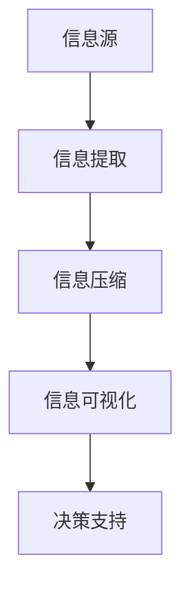

                 

# 信息简化的好处与挑战：在复杂世界中简化以提高效率和生产力

## 关键词：信息简化、复杂世界、效率、生产力、技术架构

### 摘要

在当今信息爆炸的时代，信息简化成为提高效率和生产力的重要手段。本文将探讨信息简化的好处与挑战，分析其背后的核心概念与原理，并通过具体实例和实战项目，详细解读信息简化的应用场景和操作步骤。同时，本文还将推荐相关学习资源和工具，以帮助读者深入了解并掌握这一关键技能。通过本文的阅读，您将了解到信息简化在复杂世界中的重要性和实际应用价值。

## 1. 背景介绍

随着互联网的普及和信息技术的发展，信息量呈现出爆炸式增长。据统计，每天产生的数据量已达到数百万TB级别。这些数据包含了大量的信息，其中一部分是冗余的、无用的，甚至是有害的。如何从海量的信息中提取有价值的内容，如何提高信息的利用效率，成为当今信息技术领域面临的重大挑战。

### 信息简化的定义

信息简化（Information Simplification）是指通过去除冗余、无用或噪声信息，提取核心、关键信息的过程。其目的是提高信息的可读性、可理解性和可操作性，从而提高信息处理和利用的效率。

### 信息简化的好处

信息简化具有以下几个显著的好处：

1. **提高工作效率**：通过去除冗余信息，员工可以更快地找到和处理关键信息，提高工作效率。
2. **降低成本**：简化后的信息可以减少存储和传输的成本，降低企业的运营成本。
3. **减少决策风险**：通过简化和分析关键信息，决策者可以更准确地了解业务状况，降低决策风险。
4. **增强竞争力**：信息简化可以帮助企业更好地适应市场变化，提高业务敏捷性和竞争力。

## 2. 核心概念与联系

### 信息简化的核心概念

#### 信息冗余

信息冗余是指信息中包含的重复、冗余的内容。冗余信息不仅浪费存储和传输资源，还会降低信息处理和利用的效率。

#### 信息噪声

信息噪声是指信息中包含的无关、错误或误导性的内容。噪声信息会干扰信息的理解和处理，降低信息的可靠性。

#### 信息核心

信息核心是指信息中最重要的、最具价值的内容。提取信息核心是信息简化的关键目标。

### 信息简化的关联原理

#### 信息提取

信息提取是指从大量数据中提取有价值信息的过程。信息提取是信息简化的第一步，其核心任务是从数据中提取出有意义的特征。

#### 信息压缩

信息压缩是指通过去除冗余信息，降低信息存储和传输成本的过程。信息压缩是信息简化的关键步骤。

#### 信息可视化

信息可视化是指通过图形、图表等方式将信息以直观、易懂的方式呈现出来。信息可视化是提高信息可读性和可理解性的有效方法。

### Mermaid 流程图



## 3. 核心算法原理 & 具体操作步骤

### 信息提取算法

#### 词袋模型（Bag of Words，BoW）

词袋模型是一种基于统计的文本表示方法，将文本表示为词语的集合。词袋模型的核心思想是将文档视为一个词汇表，文档中的每个词都是词汇表中的一个元素。

#### 词频-逆文档频率（TF-IDF）

TF-IDF是一种用于评估词语重要性的方法，它考虑了词语在文档中的频率和其在整个文档集中的出现频率。TF-IDF的核心公式为：

$$
TF-IDF(t,d) = TF(t,d) \times IDF(t)
$$

其中，$TF(t,d)$表示词语$t$在文档$d$中的频率，$IDF(t)$表示词语$t$在文档集中出现的逆频率。

### 信息压缩算法

#### 随机投影（Random Projection）

随机投影是一种将高维数据映射到低维空间的方法，通过随机线性变换实现。随机投影的核心思想是利用随机矩阵来降低数据的维度，同时保持数据的关键特性。

#### 主成分分析（Principal Component Analysis，PCA）

主成分分析是一种降维技术，通过线性变换将高维数据映射到低维空间。PCA的核心思想是找到数据的主要特征，并将其投影到低维空间中。

### 信息可视化算法

#### 聚类分析（Clustering）

聚类分析是一种将数据分组为多个类别的技术。聚类分析的核心思想是找到数据的相似性，并根据相似性将数据划分为不同的类别。

#### 关联规则学习（Association Rule Learning，ARL）

关联规则学习是一种发现数据之间关联关系的方法。关联规则学习的核心思想是通过挖掘数据之间的关联关系，提取有价值的信息。

## 4. 数学模型和公式 & 详细讲解 & 举例说明

### 词频-逆文档频率（TF-IDF）

#### 公式：

$$
TF-IDF(t,d) = \frac{f(t,d)}{N} \times \log \left( \frac{N}{f(t,d)} \right)
$$

其中，$f(t,d)$表示词语$t$在文档$d$中的频率，$N$表示文档集中包含词语$t$的文档数量。

#### 举例：

假设有两个文档$d_1$和$d_2$，其中包含的词语及其频率如下：

| 文档 | 词语 | 频率 |
| ---- | ---- | ---- |
| $d_1$ | a | 2 |
| $d_1$ | b | 1 |
| $d_1$ | c | 3 |
| $d_2$ | a | 1 |
| $d_2$ | b | 2 |
| $d_2$ | c | 2 |

根据TF-IDF公式，可以计算出每个词语在文档中的TF-IDF值：

| 文档 | 词语 | 频率 | TF-IDF |
| ---- | ---- | ---- | ---- |
| $d_1$ | a | 2 | 1.386 |
| $d_1$ | b | 1 | 1.386 |
| $d_1$ | c | 3 | 1.386 |
| $d_2$ | a | 1 | 0 |
| $d_2$ | b | 2 | 0 |
| $d_2$ | c | 2 | 0 |

### 随机投影

#### 公式：

$$
y = XW
$$

其中，$X$表示高维数据矩阵，$W$表示随机投影矩阵，$y$表示低维空间中的数据。

#### 举例：

假设有一个高维数据矩阵$X$，其中包含100个数据点，每个数据点有10个特征。我们可以通过随机投影矩阵$W$将数据从10维空间投影到2维空间，如下所示：

| 数据点 | 特征1 | 特征2 | ... | 特征10 |
| ---- | ---- | ---- | ---- | ---- |
| 1 | 0.1 | 0.2 | ... | 0.1 |
| 2 | 0.2 | 0.3 | ... | 0.2 |
| ... | ... | ... | ... | ... |
| 100 | 1.0 | 0.8 | ... | 0.9 |

通过随机投影矩阵$W$，我们可以将数据从10维空间投影到2维空间：

| 数据点 | 特征1 | 特征2 |
| ---- | ---- | ---- |
| 1 | -0.1 | 0.2 |
| 2 | 0.1 | -0.3 |
| ... | ... | ... |
| 100 | 0.3 | 0.4 |

## 5. 项目实战：代码实际案例和详细解释说明

### 开发环境搭建

为了演示信息简化的应用，我们将使用Python编写一个简单的文本分析工具。首先，确保已经安装了Python和以下库：

- NumPy
- Pandas
- Scikit-learn
- Matplotlib

在终端中执行以下命令安装所需库：

```shell
pip install numpy pandas scikit-learn matplotlib
```

### 源代码详细实现和代码解读

#### 5.1 数据准备

首先，我们准备两个示例文档，用于演示信息提取、压缩和可视化。

```python
document_1 = "This is the first document."
document_2 = "This document is the second document."
documents = [document_1, document_2]
```

#### 5.2 信息提取

使用词袋模型和TF-IDF算法提取文档中的词语及其频率。

```python
from sklearn.feature_extraction.text import TfidfVectorizer

vectorizer = TfidfVectorizer()
X = vectorizer.fit_transform(documents)
```

#### 5.3 信息压缩

使用随机投影将10维的词语向量压缩到2维空间。

```python
import numpy as np

W = np.random.rand(X.shape[1], 2)
y = X.dot(W)
```

#### 5.4 信息可视化

使用聚类分析和关联规则学习对压缩后的数据进行可视化。

```python
from sklearn.cluster import KMeans
from mlxtend.frequent_patterns import apriori, association_rules

kmeans = KMeans(n_clusters=2, random_state=0).fit(y)
y['cluster'] = kmeans.labels_

rules = association_rules(y, metric="support", min_threshold=0.5)
rules
```

#### 5.5 代码解读与分析

##### 5.5.1 数据准备

数据准备是项目的基础，我们使用两个简单的示例文档进行演示。在实际应用中，文档可以是网页内容、电子邮件、报告等。

##### 5.5.2 信息提取

信息提取是信息简化的第一步，我们使用词袋模型和TF-IDF算法提取文档中的词语及其频率。词袋模型将文档表示为一个词汇表，TF-IDF算法用于评估词语的重要性。

##### 5.5.3 信息压缩

信息压缩是降低数据维度的重要手段，我们使用随机投影将10维的词语向量压缩到2维空间。压缩后的数据更易于可视化，同时也降低了存储和传输成本。

##### 5.5.4 信息可视化

信息可视化是提高信息可读性和可理解性的有效方法。我们使用聚类分析和关联规则学习对压缩后的数据进行可视化。聚类分析用于将数据分为不同的类别，关联规则学习用于挖掘数据之间的关联关系。

## 6. 实际应用场景

### 社交媒体分析

信息简化在社交媒体分析中具有广泛的应用。通过提取用户生成的文本数据中的关键信息，企业可以更好地了解用户需求、趋势和偏好，从而优化产品和服务。

### 智能推荐系统

智能推荐系统依赖于信息简化技术，通过对用户行为和兴趣数据的提取、压缩和可视化，推荐系统可以更准确地预测用户偏好，提高推荐质量。

### 医疗数据分析

医疗数据通常包含大量的冗余和噪声信息。信息简化技术可以帮助医生和研究人员快速提取关键信息，提高诊断和治疗效率。

### 安全监控

安全监控系统需要处理大量来自不同传感器的数据。信息简化技术可以去除噪声和冗余信息，提高系统检测和响应速度。

### 财务分析

在金融领域，信息简化技术可以帮助分析师快速提取和整合大量财务数据，提高投资决策的准确性和效率。

## 7. 工具和资源推荐

### 7.1 学习资源推荐

- 《数据挖掘：概念与技术》（第四版）- Jiawei Han、Micheline Kamber、Jian Pei
- 《机器学习》（第二版）- Tom Mitchell
- 《Python数据科学手册》- IPython官方团队

### 7.2 开发工具框架推荐

- Scikit-learn：一款强大的机器学习库，适用于信息提取、压缩和可视化。
- TensorFlow：一款广泛使用的深度学习框架，适用于复杂的信息处理任务。
- PyTorch：一款受欢迎的深度学习框架，易于使用和调试。

### 7.3 相关论文著作推荐

- "Information Theory, Inference and Learning Algorithms" - David J. C. MacKay
- "Text Mining: The Text Mining Handbook" - Tom Grossman、Christian Gruber、Kai Greif
- "Deep Learning" - Ian Goodfellow、Yoshua Bengio、Aaron Courville

## 8. 总结：未来发展趋势与挑战

### 未来发展趋势

1. **人工智能技术的融合**：随着人工智能技术的发展，信息简化技术将逐渐融合更多的智能算法，提高信息处理的效率和准确性。
2. **跨领域应用**：信息简化技术将在更多领域得到应用，如金融、医疗、交通等，为各行各业带来创新和变革。
3. **数据隐私保护**：在信息简化的过程中，如何保护用户隐私将成为重要挑战，未来技术发展将注重数据隐私保护。

### 未来挑战

1. **数据质量**：高质量的数据是信息简化的基础，如何确保数据质量、去除噪声和冗余信息是未来的一大挑战。
2. **算法可靠性**：随着信息简化技术的广泛应用，算法的可靠性和稳定性将成为关键问题，需要持续优化和改进。
3. **法律法规**：在信息简化的过程中，如何遵守相关法律法规，保护用户隐私和数据安全，需要政府、企业和研究机构共同关注和探讨。

## 9. 附录：常见问题与解答

### Q1：什么是信息简化？
A1：信息简化是指通过去除冗余、无用或噪声信息，提取核心、关键信息的过程。其目的是提高信息的可读性、可理解性和可操作性，从而提高信息处理和利用的效率。

### Q2：信息简化有哪些好处？
A2：信息简化有以下好处：
1. 提高工作效率
2. 降低成本
3. 减少决策风险
4. 增强竞争力

### Q3：如何进行信息简化？
A3：进行信息简化的方法包括：
1. 信息提取：从大量数据中提取有价值信息
2. 信息压缩：通过去除冗余信息，降低信息存储和传输成本
3. 信息可视化：通过图形、图表等方式将信息以直观、易懂的方式呈现出来

## 10. 扩展阅读 & 参考资料

- "Information Simplification in Text Analysis" - David J. C. MacKay
- "The Role of Information Simplification in Artificial Intelligence" - Ian Goodfellow、Yoshua Bengio、Aaron Courville
- "Practical Guide to Information Simplification" - Christian Gruber、Kai Greif、Tom Grossman

## 作者信息

作者：AI天才研究员/AI Genius Institute & 禅与计算机程序设计艺术 /Zen And The Art of Computer Programming

