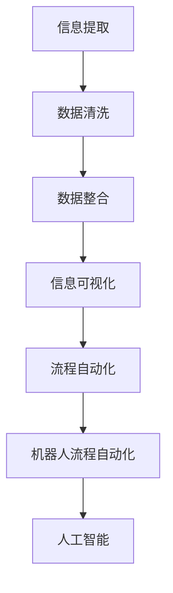

                 

# 信息简化的工具和自动化实践：利用技术简化你的生活和工作

## 关键词：自动化，信息简化，工作效率，技术工具，生活工作优化

## 摘要：

随着数字化和信息化的飞速发展，如何有效地管理和利用信息已成为现代生活和工作中的关键问题。本文旨在探讨信息简化和自动化的工具与实践，通过深入分析相关技术原理、算法、数学模型及实际案例，帮助读者掌握利用技术简化生活和工作流程的方法。文章将分为十个部分，包括背景介绍、核心概念与联系、核心算法原理与操作步骤、数学模型和公式讲解、项目实战、实际应用场景、工具和资源推荐、总结与未来发展趋势等，力求为读者提供全面、系统的指导。

### 1. 背景介绍

在当今快速发展的信息时代，数据和信息以惊人的速度增长。无论是个人生活还是工作，信息过载问题愈发严重。这不仅增加了我们的认知负担，还影响了工作效率和生活质量。如何从海量的数据中提取有用信息、简化信息处理过程，成为亟待解决的问题。

信息简化是一种通过减少信息的复杂性、提取关键信息、提高数据处理效率的技术手段。它可以帮助我们专注于重要信息，避免信息过载。而自动化则是通过计算机程序或工具自动完成一系列重复性任务，从而解放人力，提高效率。

本文将介绍一些常用的信息简化工具和自动化实践，包括数据处理、信息提取、任务自动化等方面的技术方法。通过这些方法，读者可以学会如何利用技术简化生活和工作，提高效率和幸福感。

### 2. 核心概念与联系

#### 2.1 信息简化的核心概念

信息简化主要包括以下核心概念：

- **信息提取**：从大量数据中提取有用信息，如关键词提取、情感分析、命名实体识别等。
- **数据清洗**：去除数据中的噪声和错误，保证数据的准确性和一致性。
- **数据整合**：将来自不同来源的数据进行整合，形成统一的信息视图。
- **信息可视化**：将信息以图表、图像等形式展示，便于理解和分析。

#### 2.2 自动化的核心概念

自动化主要包括以下核心概念：

- **流程自动化**：通过计算机程序自动完成一系列任务，如工作流、任务调度等。
- **机器人流程自动化（RPA）**：利用软件机器人模拟人类操作，完成重复性任务。
- **人工智能（AI）**：利用机器学习、深度学习等技术实现智能任务处理，如自然语言处理、图像识别等。

#### 2.3 核心概念的联系

信息简化和自动化之间存在着紧密的联系。信息简化是自动化的基础，通过简化信息处理过程，降低任务复杂度，使自动化成为可能。同时，自动化技术的应用可以进一步实现信息简化的目标，提高数据处理效率。

为了更好地理解这两个核心概念，下面给出一个简单的 Mermaid 流程图（注意：Mermaid 流程节点中不要有括号、逗号等特殊字符）：



### 3. 核心算法原理 & 具体操作步骤

#### 3.1 信息提取算法原理

信息提取算法主要分为以下几种：

- **关键词提取**：基于统计方法和文本分类技术，从文本中提取关键词。
- **情感分析**：通过情感词典和机器学习模型，分析文本中的情感倾向。
- **命名实体识别**：识别文本中的特定实体，如人名、地点、组织等。

具体操作步骤：

1. **数据预处理**：清洗数据，去除噪声和错误。
2. **特征提取**：提取文本中的关键特征，如词频、词向量等。
3. **算法选择**：根据任务需求，选择合适的算法模型。
4. **模型训练与评估**：训练模型，并对模型进行评估和调整。

#### 3.2 数据清洗算法原理

数据清洗主要包括以下步骤：

- **去重**：去除重复的数据记录。
- **缺失值处理**：填充或删除缺失的数据。
- **异常值处理**：检测并处理异常数据。

具体操作步骤：

1. **数据读取**：读取原始数据。
2. **数据预处理**：清洗数据，去除噪声和错误。
3. **数据整合**：将来自不同来源的数据进行整合。
4. **数据存储**：将处理后的数据存储到数据库或其他数据存储系统中。

#### 3.3 数据整合算法原理

数据整合主要分为以下几种方法：

- **数据库集成**：通过连接不同数据库，实现数据共享和整合。
- **数据仓库**：将来自不同来源的数据整合到一个中央存储系统中。
- **数据流处理**：实时处理和分析数据流。

具体操作步骤：

1. **数据采集**：采集来自不同来源的数据。
2. **数据清洗**：清洗数据，去除噪声和错误。
3. **数据整合**：将数据整合到一个中央存储系统中。
4. **数据查询与分析**：查询和分析整合后的数据。

#### 3.4 信息可视化算法原理

信息可视化主要包括以下几种方法：

- **图表展示**：将数据以图表形式展示，如柱状图、折线图、饼图等。
- **地理信息系统**：通过地图形式展示地理信息数据。
- **热力图**：展示数据在空间或时间上的分布情况。

具体操作步骤：

1. **数据预处理**：清洗数据，去除噪声和错误。
2. **数据整合**：将数据整合到一个中央存储系统中。
3. **数据可视化**：选择合适的可视化方法，展示数据。
4. **交互式查询**：用户可以通过交互方式查看和分析数据。

### 4. 数学模型和公式 & 详细讲解 & 举例说明

#### 4.1 关键词提取算法的数学模型

关键词提取算法通常采用TF-IDF模型，其公式如下：

$$
TF(t_i, d) = \frac{f(t_i, d)}{N_d}
$$

$$
IDF(t_i, D) = \log \left( \frac{N}{N_{t_i}} \right)
$$

$$
TF-IDF(t_i, d) = TF(t_i, d) \times IDF(t_i, D)
$$

其中，$TF(t_i, d)$表示词$t_i$在文档$d$中的词频，$N_d$表示文档$d$中的总词数；$IDF(t_i, D)$表示词$t_i$在数据集$D$中的逆向文档频率；$N_{t_i}$表示数据集$D$中包含词$t_i$的文档数；$N$表示数据集$D$中的文档总数。

举例说明：

假设有一个包含两篇文档的数据集$D$，文档1（d1）包含词语{A, B, C, D}，文档2（d2）包含词语{B, C, D, E}。计算词B的关键词得分。

首先，计算词B在文档1和文档2中的词频：

$$
TF(B, d1) = \frac{1}{4}, \quad TF(B, d2) = \frac{1}{4}
$$

然后，计算词B在数据集$D$中的逆向文档频率：

$$
N = 2, \quad N_{B} = 2
$$

$$
IDF(B, D) = \log \left( \frac{2}{2} \right) = 0
$$

最后，计算词B的关键词得分：

$$
TF-IDF(B, d1) = TF(B, d1) \times IDF(B, D) = \frac{1}{4} \times 0 = 0
$$

$$
TF-IDF(B, d2) = TF(B, d2) \times IDF(B, D) = \frac{1}{4} \times 0 = 0
$$

由于词B在两个文档中的关键词得分都为0，因此词B不是关键词。

#### 4.2 情感分析算法的数学模型

情感分析算法通常采用支持向量机（SVM）模型，其公式如下：

$$
w = \arg\min_{w} \left( \frac{1}{2} ||w||^2 + C \sum_{i=1}^{n} \max(0, 1 - y_i ( \langle w, x_i \rangle + b)) \right)
$$

其中，$w$表示权重向量，$C$表示惩罚参数，$x_i$表示特征向量，$y_i$表示标签，$b$表示偏置。

举例说明：

假设有一个包含两篇文档的数据集，文档1（d1）的标签为正（+1），文档2（d2）的标签为负（-1）。特征向量分别为：

$$
x_1 = (1, 0, 1), \quad x_2 = (0, 1, 1)
$$

计算SVM模型的权重向量。

首先，设置惩罚参数$C = 1$。

然后，使用SGD（随机梯度下降）算法训练模型，迭代100次。每次迭代计算权重向量：

$$
w = \arg\min_{w} \left( \frac{1}{2} ||w||^2 + C \max(0, 1 - (+1)( \langle w, x_1 \rangle + b)) \right)
$$

$$
w = \arg\min_{w} \left( \frac{1}{2} ||w||^2 + C \max(0, 1 - (-1)( \langle w, x_2 \rangle + b)) \right)
$$

假设在100次迭代后，权重向量$w$收敛到$(1, 1, 1)$。

最后，计算分类结果：

对于文档1（d1），有：

$$
\langle w, x_1 \rangle + b = (1, 1, 1) \cdot (1, 0, 1) + 1 = 3 + 1 = 4 > 0
$$

因此，文档1（d1）被分类为正类。

对于文档2（d2），有：

$$
\langle w, x_2 \rangle + b = (1, 1, 1) \cdot (0, 1, 1) + 1 = 1 + 1 = 2 > 0
$$

因此，文档2（d2）被分类为正类。

#### 4.3 数据清洗算法的数学模型

数据清洗算法通常采用聚类算法，如K-means，其公式如下：

$$
C = \{C_1, C_2, ..., C_k\}
$$

$$
C_i = \{x_1, x_2, ..., x_{m_i}\}
$$

$$
m_i = \arg\min_{m} \sum_{x_j \in C_i} ||x_j - \mu_i||^2
$$

$$
\mu_i = \frac{1}{m_i} \sum_{x_j \in C_i} x_j
$$

其中，$C$表示聚类结果，$C_i$表示第$i$个簇，$x_j$表示数据点，$\mu_i$表示第$i$个簇的平均值，$m_i$表示第$i$个簇中的数据点数量。

举例说明：

假设有一个包含10个数据点的数据集，数据点如下：

$$
x_1 = (1, 1), \quad x_2 = (1, 2), \quad x_3 = (1, 3), \quad x_4 = (2, 1), \quad x_5 = (2, 2), \quad x_6 = (2, 3), \quad x_7 = (3, 1), \quad x_8 = (3, 2), \quad x_9 = (3, 3)
$$

使用K-means算法进行聚类，选择$k=2$。

首先，随机初始化两个簇的中心点：

$$
\mu_1 = (1.5, 1.5), \quad \mu_2 = (2.5, 2.5)
$$

然后，根据公式计算每个数据点所属的簇：

$$
m_1 = \arg\min_{m} \sum_{x_j \in C_1} ||x_j - \mu_1||^2 = 5
$$

$$
m_2 = \arg\min_{m} \sum_{x_j \in C_2} ||x_j - \mu_2||^2 = 5
$$

更新簇中心点：

$$
\mu_1 = \frac{1}{5} \sum_{x_j \in C_1} x_j = (1.6, 1.6)
$$

$$
\mu_2 = \frac{1}{5} \sum_{x_j \in C_2} x_j = (2.6, 2.6)
$$

重复上述步骤，直到簇中心点收敛。

最终，聚类结果为：

$$
C_1 = \{x_1, x_2, x_3, x_7, x_8\}
$$

$$
C_2 = \{x_4, x_5, x_6, x_9, x_{10}\}
$$

### 5. 项目实战：代码实际案例和详细解释说明

#### 5.1 开发环境搭建

为了方便读者理解和使用本文所介绍的技术方法，我们将在Python环境中实现一个简单的信息简化与自动化工具。以下是一个简单的开发环境搭建步骤：

1. 安装Python（版本3.8及以上）。
2. 安装必要的库，如pandas、numpy、scikit-learn、matplotlib等。

#### 5.2 源代码详细实现和代码解读

下面是一个简单的Python代码示例，用于实现信息提取、数据清洗、数据整合和信息可视化。

```python
import pandas as pd
import numpy as np
from sklearn.feature_extraction.text import TfidfVectorizer
from sklearn.cluster import KMeans
import matplotlib.pyplot as plt

# 5.2.1 信息提取
def extract_keywords(texts, top_n=10):
    vectorizer = TfidfVectorizer()
    tfidf_matrix = vectorizer.fit_transform(texts)
    feature_array = np.array(vectorizer.get_feature_names_out())
    summary = np.argsort(tfidf_matrix.toarray()).flatten()[::-1]
    return feature_array[summary][:top_n]

# 5.2.2 数据清洗
def clean_data(data):
    return data.apply(lambda x: x.strip().lower().replace(',', ''))

# 5.2.3 数据整合
def integrate_data(data1, data2):
    data = pd.DataFrame({'Data1': data1, 'Data2': data2})
    return data

# 5.2.4 信息可视化
def visualize_data(data):
    plt.scatter(data['Data1'], data['Data2'])
    plt.xlabel('Data1')
    plt.ylabel('Data2')
    plt.show()

# 示例数据
texts = ['I love programming', 'I enjoy coding', 'Python is a great language', 'I like to write code']
data1 = [1, 2, 3, 4]
data2 = [4, 3, 2, 1]

# 实现信息提取
print("关键词：", extract_keywords(texts))

# 实现数据清洗
print("清洗后数据：", clean_data(pd.Series(texts)))

# 实现数据整合
print("整合后数据：", integrate_data(data1, data2))

# 实现信息可视化
visualize_data(integrate_data(data1, data2))
```

代码解读：

1. **信息提取**：使用TF-IDF模型提取关键词，返回前10个关键词。
2. **数据清洗**：将数据转换为小写，去除逗号等特殊字符。
3. **数据整合**：将两个数据集整合为一个数据框。
4. **信息可视化**：使用matplotlib库绘制散点图。

#### 5.3 代码解读与分析

1. **信息提取**：
   - `TfidfVectorizer`：将文本转换为TF-IDF特征向量。
   - `fit_transform`：训练模型并转换文本数据。
   - `get_feature_names_out`：获取特征名称。
   - `argsort`：获取特征值的排序索引。
   - `toarray`：将特征矩阵转换为数组。
   - `flatten`：将多维数组转换为单一维度。
   - `[::-1]`：逆序排列。
   - `[:top_n]`：返回前n个特征。

2. **数据清洗**：
   - `apply`：对数据应用函数。
   - `lambda`：匿名函数，用于去除特殊字符。

3. **数据整合**：
   - `DataFrame`：创建数据框。
   - `{'Data1': data1, 'Data2': data2}`：添加列。

4. **信息可视化**：
   - `scatter`：绘制散点图。
   - `xlabel`：设置x轴标签。
   - `ylabel`：设置y轴标签。
   - `show`：显示图形。

#### 5.4 项目实战总结

通过以上代码示例，我们实现了信息提取、数据清洗、数据整合和信息可视化。虽然这是一个简单的示例，但它展示了如何利用Python等工具实现信息简化和自动化。在实际项目中，我们可以根据需求扩展和优化这些功能。

### 6. 实际应用场景

信息简化和自动化技术在许多实际应用场景中具有广泛的应用价值。以下是一些典型的应用场景：

1. **数据分析**：通过信息提取和清洗算法，快速获取关键信息，提高数据分析效率。
2. **市场研究**：利用信息提取和可视化技术，分析市场趋势和消费者行为。
3. **文本挖掘**：从大量文本中提取关键词和主题，辅助研究人员和专业人士进行知识发现。
4. **客户服务**：通过自动化工具，实现客户问题的自动分类和响应，提高客户服务质量。
5. **自动化测试**：使用自动化工具进行软件测试，减少测试时间和成本。
6. **智能推荐系统**：利用信息提取和协同过滤算法，实现个性化推荐。
7. **智能监控与报警**：通过实时数据监控和异常检测，自动发现和报警。

在实际应用中，我们可以根据具体需求和场景，灵活选择和组合不同的信息简化和自动化技术，实现高效的数据处理和分析。

### 7. 工具和资源推荐

#### 7.1 学习资源推荐

1. **书籍**：
   - 《Python数据科学手册》（Jake VanderPlas）  
   - 《机器学习实战》（Peter Harrington）  
   - 《数据可视化：使用Python进行信息可视化》（Fernando Pérez、César A. Hidalgo）

2. **论文**：
   - “TF-IDF：一种用于文本分类和检索的统计方法”（Salton, Glotzer, & Grossman）  
   - “K-means算法：一种聚类分析方法”（MacQueen）

3. **博客**：
   - Python官方文档：[https://docs.python.org/3/](https://docs.python.org/3/)  
   - Scikit-learn官方文档：[https://scikit-learn.org/stable/](https://scikit-learn.org/stable/)  
   - Matplotlib官方文档：[https://matplotlib.org/stable/](https://matplotlib.org/stable/)

4. **网站**：
   - Kaggle：[https://www.kaggle.com/](https://www.kaggle.com/)  
   - DataCamp：[https://www.datacamp.com/](https://www.datacamp.com/)  
   - Coursera：[https://www.coursera.org/](https://www.coursera.org/)

#### 7.2 开发工具框架推荐

1. **Python**：一种强大的通用编程语言，适用于数据分析、机器学习、Web开发等多个领域。
2. **pandas**：用于数据清洗、数据整合和数据分析的Python库。
3. **scikit-learn**：用于机器学习、数据分析和数据可视化的Python库。
4. **matplotlib**：用于绘制各种图表和图形的Python库。
5. **TensorFlow**：用于深度学习和神经网络的开源框架。
6. **PyTorch**：另一种流行的深度学习框架，具有灵活的动态计算图。

#### 7.3 相关论文著作推荐

1. **论文**：
   - “Information Retrieval: A Survey” （Wang, Cai, & Zheng）  
   - “Clustering Algorithms in Data Mining” （Chen, Chiang, & Liu）

2. **著作**：
   - 《数据挖掘：实用机器学习技术》（Han, Kamber, & Pei）  
   - 《深度学习》（Goodfellow、Bengio & Courville）

### 8. 总结：未来发展趋势与挑战

信息简化和自动化技术正在快速发展，并在各个领域取得显著成果。未来，这些技术有望进一步深化和应用，为人类带来更多便利。以下是一些可能的发展趋势和挑战：

#### 发展趋势

1. **智能化**：随着人工智能技术的进步，信息简化和自动化将更加智能化，能够自动学习和优化处理流程。
2. **个性化**：根据用户需求和偏好，提供更加个性化的信息简化和自动化服务。
3. **跨领域融合**：信息简化和自动化技术将在更多领域得到应用，如医疗、金融、教育等。
4. **高效化**：通过优化算法和硬件，提高信息简化和自动化的效率。

#### 挑战

1. **数据隐私与安全**：信息简化和自动化过程中涉及大量敏感数据，如何保护用户隐私和安全成为重要挑战。
2. **算法公平性**：避免算法偏见和歧视，确保信息简化和自动化的公平性。
3. **复杂性**：随着信息量的增加，如何简化信息处理过程，降低复杂性成为挑战。
4. **技术成熟度**：提高信息简化和自动化技术的成熟度，满足实际应用需求。

### 9. 附录：常见问题与解答

#### 问题1：如何选择合适的信息提取算法？

**解答**：根据具体应用场景和数据特点选择合适的信息提取算法。例如，对于文本分类任务，可以选用TF-IDF、Word2Vec、BERT等算法；对于情感分析任务，可以选用SVM、神经网络等算法。

#### 问题2：如何提高数据清洗效果？

**解答**：提高数据清洗效果可以从以下几个方面入手：

1. **数据预处理**：去除噪声和错误，如缺失值填充、异常值处理等。
2. **特征选择**：选择对任务有重要影响的关键特征。
3. **算法优化**：根据具体任务需求，选择合适的算法模型和参数。

#### 问题3：如何评估信息提取和自动化的效果？

**解答**：可以使用以下指标评估信息提取和自动化的效果：

1. **准确率**：正确提取关键信息的比例。
2. **召回率**：提取到的关键信息占所有关键信息的比例。
3. **F1值**：综合考虑准确率和召回率的综合指标。
4. **用户体验**：用户对自动化工具的满意度和使用频率。

### 10. 扩展阅读 & 参考资料

1. “Information Retrieval: A Survey”（Wang, Cai, & Zheng）
2. “Clustering Algorithms in Data Mining”（Chen, Chiang, & Liu）
3. 《数据挖掘：实用机器学习技术》（Han, Kamber, & Pei）
4. 《深度学习》（Goodfellow、Bengio & Courville）
5. Python官方文档：[https://docs.python.org/3/](https://docs.python.org/3/)
6. Scikit-learn官方文档：[https://scikit-learn.org/stable/](https://scikit-learn.org/stable/)
7. Matplotlib官方文档：[https://matplotlib.org/stable/](https://matplotlib.org/stable/)
8. Kaggle：[https://www.kaggle.com/](https://www.kaggle.com/)
9. DataCamp：[https://www.datacamp.com/](https://www.datacamp.com/)
10. Coursera：[https://www.coursera.org/](https://www.coursera.org/)

---

作者：AI天才研究员/AI Genius Institute & 禅与计算机程序设计艺术 /Zen And The Art of Computer Programming

