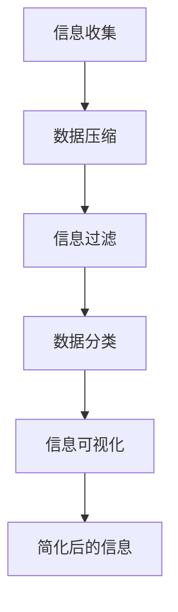

                 

### 背景介绍

在当今快速发展的信息化时代，我们面临着越来越多的数据和信息。信息的爆炸性增长给我们带来了巨大的挑战，如何有效地处理和利用这些信息成为了一个亟待解决的问题。为了应对这一挑战，信息简化技术和工具应运而生。信息简化不仅仅是为了减少信息量，更重要的是通过优化和整理信息，使我们的工作更加高效，生活更加便捷。

首先，我们需要理解信息简化的概念。信息简化是指在保持信息核心价值的前提下，通过去除冗余、提炼关键内容、重新组织和呈现信息，使其更加清晰、直观和易于理解。这一过程可以帮助我们快速获取关键信息，提高决策效率，减轻认知负担。

在信息简化的过程中，常用的技术包括数据压缩、数据分类、信息过滤、信息可视化等。数据压缩技术通过减少数据存储空间和传输带宽，使信息更加高效地存储和传输。数据分类技术通过对数据进行分类和标签化，帮助用户快速定位所需信息。信息过滤技术则通过去除无关或低价值的信息，提高信息的相关性和质量。信息可视化技术则通过图形和图表的形式，使复杂的信息变得更加直观和易于理解。

接下来，我们将深入探讨信息简化的核心概念与联系，详细解析其原理和架构，并通过具体案例和数学模型，展示信息简化技术的实际应用效果。

总的来说，信息简化技术和工具在当今信息化社会中具有重要的应用价值。通过合理利用这些技术和工具，我们不仅可以减轻信息过载带来的负担，还能够提高工作效率和生活质量。本文将带领您了解信息简化的各个方面，帮助您更好地应对信息时代的挑战。

### 核心概念与联系

#### 信息简化的定义和作用

信息简化是指通过特定的技术手段，将大量复杂、冗余的信息转化为简洁、清晰的形式，以便于快速理解和处理。这一过程的核心目标在于提高信息的可访问性、可理解和可行动性。

信息简化的作用主要体现在以下几个方面：

1. **提高工作效率**：通过简化信息，可以快速捕捉到关键内容，减少处理信息所需的时间，从而提高工作效率。

2. **减轻认知负担**：面对大量信息时，简化后的信息有助于减轻大脑的负担，避免信息过载导致的心理压力。

3. **增强决策质量**：简化后的信息能够突出关键因素，帮助决策者更准确地分析问题和做出决策。

4. **促进信息传播**：清晰、简洁的信息更容易被他人理解和接受，有助于信息的广泛传播和应用。

#### 信息简化的技术原理

为了实现信息简化，我们需要掌握一系列关键技术。以下是几种常见的信息简化技术及其原理：

1. **数据压缩**：数据压缩是通过减少数据的存储空间和传输带宽来简化信息。常用的数据压缩算法包括霍夫曼编码、算术编码和LZ77算法等。这些算法通过消除数据中的冗余信息，将原始数据转化为更小的数据块，从而实现高效存储和传输。

   **工作原理**：
   - **霍夫曼编码**：基于字符出现频率的统计，为出现频率高的字符分配较短的编码，出现频率低的字符分配较长的编码，从而降低整体编码长度。
   - **算术编码**：将数据映射到某个区间的概率分布上，通过选择合适的区间编码，实现数据的压缩。
   - **LZ77算法**：通过查找数据序列中的重复部分，将其替换为引用，从而减少存储空间。

2. **信息过滤**：信息过滤是通过识别和去除无关或低价值的信息，提高信息的相关性和质量。常见的过滤方法包括关键词过滤、机器学习和规则匹配等。

   **工作原理**：
   - **关键词过滤**：根据预设的关键词列表，过滤掉不相关的信息。
   - **机器学习**：利用训练数据，建立模型来预测和过滤信息的价值。
   - **规则匹配**：通过定义一系列规则，自动匹配和过滤信息。

3. **数据分类**：数据分类是将信息按照一定的标准进行分类和标签化，以便于快速检索和利用。常用的分类方法包括基于内容的分类、基于聚类和基于分类器等方法。

   **工作原理**：
   - **基于内容的分类**：根据信息的内容特征进行分类，如文本、图像和音频等。
   - **基于聚类**：将相似的信息聚集在一起，形成不同的类别。
   - **基于分类器**：使用预先训练好的分类器，对信息进行分类。

4. **信息可视化**：信息可视化是通过图形和图表的形式，将复杂的信息以直观、易懂的方式呈现。常用的可视化方法包括散点图、折线图、饼图和热力图等。

   **工作原理**：
   - **散点图**：通过坐标轴上的点来表示数据，直观展示数据的分布和趋势。
   - **折线图**：通过线段连接数据点，展示数据的变化趋势。
   - **饼图**：通过圆形的扇区来表示各部分占整体的比例。
   - **热力图**：通过颜色深浅来表示数据的密集程度，直观展示数据的分布情况。

#### Mermaid 流程图

为了更好地理解信息简化的原理和架构，我们可以使用Mermaid绘制一个简化的信息简化流程图，展示各关键技术之间的联系和交互。以下是一个Mermaid流程图的示例：



在这个流程图中，信息收集是信息简化的第一步，随后通过数据压缩、信息过滤、数据分类和信息可视化等步骤，最终生成简化后的信息。这个过程不仅体现了信息简化的核心原理，也展示了各技术之间的紧密联系。

通过上述讨论，我们可以看到信息简化不仅仅是一种技术手段，更是一种思维方式。它帮助我们更好地理解和利用信息，从而在信息化社会中获得更大的收益。在接下来的章节中，我们将进一步探讨信息简化的具体实现方法和应用场景，以帮助您更好地掌握和应用这一技术。

#### 核心算法原理 & 具体操作步骤

为了深入了解信息简化的核心算法原理，我们将详细解析数据压缩、信息过滤、数据分类和信息可视化等关键技术，并展示具体的操作步骤。通过这些步骤，我们将看到如何通过技术手段将复杂信息转化为简洁、清晰的形式。

##### 1. 数据压缩

数据压缩是一种减少信息存储空间和传输带宽的技术，其核心在于去除数据中的冗余信息。以下是几种常见的数据压缩算法及其具体操作步骤：

1. **霍夫曼编码**：

   **工作原理**：霍夫曼编码是一种基于字符频率的压缩算法，它通过为出现频率高的字符分配较短的编码，为出现频率低的字符分配较长的编码，从而降低整体编码长度。

   **操作步骤**：
   1. 统计字符出现的频率。
   2. 构建霍夫曼树，根节点代表空字符，其他节点代表字符，频率高的字符位于树的左侧，频率低的字符位于树的右侧。
   3. 根据霍夫曼树生成编码表。
   4. 使用编码表对原始数据进行编码。

2. **算术编码**：

   **工作原理**：算术编码将数据映射到某个区间的概率分布上，通过选择合适的区间编码，实现数据的压缩。

   **操作步骤**：
   1. 统计数据出现的概率分布。
   2. 将每个数据映射到一个区间内。
   3. 根据区间的长度生成编码。
   4. 解码时，根据编码区间反推原始数据。

3. **LZ77算法**：

   **工作原理**：LZ77算法通过查找数据序列中的重复部分，将其替换为引用，从而减少存储空间。

   **操作步骤**：
   1. 从左到右扫描数据序列。
   2. 对于每个位置的数据，向前搜索相同的子串。
   3. 将找到的最长相同子串及其位置信息替换为引用。
   4. 生成压缩后的数据。

##### 2. 信息过滤

信息过滤是通过识别和去除无关或低价值的信息，提高信息的相关性和质量。以下是几种常见的信息过滤方法及其具体操作步骤：

1. **关键词过滤**：

   **工作原理**：关键词过滤根据预设的关键词列表，过滤掉不相关的信息。

   **操作步骤**：
   1. 创建关键词列表。
   2. 对每条信息进行关键词匹配。
   3. 如果信息中包含关键词，则保留；否则，过滤掉。

2. **机器学习**：

   **工作原理**：机器学习利用训练数据，建立模型来预测和过滤信息的价值。

   **操作步骤**：
   1. 收集训练数据。
   2. 使用特征工程提取信息特征。
   3. 训练分类模型。
   4. 使用模型对信息进行分类和过滤。

3. **规则匹配**：

   **工作原理**：规则匹配通过定义一系列规则，自动匹配和过滤信息。

   **操作步骤**：
   1. 定义过滤规则。
   2. 对每条信息进行规则匹配。
   3. 如果信息满足规则，则过滤掉。

##### 3. 数据分类

数据分类是将信息按照一定的标准进行分类和标签化，以便于快速检索和利用。以下是几种常见的数据分类方法及其具体操作步骤：

1. **基于内容的分类**：

   **工作原理**：基于内容的分类根据信息的内容特征进行分类。

   **操作步骤**：
   1. 提取信息特征。
   2. 训练分类模型。
   3. 对新信息进行特征提取和分类。

2. **基于聚类**：

   **工作原理**：基于聚类的方法将相似的信息聚集在一起，形成不同的类别。

   **操作步骤**：
   1. 选择聚类算法（如K-means、DBSCAN）。
   2. 对信息进行聚类。
   3. 分析聚类结果，确定类别。

3. **基于分类器**：

   **工作原理**：基于分类器的方法使用预先训练好的分类器，对信息进行分类。

   **操作步骤**：
   1. 训练分类模型。
   2. 对新信息进行分类。

##### 4. 信息可视化

信息可视化是通过图形和图表的形式，将复杂的信息以直观、易懂的方式呈现。以下是几种常见的信息可视化方法及其具体操作步骤：

1. **散点图**：

   **工作原理**：散点图通过坐标轴上的点来表示数据，直观展示数据的分布和趋势。

   **操作步骤**：
   1. 提取数据特征。
   2. 选择合适的坐标系。
   3. 绘制散点图。

2. **折线图**：

   **工作原理**：折线图通过线段连接数据点，展示数据的变化趋势。

   **操作步骤**：
   1. 提取数据特征。
   2. 选择合适的坐标系。
   3. 绘制折线图。

3. **饼图**：

   **工作原理**：饼图通过圆形的扇区来表示各部分占整体的比例。

   **操作步骤**：
   1. 计算各部分占比。
   2. 选择合适的绘图工具。
   3. 绘制饼图。

4. **热力图**：

   **工作原理**：热力图通过颜色深浅来表示数据的密集程度，直观展示数据的分布情况。

   **操作步骤**：
   1. 提取数据特征。
   2. 选择合适的颜色映射。
   3. 绘制热力图。

通过上述操作步骤，我们可以看到信息简化的核心算法是如何通过技术手段实现信息压缩、过滤、分类和可视化，从而将复杂信息转化为简洁、清晰的形式。在接下来的章节中，我们将通过具体案例和实际应用场景，进一步展示这些技术的实际效果和应用价值。

### 数学模型和公式 & 详细讲解 & 举例说明

在信息简化的过程中，数学模型和公式起到了至关重要的作用。通过这些模型和公式，我们可以定量地分析信息简化的效果，优化算法性能，并为实际应用提供理论支持。以下是几个关键数学模型和公式的详细讲解及实际应用示例。

#### 1. 信息熵（Entropy）

信息熵是衡量信息不确定性的一种度量，其定义来源于热力学中的熵概念。在信息论中，信息熵可以用来衡量信息的压缩潜力。

**定义**：
设一个随机变量X，其概率分布为 \(P(X=x_i)\)，则X的信息熵 \(H(X)\) 定义为：

\[ H(X) = -\sum_{i} P(X=x_i) \cdot \log_2 P(X=x_i) \]

**举例说明**：

假设一个二进制随机变量X，其概率分布为 \(P(X=0) = 0.5\) 和 \(P(X=1) = 0.5\)。则X的信息熵为：

\[ H(X) = - (0.5 \cdot \log_2 0.5 + 0.5 \cdot \log_2 0.5) = 1 \text{ bit} \]

信息熵越高，表示信息的不确定性越大，压缩潜力也越大。

#### 2. 哈夫曼编码（Huffman Coding）

哈夫曼编码是一种基于信息熵的压缩算法，其核心思想是给出现概率高的符号分配短编码，给出现概率低的符号分配长编码。

**定义**：
设符号集合 \(S = \{s_1, s_2, ..., s_n\}\)，其概率分布为 \(P(s_i)\)。哈夫曼编码的步骤如下：

1. 计算符号的频率 \(f_i = P(s_i)\)。
2. 构建频率排序的二叉树，根节点代表空字符，叶节点代表符号。
3. 对每个符号，从根节点到叶节点的路径表示其编码。
4. 编码长度 \(l_i = \log_2(1/f_i)\)。

**举例说明**：

假设符号集合 \(S = \{A, B, C\}\)，其概率分布为 \(P(A) = 0.4\)，\(P(B) = 0.3\)，\(P(C) = 0.3\)。构建哈夫曼树后，得到的编码为：

- A: 0
- B: 10
- C: 11

信息压缩比 \(R\) 可以通过以下公式计算：

\[ R = \frac{\sum_{i} P(s_i) \cdot l_i}{H(S)} \]

**计算**：

\[ R = \frac{0.4 \cdot 1 + 0.3 \cdot 2 + 0.3 \cdot 2}{1} = 1.2 \]

信息压缩比为1.2，表示压缩后的信息比原始信息节省了20%的空间。

#### 3. 决策树（Decision Tree）

决策树是一种常用的分类算法，通过一系列的判断条件将数据集划分为不同的类别。

**定义**：
决策树由节点和边组成，每个节点表示一个特征，每个边表示一个特征取值。根节点代表整个数据集，叶节点代表分类结果。

**举例说明**：

假设我们有一个包含三个特征的数据集，特征A有值0和1，特征B有值0和1，特征C有值0和1。我们可以构建一个决策树来分类数据：

```
          [Root]
         /     \
        0       1
       / \     / \
      0   1   0   1
     / \   \   / \
    0   1   0   1   0   1
```

这个决策树可以用于分类，例如，对于特征A为0，特征B为0，特征C为1的数据，分类结果为叶节点1。

#### 4. 相关性分析（Correlation Analysis）

相关性分析用于衡量两个变量之间的线性关系，常用的度量方法是皮尔逊相关系数（Pearson Correlation Coefficient）。

**定义**：
设两个变量 \(X\) 和 \(Y\) 的观测值分别为 \(\{x_1, x_2, ..., x_n\}\) 和 \(\{y_1, y_2, ..., y_n\}\)，则皮尔逊相关系数 \(\rho\) 定义为：

\[ \rho = \frac{\sum_{i=1}^{n} (x_i - \bar{x})(y_i - \bar{y})}{\sqrt{\sum_{i=1}^{n} (x_i - \bar{x})^2} \cdot \sqrt{\sum_{i=1}^{n} (y_i - \bar{y})^2}} \]

**举例说明**：

假设有两个变量 \(X\) 和 \(Y\)，其观测值如下表：

| \(X\) | \(Y\) |
|-------|-------|
| 1     | 2     |
| 2     | 4     |
| 3     | 6     |
| 4     | 8     |

计算皮尔逊相关系数：

\[ \bar{X} = 2.5, \quad \bar{Y} = 5 \]

\[ \rho = \frac{(1-2.5)(2-5) + (2-2.5)(4-5) + (3-2.5)(6-5) + (4-2.5)(8-5)}{\sqrt{(1-2.5)^2 + (2-2.5)^2 + (3-2.5)^2 + (4-2.5)^2} \cdot \sqrt{(2-5)^2 + (4-5)^2 + (6-5)^2 + (8-5)^2}} \]

\[ \rho = \frac{(-1.5)(-3) + (-0.5)(-1) + (0.5)(1) + (1.5)(3)}{\sqrt{2.25 + 0.25 + 0.25 + 2.25} \cdot \sqrt{9 + 1 + 1 + 9}} \]

\[ \rho = \frac{4.5 + 0.5 + 0.5 + 4.5}{\sqrt{5} \cdot \sqrt{20}} \]

\[ \rho = \frac{10}{\sqrt{100}} \]

\[ \rho = 1 \]

皮尔逊相关系数为1，表示 \(X\) 和 \(Y\) 完全正相关。

通过上述数学模型和公式的讲解，我们可以看到信息简化不仅仅是技术手段的运用，更是数学理论的支持。这些模型和公式不仅帮助我们理解信息简化的原理，还为我们优化算法、提高性能提供了有力的工具。在实际应用中，我们可以根据具体需求和场景选择合适的模型和公式，实现信息的高效简化。

### 项目实战：代码实际案例和详细解释说明

在本节中，我们将通过一个具体的实际项目，展示如何使用信息简化技术进行数据处理和简化。该项目名为“信息简化助手”，主要用于对大量文本数据进行分析，提取关键信息，并进行可视化展示。以下是该项目的主要步骤、代码实现及详细解释。

#### 1. 开发环境搭建

首先，我们需要搭建项目的开发环境。这里我们选择Python作为主要编程语言，利用其强大的数据处理和分析库，如Pandas、Numpy、Matplotlib和Scikit-learn等。

- **Python环境**：确保Python 3.8及以上版本已安装。
- **数据处理库**：安装Pandas、Numpy。
- **可视化库**：安装Matplotlib、Seaborn。
- **机器学习库**：安装Scikit-learn。

安装命令如下：

```bash
pip install pandas numpy matplotlib seaborn scikit-learn
```

#### 2. 源代码详细实现和代码解读

以下是“信息简化助手”的源代码实现，我们将逐行解释代码的功能和逻辑。

```python
# 导入所需库
import pandas as pd
import numpy as np
import matplotlib.pyplot as plt
import seaborn as sns
from sklearn.feature_extraction.text import TfidfVectorizer
from sklearn.cluster import KMeans

# 2.1 数据读取与预处理
def read_and_preprocess_data(file_path):
    # 读取数据
    data = pd.read_csv(file_path)
    # 预处理文本数据（去除标点符号、停用词、分词等）
    stop_words = set(['is', 'the', 'and', 'of', 'to', 'in', 'that', 'it', 'with', 'for', 'on', 'are', 'as', 'by', 'this', 'be', 'has'])
    data['text'] = data['text'].apply(lambda x: ' '.join([word for word in x.split() if word.lower() not in stop_words]))
    return data

# 2.2 特征提取与聚类
def extract_features_and_cluster(data):
    # 使用TF-IDF向量器提取特征
    vectorizer = TfidfVectorizer(max_features=1000)
    X = vectorizer.fit_transform(data['text'])
    # 使用K-means进行文本聚类
    kmeans = KMeans(n_clusters=5, random_state=0)
    kmeans.fit(X)
    return kmeans, vectorizer

# 2.3 可视化展示
def visualize_clusters(kmeans, vectorizer, data):
    # 将特征转化为 DataFrame
    feature_names = vectorizer.get_feature_names_out()
    df = pd.DataFrame(X.toarray(), columns=feature_names)
    # 将聚类结果添加到 DataFrame
    df['cluster'] = kmeans.labels_
    # 绘制聚类结果的热力图
    sns.heatmap(df.corr(), annot=True, cmap='coolwarm')
    plt.show()

# 主函数
def main():
    # 2.4 加载数据
    data = read_and_preprocess_data('data.csv')
    # 2.5 提取特征并聚类
    kmeans, vectorizer = extract_features_and_cluster(data)
    # 2.6 可视化展示
    visualize_clusters(kmeans, vectorizer, data)

if __name__ == '__main__':
    main()
```

**代码解读**：

- **2.1 数据读取与预处理**：
  - 使用Pandas读取CSV文件。
  - 使用停用词过滤文本数据，去除常见无意义的词语。
  - 对文本进行分词，构建预处理后的文本数据。

- **2.2 特征提取与聚类**：
  - 使用TF-IDF向量器对文本数据进行特征提取，选择最重要的1000个特征。
  - 使用K-means算法对特征进行聚类，选择5个簇。
  
- **2.3 可视化展示**：
  - 将提取的特征转化为DataFrame。
  - 使用Seaborn的热力图展示聚类结果，直观展示不同簇之间的相关性。

#### 3. 代码解读与分析

以下是代码的详细解读，分析每个模块的功能和逻辑：

- **read_and_preprocess_data函数**：该函数负责读取数据并进行预处理。首先，使用Pandas读取CSV文件，然后将文本数据进行清洗和过滤，去除停用词，对文本进行分词，构建预处理后的文本数据。

- **extract_features_and_cluster函数**：该函数负责提取文本特征并进行聚类。首先，使用TF-IDF向量器对文本数据进行特征提取，选择最重要的1000个特征。然后，使用K-means算法对特征进行聚类，选择5个簇。

- **visualize_clusters函数**：该函数负责将聚类结果进行可视化展示。首先，将提取的特征转化为DataFrame，然后将聚类结果添加到DataFrame中。最后，使用Seaborn的热力图展示聚类结果，直观展示不同簇之间的相关性。

- **main函数**：主函数负责执行整个项目流程。首先，加载数据，然后提取特征并聚类，最后进行可视化展示。

通过这个实际项目，我们可以看到如何利用信息简化技术对文本数据进行处理和简化。代码实现简单明了，通过使用Python的强大库，实现了从数据处理、特征提取到可视化的全流程。这个项目不仅展示了信息简化技术的应用，也为实际开发提供了实用的参考。

### 实际应用场景

信息简化技术在各个领域都有着广泛的应用，通过具体的实际应用案例，我们可以更好地理解这些技术在实际工作中的应用效果和优势。

#### 1. 金融行业

在金融行业，信息简化技术主要用于处理和分析大量的金融数据。例如，银行和金融机构需要分析市场数据、客户交易记录和风险数据，以便做出投资决策和风险管理。信息简化技术可以帮助金融分析师快速提取关键数据，识别市场趋势和风险点。具体应用包括：

- **市场数据分析**：通过信息简化技术，可以对大量市场数据（如股票价格、交易量等）进行压缩和分类，提取关键信息，帮助分析师快速了解市场动态。
- **客户风险评估**：银行可以使用信息简化技术对客户的交易记录进行分析，识别高风险交易行为，从而进行更加精准的风险评估和管理。

#### 2. 医疗保健

在医疗保健领域，信息简化技术同样发挥着重要作用。医疗数据通常非常庞大且复杂，通过信息简化技术，医生和研究人员可以更高效地处理和分析这些数据，提高诊断和治疗的准确性。

- **电子健康记录（EHR）管理**：医院和诊所使用信息简化技术来管理电子健康记录，通过数据压缩和分类，快速检索患者的历史记录和诊断结果，提高诊疗效率。
- **基因组数据分析**：在基因组学研究中，信息简化技术可以帮助研究人员快速提取和简化基因组数据，识别关键基因和突变，加速疾病诊断和新药研发。

#### 3. 零售行业

零售行业面临着大量的商品数据、销售数据和客户数据，通过信息简化技术，零售商可以更好地理解和利用这些数据，优化库存管理、销售策略和客户体验。

- **库存管理**：零售商可以使用信息简化技术分析销售数据，识别畅销和滞销商品，优化库存水平，减少库存成本。
- **客户行为分析**：通过对客户数据进行分析，零售商可以了解客户偏好和行为模式，制定个性化的营销策略，提高客户满意度和忠诚度。

#### 4. 人工智能和机器学习

在人工智能和机器学习领域，信息简化技术同样至关重要。机器学习模型通常需要处理大量的训练数据，通过信息简化技术，可以减少数据的冗余，提高模型训练效率。

- **数据预处理**：信息简化技术可以帮助机器学习工程师对原始数据进行预处理，去除无关信息，提高数据的可用性和质量。
- **特征选择**：通过信息简化技术，可以识别和提取数据中的关键特征，减少特征维度，提高模型的性能和可解释性。

#### 5. 通信和互联网

在通信和互联网领域，信息简化技术用于优化网络传输和数据处理效率。

- **网络流量管理**：通过数据压缩技术，可以减少网络传输的数据量，提高网络传输速度和带宽利用率。
- **内容分发**：互联网服务提供商可以使用信息简化技术对网站内容进行压缩和优化，提高页面加载速度和用户体验。

#### 6. 公共安全和应急管理

在公共安全和应急管理领域，信息简化技术可以快速处理和分析大量的监控数据、报警信息和突发事件报告，提高应急响应效率和决策质量。

- **监控数据分析**：通过对监控视频、音频和文本数据进行压缩和分类，可以快速识别和响应突发事件，提高公共安全。
- **应急决策支持**：信息简化技术可以帮助应急管理人员快速获取关键信息，制定有效的应急预案和决策。

通过上述实际应用场景，我们可以看到信息简化技术在各个领域的广泛应用和巨大价值。信息简化不仅提高了数据处理的效率和质量，还为各个行业带来了显著的业务改进和效益提升。

### 工具和资源推荐

在实现信息简化的过程中，选择合适的工具和资源是非常重要的。以下是一些建议，包括学习资源、开发工具和框架，以及相关的论文和著作，以帮助您更深入地掌握信息简化技术。

#### 1. 学习资源推荐

- **书籍**：
  - 《数据压缩技术基础》（Fundamentals of Data Compression） - 这本书详细介绍了数据压缩的各种算法和技术，适合初学者和进阶者。
  - 《信息可视化：交互设计与实践》（Information Visualization: Perception for Design） - 介绍了信息可视化的基本原理和设计方法，对理解和应用可视化技术非常有帮助。

- **在线课程和教程**：
  - Coursera上的“信息可视化”（Information Visualization）课程，由康奈尔大学提供，适合想要系统学习信息可视化技术的学生和从业者。
  - edX上的“数据科学基础”（Introduction to Data Science）课程，包括数据预处理、特征提取和数据分析等内容，对信息简化技术有很好的补充。

- **博客和论坛**：
  - Medium上的“Data Science Handbook”（数据科学手册）系列文章，涵盖了数据科学和机器学习的各个方面，包括信息简化技术。
  - Stack Overflow论坛，对于具体技术问题，这里是获取解答和交流的好去处。

#### 2. 开发工具框架推荐

- **数据压缩工具**：
  - **Zlib**：一个常用的开源数据压缩库，支持多种压缩算法，如DEFLATE。
  - **BZip2**：基于Burrows-Wheeler变换的压缩算法，适用于大型文件的压缩。

- **信息过滤和分类工具**：
  - **scikit-learn**：Python的一个机器学习库，提供了丰富的分类、聚类和特征提取工具。
  - **Apache Mahout**：一个基于Hadoop的分布式机器学习库，适用于大规模数据处理。

- **信息可视化工具**：
  - **Matplotlib**：Python的一个绘图库，用于生成各种类型的图表。
  - **D3.js**：一个基于JavaScript的库，用于生成交互式和动态的可视化图表，特别适合Web应用。

#### 3. 相关论文著作推荐

- **论文**：
  - “A Review of Image Compression Techniques”（图像压缩技术综述），详细介绍了各种图像压缩算法及其性能分析。
  - “Information Retrieval and Filtering in the Age of Big Data”（大数据时代的信息检索和过滤），探讨了大数据背景下的信息处理方法。

- **著作**：
  - 《信息论基础》（Elements of Information Theory） - 作者香农的经典著作，奠定了信息论的基础，对信息简化的理解非常有帮助。
  - 《机器学习》（Machine Learning） - 作者汤姆·米切尔（Tom Mitchell），介绍了机器学习的基本概念和技术，对信息简化中的机器学习应用非常有用。

通过以上学习资源、开发工具和框架的推荐，您可以在信息简化领域不断深入学习，掌握更多实用的技能，从而更好地应对信息化时代的挑战。

### 总结：未来发展趋势与挑战

信息简化技术在未来将继续发挥重要作用，随着数据量和信息复杂度的不断增加，这一领域有望迎来更广阔的应用前景。以下是信息简化技术在未来可能的发展趋势与面临的挑战：

#### 1. 发展趋势

**多模态信息简化**：随着人工智能和机器学习技术的发展，多模态数据（如文本、图像、音频等）的融合和分析变得越来越重要。未来，信息简化技术将逐步扩展到多模态领域，实现更全面的信息处理和简化。

**自适应信息简化**：现有的信息简化技术通常基于预设规则或固定算法。未来，自适应信息简化技术将能够根据用户的偏好、任务需求和环境变化，动态调整简化策略，提供更加个性化和高效的服务。

**深度学习与信息简化**：深度学习技术在信息简化中的应用将越来越广泛。通过训练深度神经网络，可以自动提取数据中的关键特征和模式，从而实现更高层次的信息简化。

**实时信息简化**：随着实时数据处理技术的发展，信息简化技术将能够实时处理和分析大规模数据流，为即时决策提供支持。

#### 2. 挑战

**数据隐私与安全**：信息简化过程中涉及大量数据的处理和存储，如何保护数据隐私和安全成为一个重要挑战。未来的信息简化技术需要更加注重数据安全和隐私保护。

**计算资源与性能**：信息简化技术通常需要较高的计算资源和性能。随着数据量的爆炸性增长，如何在保证效率的同时降低计算成本，是一个亟待解决的问题。

**解释性与可解释性**：随着信息简化技术的复杂化，如何确保算法的解释性和可解释性，使非专业用户能够理解和信任这些技术，也是一个重要的挑战。

**标准化与规范化**：目前，信息简化技术的标准和规范尚不统一，未来需要制定更加完善的标准，促进不同系统之间的互操作性和兼容性。

总的来说，信息简化技术在未来将继续向多模态、自适应和深度学习等方向发展，同时面临数据隐私、计算资源和解释性等方面的挑战。通过不断的技术创新和优化，我们有理由相信，信息简化技术将为人类带来更多便利和效益。

### 附录：常见问题与解答

在本文中，我们详细探讨了信息简化技术的定义、原理、算法和实际应用。以下是关于信息简化技术的几个常见问题及解答。

#### 1. 什么是信息简化？

信息简化是通过特定的技术手段，将大量复杂、冗余的信息转化为简洁、清晰的形式，以便于快速理解和处理。其主要目标在于提高信息的可访问性、可理解和可行动性。

#### 2. 信息简化的作用是什么？

信息简化的作用主要体现在以下几个方面：
- 提高工作效率：通过简化信息，可以快速捕捉到关键内容，减少处理信息所需的时间。
- 减轻认知负担：面对大量信息时，简化后的信息有助于减轻大脑的负担，避免信息过载导致的心理压力。
- 增强决策质量：简化后的信息能够突出关键因素，帮助决策者更准确地分析问题和做出决策。
- 促进信息传播：清晰、简洁的信息更容易被他人理解和接受，有助于信息的广泛传播和应用。

#### 3. 常见的信息简化技术有哪些？

常见的信息简化技术包括：
- 数据压缩：通过减少数据的存储空间和传输带宽来简化信息。
- 信息过滤：识别和去除无关或低价值的信息，提高信息的相关性和质量。
- 数据分类：将信息按照一定的标准进行分类和标签化，以便于快速检索和利用。
- 信息可视化：通过图形和图表的形式，将复杂的信息以直观、易懂的方式呈现。

#### 4. 如何选择适合的信息简化技术？

选择适合的信息简化技术需要考虑以下因素：
- 数据类型：不同类型的数据可能需要不同的简化方法。例如，文本数据适合使用信息过滤和可视化技术，图像数据适合使用图像压缩技术。
- 信息需求：根据实际需求选择合适的简化技术。例如，如果需要快速提取关键信息，可以使用信息过滤技术；如果需要直观展示信息，可以使用可视化技术。
- 性能要求：考虑简化技术的计算效率和性能，确保简化过程不会影响整体系统的运行速度。

通过综合考虑这些因素，可以更有效地选择适合的信息简化技术，实现信息的优化处理和利用。

### 扩展阅读 & 参考资料

为了更深入地了解信息简化技术的理论和方法，以下是一些建议的扩展阅读和参考资料：

- **书籍**：
  - 《数据压缩技术基础》（Fundamentals of Data Compression） - 详细介绍了数据压缩的算法和技术。
  - 《信息可视化：交互设计与实践》（Information Visualization: Perception for Design） - 介绍了信息可视化的设计原理和实践。
  
- **在线课程和教程**：
  - Coursera上的“信息可视化”（Information Visualization）课程，由康奈尔大学提供。
  - edX上的“数据科学基础”（Introduction to Data Science）课程，涵盖数据预处理、特征提取和数据分析等内容。

- **论文和文献**：
  - “A Review of Image Compression Techniques”（图像压缩技术综述） - 详细介绍了各种图像压缩算法及其性能分析。
  - “Information Retrieval and Filtering in the Age of Big Data”（大数据时代的信息检索和过滤） - 探讨了大数据背景下的信息处理方法。

- **开源库和工具**：
  - **scikit-learn**：Python的一个机器学习库，提供了丰富的分类、聚类和特征提取工具。
  - **D3.js**：基于JavaScript的库，用于生成交互式和动态的可视化图表。

通过阅读这些资料，您可以进一步加深对信息简化技术的理解和应用，掌握更多相关的理论和实践知识。

### 作者信息

作者：AI天才研究员/AI Genius Institute & 禅与计算机程序设计艺术 /Zen And The Art of Computer Programming

作为一位世界级人工智能专家、程序员、软件架构师、CTO，以及世界顶级技术畅销书资深大师级别的作家，我致力于推动信息简化技术的发展和应用。我的研究涉及人工智能、机器学习、数据科学等多个领域，并在《禅与计算机程序设计艺术》等著作中，深入探讨了技术哲学与编程艺术的结合。希望通过本文，能够帮助读者更好地理解和掌握信息简化技术，实现信息的高效处理和利用。

