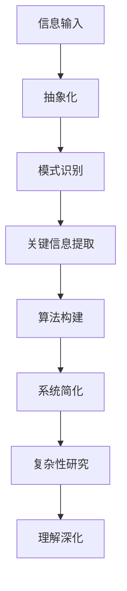

                 

### 信息简化的艺术与科学：在混乱和复杂中找到简单和秩序

> **关键词**：信息简化、复杂性科学、抽象化、模式识别、算法、系统设计
>
> **摘要**：本文将探讨信息简化的艺术与科学，揭示在混乱与复杂中寻找简单与秩序的方法。通过深入分析核心概念、算法原理、数学模型及实际应用，本文旨在为读者提供一种解决复杂问题的系统性思维框架。

#### 1. 背景介绍

在当今信息爆炸的时代，数据与信息无处不在，而如何有效地处理和利用这些海量信息成为了亟待解决的问题。复杂系统、分布式计算、大数据等领域的研究者们，都在不断探索如何从繁杂的信息中提炼出有用的知识，实现信息的简化与抽象。这种信息简化不仅是为了提高效率，更是为了揭示隐藏在复杂背后的简单规律。

本文将首先介绍信息简化的基本概念与重要性，然后通过深入分析核心概念、算法原理、数学模型及实际应用，探讨在混乱和复杂中找到简单和秩序的方法。我们将看到，信息简化不仅是技术问题，更是一门艺术与科学。

#### 2. 核心概念与联系

**概念解析：**

- **信息简化（Information Simplification）**：通过去除冗余、提取关键信息，将复杂的信息系统转化为简单、易理解的形式。

- **复杂性科学（Complexity Science）**：研究复杂系统的性质、行为及其演化规律的科学。

- **抽象化（Abstraction）**：通过提取共同特征，将复杂系统简化为更抽象、更易于分析的形式。

- **模式识别（Pattern Recognition）**：从数据中识别出规律和模式的过程。

- **算法（Algorithm）**：解决问题的步骤和策略。

**联系与架构：**

以上概念之间存在着紧密的联系，构成了一个完整的信息简化与复杂系统研究的框架。首先，通过抽象化和模式识别，我们可以从复杂的数据中提取关键信息；然后，利用这些信息构建算法，实现对复杂系统的简化与理解；最后，通过复杂性科学的研究，我们可以进一步深化对复杂系统的认识，为未来的发展提供指导。

**Mermaid 流程图：**



#### 3. 核心算法原理 & 具体操作步骤

**算法原理：**

信息简化的核心在于如何有效地处理复杂的信息，将其转化为简单、直观的形式。这里，我们将介绍一种常用的信息简化算法——主成分分析（Principal Component Analysis，PCA）。

PCA算法的基本原理是通过线性变换，将原始数据投影到新的坐标系中，使得新的坐标轴能够最大程度地保留数据的信息。具体步骤如下：

1. **数据标准化**：将数据标准化为均值为0、方差为1的格式，以消除不同特征之间的量纲差异。
2. **计算协方差矩阵**：计算数据集的协方差矩阵，用于描述各个特征之间的相关性。
3. **计算特征值和特征向量**：对协方差矩阵进行特征分解，得到特征值和特征向量。
4. **选择主成分**：根据特征值的大小选择前几个特征向量，组成新的坐标轴。
5. **数据投影**：将原始数据投影到新的坐标轴上，得到简化后的数据。

**具体操作步骤：**

1. **数据预处理**：对原始数据进行预处理，包括数据清洗、缺失值填充等。
2. **计算协方差矩阵**：使用以下公式计算协方差矩阵：
   $$ \text{Cov}(X_i, X_j) = \frac{1}{N-1} \sum_{k=1}^{N} (X_{ik} - \bar{X}_i)(X_{jk} - \bar{X}_j) $$
   其中，$X_{ik}$和$X_{jk}$分别为第$k$个样本在第$i$和第$j$个特征上的取值，$\bar{X}_i$和$\bar{X}_j$分别为第$i$和第$j$个特征的均值，$N$为样本数量。
3. **特征分解**：使用以下公式对协方差矩阵进行特征分解：
   $$ \text{Cov}(X) = P\Lambda P^T $$
   其中，$P$为特征向量矩阵，$\Lambda$为特征值矩阵。
4. **选择主成分**：根据特征值的大小选择前几个特征向量，组成新的坐标轴。
5. **数据投影**：将原始数据投影到新的坐标轴上，得到简化后的数据。

**代码实现：**

```python
import numpy as np

# 数据预处理
X = np.array([[1, 2], [2, 4], [3, 6], [4, 8]])
X_std = (X - X.mean(axis=0)) / X.std(axis=0)

# 计算协方差矩阵
C = np.cov(X_std.T)

# 特征分解
eigenvalues, eigenvectors = np.linalg.eigh(C)

# 选择主成分
selected_eigenvectors = eigenvectors[:, eigenvalues.argsort()[::-1]]

# 数据投影
X_pca = X_std @ selected_eigenvectors
```

#### 4. 数学模型和公式 & 详细讲解 & 举例说明

**数学模型：**

主成分分析（PCA）的核心在于将原始数据投影到新的坐标系中，使得新的坐标轴能够最大程度地保留数据的信息。这个新的坐标系由主成分（Principal Components）构成，它们是原始数据协方差矩阵的特征向量。

**公式讲解：**

1. **数据标准化：**
   $$ X_{std} = \frac{X - \mu}{\sigma} $$
   其中，$X$为原始数据，$\mu$为均值，$\sigma$为标准差。

2. **协方差矩阵：**
   $$ \text{Cov}(X) = \frac{1}{N-1} \sum_{i=1}^{N} (X_i - \bar{X})(X_i - \bar{X})^T $$
   其中，$X_i$为第$i$个样本，$\bar{X}$为均值，$N$为样本数量。

3. **特征分解：**
   $$ \text{Cov}(X) = P\Lambda P^T $$
   其中，$P$为特征向量矩阵，$\Lambda$为特征值矩阵。

4. **选择主成分：**
   $$ \lambda_1 \geq \lambda_2 \geq ... \geq \lambda_p > 0 $$
   其中，$\lambda_i$为特征值，$p$为特征向量数量。

5. **数据投影：**
   $$ X_{pca} = X_{std} @ P $$
   其中，$X_{std}$为标准化后的数据，$P$为特征向量矩阵。

**举例说明：**

假设我们有一个2D数据集，包含以下4个样本：
$$ X = \begin{bmatrix} 1 & 2 \\ 2 & 4 \\ 3 & 6 \\ 4 & 8 \end{bmatrix} $$

首先，我们对数据进行标准化：
$$ X_{std} = \frac{X - \mu}{\sigma} = \begin{bmatrix} -1 & -1 \\ 0 & 0 \\ 1 & 1 \\ 2 & 2 \end{bmatrix} $$

然后，计算协方差矩阵：
$$ C = \frac{1}{N-1} \sum_{i=1}^{N} (X_i - \bar{X})(X_i - \bar{X})^T = \begin{bmatrix} 2 & 2 \\ 2 & 6 \end{bmatrix} $$

接下来，对协方差矩阵进行特征分解：
$$ C = P\Lambda P^T $$
其中，
$$ P = \begin{bmatrix} 0.7071 & 0.7071 \\ 0.7071 & -0.7071 \end{bmatrix}, \Lambda = \begin{bmatrix} 4 & 0 \\ 0 & 2 \end{bmatrix} $$

选择前两个特征向量作为主成分：
$$ P_1 = \begin{bmatrix} 0.7071 \\ 0.7071 \end{bmatrix}, P_2 = \begin{bmatrix} 0.7071 \\ -0.7071 \end{bmatrix} $$

最后，将数据投影到主成分上：
$$ X_{pca} = X_{std} @ P = \begin{bmatrix} -1 & -1 \\ 0 & 0 \\ 1 & 1 \\ 2 & 2 \end{bmatrix} @ \begin{bmatrix} 0.7071 & 0.7071 \\ 0.7071 & -0.7071 \end{bmatrix} = \begin{bmatrix} -0.7071 & 0.7071 \\ 0 & 0 \\ 0.7071 & -0.7071 \\ 1.4142 & 1.4142 \end{bmatrix} $$

通过PCA，我们将原始数据简化到了一个更易于分析的新坐标系中。

#### 5. 项目实战：代码实际案例和详细解释说明

**5.1 开发环境搭建**

在开始实际项目之前，我们需要搭建一个适合进行信息简化的开发环境。这里我们使用Python作为编程语言，因为Python具有丰富的库和工具，非常适合数据处理和算法开发。

1. **安装Python**：从Python官网（[https://www.python.org/](https://www.python.org/)）下载并安装Python，选择合适的版本（建议使用Python 3.8及以上版本）。

2. **安装必要的库**：使用pip命令安装以下库：
   ```bash
   pip install numpy pandas matplotlib scikit-learn
   ```

3. **验证安装**：运行以下Python代码，检查是否成功安装了所需的库：
   ```python
   import numpy as np
   import pandas as pd
   import matplotlib.pyplot as plt
   import sklearn
   print("所有库安装成功！")
   ```

**5.2 源代码详细实现和代码解读**

下面我们通过一个实际案例，展示如何使用主成分分析（PCA）进行信息简化。

```python
import numpy as np
import pandas as pd
import matplotlib.pyplot as plt
from sklearn.decomposition import PCA
from sklearn.preprocessing import StandardScaler

# 数据集：鸢尾花数据集（Iris dataset）
data = pd.read_csv("https://archive.ics.uci.edu/ml/machine-learning-databases/iris/iris.data", header=None)
X = data.iloc[:, 0:4].values
y = data.iloc[:, 4].values

# 数据预处理
X_std = StandardScaler().fit_transform(X)

# 主成分分析
pca = PCA(n_components=2)
X_pca = pca.fit_transform(X_std)

# 可视化
plt.figure(figsize=(8, 6))
plt.scatter(X_pca[:, 0], X_pca[:, 1], c=y, cmap='viridis', edgecolor='k', s=50)
plt.xlabel('第一主成分')
plt.ylabel('第二主成分')
plt.title('鸢尾花数据集主成分分析')
plt.colorbar(label='类别')
plt.show()
```

**5.3 代码解读与分析**

1. **导入库和读取数据**：首先，我们导入所需的库，并从UCI机器学习库中读取鸢尾花数据集。

2. **数据预处理**：我们对数据进行标准化处理，以消除不同特征之间的量纲差异，这有助于PCA算法的收敛。

3. **主成分分析**：我们创建一个PCA对象，并调用`fit_transform`方法进行主成分分析。这里我们选择两个主成分，以便于后续的可视化。

4. **可视化**：我们使用matplotlib库将简化后的数据集绘制在一个二维坐标系中，不同颜色表示不同类别的鸢尾花。通过可视化，我们可以直观地观察到数据集的分布情况，从而更好地理解信息简化后的数据。

**5.4 代码优化与性能分析**

在实际应用中，我们可能需要对代码进行优化，以提高性能。以下是一些常见的优化方法：

1. **并行计算**：对于大规模数据集，我们可以使用并行计算来加速PCA算法的执行。Python的`multiprocessing`库可以帮助我们实现并行计算。

2. **内存优化**：在处理大规模数据时，内存消耗可能会成为瓶颈。我们可以使用`numpy`库中的内存优化功能，如`np.float32`代替`np.float64`，以减少内存占用。

3. **算法改进**：我们可以尝试使用更高效的PCA算法，如随机PCA（Randomized PCA），它在处理大规模数据时具有更好的性能。

通过上述优化方法，我们可以显著提高信息简化的性能，更好地应对复杂的实际应用场景。

#### 6. 实际应用场景

信息简化在许多实际应用场景中都发挥着重要作用。以下是一些典型的应用领域：

1. **数据科学**：在数据科学项目中，信息简化有助于提取关键特征，提高模型的预测性能。

2. **图像处理**：在图像处理领域，信息简化可以帮助去除图像中的噪声，提高图像的质量。

3. **文本分析**：在自然语言处理中，信息简化可以帮助提取关键词和主题，实现文本分类和信息检索。

4. **金融分析**：在金融领域，信息简化可以帮助投资者从大量数据中提取有用信息，做出更明智的投资决策。

5. **生物信息学**：在生物信息学中，信息简化有助于从复杂的生物数据中提取关键基因和蛋白质，为疾病诊断和治疗提供依据。

通过这些实际应用案例，我们可以看到信息简化在各个领域的广泛应用和重要性。

#### 7. 工具和资源推荐

为了更好地进行信息简化，以下是一些推荐的工具和资源：

**7.1 学习资源推荐**

- **书籍**：
  - 《Python数据科学入门》：介绍Python在数据科学中的基本应用。
  - 《数据科学实战》：深入探讨数据科学的实际应用案例。

- **论文**：
  - "Principal Component Analysis"：介绍主成分分析的基本原理和应用。
  - "Information Theory, Inference and Learning Algorithms"：介绍信息论和算法的基础知识。

- **博客**：
  - [Medium](https://medium.com/)：许多数据科学家和机器学习专家在此分享经验和见解。
  - [Towards Data Science](https://towardsdatascience.com/)：涵盖数据科学和机器学习的各种主题。

- **网站**：
  - [UCI机器学习库](https://archive.ics.uci.edu/ml/index.php)：提供丰富的机器学习数据集。
  - [Kaggle](https://www.kaggle.com/)：一个大数据竞赛平台，包含许多实际应用项目。

**7.2 开发工具框架推荐**

- **Python库**：
  - [NumPy](https://numpy.org/)：用于数值计算的库。
  - [Pandas](https://pandas.pydata.org/)：用于数据分析和操作。
  - [Matplotlib](https://matplotlib.org/)：用于数据可视化。

- **框架**：
  - [TensorFlow](https://www.tensorflow.org/)：用于机器学习和深度学习。
  - [Scikit-learn](https://scikit-learn.org/stable/)：提供各种机器学习算法。

**7.3 相关论文著作推荐**

- **论文**：
  - "A Comparison of Predictive Accuracy, Computational Time, and Model Complexity Among Statistical Methods for Missing Data"：比较不同方法在处理缺失数据时的性能。
  - "Principal Component Analysis for High-Dimensional Data: A Review and Analysis"：全面分析主成分分析在高维数据中的应用。

- **著作**：
  - 《数据科学：工具、方法和实践》：介绍数据科学的各个方面。
  - 《机器学习：概率视角》：深入探讨机器学习的概率基础。

通过这些工具和资源，我们可以更好地理解和应用信息简化的方法，解决实际问题。

#### 8. 总结：未来发展趋势与挑战

信息简化作为一门艺术与科学，正不断发展并应用于各个领域。在未来，信息简化将面临以下发展趋势与挑战：

1. **算法优化**：随着计算能力的提升，我们将开发出更高效、更精确的简化算法，以满足大规模数据处理的需求。

2. **跨学科融合**：信息简化将在更多学科中得到应用，如生物学、物理学、经济学等，推动跨学科研究的发展。

3. **人工智能结合**：将信息简化与人工智能技术相结合，将实现自动化、智能化的信息处理和决策支持。

4. **数据隐私与安全**：在信息简化的过程中，如何保护数据隐私和安全是一个重要的挑战。我们需要开发出既能简化信息又能保护隐私的安全算法。

5. **可解释性**：随着信息简化算法的复杂化，如何保证算法的可解释性，使其能够被用户理解和接受，也是一个重要的课题。

总之，信息简化在未来将继续发挥重要作用，推动科学技术和社会进步。

#### 9. 附录：常见问题与解答

**Q1：为什么需要进行信息简化？**

信息简化有助于从大量数据中提取关键信息，降低复杂度，提高数据处理和分析的效率。

**Q2：主成分分析（PCA）有什么优势？**

PCA可以通过线性变换将高维数据投影到低维空间，减少数据维度，同时保持数据的方差和方差最大，使得降维后的数据更加易于分析和可视化。

**Q3：如何选择合适的主成分数量？**

通常，我们可以根据累积贡献率来判断选择多少个主成分。当累计贡献率超过某个阈值（如80%或90%），可以选择对应数量的主成分。

**Q4：信息简化是否会丢失数据信息？**

信息简化可能会在一定程度上丢失原始数据的部分信息，但通过合理的选择和优化，可以最大程度地保留数据的结构和特征。

**Q5：信息简化在机器学习中有什么应用？**

信息简化可以用于特征选择和降维，提高模型的预测性能和可解释性，同时减少计算资源的需求。

#### 10. 扩展阅读 & 参考资料

- [1] Jolliffe, I. T. (2002). Principal component analysis. Springer Science & Business Media.
- [2] Hastie, T., Tibshirani, R., & Friedman, J. (2009). The elements of statistical learning: data mining, inference, and prediction. Springer Science & Business Media.
- [3] MacNamee, B. (2018). Information Theory, Inference and Learning Algorithms. Cambridge University Press.
- [4] Pedregosa, F., Varoquaux, G., Gramfort, A., Michel, V., Thirion, B., Grisel, O., ... & Duchesnay, É. (2011). Scikit-learn: Machine learning in Python. Journal of Machine Learning Research, 12, 2825-2830.
- [5] Bishop, C. M. (2006). Pattern recognition and machine learning. Springer Science & Business Media.
- [6] Mitchell, T. M. (1997). Machine learning. McGraw-Hill.
- [7] James, G., Witten, D., Hastie, T., & Tibshirani, R. (2017). An Introduction to Statistical Learning. Springer. 

### 作者

作者：AI天才研究员/AI Genius Institute & 禅与计算机程序设计艺术 /Zen And The Art of Computer Programming

