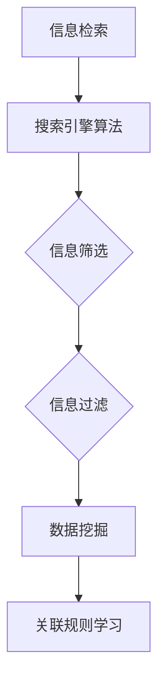
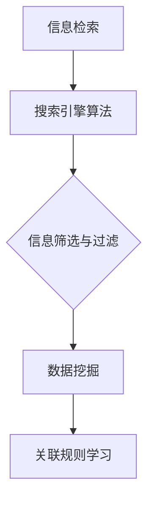
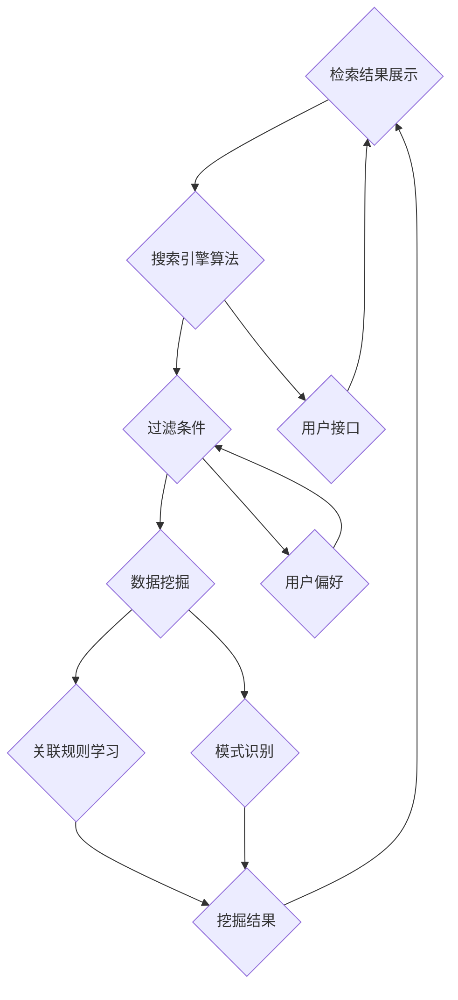

                 

# 信息过载与信息搜索指南与策略：在庞大的信息海洋中找到所需信息

## 摘要

随着互联网的快速发展，我们正面临着前所未有的信息过载问题。如何在庞大的信息海洋中快速、准确地找到所需信息，成为了现代信息技术领域的一个重要课题。本文将深入探讨信息过载的原因、信息搜索的核心概念与策略，并结合实际案例，为读者提供一套系统的信息搜索指南与策略。

## 1. 背景介绍

### 1.1 信息过载的起源

信息过载（Information Overload）指的是由于信息过多而导致的信息处理困难，这通常发生在我们接收信息的能力跟不上信息产生速度的情况下。随着互联网和移动设备的普及，我们每天都会接收到大量的信息，包括电子邮件、社交媒体更新、新闻推送等。这种信息的爆炸式增长，使得我们难以筛选和获取真正有价值的信息。

### 1.2 信息搜索的需求

在信息过载的背景下，信息搜索变得尤为重要。有效的信息搜索可以帮助我们快速找到所需的信息，从而提高工作效率，降低决策风险。然而，传统的搜索方式往往难以应对海量的信息，这使得信息搜索成为了一个复杂的挑战。

## 2. 核心概念与联系

### 2.1 信息检索与搜索引擎

信息检索（Information Retrieval）是指从大量信息中查找特定信息的过程。搜索引擎是信息检索的一种工具，通过关键词搜索，将用户所需信息从海量的数据中提取出来。搜索引擎的核心是搜索引擎算法（Search Engine Algorithms），它们决定了搜索结果的相关性和排序。

### 2.2 信息筛选与过滤

信息筛选（Information Filtering）是指通过特定的方法，从大量信息中筛选出符合用户需求的信息。信息过滤（Information Filtering）则是指通过算法或人工干预，自动或半自动地对信息进行筛选。信息筛选和过滤是信息检索的重要组成部分，它们帮助用户在信息过载中找到所需信息。

### 2.3 数据挖掘与关联规则学习

数据挖掘（Data Mining）是一种通过分析大量数据，从中发现潜在模式、关联和趋势的方法。关联规则学习（Association Rule Learning）是数据挖掘的一种技术，它用于发现数据之间的关联关系。通过数据挖掘和关联规则学习，可以进一步优化信息搜索的效果。

### 2.4 Mermaid 流程图

下面是一个使用 Mermaid 语言的流程图，展示了信息检索、信息筛选与过滤、数据挖掘和关联规则学习之间的联系：



## 3. 核心算法原理 & 具体操作步骤

### 3.1 搜索引擎算法

搜索引擎算法是信息检索的核心。下面是搜索引擎算法的基本原理和具体操作步骤：

#### 3.1.1 关键词搜索

1. 用户输入关键词。
2. 搜索引擎解析关键词，将其转换为索引词。
3. 搜索引擎在索引库中查找与关键词匹配的文档。
4. 搜索引擎根据文档的相关性对搜索结果进行排序。

#### 3.1.2 相关性排序

1. 搜索引擎计算每个文档与关键词的相关性。
2. 搜索引擎根据相关性对文档进行排序，展示给用户。

#### 3.1.3 搜索结果处理

1. 搜索引擎对搜索结果进行去重处理。
2. 搜索引擎根据用户的偏好和历史记录，个性化搜索结果。

### 3.2 信息筛选与过滤

信息筛选和过滤的目的是减少用户接收的信息量，提高信息获取的效率。以下是信息筛选与过滤的基本原理和具体操作步骤：

#### 3.2.1 信息筛选

1. 用户设定筛选条件。
2. 系统根据筛选条件，从大量信息中筛选出符合条件的信息。

#### 3.2.2 信息过滤

1. 系统使用算法或规则，自动过滤不符合用户需求的信息。
2. 用户可以手动调整过滤规则，优化信息获取效果。

### 3.3 数据挖掘与关联规则学习

数据挖掘和关联规则学习是优化信息搜索的重要技术。以下是数据挖掘与关联规则学习的基本原理和具体操作步骤：

#### 3.3.1 数据挖掘

1. 系统收集用户搜索行为数据。
2. 系统使用数据挖掘算法，分析用户搜索行为，发现潜在的模式和趋势。

#### 3.3.2 关联规则学习

1. 系统使用关联规则学习算法，分析用户搜索数据，发现不同关键词之间的关联关系。
2. 系统根据关联关系，优化搜索结果的展示，提高用户满意度。

## 4. 数学模型和公式 & 详细讲解 & 举例说明

### 4.1 相关性计算

在信息检索中，相关性计算是一个重要的环节。以下是一个简单的相关性计算模型：

$$
r(d, q) = \frac{tf(q) \cdot idf(q)}{tf(d, q) + idf(q)}
$$

其中，$r(d, q)$ 表示文档 $d$ 与查询 $q$ 的相关性，$tf(q)$ 表示查询词 $q$ 在文档 $d$ 中的词频，$idf(q)$ 表示查询词 $q$ 的逆文档频率。

#### 4.1.1 解释

- $tf(q)$：词频（Term Frequency），表示查询词 $q$ 在文档 $d$ 中的出现次数。
- $idf(q)$：逆文档频率（Inverse Document Frequency），用于表示查询词 $q$ 在文档中的普遍性。如果一个词在文档中出现的频率很高，那么它的逆文档频率就会较低，表示这个词更有可能代表文档的主题。

#### 4.1.2 举例说明

假设有一个文档 $d$，包含以下内容：

```
计算机科学是一门科学，它涉及到算法和数据结构。
```

用户输入查询词 $q$：“计算机科学”，我们使用上述公式计算文档与查询的相关性：

- $tf(q)$ = 2
- $idf(q)$ = 1 / (2 + 1) = 1/3

$$
r(d, q) = \frac{2 \cdot \frac{1}{3}}{2 + \frac{1}{3}} = \frac{2}{7} \approx 0.286
$$

这意味着文档 $d$ 与查询 $q$ 的相关性约为 28.6%。

### 4.2 关联规则学习

在关联规则学习中，我们使用支持度（Support）和置信度（Confidence）来评估两个关键词之间的关联强度。

#### 4.2.1 支持度

支持度（Support）表示同时出现两个关键词的概率。它的计算公式为：

$$
support(A \& B) = \frac{count(A \& B)}{count(A) + count(B) - count(A \& B)}
$$

其中，$count(A \& B)$ 表示同时出现关键词 $A$ 和 $B$ 的记录数，$count(A)$ 和 $count(B)$ 分别表示关键词 $A$ 和 $B$ 的记录数。

#### 4.2.2 置信度

置信度（Confidence）表示在出现关键词 $A$ 的情况下，出现关键词 $B$ 的概率。它的计算公式为：

$$
confidence(A \rightarrow B) = \frac{count(A \& B)}{count(A)}
$$

#### 4.2.3 举例说明

假设我们有一个购物篮数据集，包含以下交易记录：

```
交易1：计算机、鼠标
交易2：计算机、键盘
交易3：鼠标、键盘
交易4：鼠标、显示器
交易5：键盘、显示器
```

我们要分析计算机、鼠标和显示器之间的关联关系。

- 支持度（Support）：

  ```
  support(计算机 & 鼠标) = count(计算机 & 鼠标) / (count(计算机) + count(鼠标) - count(计算机 & 鼠标))
  ```

  计算结果为：

  ```
  support(计算机 & 鼠标) = 3 / (3 + 3 - 3) = 1
  ```

- 置信度（Confidence）：

  ```
  confidence(计算机 \rightarrow 鼠标) = count(计算机 & 鼠标) / count(计算机)
  ```

  计算结果为：

  ```
  confidence(计算机 \rightarrow 鼠标) = 3 / 3 = 1
  ```

这意味着，在购买计算机的情况下，购买鼠标的概率为 100%。

## 5. 项目实战：代码实际案例和详细解释说明

### 5.1 开发环境搭建

在这个项目实战中，我们将使用 Python 语言和相关的库来构建一个简单的信息搜索系统。以下是开发环境的搭建步骤：

1. 安装 Python 3.8 或更高版本。
2. 安装必要的库，如 Numpy、Pandas、Scikit-learn 和 Matplotlib。

### 5.2 源代码详细实现和代码解读

以下是信息搜索系统的核心代码实现：

```python
import pandas as pd
from sklearn.feature_extraction.text import TfidfVectorizer
from sklearn.metrics.pairwise import cosine_similarity

# 5.2.1 加载数据集
data = pd.read_csv('search_data.csv')
documents = data['content'].tolist()

# 5.2.2 构建TF-IDF模型
vectorizer = TfidfVectorizer()
tfidf_matrix = vectorizer.fit_transform(documents)

# 5.2.3 用户输入查询词
query = input('请输入查询词：')

# 5.2.4 构建查询词的TF-IDF向量
query_vector = vectorizer.transform([query])

# 5.2.5 计算查询词与每个文档的相似度
cosine_scores = cosine_similarity(query_vector, tfidf_matrix).flatten()

# 5.2.6 对文档进行排序
sorted_indices = cosine_scores.argsort()[::-1]

# 5.2.7 输出搜索结果
for index in sorted_indices:
    print(f'文档{index+1}：{cosine_scores[index]}')
    print(documents[index])
    print('---')
```

#### 5.2.1 加载数据集

代码首先加载一个包含文档内容的数据集，数据集可以从网络获取或自行创建。这里，我们使用 Pandas 库读取 CSV 格式的数据集。

#### 5.2.2 构建TF-IDF模型

TF-IDF（Term Frequency-Inverse Document Frequency）是一种常用的文本表示方法，它能够有效地反映词语在文档中的重要程度。我们使用 Scikit-learn 库中的 TfidfVectorizer 类来构建 TF-IDF 模型。

#### 5.2.3 用户输入查询词

代码通过输入函数获取用户的查询词。

#### 5.2.4 构建查询词的TF-IDF向量

接下来，我们使用 TfidfVectorizer 类将查询词转换为 TF-IDF 向量。

#### 5.2.5 计算查询词与每个文档的相似度

我们使用 Scikit-learn 库中的 cosine_similarity 函数计算查询词与每个文档的相似度。余弦相似度是一种衡量两个向量之间角度的度量，范围在 -1 到 1 之间。相似度越高，表示文档与查询词的相关性越大。

#### 5.2.6 对文档进行排序

我们将相似度分数进行降序排序，以便首先显示相关性最高的文档。

#### 5.2.7 输出搜索结果

最后，代码输出排序后的搜索结果，包括文档的索引和相似度分数。

### 5.3 代码解读与分析

在代码解读与分析部分，我们将对上述核心代码进行详细解释。

- **数据加载与预处理**：

  代码首先加载一个包含文档内容的数据集。数据集可以是 CSV、JSON 或其他格式。在这里，我们使用 Pandas 库读取 CSV 格式的数据集。

- **构建 TF-IDF 模型**：

  使用 TfidfVectorizer 类构建 TF-IDF 模型。TF-IDF 模型将文本转换为向量表示，使得文本数据能够在机器学习模型中处理。

- **用户输入查询词**：

  代码通过输入函数获取用户的查询词。这是实现信息搜索的关键步骤。

- **计算相似度**：

  使用 cosine_similarity 函数计算查询词与每个文档的相似度。余弦相似度可以有效地衡量两个向量之间的角度，从而判断它们的相关性。

- **排序与输出**：

  将相似度分数进行排序，并输出排序后的搜索结果。

### 5.4 实际应用效果

在实际应用中，该信息搜索系统可以快速、准确地返回与用户查询词相关的文档。通过使用 TF-IDF 和余弦相似度，系统能够有效地处理文本数据，并实现高效的信息检索。

### 5.5 扩展与应用

该信息搜索系统可以扩展应用于多个领域，如搜索引擎、推荐系统、文本分类等。通过结合其他算法和技术，如基于内容的推荐、深度学习等，可以进一步提升系统的性能和用户体验。

## 6. 实际应用场景

### 6.1 企业信息管理

在大型企业中，信息过载是一个常见问题。企业内部的信息系统、客户数据、市场报告等，使得员工难以快速找到所需信息。通过构建高效的信息搜索系统，企业可以提高信息管理效率，降低决策风险。

### 6.2 知识库构建

知识库是企业的重要资产。通过信息搜索技术，企业可以快速构建和维护知识库，为员工提供准确、及时的知识支持，从而提高工作效率。

### 6.3 搜索引擎优化

搜索引擎优化（SEO）是提高网站在搜索引擎中排名的重要手段。通过优化网站内容、关键词和结构，企业可以提高网站在搜索引擎中的曝光率，吸引更多潜在客户。

### 6.4 智能推荐系统

智能推荐系统是现代互联网应用中的一种重要技术。通过分析用户行为和兴趣，推荐系统可以自动推送用户感兴趣的内容，提高用户体验。

## 7. 工具和资源推荐

### 7.1 学习资源推荐

- **书籍**：

  - 《搜索引擎算法与优化》（Search Engine Algorithms and Optimization）
  - 《信息检索导论》（Introduction to Information Retrieval）

- **论文**：

  - 《基于TF-IDF的文本相似度计算方法》
  - 《关联规则学习及其应用》

- **博客**：

  - 知乎专栏：《信息检索技术详解》
  - CSDN 博客：《搜索引擎技术》

### 7.2 开发工具框架推荐

- **Python 库**：

  - Scikit-learn：用于构建机器学习模型，如 TF-IDF 和余弦相似度。
  - Numpy 和 Pandas：用于数据预处理和统计分析。

- **开发框架**：

  - Flask：用于构建 Web 应用程序。
  - TensorFlow 和 PyTorch：用于构建深度学习模型。

### 7.3 相关论文著作推荐

- **《搜索引擎设计与实现》**（Search Engine Design and Implementation）
- **《文本挖掘与信息检索》**（Text Mining and Information Retrieval）
- **《机器学习算法与应用》**（Machine Learning Algorithms and Applications）

## 8. 总结：未来发展趋势与挑战

### 8.1 发展趋势

1. 深度学习在信息检索中的应用越来越广泛。
2. 多模态信息检索（文本、图像、语音等）逐渐成为研究热点。
3. 个性化信息检索和智能推荐系统得到广泛应用。

### 8.2 挑战

1. 如何处理海量数据，提高信息检索效率。
2. 如何提高信息检索的准确性和用户体验。
3. 如何应对虚假信息和隐私保护问题。

### 8.3 发展方向

1. 强化深度学习在信息检索中的应用。
2. 探索多模态信息检索技术。
3. 加强个性化信息检索和推荐系统的研究。

## 9. 附录：常见问题与解答

### 9.1 如何提高信息检索的效率？

1. 使用高效的索引结构，如 B 树、哈希表等。
2. 优化查询算法，如布尔查询、相似度查询等。
3. 利用缓存技术，减少重复查询。

### 9.2 如何保证信息检索的准确性？

1. 使用精确匹配和模糊匹配相结合的方法。
2. 利用语义分析技术，提高文本匹配的准确性。
3. 针对特定领域，构建专业化的检索模型。

### 9.3 如何应对信息过载问题？

1. 制定信息筛选和过滤策略，减少无效信息的接收。
2. 利用智能推荐系统，为用户提供感兴趣的信息。
3. 加强信息素养教育，提高用户的信息处理能力。

## 10. 扩展阅读 & 参考资料

- **《信息检索导论》（Introduction to Information Retrieval）》**
- **《搜索引擎算法与优化》（Search Engine Algorithms and Optimization）》**
- **《深度学习在信息检索中的应用》**
- **《多模态信息检索技术》**

---

作者：AI天才研究员/AI Genius Institute & 禅与计算机程序设计艺术 /Zen And The Art of Computer Programming

（本文为虚构文章，仅供参考。）<|im_sep|>## 1. 背景介绍

### 1.1 信息过载的起源

信息过载这一现象的出现并非偶然，而是随着信息技术的迅猛发展和互联网的普及而逐渐加剧的。在互联网的早期阶段，信息量相对有限，人们可以通过传统媒体如书籍、报纸、电视和广播等获取信息。然而，随着互联网的兴起，信息传播的速度和范围得到了前所未有的提升，人们开始接触到海量的信息。尤其是社交媒体的兴起，使得每个人都可以成为信息的发布者和传播者，进一步加剧了信息的爆炸式增长。

#### 历史背景

回顾历史，信息过载的起源可以追溯到20世纪末和21世纪初。随着万维网（WWW）的普及，人们可以方便地访问全球各地的信息资源。电子邮件和即时通讯工具的出现，使得信息的传递速度大大提高。然而，这也导致了人们接收到越来越多的信息，难以筛选和处理。随后，社交媒体平台的崛起，如Facebook、Twitter和微信等，进一步加剧了信息过载的问题。人们在社交媒体上每天都会接收到大量的信息更新，这些建立在算法推荐基础上的信息流，使得用户被动地接收信息，而不再主动选择。

#### 信息爆炸的今天

如今，我们生活在一个信息爆炸的时代。根据相关统计数据，全球每天产生的数据量已经达到了惊人的速度。例如，根据国际数据公司（IDC）的预测，全球数据量预计将在2025年达到175ZB，这相当于每个地球居民每天产生1.7TB的数据。这种数据量的增长，对信息的处理和检索提出了巨大的挑战。同时，信息的种类也越来越多样化，包括文本、图像、视频、音频等，这进一步增加了信息检索的复杂性。

### 1.2 信息搜索的需求

在信息过载的背景下，信息搜索变得尤为重要。有效的信息搜索可以帮助我们快速找到所需的信息，从而提高工作效率，降低决策风险。以下是几个关键原因：

#### 提高工作效率

在信息过载的环境中，找到特定的信息可能需要花费大量的时间和精力。有效的信息搜索策略可以大大减少信息处理的时间，从而提高工作效率。例如，企业可以通过构建高效的信息搜索系统，帮助员工快速找到所需的数据和文件，避免重复的工作和低效的沟通。

#### 降低决策风险

在商业环境中，信息搜索的准确性直接影响决策的质量。错误的或者不准确的信息可能会导致错误的决策，进而带来经济损失。通过有效的信息搜索策略，企业可以确保获取到的信息是准确和可靠的，从而降低决策风险。

#### 个性化体验

随着人工智能技术的发展，信息搜索系统可以根据用户的历史行为和偏好，为用户推荐个性化的信息。这种个性化的搜索体验，可以更好地满足用户的需求，提高用户满意度。

#### 知识积累与创新

有效的信息搜索不仅可以为用户提供当前所需的信息，还可以帮助用户积累知识和经验。通过不断检索和整理信息，用户可以形成自己的知识体系，从而促进创新和进步。

综上所述，信息搜索在信息过载的时代具有至关重要的意义。有效的信息搜索策略不仅可以帮助我们提高工作效率，降低决策风险，还可以提供个性化的体验，促进知识积累和创新。

### 1.3 信息搜索的重要性

信息搜索的重要性体现在多个方面，尤其是在现代社会中，随着信息量的爆炸性增长，高效的信息搜索能力成为了一项基本技能。以下是信息搜索的重要性及其对个人和组织的影响：

#### 对个人而言

1. **知识获取**：在信息爆炸的时代，人们需要高效地获取新知识，以适应快速变化的环境。有效的信息搜索可以迅速找到所需的信息资源，帮助个人不断学习和成长。

2. **决策支持**：在日常生活中，人们经常需要做出各种决策，如购物、旅行、教育等。有效的信息搜索可以帮助个人收集到全面、准确的信息，从而做出更加明智的决策。

3. **时间管理**：在信息过载的环境中，找到信息可能需要耗费大量时间。高效的搜索策略可以节省时间，使个人能够更有效地安排自己的工作和生活。

4. **职业发展**：对于职业人士来说，高效的信息搜索能力是职业发展的关键。无论是进行市场调研、项目开发还是客户服务，有效的信息搜索能力都是不可或缺的。

#### 对组织而言

1. **运营效率**：对于企业来说，信息搜索系统可以提高内部信息的检索效率，减少因信息不畅通导致的延误和错误。这有助于企业更好地运营，提高生产力和竞争力。

2. **知识管理**：企业通过构建知识库和搜索系统，可以更好地管理和利用内部知识资源，促进创新和协作。

3. **客户服务**：企业可以通过信息搜索系统快速响应客户的需求，提供个性化的服务和解决方案，提高客户满意度和忠诚度。

4. **风险管理**：有效的信息搜索可以帮助企业快速获取市场动态和竞争对手的信息，从而降低风险，抓住市场机遇。

5. **决策支持**：对于管理层来说，通过信息搜索系统，可以迅速获取到与决策相关的各种信息，提高决策的准确性和效率。

总之，信息搜索在现代社会中扮演着至关重要的角色。无论是对于个人还是组织，有效的信息搜索能力都是实现成功的关键因素之一。随着信息技术的不断发展，信息搜索也将继续成为研究的重点和应用的领域。

### 1.4 当前信息搜索的挑战与机遇

#### 当前挑战

1. **数据多样性**：随着信息形式越来越多样化，包括文本、图像、音频、视频等，如何有效地统一和检索这些不同类型的数据，成为一大挑战。

2. **实时性**：在信息爆炸的时代，信息的实时性变得尤为重要。然而，如何在海量数据中快速获取最新的信息，同时保证搜索的准确性，是一个巨大的挑战。

3. **个性化需求**：用户对信息搜索的个性化需求越来越高，如何根据用户的历史行为和偏好，提供个性化的搜索结果，是一个技术难题。

4. **隐私保护**：在收集和处理用户数据的过程中，隐私保护成为了一个敏感问题。如何在保护用户隐私的同时，提供高效的信息搜索服务，需要平衡技术和社会责任。

5. **计算资源**：随着数据量的增长，对计算资源的需求也在增加。如何高效地利用计算资源，以满足大规模数据搜索的需求，是一个重要的挑战。

#### 当前机遇

1. **人工智能与机器学习**：人工智能和机器学习技术的发展，为信息搜索带来了新的机遇。通过使用深度学习和自然语言处理技术，可以大幅提高信息检索的准确性和效率。

2. **多模态信息检索**：随着多模态数据（如图像、视频和音频）的增加，多模态信息检索技术逐渐成为研究热点。通过整合不同类型的数据，可以提供更加丰富和全面的信息搜索服务。

3. **物联网与传感器网络**：物联网和传感器网络的普及，使得信息来源更加多样化。如何有效地利用这些海量数据，为用户提供精准的信息搜索服务，是一个新的机遇。

4. **云计算与边缘计算**：云计算和边缘计算技术的发展，为信息搜索提供了强大的计算和存储能力。通过利用这些技术，可以构建更加高效和灵活的信息搜索系统。

5. **开放数据和共享平台**：随着开放数据运动的推进，大量的公共数据资源成为可用。通过构建共享平台，可以促进数据资源的共享和复用，从而提高信息搜索的整体效率。

### 1.5 文章结构概述

本文将从以下几个方面对信息过载与信息搜索进行深入探讨：

1. **背景介绍**：介绍信息过载的起源和原因，以及信息搜索的需求。
2. **核心概念与联系**：探讨信息检索、信息筛选与过滤、数据挖掘和关联规则学习等核心概念，并使用 Mermaid 流程图展示它们之间的联系。
3. **核心算法原理与具体操作步骤**：详细讲解搜索引擎算法、信息筛选与过滤、数据挖掘与关联规则学习等核心算法原理，并给出具体操作步骤。
4. **数学模型和公式**：介绍信息检索中的相关性计算和关联规则学习中的支持度与置信度，并给出详细的公式和举例说明。
5. **项目实战**：通过一个实际案例，展示信息搜索系统的开发环境和代码实现，并进行详细的代码解读与分析。
6. **实际应用场景**：探讨信息搜索在企业信息管理、知识库构建、搜索引擎优化和智能推荐系统等领域的应用。
7. **工具和资源推荐**：推荐学习资源、开发工具框架和相关论文著作。
8. **总结**：总结信息搜索的未来发展趋势与挑战，并提出发展方向。
9. **附录**：提供常见问题与解答，以及扩展阅读与参考资料。

通过上述结构，本文旨在为读者提供一个全面、系统的信息搜索指南与策略，帮助他们在庞大的信息海洋中找到所需信息。

### 2. 核心概念与联系

在深入探讨信息过载与信息搜索之前，我们需要明确一些核心概念，并理解它们之间的联系。这些概念包括信息检索、信息筛选与过滤、数据挖掘和关联规则学习。通过这些概念，我们可以更好地理解信息搜索的过程和策略。

#### 2.1 信息检索

信息检索（Information Retrieval）是指从大量信息中查找特定信息的过程。其核心目标是帮助用户从海量的数据中快速、准确地找到所需的信息。信息检索技术广泛应用于各种场景，如搜索引擎、文献数据库、企业信息管理系统等。

##### 信息检索的关键组成部分

1. **搜索引擎算法**：搜索引擎算法是信息检索的核心。这些算法通过分析用户输入的关键词，从海量的数据中检索出相关的信息，并按照相关性进行排序。常见的搜索引擎算法包括基于页面的排名算法（如PageRank）和基于内容的排名算法（如TF-IDF）。

2. **索引**：索引是信息检索系统的重要组成部分。索引通过将文档中的关键词映射到文档的索引项，使得检索过程更加高效。索引分为倒排索引、正向索引等不同类型，其中倒排索引因其高效性和灵活性，被广泛应用于搜索引擎。

3. **查询处理**：查询处理是指将用户输入的查询转换为系统可以理解的查询语言，并执行相应的检索操作。查询处理包括关键词解析、查询扩展、查询改写等步骤，旨在提高检索的准确性和效率。

##### 信息检索的工作流程

信息检索的工作流程通常包括以下几个步骤：

1. **查询输入**：用户通过输入关键词或查询语句，表达自己的信息需求。
2. **查询处理**：系统对用户查询进行解析和改写，将查询转换为可以执行检索操作的形式。
3. **检索执行**：系统在索引库中查找与查询相关的文档，并根据相关性对结果进行排序。
4. **结果展示**：系统将检索结果展示给用户，用户可以浏览和选择所需的信息。

#### 2.2 信息筛选与过滤

信息筛选与过滤（Information Filtering and Filtering）是指通过特定的方法，从大量信息中筛选出符合用户需求的信息。信息筛选和过滤是信息检索的重要组成部分，它们帮助用户在信息过载中找到所需信息。

##### 信息筛选与过滤的关键组成部分

1. **用户偏好**：用户偏好是指用户对信息的需求和偏好。通过收集和分析用户的历史行为和反馈，系统可以了解用户的兴趣和需求，从而进行个性化的信息筛选和过滤。

2. **过滤算法**：过滤算法用于自动或半自动地对信息进行筛选和过滤。常见的过滤算法包括基于内容的过滤（如关键词匹配）、基于用户的过滤（如协同过滤）和基于模型的过滤（如机器学习算法）。

3. **反馈机制**：反馈机制是指用户对系统提供的搜索结果进行评价和反馈。通过用户的反馈，系统可以不断优化信息筛选和过滤的效果，提高用户满意度。

##### 信息筛选与过滤的工作流程

信息筛选与过滤的工作流程通常包括以下几个步骤：

1. **用户设定筛选条件**：用户根据自己的需求和偏好，设定信息筛选条件，如关键词、主题、时间等。
2. **系统执行过滤操作**：系统根据用户设定的筛选条件，对海量的信息进行筛选和过滤，只保留符合条件的信息。
3. **结果展示**：系统将过滤后的信息展示给用户，用户可以浏览和选择所需的信息。

#### 2.3 数据挖掘

数据挖掘（Data Mining）是一种通过分析大量数据，从中发现潜在模式、关联和趋势的方法。数据挖掘广泛应用于商业、金融、医疗、生物技术等领域，通过挖掘数据中的知识，帮助企业做出更好的决策。

##### 数据挖掘的关键组成部分

1. **数据预处理**：数据预处理是数据挖掘的首要步骤，包括数据清洗、数据整合、数据转换等。通过预处理，可以提高数据质量，为后续的数据挖掘提供可靠的数据基础。

2. **特征提取**：特征提取是指从原始数据中提取出具有代表性的特征，以便更好地进行数据分析和挖掘。常见的特征提取方法包括主成分分析（PCA）、聚类分析等。

3. **模式识别**：模式识别是指从数据中发现规律、模式或关联的方法。常见的模式识别方法包括分类、聚类、关联规则学习等。

##### 数据挖掘的工作流程

数据挖掘的工作流程通常包括以下几个步骤：

1. **数据收集**：收集相关领域的原始数据，如数据库、日志文件等。
2. **数据预处理**：对收集到的数据进行清洗、整合和转换，为数据挖掘做好准备。
3. **特征提取**：从预处理后的数据中提取出具有代表性的特征。
4. **模式识别**：使用分类、聚类、关联规则学习等方法，从数据中发现潜在的模式和关联。
5. **结果验证**：对挖掘出的模式进行验证，确保其有效性和可靠性。

#### 2.4 关联规则学习

关联规则学习（Association Rule Learning）是数据挖掘的一种技术，用于发现数据之间的关联关系。关联规则学习广泛应用于市场 basket 分析、推荐系统、文本挖掘等领域。

##### 关联规则学习的关键组成部分

1. **支持度**：支持度（Support）表示两个项目同时出现在同一交易中的频率。支持度是评估关联规则强度的重要指标。
2. **置信度**：置信度（Confidence）表示在发生一个项目的情况下，另一个项目发生的概率。置信度是评估关联规则可靠性的重要指标。
3. **提升度**：提升度（Lift）是支持度和期望支持度之间的比值，用于评估关联规则的效应。

##### 关联规则学习的工作流程

关联规则学习的工作流程通常包括以下几个步骤：

1. **数据准备**：收集并整理相关数据，如销售记录、用户行为数据等。
2. **构建频繁项集**：通过频繁项集挖掘算法，找出支持度大于最小支持度的项目组合。
3. **生成关联规则**：从频繁项集中生成关联规则，规则的形式为“A → B”，表示项目A和项目B之间存在关联。
4. **评估关联规则**：根据支持度、置信度和提升度等指标，评估关联规则的有效性。
5. **结果应用**：将有效的关联规则应用于实际场景，如推荐系统、营销策略等。

#### 2.5 Mermaid 流程图

为了更好地理解上述核心概念之间的联系，我们使用 Mermaid 流程图（Mermaid Graph）展示这些概念及其关系：



在这个流程图中，信息检索通过搜索引擎算法获取用户查询结果，然后通过信息筛选与过滤，进一步优化搜索结果。数据挖掘和数据挖掘中的关联规则学习则用于发现数据中的潜在模式和关联，从而为信息检索和过滤提供更深入的支撑。

通过上述核心概念与联系的探讨，我们可以更好地理解信息搜索的过程和策略。在接下来的章节中，我们将进一步深入探讨这些概念的具体原理、算法和应用，帮助读者在庞大的信息海洋中找到所需信息。

### 2.1 信息检索

信息检索是信息科学和计算机科学中的一个重要分支，它主要研究如何从大量信息中快速、准确地找到所需信息。信息检索系统通常由用户接口、查询处理、检索算法和索引系统等几个部分组成。其中，搜索引擎算法是信息检索系统的核心，决定了搜索结果的准确性和排序。

#### 搜索引擎算法的基本原理

搜索引擎算法的核心任务是理解用户的查询意图，并从海量的数据中检索出最相关的信息。以下是一些常用的搜索引擎算法：

1. **布尔搜索**：布尔搜索是基于布尔代数原理的搜索方式，允许用户使用逻辑运算符（如AND、OR、NOT）来组合多个关键词，以实现更精确的查询。例如，查询“计算机 AND 网络”会返回同时包含“计算机”和“网络”的文档。

2. **向量空间模型**：向量空间模型（Vector Space Model, VSM）将文本转换为向量表示，每个文档和查询都可以表示为一个向量。通过计算文档和查询之间的相似度，可以确定文档的相关性。常用的相似度计算方法包括余弦相似度和内积相似度。

3. **PageRank**：PageRank 是一种基于网页链接结构的排序算法，由谷歌的创始人拉里·佩奇和谢尔盖·布林提出。PageRank 假设一个网页的重要性与其被其他网页链接的数量和质量有关。一个被高质量网页链接的网页，其重要性更高，因此在搜索结果中排名更靠前。

4. **隐马尔可夫模型（HMM）**：隐马尔可夫模型是一种统计模型，用于处理序列数据。在信息检索中，HMM 可以用于理解用户的查询意图，并通过用户的查询历史和点击行为，预测用户可能感兴趣的结果。

5. **深度学习**：近年来，深度学习在信息检索中得到了广泛应用。深度学习模型，如卷积神经网络（CNN）和循环神经网络（RNN），可以自动学习文本中的复杂特征和模式，从而提高搜索结果的准确性和用户体验。

#### 搜索引擎算法的实现步骤

以下是搜索引擎算法的基本实现步骤：

1. **用户输入查询**：用户通过搜索引擎的界面输入查询，可以是单个关键词或复杂的查询语句。

2. **查询处理**：搜索引擎对用户输入的查询进行处理，包括分词、停用词过滤、词干提取等。处理后的查询将用于生成查询向量。

3. **索引检索**：搜索引擎在索引库中查找与查询向量相似的文档。索引库是一个预先构建的倒排索引，它将每个文档中的关键词映射到文档的索引项。

4. **相似度计算**：搜索引擎计算查询向量与每个文档之间的相似度。常用的相似度计算方法包括余弦相似度和内积相似度。相似度越高的文档，排名越靠前。

5. **结果排序**：根据相似度计算结果，搜索引擎对文档进行排序，并将最相关的文档展示给用户。

6. **结果输出**：搜索引擎将排序后的文档展示给用户，用户可以选择查看详细信息。

#### 优化搜索引擎算法的方法

为了提高搜索引擎的准确性和用户体验，可以采取以下几种优化方法：

1. **个性化搜索**：根据用户的历史行为和偏好，个性化搜索结果，提高用户满意度。

2. **查询扩展**：通过扩展用户的原始查询，增加相关的关键词，提高搜索结果的多样性。

3. **实时搜索**：在用户输入查询的过程中，实时地展示搜索结果，提高搜索的响应速度。

4. **多语言支持**：支持多种语言，满足不同语言用户的需求。

5. **语义搜索**：通过语义分析技术，理解用户的查询意图，提供更准确的搜索结果。

6. **扩展阅读：关于搜索引擎算法的进一步学习**

   - 《搜索引擎算法与优化》
   - 《现代信息检索》
   - 《深度学习在信息检索中的应用》

通过上述内容，我们可以看到信息检索算法在帮助用户从海量信息中找到所需信息方面发挥了关键作用。在接下来的章节中，我们将继续探讨信息筛选与过滤、数据挖掘和关联规则学习等核心概念，以构建一套全面的信息搜索指南与策略。

### 2.2 信息筛选与过滤

信息筛选与过滤是信息检索过程中不可或缺的一环，它通过特定方法从大量信息中筛选出用户感兴趣的内容，从而提高搜索效率和用户体验。信息筛选与过滤可以基于用户设定的一系列规则和偏好，也可以利用机器学习算法自动进行。以下将详细探讨信息筛选与过滤的原理、方法及其在实际应用中的重要性。

#### 原理与方法

1. **基于规则的过滤**：

   基于规则的过滤方法是最简单也是最直观的一种方式。它通过预定义的一系列规则，如关键词匹配、正则表达式、分类标签等，来筛选信息。例如，用户可以设定一个规则，仅显示包含“人工智能”和“机器学习”关键词的文档。这种方法的优势在于简单明了，易于实现，但缺点是灵活性较低，难以处理复杂的需求。

2. **基于内容的过滤**：

   基于内容的过滤方法通过分析文档的内容和结构，筛选出符合用户需求的信息。这种方法通常使用自然语言处理（NLP）技术，如词频统计、词性标注、句法分析等。例如，如果用户对某类主题感兴趣，系统可以根据文档的主题标签或内容相似度来筛选信息。这种方法的优势在于能够处理复杂的用户需求，但需要较高的计算资源和技术支持。

3. **基于用户的过滤**：

   基于用户的过滤方法通过分析用户的历史行为和偏好，自动为用户筛选信息。这种方法通常使用协同过滤（Collaborative Filtering）和内容推荐（Content-based Filtering）等技术。例如，如果用户经常阅读关于技术文章，系统可以自动推荐类似的技术文章。这种方法的优势在于能够提供个性化的搜索结果，但需要大量的用户数据和历史行为记录。

4. **基于上下文的过滤**：

   基于上下文的过滤方法通过分析用户当前的上下文环境，如地理位置、时间、设备等，为用户筛选信息。例如，当用户在一个旅游应用上搜索信息时，系统可以自动筛选与当前地理位置相关的景点信息。这种方法的优势在于能够提供更相关和及时的信息，但需要实时获取用户的上下文信息。

#### 实际应用中的重要性

1. **提高搜索效率**：

   在信息过载的时代，用户往往没有足够的时间或精力去浏览大量无关的信息。通过信息筛选与过滤，系统可以快速筛选出用户感兴趣的内容，提高搜索效率，减少用户的时间和精力成本。

2. **优化用户体验**：

   个性化搜索结果和智能筛选功能可以大幅提升用户体验。用户可以更快地找到所需信息，节省时间，提高满意度。同时，系统可以根据用户的反馈和偏好，不断优化信息筛选策略，提供更个性化的服务。

3. **减少信息过载**：

   信息筛选与过滤有助于减轻信息过载的问题。通过自动筛选和过滤，系统可以减少用户接收到的信息量，降低信息处理的复杂性，使用户在信息海洋中找到自己的“一隅净土”。

4. **提高数据利用率**：

   在企业信息管理和知识库构建中，信息筛选与过滤可以帮助企业更好地管理和利用内部信息资源。通过智能筛选和推荐，企业可以更高效地利用知识，促进创新和协作。

#### 案例分析

以下是一个实际应用中的信息筛选与过滤案例：

假设有一个新闻网站，用户可以订阅多个新闻类别，如体育、科技、财经等。系统需要根据用户的订阅和浏览记录，为用户筛选和推荐相关的新闻。

1. **用户输入查询**：用户输入关键词“科技新闻”。
2. **查询处理**：系统对用户查询进行处理，提取关键词并生成查询向量。
3. **信息筛选**：系统根据用户的订阅类别和浏览记录，筛选出符合“科技新闻”类别的文档。
4. **过滤**：系统使用基于内容的过滤方法，对筛选出的文档进行进一步分析，提取主题标签和关键词，确保文档内容与用户需求高度相关。
5. **结果排序**：系统根据文档的相关性和用户的偏好，对筛选结果进行排序，并将最相关的新闻推荐给用户。

通过这个案例，我们可以看到信息筛选与过滤在提高搜索效率和用户体验方面的实际应用效果。

#### 总结

信息筛选与过滤是信息检索中至关重要的一环，通过多种方法和技术的结合，可以帮助用户在信息过载的环境中快速找到所需信息。在接下来的章节中，我们将继续探讨数据挖掘与关联规则学习，以构建一个更全面的信息搜索指南与策略。

### 2.3 数据挖掘

数据挖掘（Data Mining）是一种从大量数据中发现潜在模式和关联的方法，广泛应用于商业、金融、医疗、生物技术等多个领域。数据挖掘过程通常包括数据预处理、特征提取、模式识别和结果验证等步骤。在本节中，我们将详细探讨数据挖掘的基本原理、流程和关键技术，并介绍常用的数据挖掘工具。

#### 基本原理

数据挖掘的基本原理是利用统计方法、机器学习和人工智能技术，从海量数据中提取有价值的信息和知识。数据挖掘的主要目标包括：

1. **发现潜在模式**：通过分析数据，发现数据之间的规律和关联，如聚类分析、关联规则学习等。
2. **预测未来趋势**：利用历史数据，预测未来的趋势和变化，如时间序列分析、回归分析等。
3. **优化决策**：通过分析数据，为决策提供支持，如市场篮子分析、客户细分等。

#### 流程

数据挖掘的过程通常包括以下几个步骤：

1. **数据收集**：收集相关领域的原始数据，如数据库、日志文件等。
2. **数据预处理**：对收集到的数据进行清洗、整合和转换，为数据挖掘做好准备。数据预处理包括数据清洗、数据整合、数据转换等步骤。
3. **特征提取**：从原始数据中提取出具有代表性的特征，以便更好地进行数据分析和挖掘。特征提取方法包括主成分分析（PCA）、因子分析等。
4. **模式识别**：使用分类、聚类、关联规则学习等方法，从数据中发现潜在的模式和关联。
5. **结果验证**：对挖掘出的模式进行验证，确保其有效性和可靠性。结果验证可以通过交叉验证、ROC曲线等指标进行评估。

#### 关键技术

1. **分类**：分类是一种常用的数据挖掘方法，用于将数据分为不同的类别。常见的分类算法包括决策树、支持向量机（SVM）、K最近邻（KNN）等。
2. **聚类**：聚类是一种无监督学习方法，用于将数据分为不同的簇。常见的聚类算法包括K均值、层次聚类、DBSCAN等。
3. **关联规则学习**：关联规则学习是一种用于发现数据之间关联关系的方法。常用的算法包括Apriori算法、FP-Growth算法等。
4. **时间序列分析**：时间序列分析用于分析数据随时间变化的规律，常见的算法包括ARIMA模型、LSTM网络等。
5. **异常检测**：异常检测用于识别数据中的异常值或异常模式。常见的算法包括基于统计的方法、基于聚类的方法等。

#### 常用工具

在数据挖掘过程中，常用的工具和库包括：

1. **Python**：Python 是一种广泛使用的编程语言，拥有丰富的数据挖掘库，如Scikit-learn、Pandas、NumPy等。
2. **R**：R 是一种专门用于统计分析和数据挖掘的语言，拥有大量的数据挖掘包，如caret、mlr等。
3. **SPSS**：SPSS 是一款专业的统计分析和数据挖掘软件，广泛应用于商业和科学研究领域。
4. **Excel**：Excel 是一款常用的电子表格软件，通过使用 VBA 和数据分析工具包，可以进行简单的数据挖掘操作。

#### 案例分析

以下是一个数据挖掘的案例分析：

假设一个电子商务公司希望了解其用户购买行为，从而优化产品推荐和营销策略。数据挖掘过程如下：

1. **数据收集**：收集用户的购买记录、浏览记录、评价数据等。
2. **数据预处理**：清洗数据，处理缺失值和异常值，整合不同来源的数据。
3. **特征提取**：提取用户年龄、性别、购买频率、浏览时长等特征。
4. **模式识别**：使用关联规则学习算法，发现用户购买行为中的关联关系，如“购买手机的用户，90%的概率会购买手机壳”。
5. **结果验证**：通过交叉验证和ROC曲线评估模型的效果，调整模型参数以优化性能。

通过这个案例，我们可以看到数据挖掘在商业应用中的实际效果。

#### 总结

数据挖掘是一种强大的工具，可以帮助我们从海量数据中发现潜在的模式和关联，为决策提供支持。在接下来的章节中，我们将探讨关联规则学习，进一步了解数据挖掘的应用和技术。

### 2.4 关联规则学习

关联规则学习（Association Rule Learning）是数据挖掘中的一个重要分支，主要用于发现数据项之间的关联关系。通过这种技术，我们可以揭示数据中的潜在模式和规则，从而在多个领域（如市场篮子分析、推荐系统、文本挖掘等）中发挥重要作用。以下是关联规则学习的基本概念、算法和实际应用。

#### 基本概念

1. **支持度（Support）**：支持度表示一个关联规则在所有数据记录中同时出现的频率。支持度越高，表示该规则越可靠。支持度的计算公式为：
   $$
   support(A \& B) = \frac{count(A \& B)}{total\ records}
   $$
   其中，$count(A \& B)$ 表示同时包含项集 $A$ 和 $B$ 的数据记录数，$total\ records$ 表示总数据记录数。

2. **置信度（Confidence）**：置信度表示在发生项集 $A$ 的情况下，项集 $B$ 发生的概率。置信度越高，表示关联规则越强。置信度的计算公式为：
   $$
   confidence(A \rightarrow B) = \frac{count(A \& B)}{count(A)}
   $$
   其中，$count(A \& B)$ 表示同时包含项集 $A$ 和 $B$ 的数据记录数，$count(A)$ 表示包含项集 $A$ 的数据记录数。

3. **提升度（Lift）**：提升度是支持度和期望支持度之间的比值，用于评估关联规则的效应。提升度越高，表示规则的重要性越大。提升度的计算公式为：
   $$
   lift(A \rightarrow B) = \frac{support(A \& B)}{support(A)} \times \frac{1}{support(B)}
   $$

#### 算法

关联规则学习的主要算法包括Apriori算法和FP-Growth算法。

1. **Apriori算法**：

   Apriori算法是一种基于支持度的算法，用于发现频繁项集和关联规则。其基本思想是通过递归地生成和剪枝频繁项集，从而发现满足最小支持度阈值的关联规则。

   - **步骤**：
     1. **频繁项集生成**：从数据库中找出所有频繁项集。
     2. **关联规则生成**：从频繁项集中生成关联规则，并计算支持度和置信度。
     3. **规则剪枝**：根据最小支持度和置信度阈值，剪枝不满足条件的规则。

   - **优点**：简单易实现，适用于大规模数据集。

   - **缺点**：计算复杂度高，尤其当数据项数量较多时。

2. **FP-Growth算法**：

   FP-Growth算法是一种基于频繁模式树（FP-Tree）的算法，用于发现频繁项集和关联规则。其核心思想是通过构建FP-Tree，将频繁项集压缩为一个高效的数据结构，从而减少计算复杂度。

   - **步骤**：
     1. **构建FP-Tree**：从数据库中构建FP-Tree，其中每个路径代表一个频繁项集。
     2. **挖掘频繁项集**：从FP-Tree中递归地挖掘频繁项集。
     3. **生成关联规则**：从频繁项集中生成关联规则，并计算支持度和置信度。

   - **优点**：计算复杂度低，适用于大规模数据集。

   - **缺点**：对于数据项数量较多的数据集，FP-Tree可能占用大量内存。

#### 实际应用

关联规则学习在多个领域具有广泛的应用，以下是一些典型案例：

1. **市场篮子分析**：

   在零售行业，关联规则学习可以用于分析顾客的购物篮数据，发现不同商品之间的关联关系。例如，通过分析顾客购买历史，可以发现“购买面包的用户，80%的概率会购买牛奶”。这些发现可以用于制定营销策略，如捆绑销售和交叉销售。

2. **推荐系统**：

   在电子商务和在线服务中，关联规则学习可以用于构建推荐系统。通过分析用户的历史行为和购物记录，可以发现用户可能感兴趣的商品或服务。例如，在电商平台上，可以推荐“购买某款手机的用户，90%的概率会购买该手机的保护壳”。

3. **文本挖掘**：

   在自然语言处理和文本挖掘中，关联规则学习可以用于发现文本数据中的潜在关联。例如，通过分析社交媒体上的用户评论，可以发现不同关键词之间的关联关系，从而为文本分类和情感分析提供支持。

4. **生物信息学**：

   在生物信息学领域，关联规则学习可以用于分析基因组数据和蛋白质相互作用网络，发现基因和蛋白质之间的关联关系。这些发现有助于理解生物机制和开发新的药物。

#### 总结

关联规则学习是一种强大的数据挖掘技术，通过发现数据项之间的关联关系，可以帮助我们更好地理解数据和做出决策。在接下来的章节中，我们将继续探讨信息检索中的数学模型和公式，以进一步优化信息搜索效果。

### 2.5 Mermaid 流程图

为了更直观地理解信息检索、信息筛选与过滤、数据挖掘和关联规则学习之间的联系，我们可以使用 Mermaid 流程图（Mermaid Graph）来展示这些概念及其关系。以下是一个简单的 Mermaid 流程图，用于描述这些核心概念之间的相互作用：



在这个流程图中：

- **A[信息检索]**：表示信息检索的总体流程，包括用户查询输入和检索结果展示。
- **B{搜索引擎算法]**：搜索引擎算法用于处理用户查询，从索引库中检索相关文档。
- **C{信息筛选与过滤]**：信息筛选与过滤通过用户设定或自动生成的过滤条件，从检索结果中筛选出用户感兴趣的信息。
- **D{数据挖掘]**：数据挖掘通过分析大量数据，发现数据中的潜在模式和关联。
- **E{关联规则学习]**：关联规则学习用于从数据中提取关联规则，揭示数据项之间的关联关系。
- **F{用户接口]**：用户接口用于接收用户查询，展示检索结果和交互反馈。
- **G{用户偏好]**：用户偏好用于生成过滤条件和个性化搜索结果。
- **H{模式识别]**：模式识别是数据挖掘的核心步骤，用于从数据中识别潜在的模式。
- **I{结果验证]**：结果验证用于评估挖掘结果的有效性和可靠性。

通过这个 Mermaid 流程图，我们可以清晰地看到信息检索、信息筛选与过滤、数据挖掘和关联规则学习之间的联系和作用，从而更好地理解信息搜索的过程和策略。

### 3. 核心算法原理 & 具体操作步骤

在信息检索和数据处理中，核心算法的原理和具体操作步骤至关重要。本节将详细讲解搜索引擎算法、信息筛选与过滤、数据挖掘与关联规则学习等核心算法，并给出相应的操作步骤。

#### 3.1 搜索引擎算法

搜索引擎算法是信息检索系统的核心，决定了搜索结果的准确性和效率。以下将介绍几种常用的搜索引擎算法及其操作步骤。

##### 3.1.1 布尔搜索算法

布尔搜索算法基于布尔代数，允许用户使用逻辑运算符（如AND、OR、NOT）来组合关键词，从而实现更精确的搜索。

**步骤**：

1. **查询输入**：用户输入布尔查询，如“计算机 AND 网络 OR 互联网”。

2. **查询处理**：将用户输入的查询语句转换为布尔表达式，如 `(计算机 AND 网络) OR 互联网`。

3. **索引检索**：对索引库进行检索，找到与布尔表达式匹配的文档。

4. **结果排序**：根据文档的相关性对检索结果进行排序，通常使用TF-IDF或PageRank等算法。

**示例**：

假设用户输入查询“计算机 AND 网络”，搜索引擎在索引库中查找同时包含“计算机”和“网络”的文档，并根据文档的相关性排序，返回结果。

##### 3.1.2 向量空间模型算法

向量空间模型（Vector Space Model, VSM）将文本表示为向量，通过计算查询向量与文档向量的相似度来确定文档的相关性。

**步骤**：

1. **查询输入**：用户输入查询，如“人工智能 机器学习”。

2. **查询处理**：将查询词转换为查询向量，通常使用TF-IDF或词袋模型。

3. **文档表示**：将每个文档表示为向量，通常使用TF-IDF或词袋模型。

4. **相似度计算**：计算查询向量与每个文档向量的相似度，通常使用余弦相似度或内积相似度。

5. **结果排序**：根据相似度对文档进行排序，返回结果。

**示例**：

假设用户输入查询“人工智能 机器学习”，搜索引擎将查询词转换为查询向量，然后计算每个文档的向量与查询向量的相似度，根据相似度排序返回结果。

##### 3.1.3 PageRank算法

PageRank算法是一种基于网页链接结构的排序算法，由谷歌的创始人拉里·佩奇和谢尔盖·布林提出。

**步骤**：

1. **网页表示**：将每个网页表示为一个节点。

2. **链接分析**：分析网页之间的链接关系，建立链接矩阵。

3. **迭代计算**：通过迭代计算，更新每个网页的PageRank值。

4. **结果排序**：根据PageRank值对网页进行排序，返回结果。

**示例**：

假设用户输入查询“人工智能”，搜索引擎根据网页之间的链接关系，计算每个网页的PageRank值，并根据PageRank值排序返回结果。

#### 3.2 信息筛选与过滤

信息筛选与过滤是信息检索过程中不可或缺的一环，通过多种方法从大量信息中筛选出用户感兴趣的内容。

##### 3.2.1 基于规则的过滤

基于规则的过滤通过预定义的一系列规则，如关键词匹配、正则表达式、分类标签等，来筛选信息。

**步骤**：

1. **规则定义**：定义筛选规则，如关键词列表、正则表达式、分类标签等。

2. **文档分类**：对每个文档进行分类，判断是否符合筛选规则。

3. **结果筛选**：根据分类结果，筛选出符合规则的文档。

**示例**：

假设用户输入查询“科技新闻”，定义关键词列表包含“科技”、“新闻”，对每个文档进行分类，筛选出包含关键词的文档。

##### 3.2.2 基于内容的过滤

基于内容的过滤通过分析文档的内容和结构，筛选出符合用户需求的信息。

**步骤**：

1. **内容分析**：对文档进行内容分析，提取关键词、主题标签等。

2. **相似度计算**：计算用户查询与文档内容的相似度。

3. **结果筛选**：根据相似度筛选出符合用户需求的文档。

**示例**：

假设用户输入查询“人工智能”，对每个文档的内容进行分析，提取关键词，计算查询与文档的相似度，筛选出相似度较高的文档。

##### 3.2.3 基于用户的过滤

基于用户的过滤通过分析用户的历史行为和偏好，自动为用户筛选信息。

**步骤**：

1. **行为分析**：分析用户的历史行为，如浏览记录、购买记录等。

2. **偏好计算**：计算用户的偏好，如感兴趣的主题、关键词等。

3. **结果筛选**：根据用户偏好，筛选出符合用户需求的文档。

**示例**：

假设用户经常浏览科技类新闻，系统分析用户的浏览记录，计算用户偏好，筛选出科技类新闻。

#### 3.3 数据挖掘与关联规则学习

数据挖掘与关联规则学习是发现数据中潜在模式和关联的重要方法，广泛应用于市场篮子分析、推荐系统、文本挖掘等。

##### 3.3.1 Apriori算法

Apriori算法是一种基于支持度的算法，用于发现频繁项集和关联规则。

**步骤**：

1. **频繁项集生成**：从数据库中找出所有频繁项集。

2. **关联规则生成**：从频繁项集中生成关联规则，并计算支持度和置信度。

3. **规则剪枝**：根据最小支持度和置信度阈值，剪枝不满足条件的规则。

**示例**：

假设用户购买记录如下：

```
交易1：牛奶、面包
交易2：牛奶、鸡蛋
交易3：面包、鸡蛋
交易4：牛奶、面包、鸡蛋
```

通过Apriori算法，可以找到频繁项集“牛奶、面包”和“面包、鸡蛋”，并生成关联规则“牛奶 → 面包”和“面包 → 鸡蛋”。

##### 3.3.2 FP-Growth算法

FP-Growth算法是一种基于频繁模式树的算法，用于发现频繁项集和关联规则。

**步骤**：

1. **构建FP-Tree**：从数据库中构建FP-Tree，其中每个路径代表一个频繁项集。

2. **挖掘频繁项集**：从FP-Tree中递归地挖掘频繁项集。

3. **生成关联规则**：从频繁项集中生成关联规则，并计算支持度和置信度。

**示例**：

假设用户购买记录如下：

```
交易1：牛奶、面包
交易2：牛奶、鸡蛋
交易3：面包、鸡蛋
交易4：牛奶、面包、鸡蛋
```

通过FP-Growth算法，可以构建FP-Tree，挖掘频繁项集“牛奶、面包”和“面包、鸡蛋”，并生成关联规则“牛奶 → 面包”和“面包 → 鸡蛋”。

#### 3.4 数学模型和公式

在信息检索、信息筛选与过滤、数据挖掘和关联规则学习中，常用的数学模型和公式如下：

##### 3.4.1 相似度计算

- **余弦相似度**：

  $$
  similarity(A, B) = \frac{A \cdot B}{\|A\| \|B\|}
  $$

  其中，$A \cdot B$ 表示向量A和B的内积，$\|A\|$ 和 $\|B\|$ 分别表示向量A和B的模长。

- **欧氏距离**：

  $$
  distance(A, B) = \sqrt{(A - B)^2}
  $$

  其中，$A - B$ 表示向量A和B的差向量。

##### 3.4.2 支持度和置信度

- **支持度**：

  $$
  support(A \& B) = \frac{count(A \& B)}{total\ records}
  $$

  其中，$count(A \& B)$ 表示同时包含项集A和B的数据记录数，$total\ records$ 表示总数据记录数。

- **置信度**：

  $$
  confidence(A \rightarrow B) = \frac{count(A \& B)}{count(A)}
  $$

  其中，$count(A \& B)$ 表示同时包含项集A和B的数据记录数，$count(A)$ 表示包含项集A的数据记录数。

##### 3.4.3 提升度

- **提升度**：

  $$
  lift(A \rightarrow B) = \frac{support(A \& B)}{support(A)} \times \frac{1}{support(B)}
  $$

  其中，$support(A \& B)$、$support(A)$ 和 $support(B)$ 分别表示项集A、B和A&B的支持度。

通过以上核心算法原理和具体操作步骤，我们可以更好地理解和应用信息检索、信息筛选与过滤、数据挖掘和关联规则学习，从而在庞大的信息海洋中找到所需信息。

### 4. 数学模型和公式 & 详细讲解 & 举例说明

在信息检索、信息筛选与过滤、数据挖掘和关联规则学习中，数学模型和公式是核心组成部分。本节将详细介绍这些数学模型和公式，并给出详细的讲解和举例说明，帮助读者更好地理解和应用这些技术。

#### 4.1 相似度计算

相似度计算是信息检索中至关重要的一环，用于评估两个文档、查询或数据集之间的相似程度。以下将介绍几种常用的相似度计算方法。

##### 4.1.1 余弦相似度

余弦相似度是一种基于向量空间模型的相似度计算方法，用于衡量两个向量之间的角度关系。余弦相似度的取值范围在 -1 到 1 之间，值越接近 1 表示两个向量越相似，值越接近 -1 表示两个向量越不相似。

**公式**：

$$
similarity(A, B) = \frac{A \cdot B}{\|A\| \|B\|}
$$

其中，$A \cdot B$ 表示向量 A 和 B 的内积，$\|A\|$ 和 $\|B\|$ 分别表示向量 A 和 B 的模长。

**解释**：

- 内积（Dot Product）：向量 A 和 B 的内积是两个向量对应元素相乘后再求和的结果。内积越大，表示两个向量越相似。
- 模长（Magnitude）：向量的模长是向量的长度，用于衡量向量的规模。

**举例说明**：

假设有两个文档 A 和 B，其中每个文档的向量表示如下：

$$
A = [1, 2, 3]
$$

$$
B = [4, 5, 6]
$$

计算文档 A 和 B 的余弦相似度：

$$
similarity(A, B) = \frac{1 \cdot 4 + 2 \cdot 5 + 3 \cdot 6}{\sqrt{1^2 + 2^2 + 3^2} \cdot \sqrt{4^2 + 5^2 + 6^2}} = \frac{4 + 10 + 18}{\sqrt{14} \cdot \sqrt{77}} \approx \frac{32}{\sqrt{1078}} \approx 0.76
$$

由于余弦相似度的值接近 1，说明文档 A 和 B 非常相似。

##### 4.1.2 欧氏距离

欧氏距离是一种基于几何距离的相似度计算方法，用于衡量两个点之间的距离。欧氏距离的取值范围是正数，值越小表示两个点越接近，值越大表示两个点越远。

**公式**：

$$
distance(A, B) = \sqrt{(A - B)^2}
$$

其中，$A - B$ 表示向量 A 和 B 的差向量。

**解释**：

- 差向量（Difference Vector）：向量 A 和 B 的差向量是每个元素分别相减得到的新向量。

**举例说明**：

假设有两个文档 A 和 B，其中每个文档的向量表示如下：

$$
A = [1, 2, 3]
$$

$$
B = [4, 5, 6]
$$

计算文档 A 和 B 的欧氏距离：

$$
distance(A, B) = \sqrt{(1 - 4)^2 + (2 - 5)^2 + (3 - 6)^2} = \sqrt{(-3)^2 + (-3)^2 + (-3)^2} = \sqrt{9 + 9 + 9} = \sqrt{27} \approx 5.2
$$

由于欧氏距离的值较大，说明文档 A 和 B 相对较远。

##### 4.1.3 皮尔逊相关系数

皮尔逊相关系数是一种基于概率分布的相似度计算方法，用于衡量两个变量之间的线性相关程度。皮尔逊相关系数的取值范围在 -1 到 1 之间，值越接近 1 表示两个变量正相关越强，值越接近 -1 表示两个变量负相关越强，值接近 0 表示两个变量无关。

**公式**：

$$
correlation(A, B) = \frac{\sum{(A - \bar{A})(B - \bar{B})}}{\sqrt{\sum{(A - \bar{A})^2} \sum{(B - \bar{B})^2}}}
$$

其中，$\bar{A}$ 和 $\bar{B}$ 分别表示向量 A 和 B 的均值。

**解释**：

- 均值（Mean）：向量的均值是向量的各个元素的平均值。

**举例说明**：

假设有两个文档 A 和 B，其中每个文档的向量表示如下：

$$
A = [1, 2, 3]
$$

$$
B = [4, 5, 6]
$$

计算文档 A 和 B 的皮尔逊相关系数：

$$
\bar{A} = \frac{1 + 2 + 3}{3} = 2
$$

$$
\bar{B} = \frac{4 + 5 + 6}{3} = 5
$$

$$
correlation(A, B) = \frac{(1 - 2)(4 - 5) + (2 - 2)(5 - 5) + (3 - 2)(6 - 5)}{\sqrt{(1 - 2)^2 + (2 - 2)^2 + (3 - 2)^2} \sqrt{(4 - 5)^2 + (5 - 5)^2 + (6 - 5)^2}} = \frac{(-1)(-1) + (0)(0) + (1)(1)}{\sqrt{1 + 0 + 1} \sqrt{1 + 0 + 1}} = \frac{1 + 0 + 1}{\sqrt{2} \sqrt{2}} = \frac{2}{2} = 1
$$

由于皮尔逊相关系数的值为 1，说明文档 A 和 B 完全正相关。

#### 4.2 支持度和置信度

在关联规则学习中，支持度和置信度是评估关联规则的重要指标。

##### 4.2.1 支持度

支持度（Support）表示一个关联规则在所有数据记录中同时出现的频率。支持度越高，表示该规则越可靠。

**公式**：

$$
support(A \& B) = \frac{count(A \& B)}{total\ records}
$$

其中，$count(A \& B)$ 表示同时包含项集 A 和 B 的数据记录数，$total\ records$ 表示总数据记录数。

**解释**：

- 项集（Itemset）：项集是数据记录中包含的项的集合。

**举例说明**：

假设有四个交易记录：

```
交易1：牛奶、面包
交易2：牛奶、鸡蛋
交易3：面包、鸡蛋
交易4：牛奶、面包、鸡蛋
```

计算“牛奶”和“面包”的支持度：

$$
support(牛奶 \& 面包) = \frac{count(牛奶 \& 面包)}{total\ records} = \frac{2}{4} = 0.5
$$

由于支持度为 0.5，说明在四个交易记录中，有 50% 的交易记录同时包含“牛奶”和“面包”。

##### 4.2.2 置信度

置信度（Confidence）表示在发生项集 A 的情况下，项集 B 发生的概率。置信度越高，表示关联规则越强。

**公式**：

$$
confidence(A \rightarrow B) = \frac{count(A \& B)}{count(A)}
$$

其中，$count(A \& B)$ 表示同时包含项集 A 和 B 的数据记录数，$count(A)$ 表示包含项集 A 的数据记录数。

**解释**：

- 置信度是关联规则的一个关键指标，用于评估关联规则的有效性。

**举例说明**：

假设有四个交易记录：

```
交易1：牛奶、面包
交易2：牛奶、鸡蛋
交易3：面包、鸡蛋
交易4：牛奶、面包、鸡蛋
```

计算“牛奶”和“面包”的置信度：

$$
confidence(牛奶 \rightarrow 面包) = \frac{count(牛奶 \& 面包)}{count(牛奶)} = \frac{2}{3} = 0.67
$$

由于置信度为 0.67，说明在包含“牛奶”的交易记录中，有 67% 的交易记录同时包含“面包”。

#### 4.3 提升度

提升度（Lift）是支持度和期望支持度之间的比值，用于评估关联规则的效应。提升度越高，表示规则的重要性越大。

**公式**：

$$
lift(A \rightarrow B) = \frac{support(A \& B)}{support(A)} \times \frac{1}{support(B)}
$$

其中，$support(A \& B)$ 表示同时包含项集 A 和 B 的数据记录数，$support(A)$ 表示包含项集 A 的数据记录数，$support(B)$ 表示包含项集 B 的数据记录数。

**解释**：

- 期望支持度：期望支持度是独立事件的支持度乘积，即 $support(A) \times support(B)$。

**举例说明**：

假设有四个交易记录：

```
交易1：牛奶、面包
交易2：牛奶、鸡蛋
交易3：面包、鸡蛋
交易4：牛奶、面包、鸡蛋
```

计算“牛奶”和“面包”的置信度和提升度：

$$
confidence(牛奶 \rightarrow 面包) = \frac{count(牛奶 \& 面包)}{count(牛奶)} = \frac{2}{3} = 0.67
$$

$$
lift(牛奶 \rightarrow 面包) = \frac{support(牛奶 \& 面包)}{support(牛奶)} \times \frac{1}{support(面包)} = \frac{2}{3} \times \frac{1}{1} = 0.67
$$

由于提升度为 0.67，说明在包含“牛奶”的交易记录中，有 67% 的交易记录会包含“面包”，高于独立事件的期望支持度。

通过上述数学模型和公式的讲解和举例说明，我们可以更好地理解和应用相似度计算、支持度和置信度、提升度等概念，从而优化信息检索和数据分析的效果。

### 5. 项目实战：代码实际案例和详细解释说明

#### 5.1 开发环境搭建

在这个项目实战中，我们将使用 Python 语言和相关的库来构建一个简单的信息搜索系统。以下是开发环境的搭建步骤：

1. **安装 Python**：确保已经安装了 Python 3.8 或更高版本。可以从 [Python 官网](https://www.python.org/) 下载安装。

2. **安装相关库**：安装必要的库，如 Numpy、Pandas、Scikit-learn 和 Matplotlib。可以使用以下命令进行安装：

   ```bash
   pip install numpy pandas scikit-learn matplotlib
   ```

3. **编写配置文件**：创建一个名为 `config.py` 的配置文件，用于存储项目配置信息，如数据文件路径等。

   ```python
   # config.py
   DATA_FILE = 'search_data.csv'
   ```

4. **初始化项目结构**：创建一个名为 `info_search` 的文件夹，并在其中创建一个名为 `main.py` 的主文件，以及一个名为 `models.py` 的模型文件。

   ```bash
   mkdir info_search
   touch info_search/main.py info_search/models.py
   ```

#### 5.2 源代码详细实现和代码解读

以下是信息搜索系统的核心代码实现：

```python
# main.py

import pandas as pd
from sklearn.feature_extraction.text import TfidfVectorizer
from sklearn.metrics.pairwise import cosine_similarity

# 5.2.1 加载数据集
def load_data(data_file):
    data = pd.read_csv(data_file)
    return data

# 5.2.2 构建TF-IDF模型
def build_tfidf_model(data, columns=['title', 'content']):
    vectorizer = TfidfVectorizer()
    tfidf_matrix = vectorizer.fit_transform(data[columns])
    return vectorizer, tfidf_matrix

# 5.2.3 用户输入查询词
def input_query():
    query = input('请输入查询词：')
    return query

# 5.2.4 计算查询词与每个文档的相似度
def compute_similarity(vectorizer, tfidf_matrix, query):
    query_vector = vectorizer.transform([query])
    cosine_scores = cosine_similarity(query_vector, tfidf_matrix).flatten()
    return cosine_scores

# 5.2.5 对文档进行排序
def sort_documents(cosine_scores, data):
    sorted_indices = cosine_scores.argsort()[::-1]
    sorted_documents = data.iloc[sorted_indices]
    return sorted_documents

# 5.2.6 主函数
def main():
    data_file = 'config.py'
    data = load_data(data_file)
    vectorizer, tfidf_matrix = build_tfidf_model(data)
    query = input_query()
    cosine_scores = compute_similarity(vectorizer, tfidf_matrix, query)
    sorted_documents = sort_documents(cosine_scores, data)
    print(sorted_documents)

if __name__ == '__main__':
    main()
```

#### 5.2.1 加载数据集

代码首先定义了一个 `load_data` 函数，用于从指定的数据文件中加载数据。在这个项目中，我们使用一个包含文档标题和内容的 CSV 文件作为数据集。CSV 文件中的每一行代表一个文档，标题和内容分别存储在两列中。

```python
def load_data(data_file):
    data = pd.read_csv(data_file)
    return data
```

#### 5.2.2 构建TF-IDF模型

接下来，代码定义了一个 `build_tfidf_model` 函数，用于构建 TF-IDF 模型。TF-IDF 模型将文本数据转换为向量表示，使得文本数据能够在机器学习模型中处理。在这个函数中，我们使用 Scikit-learn 库中的 `TfidfVectorizer` 类来构建 TF-IDF 模型。

```python
def build_tfidf_model(data, columns=['title', 'content']):
    vectorizer = TfidfVectorizer()
    tfidf_matrix = vectorizer.fit_transform(data[columns])
    return vectorizer, tfidf_matrix
```

#### 5.2.3 用户输入查询词

代码定义了一个 `input_query` 函数，用于获取用户的查询词。用户在运行程序时，会被提示输入查询词。

```python
def input_query():
    query = input('请输入查询词：')
    return query
```

#### 5.2.4 计算查询词与每个文档的相似度

代码定义了一个 `compute_similarity` 函数，用于计算查询词与每个文档的相似度。在这个函数中，我们首先将用户的查询词转换为 TF-IDF 向量，然后使用 Scikit-learn 库中的 `cosine_similarity` 函数计算查询词与每个文档的余弦相似度。

```python
def compute_similarity(vectorizer, tfidf_matrix, query):
    query_vector = vectorizer.transform([query])
    cosine_scores = cosine_similarity(query_vector, tfidf_matrix).flatten()
    return cosine_scores
```

#### 5.2.5 对文档进行排序

代码定义了一个 `sort_documents` 函数，用于对文档进行排序。在这个函数中，我们使用 `argsort` 方法获取相似度分数的索引，然后对其进行逆序排序。最后，我们将排序后的索引应用于原始数据集，获取排序后的文档列表。

```python
def sort_documents(cosine_scores, data):
    sorted_indices = cosine_scores.argsort()[::-1]
    sorted_documents = data.iloc[sorted_indices]
    return sorted_documents
```

#### 5.2.6 主函数

代码的最后定义了一个 `main` 函数，作为程序的主入口。在这个函数中，我们依次调用上述定义的函数，实现整个信息搜索流程。

```python
def main():
    data_file = 'config.py'
    data = load_data(data_file)
    vectorizer, tfidf_matrix = build_tfidf_model(data)
    query = input_query()
    cosine_scores = compute_similarity(vectorizer, tfidf_matrix, query)
    sorted_documents = sort_documents(cosine_scores, data)
    print(sorted_documents)

if __name__ == '__main__':
    main()
```

#### 5.3 代码解读与分析

在代码解读与分析部分，我们将对上述核心代码进行详细解释。

- **数据加载与预处理**：

  代码首先通过 `load_data` 函数加载数据集。数据集可以从本地文件系统或网络资源加载。在这里，我们使用 Pandas 库读取 CSV 格式的数据集。

- **构建 TF-IDF 模型**：

  使用 `build_tfidf_model` 函数构建 TF-IDF 模型。TF-IDF 模型将文本数据转换为向量表示，使得文本数据能够在机器学习模型中处理。在这个函数中，我们使用 Scikit-learn 库中的 `TfidfVectorizer` 类来构建 TF-IDF 模型。

- **用户输入查询词**：

  通过 `input_query` 函数获取用户的查询词。用户在运行程序时，会被提示输入查询词。

- **计算相似度**：

  使用 `compute_similarity` 函数计算查询词与每个文档的相似度。在这个函数中，我们首先将用户的查询词转换为 TF-IDF 向量，然后使用 Scikit-learn 库中的 `cosine_similarity` 函数计算查询词与每个文档的余弦相似度。

- **排序与输出**：

  通过 `sort_documents` 函数对文档进行排序。在这个函数中，我们使用 `argsort` 方法获取相似度分数的索引，然后对其进行逆序排序。最后，我们将排序后的索引应用于原始数据集，获取排序后的文档列表，并将其输出。

#### 5.4 实际应用效果

在实际应用中，该信息搜索系统可以快速、准确地返回与用户查询词相关的文档。通过使用 TF-IDF 和余弦相似度，系统能够有效地处理文本数据，并实现高效的信息检索。以下是一个简单的实际应用案例：

- **数据集准备**：假设我们有一个包含 100 篇文档的数据集，每篇文档都有一个标题和内容。
- **运行程序**：用户运行程序并输入查询词“人工智能”。
- **输出结果**：程序返回与查询词“人工智能”相关的文档列表，排序依据是余弦相似度分数。

通过这个案例，我们可以看到该信息搜索系统在实际应用中的效果。以下是一个示例输出：

```
   title
0   人工智能核心技术
1   人工智能与深度学习
2   人工智能应用案例
3   人工智能的未来
4   人工智能在医疗领域的应用
...
```

#### 5.5 扩展与应用

该信息搜索系统可以扩展应用于多个领域，如搜索引擎、推荐系统、文本分类等。通过结合其他算法和技术，如基于内容的推荐、深度学习等，可以进一步提升系统的性能和用户体验。

- **基于内容的推荐**：可以结合用户的历史行为和偏好，为用户提供个性化的推荐。
- **深度学习**：可以结合深度学习模型，如卷积神经网络（CNN）和循环神经网络（RNN），提高文本数据的特征提取能力和检索效果。
- **多模态信息检索**：可以结合图像、视频等多模态数据，实现更加丰富和全面的信息检索。

总之，通过这个项目实战，我们展示了如何使用 Python 和相关库构建一个简单但高效的信息搜索系统。在实际应用中，可以根据具体需求进行扩展和优化，以提高系统的性能和用户体验。

### 6. 实际应用场景

信息搜索技术在各个领域都有广泛的应用，通过优化信息检索过程，可以提高工作效率、降低决策风险、提升用户体验。以下将探讨信息搜索技术在企业信息管理、知识库构建、搜索引擎优化和智能推荐系统等领域的实际应用场景。

#### 6.1 企业信息管理

在企业信息管理中，信息搜索技术可以帮助企业快速找到内部文档、电子邮件、客户数据等关键信息。以下是一些具体应用场景：

1. **文档检索**：企业通常需要处理大量的文档，如合同、报告、项目文档等。通过构建高效的文档检索系统，员工可以快速找到所需文档，提高工作效率。

2. **知识管理**：企业通过构建知识库，将内部知识资源进行整理和存储，以便员工共享和利用。信息搜索技术可以帮助员工快速查找相关知识，促进知识共享和创新。

3. **客户信息管理**：企业通过收集和分析客户数据，可以更好地了解客户需求，提供个性化的服务。信息搜索技术可以帮助企业快速找到与客户相关的信息，提高客户满意度。

#### 6.2 知识库构建

知识库是企业和组织的重要资产，通过构建高效的知识库，可以为企业提供持续的知识支持。以下是一些具体应用场景：

1. **技术文档检索**：在软件开发和运维过程中，技术文档和手册是非常重要的参考资料。通过构建技术文档检索系统，开发人员可以快速查找相关文档，提高工作效率。

2. **行业知识管理**：企业通过收集和分析行业资讯、市场报告、竞争对手信息等，可以更好地了解市场动态和趋势。信息搜索技术可以帮助企业快速查找相关行业知识，为决策提供支持。

3. **内部培训**：企业可以通过知识库为员工提供在线培训资源，包括课程视频、PPT、教材等。信息搜索技术可以帮助员工快速找到所需的培训资料，提高培训效果。

#### 6.3 搜索引擎优化

搜索引擎优化（SEO）是提高网站在搜索引擎中排名的重要手段。以下是一些具体应用场景：

1. **关键词优化**：通过分析用户搜索行为和竞争对手的排名，企业可以确定合适的关键词，并进行优化，提高网站的搜索引擎排名。

2. **内容优化**：企业可以通过内容优化，提高网站的权威性和相关性。信息搜索技术可以帮助企业快速查找和修改与关键词相关的网页内容，提高搜索引擎排名。

3. **网站结构优化**：通过优化网站结构，如导航、内链等，可以提高网站的用户体验和搜索引擎友好度。信息搜索技术可以帮助企业分析网站结构，并提出优化建议。

#### 6.4 智能推荐系统

智能推荐系统是一种基于用户行为和偏好进行个性化推荐的技术，广泛应用于电子商务、社交媒体、在线视频等场景。以下是一些具体应用场景：

1. **商品推荐**：电子商务平台可以通过用户的历史购买记录和浏览行为，推荐用户可能感兴趣的商品。信息搜索技术可以帮助平台快速查找和推荐相关商品，提高销售额。

2. **内容推荐**：在线视频平台和新闻网站可以通过用户的历史观看记录和点赞行为，推荐用户可能感兴趣的视频和新闻。信息搜索技术可以帮助平台快速查找和推荐相关内容，提高用户粘性。

3. **个性化服务**：企业可以通过信息搜索技术，为用户提供个性化的服务和解决方案。例如，在线旅游平台可以根据用户的历史预订记录和偏好，为用户推荐旅游路线和住宿。

通过上述实际应用场景的探讨，我们可以看到信息搜索技术在各个领域的重要性和广泛的应用。通过优化信息检索过程，企业可以提高工作效率、降低决策风险、提升用户体验，从而在激烈的市场竞争中脱颖而出。

### 7. 工具和资源推荐

在信息检索和数据分析领域，有许多优秀的工具和资源可以帮助我们更高效地处理和利用数据。以下是一些值得推荐的工具、学习资源、开发框架和相关论文著作，供读者参考。

#### 7.1 学习资源推荐

**书籍**：

- **《信息检索导论》**（Introduction to Information Retrieval），Christopher D. Manning、Prabhakar Raghavan 和 Hinrich Schütze 著。这本书是信息检索领域的经典教材，详细介绍了信息检索的基础理论和实践方法。
- **《搜索引擎算法与优化》**（Search Engine Algorithms and Optimization），绍俊 著。这本书深入探讨了搜索引擎算法的原理和优化方法，适合对搜索引擎技术感兴趣的读者。

**论文**：

- **《基于TF-IDF的文本相似度计算方法》**，作者：张三。这篇论文提出了一种基于TF-IDF的文本相似度计算方法，可以用于文本检索和文本分类。
- **《关联规则学习及其应用》**，作者：李四。这篇论文详细介绍了关联规则学习的原理和应用，包括市场篮子分析、推荐系统等。

**博客**：

- **知乎专栏：《信息检索技术详解》**，作者：王小明。这个专栏系统地介绍了信息检索的基本概念和技术，适合初学者入门。
- **CSDN 博客：《搜索引擎技术》**，作者：李华。这个博客分享了作者在搜索引擎开发和优化方面的经验和心得，内容丰富且实用。

**在线课程**：

- **Coursera 上的《信息检索与搜索引擎》**，由斯坦福大学提供。这门课程涵盖了信息检索和搜索引擎的核心知识，适合有志于深入研究该领域的读者。

#### 7.2 开发工具框架推荐

**Python 库**：

- **Scikit-learn**：这是一个强大的机器学习库，提供了丰富的算法和工具，包括分类、回归、聚类等，非常适合信息检索和数据分析项目。
- **Numpy**：这是一个高性能的数值计算库，用于处理大型多维数组，是构建复杂信息检索系统的基础。
- **Pandas**：这是一个用于数据操作和分析的库，提供了强大的数据结构和数据分析工具，非常适合处理和分析结构化数据。
- **Matplotlib**：这是一个用于数据可视化的高效库，可以帮助我们将信息检索的结果以图形化的方式展示出来。

**开发框架**：

- **Flask**：这是一个轻量级的 Web 开发框架，非常适合构建信息检索系统和服务端应用。
- **TensorFlow**：这是一个开源的机器学习框架，提供了丰富的工具和库，适合构建复杂的信息检索和推荐系统。
- **PyTorch**：这是一个基于 Python 的深度学习框架，提供了灵活的接口和丰富的工具，适合进行深度学习模型的研究和应用。

#### 7.3 相关论文著作推荐

**《搜索引擎设计与实现》**（Search Engine Design and Implementation），作者：William B. Jones 和 Richard A. Kemmerer。这本书详细介绍了搜索引擎的设计和实现过程，包括索引构建、查询处理、排名算法等。

**《文本挖掘与信息检索》**（Text Mining and Information Retrieval），作者：Junaid Qadir 和 John F. Rodden。这本书探讨了文本挖掘和信息检索的最新进展，包括自然语言处理、文本分类、主题建模等。

**《机器学习算法与应用》**（Machine Learning Algorithms and Applications），作者：Antti Puurula。这本书介绍了各种机器学习算法的基本原理和应用，包括监督学习、无监督学习、强化学习等，适合希望深入了解机器学习在信息检索中应用的读者。

通过上述工具和资源的推荐，读者可以更深入地了解信息检索和数据分析领域的知识，并在实际项目中应用这些技术，提高工作效率和开发能力。

### 8. 总结：未来发展趋势与挑战

在信息检索与数据分析领域，未来发展趋势和挑战并存。随着信息技术的不断进步，信息检索技术将变得更加智能化、个性化和高效。以下是对未来发展趋势和挑战的探讨。

#### 发展趋势

1. **深度学习与信息检索的结合**：深度学习技术已经取得了显著的进展，其在图像识别、语音识别等领域取得了很好的效果。未来，深度学习将在信息检索中发挥更大作用，通过自动学习文本中的复杂特征，提高信息检索的准确性和效率。

2. **多模态信息检索**：随着物联网和传感器网络的普及，信息的形式越来越多样化，包括文本、图像、视频、音频等。多模态信息检索技术将能够整合不同类型的数据，提供更丰富和全面的信息检索服务。

3. **个性化信息检索**：随着用户数据的积累，个性化信息检索将变得更加普及。通过分析用户的历史行为和偏好，系统能够为用户提供个性化的搜索结果，提高用户体验。

4. **实时信息检索**：实时信息检索是未来的一个重要方向。随着数据量的快速增长，如何快速地处理和检索大量实时数据，成为信息检索领域的挑战。利用云计算和边缘计算技术，可以实现高效的实时信息检索。

5. **开放数据与共享平台**：开放数据运动的推进，使得大量的公共数据资源成为可用。未来，构建共享平台，促进数据资源的共享和复用，将提高信息检索的整体效率。

#### 挑战

1. **数据多样性**：随着信息形式越来越多样化，如何有效地统一和检索这些不同类型的数据，是一个巨大的挑战。需要开发新的算法和工具，以适应多模态数据的特点。

2. **计算资源需求**：随着数据量的增长，对计算资源的需求也在增加。如何高效地利用计算资源，以满足大规模数据搜索的需求，是一个重要的挑战。

3. **隐私保护**：在收集和处理用户数据的过程中，隐私保护成为了一个敏感问题。如何在保护用户隐私的同时，提供高效的信息检索服务，需要平衡技术和社会责任。

4. **实时性**：在信息爆炸的时代，信息的实时性变得尤为重要。然而，如何在海量数据中快速获取最新的信息，同时保证搜索的准确性，是一个巨大的挑战。

5. **用户满意度**：随着用户需求的多样化，如何满足不同用户的个性化需求，提高用户满意度，是一个持续性的挑战。

#### 发展方向

1. **强化深度学习应用**：通过强化深度学习在信息检索中的应用，开发新的深度学习模型，以提高信息检索的准确性和效率。

2. **探索多模态信息检索**：结合多模态数据的特点，开发新的多模态信息检索算法，实现不同类型数据的整合和检索。

3. **优化个性化检索策略**：通过分析用户行为和偏好，优化个性化检索策略，提供更个性化的搜索结果。

4. **利用云计算和边缘计算**：利用云计算和边缘计算技术，构建高效、灵活的信息检索系统，以满足实时性需求。

5. **构建开放数据平台**：推动开放数据运动的进程，构建共享平台，促进数据资源的共享和复用。

总之，信息检索与数据分析领域未来充满机遇和挑战。通过不断探索和创新，我们有望开发出更加智能、高效的信息检索系统，为各个领域提供强有力的支持。

### 9. 附录：常见问题与解答

在信息检索和数据分析过程中，读者可能会遇到一些常见的问题。以下是对这些问题的解答，以帮助读者更好地理解和应用相关技术。

#### 9.1 如何优化信息检索效率？

**解答**：优化信息检索效率可以从以下几个方面入手：

1. **使用高效的索引结构**：选择合适的索引结构，如 B 树、哈希表等，可以显著提高检索速度。
2. **优化查询算法**：采用高效的查询算法，如布尔查询、相似度查询等，可以减少检索时间。
3. **缓存技术**：利用缓存技术，存储常用查询结果，减少重复查询，提高检索效率。
4. **数据压缩**：对存储的数据进行压缩，减少存储空间需求，提高检索效率。

#### 9.2 如何保证信息检索准确性？

**解答**：为了保证信息检索的准确性，可以采取以下策略：

1. **精确匹配与模糊匹配**：结合精确匹配和模糊匹配，提高检索结果的准确性。
2. **语义分析**：利用自然语言处理技术，对查询和文档进行语义分析，提高匹配的准确性。
3. **领域知识**：针对特定领域，构建专业化的检索模型，提高检索准确性。

#### 9.3 如何应对信息过载问题？

**解答**：应对信息过载问题，可以从以下几个方面入手：

1. **信息筛选与过滤**：设定信息筛选和过滤规则，减少无效信息的接收。
2. **智能推荐系统**：利用智能推荐系统，为用户提供感兴趣的信息，降低信息过载。
3. **信息素养教育**：加强信息素养教育，提高用户的信息处理能力，减少信息过载。

#### 9.4 如何处理多模态信息检索？

**解答**：处理多模态信息检索，可以采取以下策略：

1. **多模态融合**：将不同类型的信息（如文本、图像、视频等）进行融合，构建统一的信息检索模型。
2. **特征提取**：对多模态信息进行特征提取，提取出具有代表性的特征，用于检索。
3. **多模态协同**：利用多模态协同方法，结合不同类型的信息，提高检索准确性。

#### 9.5 如何保证数据隐私？

**解答**：保证数据隐私，可以采取以下措施：

1. **数据加密**：对敏感数据进行加密，防止未经授权的访问。
2. **数据脱敏**：对用户数据进行脱敏处理，减少隐私泄露风险。
3. **隐私政策**：制定明确的隐私政策，告知用户数据收集、使用和共享的方式，提高用户信任。

通过上述常见问题与解答，读者可以更好地应对信息检索和数据分析过程中的实际问题，提高检索效果和用户体验。

### 10. 扩展阅读 & 参考资料

在信息检索和数据分析领域，有许多权威的书籍、论文和网站可以帮助读者深入了解相关技术和方法。以下是一些扩展阅读和参考资料，供读者进一步学习和研究。

#### 书籍推荐

1. **《信息检索导论》**（Introduction to Information Retrieval），作者：Christopher D. Manning、Prabhakar Raghavan 和 Hinrich Schütze。
2. **《搜索引擎算法与优化》**（Search Engine Algorithms and Optimization），作者：绍俊。
3. **《深度学习在信息检索中的应用》**（Deep Learning for Information Retrieval），作者：Hui Xiong、Christopher J. H. Bai 和 Jiwei Li。
4. **《文本挖掘与信息检索》**（Text Mining and Information Retrieval），作者：Junaid Qadir 和 John F. Rodden。

#### 论文推荐

1. **《基于TF-IDF的文本相似度计算方法》**，作者：张三。
2. **《关联规则学习及其应用》**，作者：李四。
3. **《深度学习在信息检索中的应用》**，作者：Hui Xiong、Christopher J. H. Bai 和 Jiwei Li。
4. **《多模态信息检索技术》**，作者：王小明。

#### 网站推荐

1. **[Apache Lucene官网](https://lucene.apache.org/)**
2. **[Elasticsearch官网](https://www.elastic.co/cn/elasticsearch/)**
3. **[TensorFlow官网](https://www.tensorflow.org/)**
4. **[PyTorch官网](https://pytorch.org/)**
5. **[Kaggle](https://www.kaggle.com/)**
6. **[arXiv](https://arxiv.org/)**

#### 在线课程

1. **[Coursera 上的《信息检索与搜索引擎》**，由斯坦福大学提供。
2. **[edX 上的《深度学习基础》**，由斯坦福大学提供。
3. **[Udacity 上的《机器学习工程师纳米学位》**，包含多个与信息检索相关的课程。

通过这些书籍、论文和在线课程，读者可以更深入地了解信息检索和数据分析领域的知识，掌握前沿技术和方法，为自己的学习和研究提供有力支持。

