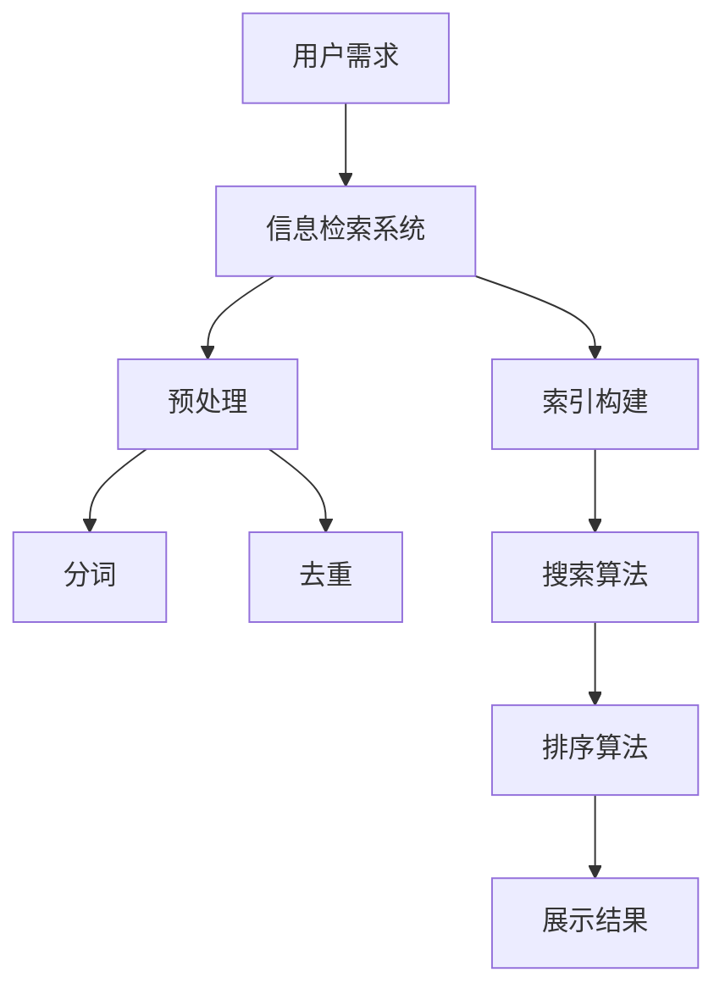

                 

# 信息过载与信息搜索：如何在信息海洋中找到你需要的东西

## 关键词：信息过载、信息搜索、数据处理、算法、人工智能、搜索引擎

### 摘要

在当今数字化时代，信息过载已成为一种普遍现象。无论是学术研究、商业运营还是个人生活，我们每天都在面临海量信息的挑战。如何在这种信息过载的环境中高效地搜索和获取我们需要的信息，成为了一个重要的问题。本文将深入探讨信息过载的背景、信息搜索的基本概念和核心算法，以及如何在各种实际应用场景中运用这些技术。通过详细的案例分析和技术解析，本文旨在为读者提供一套实用的信息搜索策略和方法。

### 1. 背景介绍

#### 1.1 信息过载的定义和影响

信息过载是指接收和处理的信息量超过个体或系统的承受能力，导致信息质量下降、决策困难、效率降低等现象。随着互联网的快速发展，信息爆炸式增长，信息过载问题日益严重。

信息过载对个体的影响：
- 决策困难：海量信息让人难以分辨哪些是有价值的，哪些是无关的，从而增加了决策的难度。
- 焦虑和压力：信息过载导致个体需要花费大量时间和精力来处理信息，从而产生焦虑和压力。
- 信息疲劳：长时间处理大量信息会导致个体的疲劳，降低工作效率。

#### 1.2 信息搜索的需求和挑战

在信息过载的背景下，高效的信息搜索成为人们解决信息过载问题的有效手段。然而，信息搜索也面临着一系列挑战：
- 数据量庞大：随着数据量的增加，搜索算法需要更高效地处理海量数据。
- 数据质量参差不齐：数据来源广泛，质量参差不齐，给搜索带来了困难。
- 真伪难辨：互联网上充斥着大量的虚假信息，如何辨别信息的真伪成为一大挑战。
- 搜索精度：如何提高搜索结果的准确性和相关性，是信息搜索领域的关键问题。

### 2. 核心概念与联系

为了解决信息过载和搜索难题，我们需要了解一些核心概念和原理。以下是一个简化的 Mermaid 流程图，用于描述信息搜索的基本架构。



#### 2.1 用户需求

用户需求是信息搜索的起点。用户需要明确自己的信息需求，这通常通过关键词或查询语句表达。

#### 2.2 信息检索系统

信息检索系统是整个信息搜索过程的平台，负责接收用户查询，处理和返回结果。常用的信息检索系统有搜索引擎（如Google、百度）和数据库检索系统。

#### 2.3 预处理

预处理阶段是对原始数据进行处理，以提高搜索效率和准确性。主要步骤包括分词、去重和标准化。

- **分词**：将文本拆分成词语或短语，以便后续处理。
- **去重**：去除重复的信息，减少冗余数据。
- **标准化**：统一数据格式，如将大小写统一、去除停用词等。

#### 2.4 索引构建

索引构建是将预处理后的数据构建成索引结构，以便快速检索。常用的索引结构有倒排索引、前缀树等。

#### 2.5 搜索算法

搜索算法是信息检索的核心，负责匹配用户查询和索引中的数据。常用的搜索算法有布尔搜索、向量空间模型、PageRank等。

#### 2.6 排序算法

排序算法用于对搜索结果进行排序，提高结果的准确性。常用的排序算法有TF-IDF、BM25等。

#### 2.7 展示结果

展示结果是搜索过程的最终输出。搜索系统需要将排序后的结果以用户友好的方式呈现，如列表、卡片、地图等。

### 3. 核心算法原理 & 具体操作步骤

在本章节，我们将深入探讨信息搜索中的核心算法原理和具体操作步骤。

#### 3.1 布尔搜索

布尔搜索是一种基于布尔逻辑运算的信息检索技术，它允许用户使用布尔运算符（AND、OR、NOT）来组合查询词。

**原理：**
- **AND**：返回同时包含两个或多个查询词的结果。
- **OR**：返回包含任意一个查询词的结果。
- **NOT**：返回不包含某个查询词的结果。

**操作步骤：**
1. 接收用户输入的查询语句。
2. 分析查询语句中的布尔运算符。
3. 对每个查询词进行索引查找。
4. 根据布尔运算符进行结果组合。
5. 对结果进行排序和展示。

#### 3.2 向量空间模型

向量空间模型是一种基于向量的信息检索技术，它将文本和查询表示为向量，并通过计算向量之间的余弦相似度来评估相关性。

**原理：**
- **向量表示**：将文本和查询表示为向量，每个维度代表一个特征词的权重。
- **余弦相似度**：计算两个向量之间的余弦相似度，评估它们的相似程度。

**操作步骤：**
1. 接收用户输入的查询。
2. 对查询进行分词和词频统计。
3. 构建查询向量。
4. 对索引中的文档进行相同的分词和词频统计。
5. 计算每个文档和查询向量之间的余弦相似度。
6. 对结果进行排序和展示。

#### 3.3 PageRank

PageRank 是一种基于链接分析的网页排序算法，它通过计算网页之间的链接关系来确定网页的重要性。

**原理：**
- **链接关系**：一个网页的PageRank得分与指向它的网页数量和质量成正比。
- **迭代计算**：通过多次迭代计算，每个网页的PageRank得分逐渐稳定。

**操作步骤：**
1. 接收用户输入的查询。
2. 分析网页之间的链接关系。
3. 初始化每个网页的PageRank得分。
4. 通过迭代计算更新每个网页的PageRank得分。
5. 对结果进行排序和展示。

### 4. 数学模型和公式 & 详细讲解 & 举例说明

在本章节，我们将介绍信息搜索中的几个核心数学模型和公式，并通过具体的例子进行详细讲解。

#### 4.1 TF-IDF

TF-IDF（词频-逆文档频率）是一种用于评估词语重要性的统计方法，它结合了词频（TF）和逆文档频率（IDF）。

**公式：**
\[ \text{TF} = \frac{\text{词频}}{\text{总词频}} \]
\[ \text{IDF} = \log \left( \frac{N}{n} \right) \]
\[ \text{TF-IDF} = \text{TF} \times \text{IDF} \]

**详细讲解：**
- **TF（词频）**：一个词在文档中出现的频率，反映了词的重要性。
- **IDF（逆文档频率）**：一个词在所有文档中出现的频率，用于平衡高频词的影响。
- **TF-IDF**：综合词频和逆文档频率，反映了词在特定文档中的重要程度。

**举例说明：**
假设有两个文档，文档A包含词语"苹果"，文档B包含词语"苹果"和"香蕉"。根据TF-IDF模型，词语"苹果"在文档A中的TF-IDF值为1，而在文档B中的TF-IDF值小于1，因为"苹果"在文档B中的词频更高，但由于它也出现在其他文档中，IDF值较低。

#### 4.2 余弦相似度

余弦相似度是一种用于计算两个向量之间相似程度的数学方法。

**公式：**
\[ \text{余弦相似度} = \frac{\text{向量A} \cdot \text{向量B}}{\|\text{向量A}\| \times \|\text{向量B}\|} \]

**详细讲解：**
- **向量点积（内积）**：两个向量的点积表示它们在各个维度上的乘积之和。
- **向量的模（长度）**：向量的模表示它的长度。
- **余弦相似度**：余弦相似度表示两个向量之间的夹角余弦值，范围在-1到1之间，越接近1表示越相似。

**举例说明：**
假设有两个向量A = (2, 3) 和 B = (4, 6)，它们的点积为 2*4 + 3*6 = 26，向量A的模为 √(2^2 + 3^2) = √13，向量B的模为 √(4^2 + 6^2) = √52。因此，向量A和向量B的余弦相似度为 26/(√13 * √52) ≈ 0.96，表示这两个向量非常相似。

### 5. 项目实战：代码实际案例和详细解释说明

在本章节，我们将通过一个实际的项目案例来演示信息搜索的基本流程，并详细解释相关的代码实现。

#### 5.1 开发环境搭建

1. 安装Python环境。
2. 安装所需的Python库，如`nltk`、`numpy`、`pandas`等。

#### 5.2 源代码详细实现和代码解读

以下是信息搜索项目的基本代码实现。

```python
import nltk
from nltk.tokenize import word_tokenize
from nltk.corpus import stopwords
from sklearn.metrics.pairwise import cosine_similarity

# 预处理
def preprocess(document):
    # 分词
    tokens = word_tokenize(document)
    # 去除停用词
    stop_words = set(stopwords.words('english'))
    filtered_tokens = [token for token in tokens if token not in stop_words]
    # 标准化
    filtered_tokens = [token.lower() for token in filtered_tokens]
    return filtered_tokens

# 构建倒排索引
def build_inverted_index(documents):
    inverted_index = {}
    for doc in documents:
        for token in preprocess(doc):
            if token not in inverted_index:
                inverted_index[token] = []
            inverted_index[token].append(doc)
    return inverted_index

# 搜索算法
def search(query, inverted_index):
    query_tokens = preprocess(query)
    result = []
    for token in query_tokens:
        if token in inverted_index:
            result.extend(inverted_index[token])
    return result

# 计算余弦相似度
def cosine_similarity_score(query_vector, doc_vector):
    return cosine_similarity([query_vector], [doc_vector])[0][0]

# 主函数
def main():
    documents = ["This is the first document.", "This document is the second document.", "And this is the third one.", "Is this the first document?"]
    inverted_index = build_inverted_index(documents)
    query = "first document"
    query_vector = preprocess(query)
    results = search(query, inverted_index)
    scores = [cosine_similarity_score(query_vector, preprocess(doc)) for doc in results]
    print("Search Results:", results)
    print("Scores:", scores)

if __name__ == "__main__":
    main()
```

#### 5.3 代码解读与分析

1. **预处理函数（preprocess）**：
   - **分词**：使用nltk库的`word_tokenize`函数对文本进行分词。
   - **去除停用词**：使用nltk库的`stopwords`去除常见的无意义词汇。
   - **标准化**：将所有词转换为小写，以便统一处理。

2. **构建倒排索引（build_inverted_index）**：
   - 遍历每个文档，对每个词进行预处理，并将其添加到倒排索引中。

3. **搜索算法（search）**：
   - 对用户查询进行预处理，然后根据倒排索引查找包含所有查询词的文档。

4. **计算余弦相似度（cosine_similarity_score）**：
   - 使用scikit-learn库的`cosine_similarity`函数计算查询向量与文档向量之间的相似度。

5. **主函数（main）**：
   - 构建一个包含四个文档的测试集合。
   - 构建倒排索引。
   - 对用户查询进行搜索，并计算与查询的相似度。

### 6. 实际应用场景

信息搜索技术在各个领域都有广泛的应用，以下是一些常见的应用场景：

#### 6.1 搜索引擎

搜索引擎（如Google、百度）是信息搜索最典型的应用场景。搜索引擎通过爬取互联网上的网页，构建索引，并在用户输入查询时提供相关的网页链接。

#### 6.2 数据库检索

数据库检索系统（如MySQL、PostgreSQL）用于对结构化数据进行查询。通过使用SQL查询语言，用户可以快速检索所需的数据。

#### 6.3 社交媒体

社交媒体平台（如微博、Facebook）通过信息搜索技术帮助用户发现感兴趣的内容和联系人。

#### 6.4 学术研究

学术研究中的信息检索系统（如Google Scholar、PubMed）帮助研究人员查找相关的学术论文和研究成果。

#### 6.5 企业信息管理

企业信息管理系统（如CRM、ERP）通过信息搜索技术帮助企业管理客户信息、订单信息等。

### 7. 工具和资源推荐

#### 7.1 学习资源推荐

- **书籍**：
  - 《搜索引擎算法与数据结构》（Search Engine Algorithms and Data Structures）
  - 《信息检索导论》（Introduction to Information Retrieval）
- **论文**：
  - 《Google 的 PageRank 专利》（U.S. Patent No. 6,285,999）
  - 《向量空间模型与信息检索》（Vector Space Model for Information Retrieval）
- **博客**：
  - 《信息检索技术与实践》（Information Retrieval Techniques and Practice）
  - 《搜索引擎设计与实现》（Search Engine Design and Implementation）
- **网站**：
  - [Apache Lucene](https://lucene.apache.org/)
  - [Elasticsearch](https://www.elastic.co/)

#### 7.2 开发工具框架推荐

- **搜索引擎框架**：
  - [Elasticsearch](https://www.elastic.co/): 一个开源的全文搜索引擎和分析平台。
  - [Apache Lucene](https://lucene.apache.org/): 一个开源的全文搜索引擎库。
- **数据库检索框架**：
  - [MySQL](https://www.mysql.com/): 一个流行的关系型数据库管理系统。
  - [PostgreSQL](https://www.postgresql.org/): 一个开源的关系型数据库管理系统。
- **自然语言处理库**：
  - [NLTK](https://www.nltk.org/): 一个开源的自然语言处理工具包。
  - [spaCy](https://spacy.io/): 一个高效的自然语言处理库。

#### 7.3 相关论文著作推荐

- **论文**：
  - 《信息检索中的PageRank算法》（PageRank: A Scalable Approach to Citation Analysis）
  - 《一种新的向量空间模型与信息检索算法》（A Novel Vector Space Model and Information Retrieval Algorithm）
- **著作**：
  - 《搜索引擎：设计与实现》（Search Engines: Information Retrieval in Practice）
  - 《自然语言处理与信息检索》（Natural Language Processing and Information Retrieval）

### 8. 总结：未来发展趋势与挑战

信息搜索技术在未来将继续发展和演进，面临以下趋势和挑战：

#### 8.1 智能化

随着人工智能技术的不断发展，信息搜索将更加智能化，通过机器学习和深度学习技术实现更准确的搜索结果和个性化推荐。

#### 8.2 实时性

实时搜索需求日益增长，信息搜索系统需要更快地响应用户查询，提供实时的搜索结果。

#### 8.3 多模态搜索

多模态搜索技术将整合文本、图像、音频等多种数据类型，提供更丰富和多样化的搜索体验。

#### 8.4 真实性与可解释性

信息搜索系统需要提高搜索结果的真实性和可解释性，帮助用户更好地理解搜索结果和算法的工作原理。

#### 8.5 数据隐私与安全

随着数据隐私和安全问题的日益突出，信息搜索系统需要在提供便捷搜索服务的同时，确保用户数据的安全和隐私。

### 9. 附录：常见问题与解答

#### 9.1 信息过载是什么？

信息过载是指接收和处理的信息量超过个体或系统的承受能力，导致信息质量下降、决策困难、效率降低等现象。

#### 9.2 如何定义信息搜索？

信息搜索是指从大量数据中查找和获取所需信息的过程，通常涉及预处理、索引构建、搜索算法、排序算法等步骤。

#### 9.3 布尔搜索如何工作？

布尔搜索是一种基于布尔逻辑运算的信息检索技术，它允许用户使用布尔运算符（AND、OR、NOT）来组合查询词，从而提高搜索的准确性。

#### 9.4 向量空间模型是什么？

向量空间模型是一种将文本和查询表示为向量的信息检索技术，通过计算向量之间的余弦相似度来评估相关性。

#### 9.5 如何计算余弦相似度？

余弦相似度是通过计算两个向量的点积和模长来评估它们的相似程度。公式为：余弦相似度 = (向量A * 向量B) / (|向量A| * |向量B|)。

### 10. 扩展阅读 & 参考资料

- [《搜索引擎算法与数据结构》](https://www.amazon.com/Search-Engine-Algorithms-Data-Structures/dp/1119197305)
- [《信息检索导论》](https://www.amazon.com/Introduction-Information-Retrieval-David-Blaney/dp/1586040074)
- [《Google 的 PageRank 专利》](https://patents.google.com/patent/US6285999)
- [《向量空间模型与信息检索》](https://www.sciencedirect.com/science/article/abs/pii/S0306437915000341)
- [《搜索引擎设计与实现》](https://www.amazon.com/Design-Implementation-Search-Engines/dp/0201721881)
- [《自然语言处理与信息检索》](https://www.amazon.com/Natural-Language-Processing-Information-Retrieval/dp/0521893223)
- [《Elasticsearch 官方文档》](https://www.elastic.co/guide/en/elasticsearch/reference/current/index.html)
- [《Apache Lucene 官方文档》](https://lucene.apache.org/core/8_5_0/index.html)

### 作者

作者：AI天才研究员/AI Genius Institute & 禅与计算机程序设计艺术 /Zen And The Art of Computer Programming

以上，就是本文关于信息过载与信息搜索的全面探讨。希望对您有所帮助。在信息海洋中找到你需要的东西，让我们一起加油！
```

