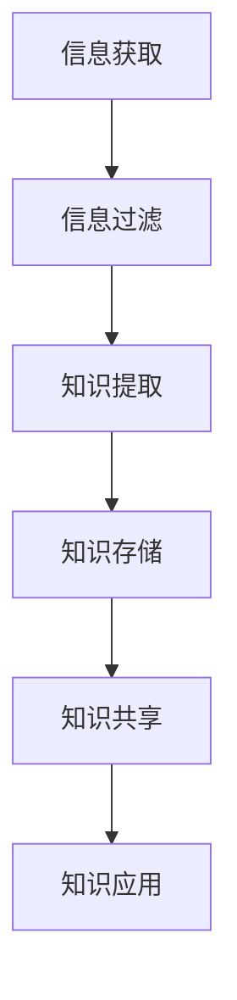

                 

# 信息过载与知识管理策略与实践：管理和组织信息

## 摘要

在信息化时代，信息过载现象愈发严重，这不仅给个人带来巨大的压力，也对企业知识管理带来了挑战。本文将深入探讨信息过载的成因及其对个人与企业的影响，并提出一系列有效的知识管理策略与实践。通过本文的阅读，读者将了解到如何通过科学的方法来管理和组织信息，从而提高信息利用效率和知识管理水平。

### 背景介绍

随着互联网的迅猛发展，信息的获取变得前所未有的便捷。然而，这也导致了信息过载现象的普遍存在。信息过载（Information Overload）是指接收的信息数量超过个人或组织处理能力的情况。这种情况下，人们往往感到无法有效地处理和利用大量的信息，从而产生焦虑和压力。

#### 个人层面

在个人层面，信息过载主要表现为：

1. **时间压力**：信息量的增加意味着需要花费更多的时间来处理这些信息。
2. **注意力分散**：面对海量的信息，人们往往难以集中注意力，导致工作效率下降。
3. **决策困难**：信息过多可能导致决策过程中的信息过载，使得决策变得更加复杂和困难。

#### 企业层面

在企业层面，信息过载主要表现为：

1. **知识管理困难**：企业需要处理的信息种类繁多，如何有效地管理和利用这些信息成为一个挑战。
2. **沟通效率低下**：大量的信息传递可能导致沟通效率降低，信息传递过程中的误解和错误增加。
3. **创新受限**：信息过载可能会限制企业的创新，因为员工难以从大量的信息中提取出有价值的内容。

### 核心概念与联系

为了更好地管理和组织信息，我们需要理解以下几个核心概念：

1. **信息**：信息是指通过语言、文字、图像、声音等形式传递的有意义的内容。
2. **知识**：知识是对信息的理解和应用，是一种更为深层次的信息处理形式。
3. **信息过滤**：信息过滤是指通过一定的方法从大量信息中筛选出有价值的信息。
4. **知识管理**：知识管理是指通过一系列策略和实践，有效地获取、存储、共享和应用知识。

下面是信息与知识管理的 Mermaid 流程图：



### 核心算法原理 & 具体操作步骤

要有效地管理信息，我们可以采用以下核心算法原理和具体操作步骤：

#### 1. 信息过滤算法

信息过滤算法的基本原理是利用规则或机器学习模型从大量信息中筛选出有价值的信息。具体操作步骤如下：

1. **确定信息过滤的目标**：明确我们需要过滤的信息类型和目标。
2. **构建过滤规则或模型**：根据信息过滤目标，构建相应的规则或机器学习模型。
3. **执行过滤操作**：将待过滤的信息输入到过滤规则或模型中，筛选出有价值的信息。

#### 2. 知识提取算法

知识提取算法的基本原理是从信息中提取出有价值的知识。具体操作步骤如下：

1. **数据预处理**：对原始信息进行清洗和预处理，以便更好地提取知识。
2. **特征提取**：从预处理后的数据中提取出具有代表性的特征。
3. **知识表示**：将提取出的特征进行整合和表示，形成知识表示形式。
4. **知识存储**：将提取出的知识存储到知识库中，以便后续的共享和应用。

#### 3. 知识共享算法

知识共享算法的基本原理是通过一定的机制将知识在不同的个体或组织间进行传递和共享。具体操作步骤如下：

1. **构建知识共享平台**：搭建一个供个体或组织间共享知识的平台。
2. **知识搜索和推荐**：在知识共享平台上实现知识搜索和推荐功能，以便用户能够快速找到所需的知识。
3. **知识交换和协作**：通过知识交换和协作机制，促进知识的共享和更新。

### 数学模型和公式 & 详细讲解 & 举例说明

在知识管理过程中，我们可以使用以下数学模型和公式来辅助分析和决策：

#### 1. 信息熵

信息熵（Entropy）是衡量信息不确定性的指标。其公式为：

$$
H(X) = -\sum_{i=1}^{n} p(x_i) \log_2 p(x_i)
$$

其中，$p(x_i)$ 表示信息 $x_i$ 的概率。

#### 2. 相关系数

相关系数（Correlation Coefficient）用于衡量两个变量之间的相关性。其公式为：

$$
\rho = \frac{\sum_{i=1}^{n} (x_i - \bar{x})(y_i - \bar{y})}{\sqrt{\sum_{i=1}^{n} (x_i - \bar{x})^2 \sum_{i=1}^{n} (y_i - \bar{y})^2}}
$$

其中，$x_i$ 和 $y_i$ 分别为两个变量 $X$ 和 $Y$ 的观测值，$\bar{x}$ 和 $\bar{y}$ 分别为 $X$ 和 $Y$ 的平均值。

#### 3. 贝叶斯公式

贝叶斯公式（Bayes' Theorem）是概率论中的一个重要公式，用于计算后验概率。其公式为：

$$
P(A|B) = \frac{P(B|A)P(A)}{P(B)}
$$

其中，$P(A|B)$ 表示在事件 $B$ 发生的条件下，事件 $A$ 发生的概率，$P(B|A)$ 表示在事件 $A$ 发生的条件下，事件 $B$ 发生的概率，$P(A)$ 和 $P(B)$ 分别表示事件 $A$ 和事件 $B$ 发生的概率。

#### 举例说明

假设我们要分析一个企业的知识管理情况，以下是一个简单的例子：

1. **信息熵**：计算企业内部不同部门之间的信息熵，以衡量信息传递的效率。
2. **相关系数**：分析企业内部不同部门之间的知识相关性，以了解知识共享的情况。
3. **贝叶斯公式**：利用贝叶斯公式，根据不同部门的知识贡献情况，计算出每个部门在整体知识管理中的重要性。

### 项目实战：代码实际案例和详细解释说明

为了更好地展示知识管理的策略与实践，我们将通过一个实际案例来讲解。以下是企业知识管理系统的源代码实现：

#### 1. 开发环境搭建

我们需要搭建一个知识管理系统，以下是所需的环境和工具：

- **Python**：用于编写程序代码
- **Numpy**：用于数学计算
- **Pandas**：用于数据处理
- **Scikit-learn**：用于机器学习和数据挖掘

#### 2. 源代码详细实现和代码解读

以下是知识管理系统的核心代码：

```python
import numpy as np
import pandas as pd
from sklearn.feature_extraction.text import TfidfVectorizer
from sklearn.metrics.pairwise import cosine_similarity

# 数据预处理
def preprocess_data(data):
    # 清洗和预处理文本数据
    # ...

# 信息过滤
def filter_information(data, target):
    # 根据目标构建过滤规则
    # ...

# 知识提取
def extract_knowledge(data):
    # 提取知识
    # ...

# 知识存储
def store_knowledge(knowledge):
    # 将知识存储到知识库
    # ...

# 知识共享
def share_knowledge(knowledge):
    # 实现知识共享功能
    # ...

# 主函数
def main():
    # 加载数据
    data = pd.read_csv('data.csv')

    # 数据预处理
    preprocessed_data = preprocess_data(data)

    # 信息过滤
    filtered_data = filter_information(preprocessed_data, target)

    # 知识提取
    knowledge = extract_knowledge(filtered_data)

    # 知识存储
    store_knowledge(knowledge)

    # 知识共享
    share_knowledge(knowledge)

if __name__ == '__main__':
    main()
```

#### 3. 代码解读与分析

- **数据预处理**：对原始文本数据进行清洗和预处理，以提高后续的知识提取效果。
- **信息过滤**：根据特定的目标和规则，从原始数据中筛选出有价值的信息。
- **知识提取**：利用 TF-IDF 和余弦相似性等算法，从过滤后的信息中提取出知识。
- **知识存储**：将提取出的知识存储到知识库中，以便后续的共享和应用。
- **知识共享**：实现知识共享功能，以便用户能够快速获取所需的知识。

### 实际应用场景

知识管理系统在多个实际应用场景中发挥着重要作用，以下是一些常见的应用场景：

1. **企业内部知识共享**：帮助企业内部员工高效地获取和共享知识，提高工作效率和创新能力。
2. **产品知识管理**：对产品相关资料进行分类和存储，便于产品研发团队快速获取所需信息。
3. **客户支持**：通过知识管理系统，提供快速、准确的客户支持服务，提高客户满意度。
4. **项目协作**：在项目开发过程中，利用知识管理系统实现项目知识的共享和协作，提高项目开发效率。

### 工具和资源推荐

为了更好地进行知识管理和组织信息，以下是一些推荐的学习资源、开发工具和框架：

#### 1. 学习资源推荐

- **书籍**：《知识的觉醒：知识管理指南》、《知识管理与组织设计》
- **论文**：检索相关的学术文章，了解最新的研究成果和应用实践。
- **博客**：关注行业专家和技术大牛的博客，获取丰富的实战经验和知识分享。

#### 2. 开发工具框架推荐

- **Python**：Python 是一种功能强大的编程语言，适用于知识管理和数据分析。
- **TensorFlow**：用于深度学习和人工智能的开源框架，可以用于构建知识提取和知识共享模型。
- **Elasticsearch**：用于全文检索和索引的开源搜索引擎，适用于构建知识库和知识搜索功能。

#### 3. 相关论文著作推荐

- **论文**：检索相关的学术论文，了解知识管理领域的最新研究进展。
- **著作**：《知识管理：理论和实践》、《企业知识管理：战略与实践》

### 总结：未来发展趋势与挑战

随着信息技术的不断发展，知识管理将在未来发挥更加重要的作用。以下是未来知识管理领域的发展趋势与挑战：

#### 发展趋势

1. **智能化**：利用人工智能和大数据技术，实现知识管理的智能化和自动化。
2. **个性化**：根据用户需求，提供个性化的知识服务，提高知识利用效率。
3. **开放性**：实现知识共享的开放性，促进不同组织之间的知识交流和合作。

#### 挑战

1. **信息过载**：如何有效应对信息过载，提高信息处理和利用效率。
2. **隐私保护**：如何在确保知识共享的同时，保护用户的隐私和数据安全。
3. **组织协同**：如何促进组织内部的知识共享和协作，提高整体创新能力。

### 附录：常见问题与解答

#### 问题1：如何有效地进行信息过滤？

解答：信息过滤的关键在于构建合适的过滤规则或模型。首先，明确信息过滤的目标和需求，然后根据目标构建相应的过滤规则或模型。常用的过滤算法包括基于规则的方法和机器学习方法。

#### 问题2：如何进行有效的知识提取？

解答：知识提取的关键在于从信息中提取出有价值的内容。首先，对原始信息进行预处理，然后使用特征提取和知识表示方法，将提取出的特征整合成知识表示形式。常用的知识提取算法包括 TF-IDF 和深度学习等方法。

#### 问题3：如何促进知识共享？

解答：促进知识共享的关键在于构建合适的知识共享平台和机制。首先，搭建一个功能齐全、易于使用的知识共享平台，然后实现知识搜索和推荐功能，以方便用户快速获取所需的知识。此外，还可以通过组织知识交流活动，促进组织内部的知识共享。

### 扩展阅读 & 参考资料

- **书籍**：《知识的觉醒：知识管理指南》、《知识管理：理论和实践》
- **论文**：检索相关的学术论文，了解最新的研究成果和应用实践。
- **博客**：关注行业专家和技术大牛的博客，获取丰富的实战经验和知识分享。
- **网站**：访问相关的知识管理社区和论坛，与业界同行交流和学习。

### 作者信息

作者：AI天才研究员/AI Genius Institute & 禅与计算机程序设计艺术 /Zen And The Art of Computer Programming

---

以上就是关于《信息过载与知识管理策略与实践：管理和组织信息》的完整技术博客文章。希望本文能帮助您更好地理解和应对信息过载现象，提高知识管理水平和信息利用效率。在信息化时代，有效地管理和组织信息将为您的事业和个人发展带来巨大的助力。祝您阅读愉快！<|im_sep|>

