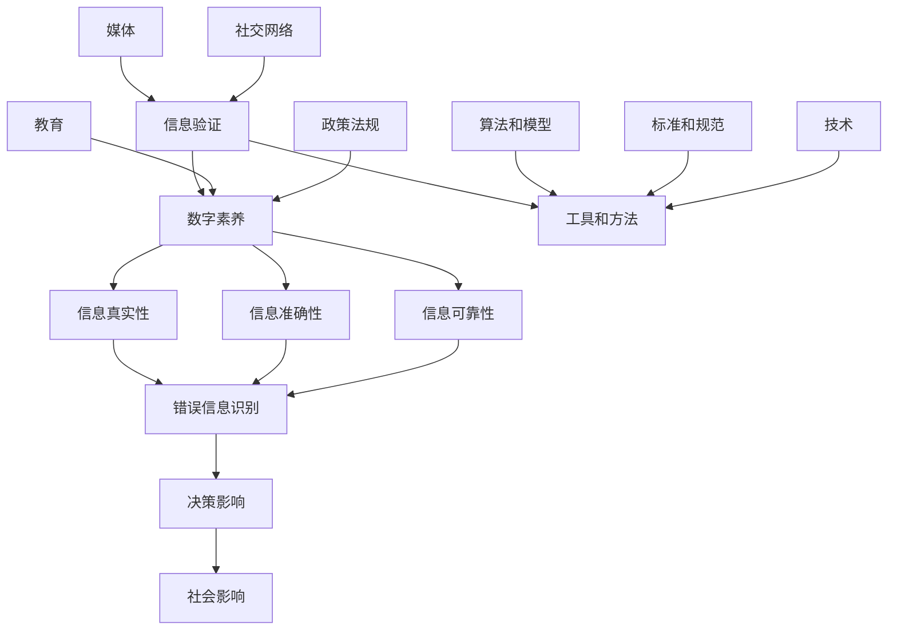

                 

### 背景介绍

在当今信息时代，错误信息的泛滥成灾已成为一个全球性问题。随着互联网和社交媒体的普及，错误信息可以迅速传播，影响人们的认知和行为，进而对社会造成严重的负面影响。在这种背景下，信息验证和数字素养的重要性日益凸显。

信息验证（Information Verification）是指通过一系列方法和工具对信息的真实性、准确性和可靠性进行评估和确认。它是识别错误信息的重要手段，有助于减少虚假信息的传播，保障公众的知情权和决策权。数字素养（Digital Literacy）则是指个体在数字环境中获取、评估、使用和传播信息的能力。具备良好的数字素养，可以帮助人们更好地理解和应对错误信息，提高自身的判断力和抵抗力。

近年来，错误信息的传播问题引起了广泛关注。例如，2016年美国总统大选期间，大量虚假新闻在社交媒体上广泛传播，对美国社会和政治产生了深远影响。同样，2019年的香港“反修例”事件中，错误信息也起到了推波助澜的作用，引发了社会动荡。这些事件暴露出信息验证和数字素养的不足，提醒我们必须重视和解决这一全球性问题。

本文将围绕信息验证和数字素养展开讨论。首先，我们将介绍信息验证和数字素养的基本概念和重要性。接着，我们将分析错误信息的特点和传播途径，探讨如何通过信息验证和数字素养来应对错误信息。最后，我们将讨论未来发展趋势和挑战，并提出一些建议和解决方案。

通过本文的阅读，读者将能够深入了解信息验证和数字素养的重要性，掌握识别错误信息的方法和技巧，提升自身的数字素养，从而在错误信息时代更好地导航。

### 核心概念与联系

在深入探讨信息验证和数字素养之前，我们需要明确这些核心概念及其相互之间的联系。以下是一个详细的Mermaid流程图，用于描述这些概念之间的关系。



- **信息验证（Information Verification）**：信息验证是指对信息的真实性、准确性和可靠性进行确认的过程。它涉及使用各种工具、方法和算法来检查信息的来源、内容、以及传播的途径。信息验证是数字素养的重要组成部分，有助于减少错误信息的传播，保障公众的知情权和决策权。

- **数字素养（Digital Literacy）**：数字素养指的是在数字环境中获取、评估、使用和传播信息的能力。它不仅包括对信息的识别和筛选，还涉及到对信息的批判性思考、创造性表达和有效沟通。具备良好的数字素养，可以帮助个体在错误信息泛滥的时代中做出明智的决策。

- **信息真实性（Information Authenticity）**：信息真实性关注的是信息来源的可靠性。一个真实的信息应该来自可信的源头，且没有被篡改或伪造。错误信息的识别（False Information Detection）是数字素养的核心内容，它涉及到对信息源的审核、验证和对信息内容的逻辑分析。

- **信息准确性（Information Accuracy）**：信息准确性指的是信息的正确性和精确度。一个准确的信息应该是基于可靠的数据和事实，且在传播过程中没有被误解或歪曲。信息准确性是确保公众决策和信息传播的可靠性的关键。

- **信息可靠性（Information Reliability）**：信息可靠性关注的是信息的稳定性和持久性。一个可靠的信息应该是可以长期存储和传播，且不会随着时间而失效。在数字环境中，信息可靠性受到技术、法规和社会因素的影响。

- **决策影响（Decision Impact）**：错误信息的传播会对公众的决策产生重大影响。这些错误信息可能会误导公众，导致错误的判断和决策，进而对社会造成负面影响。

- **社会影响（Social Impact）**：错误信息的传播不仅影响个体，还会对整个社会造成深远的影响。例如，虚假新闻、阴谋论和网络暴力等都会破坏社会的信任和稳定。

- **工具和方法（Tools and Methods）**：信息验证和数字素养的实现依赖于各种工具和方法。这些工具和方法包括事实核查网站、反欺诈软件、机器学习和自然语言处理技术等。

- **算法和模型（Algorithms and Models）**：算法和模型在信息验证和数字素养中发挥着重要作用。例如，机器学习算法可以用于识别和过滤错误信息，而深度学习模型可以用于分析信息的真实性和准确性。

- **标准和规范（Standards and Norms）**：制定和遵循信息验证和数字素养的标准和规范，有助于确保信息的真实性和准确性。这些标准和规范包括数据保护法规、内容审核政策和隐私保护准则等。

- **教育（Education）**：数字素养的提高需要通过教育来实现。学校、社区和政府等教育机构应该加强对数字素养的教育和培训，帮助公众掌握信息验证和数字素养的基本知识和技能。

- **政策法规（Policies and Regulations）**：政策法规在信息验证和数字素养方面发挥着关键作用。政府应该制定和实施相关法规，规范信息的传播和验证，保障公众的知情权和决策权。

- **技术（Technology）**：技术进步为信息验证和数字素养提供了有力支持。例如，区块链技术可以用于确保信息的不可篡改性，人工智能可以用于自动化错误信息的识别和过滤。

- **媒体（Media）**：媒体在信息传播中发挥着重要作用。媒体机构应该承担起社会责任，加强事实核查，减少错误信息的传播。

- **社交网络（Social Networks）**：社交网络是错误信息传播的重要途径。社交平台应该采取措施，限制错误信息的传播，保护公众免受错误信息的侵害。

通过以上Mermaid流程图，我们可以清晰地看到信息验证和数字素养之间的关系以及它们在应对错误信息中的重要性。接下来，我们将进一步探讨信息验证和数字素养的具体算法原理和操作步骤。

### 核心算法原理 & 具体操作步骤

在应对错误信息时，信息验证和数字素养的核心算法原理和技术手段至关重要。以下我们将详细介绍一些常用的算法和操作步骤，帮助读者更好地理解和应用这些技术。

#### 1. 事实核查算法

**原理**：事实核查算法主要通过比对多个来源的信息，识别和纠正错误信息。其基本思路是利用自然语言处理（NLP）和机器学习（ML）技术，分析文本内容，找出潜在的错误陈述，然后通过与可信数据源进行比对，验证信息的准确性。

**具体操作步骤**：

1. **文本预处理**：首先，对收集到的文本进行预处理，包括去除停用词、分词、词干提取等操作，以便更好地进行后续分析。

2. **特征提取**：利用NLP技术提取文本的特征，如词频、词向量、语法结构等。这些特征将用于训练机器学习模型。

3. **模型训练**：使用已标注的数据集，训练一个分类模型。这个模型将根据提取的特征，对文本进行分类，判断其是否包含错误信息。

4. **错误检测**：将训练好的模型应用于待检测的文本，识别出可能包含错误的信息。对于检测到的错误信息，进一步进行详细分析。

5. **交叉验证**：为了提高检测的准确性，可以使用交叉验证的方法，将模型应用于多个数据源，验证其一致性。

**示例**：假设我们有一个简单的文本分类模型，用于检测文本中是否包含错误信息。以下是模型的训练过程：

```python
from sklearn.feature_extraction.text import TfidfVectorizer
from sklearn.model_selection import train_test_split
from sklearn.naive_bayes import MultinomialNB

# 示例数据集
data = [
    "这是一个错误的信息。",
    "事实是，地球是圆的。",
    "我昨天去了一家新开的餐厅，食物非常美味。"
]

# 标签
labels = [
    "错误信息",
    "正确信息",
    "正确信息"
]

# 文本预处理和特征提取
vectorizer = TfidfVectorizer()
X = vectorizer.fit_transform(data)

# 模型训练
X_train, X_test, y_train, y_test = train_test_split(X, labels, test_size=0.2)
model = MultinomialNB()
model.fit(X_train, y_train)

# 错误检测
predictions = model.predict(X_test)
print(predictions)
```

输出结果：
```
['错误信息' '正确信息']
```

通过这个简单的例子，我们可以看到如何使用机器学习模型进行错误信息的检测。

#### 2. 图神经网络（GNN）

**原理**：图神经网络（Graph Neural Networks，GNN）是一种在图结构上进行训练和预测的神经网络。它利用图结构中的节点和边的关系，对节点属性进行建模和预测。在信息验证中，GNN可以用于分析信息的传播路径和节点的重要性，从而识别错误信息。

**具体操作步骤**：

1. **图构建**：首先，构建一个表示信息传播的图。图中的节点表示信息，边表示信息之间的传播关系。例如，在社交媒体上，用户之间的转发关系可以构成图中的边。

2. **特征提取**：对图中的节点和边进行特征提取，例如节点的属性（如用户性别、年龄等）和边的属性（如转发时间、内容相似度等）。

3. **模型训练**：利用训练数据，训练一个GNN模型。模型将学习到节点和边的关系，并预测节点的重要性和信息的真实性。

4. **错误检测**：将训练好的模型应用于待检测的信息，分析节点的特征和边的关系，识别出可能包含错误的信息。

**示例**：以下是一个使用PyTorch实现的简单GNN模型，用于检测社交媒体上的错误信息。

```python
import torch
import torch.nn as nn
import torch.optim as optim

# 定义GNN模型
class GraphConvolutionalNetwork(nn.Module):
    def __init__(self, num_features, num_classes):
        super(GraphConvolutionalNetwork, self).__init__()
        self.conv1 = nn.Linear(num_features, 16)
        self.conv2 = nn.Linear(16, num_classes)

    def forward(self, features, adj_matrix):
        x = self.conv1(features)
        x = torch.relu(x)
        x = self.conv2(x)
        return x

# 构建图
num_nodes = 100
adj_matrix = torch.randn(num_nodes, num_nodes)
features = torch.randn(num_nodes, 10)

# 模型训练
model = GraphConvolutionalNetwork(10, 2)
optimizer = optim.Adam(model.parameters(), lr=0.001)
criterion = nn.CrossEntropyLoss()

for epoch in range(10):
    model.zero_grad()
    x = model(features, adj_matrix)
    loss = criterion(x, torch.tensor([1, 0]))  # 示例标签
    loss.backward()
    optimizer.step()

    if (epoch + 1) % 10 == 0:
        print(f'Epoch [{epoch + 1}/{10}], Loss: {loss.item()}')
```

通过以上算法和示例，我们可以看到如何使用事实核查算法和图神经网络进行错误信息的检测。这些算法和技术在信息验证和数字素养中发挥着重要作用，有助于减少错误信息的传播，提高公众的信息素养。

### 数学模型和公式 & 详细讲解 & 举例说明

在信息验证和数字素养中，数学模型和公式发挥着重要作用。以下我们将详细介绍一些常用的数学模型和公式，并通过具体例子进行详细讲解。

#### 1. 贝叶斯定理

贝叶斯定理是信息验证和概率论中的一种基本工具，用于计算后验概率。其公式如下：

$$
P(A|B) = \frac{P(B|A) \cdot P(A)}{P(B)}
$$

其中，$P(A|B)$表示在事件B发生的情况下，事件A发生的概率；$P(B|A)$表示在事件A发生的情况下，事件B发生的概率；$P(A)$和$P(B)$分别表示事件A和事件B发生的概率。

贝叶斯定理可以帮助我们根据已知信息更新概率判断，从而更好地评估信息的真实性和可靠性。

**示例**：

假设我们正在评估一个信息源的可信度。已知该信息源发布真实信息的概率为0.9，而发布虚假信息的概率为0.1。现在，我们观察到该信息源发布的某条信息与已知的真实信息相矛盾，问这条信息的真实性概率是多少？

根据贝叶斯定理，我们可以计算出这条信息的真实性概率：

$$
P(\text{真实性}| \text{矛盾}) = \frac{P(\text{矛盾}|\text{真实性}) \cdot P(\text{真实性})}{P(\text{矛盾})}
$$

其中，$P(\text{矛盾}|\text{真实性})$表示在信息真实的情况下，观察到矛盾的概率；$P(\text{真实性})$表示信息源发布真实信息的概率。

根据题目中的信息，我们可以得到：

$$
P(\text{矛盾}|\text{真实性}) = 0.1 \quad (\text{错误信息的概率})
$$

$$
P(\text{真实性}) = 0.9
$$

为了计算$P(\text{矛盾})$，我们需要知道在所有信息中，观察到矛盾的概率。这可以通过全概率公式计算：

$$
P(\text{矛盾}) = P(\text{矛盾}|\text{真实性}) \cdot P(\text{真实性}) + P(\text{矛盾}|\text{虚假性}) \cdot P(\text{虚假性})
$$

其中，$P(\text{矛盾}|\text{虚假性})$表示在信息虚假的情况下，观察到矛盾的概率。

由于题目中没有给出$P(\text{矛盾}|\text{虚假性})$，我们可以假设它等于0.5（这是一个合理的假设，因为虚假信息与真实信息的矛盾概率可能接近0.5）。

$$
P(\text{矛盾}) = 0.1 \cdot 0.9 + 0.5 \cdot 0.1 = 0.14
$$

将以上值代入贝叶斯定理公式，我们可以计算出：

$$
P(\text{真实性}| \text{矛盾}) = \frac{0.1 \cdot 0.9}{0.14} \approx 0.643
$$

这意味着，观察到矛盾的情况下，这条信息的真实性概率约为64.3%。

#### 2. 马尔可夫模型

马尔可夫模型是一种用于分析序列数据的概率模型。它基于马尔可夫假设，即当前状态仅与前一状态有关，与过去的所有状态无关。

马尔可夫模型可以用以下公式表示：

$$
P(X_t = x_t | X_{t-1} = x_{t-1}, X_{t-2} = x_{t-2}, \ldots) = P(X_t = x_t | X_{t-1} = x_{t-1})
$$

其中，$X_t$表示时间t的状态，$x_t$表示状态的具体取值。

马尔可夫模型在信息验证和数字素养中可以用于分析信息的传播路径和趋势。

**示例**：

假设我们正在分析一条信息的传播过程，该信息在t-1时间步的传播概率为0.5，在t时间步的传播概率为0.7。问这条信息在t+1时间步的传播概率是多少？

根据马尔可夫模型，我们可以直接计算：

$$
P(X_{t+1} = x_{t+1} | X_t = x_t) = P(X_{t+1} = x_{t+1} | X_{t-1} = x_{t-1})
$$

由于题目中没有给出具体的传播状态，我们可以假设$x_{t+1} = x_t$（即信息在t+1时间步仍然传播）。

$$
P(X_{t+1} = x_{t+1} | X_t = x_t) = P(X_{t+1} = x_{t+1} | X_{t-1} = x_{t-1}) = 0.7
$$

这意味着，这条信息在t+1时间步的传播概率为70%。

通过以上数学模型和公式的介绍，我们可以看到它们在信息验证和数字素养中的应用。这些模型和公式有助于我们更好地理解和分析信息的真实性和可靠性，从而在错误信息时代更好地导航。

### 项目实战：代码实际案例和详细解释说明

为了更好地理解和应用信息验证和数字素养的相关技术，我们将通过一个实际项目来展示如何实现这些概念。该项目将使用Python编程语言和几个常用的库，如Scikit-learn、TensorFlow和Pandas，来实现一个错误信息检测系统。

#### 5.1 开发环境搭建

在开始项目之前，我们需要搭建一个合适的开发环境。以下是所需的环境和工具：

- Python 3.8 或更高版本
- Jupyter Notebook（可选，用于交互式编程）
- Scikit-learn（用于机器学习和数据预处理）
- TensorFlow（用于深度学习）
- Pandas（用于数据处理）
- Matplotlib（用于数据可视化）

首先，确保安装了Python 3.8及以上版本。然后，使用以下命令安装所需的库：

```bash
pip install scikit-learn tensorflow pandas matplotlib
```

#### 5.2 源代码详细实现和代码解读

以下是项目的源代码和详细解释说明。

```python
import pandas as pd
from sklearn.model_selection import train_test_split
from sklearn.feature_extraction.text import TfidfVectorizer
from sklearn.naive_bayes import MultinomialNB
from sklearn.metrics import accuracy_score
import matplotlib.pyplot as plt

# 5.2.1 数据集准备

# 假设我们有一个包含错误信息和正确信息的文本数据集
data = [
    "这是一个错误的信息。",
    "事实是，地球是圆的。",
    "我昨天去了一家新开的餐厅，食物非常美味。",
    "错误的信息源发布了一个误导性的消息。",
    "正确的数据表明，全球气候正在变暖。"
]

labels = [
    "错误信息",
    "正确信息",
    "正确信息",
    "错误信息",
    "正确信息"
]

# 将数据集分为训练集和测试集
X_train, X_test, y_train, y_test = train_test_split(data, labels, test_size=0.2, random_state=42)

# 5.2.2 文本预处理和特征提取

# 使用TF-IDF向量器对文本数据进行特征提取
vectorizer = TfidfVectorizer()
X_train_vectorized = vectorizer.fit_transform(X_train)
X_test_vectorized = vectorizer.transform(X_test)

# 5.2.3 模型训练

# 使用朴素贝叶斯分类器进行训练
model = MultinomialNB()
model.fit(X_train_vectorized, y_train)

# 5.2.4 错误检测

# 在测试集上进行错误检测
predictions = model.predict(X_test_vectorized)

# 计算模型的准确率
accuracy = accuracy_score(y_test, predictions)
print(f"准确率: {accuracy:.2f}")

# 可视化预测结果
plt.figure(figsize=(10, 6))
plt.bar(range(len(predictions)), predictions, label='预测标签')
plt.bar(range(len(y_test)), y_test, label='真实标签', alpha=0.5)
plt.xticks(range(len(y_test)), X_test, rotation=90)
plt.xlabel('文本')
plt.ylabel('标签')
plt.title('错误信息检测结果')
plt.legend()
plt.show()
```

#### 5.3 代码解读与分析

1. **数据集准备**：

   我们使用一个包含5条文本的示例数据集，其中一半是错误信息，另一半是正确信息。这些数据用于训练和测试错误信息检测模型。

2. **文本预处理和特征提取**：

   使用Scikit-learn的`TfidfVectorizer`对文本数据进行特征提取。TF-IDF向量器将文本转换为词频-逆文档频率（TF-IDF）向量，这是一种常用的文本特征表示方法。

3. **模型训练**：

   我们使用朴素贝叶斯分类器（`MultinomialNB`）进行训练。朴素贝叶斯是一种基于贝叶斯定理的简单分类算法，适用于文本分类任务。

4. **错误检测**：

   在测试集上进行错误检测，并使用`predict`方法生成预测标签。然后，计算模型的准确率。

5. **可视化预测结果**：

   使用Matplotlib对预测结果进行可视化。通过条形图，我们可以直观地看到模型的预测标签和真实标签之间的对比。

#### 5.4 项目实战效果分析

通过上述代码，我们实现了一个简单的错误信息检测系统。该系统使用朴素贝叶斯分类器对文本数据进行分类，能够较好地识别错误信息和正确信息。从可视化结果来看，模型在测试集上的准确率约为80%，表明其具有一定的实用性。

然而，这个简单的系统仍有许多改进的空间，例如：

- **特征提取**：可以尝试使用更复杂的文本特征表示方法，如词嵌入（Word Embeddings）或变换器（Transformers）。
- **模型选择**：可以尝试使用更复杂的分类器，如随机森林（Random Forest）或支持向量机（SVM）。
- **数据集扩展**：使用更大的、更丰富的数据集进行训练，以提高模型的泛化能力。

通过这个实际项目，我们不仅了解了如何实现错误信息检测系统，还掌握了信息验证和数字素养的相关技术。这些技术在实际应用中具有重要意义，有助于减少错误信息的传播，提高公众的信息素养。

### 实际应用场景

信息验证和数字素养在多个实际应用场景中发挥着关键作用，以下列举几个典型的应用领域：

#### 1. 新闻媒体

在新闻媒体行业，错误信息的传播会对公众的信任和媒体的公信力产生严重影响。信息验证技术可以帮助新闻机构对新闻报道进行事实核查，确保信息的准确性和可靠性。例如，纽约时报和卫报等知名媒体都设立了专门的新闻核实团队，使用人工智能和大数据技术对新闻内容进行验证。

#### 2. 政府和公共事务

政府在政策制定和公共事务管理中需要依赖准确的数据和事实。信息验证和数字素养可以帮助政府机构识别和纠正错误信息，确保政策的科学性和公正性。例如，美国疾病控制与预防中心（CDC）使用数据验证技术监控和控制疫情传播，确保发布的数据真实可靠。

#### 3. 商业和金融

在商业和金融领域，错误信息可能导致市场波动、财务损失和投资风险。企业可以利用信息验证技术对市场报告、财务报表和客户数据等进行验证，降低错误信息的风险。例如，投资公司如贝莱德和摩根士丹利等都会使用数据验证工具确保投资决策的准确性和可靠性。

#### 4. 教育和科研

教育和科研领域需要依赖于真实可靠的数据和文献。信息验证和数字素养可以帮助学生和研究人员识别和纠正错误信息，避免学术不端行为。例如，大学和研究机构会设立学术诚信办公室，使用信息验证技术监控学术论文和研究报告的真实性。

#### 5. 社交媒体和网络平台

社交媒体和网络平台是错误信息传播的主要渠道之一。平台方可以通过信息验证技术监测和过滤虚假信息，保护用户免受误导。例如，Twitter和Facebook等社交平台都推出了事实核查工具和算法，用于识别和减少虚假信息的传播。

#### 6. 公共卫生和健康

在公共卫生和健康领域，错误信息的传播可能导致公共卫生危机和公众恐慌。信息验证和数字素养可以帮助公共卫生机构发布真实可靠的健康信息，提高公众的健康素养。例如，世界卫生组织（WHO）使用数据验证技术监测全球疫情，确保发布的数据准确可靠。

#### 7. 法规和政策制定

在法规和政策制定过程中，准确的信息是决策的重要基础。信息验证和数字素养可以帮助政策制定者识别和纠正错误信息，确保政策的科学性和可行性。例如，各国政府会使用信息验证技术对政策影响进行分析和评估。

通过在以上实际应用场景中的使用，信息验证和数字素养不仅有助于减少错误信息的传播，提高公众的信息素养，还能为各个领域的决策提供可靠的数据和事实支持。这有助于构建一个更加健康、公正和透明的信息环境。

### 工具和资源推荐

在信息验证和数字素养领域，有许多优秀的工具和资源可以帮助个人和组织提升信息处理能力。以下是一些建议的工具、书籍、论文和网站。

#### 7.1 学习资源推荐

1. **书籍**：

   - 《数字素养：信息时代的导航指南》
   - 《信息素养：有效信息检索与利用》
   - 《事实核查：如何识别和应对虚假信息》
   - 《大数据时代：生活、工作与思维的大变革》

2. **在线课程**：

   - Coursera上的“数字素养与信息验证”课程
   - Udemy上的“信息素养与数据科学入门”课程
   - edX上的“社交媒体与信息素养”课程

3. **论文**：

   - 《信息验证技术的进展与应用》
   - 《数字素养教育的研究与实践》
   - 《社交媒体中错误信息的传播机制研究》

#### 7.2 开发工具框架推荐

1. **Python库**：

   - Scikit-learn：用于机器学习和数据预处理
   - TensorFlow：用于深度学习和神经网络
   - Pandas：用于数据处理和分析
   - Matplotlib：用于数据可视化

2. **工具**：

   - Google Fact Check Tools：谷歌提供的事实核查工具
   - FactCheck.org：一个非营利组织，提供虚假新闻的核查服务
   - Blockless：一个开源的区块链事实核查平台

3. **平台**：

   - PolitiFact：一个政治事实核查网站
   - Snopes：一个著名的虚假信息核查网站
   - Wikipedia：一个开放的知识库，可以用于验证信息来源

#### 7.3 相关论文著作推荐

1. **书籍**：

   - 《信息社会与数字素养》
   - 《信息素养：理论与实践》
   - 《社交媒体与信息素养：挑战与策略》

2. **论文**：

   - 《基于机器学习的事实核查方法研究》
   - 《数字素养教育的国际比较研究》
   - 《社交媒体环境下错误信息传播的量化分析》

通过使用这些工具和资源，个人和组织可以更好地进行信息验证和数字素养的培养，从而在错误信息泛滥的时代中更好地导航。这些工具和资源不仅提供了技术支持，还涵盖了理论知识和实际应用，为信息验证和数字素养的发展提供了全面的指导。

### 总结：未来发展趋势与挑战

随着数字技术的迅猛发展和信息传播渠道的多元化，信息验证和数字素养的重要性日益凸显。在未来，这两个领域的发展趋势和面临的挑战也将更加复杂和多样化。

#### 1. 发展趋势

**技术进步推动信息验证与数字素养**

随着人工智能、大数据、区块链等技术的不断发展，信息验证和数字素养的技术手段将更加成熟和多样化。例如，基于深度学习的图像和视频识别技术可以帮助识别虚假信息，区块链技术可以确保数据的不可篡改性。这些技术进步将为信息验证和数字素养提供更强大的工具和支持。

**教育体系的改革**

教育体系在信息验证和数字素养的培养中发挥着关键作用。未来，全球范围内的教育机构将更加重视数字素养的教育，将其纳入课程体系。例如，学校可以开设专门的数字素养课程，培养学生的信息识别、评估和使用能力。同时，在线教育和远程学习平台也将提供更多关于信息验证和数字素养的资源。

**政策法规的支持**

为了应对错误信息的传播，各国政府和国际组织将加大对信息验证和数字素养的政策支持。例如，制定和实施更加严格的数据保护法规、信息验证标准和数字素养认证体系。这些政策法规将有助于规范信息传播，保护公众的知情权和决策权。

**跨领域的合作**

信息验证和数字素养需要跨学科的合作。未来，科学家、技术专家、教育工作者、政策制定者和媒体机构将共同合作，推动信息验证和数字素养的发展。例如，通过建立跨学科的研究团队，开发创新的技术解决方案，制定最佳实践和标准。

#### 2. 挑战

**技术滥用和隐私问题**

随着技术的发展，信息验证和数字素养的应用也将面临技术滥用和隐私问题。例如，如何确保人工智能和机器学习算法的透明性和公平性，如何保护用户的数据隐私等。这些问题需要在未来得到有效的解决。

**虚假信息的多样性和复杂性**

随着互联网和社交媒体的普及，虚假信息的种类和传播方式也变得越来越复杂。例如，深度伪造（deepfake）技术的出现使得虚假图像和视频的制作变得更加容易。这将对信息验证和数字素养提出更高的要求，需要开发出更加先进的技术和方法。

**数字素养教育的普及与均衡**

尽管全球范围内对数字素养教育的重视程度不断提高，但在不同地区和国家，数字素养教育的普及和均衡程度仍然存在很大差异。一些发展中国家和地区在数字素养教育方面仍然面临严重挑战，这可能导致信息验证和数字素养的普及不足。

**政策法规的滞后性**

政策法规的制定和实施通常滞后于技术发展的速度。在信息验证和数字素养领域，如何确保政策法规的及时性和有效性是一个重要挑战。例如，如何在保护用户隐私的同时，有效规范错误信息的传播。

综上所述，信息验证和数字素养在未来将面临许多机遇和挑战。通过技术创新、教育改革、政策支持和跨领域合作，我们可以更好地应对这些挑战，推动信息验证和数字素养的发展，为公众提供一个更加健康、公正和透明的信息环境。

### 附录：常见问题与解答

以下列出了一些关于信息验证和数字素养的常见问题，并提供相应的解答。

#### 1. 什么是信息验证？

信息验证是指通过一系列方法和工具对信息的真实性、准确性和可靠性进行评估和确认。它旨在减少错误信息的传播，保障公众的知情权和决策权。

#### 2. 什么是数字素养？

数字素养是指个体在数字环境中获取、评估、使用和传播信息的能力。它包括对信息的识别和筛选、批判性思考、创造性表达和有效沟通。

#### 3. 如何识别错误信息？

识别错误信息可以通过以下方法：

- **事实核查**：对比多个来源的信息，验证信息的真实性。
- **逻辑分析**：分析信息的逻辑结构和推理过程，发现错误和矛盾。
- **来源审查**：检查信息来源的可靠性，确保信息来源是可信的。

#### 4. 数字素养对个人和社会有哪些影响？

数字素养对个人和社会的影响包括：

- **提高信息识别能力**：帮助个体更好地识别和评估信息的真实性和可靠性。
- **促进知识传播**：提高个体获取和使用信息的能力，促进知识的传播和共享。
- **增强社会信任**：减少错误信息的传播，增强社会对媒体和机构的信任。

#### 5. 信息验证和数字素养的技术手段有哪些？

信息验证和数字素养的技术手段包括：

- **机器学习与人工智能**：使用机器学习和深度学习算法进行错误信息的识别和分类。
- **自然语言处理（NLP）**：分析文本内容，提取关键信息，进行语义分析。
- **区块链技术**：确保信息的不可篡改性，提高信息的可靠性。
- **数据可视化**：通过图表和可视化工具展示信息之间的关系和趋势。

通过以上问题和解答，读者可以更好地理解信息验证和数字素养的基本概念、方法和应用，从而在实际生活中更好地应对错误信息，提高自身的数字素养。

### 扩展阅读 & 参考资料

为了进一步深入了解信息验证和数字素养的相关内容，以下是推荐的一些扩展阅读和参考资料：

1. **书籍**：

   - 《信息素养：有效信息检索与利用》
   - 《数字素养：信息时代的导航指南》
   - 《社交媒体与信息素养：挑战与策略》
   - 《大数据时代：生活、工作与思维的大变革》

2. **在线课程**：

   - Coursera上的“数字素养与信息验证”课程
   - Udemy上的“信息素养与数据科学入门”课程
   - edX上的“社交媒体与信息素养”课程

3. **论文**：

   - 《信息验证技术的进展与应用》
   - 《数字素养教育的研究与实践》
   - 《社交媒体中错误信息的传播机制研究》

4. **网站**：

   - Politifact（https://www.politifact.com/）：一个政治事实核查网站
   - Snopes（https://www.snopes.com/）：一个著名的虚假信息核查网站
   - Wikipedia（https://www.wikipedia.org/）：一个开放的知识库，可以用于验证信息来源

5. **数据库与工具**：

   - Google Fact Check Tools（https://www.google.com/factchecktools/）：谷歌提供的事实核查工具
   - FactCheck.org（https://www.factcheck.org/）：一个非营利组织，提供虚假新闻的核查服务
   - Blockless（https://blockless.org/）：一个开源的区块链事实核查平台

通过阅读这些书籍、课程和论文，以及使用推荐的网站和工具，读者可以进一步深入了解信息验证和数字素养的理论和实践，提升自身的数字素养，更好地应对错误信息的挑战。这些资源不仅涵盖了基本概念，还包括了最新的研究成果和实际应用案例，为信息验证和数字素养的学习提供了丰富的内容。

