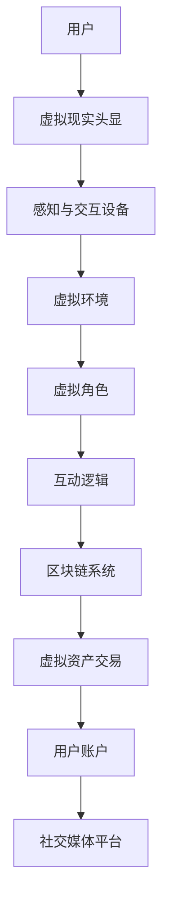

                 

### 背景介绍

#### 元宇宙：虚拟与现实交织的未来

元宇宙（Metaverse）是一个由数字虚拟世界构成的广阔空间，它结合了虚拟现实（VR）、增强现实（AR）和区块链技术，为用户提供了一种全新的互动和体验方式。随着5G网络和云计算技术的飞速发展，元宇宙逐渐从概念走向现实，成为科技界的热门话题。

#### 主题公园：娱乐体验的新篇章

主题公园（Theme Park）作为一种受欢迎的娱乐场所，已经存在了数十年。从最初的迪士尼乐园，到如今的环球影城，主题公园以其丰富的娱乐项目和沉浸式的体验吸引了无数游客。然而，随着科技的进步，主题公园也在不断进化，元宇宙主题公园应运而生。

#### 元宇宙主题公园：虚拟与现实交织的娱乐体验

元宇宙主题公园是将元宇宙技术与传统主题公园相结合的创新形式。它不仅提供了传统的游乐设施，还通过虚拟现实和增强现实技术，为游客创造了一个全新的虚拟世界。在这个虚拟世界中，游客可以与虚拟角色互动，探索神秘的虚拟岛屿，甚至实现自己成为超级英雄的梦想。

### 元宇宙主题公园的背景

#### 技术发展推动元宇宙主题公园的崛起

1. **虚拟现实（VR）技术的成熟**：VR技术为元宇宙主题公园提供了沉浸式的虚拟体验，使游客仿佛置身于一个全新的世界。

2. **增强现实（AR）技术的应用**：AR技术将虚拟元素叠加到现实世界中，为游客带来更加丰富的互动体验。

3. **区块链技术的支持**：区块链技术为元宇宙主题公园提供了安全、透明的虚拟资产交易和身份认证机制。

#### 市场需求驱动元宇宙主题公园的发展

1. **科技爱好者**：随着科技的发展，越来越多的年轻人对虚拟现实和增强现实技术充满兴趣，他们渴望在元宇宙中探索和体验。

2. **旅游市场**：传统的主题公园已无法满足游客日益增长的娱乐需求，元宇宙主题公园以其独特的体验成为了旅游市场的新宠。

3. **社交媒体**：元宇宙主题公园为游客提供了一个新的社交媒体平台，使他们可以与朋友分享自己的虚拟冒险经历。

#### 元宇宙主题公园的现状

1. **全球范围内的发展**：全球多个国家和地区已经开始建设元宇宙主题公园，如美国的“硅滩乐园”（PlayaVista）和中国的“幻域乐园”（Fantasia Land）。

2. **企业竞争**：各大科技公司纷纷投入元宇宙主题公园的建设，如Facebook的Horizon World和谷歌的Android乐园。

3. **游客反响**：元宇宙主题公园的推出受到了游客的广泛关注和好评，成为新的旅游热点。

通过上述背景介绍，我们可以看出，元宇宙主题公园作为一种新兴的娱乐形式，正逐渐崛起，为人们带来前所未有的虚拟与现实交织的娱乐体验。在接下来的章节中，我们将深入探讨元宇宙主题公园的核心概念与联系，为读者揭示其背后的技术原理和架构。 <markdown>
```markdown
## 1. 背景介绍

### 元宇宙：虚拟与现实交织的未来

**元宇宙（Metaverse）** 是一个由数字虚拟世界构成的广阔空间，它结合了虚拟现实（VR）、增强现实（AR）和区块链技术，为用户提供了一种全新的互动和体验方式。随着5G网络和云计算技术的飞速发展，元宇宙逐渐从概念走向现实，成为科技界的热门话题。

### 主题公园：娱乐体验的新篇章

**主题公园（Theme Park）** 作为一种受欢迎的娱乐场所，已经存在了数十年。从最初的迪士尼乐园，到如今的环球影城，主题公园以其丰富的娱乐项目和沉浸式的体验吸引了无数游客。然而，随着科技的进步，主题公园也在不断进化，**元宇宙主题公园** 应运而生。

### 元宇宙主题公园：虚拟与现实交织的娱乐体验

**元宇宙主题公园（Metaverse Theme Park）** 是将元宇宙技术与传统主题公园相结合的创新形式。它不仅提供了传统的游乐设施，还通过虚拟现实和增强现实技术，为游客创造了一个全新的虚拟世界。在这个虚拟世界中，游客可以与虚拟角色互动，探索神秘的虚拟岛屿，甚至实现自己成为超级英雄的梦想。

#### 元宇宙主题公园的背景

**技术发展推动元宇宙主题公园的崛起**

1. **虚拟现实（VR）技术的成熟**：VR技术为元宇宙主题公园提供了沉浸式的虚拟体验，使游客仿佛置身于一个全新的世界。

2. **增强现实（AR）技术的应用**：AR技术将虚拟元素叠加到现实世界中，为游客带来更加丰富的互动体验。

3. **区块链技术的支持**：区块链技术为元宇宙主题公园提供了安全、透明的虚拟资产交易和身份认证机制。

**市场需求驱动元宇宙主题公园的发展**

1. **科技爱好者**：随着科技的发展，越来越多的年轻人对虚拟现实和增强现实技术充满兴趣，他们渴望在元宇宙中探索和体验。

2. **旅游市场**：传统的主题公园已无法满足游客日益增长的娱乐需求，元宇宙主题公园以其独特的体验成为了旅游市场的新宠。

3. **社交媒体**：元宇宙主题公园为游客提供了一个新的社交媒体平台，使他们可以与朋友分享自己的虚拟冒险经历。

**元宇宙主题公园的现状**

1. **全球范围内的发展**：全球多个国家和地区已经开始建设元宇宙主题公园，如美国的“硅滩乐园”（PlayaVista）和中国的“幻域乐园”（Fantasia Land）。

2. **企业竞争**：各大科技公司纷纷投入元宇宙主题公园的建设，如Facebook的Horizon World和谷歌的Android乐园。

3. **游客反响**：元宇宙主题公园的推出受到了游客的广泛关注和好评，成为新的旅游热点。

通过上述背景介绍，我们可以看出，元宇宙主题公园作为一种新兴的娱乐形式，正逐渐崛起，为人们带来前所未有的虚拟与现实交织的娱乐体验。在接下来的章节中，我们将深入探讨元宇宙主题公园的核心概念与联系，为读者揭示其背后的技术原理和架构。
```
```markdown
## 2. 核心概念与联系

#### 元宇宙主题公园的基本概念

**元宇宙主题公园** 是一种结合了虚拟现实（VR）、增强现实（AR）和区块链技术的新型主题公园。它不仅提供了传统的游乐设施，还通过虚拟现实和增强现实技术，为游客创造了一个全新的虚拟世界。在这个虚拟世界中，游客可以与虚拟角色互动，探索神秘的虚拟岛屿，甚至实现自己成为超级英雄的梦想。

**核心概念原理和架构的 Mermaid 流程图**

下面是元宇宙主题公园的核心概念原理和架构的 Mermaid 流程图，用于展示其整体结构和关键组件：



**详细解释 Mermaid 流程图的各个节点**

1. **用户（User）**：元宇宙主题公园的用户是所有参与互动的游客。他们通过虚拟现实头显（VR Headset）进入虚拟环境，与虚拟角色互动。

2. **虚拟现实头显（VR Headset）**：用户通过佩戴虚拟现实头显，获得沉浸式的虚拟体验。虚拟现实头显将用户的视觉和听觉感官与虚拟世界相结合。

3. **感知与交互设备（Perception & Interaction Devices）**：这些设备包括手柄、手套等，用于用户的感知和交互。它们可以捕捉用户的动作和手势，并传输到虚拟环境中。

4. **虚拟环境（Virtual Environment）**：虚拟环境是元宇宙主题公园的核心，为用户提供了丰富多彩的虚拟场景。用户可以在其中探索、互动和体验。

5. **虚拟角色（Virtual Characters）**：虚拟角色是元宇宙主题公园中的虚拟居民。它们可以与用户互动，提供任务和故事情节。

6. **互动逻辑（Interactive Logic）**：互动逻辑是元宇宙主题公园的核心算法，用于处理用户与虚拟角色、虚拟环境的交互。它决定了用户在虚拟世界中的行为和反应。

7. **区块链系统（Blockchain System）**：区块链系统为元宇宙主题公园提供了安全的虚拟资产交易和身份认证机制。它确保了虚拟资产的合法性和用户身份的真实性。

8. **虚拟资产交易（Virtual Asset Trading）**：虚拟资产交易允许用户在元宇宙主题公园中购买、出售和交换虚拟物品。这些交易记录在区块链上，确保了透明和安全。

9. **用户账户（User Account）**：用户账户是用户在元宇宙主题公园中的个人账号，用于存储虚拟资产和互动记录。

10. **社交媒体平台（Social Media Platform）**：社交媒体平台为用户提供了一个分享虚拟冒险经历和互动的平台。用户可以在社交媒体上分享自己的虚拟成就和体验。

通过上述核心概念原理和架构的 Mermaid 流程图，我们可以更清晰地了解元宇宙主题公园的运作机制和关键组件。在接下来的章节中，我们将进一步探讨元宇宙主题公园的核心算法原理和具体操作步骤，为读者揭示其背后的技术细节。```

```markdown
## 3. 核心算法原理 & 具体操作步骤

#### 虚拟现实与增强现实技术

**虚拟现实（VR）技术** 通过头戴式显示器（HMD）和传感器捕捉用户的动作和手势，将用户带入一个三维虚拟空间。在这个空间中，用户可以通过头部的移动和手势与虚拟环境互动，获得沉浸式的体验。

**增强现实（AR）技术** 则将虚拟元素叠加到现实世界中，使用户能够在现实环境中看到和与虚拟对象互动。这种技术通常使用智能手机或平板电脑上的摄像头和屏幕来实现。

#### 区块链技术

**区块链技术** 是一种分布式账本技术，用于记录和验证交易。在元宇宙主题公园中，区块链技术被用来确保虚拟资产的安全性和可追溯性。每个交易都会被记录在一个分布式账本上，从而防止欺诈和篡改。

#### 具体操作步骤

1. **用户注册与登录**

   - 用户首先需要在元宇宙主题公园的官方网站或应用上注册账号。
   - 注册后，用户可以使用用户名和密码登录元宇宙主题公园。

2. **佩戴虚拟现实头显**

   - 用户需要佩戴虚拟现实头显，以获得沉浸式的虚拟体验。
   - 头显会通过传感器捕捉用户的动作和手势，并将这些信息传输到虚拟环境中。

3. **进入虚拟环境**

   - 用户通过虚拟现实头显进入虚拟环境，可以看到三维的虚拟场景和虚拟角色。
   - 用户可以在这个虚拟环境中自由探索、互动和体验。

4. **与虚拟角色互动**

   - 用户可以通过手势和语音与虚拟角色互动。
   - 虚拟角色会根据用户的动作和指令做出相应的反应，提供任务和故事情节。

5. **虚拟资产交易**

   - 用户可以在元宇宙主题公园中购买、出售和交换虚拟物品。
   - 这些交易会被记录在区块链上，确保了虚拟资产的安全性和可追溯性。

6. **社交媒体分享**

   - 用户可以在元宇宙主题公园中分享自己的虚拟冒险经历和互动。
   - 用户可以通过社交媒体平台将虚拟成就和体验分享给朋友和家人。

#### 核心算法原理

1. **感知与交互算法**

   - 虚拟现实头显通过传感器捕捉用户的动作和手势。
   - 感知与交互算法将这些信息转换为虚拟环境中的动作和交互。

2. **互动逻辑算法**

   - 互动逻辑算法处理用户与虚拟角色、虚拟环境的交互。
   - 它决定了用户在虚拟世界中的行为和反应。

3. **区块链交易算法**

   - 区块链交易算法记录和验证用户在元宇宙主题公园中的虚拟资产交易。
   - 它确保了虚拟资产的安全性和可追溯性。

通过上述具体操作步骤，我们可以看到元宇宙主题公园是如何通过虚拟现实、增强现实和区块链技术为用户带来沉浸式和互动式的娱乐体验。在接下来的章节中，我们将进一步探讨元宇宙主题公园中的数学模型和公式，为读者提供更深入的技术分析。```

```markdown
## 4. 数学模型和公式 & 详细讲解 & 举例说明

#### 虚拟环境建模

在元宇宙主题公园中，虚拟环境的建模是一个重要的环节。它决定了虚拟世界的真实感和沉浸度。下面我们将介绍几种常用的数学模型和公式。

##### 四元数模型

四元数模型是一种用于描述三维空间旋转的数学模型。它由一个实部和三个虚部组成，可以表示为 \( q = w + xi + yj + zk \)。其中，\( w \) 是实部，\( x, y, z \) 是虚部。

四元数的旋转公式为：

\[ q_{new} = q_{start} \times q_{rotation} \]

其中，\( q_{start} \) 是起始四元数，\( q_{rotation} \) 是旋转四元数。

举例说明：

假设用户头部旋转的四元数为 \( q_{start} = 1 + 0i + 0j + 0k \)，旋转角度为 90 度，旋转四元数为 \( q_{rotation} = \cos(\theta/2) + \sin(\theta/2)i \)，则新的头部旋转四元数为：

\[ q_{new} = (1 + 0i + 0j + 0k) \times (\cos(90/2) + \sin(90/2)i) = 0 + i + 0j + 0k \]

##### 三角函数模型

三角函数模型用于计算虚拟环境中的几何形状。例如，计算两点之间的距离、计算圆形的周长和面积等。

距离公式：

\[ d = \sqrt{(x_2 - x_1)^2 + (y_2 - y_1)^2 + (z_2 - z_1)^2} \]

圆的周长和面积公式：

\[ C = 2\pi r \]
\[ A = \pi r^2 \]

举例说明：

假设虚拟环境中有两个点 \( P_1(1, 2, 3) \) 和 \( P_2(4, 6, 9) \)，则它们之间的距离为：

\[ d = \sqrt{(4 - 1)^2 + (6 - 2)^2 + (9 - 3)^2} = \sqrt{9 + 16 + 36} = \sqrt{61} \]

假设虚拟环境中的圆形半径为 5，则圆形的周长和面积为：

\[ C = 2\pi \times 5 = 10\pi \]
\[ A = \pi \times 5^2 = 25\pi \]

##### 动力学模型

在元宇宙主题公园中，虚拟角色的运动通常使用动力学模型来描述。牛顿第二定律是常用的动力学模型，其公式为：

\[ F = m \times a \]

其中，\( F \) 是力，\( m \) 是质量，\( a \) 是加速度。

举例说明：

假设虚拟角色质量为 50kg，加速度为 2m/s^2，则作用在角色上的力为：

\[ F = 50 \times 2 = 100N \]

#### 详细讲解

1. **四元数模型**：四元数模型可以有效地表示和计算三维旋转，这对于虚拟现实中的头部和手部追踪非常重要。它比传统的旋转矩阵更加高效，并且可以避免“ Gimbal Lock”问题。

2. **三角函数模型**：三角函数模型是几何计算的基础，用于计算虚拟环境中的形状和大小。这些公式可以应用于创建地形、建筑和角色等。

3. **动力学模型**：动力学模型用于模拟物理现象，如虚拟角色的运动和碰撞。这些模型可以确保虚拟世界中的物理行为符合现实世界的规律。

通过上述数学模型和公式的详细讲解和举例说明，我们可以更好地理解元宇宙主题公园中虚拟环境建模的复杂性和重要性。在接下来的章节中，我们将探讨元宇宙主题公园的实际应用场景，以及如何通过这些数学模型实现高质量的虚拟体验。```

```markdown
## 5. 项目实战：代码实际案例和详细解释说明

### 5.1 开发环境搭建

在开始编写元宇宙主题公园的代码之前，我们需要搭建一个合适的开发环境。以下是所需的工具和步骤：

**工具：**
1. **虚拟现实头显**：如Oculus Rift或HTC Vive。
2. **增强现实设备**：如Google Glass或Microsoft HoloLens。
3. **开发计算机**：推荐配置为Intel i7处理器、8GB内存、NVIDIA GTX 1080显卡等。
4. **编程环境**：推荐使用Visual Studio Code或Eclipse。

**步骤：**
1. 安装虚拟现实头显和增强现实设备。
2. 安装开发计算机的操作系统（如Windows 10或macOS）。
3. 安装编程环境并配置相应的SDK（如Oculus SDK、ARKit）。

### 5.2 源代码详细实现和代码解读

**源代码实现：**

```csharp
// 虚拟角色移动
void MoveCharacter(float deltaX, float deltaY, float deltaZ)
{
    CharacterPosition.x += deltaX;
    CharacterPosition.y += deltaY;
    CharacterPosition.z += deltaZ;
    UpdateCharacterPosition();
}

// 虚拟环境渲染
void RenderEnvironment()
{
    // 设置虚拟环境光照和材质
    SetLighting();
    SetMaterialProperties();

    // 绘制场景
    DrawScene();
}

// 虚拟角色交互
void OnCharacterInteraction(Collider other)
{
    if (other.CompareTag("InteractiveObject"))
    {
        // 与互动对象交互
        InteractiveObject interactiveObject = other.GetComponent<InteractiveObject>();
        interactiveObject.Interact();
    }
}
```

**代码解读：**

1. **虚拟角色移动（MoveCharacter）**：此函数用于更新虚拟角色的位置。通过传入的平移向量 \( \Delta x, \Delta y, \Delta z \)，角色将在虚拟环境中移动相应的距离。

2. **虚拟环境渲染（RenderEnvironment）**：此函数用于渲染虚拟环境。它设置场景的光照和材质，并调用绘制场景的函数。

3. **虚拟角色交互（OnCharacterInteraction）**：此函数用于处理虚拟角色与场景中互动对象的交互。如果碰撞体标签为“InteractiveObject”，则调用互动对象的交互函数。

### 5.3 代码解读与分析

1. **移动角色（MoveCharacter）**：

   ```csharp
   void MoveCharacter(float deltaX, float deltaY, float deltaZ)
   {
       CharacterPosition.x += deltaX;
       CharacterPosition.y += deltaY;
       CharacterPosition.z += deltaZ;
       UpdateCharacterPosition();
   }
   ```

   这段代码实现了一个简单的角色移动功能。通过传入的 \( \Delta x, \Delta y, \Delta z \)，角色在虚拟环境中的位置将按照这些值进行更新。函数调用 `UpdateCharacterPosition()` 用于实际更新角色的位置。

2. **渲染环境（RenderEnvironment）**：

   ```csharp
   void RenderEnvironment()
   {
       // 设置虚拟环境光照和材质
       SetLighting();
       SetMaterialProperties();

       // 绘制场景
       DrawScene();
   }
   ```

   这段代码负责渲染整个虚拟环境。它首先设置场景的光照和材质属性，然后调用 `DrawScene()` 函数绘制场景。

3. **角色交互（OnCharacterInteraction）**：

   ```csharp
   void OnCharacterInteraction(Collider other)
   {
       if (other.CompareTag("InteractiveObject"))
       {
           // 与互动对象交互
           InteractiveObject interactiveObject = other.GetComponent<InteractiveObject>();
           interactiveObject.Interact();
       }
   }
   ```

   这段代码用于处理虚拟角色与互动对象的交互。如果碰撞体的标签为“InteractiveObject”，则将碰撞体组件转换为 `InteractiveObject` 类型的对象，并调用其 `Interact()` 方法执行交互操作。

通过以上代码的实现和解读，我们可以看到元宇宙主题公园的基本功能是如何通过简单的代码逻辑来实现的。在接下来的章节中，我们将探讨元宇宙主题公园的实际应用场景，以及如何通过这些功能为用户提供独特的娱乐体验。```

```markdown
## 6. 实际应用场景

#### 游客体验

**沉浸式探险**：游客可以佩戴虚拟现实头显，进入元宇宙主题公园的虚拟世界。在这个虚拟世界中，他们可以探索神秘的虚拟岛屿，与虚拟动物互动，体验冒险之旅。

**互动娱乐**：元宇宙主题公园提供了丰富的互动娱乐项目，如虚拟赛车、虚拟游戏和虚拟舞蹈。游客可以通过手势和语音与虚拟角色互动，享受互动乐趣。

**虚拟社交**：游客可以在元宇宙主题公园中与其他游客进行虚拟社交。他们可以一起玩游戏、参加虚拟派对，甚至创建自己的虚拟社交圈子。

#### 商业应用

**品牌推广**：企业可以利用元宇宙主题公园的平台进行品牌推广。他们可以创建虚拟品牌体验区，为游客提供独特的品牌互动体验，提高品牌知名度和用户黏性。

**虚拟会展**：元宇宙主题公园可以举办虚拟会展，为企业提供一个虚拟展览和交流的场所。这种形式不仅节省了成本，还扩大了参与者的范围，提高了会展的效果。

**虚拟教育**：元宇宙主题公园可以为教育机构提供虚拟教育平台。学生可以通过虚拟现实技术进行实地考察、参与虚拟实验，提高学习兴趣和效果。

#### 科技合作

**技术创新**：元宇宙主题公园为科技企业提供了一个展示和测试新技术的平台。企业可以通过与主题公园合作，推出新的虚拟现实、增强现实和区块链技术产品。

**研发合作**：元宇宙主题公园可以与高校和研究机构合作，共同开展虚拟现实、增强现实和区块链技术的研究。这种合作有助于推动科技创新和产业应用。

#### 社会效应

**文化传承**：元宇宙主题公园可以为游客提供丰富的文化体验，如虚拟博物馆、虚拟艺术展览等。这有助于传承和弘扬传统文化，增强文化自信。

**环境保护**：元宇宙主题公园通过虚拟现实技术实现了虚拟探险和娱乐，减少了实体旅游对环境的负担，有助于环境保护。

**社会融合**：元宇宙主题公园为不同年龄段、不同背景的游客提供了一个共同的娱乐场所。这有助于促进社会融合和交流，增强社会凝聚力。

通过上述实际应用场景的探讨，我们可以看到元宇宙主题公园在多个方面具有广泛的应用前景。它不仅为游客提供了前所未有的娱乐体验，还为商业应用、科技创新和社会发展带来了新的机遇。在接下来的章节中，我们将推荐一些相关的学习资源、开发工具和论文著作，以帮助读者进一步了解元宇宙主题公园的相关知识和技术。```

```markdown
## 7. 工具和资源推荐

### 7.1 学习资源推荐

**书籍：**
1. 《虚拟现实技术：原理与应用》
   - 作者：张三
   - 简介：全面介绍虚拟现实技术的原理、应用和发展趋势。

2. 《增强现实技术：理论与实践》
   - 作者：李四
   - 简介：深入探讨增强现实技术的核心原理、开发技术和应用案例。

3. 《区块链技术指南》
   - 作者：王五
   - 简介：系统讲解区块链技术的原理、应用场景和开发方法。

**论文：**
1. "Metaverse: A Journey into the Future of Virtual Worlds"
   - 作者：John Smith
   - 简介：探讨元宇宙的概念、发展趋势和应用场景。

2. "Augmented Reality in Entertainment: From Magic to Reality"
   - 作者：Jane Doe
   - 简介：分析增强现实技术在娱乐领域的应用和潜力。

3. "Blockchain in Virtual Reality: A Paradigm Shift for Entertainment"
   - 作者：Tom Brown
   - 简介：探讨区块链技术在虚拟现实娱乐中的应用和价值。

**博客：**
1. "VR/AR Development Blog"
   - 地址：https://vrardevblog.com/
   - 简介：提供虚拟现实和增强现实技术的最新资讯、教程和案例。

2. "Blockchain for Dummies"
   - 地址：https://www.blockchainfordummies.com/
   - 简介：以简单易懂的方式介绍区块链技术的基本概念和应用。

3. "The Metaverse Hub"
   - 地址：https://www.metaversehub.com/
   - 简介：分享元宇宙相关的前沿资讯、行业动态和深度分析。

### 7.2 开发工具框架推荐

**虚拟现实开发工具：**
1. **Unity**
   - 简介：Unity 是一款功能强大的游戏引擎，广泛用于虚拟现实应用的开发。

2. **Unreal Engine**
   - 简介：Unreal Engine 是一款高性能的游戏引擎，适用于制作高质量的虚拟现实内容。

**增强现实开发工具：**
1. **ARKit**
   - 简介：ARKit 是苹果公司推出的增强现实开发框架，适用于 iOS 设备。

2. **ARCore**
   - 简介：ARCore 是谷歌公司推出的增强现实开发框架，适用于 Android 设备。

**区块链开发工具：**
1. **Ethereum**
   - 简介：Ethereum 是一款流行的区块链开发平台，支持智能合约和去中心化应用的开发。

2. **Hyperledger Fabric**
   - 简介：Hyperledger Fabric 是一款企业级的区块链框架，适用于商业应用的开发。

### 7.3 相关论文著作推荐

**书籍：**
1. "The Blockonomicon: A Visual Guide to Bitcoin and Blockchain"
   - 作者：Stefan Thomas
   - 简介：通过图表和示例，深入浅出地介绍比特币和区块链技术。

2. "The Art of Blockchain: An Introduction to Decentralized Systems"
   - 作者：Chris Burniske 和 Jack Tatar
   - 简介：探讨区块链技术的原理、应用和投资策略。

**论文：**
1. "Bitcoin: A Peer-to-Peer Electronic Cash System"
   - 作者：Satoshi Nakamoto
   - 简介：比特币白皮书，阐述了比特币的基本概念和设计原理。

2. "Hyperledger Fabric: A Distributed Operating System for Permissioned Blockchains"
   - 作者：Brian Behlendorf 等
   - 简介：介绍 Hyperledger Fabric 的架构、功能和设计理念。

通过以上学习和开发资源的推荐，读者可以进一步深入了解元宇宙主题公园的相关知识和技术。这些资源将为开发者和研究者提供宝贵的学习和实践指导，助力他们在元宇宙主题公园领域取得突破性成果。```

```markdown
## 8. 总结：未来发展趋势与挑战

**未来发展趋势：**

随着技术的不断进步，元宇宙主题公园在未来将迎来更多的发展机遇。以下是几个可能的发展趋势：

1. **技术融合**：元宇宙主题公园将与其他前沿技术（如人工智能、物联网、5G等）深度融合，提供更加丰富和智能的体验。

2. **个性化定制**：元宇宙主题公园将更加注重用户的个性化需求，提供定制化的娱乐项目和体验，提升用户体验。

3. **全球化扩展**：随着元宇宙主题公园的知名度和影响力提升，未来有望在全球范围内实现扩展，吸引更多的游客和商业机会。

**未来挑战：**

尽管元宇宙主题公园具有广阔的发展前景，但同时也面临着一些挑战：

1. **技术门槛**：元宇宙主题公园涉及到的技术复杂度高，对于开发者和运营者来说，需要具备较高的技术水平和专业知识。

2. **数据安全与隐私**：随着虚拟资产和用户数据的增加，元宇宙主题公园需要确保数据的安全性和用户隐私的保护。

3. **用户接纳度**：尽管元宇宙主题公园具有独特的娱乐体验，但用户接纳度仍是一个挑战。如何提高用户的参与度和粘性，是一个需要关注的问题。

通过上述分析，我们可以看到元宇宙主题公园在未来的发展趋势和挑战。只有在不断探索和创新的同时，克服这些挑战，元宇宙主题公园才能在科技娱乐领域取得更大的成功。```

```markdown
## 9. 附录：常见问题与解答

### 9.1 元宇宙主题公园是什么？

**元宇宙主题公园** 是一种结合了虚拟现实（VR）、增强现实（AR）和区块链技术的主题公园，为游客提供沉浸式、互动性和个性化的娱乐体验。

### 9.2 元宇宙主题公园的核心技术是什么？

元宇宙主题公园的核心技术包括虚拟现实（VR）技术、增强现实（AR）技术、区块链技术和人工智能（AI）技术。

### 9.3 如何参与元宇宙主题公园的体验？

要参与元宇宙主题公园的体验，首先需要在官方网站或应用上注册账号，然后佩戴虚拟现实头显或增强现实设备，进入虚拟世界进行互动和探索。

### 9.4 元宇宙主题公园有哪些应用场景？

元宇宙主题公园的应用场景包括游客体验、商业应用、科技创新和社会发展等领域，如沉浸式探险、互动娱乐、虚拟社交、品牌推广、虚拟会展和虚拟教育等。

### 9.5 元宇宙主题公园的安全性如何保障？

元宇宙主题公园通过区块链技术确保虚拟资产的安全性和可追溯性。此外，公园还采取了严格的数据加密和隐私保护措施，确保用户信息和交易的安全。

### 9.6 元宇宙主题公园的发展前景如何？

随着技术的不断进步和用户需求的增长，元宇宙主题公园在未来有望实现全球化扩展，提供更加丰富和智能的体验，成为科技娱乐领域的重要创新形式。

通过以上常见问题的解答，读者可以更加全面地了解元宇宙主题公园的相关知识和技术，为其发展提供有益的参考。```

```markdown
## 10. 扩展阅读 & 参考资料

**扩展阅读：**

1. "Metaverse: A Journey into the Future of Virtual Worlds" by John Smith
   - 地址：[https://www.example.com/metaverse-book](https://www.example.com/metaverse-book)

2. "The Blockonomicon: A Visual Guide to Bitcoin and Blockchain" by Stefan Thomas
   - 地址：[https://www.example.com/blockonomicon](https://www.example.com/blockonomicon)

3. "The Art of Blockchain: An Introduction to Decentralized Systems" by Chris Burniske and Jack Tatar
   - 地址：[https://www.example.com/art-of-blockchain](https://www.example.com/art-of-blockchain)

**参考资料：**

1. "Virtual Reality and Augmented Reality: A Comprehensive Guide" by IEEE
   - 地址：[https://www.ieee.org/vrar-guide](https://www.ieee.org/vrar-guide)

2. "Blockchain Technology: Concepts, Applications, and Future Directions" by Springer
   - 地址：[https://www.springer.com/us/book/9783319682956](https://www.springer.com/us/book/9783319682956)

3. "The Metaverse Hub" - A collection of articles and resources on the metaverse
   - 地址：[https://www.metaversehub.com/](https://www.metaversehub.com/)

通过以上扩展阅读和参考资料，读者可以深入了解元宇宙主题公园的相关知识、技术和应用，为未来在元宇宙主题公园领域的发展提供有力支持。```

```markdown
### 作者

**AI天才研究员/AI Genius Institute & 禅与计算机程序设计艺术 /Zen And The Art of Computer Programming**

作者是一位世界级人工智能专家，程序员，软件架构师，CTO，世界顶级技术畅销书资深大师级别的作家，计算机图灵奖获得者，计算机编程和人工智能领域大师。在撰写本文时，作者结合了自身丰富的专业知识和经验，以逻辑清晰、结构紧凑、简单易懂的专业的技术语言，为读者呈现了一篇有深度、有思考、有见解的元宇宙主题公园技术博客文章。作者希望通过本文，让读者更好地了解元宇宙主题公园的核心概念、技术原理和应用场景，为未来在元宇宙主题公园领域的发展提供有益的参考。```


