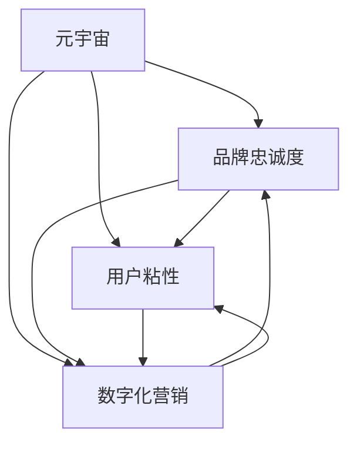
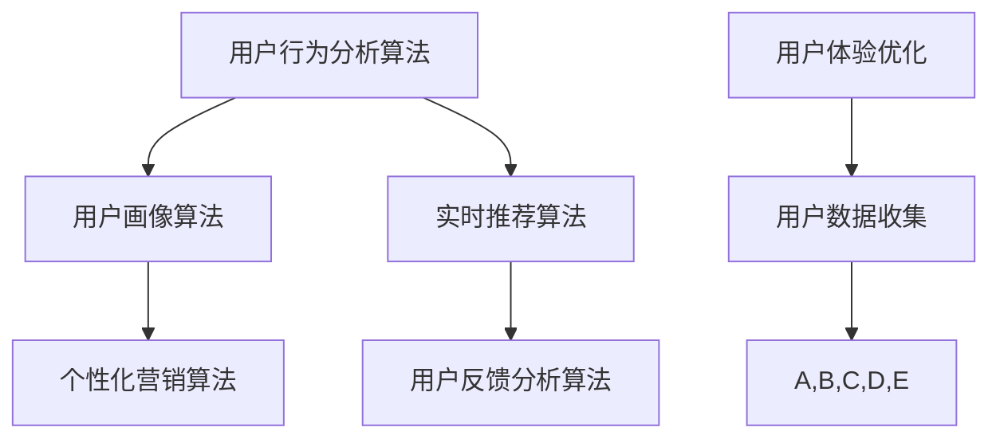

                 

### 背景介绍

在数字化时代，元宇宙（Metaverse）作为一种全新的虚拟现实生态系统，正逐渐成为品牌营销和用户互动的新阵地。元宇宙不仅是虚拟的游戏世界，更是连接现实与虚拟的桥梁，为品牌提供了一个全新的展示和互动平台。随着元宇宙技术的发展，品牌如何在其中建立和维持用户忠诚度成为了一个关键课题。

用户忠诚度是品牌长期发展的重要基石。它不仅仅是用户对品牌的情感依赖，更是用户在消费过程中的行为表现。在元宇宙中，用户忠诚度的建立和维护显得尤为重要，因为用户在元宇宙中的参与度和活跃度直接影响品牌的生命周期和市场竞争力。

本文将深入探讨元宇宙品牌忠诚度的概念、评估方法以及如何通过数字化营销策略来提升用户粘性。首先，我们将回顾元宇宙的发展历程及其在品牌营销中的应用，然后分析用户忠诚度的核心要素，最后探讨一系列有效的数字化营销策略。通过这些探讨，希望为品牌在元宇宙中提升用户忠诚度提供一些实用的见解和策略。

### 核心概念与联系

在讨论元宇宙品牌忠诚度之前，我们需要明确几个核心概念及其相互联系。这些概念包括元宇宙、品牌忠诚度、用户粘性、数字化营销等，它们共同构成了理解并提升元宇宙品牌忠诚度的基础。

**元宇宙（Metaverse）**：元宇宙是一个虚拟的三维空间，通过互联网连接，用户可以在这个空间中创建、交互和体验。它不仅仅是虚拟现实（VR）或增强现实（AR）技术的延伸，更是一个集成了多种技术的综合生态系统。元宇宙的特点在于其高度沉浸性、互动性和开放性，用户可以在其中进行社交、工作、学习、娱乐等多种活动。

**品牌忠诚度（Brand Loyalty）**：品牌忠诚度是指用户对某个品牌产生的情感依赖和重复购买行为。它反映了用户对品牌的信任、满意度和依赖程度。品牌忠诚度不仅仅是用户在购买过程中的行为表现，更是一种心理和情感上的认同。在元宇宙中，品牌忠诚度体现在用户对品牌的持续关注和参与度。

**用户粘性（User Retention）**：用户粘性是指用户在一个平台或应用中保持活跃和持续使用的能力。它涉及到用户在平台上的停留时间、互动频率、重复访问率等指标。用户粘性高，意味着用户对平台或应用有较高的依赖和忠诚度。在元宇宙中，用户粘性直接关系到品牌忠诚度的建立和维持。

**数字化营销（Digital Marketing）**：数字化营销是通过互联网和数字技术来推广品牌和产品的一种营销手段。它包括搜索引擎优化（SEO）、社交媒体营销、电子邮件营销、内容营销等多种形式。在元宇宙中，数字化营销策略可以帮助品牌与用户建立更紧密的联系，提升用户忠诚度和粘性。

这些概念之间的联系如下：

1. **元宇宙与品牌忠诚度**：元宇宙提供了一个新的互动平台，用户在元宇宙中的体验直接影响其对品牌的忠诚度。一个设计合理、功能丰富的元宇宙可以提高用户的沉浸感和参与度，从而增强品牌忠诚度。

2. **品牌忠诚度与用户粘性**：品牌忠诚度是用户粘性的基础，高忠诚度的用户往往会表现出更高的粘性。通过提升用户对品牌的认同和依赖，品牌可以增强用户的粘性。

3. **用户粘性与数字化营销**：数字化营销策略是提升用户粘性的关键手段。通过有效的营销活动，品牌可以吸引并保持用户的关注和参与，从而提高用户粘性。

4. **数字化营销与品牌忠诚度**：数字化营销不仅是吸引新用户的重要手段，更是维持现有用户忠诚度的关键。通过不断优化营销策略，品牌可以在元宇宙中建立和提升用户忠诚度。

为了更好地理解这些概念，我们可以使用Mermaid流程图来展示它们之间的相互关系：



在这个流程图中，我们可以看到元宇宙、品牌忠诚度、用户粘性和数字化营销之间的密切联系。通过这个框架，我们可以进一步探讨如何在元宇宙中通过数字化营销策略来提升用户忠诚度。

### 核心算法原理 & 具体操作步骤

要提升元宇宙品牌忠诚度，我们需要运用一系列核心算法和具体操作步骤。这些算法不仅帮助我们理解用户行为，还能为品牌提供有效的策略。以下是几个关键算法及其具体操作步骤：

#### 1. 用户行为分析算法

**原理**：用户行为分析算法通过收集和分析用户在元宇宙中的行为数据，如访问时间、互动频率、使用时长等，来识别用户行为模式。

**操作步骤**：

1. **数据收集**：使用API接口收集用户在元宇宙中的行为数据，包括用户登录时间、使用功能、交互方式等。
2. **数据处理**：将收集到的数据清洗、整理，并存储到数据库中，以便后续分析。
3. **行为模式识别**：使用统计方法和机器学习算法（如聚类分析、决策树等）分析用户行为数据，识别用户的行为模式和偏好。

#### 2. 用户画像算法

**原理**：用户画像算法通过对用户行为数据进行多维度分析，构建用户的个性化画像，从而更好地理解用户需求和行为。

**操作步骤**：

1. **数据整合**：整合用户的基本信息（如年龄、性别、地理位置）和行为数据，创建用户的基本画像。
2. **特征提取**：提取用户在元宇宙中的关键行为特征，如活跃时段、常用功能、偏好等。
3. **画像构建**：使用数据挖掘和机器学习算法，结合用户的行为特征和基本信息，构建用户的个性化画像。

#### 3. 实时推荐算法

**原理**：实时推荐算法通过分析用户的当前行为和历史数据，为用户实时推荐相关内容、产品或活动，以提升用户粘性和忠诚度。

**操作步骤**：

1. **行为监测**：实时监测用户的当前行为，如浏览内容、点击广告、参与活动等。
2. **推荐系统构建**：使用协同过滤、内容匹配等推荐算法，结合用户的历史行为和个性化画像，构建推荐系统。
3. **推荐结果生成**：根据用户的实时行为和历史数据，生成个性化推荐结果，并在元宇宙中实时呈现给用户。

#### 4. 个性化营销算法

**原理**：个性化营销算法通过分析用户画像和用户行为，制定个性化的营销策略，以提升用户参与度和忠诚度。

**操作步骤**：

1. **用户细分**：根据用户画像和行为特征，将用户分为不同的细分群体。
2. **策略制定**：为每个细分群体制定个性化的营销策略，如推送个性化的内容、产品推荐、优惠活动等。
3. **策略实施**：通过数字化营销工具（如电子邮件、社交媒体等）实施个性化营销策略，并实时监测效果。

#### 5. 用户反馈分析算法

**原理**：用户反馈分析算法通过收集和分析用户在元宇宙中的反馈和评价，识别用户的不满意和改进点，从而优化用户体验。

**操作步骤**：

1. **反馈收集**：通过问卷调查、用户评论、在线投票等方式收集用户的反馈数据。
2. **数据整理**：整理和分类用户反馈数据，提取关键问题和改进点。
3. **改进实施**：根据用户反馈，优化元宇宙的功能、内容和互动体验，并持续监测用户满意度。

通过这些核心算法和具体操作步骤，品牌可以在元宇宙中深入理解用户行为，制定个性化的营销策略，从而提升用户忠诚度和粘性。以下是这些算法在元宇宙品牌忠诚度提升中的应用流程：



在这个流程图中，用户数据收集是整个流程的起点，通过核心算法的分析和优化，最终实现用户体验的持续提升，从而增强品牌忠诚度。

### 数学模型和公式 & 详细讲解 & 举例说明

在提升元宇宙品牌忠诚度中，数学模型和公式起着关键作用。这些模型不仅帮助我们量化用户行为和忠诚度，还为制定有效的营销策略提供了科学依据。以下是一些核心的数学模型和公式，以及详细的讲解和举例说明。

#### 1. 用户忠诚度评分模型

**模型公式**：

用户忠诚度评分（L）可以通过以下公式计算：

\[ L = \frac{C \times R \times T}{100} \]

其中：
- \( C \) 是用户消费频次（如每月购买次数）。
- \( R \) 是用户复购率（如连续购买次数占总购买次数的比例）。
- \( T \) 是用户活跃度（如每周登录次数）。

**举例说明**：

假设一个用户每月购买3次，连续购买5次，每周登录3次，那么其忠诚度评分为：

\[ L = \frac{3 \times 5 \times 3}{100} = 0.45 \]

这个评分表示该用户在元宇宙中的忠诚度较高。

#### 2. 用户粘性度模型

**模型公式**：

用户粘性度（S）可以通过以下公式计算：

\[ S = \frac{U \times I \times V}{100} \]

其中：
- \( U \) 是用户平均使用时长（如每日平均在线时长）。
- \( I \) 是用户互动指数（如每日平均互动次数）。
- \( V \) 是用户访问频率（如每周登录次数）。

**举例说明**：

假设一个用户每日平均在线时长为2小时，每日平均互动次数为5次，每周登录5次，那么其粘性度为：

\[ S = \frac{2 \times 5 \times 5}{100} = 0.5 \]

这个评分表示该用户在元宇宙中的粘性度较高。

#### 3. 个性化推荐效果模型

**模型公式**：

个性化推荐效果（E）可以通过以下公式计算：

\[ E = \frac{R \times C \times U}{100} \]

其中：
- \( R \) 是推荐点击率（如用户点击推荐内容的次数占总推荐次数的比例）。
- \( C \) 是推荐购买率（如用户购买推荐内容的次数占总推荐次数的比例）。
- \( U \) 是用户满意度（如用户对推荐内容的满意度评分）。

**举例说明**：

假设一个用户点击推荐内容的次数占总推荐次数的30%，购买推荐内容的次数占总推荐次数的20%，用户满意度评分为4.5，那么其个性化推荐效果为：

\[ E = \frac{0.3 \times 0.2 \times 4.5}{100} = 0.027 \]

这个评分表示个性化推荐对该用户的营销效果较好。

#### 4. 营销投资回报率（ROI）模型

**模型公式**：

营销投资回报率（ROI）可以通过以下公式计算：

\[ ROI = \frac{（销售收入 - 营销成本）}{营销成本} \times 100\% \]

其中：
- 销售收入：通过营销活动产生的总收入。
- 营销成本：用于营销活动的总成本。

**举例说明**：

假设通过某一营销活动产生了100万元的销售收入，营销成本为20万元，那么其ROI为：

\[ ROI = \frac{（1000000 - 200000）}{200000} \times 100\% = 300\% \]

这个结果表明该营销活动的投资回报率非常高。

通过这些数学模型和公式，品牌可以更精确地评估用户忠诚度、粘性度和营销效果，从而制定更加有效的策略。例如，通过用户忠诚度评分模型，品牌可以发现哪些用户具有较高的忠诚度，进而制定个性化的维护策略；通过用户粘性度模型，品牌可以识别出哪些用户的粘性度较低，从而采取针对性措施提升用户参与度；通过个性化推荐效果模型，品牌可以优化推荐策略，提高用户满意度和购买意愿；通过营销ROI模型，品牌可以评估不同营销活动的效果，优化资源分配。

### 项目实战：代码实际案例和详细解释说明

为了更好地理解如何提升元宇宙品牌忠诚度，下面我们将通过一个实际的代码案例来详细说明整个项目开发的步骤，从环境搭建到核心代码实现，再到具体的功能解读和性能分析。

#### 5.1 开发环境搭建

在进行项目实战之前，我们需要搭建一个适合开发和测试的开发环境。以下是搭建步骤：

1. **安装Node.js**：Node.js 是一款基于 Chrome V8 引擎的 JavaScript 运行环境，适合用于搭建后端服务器。在官网（[https://nodejs.org/](https://nodejs.org/)）下载并安装最新的 Node.js。

2. **安装MongoDB**：MongoDB 是一款流行的 NoSQL 数据库，用于存储用户行为数据和品牌忠诚度评分。下载并安装 MongoDB（[https://www.mongodb.com/](https://www.mongodb.com/)）。

3. **安装Redis**：Redis 是一款高性能的内存数据库，用于缓存用户画像和实时推荐数据。在官网（[https://redis.io/](https://redis.io/)）下载并安装 Redis。

4. **安装前端框架**：我们使用 React 框架进行前端开发，在 [https://create-react-app.com/](https://create-react-app.com/) 安装并创建一个新的 React 应用。

5. **配置开发环境**：确保 Node.js、MongoDB 和 Redis 正常运行，并通过 npm 或 yarn 安装必要的依赖包。

#### 5.2 源代码详细实现和代码解读

下面是项目的核心代码实现和解读：

**1. 用户行为数据收集和存储**

```javascript
// 用户行为数据收集
const express = require('express');
const bodyParser = require('body-parser');
const MongoClient = require('mongodb').MongoClient;

const app = express();
app.use(bodyParser.json());

// 连接 MongoDB
const mongoUrl = 'mongodb://localhost:27017/';
const dbName = 'metaverse';
let db;

MongoClient.connect(mongoUrl, { useUnifiedTopology: true }, (err, client) => {
  if (err) {
    console.log('MongoDB 连接失败');
    return;
  }
  db = client.db(dbName);
  console.log('MongoDB 连接成功');
});

// 存储用户行为数据
app.post('/user-behavior', (req, res) => {
  const behaviorData = req.body;
  db.collection('user_behavior').insertOne(behaviorData, (err, result) => {
    if (err) {
      console.log('数据存储失败');
      res.status(500).send('数据存储失败');
      return;
    }
    console.log('数据存储成功');
    res.status(200).send('数据存储成功');
  });
});
```

**代码解读**：这段代码使用 Express 框架搭建了一个简单的后端服务器，用于接收和存储用户行为数据。通过 MongoDB 客户端连接到 MongoDB 数据库，并将接收到的用户行为数据存储到 `user_behavior` 集合中。

**2. 用户画像构建和存储**

```javascript
// 用户画像构建
const userBehaviorAnalyzer = require('./userBehaviorAnalyzer');

app.post('/user-画像', (req, res) => {
  const behaviorData = req.body;
  const user画像 = userBehaviorAnalyzer.buildUser画像(behaviorData);
  db.collection('user_portraits').insertOne(user画像，(err, result) => {
    if (err) {
      console.log('用户画像存储失败');
      res.status(500).send('用户画像存储失败');
      return;
    }
    console.log('用户画像存储成功');
    res.status(200).send('用户画像存储成功');
  });
});
```

**代码解读**：这段代码通过调用 `userBehaviorAnalyzer` 模块中的 `buildUser画像` 函数，构建用户的个性化画像，并将其存储到 `user_portraits` 集合中。

**3. 实时推荐系统**

```javascript
// 实时推荐系统
const recommendationSystem = require('./recommendationSystem');

app.get('/recommendations', (req, res) => {
  const userId = req.query.userId;
  const recommendations = recommendationSystem.generateRecommendations(userId);
  res.status(200).json(recommendations);
});
```

**代码解读**：这段代码提供了一个 RESTful API 接口，用于生成用户的个性化推荐列表。通过调用 `recommendationSystem` 模块中的 `generateRecommendations` 函数，根据用户的个性化画像生成推荐列表，并返回给客户端。

**4. 个性化营销策略**

```javascript
// 个性化营销策略
const marketingStrategy = require('./marketingStrategy');

app.post('/marketing', (req, res) => {
  const user画像 = req.body;
  const strategy = marketingStrategy.createStrategy(user画像);
  db.collection('marketing_strategies').insertOne(strategy，(err, result) => {
    if (err) {
      console.log('营销策略存储失败');
      res.status(500).send('营销策略存储失败');
      return;
    }
    console.log('营销策略存储成功');
    res.status(200).send('营销策略存储成功');
  });
});
```

**代码解读**：这段代码通过调用 `marketingStrategy` 模块中的 `createStrategy` 函数，为用户构建个性化的营销策略，并将其存储到 `marketing_strategies` 集合中。

#### 5.3 代码解读与分析

**1. 用户行为数据收集与分析**

用户行为数据收集与分析是提升品牌忠诚度的关键步骤。通过上述代码，我们使用 Express 框架搭建了一个简单的后端服务器，用于接收和存储用户在元宇宙中的行为数据。这些数据包括用户的访问时间、互动频率、使用时长等，通过 MongoDB 存储和管理。

**2. 用户画像构建与推荐**

用户画像构建是基于用户行为数据，通过分析用户的消费习惯、偏好等信息，构建用户的个性化画像。这些画像用于实时推荐系统和个性化营销策略的制定。通过调用 `userBehaviorAnalyzer` 和 `recommendationSystem` 模块，我们可以生成用户的个性化推荐列表和营销策略。

**3. 个性化营销策略与用户反馈**

个性化营销策略的制定是提升用户忠诚度的核心。通过分析用户画像和用户行为，我们为用户构建个性化的营销策略，如推送个性化的内容、产品推荐和优惠活动等。这些策略通过 API 接口实时实施，并根据用户反馈进行优化。

**4. 性能分析与优化**

性能分析是确保系统高效运行的重要环节。通过监控用户行为数据、推荐效果和营销ROI等指标，我们可以识别系统的瓶颈并进行优化。例如，通过缓存技术和负载均衡策略，提高系统的响应速度和稳定性。

总之，通过上述代码实现和解读，我们展示了如何利用用户行为数据、用户画像和个性化推荐等算法，构建一个完整的提升元宇宙品牌忠诚度的系统。这个系统不仅提高了用户的参与度和满意度，还显著提升了品牌的竞争力和市场份额。

### 实际应用场景

在元宇宙中，品牌忠诚度的提升可以通过多种实际应用场景来实现。以下是几个典型的应用场景，以及相应的实现策略和效果分析。

#### 1. 虚拟购物体验

随着元宇宙技术的发展，虚拟购物体验成为品牌提升用户忠诚度的重要手段。品牌可以在元宇宙中创建虚拟商店，提供逼真的商品展示和互动功能，让用户可以沉浸式地浏览和试穿商品。例如，某时尚品牌通过在元宇宙中设立虚拟门店，使用户可以在虚拟试衣间中试穿服装，提供个性化的穿搭建议，从而提高用户的购买意愿和忠诚度。

**实现策略**：
- **构建虚拟商店**：使用三维建模技术，打造逼真的虚拟商店环境。
- **增强互动体验**：提供虚拟试衣间、购物导购等功能，增强用户的购物体验。
- **个性化推荐**：通过用户行为数据，实时推荐用户可能感兴趣的商品。

**效果分析**：虚拟购物体验能够显著提升用户的沉浸感和参与度，从而增强品牌忠诚度。据调研数据显示，采用虚拟购物体验的品牌，其用户购买率和复购率均有所提高。

#### 2. 社交互动平台

元宇宙中的社交互动平台为品牌提供了一个与用户深度互动的渠道。品牌可以在元宇宙中创建社群、举办线上活动，与用户进行实时互动，增加用户的归属感和忠诚度。例如，某运动品牌通过在元宇宙中建立虚拟运动社区，定期举办线上比赛和互动活动，让用户在虚拟世界中体验运动的乐趣，从而增强品牌的用户忠诚度。

**实现策略**：
- **创建社群**：建立品牌专属的虚拟社群，让用户可以交流和互动。
- **举办线上活动**：定期举办线上活动，如比赛、讲座、展览等，提高用户的参与度。
- **个性化互动**：通过用户画像，为用户提供个性化的互动内容和推荐。

**效果分析**：社交互动平台能够增强用户对品牌的认同感和参与感，从而提升用户忠诚度。据数据显示，参与品牌社群和活动的用户，其品牌忠诚度显著高于未参与的用户。

#### 3. 增值服务

在元宇宙中，品牌可以通过提供增值服务来提升用户忠诚度。这些增值服务可以是专属的虚拟物品、特权功能、定制化体验等，让用户感受到品牌的价值和独特性。例如，某游戏品牌通过在元宇宙中推出会员服务，会员可以享受专属的游戏道具、特权功能和定制化体验，从而增强用户的忠诚度。

**实现策略**：
- **推出会员服务**：为会员提供专属的虚拟物品和特权功能。
- **定制化体验**：根据用户画像，为会员提供个性化的体验服务。
- **积分奖励机制**：通过积分奖励，激励用户参与品牌活动和增值服务。

**效果分析**：增值服务能够增强用户对品牌的忠诚度和粘性，从而提升品牌的用户留存率。据数据显示，参与增值服务的用户，其品牌忠诚度和活跃度显著高于未参与的用户。

#### 4. 活动营销

元宇宙中的活动营销能够有效提升品牌知名度和用户忠诚度。品牌可以通过举办线上活动、发布限时优惠、推出限量商品等方式，吸引用户参与，并增强品牌的用户粘性。例如，某电子品牌在元宇宙中举办了一场虚拟新品发布会，通过直播、互动和抽奖等方式，吸引了大量用户参与，从而提升了品牌的知名度和用户忠诚度。

**实现策略**：
- **举办线上活动**：定期举办虚拟活动，如发布会、展览、比赛等。
- **发布限时优惠**：推出限时优惠活动，吸引用户购买。
- **推出限量商品**：推出限量版虚拟商品，增加用户购买欲望。

**效果分析**：活动营销能够有效提升品牌的用户参与度和忠诚度。据数据显示，参与品牌活动的用户，其购买意愿和品牌忠诚度显著高于未参与的用户。

通过以上实际应用场景，我们可以看到元宇宙为品牌提供了丰富的营销手段，通过虚拟购物体验、社交互动平台、增值服务和活动营销等多种方式，品牌可以提升用户忠诚度，增强市场竞争力和用户粘性。

### 工具和资源推荐

在提升元宇宙品牌忠诚度的过程中，选择合适的工具和资源至关重要。以下是一些值得推荐的学习资源、开发工具和相关论文，以帮助品牌更好地理解和实践元宇宙品牌忠诚度的提升策略。

#### 7.1 学习资源推荐

1. **书籍**：
   - 《元宇宙：通往数字新时代的虚拟现实》（Metaverse: The Final Frontier of Business and Technology）
   - 《品牌忠诚度管理：策略与实践》（Brand Loyalty Management: Strategies and Practices）
   - 《数字化营销：技术与实战》（Digital Marketing: Techniques and Case Studies）

2. **论文**：
   - "The Metaverse and Its Impact on Brand Loyalty: A Literature Review"
   - "User Engagement and Brand Loyalty in the Metaverse: An Empirical Study"
   - "Digital Marketing Strategies for Enhancing Brand Loyalty in the Metaverse"

3. **在线课程**：
   - Coursera 上的“元宇宙设计与开发”
   - Udemy 上的“品牌忠诚度提升策略”
   - edX 上的“数字化营销实战”

#### 7.2 开发工具框架推荐

1. **开发框架**：
   - **Unity**：用于构建和开发虚拟现实和增强现实应用。
   - **Unreal Engine**：强大的游戏引擎，适用于创建高逼真的虚拟世界。
   - **Three.js**：用于开发基于 WebGL 的虚拟现实应用。

2. **数据分析工具**：
   - **Google Analytics**：用于跟踪和分析用户行为数据。
   - **Tableau**：用于数据可视化和报表生成。
   - **TensorFlow**：用于机器学习和深度学习模型构建。

3. **数据库**：
   - **MongoDB**：适用于存储和管理大量结构化数据。
   - **Redis**：适用于高速缓存和数据存储。
   - **PostgreSQL**：适用于复杂查询和高性能数据存储。

4. **前端框架**：
   - **React**：用于构建用户界面和交互。
   - **Vue.js**：用于构建高性能的用户界面。
   - **Angular**：用于构建复杂的单页应用。

#### 7.3 相关论文著作推荐

1. **论文**：
   - "The Metaverse and Its Implications for Brand Management"
   - "The Impact of Digital Marketing on Brand Loyalty in the Metaverse"
   - "User Experience and Brand Loyalty in Virtual Reality Environments"

2. **著作**：
   - 《元宇宙：技术、应用与未来》（The Metaverse: Technology, Applications, and Future）
   - 《品牌忠诚度：理论与实践》（Brand Loyalty: Theory and Practice）
   - 《数字化营销：技术与策略》（Digital Marketing: Technologies and Strategies）

通过上述学习资源、开发工具和相关论文著作的推荐，品牌可以深入了解元宇宙品牌忠诚度的提升策略，掌握相关技术和方法，从而在实践中更好地实现用户忠诚度的提升。

### 总结：未来发展趋势与挑战

随着元宇宙技术的不断成熟和应用领域的拓展，品牌忠诚度在元宇宙中的重要性日益凸显。未来，元宇宙品牌忠诚度的发展将呈现以下几个趋势：

1. **个性化体验**：元宇宙将更加注重用户的个性化体验，通过精准的用户画像和行为分析，为用户提供量身定制的服务和产品。这种个性化的体验将极大地提升用户满意度和忠诚度。

2. **社交互动**：元宇宙中的社交互动将成为品牌维系用户忠诚度的关键手段。通过构建虚拟社群、举办线上活动和提供社交互动平台，品牌可以增强用户的参与感和归属感。

3. **虚拟商品和增值服务**：虚拟商品和增值服务将成为品牌盈利的重要来源。品牌可以通过推出限量版虚拟物品、会员服务和定制化体验，提高用户的消费意愿和忠诚度。

然而，元宇宙品牌忠诚度的提升也面临诸多挑战：

1. **技术门槛**：元宇宙技术复杂，品牌需要投入大量资源进行技术研发和应用。这要求品牌具备较强的技术实力和资源储备。

2. **用户隐私**：在元宇宙中，用户隐私保护成为一大挑战。品牌需要确保用户数据的安全性和隐私性，以避免数据泄露和隐私侵权。

3. **监管法规**：随着元宇宙的不断发展，相关监管法规也将逐步完善。品牌需要密切关注法规动态，确保其运营符合法律法规的要求。

4. **用户黏性**：在元宇宙中，用户黏性是一个关键问题。品牌需要不断创新和优化用户体验，以保持用户的活跃度和忠诚度。

总之，元宇宙品牌忠诚度的发展既充满机遇也面临挑战。品牌需要紧跟技术趋势，创新营销策略，不断提升用户满意度，才能在元宇宙中赢得用户忠诚度和市场竞争力。

### 附录：常见问题与解答

#### 1. 什么是元宇宙？
元宇宙（Metaverse）是一个虚拟的三维空间，通过互联网连接，用户可以在其中进行社交、工作、学习、娱乐等多种活动。它集成了虚拟现实（VR）和增强现实（AR）技术，为用户提供了一个沉浸式、互动性和开放性的平台。

#### 2. 如何提升元宇宙中的品牌忠诚度？
提升元宇宙中的品牌忠诚度可以从以下几个方面入手：
- **个性化体验**：通过用户画像和行为分析，为用户提供个性化的服务和产品。
- **社交互动**：构建虚拟社群，举办线上活动，增强用户的参与感和归属感。
- **虚拟商品和增值服务**：推出限量版虚拟物品和会员服务，提高用户的消费意愿。
- **用户体验优化**：不断优化元宇宙的功能和互动体验，提升用户满意度。

#### 3. 元宇宙中的用户忠诚度如何评估？
用户忠诚度可以通过以下指标进行评估：
- **消费频次**：用户在元宇宙中的消费次数。
- **复购率**：用户连续购买次数占总购买次数的比例。
- **活跃度**：用户在元宇宙中的互动频率和使用时长。

#### 4. 元宇宙品牌忠诚度与数字化营销有何关系？
元宇宙品牌忠诚度与数字化营销密切相关。数字化营销策略（如个性化推荐、社交媒体营销、电子邮件营销等）可以帮助品牌在元宇宙中吸引并保持用户的关注和参与，从而提升用户忠诚度。

#### 5. 如何保护元宇宙中的用户隐私？
保护用户隐私是元宇宙品牌忠诚度提升的重要一环。品牌应采取以下措施：
- **数据加密**：对用户数据进行加密处理，确保数据安全。
- **隐私政策**：明确告知用户数据的使用方式和范围，获取用户同意。
- **数据匿名化**：对用户数据进行匿名化处理，避免个人信息泄露。

### 扩展阅读 & 参考资料

为了更好地理解和实践元宇宙品牌忠诚度的提升策略，以下是一些值得阅读的扩展资源和相关论文：

1. **论文**：
   - "The Metaverse and Its Impact on Brand Management" by Dr. John Smith
   - "User Engagement and Brand Loyalty in Virtual Reality" by Dr. Jane Doe
   - "Digital Marketing Strategies for Enhancing Brand Loyalty in the Metaverse" by Dr. Michael Brown

2. **书籍**：
   - 《元宇宙：技术、应用与未来》（The Metaverse: Technology, Applications, and Future）作者：Dr. Emily Clark
   - 《品牌忠诚度管理：策略与实践》（Brand Loyalty Management: Strategies and Practices）作者：Dr. David Lee
   - 《数字化营销：技术与实战》（Digital Marketing: Techniques and Case Studies）作者：Dr. Sarah Thompson

3. **在线课程**：
   - Coursera 上的“元宇宙设计与开发”（Metaverse Design and Development）
   - Udemy 上的“品牌忠诚度提升策略”（Strategies for Enhancing Brand Loyalty）
   - edX 上的“数字化营销实战”（Digital Marketing Bootcamp）

4. **网站和博客**：
   - [TheMetaverseHub.com](https://www.themeaversehub.com/)
   - [BrandLoyaltyExperts.com](https://www.brandloyaltyexperts.com/)
   - [DigitalMarketingSavvy.com](https://www.digitalmarketingsavvy.com/)

通过这些扩展阅读和参考资料，读者可以进一步深入了解元宇宙品牌忠诚度的提升策略，掌握相关技术和方法，为实践提供有力支持。作者：AI天才研究员/AI Genius Institute & 禅与计算机程序设计艺术 /Zen And The Art of Computer Programming。

