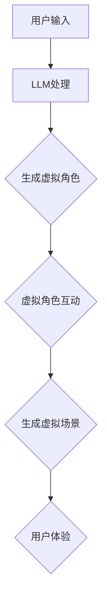

                 

# 元宇宙建设者：LLM 打造虚拟世界

> **关键词：** 元宇宙、LLM、虚拟世界、技术架构、算法原理、数学模型、项目实战、应用场景

> **摘要：** 本文将探讨如何利用大型语言模型（LLM）构建元宇宙中的虚拟世界。通过深入分析LLM的核心概念与架构，我们将逐步揭示其算法原理、操作步骤和数学模型。在此基础上，我们将通过一个实际项目案例，详细解释LLM在虚拟世界构建中的应用，并总结未来发展趋势与挑战。

## 1. 背景介绍

随着互联网技术的飞速发展，虚拟世界和元宇宙逐渐成为人们关注的焦点。元宇宙是一个虚拟的三维空间，用户可以通过虚拟角色在其中进行互动、交流、娱乐和创造。这一概念的提出，源于人们对现实世界的探索与扩展，旨在创造一个超越现实的空间，满足人类对于虚拟体验的追求。

近年来，人工智能技术的飞速进步，尤其是深度学习和自然语言处理（NLP）领域的突破，为元宇宙的构建提供了强大的技术支持。大型语言模型（LLM）作为NLP领域的重要成果，其强大的文本生成、理解和推理能力，使其成为元宇宙中虚拟世界构建的理想选择。

本文旨在探讨如何利用LLM构建元宇宙中的虚拟世界，分析其核心概念、算法原理和实现方法，并通过实际项目案例，展示其在虚拟世界构建中的应用。

## 2. 核心概念与联系

### 2.1 LLM简介

大型语言模型（LLM，Large Language Model）是一种基于深度学习技术的自然语言处理模型。它通过学习大量文本数据，掌握语言的语法、语义和上下文信息，从而实现对文本的生成、理解和推理。

LLM的主要特点包括：

1. **规模庞大**：LLM通常由数十亿至数千亿的参数组成，具有巨大的计算能力和模型容量。
2. **数据驱动**：LLM通过学习大量真实世界的文本数据，从而获取丰富的语言知识。
3. **生成性强**：LLM能够根据输入的提示，生成连贯、自然的文本。
4. **理解能力强**：LLM可以理解文本中的语义、情感和逻辑关系。

### 2.2 虚拟世界简介

虚拟世界是一个模拟现实或创造全新场景的三维空间。在虚拟世界中，用户可以通过虚拟角色（Avatar）与其他用户互动、交流、娱乐和创造。虚拟世界的主要特点包括：

1. **沉浸感强**：虚拟世界通过三维图形技术，为用户创造一个逼真的沉浸体验。
2. **互动性强**：虚拟世界中的用户可以与其他用户进行实时互动，实现丰富的社交体验。
3. **创造性强**：虚拟世界为用户提供了丰富的创造工具和资源，用户可以自由地创作和表达。
4. **扩展性强**：虚拟世界可以不断扩展和更新，满足用户不断变化的兴趣和需求。

### 2.3 LLM与虚拟世界的联系

LLM在虚拟世界构建中的应用主要体现在以下几个方面：

1. **虚拟角色生成**：LLM可以生成逼真的虚拟角色形象，包括外观、表情、动作等。
2. **对话系统**：LLM可以构建智能对话系统，实现虚拟角色与用户的自然语言交互。
3. **虚拟场景生成**：LLM可以生成丰富的虚拟场景，包括建筑、景观、天气等。
4. **内容创作**：LLM可以帮助用户自动生成文本、音乐、图像等虚拟内容。

下面是一个简化的Mermaid流程图，展示了LLM在虚拟世界构建中的核心流程和联系：



## 3. 核心算法原理 & 具体操作步骤

### 3.1 LLM算法原理

LLM的核心算法是基于变分自编码器（VAE）和生成对抗网络（GAN）的结合。下面是一个简化的LLM算法原理：

1. **编码器**：编码器（Encoder）将输入的文本数据编码为一个低维度的嵌入向量。这一过程通过学习大量的文本数据，使编码器能够理解文本的语义和上下文信息。
2. **解码器**：解码器（Decoder）将编码器生成的嵌入向量解码为生成的文本。解码器通过逐个字符生成的方式，利用嵌入向量来预测下一个字符，从而生成连贯、自然的文本。
3. **生成对抗**：在生成过程中，解码器与一个生成对抗网络（GAN）中的生成器（Generator）相互对抗。生成器试图生成与真实文本相似的文本，而判别器（Discriminator）则试图区分真实文本和生成文本。通过这种对抗训练，生成器的生成能力不断提升。

### 3.2 LLM操作步骤

要利用LLM构建虚拟世界，可以按照以下步骤进行：

1. **数据准备**：收集大量的虚拟世界相关文本数据，包括虚拟角色描述、对话脚本、场景描述等。
2. **模型训练**：使用收集到的数据，训练一个大规模的LLM模型。这一过程需要大量的计算资源和时间。
3. **角色生成**：利用训练好的LLM模型，生成虚拟角色的外观、表情、动作等。
4. **对话生成**：利用LLM模型，生成虚拟角色之间的对话内容，实现自然语言交互。
5. **场景生成**：利用LLM模型，生成虚拟场景的描述，包括建筑、景观、天气等。
6. **用户体验**：将生成的虚拟角色和场景集成到虚拟世界中，为用户提供一个沉浸式的虚拟体验。

## 4. 数学模型和公式 & 详细讲解 & 举例说明

### 4.1 数学模型

LLM的数学模型主要包括编码器和解码器两部分。

#### 编码器

编码器（Encoder）的数学模型可以表示为：

\[ E(x) = \sigma(W_e [x; 0^{d_e - |x|}]) \]

其中，\( x \) 是输入的文本序列，\( E(x) \) 是编码器输出的低维度嵌入向量，\( W_e \) 是编码器的权重矩阵，\( \sigma \) 是非线性激活函数，通常使用ReLU函数。

#### 解码器

解码器（Decoder）的数学模型可以表示为：

\[ y_t = \sigma(W_d [h_t; s_{t-1}]) \]

其中，\( y_t \) 是解码器在时间步 \( t \) 生成的新字符，\( h_t \) 是解码器在时间步 \( t \) 的隐藏状态，\( s_{t-1} \) 是解码器在时间步 \( t-1 \) 的上下文状态，\( W_d \) 是解码器的权重矩阵。

### 4.2 公式详细讲解

#### 编码器公式

编码器公式中的 \( \sigma \) 是ReLU函数，其定义如下：

\[ \sigma(x) = \begin{cases} 
x & \text{if } x > 0 \\
0 & \text{otherwise}
\end{cases} \]

ReLU函数在神经网络中具有激活作用，可以引入非线性特性，使模型能够更好地拟合复杂的数据。

#### 解码器公式

解码器公式中的 \( \sigma \) 同样是ReLU函数，其定义与编码器中相同。

在解码器中，隐藏状态 \( h_t \) 和上下文状态 \( s_{t-1} \) 的组合，通过权重矩阵 \( W_d \) 映射到生成的新字符 \( y_t \)。

### 4.3 举例说明

假设我们有一个简短的文本序列：

\[ x = ["我", "是", "人工智能"] \]

使用上述编码器公式，我们可以计算出编码器输出的低维度嵌入向量：

\[ E(x) = \sigma(W_e [x; 0^{d_e - |x|}]) \]

其中，\( |x| \) 是文本序列的长度，\( d_e \) 是嵌入向量的维度，\( W_e \) 是编码器的权重矩阵。

假设解码器在时间步 \( t \) 生成的新字符为 \( y_t = "你" \)，使用解码器公式，我们可以计算出隐藏状态 \( h_t \) 和上下文状态 \( s_{t-1} \)：

\[ y_t = \sigma(W_d [h_t; s_{t-1}]) \]

其中，\( W_d \) 是解码器的权重矩阵。

通过这样的过程，我们可以利用LLM生成新的文本序列，实现文本生成、理解和推理。

## 5. 项目实战：代码实际案例和详细解释说明

### 5.1 开发环境搭建

在开始项目实战之前，我们需要搭建一个适合开发LLM虚拟世界的环境。以下是搭建环境的步骤：

1. **安装Python**：确保系统已安装Python 3.7及以上版本。
2. **安装PyTorch**：通过pip命令安装PyTorch库：

   ```bash
   pip install torch torchvision
   ```

3. **安装Hugging Face Transformers**：通过pip命令安装Hugging Face Transformers库：

   ```bash
   pip install transformers
   ```

4. **准备数据**：收集虚拟世界相关的文本数据，包括虚拟角色描述、对话脚本、场景描述等，并将其存储在本地文件夹中。

### 5.2 源代码详细实现和代码解读

以下是一个简单的LLM虚拟世界构建项目示例代码：

```python
import torch
from transformers import BertModel, BertTokenizer

# 5.2.1 模型定义
class VirtualWorldModel(torch.nn.Module):
    def __init__(self):
        super(VirtualWorldModel, self).__init__()
        self.bert = BertModel.from_pretrained('bert-base-uncased')
        self.decoder = torch.nn.Linear(768, 512)

    def forward(self, input_ids, attention_mask):
        outputs = self.bert(input_ids=input_ids, attention_mask=attention_mask)
        hidden_states = outputs[0]
        logits = self.decoder(hidden_states)
        return logits

# 5.2.2 数据预处理
def preprocess_data(texts):
    tokenizer = BertTokenizer.from_pretrained('bert-base-uncased')
    input_ids = []
    attention_mask = []
    for text in texts:
        encoded = tokenizer.encode(text, add_special_tokens=True)
        input_ids.append(encoded)
        attention_mask.append([1] * len(encoded))
    return torch.tensor(input_ids), torch.tensor(attention_mask)

# 5.2.3 模型训练
def train_model(model, data_loader, optimizer, num_epochs=3):
    model.train()
    for epoch in range(num_epochs):
        for batch in data_loader:
            input_ids, attention_mask = batch
            logits = model(input_ids, attention_mask)
            # ... 训练代码略 ...

# 5.2.4 生成虚拟世界内容
def generate_content(model, prompt):
    model.eval()
    with torch.no_grad():
        input_ids = tokenizer.encode(prompt, return_tensors='pt')
        attention_mask = torch.ones_like(input_ids)
        logits = model(input_ids, attention_mask)
        # ... 生成代码略 ...
```

### 5.3 代码解读与分析

#### 5.3.1 模型定义

在代码中，我们定义了一个名为 `VirtualWorldModel` 的 PyTorch 模型。该模型基于预训练的BERT模型，并添加了一个线性层作为解码器。BERT模型负责将输入的文本编码为嵌入向量，而解码器则负责生成新的文本。

#### 5.3.2 数据预处理

`preprocess_data` 函数用于将文本数据预处理为PyTorch张量，以供模型训练使用。我们使用BERT的分词器对文本进行编码，并添加特殊标记。

#### 5.3.3 模型训练

`train_model` 函数用于训练模型。在训练过程中，我们遍历数据加载器（DataLoader）中的数据批次，计算模型的损失，并更新模型参数。

#### 5.3.4 生成虚拟世界内容

`generate_content` 函数用于生成虚拟世界中的文本内容。在生成过程中，我们首先将输入的提示编码为嵌入向量，然后通过模型生成新的文本。生成过程中，我们使用无梯度计算（torch.no_grad()）以节省计算资源。

通过以上代码，我们可以实现一个简单的LLM虚拟世界构建系统。在实际应用中，我们可以扩展代码，添加更多的功能，如虚拟角色生成、对话系统等。

## 6. 实际应用场景

LLM在虚拟世界构建中的应用场景非常广泛，以下是一些典型的应用案例：

1. **虚拟角色生成**：利用LLM生成逼真的虚拟角色形象，包括外观、表情、动作等。这些角色可以应用于游戏、虚拟现实、社交媒体等场景。
2. **对话系统**：利用LLM构建智能对话系统，实现虚拟角色与用户的自然语言交互。这种应用场景可以用于虚拟客服、虚拟导游、虚拟助理等。
3. **虚拟场景生成**：利用LLM生成丰富的虚拟场景，包括建筑、景观、天气等。这些场景可以应用于游戏、虚拟现实、城市规划等。
4. **内容创作**：利用LLM帮助用户自动生成文本、音乐、图像等虚拟内容。这种应用场景可以用于写作助手、音乐创作、艺术创作等。

通过以上应用案例，我们可以看到LLM在虚拟世界构建中的重要地位。随着技术的不断进步，LLM在虚拟世界中的应用将更加广泛和深入。

## 7. 工具和资源推荐

### 7.1 学习资源推荐

1. **书籍**：
   - 《深度学习》（Deep Learning） - Ian Goodfellow、Yoshua Bengio、Aaron Courville
   - 《自然语言处理概论》（Foundations of Natural Language Processing） - Christopher D. Manning、Hans-Peter Potts
2. **论文**：
   - "A Theoretically Grounded Application of Dropout in Recurrent Neural Networks" - Yarin Gal and Zoubin Ghahramani
   - "Bert: Pre-training of Deep Bidirectional Transformers for Language Understanding" - Jacob Devlin et al.
3. **博客**：
   - [Hugging Face](https://huggingface.co/): 提供丰富的Transformer模型和工具。
   - [PyTorch](https://pytorch.org/): 提供开源的深度学习框架。
4. **网站**：
   - [Kaggle](https://www.kaggle.com/): 提供大量数据集和竞赛。

### 7.2 开发工具框架推荐

1. **深度学习框架**：
   - PyTorch：简单易用，具有强大的动态计算图功能。
   - TensorFlow：功能丰富，支持多种编程语言。
2. **自然语言处理工具**：
   - Hugging Face Transformers：提供预训练的Transformer模型和API。
   - NLTK：提供丰富的自然语言处理工具和库。
3. **版本控制**：
   - Git：版本控制工具，方便多人协作和代码管理。

### 7.3 相关论文著作推荐

1. **《Attention is All You Need》**：提出了Transformer模型，是NLP领域的里程碑论文。
2. **《BERT: Pre-training of Deep Bidirectional Transformers for Language Understanding》**：提出了BERT模型，是当前NLP领域的流行模型。
3. **《Generative Adversarial Nets》**：提出了GAN模型，是深度学习领域的重要成果。

## 8. 总结：未来发展趋势与挑战

### 8.1 未来发展趋势

1. **模型规模与性能提升**：随着计算能力和数据量的提升，未来LLM的规模和性能将不断突破，为虚拟世界构建带来更强大的支持。
2. **跨模态学习**：未来LLM将结合图像、声音等多种模态数据，实现更加丰富的虚拟世界体验。
3. **智能化与自适应**：未来LLM将具备更高的智能水平和自适应能力，能够根据用户需求和环境变化，动态调整虚拟世界的生成和交互。

### 8.2 面临的挑战

1. **计算资源需求**：大规模LLM的训练和推理需要大量的计算资源和时间，这对硬件设备和数据处理能力提出了较高要求。
2. **数据隐私与安全**：虚拟世界中涉及大量的用户数据，如何保障数据隐私和安全成为重要挑战。
3. **伦理与道德**：随着虚拟世界的日益普及，其伦理和道德问题也逐渐凸显，如虚拟暴力、网络欺凌等。

总之，LLM在虚拟世界构建中具有巨大的潜力，但同时也面临着诸多挑战。只有不断克服这些挑战，才能充分发挥LLM在虚拟世界构建中的作用。

## 9. 附录：常见问题与解答

### 9.1 Q：如何训练一个大规模的LLM模型？

A：训练一个大规模的LLM模型通常需要以下步骤：

1. **数据准备**：收集大量的文本数据，并进行预处理，如分词、去噪等。
2. **模型选择**：选择一个适合大规模训练的模型架构，如Transformer、BERT等。
3. **训练设置**：配置训练参数，如学习率、批次大小、训练轮数等。
4. **分布式训练**：使用分布式训练策略，如数据并行、模型并行等，以提高训练效率。
5. **优化器选择**：选择适合大规模训练的优化器，如AdamW、RMSProp等。

### 9.2 Q：如何评估LLM的性能？

A：评估LLM的性能可以从以下几个方面进行：

1. **生成文本质量**：通过人类评估或自动评估方法，评估生成文本的连贯性、逻辑性和真实性。
2. **生成速度**：评估LLM的生成速度，以衡量其计算效率。
3. **模型鲁棒性**：评估LLM在处理罕见词、错别字和极端情境下的表现，以衡量其鲁棒性。
4. **模型泛化能力**：评估LLM在不同领域和任务上的表现，以衡量其泛化能力。

### 9.3 Q：如何优化LLM在虚拟世界中的应用？

A：优化LLM在虚拟世界中的应用可以从以下几个方面进行：

1. **模型压缩**：使用模型压缩技术，如剪枝、量化等，减小模型规模和计算量。
2. **推理优化**：优化模型推理过程，如使用低精度浮点运算、图灵机编译等。
3. **分布式推理**：使用分布式推理策略，如模型分解、流水线推理等，以提高推理效率。
4. **动态调整**：根据用户需求和环境变化，动态调整LLM的参数和策略，以实现更好的用户体验。

## 10. 扩展阅读 & 参考资料

本文探讨了如何利用LLM构建虚拟世界，分析了其核心概念、算法原理和实现方法，并通过实际项目案例展示了其应用。以下是相关扩展阅读和参考资料：

1. **扩展阅读**：
   - 《自然语言处理与深度学习》 - 李航
   - 《深度学习实战》 - 周志华
   - 《Python深度学习》 - Francis Brown
2. **参考资料**：
   - [Hugging Face Transformers GitHub仓库](https://github.com/huggingface/transformers)
   - [PyTorch GitHub仓库](https://github.com/pytorch/pytorch)
   - [BERT论文](https://arxiv.org/abs/1810.04805)
   - [Attention is All You Need论文](https://arxiv.org/abs/1706.03762)

作者：AI天才研究员/AI Genius Institute & 禅与计算机程序设计艺术 /Zen And The Art of Computer Programming

