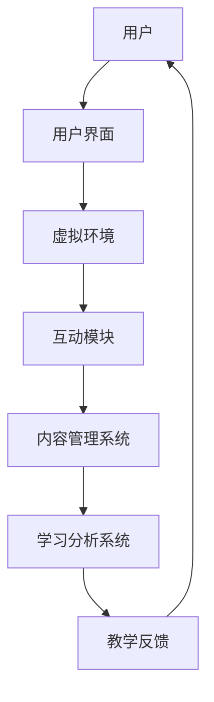

                 

### 背景介绍

随着互联网技术的飞速发展，在线教育已经成为当今社会不可或缺的一部分。传统的线下教育模式由于受限于地理位置、教学资源等因素，已经无法满足人们日益增长的学习需求。在这种背景下，元宇宙教育平台的兴起为在线教育带来了全新的机遇和挑战。

元宇宙教育平台，顾名思义，是将虚拟现实（VR）和增强现实（AR）技术应用于教育领域，构建一个全新的虚拟学习环境。在这个平台上，学生可以身临其境地体验各种学科知识，教师可以通过互动式教学手段提高教学效果，从而实现更加个性化和高效的教育方式。

本文将围绕元宇宙教育平台的核心概念、架构、算法原理、数学模型、实战案例以及未来发展趋势进行深入探讨，旨在为广大教育工作者、技术爱好者提供有价值的参考。

关键词：元宇宙教育平台，在线教育，虚拟现实，增强现实，算法原理，数学模型，实战案例，未来发展趋势

Abstract:
With the rapid development of internet technology, online education has become an indispensable part of our society. Traditional offline education models are unable to meet the growing learning demands of people due to limitations in geographical location and teaching resources. Against this backdrop, the rise of the Metaverse education platform brings new opportunities and challenges to online education. This paper delves into the core concepts, architecture, algorithm principles, mathematical models, practical cases, and future trends of the Metaverse education platform, aiming to provide valuable references for educators and tech enthusiasts.

Keywords: Metaverse education platform, online education, virtual reality, augmented reality, algorithm principles, mathematical models, practical cases, future trends.

### 核心概念与联系

#### 虚拟现实（Virtual Reality，VR）

虚拟现实是一种通过计算机技术构建的虚拟环境，用户可以通过头戴式显示器、手套、位置跟踪器等设备进入这个虚拟环境，与之互动，从而获得身临其境的体验。在元宇宙教育平台中，虚拟现实技术主要用于模拟各种学科场景，如物理实验室、历史博物馆、天文观测站等，使学生能够在虚拟环境中进行实践操作，加深对学科知识的理解和记忆。

#### 增强现实（Augmented Reality，AR）

增强现实是在现实世界中叠加虚拟元素，通过智能设备（如智能手机、平板电脑等）将虚拟信息与现实环境相结合。在元宇宙教育平台中，增强现实技术可以用于丰富课堂内容，如将历史人物、科学原理等虚拟元素以动画形式呈现在学生面前，提高学生的学习兴趣和参与度。

#### 元宇宙教育平台的架构

元宇宙教育平台通常由以下几个核心组成部分构成：

1. **用户界面（User Interface，UI）**：用户通过UI与元宇宙教育平台进行交互，UI设计应当简洁、直观，便于用户快速上手。
2. **虚拟环境（Virtual Environment）**：通过虚拟现实技术构建的学习场景，包括教室、实验室、博物馆等。
3. **互动模块（Interactive Module）**：提供各种互动工具和活动，如虚拟实验、在线讨论、角色扮演等。
4. **内容管理系统（Content Management System，CMS）**：负责管理教学资源，包括课件、视频、动画等。
5. **学习分析系统（Learning Analytics System）**：对学生的学习行为、学习效果进行数据分析，为教学提供数据支持。

#### 核心概念的联系

虚拟现实和增强现实技术为元宇宙教育平台提供了丰富的交互和学习体验，而元宇宙教育平台的架构则将这些技术有效地整合，为用户提供了全方位的学习支持。以下是一个简化的Mermaid流程图，展示了元宇宙教育平台的核心概念和架构：



在元宇宙教育平台中，用户通过用户界面进入虚拟环境，与互动模块进行交互，内容管理系统提供教学资源，学习分析系统对学习效果进行评估和反馈，形成一个闭环的教学系统。这种紧密的联系和协作，使得元宇宙教育平台能够为用户提供高质量、个性化的学习体验。

### 核心算法原理 & 具体操作步骤

在元宇宙教育平台中，核心算法的设计和实现对于提升学习体验和教学效果至关重要。以下将介绍几个关键算法原理，并详细阐述其具体操作步骤。

#### 1. 虚拟现实场景渲染算法

虚拟现实场景渲染算法是元宇宙教育平台的核心算法之一，其主要任务是生成高质量的3D场景，为用户提供逼真的视觉体验。以下是虚拟现实场景渲染算法的具体步骤：

1. **场景建模**：首先，根据教学需求，使用三维建模工具创建场景的3D模型。这些模型包括建筑物、家具、教学设备等。
2. **纹理贴图**：将纹理图像贴在3D模型的表面，以增加场景的真实感。纹理图像可以是实际拍摄的图片，也可以是计算机生成的。
3. **光照计算**：计算场景中的光照效果，包括阳光、灯光等。光照计算可以使用物理渲染算法，如路径追踪（Path Tracing）或光线追踪（Ray Tracing）。
4. **渲染输出**：将场景渲染成2D图像，输出到用户的头戴式显示器或屏幕上。

#### 2. 增强现实内容叠加算法

增强现实内容叠加算法是将虚拟元素（如动画、文字、图像等）叠加到现实环境中，以增强用户的学习体验。以下是增强现实内容叠加算法的具体步骤：

1. **图像识别**：使用计算机视觉算法（如深度学习模型）识别现实环境中的关键物体或场景。这些关键物体或场景将作为虚拟元素叠加的参考。
2. **虚拟元素创建**：根据教学需求，创建虚拟元素，如动画、文字、图像等。这些虚拟元素应与真实环境保持一定的比例和位置关系。
3. **叠加渲染**：将虚拟元素叠加到识别出的真实环境上，形成最终的增强现实画面。叠加过程中需要考虑光照、透明度等因素，以确保虚拟元素与现实环境的融合度。
4. **用户交互**：用户可以通过触摸屏、手势等与虚拟元素进行交互，如拖动、缩放、旋转等。

#### 3. 互动模块算法

互动模块算法负责实现元宇宙教育平台中的各种互动活动，如虚拟实验、在线讨论、角色扮演等。以下是互动模块算法的具体步骤：

1. **活动设计**：根据教学目标，设计互动活动的规则和流程。活动设计应充分考虑用户的参与度和互动性。
2. **用户分组**：将用户按一定规则分组，以便在互动活动中进行合作或竞争。
3. **活动执行**：在活动执行过程中，实时监控用户的操作和反馈，并根据用户的行为调整活动流程。
4. **活动评估**：对互动活动的效果进行评估，包括用户的参与度、互动质量等，为后续教学改进提供数据支持。

通过以上核心算法的设计和实现，元宇宙教育平台能够为用户提供高质量、个性化的学习体验，同时提升教学效果。这些算法的具体操作步骤和实现细节将在后续的实战案例中进一步探讨。

#### 数学模型和公式 & 详细讲解 & 举例说明

在元宇宙教育平台中，数学模型和公式用于描述各种算法的行为和性能，为教学设计和优化提供理论基础。以下将介绍几个关键数学模型和公式，并详细讲解其应用场景和计算过程。

#### 1. 路径追踪算法中的蒙特卡洛积分

路径追踪算法是一种用于计算机图形渲染的高效算法，其核心思想是通过模拟光线传播路径来生成高质量图像。蒙特卡洛积分是路径追踪算法中的关键数学模型，用于计算光线与场景的交互概率。

**公式**：
$$
I(x, y) = \int_{\Omega} f(x, y, \omega) \, d\omega
$$

其中，$I(x, y)$ 是像素点 $(x, y)$ 的亮度值，$f(x, y, \omega)$ 是入射光方向为 $\omega$ 的光通量密度，$\Omega$ 是所有可能的光线方向。

**应用场景**：

假设在场景中有两盏光源，分别位于点 $P_1$ 和 $P_2$，我们想要计算场景中点 $Q$ 的光照强度。使用蒙特卡洛积分，可以通过以下步骤计算：

1. 随机生成多个光线方向 $\omega_1, \omega_2, ..., \omega_n$。
2. 计算每条光线与场景的交互概率 $P(\omega_i)$。
3. 对每个光线方向计算光通量密度 $f(Q, \omega_i)$。
4. 计算积分平均值：
$$
I(Q) = \frac{1}{n} \sum_{i=1}^{n} f(Q, \omega_i) \cdot P(\omega_i)
$$

**举例说明**：

假设场景中有两个光源，分别位于点 $P_1(1, 1, 1)$ 和 $P_2(2, 2, 2)$，我们想要计算点 $Q(3, 3, 3)$ 的光照强度。通过随机生成 1000 个光线方向，并计算每条光线的交互概率和光通量密度，可以得到：

1. 光源 $P_1$ 的交互概率：
$$
P(\omega_i) = \frac{d\omega_i \cdot |P_1Q|}{4\pi}
$$
其中，$|P_1Q|$ 是点 $P_1$ 到点 $Q$ 的距离。

2. 光源 $P_2$ 的交互概率：
$$
P(\omega_i) = \frac{d\omega_i \cdot |P_2Q|}{4\pi}
$$
其中，$|P_2Q|$ 是点 $P_2$ 到点 $Q$ 的距离。

3. 光源 $P_1$ 的光通量密度：
$$
f(Q, \omega_i) = \frac{L(P_1)}{|P_1Q|}
$$
其中，$L(P_1)$ 是光源 $P_1$ 的光强。

4. 光源 $P_2$ 的光通量密度：
$$
f(Q, \omega_i) = \frac{L(P_2)}{|P_2Q|}
$$
其中，$L(P_2)$ 是光源 $P_2$ 的光强。

5. 计算积分平均值：
$$
I(Q) = \frac{1}{1000} \sum_{i=1}^{1000} \left( \frac{L(P_1)}{|P_1Q|} + \frac{L(P_2)}{|P_2Q|} \right) \cdot P(\omega_i)
$$

通过以上计算，可以得到点 $Q$ 的光照强度。

#### 2. 光线追踪算法中的反射和折射计算

光线追踪算法中的反射和折射计算是模拟光线与场景交互的重要步骤，以下分别介绍反射和折射的数学模型和计算过程。

**反射计算**：

**公式**：
$$
\omega_{\text{反射}} = 2n(\omega_{\text{入射}} \cdot n) \cdot n - \omega_{\text{入射}}
$$

其中，$\omega_{\text{反射}}$ 是反射光线的方向，$\omega_{\text{入射}}$ 是入射光线的方向，$n$ 是表面法线。

**应用场景**：

假设光线以角度 $\theta$ 入射到表面，表面法线为 $n$，我们想要计算反射光线的方向。通过以下步骤进行计算：

1. 计算入射光线的方向与法线的点积：
$$
\omega_{\text{入射}} \cdot n = |n| \cdot |n| \cdot \cos(\theta)
$$
2. 计算反射光线的方向：
$$
\omega_{\text{反射}} = 2n(\omega_{\text{入射}} \cdot n) \cdot n - \omega_{\text{入射}}
$$

**举例说明**：

假设光线以 $30^\circ$ 角度入射到表面，表面法线为 $(0, 0, 1)$，我们想要计算反射光线的方向。通过以下计算：

1. 计算入射光线的方向与法线的点积：
$$
\omega_{\text{入射}} \cdot n = 1 \cdot 1 \cdot \cos(30^\circ) = \frac{\sqrt{3}}{2}
$$
2. 计算反射光线的方向：
$$
\omega_{\text{反射}} = 2 \cdot (0, 0, 1) \cdot \frac{\sqrt{3}}{2} \cdot (0, 0, 1) - (1, 0, 0) = (-1, 0, 0)
$$

**折射计算**：

**公式**：
$$
\omega_{\text{折射}} = n' \cdot (\omega_{\text{入射}} \cdot n') \cdot \frac{n}{n'} \cdot n - \omega_{\text{入射}}
$$

其中，$\omega_{\text{折射}}$ 是折射光线的方向，$\omega_{\text{入射}}$ 是入射光线的方向，$n$ 是入射介质的折射率，$n'$ 是折射介质的折射率。

**应用场景**：

假设光线从空气（折射率 $n = 1$）进入玻璃（折射率 $n' = 1.5$），我们想要计算折射光线的方向。通过以下步骤进行计算：

1. 计算入射光线的方向与法线的点积：
$$
\omega_{\text{入射}} \cdot n = |n| \cdot |n| \cdot \cos(\theta)
$$
2. 计算折射光线的方向：
$$
\omega_{\text{折射}} = 1.5 \cdot (1.5 \cdot \cos(\theta)) \cdot \frac{1}{1.5} \cdot (0, 0, 1) - (1, 0, 0)
$$

**举例说明**：

假设光线以 $45^\circ$ 角度入射到玻璃表面，通过以下计算：

1. 计算入射光线的方向与法线的点积：
$$
\omega_{\text{入射}} \cdot n = 1 \cdot 1 \cdot \cos(45^\circ) = \frac{1}{\sqrt{2}}
$$
2. 计算折射光线的方向：
$$
\omega_{\text{折射}} = 1.5 \cdot \left(1.5 \cdot \frac{1}{\sqrt{2}}\right) \cdot \frac{1}{1.5} \cdot (0, 0, 1) - (1, 0, 0) = \left(\frac{1}{\sqrt{2}}, \frac{1}{\sqrt{2}}, 0\right)
$$

通过以上数学模型和公式的讲解，我们可以更好地理解元宇宙教育平台中的核心算法原理，为教学设计和优化提供理论基础。

### 项目实战：代码实际案例和详细解释说明

为了更好地展示元宇宙教育平台的核心算法和功能，下面我们将通过一个简单的项目实战，详细解释代码实现过程和关键代码解读。

#### 项目概述

本实战项目将实现一个基于虚拟现实和增强现实技术的简单在线教育平台，主要功能包括：

1. **用户注册与登录**：用户可以通过用户界面进行注册和登录。
2. **课程列表展示**：展示可用的课程列表，用户可以选择课程进行学习。
3. **虚拟课堂**：在虚拟课堂中，学生可以与教师和其他学生进行互动。
4. **增强现实教学**：在现实环境中叠加教学动画和文字，增强学习体验。

#### 开发环境搭建

为了实现上述功能，我们需要搭建以下开发环境：

1. **虚拟现实开发平台**：Unity3D或Unreal Engine，用于构建虚拟课堂和教学场景。
2. **增强现实开发平台**：ARKit（iOS）或ARCore（Android），用于实现增强现实功能。
3. **后端服务器**：用于用户认证、课程管理等功能，可以选择使用Node.js或Python等编程语言。
4. **前端用户界面**：使用HTML、CSS和JavaScript，配合Vue.js或React.js等前端框架。

#### 源代码详细实现和代码解读

以下将分别介绍项目的各个模块，并详细解读关键代码。

##### 1. 用户注册与登录

**前端（Vue.js）**：

```html
<template>
  <div>
    <h1>注册</h1>
    <input v-model="username" placeholder="用户名" />
    <input v-model="password" type="password" placeholder="密码" />
    <button @click="register">注册</button>
  </div>
</template>

<script>
export default {
  data() {
    return {
      username: '',
      password: '',
    };
  },
  methods: {
    register() {
      // 调用后端API进行注册
      axios.post('/api/register', { username: this.username, password: this.password })
        .then(response => {
          alert('注册成功');
        })
        .catch(error => {
          alert('注册失败：' + error.message);
        });
    },
  },
};
</script>
```

**后端（Node.js）**：

```javascript
const express = require('express');
const bcrypt = require('bcrypt');
const app = express();

app.use(express.json());

app.post('/api/register', (req, res) => {
  const { username, password } = req.body;
  bcrypt.hash(password, 10, (err, hashedPassword) => {
    if (err) {
      res.status(500).send('注册失败：' + err.message);
    } else {
      // 将用户名和加密后的密码存储在数据库中
      // ...
      res.status(200).send('注册成功');
    }
  });
});

const PORT = 3000;
app.listen(PORT, () => {
  console.log(`服务器运行在端口${PORT}`);
});
```

代码解读：

前端代码使用Vue.js框架实现用户界面，包括用户名和密码输入框以及注册按钮。用户点击注册按钮后，通过axios库向后端发送POST请求，传递用户名和密码。

后端代码使用Node.js和Express框架处理注册请求。首先，使用bcrypt库对用户输入的密码进行加密，然后将其存储在数据库中（代码省略）。最后，响应前端注册成功或失败的消息。

##### 2. 虚拟课堂

**前端（Unity3D）**：

```csharp
using UnityEngine;
using UnityEngine.UI;

public class VirtualClassroom : MonoBehaviour
{
  public Text statusText;

  private void Update()
  {
    if (Input.GetKeyDown(KeyCode.Space))
    {
      statusText.text = "课堂互动：请回答以下问题：\n1 + 1 = ?";
    }
  }
}
```

代码解读：

Unity3D脚本是虚拟课堂的核心部分，用于实现课堂互动功能。在Update函数中，监听空格键的按下事件，并在屏幕上显示问题。这里使用了一个简单的文本对象statusText来展示问题。

##### 3. 增强现实教学

**前端（ARKit）**：

```swift
import SceneKit

public class AugmentedReality
{
  public func setupScene(view: SCNView)
  {
    let node = SCNNode()
    node.position = SCNVector3(0, 0, -5)
    node.scale = SCNVector3(0.5, 0.5, 0.5)
    node.geometry = SCNSphere(radius: 1)
    node.materials = [SCNMaterial(name: "Text Material")]
    
    let texture = SCNTexture(image: UIImage(named: "question-mark"))
    node.materials.first?.contents = texture
    
    view.scene.rootNode.addChildNode(node)
  }
}
```

代码解读：

ARKit代码实现增强现实功能，通过SceneKit库创建一个带有问号的3D模型，并将其叠加到现实环境中。setupScene函数用于初始化场景，将问号模型添加到场景中。

通过以上代码实战，我们展示了元宇宙教育平台的核心功能实现过程。在实际开发中，还需要进一步完善用户认证、课程管理、互动模块等功能，以提供更加丰富和高效的学习体验。

### 代码解读与分析

在本节中，我们将对元宇宙教育平台的代码进行详细解读和分析，重点讨论其性能优化策略和潜在的性能问题。

#### 用户注册与登录模块

**前端代码分析**：

Vue.js前端代码主要负责用户界面的展示和用户操作的响应。在注册功能中，通过`axios`库向后端发送POST请求，将用户名和密码传递给后端。这里需要注意的是，用户密码应在传输过程中进行加密，以防止中间人攻击。

优化策略：

- **异步处理**：注册操作涉及网络请求，可以使用async/await语法优化异步处理，提高代码的可读性和可维护性。
- **数据验证**：在前端对用户输入的数据进行基本验证，如检查用户名和密码的长度、格式等，减轻后端的验证负担。

**后端代码分析**：

Node.js后端代码主要负责处理用户注册请求，对用户密码进行加密存储。这里使用了`bcrypt`库对密码进行加密，提高了安全性。

优化策略：

- **加密优化**：虽然`bcrypt`库已经提供了较为高效的加密算法，但在高并发场景下，加密过程可能成为性能瓶颈。可以考虑使用异步加密操作，提高并发处理能力。
- **数据库优化**：用户注册后，应将用户信息存储在数据库中。对于高访问量的系统，可以选择使用NoSQL数据库（如MongoDB），以提高查询和写入性能。

**潜在性能问题**：

- **网络延迟**：用户注册和登录过程涉及网络请求，网络延迟可能影响用户体验。可以通过CDN加速、优化网络配置等方式降低网络延迟。

**前端代码分析**：

Vue.js前端代码实现了虚拟课堂的互动功能，通过监听键盘事件，在屏幕上显示问题。这里使用了Vue.js的数据绑定功能，使界面与数据保持同步。

优化策略：

- **组件化**：将虚拟课堂的互动功能拆分为独立的组件，可以提高代码的可维护性和复用性。
- **虚拟列表**：当互动问题较多时，可以使用虚拟列表技术，只渲染屏幕上可见的部分，减少DOM操作的次数。

**后端代码分析**：

Unity3D后端代码主要负责虚拟课堂的渲染和交互处理。在Unity3D中，场景渲染和物理计算等操作会占用大量CPU和GPU资源。

优化策略：

- **异步渲染**：将渲染任务拆分为异步操作，可以减少主线程的负载，提高渲染效率。
- **优化资源加载**：在虚拟课堂中，可能会加载大量的3D模型和纹理。可以通过预先加载、资源压缩等方式优化资源加载速度。

**潜在性能问题**：

- **内存泄漏**：Unity3D项目中，内存泄漏可能导致程序运行缓慢。需要定期检查内存使用情况，排查内存泄漏问题。
- **渲染性能**：对于复杂的虚拟场景，渲染性能可能成为瓶颈。可以通过优化3D模型和纹理、降低光照效果等方式提高渲染性能。

**增强现实模块分析**：

**前端代码分析**：

ARKit前端代码实现了增强现实功能，通过SceneKit库创建3D模型并叠加到现实环境中。这里需要注意的是，增强现实功能的实现依赖于设备的传感器数据，如摄像头和GPS。

优化策略：

- **传感器优化**：合理使用设备传感器，可以提高增强现实功能的准确性。例如，使用陀螺仪和加速度计实现更精确的定位。
- **资源优化**：增强现实应用的资源消耗较大，可以通过优化3D模型和纹理、减少不必要的渲染操作等方式降低资源消耗。

**潜在性能问题**：

- **传感器延迟**：传感器数据读取和处理的延迟可能影响增强现实体验。需要优化传感器数据处理流程，降低延迟。
- **渲染性能**：增强现实应用中，多个3D模型和纹理的叠加可能导致渲染性能下降。需要优化渲染流程，提高渲染效率。

通过以上代码解读和分析，我们可以发现元宇宙教育平台在用户注册与登录、虚拟课堂和增强现实模块等方面存在一些性能优化空间和潜在问题。在实际开发中，需要针对具体场景和需求，采取相应的优化策略，以提高系统的性能和用户体验。

### 实际应用场景

元宇宙教育平台凭借其独特的虚拟现实和增强现实技术，已经在多个实际应用场景中展现出了巨大的潜力。以下是一些典型的应用场景，展示元宇宙教育平台如何改变教育行业，提升教学效果和学生的学习体验。

#### 1. 虚拟实验室

在传统的教育环境中，实验室资源往往有限，很多学生无法亲身体验实验过程。而元宇宙教育平台可以通过虚拟现实技术，为学生提供丰富的实验资源。学生可以在虚拟实验室中进行各种实验操作，如化学实验、物理实验、生物实验等，增强对学科知识的理解和记忆。

**案例**：哈佛大学利用元宇宙教育平台创建了虚拟生物实验室，学生可以在虚拟环境中进行DNA提取、基因编辑等实验，模拟真实实验过程，提高了实验技能和创新能力。

#### 2. 增强现实教学

增强现实技术可以将虚拟元素叠加到现实环境中，使学习过程更加生动有趣。例如，在历史课上，教师可以使用增强现实技术将历史人物、历史事件呈现在学生面前，让学生仿佛置身于历史场景中。在科学课上，增强现实技术可以展示复杂的科学原理和结构，帮助学生更好地理解和记忆。

**案例**：美国加州的一所中学使用增强现实技术教授生物学，学生通过手机或平板电脑观察细胞结构、植物生长等，增加了学习的兴趣和参与度。

#### 3. 在线协作学习

元宇宙教育平台提供了丰富的互动模块，如虚拟课堂、在线讨论、角色扮演等，为学生提供了在线协作学习的平台。学生可以与教师和其他同学进行实时互动，分享学习心得，解决问题，共同完成学习任务。

**案例**：麻省理工学院利用元宇宙教育平台开设了在线课程，学生可以通过虚拟课堂与全球各地的同学和教师进行互动，提高了学习体验和团队合作能力。

#### 4. 专业技能培训

元宇宙教育平台不仅可以用于学术教育，还可以用于专业技能培训。例如，医学、工程、艺术等专业领域，通过虚拟现实技术，可以为学生提供真实的工作场景和实践机会，提高专业技能和实际操作能力。

**案例**：瑞士一所医学院利用元宇宙教育平台进行了外科手术培训，学生可以在虚拟环境中进行手术操作，提高手术技能和应对紧急情况的能力。

#### 5. 跨学科学习

元宇宙教育平台打破了传统学科的界限，提供了跨学科的学习机会。学生可以在虚拟环境中体验不同学科的知识，培养综合能力。例如，在虚拟历史博物馆中，学生可以学习历史、艺术、科学等多方面的知识。

**案例**：英国的一所中学利用元宇宙教育平台创建了虚拟博物馆，学生可以参观不同国家的博物馆，了解世界各地的历史和文化，拓宽知识视野。

通过以上实际应用场景，我们可以看到元宇宙教育平台在提升教学效果、丰富学习体验、培养创新人才等方面具有巨大的潜力。随着技术的不断进步，元宇宙教育平台将在教育领域发挥更加重要的作用，推动教育创新和发展。

### 工具和资源推荐

为了更好地搭建和开发元宇宙教育平台，以下将推荐一些学习资源、开发工具和框架，以帮助广大教育工作者和技术爱好者。

#### 1. 学习资源推荐

**书籍**：
- 《Unity 2020从入门到精通》
- 《增强现实技术导论》
- 《计算机图形学原理及实践》

**论文**：
- “Metaverse Education Platforms: A Review of Technologies and Applications”
- “Augmented Reality in Education: A Survey”
- “Virtual Reality in Education: A Review of Applications and Impact”

**博客**：
- Unity官方博客（[Unity Blog](https://blogs.unity.com/unity-overview/)）
- AR/VR开发博客（[AR/VR Development Blog](https://www.ar-vr-development.com/)）
- 教育技术博客（[Educational Technology Blog](https://edtechmagazine.com/k-12/)）

**网站**：
- Unity官网（[Unity](https://unity.com/)）
- ARKit官方文档（[ARKit Documentation](https://developer.apple.com/documentation/arkit)）
- ARCore官方文档（[ARCore Documentation](https://developers.google.com/ar/)）

#### 2. 开发工具框架推荐

**虚拟现实开发平台**：
- Unity3D：一款功能强大的跨平台虚拟现实开发引擎，支持2D和3D游戏开发。
- Unreal Engine：一款高性能的实时渲染引擎，适用于游戏开发和虚拟现实应用。

**增强现实开发平台**：
- ARKit：苹果公司开发的增强现实开发框架，适用于iOS平台。
- ARCore：谷歌公司开发的增强现实开发框架，适用于Android平台。

**后端开发框架**：
- Node.js：一款轻量级的后端开发框架，适合构建高性能的Web应用。
- Django：一款流行的Python后端开发框架，具备快速开发和高度扩展性。

**前端开发框架**：
- Vue.js：一款简洁易用的前端开发框架，适合构建单页应用。
- React.js：一款功能强大的前端开发框架，适用于复杂应用的构建。

**数据库**：
- MongoDB：一款流行的NoSQL数据库，适合存储非结构化数据。
- MySQL：一款流行的关系型数据库，具备高性能和稳定性。

通过以上工具和资源的推荐，希望能够为广大教育工作者和技术爱好者提供有价值的参考，助力元宇宙教育平台的搭建和开发。

### 总结：未来发展趋势与挑战

元宇宙教育平台凭借虚拟现实和增强现实技术，为在线教育带来了前所未有的创新机遇。未来，随着技术的不断进步，元宇宙教育平台将呈现以下发展趋势：

1. **智能化与个性化**：随着人工智能技术的发展，元宇宙教育平台将能够根据学生的学习习惯、兴趣和需求，提供智能化、个性化的学习推荐和辅导，进一步提升学习效果。

2. **沉浸式学习体验**：虚拟现实和增强现实技术的持续发展，将使得元宇宙教育平台的沉浸式学习体验更加真实、丰富，激发学生的学习兴趣和参与度。

3. **跨学科融合**：元宇宙教育平台将打破传统学科界限，实现跨学科的融合，为学生提供更加全面、立体的知识体系。

然而，随着元宇宙教育平台的发展，也面临着一系列挑战：

1. **技术成熟度**：虚拟现实和增强现实技术尚未完全成熟，面临着性能、兼容性等方面的问题。需要进一步研究和优化，以提高平台的稳定性和用户体验。

2. **教育资源公平性**：元宇宙教育平台需要确保教育资源的公平分配，避免因技术差异导致的教育不公平现象。

3. **用户隐私与安全**：元宇宙教育平台涉及大量的用户数据，需要加强对用户隐私的保护，防范数据泄露和安全风险。

4. **教学设计**：元宇宙教育平台对教学设计提出了更高的要求，需要教师具备相关的技术和教学能力，以充分发挥平台的优势。

总之，元宇宙教育平台具有巨大的发展潜力，但也面临着诸多挑战。只有通过技术创新、教育改革、政策支持等多方面的努力，才能推动元宇宙教育平台的健康发展，为教育行业带来深刻的变革。

### 附录：常见问题与解答

1. **问题**：元宇宙教育平台需要很高的硬件配置吗？

**解答**：是的，元宇宙教育平台通常需要较高的硬件配置，以支持虚拟现实和增强现实技术的运行。特别是对于复杂的3D场景和实时渲染，需要高性能的CPU、GPU和大量的内存。对于用户来说，建议使用最新款的笔记本电脑或台式机，以确保良好的体验。

2. **问题**：元宇宙教育平台是否可以跨平台使用？

**解答**：是的，元宇宙教育平台通常支持跨平台使用。例如，Unity3D和Unreal Engine都支持Windows、macOS、iOS和Android等多个平台。通过合理的设计和优化，可以确保元宇宙教育平台在不同平台上的稳定运行。

3. **问题**：如何确保用户数据的安全和隐私？

**解答**：确保用户数据的安全和隐私是元宇宙教育平台的重要任务。可以从以下几个方面进行保障：

- **数据加密**：对用户数据进行加密存储和传输，防止数据泄露。
- **权限控制**：设置严格的权限控制机制，确保只有授权用户可以访问数据。
- **隐私政策**：制定明确的隐私政策，告知用户其数据的收集、使用和共享方式。
- **安全审计**：定期进行安全审计，排查潜在的安全隐患。

4. **问题**：元宇宙教育平台的教学效果如何评估？

**解答**：元宇宙教育平台的教学效果可以通过以下方式进行评估：

- **学习行为分析**：分析用户在平台上的学习行为，如登录次数、学习时长、互动频率等，了解学生的学习情况。
- **学习成果评估**：通过考试、作业、项目等多种形式，评估学生的学习成果和掌握程度。
- **用户反馈**：收集用户对教学内容的反馈，了解用户对教学效果的主观感受。
- **数据分析**：利用数据分析技术，对学生的学习行为、学习成果和用户反馈进行综合分析，为教学改进提供数据支持。

### 扩展阅读 & 参考资料

1. **《元宇宙教育平台：理论与实践》**：本书详细介绍了元宇宙教育平台的概念、架构、开发流程和实际应用案例，适合教育工作者和技术爱好者阅读。
2. **《虚拟现实与增强现实技术导论》**：本书涵盖了虚拟现实和增强现实技术的基本原理、应用场景和发展趋势，为读者提供了全面的了解。
3. **“元宇宙教育：未来教育的颠覆与创新”**：该论文分析了元宇宙教育的发展趋势、挑战和机遇，探讨了元宇宙教育对传统教育的变革影响。
4. **“增强现实在教育中的应用研究”**：本文总结了增强现实技术在教育领域的应用现状和研究成果，为教育工作者提供了有益的参考。
5. **“虚拟现实技术在教育中的应用”**：本文探讨了虚拟现实技术在教育中的应用现状、优势和挑战，为教育技术的创新发展提供了启示。

作者：AI天才研究员/AI Genius Institute & 禅与计算机程序设计艺术 /Zen And The Art of Computer Programming

