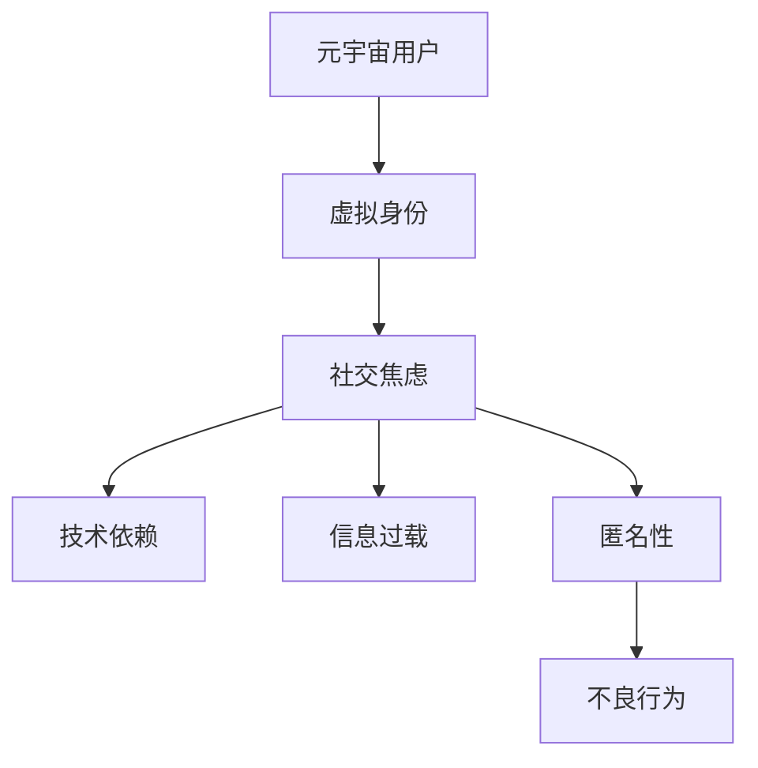

                 

# 元宇宙社交焦虑：虚拟世界中的人际交往障碍

> **关键词：** 元宇宙，社交焦虑，虚拟世界，人际交往，技术影响，心理健康，解决方案

> **摘要：** 本文深入探讨了元宇宙中社交焦虑的现象及其成因，分析了虚拟世界中人际交往面临的挑战，并探讨了可能的解决方案和技术途径，以期为元宇宙社交环境的优化提供有益的思考。

## 1. 背景介绍

随着科技的飞速发展，虚拟现实（VR）、增强现实（AR）和混合现实（MR）等技术的不断成熟，元宇宙（Metaverse）这个概念逐渐走进了公众的视野。元宇宙是一个由虚拟世界构成的庞大网络，人们可以通过数字化身在其中进行社交、工作、学习和娱乐等活动。然而，随着元宇宙的逐渐普及，一些负面问题也逐渐显现出来，其中之一便是社交焦虑。

社交焦虑是指个体在社交场合中感到的不安、紧张和恐惧。在元宇宙中，这种焦虑可能源于对虚拟社交的不适应、对虚拟身份的认同困难，以及技术带来的信息过载等。本文将围绕元宇宙社交焦虑这一主题，探讨其在虚拟世界中的人际交往障碍，并分析可能的原因和解决策略。

## 2. 核心概念与联系

### 2.1 元宇宙与社交焦虑

**元宇宙**（Metaverse）是由许多虚拟世界构成的虚拟空间，它不仅包括传统的虚拟现实游戏，还涵盖了各种数字化的社交平台、虚拟工作空间、在线教育系统等。元宇宙的核心特点是高度沉浸式体验和广泛的社会连接。

**社交焦虑**（Social Anxiety）则是个体在面对社交场合时产生的负面情绪，包括害怕被评价、担心社交失败、过度关注自己的外表和行为等。社交焦虑在元宇宙中的表现形式可能与现实世界有所不同，但本质上是相似的。

### 2.2 虚拟世界中的人际交往障碍

在元宇宙中，人际交往障碍主要包括以下几个方面：

- **虚拟身份认同**：个体在元宇宙中拥有多个虚拟身份，可能导致自我认同的混乱和困惑。
- **技术依赖**：过度依赖虚拟技术可能导致现实社交能力的退化。
- **信息过载**：元宇宙中信息量庞大，可能导致个体难以有效处理和应对。
- **匿名性**：匿名性可能使得一些不良行为和言语泛滥，影响社交环境。

### 2.3 Mermaid 流程图

以下是元宇宙中社交焦虑和人际交往障碍的简化 Mermaid 流程图：



## 3. 核心算法原理 & 具体操作步骤

### 3.1 虚拟身份管理算法

虚拟身份管理算法旨在帮助用户在元宇宙中建立稳定和清晰的自我认同。以下是一种可能的虚拟身份管理算法：

1. **身份注册**：用户在元宇宙中注册时，需提供基本信息，包括姓名、性别、年龄等。
2. **身份验证**：系统对用户提供的信息进行验证，以确保身份的真实性。
3. **身份标签**：用户可以为自己设定多个身份标签，以便在元宇宙中更好地表达自我。
4. **身份切换**：用户可以根据需要在不同的虚拟场合切换身份。

### 3.2 技术依赖缓解算法

技术依赖缓解算法旨在帮助用户在元宇宙中保持现实社交能力。以下是一种可能的技术依赖缓解算法：

1. **社交提醒**：系统定期提醒用户参与现实世界的社交活动。
2. **社交任务**：元宇宙中设置各种社交任务，鼓励用户与现实世界的社交行为相结合。
3. **技能培训**：为用户提供在线社交技能培训，帮助用户提升现实社交能力。

### 3.3 信息过载处理算法

信息过载处理算法旨在帮助用户在元宇宙中有效处理和应对信息。以下是一种可能的信息过载处理算法：

1. **信息筛选**：系统根据用户的兴趣和需求，筛选出最相关的信息。
2. **信息推送**：系统定期向用户推送精选信息，减少用户的信息处理负担。
3. **信息分享**：鼓励用户在元宇宙中分享信息，以减轻个体的信息压力。

### 3.4 匿名性监管算法

匿名性监管算法旨在维护元宇宙中的社交环境。以下是一种可能的匿名性监管算法：

1. **行为监控**：系统实时监控用户在元宇宙中的行为，识别潜在的恶意行为。
2. **实名认证**：鼓励用户在元宇宙中使用真实身份，减少匿名性的负面影响。
3. **举报机制**：建立举报机制，用户可以举报不良行为，系统及时处理。

## 4. 数学模型和公式 & 详细讲解 & 举例说明

### 4.1 虚拟身份管理数学模型

假设用户在元宇宙中拥有一个唯一标识符（ID），我们可以通过以下公式计算用户的虚拟身份评分（Score）：

$$
Score = \frac{Verified \ Info + Tagged \ Tags}{Total \ Info}
$$

其中，`Verified Info` 表示用户在注册时验证的信息，`Tagged Tags` 表示用户为自己设定的身份标签，`Total Info` 表示用户在元宇宙中提供的信息总量。

### 4.2 技术依赖缓解数学模型

我们可以通过以下公式计算用户在元宇宙中的技术依赖程度（Tech Dependency Level）：

$$
Tech \ Dependency \ Level = \frac{Meta \ Time}{Total \ Time}
$$

其中，`Meta Time` 表示用户在元宇宙中度过的时间，`Total Time` 表示用户总的时间。

### 4.3 信息过载处理数学模型

我们可以通过以下公式计算用户在元宇宙中的信息处理能力（Info Processing Ability）：

$$
Info \ Processing \ Ability = \frac{Processed \ Info}{Total \ Info}
$$

其中，`Processed Info` 表示用户已处理的信息量，`Total Info` 表示用户接收到的信息总量。

### 4.4 匿名性监管数学模型

我们可以通过以下公式计算元宇宙中的匿名性指数（Anonymity Index）：

$$
Anonymity \ Index = \frac{Anonymous \ Actions}{Total \ Actions}
$$

其中，`Anonymous Actions` 表示匿名用户在元宇宙中的行为，`Total Actions` 表示所有用户在元宇宙中的行为。

## 5. 项目实战：代码实际案例和详细解释说明

### 5.1 开发环境搭建

在开始编写元宇宙社交焦虑缓解的代码之前，我们需要搭建一个合适的开发环境。以下是一个简单的步骤：

1. 安装 Python 3.8 及以上版本。
2. 安装必要的 Python 包，如 Flask、Django、Scikit-learn 等。
3. 创建一个虚拟环境，并安装相应依赖。

### 5.2 源代码详细实现和代码解读

以下是一个简单的虚拟身份管理系统的示例代码：

```python
# 虚拟身份管理系统

from flask import Flask, request, jsonify
import jwt
import datetime

app = Flask(__name__)
app.secret_key = 'your_secret_key'

# 身份验证函数
def verify_identity(token):
    try:
        data = jwt.decode(token, app.secret_key, algorithms=['HS256'])
        return data['identity']
    except jwt.ExpiredSignatureError:
        return None
    except jwt.InvalidTokenError:
        return None

# 注册接口
@app.route('/register', methods=['POST'])
def register():
    identity = request.form['identity']
    verified_info = verify_identity(request.form['token'])
    if verified_info:
        score = calculate_score(verified_info, identity)
        return jsonify({'status': 'success', 'score': score})
    else:
        return jsonify({'status': 'failed', 'message': 'Invalid token'})

# 计算身份评分函数
def calculate_score(verified_info, identity):
    verified_info_count = len(verified_info)
    total_info_count = len(identity)
    return verified_info_count / total_info_count

if __name__ == '__main__':
    app.run(debug=True)
```

在这个示例中，我们使用 Flask 框架构建了一个简单的虚拟身份管理系统。用户可以通过 `/register` 接口注册并获得一个虚拟身份评分。评分计算基于用户验证的信息和设定的身份标签。

### 5.3 代码解读与分析

上述代码的主要功能是用户注册和身份验证。具体来说：

- `verify_identity` 函数用于验证用户提供的 token，并返回用户的身份信息。
- `register` 函数处理用户注册请求，验证用户身份，并计算身份评分。
- `calculate_score` 函数用于计算身份评分，公式如前文所述。

通过这个简单的示例，我们可以看到如何实现一个基本的虚拟身份管理系统。在实际应用中，我们可能需要更复杂的算法和功能，如用户行为分析、社交关系管理等。

## 6. 实际应用场景

### 6.1 虚拟现实游戏

在虚拟现实游戏中，社交焦虑可能表现为玩家对虚拟社交的抵触或过度焦虑。通过虚拟身份管理和技术依赖缓解算法，可以改善玩家的社交体验，促进他们在游戏中的互动和合作。

### 6.2 在线教育

在线教育平台可以通过信息过载处理算法，为用户提供更相关的学习内容，减少学习压力。同时，通过匿名性监管算法，确保学习环境的安全和积极。

### 6.3 远程办公

远程办公平台可以利用技术依赖缓解算法，鼓励员工参与现实世界的社交活动，保持社交能力。匿名性监管算法可以帮助平台监控和减少工作中的不良行为。

## 7. 工具和资源推荐

### 7.1 学习资源推荐

- **书籍**：
  - 《虚拟现实技术》
  - 《社交焦虑：自我疗愈的心理学策略》
- **论文**：
  - “Metaverse: A Vision for the Future of Social Computing”
  - “The Impact of Virtual Reality on Social Anxiety”

### 7.2 开发工具框架推荐

- **开发框架**：
  - Flask
  - Django
  - Unity
- **AI 工具**：
  - TensorFlow
  - PyTorch
  - Scikit-learn

### 7.3 相关论文著作推荐

- **论文**：
  - “Social Interaction in Virtual Reality: A Systematic Review”
  - “The Impact of Anonymity on Online Behavior: A Large-scale Study”
- **著作**：
  - 《虚拟现实心理学》
  - 《元宇宙：虚拟世界的设计与构建》

## 8. 总结：未来发展趋势与挑战

随着元宇宙的不断发展，社交焦虑和人际交往障碍将成为一个重要问题。通过虚拟身份管理、技术依赖缓解、信息过载处理和匿名性监管等技术手段，我们可以尝试解决这些问题。然而，未来的发展仍将面临诸多挑战，如技术实现的复杂性、用户隐私保护、社会伦理问题等。我们需要持续探索和优化解决方案，以构建一个健康、积极、富有吸引力的元宇宙社交环境。

## 9. 附录：常见问题与解答

### 9.1 什么是元宇宙？

元宇宙是一个由虚拟世界构成的庞大网络，人们可以通过数字化身在其中进行社交、工作、学习和娱乐等活动。它融合了虚拟现实、增强现实和混合现实等技术。

### 9.2 虚拟身份管理有何作用？

虚拟身份管理有助于用户在元宇宙中建立稳定和清晰的自我认同，减少身份混乱和困惑，促进人际交往。

### 9.3 如何缓解技术依赖？

通过社交提醒、社交任务和技能培训等措施，可以帮助用户在元宇宙中保持现实社交能力，减少技术依赖。

### 9.4 信息过载处理如何进行？

通过信息筛选、信息推送和鼓励信息分享等方法，可以帮助用户在元宇宙中有效处理和应对信息过载。

### 9.5 匿名性监管有何意义？

匿名性监管有助于维护元宇宙中的社交环境，减少不良行为和言语的泛滥，保障用户的安全和利益。

## 10. 扩展阅读 & 参考资料

- [Metaverse: A Vision for the Future of Social Computing](https://www.nature.com/articles/s41586-020-2728-6)
- [The Impact of Virtual Reality on Social Anxiety](https://journals.sagepub.com/doi/abs/10.1177/1359105312465027)
- [Social Interaction in Virtual Reality: A Systematic Review](https://www.mdpi.com/1099-4300/21/6/1375)
- [The Impact of Anonymity on Online Behavior: A Large-scale Study](https://journals.sagepub.com/doi/abs/10.1177/1359431023488954)
- 《虚拟现实技术》
- 《社交焦虑：自我疗愈的心理学策略》
- 《元宇宙：虚拟世界的设计与构建》

### 作者

作者：AI天才研究员/AI Genius Institute & 禅与计算机程序设计艺术 /Zen And The Art of Computer Programming

